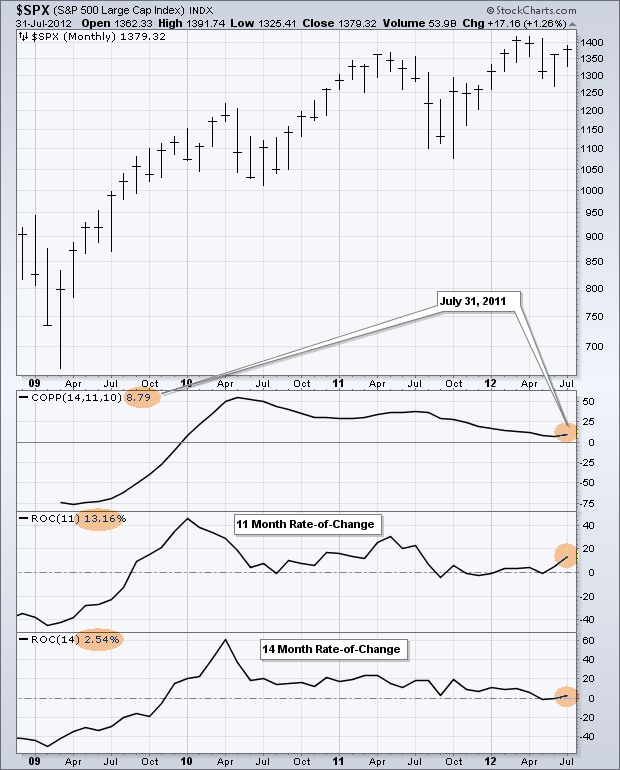
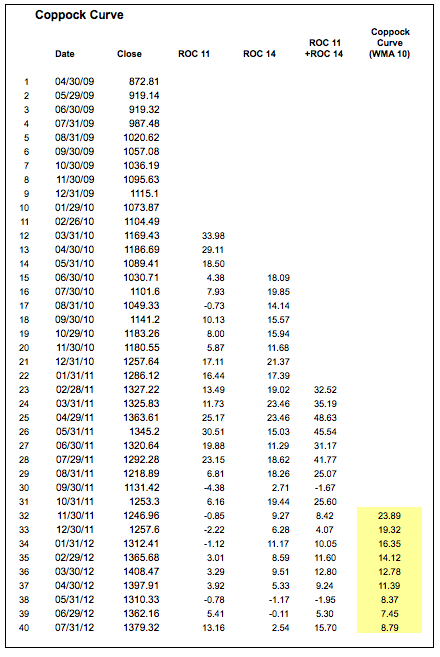
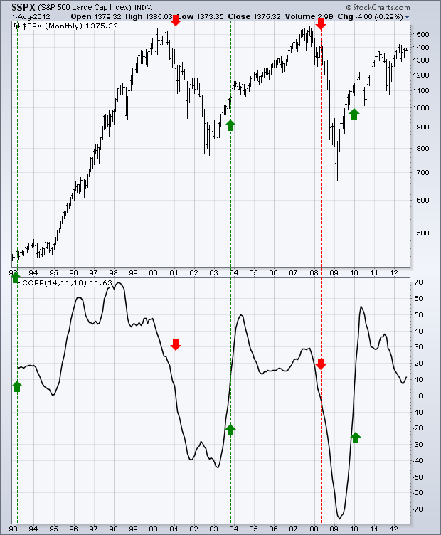
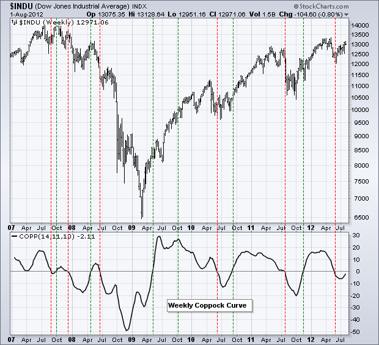
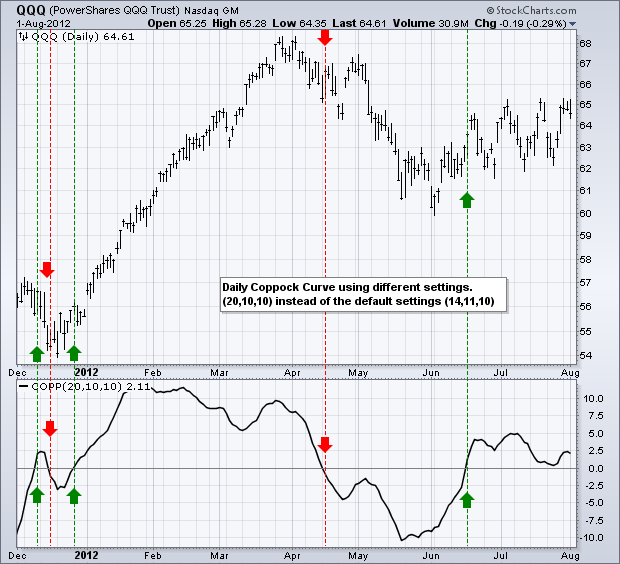
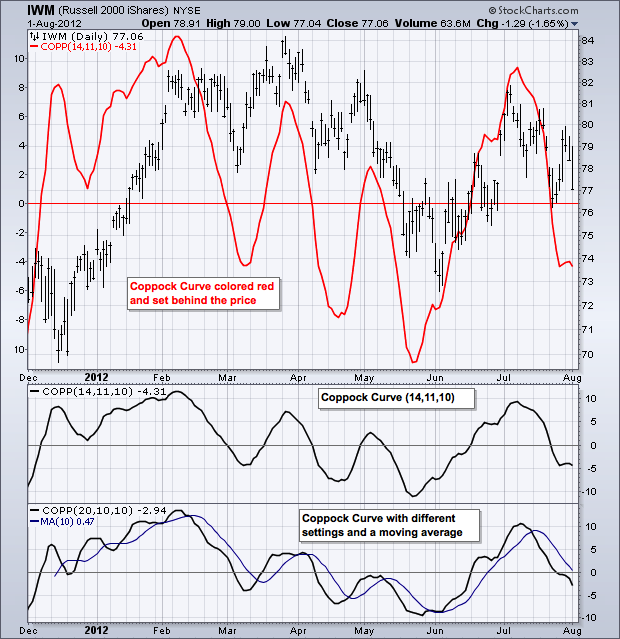
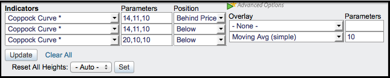

# 科波克曲线 

### 目录

+   科波克曲线

    +   介绍

    +   SharpCharts 计算

    +   信号

    +   灵活性

    +   结论

    +   与 SharpCharts 一起使用

    +   建议扫描

        +   科波克曲线上穿零线

        +   科波克曲线下穿零线

    +   进一步研究

## 介绍

科波克曲线是由埃德温“塞奇”科波克开发的动量指标，他是一位经济学家。科波克在 1965 年 10 月的《巴伦周刊》中介绍了这一指标。该指标的目标是识别标普 500 和道琼斯工业指数的长期买入机会。信号非常简单。科波克使用月度数据来识别当指标从负值区域移动到正值区域时的买入机会。尽管科波克没有将其用于卖出信号，但许多技术分析师认为从正值区域到负值区域的交叉是一个卖出信号。

## SharpCharts 计算

```py
Coppock Curve = 10-period WMA of 14-period RoC + 11-perod RoC

WMA = Weighted moving average
RoC = Rate-of-Change
```

变动率指标是一个动量振荡器，它在零线上下振荡。科波克使用了 11 和 14 个周期，因为据一个圣公会牧师说，这是悼念所爱之人丧失的平均哀悼期。科波克推测，股市损失的恢复期将类似于这个时间段。



然后，变动率指标通过加权移动平均进行平滑处理。顾名思义，加权移动平均对最新数据赋予更高的权重，对较旧的数据赋予较低的权重。例如，3 期加权移动平均会将第一个数据点乘以 1，第二个数据点乘以 2，第三个数据点乘以 3。然后，这三个数字的总和除以 6，即权重之和（1 + 2 + 3），以创建加权平均值。下表显示了从 Excel 电子表格中的计算。



点击此处下载此电子表格示例。")

## 信号

使用月度数据，这个指标不会触发很多信号。买入信号在穿越进入正区域时触发，而卖出信号在穿越进入负区域时触发。毫不奇怪，自上世纪 80 年代末以来只有五次信号。下图显示了最近的四个信号。第一个信号在 1988 年触发，那是在 1987 年的崩盘之后。



遵循这两个卖出信号的技术分析师将避开最后两次熊市。2001 年 2 月的卖出信号将避开 2000 年至 2002 年的大部分熊市。2008 年 6 月的卖出信号将使投资者在 2008 年下半年市场暴跌之前退出。这些卖出信号可以简单用于退出股市并转入现金，从而降低市场风险和整体风险。

## 灵活性

如上所述，科波克曲线只是一个平滑的动量振荡器。变动率指标衡量动量，加权移动平均平滑数据。这意味着该指标可以用于任何时间框架。分钟图、日图和周图可以用于适应个人的交易/投资风格和时间跨度。下图显示了在道琼斯工业指数上使用周度数据的科波克曲线。如预期的那样，周图产生了比月度图更多的信号。



除了不同的时间框架，参数可以调整以使指标更快或更慢。较短的变动率设置将使科波克曲线更敏感和更快，而较长的设置将使其更不敏感和更慢。下图显示了纳斯达克 100 ETF（QQQ）和科波克曲线（20,10,10）的日线图。这种设置使科波克曲线稍微不那么敏感，可能更适合日线图。



## 结论

科波克曲线只是一个平滑的动量振荡器。尽管最初设计用于月度图表和长期分析，但它可以用于分钟图、日图或周图，并且可以调整设置以适应个人的风格。主要信号是在零线上方和下方的交叉点生成的。更激进的技术分析师可以考虑寻找看涨和看跌的背离来预测这种交叉。但要小心。背离并不总是导致趋势反转，因为趋势可能只是减缓并继续朝着同一方向发展。

## 使用 SharpCharts

科波克曲线可以在图表下方的指标部分找到。用户可以通过更改参数框中的数字来调整设置。然后可以将指标定位在“价格后面”，“主窗口上方”或“主窗口下方”。在将其放在价格后面时更改颜色会有所帮助。图表分析师还可以使用“高级”选项添加移动平均线。这个移动平均线类似于信号线，类似于 MACD。

 

## 建议的扫描

### 科波克曲线上穿零线

这个简单的扫描搜索股票，其中科波克曲线从负区域穿越到正区域，每日成交量高于成交量的 50 日移动平均线。换句话说，牛市交叉发生时成交量在扩大。

```py
[type = stock] AND [country = US] 
AND [Daily SMA(20,Daily Volume) > 100000] 
AND [Daily SMA(60,Daily Close) > 20] 

AND [Daily Coppock(20,10,10) crosses 0] 
AND [Daily Volume > Daily SMA(50,Daily Volume)]
```

### 科波克曲线下穿零线

这个简单的扫描搜索股票，其中科波克曲线从正区域穿越到负区域，每日成交量高于成交量的 50 日移动平均线。换句话说，熊市交叉发生时成交量在扩大。

```py
[type = stock] AND [country = US] 
AND [Daily SMA(20,Daily Volume) > 100000] 
AND [Daily SMA(60,Daily Close) > 20] 

AND [0 crosses Daily Coppock(20,10,10)] 
AND [Daily Volume > Daily SMA(50,Daily Volume)]
```

有关科波克曲线扫描的语法详细信息，请参阅我们支持中心的[扫描指标参考](http://stockcharts.com/docs/doku.php?id=scans:indicators#coppock_curve_coppock "http://stockcharts.com/docs/doku.php?id=scans:indicators#coppock_curve_coppock")。

## 进一步研究

《金融市场技术分析》有一章专门讨论动量振荡器及其各种用途。墨菲涵盖了涨跌幅特定的优缺点以及一些例子。普林的书展示了通过涵盖背离、交叉和其他信号来介绍动量指标的基础知识。还有两章涵盖特定动量指标并提供大量示例。

| **金融市场技术分析** 约翰·J·墨菲 | **马丁·普林解释的技术分析** 马丁·普林 |
| --- | --- |
|  |  |
|  |  |
