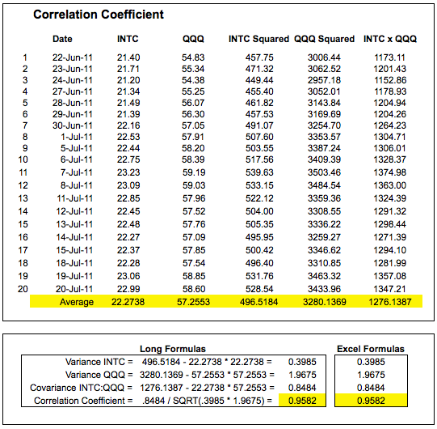
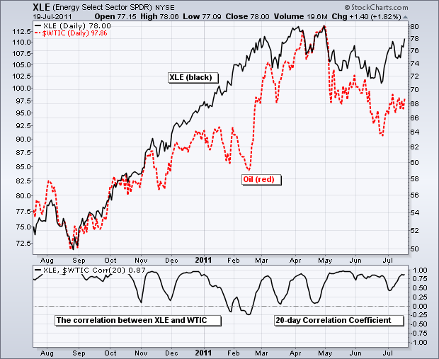
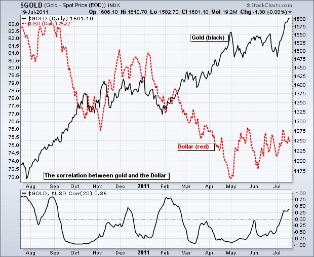
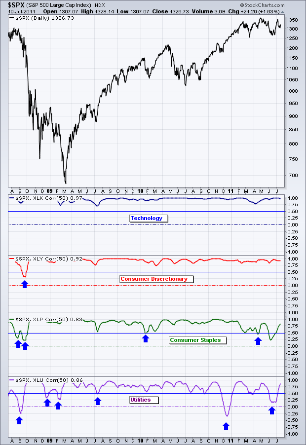
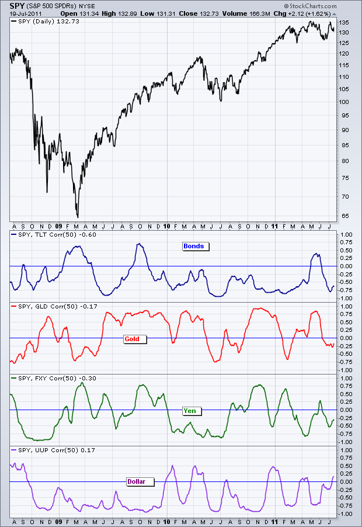
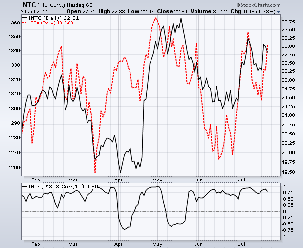
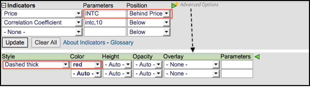

# 相关系数 [ChartSchool]

### 目录

+   相关系数

    +   介绍

    +   计算

    +   解释

    +   多样化

    +   结论

    +   与 SharpCharts 一起使用

## 介绍

相关系数是反映两个证券之间相关性的统计量。换句话说，这个统计量告诉我们一个证券与另一个证券之间的关系有多密切。当两个证券向同一方向移动时，相关系数为正，无论是上涨还是下跌。当两个证券朝相反方向移动时，相关系数为负。确定两个证券之间的关系对于分析市场间关系、部门/股票关系和部门/市场关系非常有用。这个指标还可以帮助投资者通过识别与股市相关性低或负相关的证券来实现多样化。

## 计算

相关系数的计算相当复杂，所以可以跳过这一部分。我们只会简单看一些基本内容，以了解其中的方法。这个指标正是经典统计学的核心。第一步是选择两个证券。在这个例子中，我们将使用英特尔（INTC）和纳斯达克 100ETF（QQQ）。换句话说，我们想要看到英特尔和 QQQ 之间的相关程度。下面的 Excel 表格展示了基础工作。

+   INTC 列显示了英特尔在 20 天内的价格，底部显示了平均值。

+   QQQ 列显示了 QQQ 的情况。

+   接下来的两列显示了每个期间的价格平方，底部显示了平均值。

+   最后几列显示了每个期间的 INTC 乘以 QQQ，底部显示了平均值。

利用底部行，我们现在可以计算方差、协方差和相关系数。Excel 公式显示在长公式旁边。结果显示，在 6 月 22 日至 7 月 20 日的 20 天期间，英特尔与纳斯达克 100ETF 表现出强烈的正相关性（+.95）。

这里有一个展示相关系数的 Excel 电子表格")。由于四舍五入问题，一些数字可能略有不同。

## 解释

相关系数在-1 和+1 之间波动。尽管它不是动量振荡器，但它会从正相关的时期转向负相关的时期。+1 被认为是完美的正相关，这是罕见的。0 到+1 之间的任何值表示两个证券朝着相同的方向移动。正相关的程度随时间可能会有所变化。石油股票和石油大部分时间都呈正相关。下面的例子显示了能源 SPDR（XLE）与现货轻质原油（$WTIC）之间的关系。毫不奇怪，20 天的相关系数大部分时间保持正值，经常超过+0.75。这两个证券之间显然存在着积极的关系。一般来说，任何大于 0.50 的值都显示出强烈的正相关。

在另一端，-1 被认为是完美的负相关，这也是罕见的。0 到-1 之间的任何值表示两个证券朝着相反的方向移动。负相关的程度随时间可能会有所变化。黄金和美元是我想到的第一对负相关的证券。下面的图表显示了现货黄金（$GOLD）与美元指数（$USD）之间的关系。尽管相关系数在正值区域停留了一段时间，但大部分时间都是负值。一般来说，任何小于-0.50 的值都显示出强烈的负相关。

## 多样化

相关系数可用于识别不相关的证券，这在构建多样化投资组合中非常重要。毫不奇怪，标普九大部门与标普 500 指数大多呈正相关。然而，有些部门的正相关性比其他部门更强。例如，在过去三年中，科技 ETF（XLK）和消费者自由支出 SPDR（XLY）与标普 500 指数有着强烈的正相关性。以下相关系数基于 50 天。消费者自由支出部门在过去三年中只有一次低于 0.50。科技部门从未低于 0.50，因为科技仍然与市场强相关。相比之下，消费品部门的相关系数在过去几次低于 0.50，而公用事业部门的相关系数甚至两次低于零。这一指标表明，消费品和公用事业部门与标普 500 指数的相关性低于消费者自由支出和科技部门。

为了真正实现股票的多样化，通常需要看向股票市场之外。下图显示了四个 ETF 与股票市场（SPY）有许多负相关期的情况。请注意相关系数多次低于零。在此示例中，我还使用了 50 天相关系数。20+年期债券 ETF（TLT）代表债券，大部分时间与股票呈负相关。黄金（红色）在正负相关期间变动。总体而言，过去三年来，它更多地呈正相关而不是负相关。日元信托（绿色）似乎在正负相关期间分别占据时间。令人惊讶的是，美元基金（UUP）显示出与股票市场负相关的倾向。

## 结论

相关系数告诉我们两个证券之间的关系。在给定的时间段内，当相关系数为正时，两个证券一起移动。相反，当相关系数为负时，两个证券移动方向相反。上面的示例显示了 20 天和 50 天的相关系数。长期投资者可能使用 150 甚至 250 天（一年）以获得反映长期关系的更平滑线条。

## 使用 SharpCharts

相关系数在 SharpCharts 中的“指标”下可见。首先，在图表顶部的符号框中输入基础证券创建图表（INTC）。其次，在下拉菜单中选择相关系数作为指标。第三，输入另一证券的符号和时间范围在参数框中（$SPX,20）。这两者用逗号分隔。下面的示例显示了英特尔在主窗口中，带有 10 天相关系数的指标窗口。这显示了英特尔与标普 500 的相关性。另外，请注意标普 500 价格图（红色虚线）放在英特尔价格图后面以进行比较。[点击这里](http://stockcharts.com/h-sc/ui?s=$SPX&p=D&yr=0&mn=6&dy=0&id=p61512839073&listNum=30&a=239762181 "http://stockcharts.com/h-sc/ui?s=$SPX&p=D&yr=0&mn=6&dy=0&id=p61512839073&listNum=30&a=239762181") 查看带有相关系数的实时图表。

