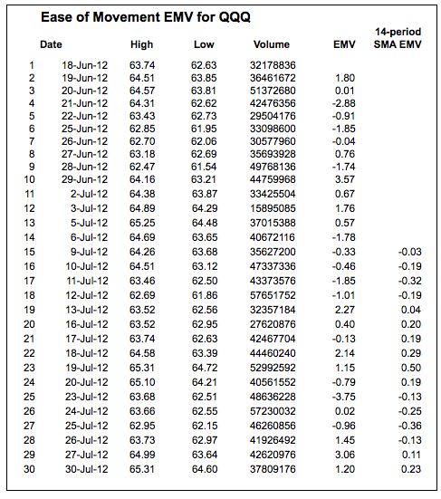
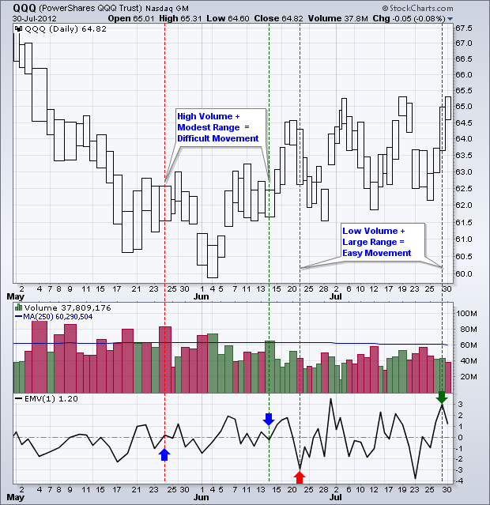
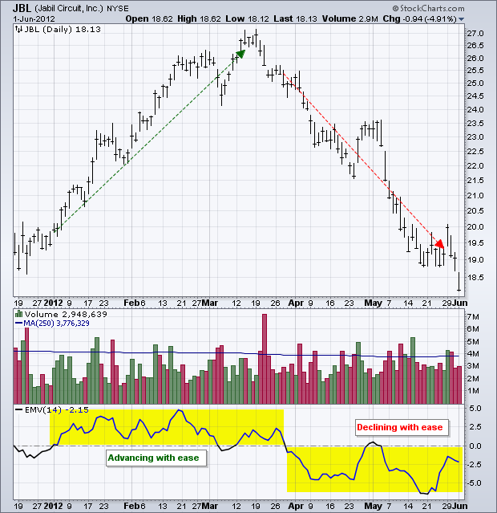
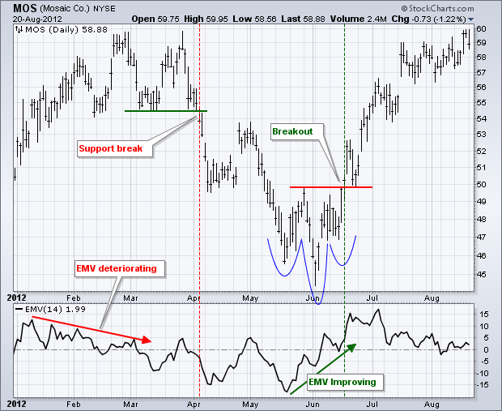
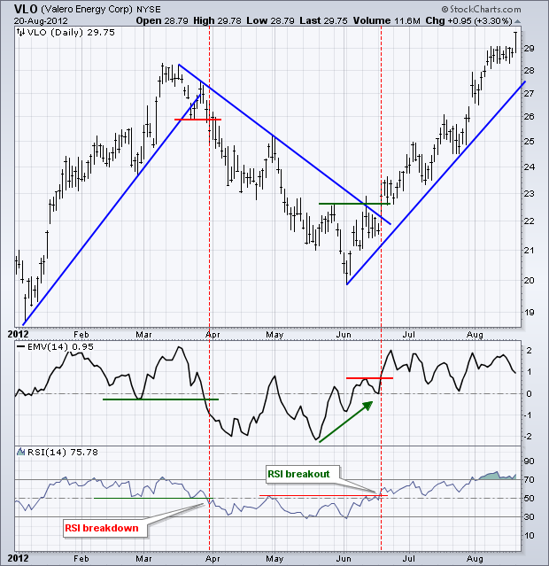
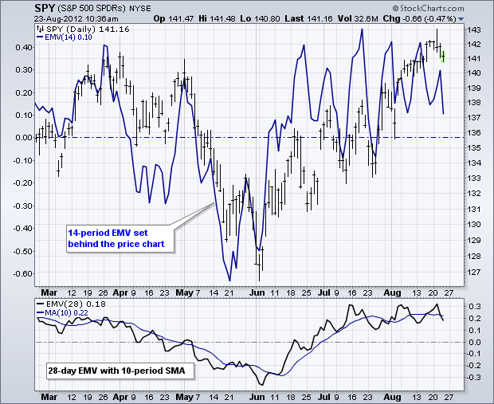
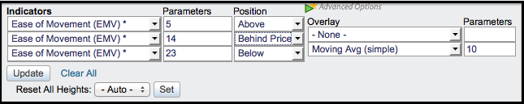

# 价格运动便利性 [ChartSchool]

### 目录

+   [价格运动便利性](#ease_of_movement)

    +   [介绍](#introduction)

    +   [SharpCharts 计算](#sharpcharts_calculation)

    +   [解释](#interpretation)

    +   [确认其他信号](#confirming_other_signals)

    +   [结论](#conclusions)

    +   [与 SharpCharts 一起使用](#using_with_sharpcharts)

    +   [建议扫描](#suggested_scans)

        +   [EMV 上穿零线](#emv_crosses_above_zero)

        +   [EMV 下穿零线](#emv_crosses_below_zero)

    +   [进一步研究](#further_study)

## 介绍

由理查德·阿姆斯开发，Ease of Movement（EMV）是一个基于成交量的振荡器，波动在零线上下。顾名思义，它旨在衡量价格运动的“便利性”。阿姆斯创建了 [等量图](/school/doku.php?id=chart_school:chart_analysis:equivolume "chart_school:chart_analysis:equivolume") 来直观显示价格范围和成交量。 Ease of Movement 将等量图提升到下一个水平，通过量化价格/成交量关系，并将结果显示为振荡器。一般来说，当振荡器处于正区域时，价格相对容易上涨。相反，当振荡器处于负区域时，价格相对容易下跌。

## SharpCharts 计算

EMV 公式有三部分：移动距离、成交量和高低范围。首先，移动距离是通过比较当前周期的中点与前一周期的中点（即高加低除以二）来计算的。当当前中点高于前一中点时，移动距离为正，当当前中点低于前一中点时，移动距离为负。移动距离在下面的公式中显示为分子。

```py
Distance Moved = ((H + L)/2 - (Prior H + Prior L)/2) 

Box Ratio = ((V/100,000,000)/(H - L))

1-Period EMV = ((H + L)/2 - (Prior H + Prior L)/2) / ((V/100,000,000)/(H - L))

14-Period Ease of Movement = 14-Period simple moving average of 1-period EMV

```

另外两部分构成了盒子比率，它使用了成交量和高低范围。等量图表也是基于成交量和高低范围。盒子比率是 EMV 的分母。请注意，成交量除以 100,000,000 以保持与其他数字的相关性。

相对较低的成交量和相对较大的高低范围将产生较小的分母（盒子比率），这意味着由于除以较小的数字，EMV 值将更大。如果 V/10000000 等于 2，高低范围等于 4，则盒子比率将为 0.50。低成交量的广泛范围意味着价格变动相对容易。换句话说，价格变动不需要太多成交量。

相对较小的高低范围和高成交量将产生较大的分母，这意味着 EMV 值将较小。如果 V/10000000 等于 4，高低范围等于 2，则分母为 2。这意味着价格变动困难，因为在大成交量下高低范围相对较小。



[点击这里下载这个电子表格示例。](/school/lib/exe/fetch.php?media=chart_school:technical_indicators_and_overlays:ease_of_movement:cs-easeofmovement.xls "chart_school:technical_indicators_and_overlays:ease_of_movement:cs-easeofmovement.xls (33.5 KB)")

## 解释

下面的示例显示了纳斯达克100 ETF（QQQ）的 1 期 EMV 在下方指标窗口中。我使用等量柱，因为这些只显示给定期间的高低范围。蓝色箭头显示了两个小的 EMV 值。一个略微为正，另一个略微为负。这两天的成交量都高于平均水平，但高低范围适中甚至较小。这意味着尽管成交量相对较高，但价格难以上涨。



红色箭头显示了一个接近-3的EMV值，这是非常负面的。这是因为成交量低，而高低范围很大。这意味着价格相对轻松下跌，几乎没有买盘或没有买盘压力。绿色箭头显示了一个接近+3的EMV值。同样，成交量低，而高低范围很大。这意味着价格相对轻松上涨，几乎没有卖盘或没有卖盘压力。下面的图表显示了贾比尔电路（JBL）的14期 Ease of Movement 指标。这只是每个周期 EMV 值的 14 期简单[移动平均线](/school/doku.php?id=chart_school:technical_indicators:moving_averages "chart_school:technical_indicators:moving_averages")。



## 确认其他信号

Ease of Movement 最适合用来确认其他指标或图表分析。换句话说，它不是一个独立的指标。请记住，公式中的“移动距离”部分是正面/负面的驱动因素。当中点上升时，EMV通常为正值，当中点下降时，EMV通常为负值。这意味着EMV通常会随着基础证券价格的上涨和下跌而上升和下降。这种上升或下降的幅度取决于箱体比率。图表技术分析师可以使用EMV来确认价格图表上的突破或看涨指标信号。相反，进入负值区域可以用来确认价格图表上的突破或看跌指标信号。



上面的示例显示了Mosaic（MOS）在四月初出现熊市突破和六月中旬的牛市突破。在熊市突破之前，EMV在两个月内恶化，并在三月份跌入负值区域。随着股票在一月至二月上涨，而EMV下降，上涨变得更加困难。MOS在四月初下跌并且EMV再次跌入负值区域时，突破支撑位。在四月和五月大部分时间为负值后，EMV从五月底到六月初改善，并进入正值区域。股票还形成了一个小的反向头肩形态，并突破了50的阻力位。



第二个示例展示了Valero Energy（VLO）的EMV信号，由RSI和价格图表确认。从一月到三月中旬，VLO上涨，然后在三月底扭转并突破支撑位。请注意，EMV在二月底突破了其低点，并在三月底深入负值区域。另外，请注意，RSI跌至自一月初以来的最低水平。第二次逆转发生在VLO于七月中旬突破阻力位时。EMV在此突破前开始改善，并在突破时处于坚定的正值状态。[RSI](/school/doku.php?id=chart_school:technical_indicators:relative_strength_index_rsi "chart_school:technical_indicators:relative_strength_index_rsi")也通过突破其四月高点和超过55的移动来确认。

## 结论

Ease of Movement（EMV）将价格方向与成交量结合起来，创建了一个基于成交量的动量振荡器。由于它与价格变动密切相关，EMV往往会紧密跟踪基础证券的价格。在大多数情况下，EMV用于确认从价格图表或其他指标得出的信号。寻找更平滑的EMV线的图表分析师可以延长回溯期。

## 使用SharpCharts

Ease of Movement（EMV）可以在图表下的“指标”部分找到。用户可以通过更改“参数”框中的数字来调整设置。指标可以放置在“价格后面”、“主窗口上方”或“主窗口下方”。在将其放置在价格后面时，更改颜色会有所帮助。图表分析师还可以使用“高级”指标选项添加移动平均线。





## 建议的扫描

### EMV突破零线

这个简单的扫描搜索股票，其中EMV从负值区域突破到正值区域。

```py
[type = stock] AND [country = US] 
AND [Daily SMA(20,Daily Volume) > 100000] 
AND [Daily SMA(60,Daily Close) > 20] 

AND [Daily EMV(14) crosses 0] 
```

### EMV跌破零线

这个简单的扫描搜索股票，其中EMV从正值区域突破到负值区域。

```py
[type = stock] AND [country = US] 
AND [Daily SMA(20,Daily Volume) > 100000] 
AND [Daily SMA(60,Daily Close) > 20] 

AND [0 crosses Daily EMV(14)] 
```

欲了解有关轻松移动扫描的语法详情，请参阅我们的[扫描指标参考](http://stockcharts.com/docs/doku.php?id=scans:indicators#ease_of_movement_emv "http://stockcharts.com/docs/doku.php?id=scans:indicators#ease_of_movement_emv")。

## 进一步研究

| **成交量利润** 理查德·W·阿姆斯 小学教授 |
| --- |
| [](http://store.stockcharts.com/products/profits-in-volume "http://store.stockcharts.com/products/profits-in-volume") |
| [](http://store.stockcharts.com/products/profits-in-volume "http://store.stockcharts.com/products/profits-in-volume") |

网站：理查德·W·阿姆斯 小学教授拥有一个网站，提供更多关于EquiVolume的信息，包括可下载的电子书：[与EquiVolume交易](http://www.armsinsider.com/pdf/index.asp "http://www.armsinsider.com/pdf/index.asp")。
