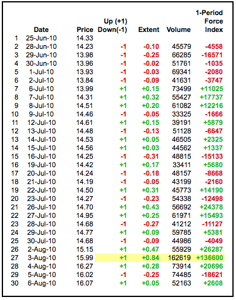
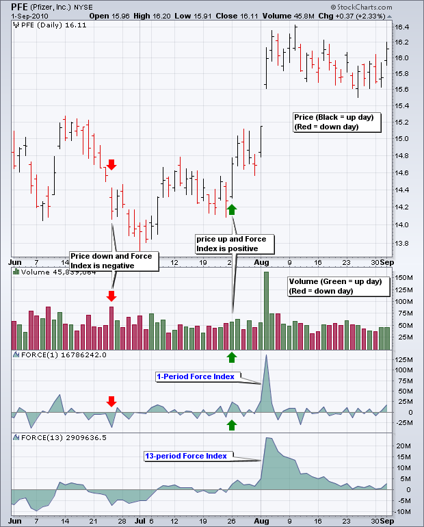
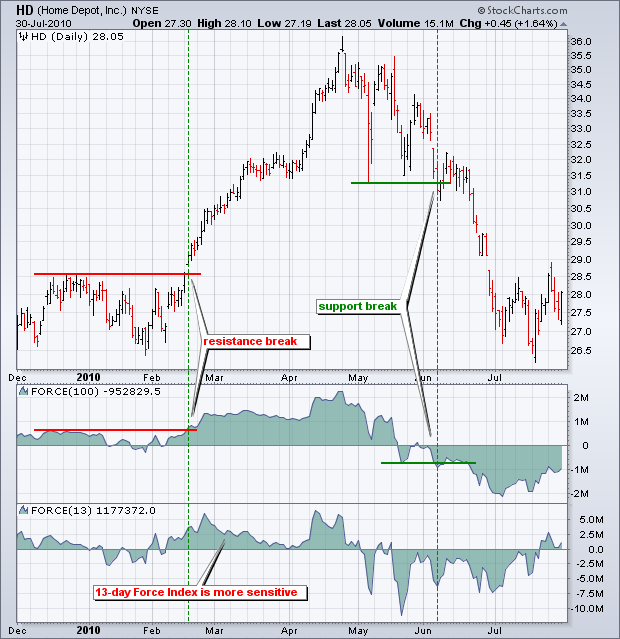
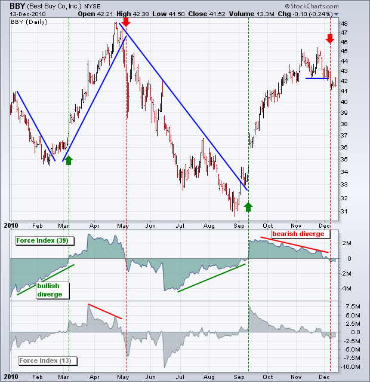
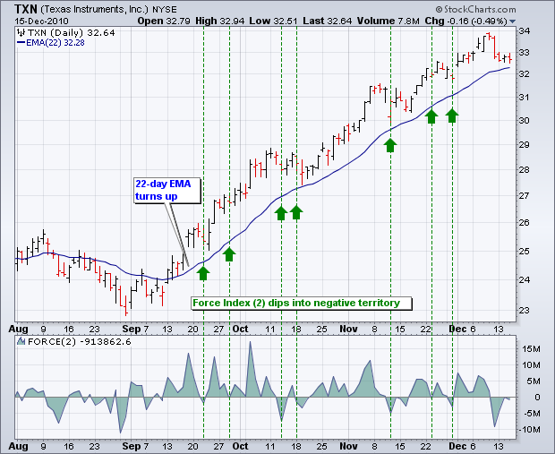
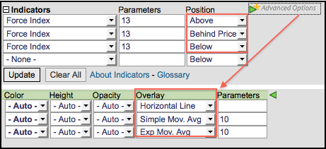

# 力量指数

### 目录

+   力量指数

    +   介绍

    +   计算

    +   解释

    +   趋势识别

    +   背离

    +   识别修正

    +   结论

    +   使用 SharpCharts

    +   建议扫描

        +   上涨趋势中的超卖

        +   下跌趋势中的超买

    +   进一步研究

## 介绍

力量指数是一种利用价格和成交量评估动力或确定可能转折点的指标。由亚历山大·埃尔德（Alexander Elder）开发，力量指数首次出现在他的经典著作*[《交易为生计》](http://store.stockcharts.com/products/the-new-trading-for-a-living "http://store.stockcharts.com/products/the-new-trading-for-a-living")*中。根据埃尔德的说法，股价运动有三个基本要素：方向、幅度和成交量。力量指数将这三者结合为一个振荡器，随着力量平衡的转移在正负区域波动。力量指数可用于加强总体趋势，识别可玩的修正或通过背离预示反转。

## 计算

```py
Force Index(1) = {Close (current period)  -  Close (prior period)} x Volume
Force Index(13) = 13-period EMA of Force Index(1)

```

1 期力量指数的计算很简单。只需将前一收盘价减去当前收盘价，然后乘以成交量。超过一天的力量指数只是过去 13 个周期的 1 期力量指数的指数移动平均值。例如，13 期力量指数是过去 13 个周期的 1 期力量指数值的 13 期指数移动平均值。

三个因素影响力量指数的数值。首先，当当前收盘价高于前一收盘价时，力量指数为正值。当当前收盘价低于前一收盘价时，力量指数为负值。其次，移动的幅度决定了成交量的乘数。较大的移动需要较大的乘数，从而相应地影响力量指数。较小的移动产生较小的乘数，降低了影响力。第三，成交量起着关键作用。大幅度的移动伴随大量成交产生高的力量指数数值。小幅度的移动伴随低成交量产生相对较低的力量指数数值。下表显示了辉瑞（PFE）的力量指数计算。第 27 行标记了最大的移动（+84 美分）和最大的成交量（162,619）。这种组合在表中产生了最大的力量指数值（136,600）。



上图展示了力量指数的运作方式。请注意，1 周期力量指数在零线上下波动，看起来相当锯齿状。Elder 建议使用 13 周期 EMA 平滑该指标，以减少正负交叉。图表分析师应该尝试不同的平滑周期，以确定最适合其分析需求的方法。



## 解读

如上所述，力量指数有三个元素。首先，有正面或负面的价格变动。正面的价格变动表示买方比卖方更强势，而负面的价格变动表示卖方比买方更强势。其次，有价格变动的幅度，即当前收盘价减去前一收盘价。"幅度"向我们展示了价格移动的距离。大幅上涨显示了强劲的买盘压力，而大幅下跌显示了强劲的卖盘压力。第三个也是最后一个元素是成交量，根据 Elder 的说法，成交量衡量了参与度。买方和卖方有多么投入？大幅上涨伴随着大量成交显示了买方的强烈投入。同样，大幅下跌伴随着大量成交显示了卖方的强烈投入。力量指数将这三个元素量化为一个指标，衡量买卖双方的压力。

## 趋势识别

力量指数可用于加强或确定趋势。所讨论的趋势，无论是短期、中期还是长期，都取决于力量指数的参数。虽然默认的力量指数参数为 13，但图表分析师可以使用更高的数字进行更平滑或更低的数字进行更少平滑。下图显示了家得宝（Home Depot）的 100 天力量指数和 13 天力量指数。请注意，13 天力量指数更加波动和锯齿状。100 天力量指数更加平滑，且穿过零线的次数较少。在这方面，100 天力量指数可用于确定中期或长期趋势。请注意，价格图表上的阻力突破与 100 天力量指数上的阻力突破相对应。100 天力量指数在 2 月中旬进入正区间并突破了阻力。该指标在整个上升趋势期间保持为正，并在 5 月中旬转为负。价格图表上 6 月初的支撑突破得到了力量指数上的支撑突破的确认。



## 背离

牛市和熊市背离可以提醒图表分析师潜在的趋势变化。背离是与振荡器相关的经典信号。当指标上升而证券下跌时，形成牛市背离。指标未确认价格的弱势，这可能预示着牛市趋势反转。当指标下跌而证券上涨时，形成熊市背离。尽管证券上涨，但指标下跌显示了潜在的弱势。这种差异可能预示着熊市趋势反转。

确认是牛市和熊市背离的重要部分。尽管背离信号表明有些不对劲，但需要指标或价格图表的确认。力量指数进入正区域或价格图表上的阻力突破可以确认牛市背离。力量指数进入负区域或价格图表上的支撑突破可以确认熊市背离。图表分析师还可以使用蜡烛图、移动平均线交叉、图案突破和其他形式的技术分析进行确认。



上图显示了百思买（BBY）的力量指数（39）呈现一系列背离。绿色线显示牛市背离，而红色线显示熊市背离。当力量指数（39）穿过正区域（绿色虚线）时，确认牛市背离。当力量指数（39）穿过负区域（红色虚线）时，确认熊市背离。图表分析师还可以使用价格图表上的趋势线突破进行确认。

该图显示了力量指数的两个版本。力量指数（13）捕捉短期波动，更为敏感。力量指数（39）捕捉中期波动，更为平滑。39 天的力量指数产生较少的零线交叉，这些交叉持续时间更长。对于这些设置没有对错答案。这取决于交易目标、时间跨度和分析风格。

## 识别更正

力量指数可以与趋势跟踪指标结合使用，以识别该趋势内的短期修正。从超买水平回撤代表上升趋势内的短期修正。超卖反弹代表下降趋势内的短期修正。是的，修正可以向上或向下，这取决于更大趋势的方向。亚历山大·埃尔德建议使用 22 天 EMA 进行趋势识别，使用 2 天力量指数来识别修正。当 22 天 EMA 上升时，趋势是向上的，这意味着 2 天力量指数将用于识别买入的短期回撤。当 22 天 EMA 下降时，趋势是向下的，这意味着 2 天力量指数将用于识别卖出的短期反弹。这是一种适合积极交易者的激进策略。时间框架可以通过使用更长的移动平均线和力量指数的时间框架进行调整。例如，中期交易者可以尝试使用 100 天 EMA 和 10 天力量指数。

关于修正操作有两种思路。交易者可以在修正明显时立即行动，或者在有证据表明修正已结束时行动。让我们看一个使用 22 天 EMA 和 2 天力量指数的例子。请记住，这是设计用来识别更大趋势内非常短暂修正的。下面的图表显示了德州仪器（TXN）的 22 天 EMA 在 9 月中旬开始上升。



随着 22 天 EMA 上升，交易者在 2 天力量指数转为负数时寻找非常短期的回撤。交易者可以在力量指数转为负数时行动，或者等待其回到正数区域。在负数时行动可能会提高回报风险比，但修正可能会延长几天。等待力量指数再次转为正数显示出一些可能表明修正已结束的强势。绿色虚线显示了 2 天力量指数转为负数时的情况。

## 结论

力度指数同时使用价格和成交量来衡量买卖压力。价格部分涵盖趋势，而成交量部分确定强度。在最基本的情况下，技术分析师可以使用长期力度指数来确认基本趋势。当 100 天力度指数为正时，多头占优势。当 100 天力度指数为负时，空头占优势。有了这些信息，交易者可以寻找与更大趋势一致的短期设置，例如在更大的上升趋势中的多头设置或在更大的下降趋势中的空头设置。与所有指标一样，交易者应该将力度指数与其他指标和分析技术结合使用。

## 与 SharpCharts 一起使用

力度指数可作为 SharpCharts 的指标。一旦选择，用户可以将指标放置在基础价格图表的上方、下方或后方。将力度指数直接放在价格图表的顶部，可以突出相对于基础证券价格走势的波动。这可以更容易地识别多头和空头背离。技术分析师可以点击“高级选项”添加移动平均线、水平线或另一个指标到力度指数上。




## 建议的扫描

### 在上升趋势中被过度推销

此扫描搜索力度指数（100）处于正值区域且商品通道指数（20）处于超卖状态的股票。正值的力度指数确立了总体上升趋势。超卖的 CCI 标识了该上升趋势中的回调。此扫描仅作为一个起点。建议进一步审查和调整。

```py
[type = stock] AND [country = US] 
AND [Daily SMA(20,Daily Volume) > 100000] 
AND [Daily SMA(60,Daily Close) > 20] 

AND [Daily FORCE(100) > 0] 
AND [Daily CCI(20) < -100]
```

### 在下降趋势中被过度买入

此扫描搜索力度指数（100）处于负值区域且商品通道指数（20）处于超买状态的股票。负值的力度指数确立了总体下跌趋势。超买的 CCI 标识了该下跌趋势中的修正反弹。此扫描仅作为一个起点。建议进一步审查和调整。

```py
[type = stock] AND [country = US] 
AND [Daily SMA(20,Daily Volume) > 100000] 
AND [Daily SMA(60,Daily Close) > 20] 

AND [Daily FORCE(100) < 0] 
AND [Daily CCI(20) > 100]
```

有关力度指数扫描的语法详细信息，请参阅我们支持中心的[扫描指标参考](http://stockcharts.com/docs/doku.php?id=scans:indicators#force_index_force "http://stockcharts.com/docs/doku.php?id=scans:indicators#force_index_force")。

## 进一步研究

*走进我的交易室* 涵盖了从 A 到 Z 的交易内容。除了技术分析和交易系统外，读者还将学习交易心理学、风险控制、资金管理和记录保持。

| **走进我的交易室** 亚历山大·埃尔德 |
| --- |
|  |
|  |
