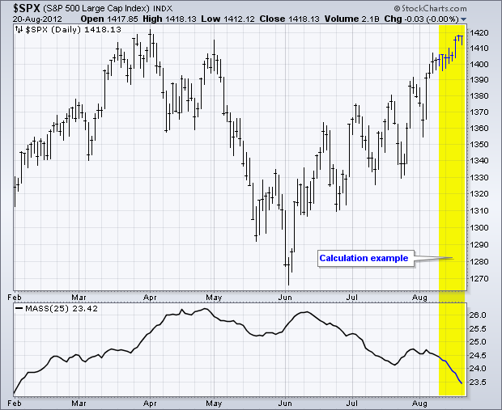
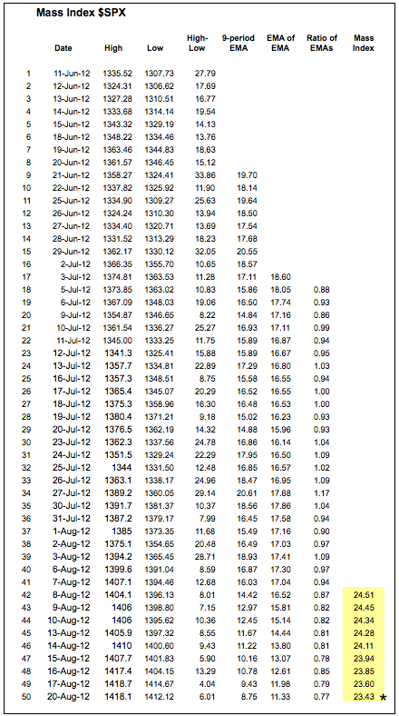
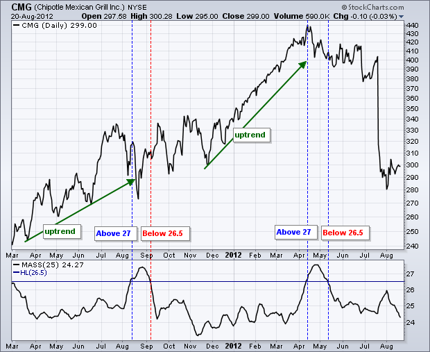
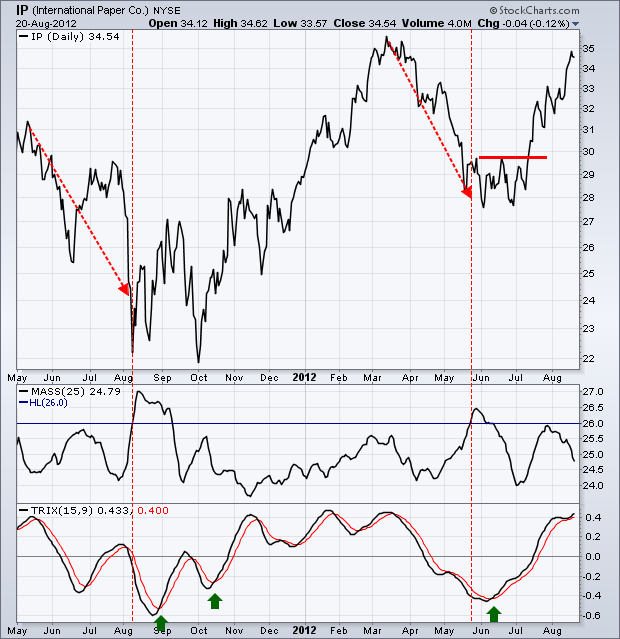
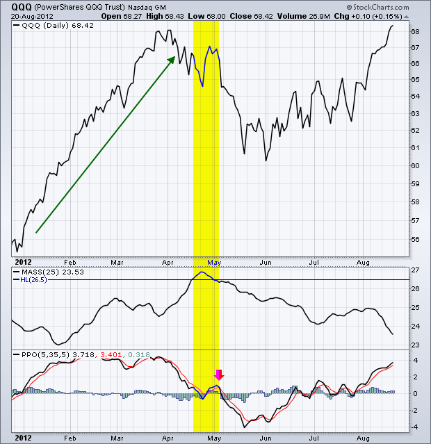
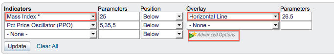

# 质量指数 [ChartSchool]

### 目录

+   质量指数

    +   介绍

    +   SharpCharts 计算

    +   信号

    +   微调

    +   结论

    +   与 SharpCharts 结合使用

    +   建议扫描

        +   质量指数看涨反转

        +   质量指数看跌反转

    +   进一步研究

## 介绍

由唐纳德·多尔西（Donald Dorsey）开发，质量指数（Mass Index）利用高低范围来识别基于范围扩展的趋势反转。在这个意义上，质量指数是一个没有方向偏见的波动性指标。相反，质量指数识别可以预示当前趋势反转的范围膨胀。

## SharpCharts 计算

质量指数计算涉及四个部分：

```py
Single EMA = 9-period exponential moving average (EMA) of the high-low differential  

Double EMA = 9-period EMA of the 9-period EMA of the high-low differential 

EMA Ratio = Single EMA divided by Double EMA 

Mass Index = 25-period sum of the EMA Ratio 

```



计算相当简单。首先，单一 EMA 提供高低范围的平均值。其次，双重 EMA 对这种波动性指标进行第二次平滑。使用这两个指数移动平均数的比率对数据系列进行归一化。这个比率显示单一 EMA 相对于双重 EMA 变大的时候。最后一步，25 期总和，类似于移动平均线，进一步平滑数据系列。总的来说，随着高低范围的扩大，质量指数上升，随着高低范围的缩小，质量指数下降。下面展示了一个电子表格示例。



一些电子表格数值有一分钱的偏差，因为指数移动平均计算的时间跨度不到三个月。SharpCharts 中的计算时间跨度为两年，这使指数移动平均计算更加稳健。点击这里下载这个电子表格示例。")

## 信号

唐纳德·多尔西寻找“反转膨胀”来发出趋势反转信号。根据多尔西的说法，当质量指数上升至 27 以上时会出现膨胀。然而，这种初始膨胀并不完成信号。多尔西等待这种膨胀反转，回落至 26.50 以下。一旦反转膨胀完成，交易者应该使用其他分析技术来确定下一步走势的方向。理想情况下，下跌趋势后出现反转膨胀将暗示看涨趋势反转。相反，上涨趋势后出现反转膨胀将暗示看跌趋势反转。



上面的例子显示了 Chipotle 在 12 个月内质量指数产生两次逆转突出。在这两种情况下，当质量指数超过 27 时，趋势是向上的，这意味着预期看跌逆转。第一个信号预示着一个交易范围。第二个信号预示着急剧下降。寻找信号的图表分析师很可能需要放宽多尔西对逆转突出的要求，因为质量指数很少超过 27。需要异常波动才能将指数推至这个水平。

## 调整

图表分析师可以降低逆转突出的阈值以生成更多信号。波动性并非一刀切。换句话说，图表分析师可能需要比较一段时间内的质量指数水平，以识别历史高点和低点。接近历史范围高端的移动将表明波动性突出，可能预示着逆转。

下图显示了国际纸业的质量指数两次上升至 26 以上。尽管质量指数在 2011 年 8 月触及 27，但 26 水平似乎更适合作为逆转突出。还要记住，2011 年 8 月对整个股市来说是一个极端波动的时期，这个读数看起来像是一个异常值。当质量指数在 2011 年 8 月和 2012 年 5 月上升至 26 以上时，趋势是向下的，这表明随后会出现看涨逆转，图表分析师可以使用其他分析技术来识别这种逆转。



底部指标是 TRIX 振荡器，它是三次平滑指数移动平均的一期变化率。TRIX 类似于 MACD 的平滑版本。一旦逆转突出出现并建立了交易偏向，图表分析师可以使用 TRIX 生成方向信号。由于这些逆转突出发生时趋势向下，交易偏向是看涨的，只有看涨信号被考虑。绿色箭头显示了当 TRIX 移动超过其信号线以示价格上涨时。

## 结论

质量指数利用高低差异提供平滑的波动率测量。该指标通常在中 20 左右波动。接近历史范围高端的读数表明波动性增加，这增加了趋势逆转的可能性。尽管多尔西将突出阈值设定为 27，但图表分析师应考虑降低阈值以产生更多信号。请记住，质量指数没有方向偏见。方向偏见取决于现有趋势。与所有指标一样，图表分析师应使用其他分析技术来补充质量指数。

## 使用 SharpCharts

质量指数可以在图表下的“指标”部分找到。用户可以通过更改“参数”框中的数字来调整总结期。然后，指标可以被定位在“价格后面”、“主窗口上方”或“主窗口下方”。图表分析师可以使用“高级”选项添加水平线。这条线可用于设置反转膨胀信号的阈值。[点击这里查看实时示例](http://scharts.co/Rz7CZ1 "http://scharts.co/Rz7CZ1")。





## 建议扫描

### 质量指数看涨反转

此扫描搜索交易价格低于其 200 日移动平均线以定义长期下降趋势的股票。当质量指数移动到 26.5 以下时，将识别出看涨反转。

```py
[type = stock] AND [country = US] 
AND [Daily SMA(20,Daily Volume) > 40000] 
AND [Daily SMA(60,Daily Close) > 20] 

AND [Daily Close < Daily SMA(200,Daily Close)] 
AND [26.5 x Daily MASS(25)] 
```

### 质量指数看跌反转

此扫描搜索交易价格高于其 200 日移动平均线以定义长期上升趋势的股票。当质量指数移动到 26.5 以下时，将识别出看跌反转。

```py
[type = stock] AND [country = US] 
AND [Daily SMA(20,Daily Volume) > 40000] 
AND [Daily SMA(60,Daily Close) > 20] 

AND [Daily Close > Daily SMA(200,Daily Close)] 
AND [26.5 x Daily MASS(25)] 
```

有关用于质量指数扫描的语法的更多详细信息，请参阅我们的[扫描指标参考](http://stockcharts.com/docs/doku.php?id=scans:indicators#mass_index_mass "http://stockcharts.com/docs/doku.php?id=scans:indicators#mass_index_mass")在支持中心。

## 进一步学习

这本书详细介绍了对任何交易员或投资者成功至关重要的 16 种简单而有效的策略。读者将学习振荡器技术、均值回归策略，甚至看到经过回测的结果。

| **短期交易策略** 拉里·康纳斯和塞萨尔·阿尔瓦雷斯 |
| --- |
|  |
|  |
