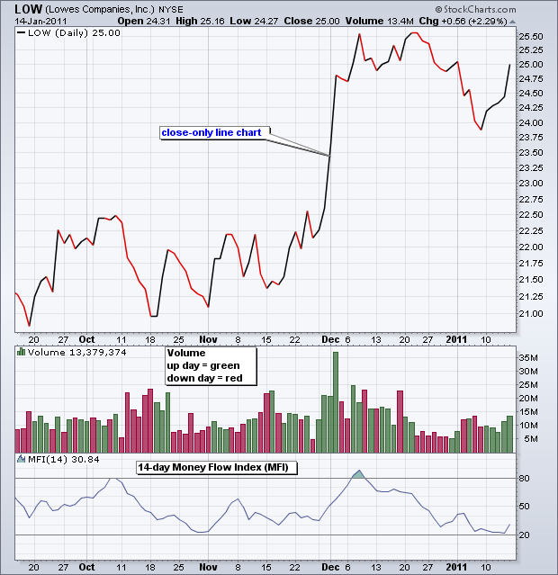

# 资金流指数（MFI）

### 目录

+   资金流指数（MFI）

    +   介绍

    +   计算

    +   解释

    +   超买/超卖

    +   背离和失败

    +   结论

    +   使用 SharpCharts

    +   建议扫描

        +   MFI 超卖

        +   MFI 超买

    +   进一步研究

## 介绍

资金流指数（MFI）是一种使用价格和交易量来衡量买卖压力的振荡器。由 Gene Quong 和 Avrum Soudack 创建，MFI 也被称为成交量加权 RSI。MFI 从每个周期的典型价格开始。当典型价格上涨时（买入压力），资金流是正的，当典型价格下跌时（卖出压力）是负的。然后将正负资金流的比率插入 RSI 公式中，以创建一个在零和一百之间移动的振荡器。作为与交易量相关的动量振荡器，资金流指数（MFI）最适合识别各种信号的反转和价格极端情况。

## 计算

资金流指数计算涉及几个步骤。下面的示例基于 14 周期的资金流指数，这是 SharpCharts 的默认设置和创建者推荐的设置。

```py
Typical Price = (High + Low + Close)/3

Raw Money Flow = Typical Price x Volume
Money Flow Ratio = (14-period Positive Money Flow)/(14-period Negative Money Flow)

Money Flow Index = 100 - 100/(1 + Money Flow Ratio)

```

首先，注意原始资金流是基本上是美元交易量，因为公式是交易量乘以典型价格。当典型价格从一个周期到下一个周期上涨时，原始资金流是正的，当典型价格下跌时是负的。当典型价格不变时，不使用原始资金流值。第 3 步中的资金流比率形成了资金流指数（MFI）的基础。正负资金流在回顾期（14）内求和，正资金流总和除以负资金流总和得到比率。然后应用 RSI 公式创建一个成交量加权指标。下表显示了从 Excel 电子表格中提取的计算示例。


点击这里")查看 Excel 电子表格中的 MFI 计算。



## 解释

作为 RSI 的成交量加权版本，资金流动指数（MFI）可以类似于 RSI 进行解释。最大的区别当然是成交量。由于成交量被加入到计算中，资金流动指数的表现会与 RSI 有些许不同。理论表明，成交量领先价格。RSI 是一个动量振荡器，已经领先价格。结合成交量可以增加这种领先时间。

Quong 和 Soudack 使用资金流动指数确定了三种基本信号。首先，图表分析师可以寻找超买或超卖水平，以警示不可持续的价格极端。其次，可以利用看涨和看跌背离来预测趋势反转。第三，80 或 20 处的失败摆动也可用于识别潜在的价格反转。对于本文，背离和失败摆动被结合在一起形成一个信号组，增加鲁棒性。

## 超买/超卖

超买和超卖水平可用于识别不可持续的价格极端。通常，MFI 超过 80 被视为超买，MFI 低于 20 被视为超卖。强势趋势可能对这些经典的超买和超卖水平构成问题。当上涨趋势强劲时，MFI 可能变得超买（>80），价格可能继续上涨。相反，当下跌趋势强劲时，MFI 可能变得超卖（<20），价格可能继续下跌。Quong 和 Soudack 建议扩大这些极端以进一步确认信号。超过 90 的上涨是真正的超买，低于 10 的下跌是真正的超卖。超过 90 和低于 10 的走势是罕见的事件，表明价格走势不可持续。诚然，许多股票会长时间交易而不会达到 90/10 的极端。然而，图表分析师可以使用 StockCharts.com 的扫描引擎找到那些达到这些极端的股票。本文末尾提供了这些扫描的链接。


JB Hunt（JBHT）在 2009 年 10 月底和 2010 年 2 月初，当资金流动指数下跌至 10 以下时，变得超卖。前面的下跌足够尖锐，以产生这些读数，但超卖极端表明这些下跌是不可持续的。仅仅超卖水平还不足以转为看涨。需要某种形式的逆转或上升来确认价格确实已经转向。JBHT 通过大幅跳空和趋势线突破以及良好的成交量确认了第一个超卖读数。该股票通过良好成交量的阻力突破确认了第二个超卖读数。


Aeropostale (ARO) 在 2009 年 9 月底和 12 月底，当资金流动指数上涨到 90 以上时，就变得超买。MFI 的极端值表明这些上涨是不可持续的，回调即将到来。第一个超买信号导致了一个相当大的下跌，但第二个没有。注意到 ARO 在第一个超买信号时达到顶峰，并在 10 月份形成了较低的高点。10 月底的支撑线突破标志着明显的趋势逆转。在 12 月的超买信号之后，ARO 上涨到 23 以上并保持稳定。出现了两个下跌间隙和一个支撑线突破，但这些都没有持续。价格走势比超买信号更强劲。ARO 最终突破了 24 的阻力位，并再次上涨至 28 以上。第二个信号没有起作用。

## 背离和失败摆动

失败摆动和背离可以结合起来产生更加稳健的信号。当 MFI 在 20 以下超卖，突破 20，回调时保持在 20 以上，然后突破先前的反应高点时，就会出现一个看涨的失败摆动。当价格下跌到一个更低的低点，但指标形成一个更高的低点，显示资金流动或动量改善时，就形成了一个看涨的背离。

在下面的 Aetna (AET) 图表中，于 2010 年 1 月至 2 月形成了一个看涨的背离和失败摆动。首先，注意股票在 2 月创下一个更低的低点，而 MFI 在 1 月的低点远高于其 1 月低点，形成了一个看涨的背离。其次，注意 MFI 在 1 月下跌到 20 以下，2 月保持在 20 以上，并在 2 月底突破了先前的高点。这个信号组合预示了 3 月的强劲上涨。


当 MFI 在 80 以上超买，跌破 80，未能在反弹时超过 80，然后跌破先前的反应低点时，就会出现一个看跌的失败摆动。当股票创下一个更高的高点，而指标形成一个更低的高点时，就形成了一个看跌的背离，表明资金流动或动量恶化。

在上面的 Aetna 图表中，于 8 月至 9 月形成了一个看跌的背离和失败摆动。股票在 9 月创下新高，但 MFI 形成了一个明显较低的高点。当 MFI 在 8 月底超买到 80 以上时，形成了一个看跌的失败摆动，未能在 9 月反弹时达到 80，并在 9 月底的下跌中突破了先前的低点。

## 结论

资金流动指数是一种相当独特的指标，它将动量和成交量与 RSI 公式结合在一起。当指标高于 50 时，RSI 动量通常偏向多头，低于 50 时偏向空头。尽管 MFI 被认为是一个成交量加权的 RSI，但使用中线来确定多头或空头偏向效果不佳。相反，MFI 更适合识别潜在的超买/超卖水平、多头/空头背离以及多头/空头失败摆动。与所有指标一样，MFI 不应单独使用。可以将纯动量振荡器（如 RSI）或图表分析与 MFI 结合以增加信号的稳健性。

## 使用 SharpCharts

资金流动指数可作为 SharpCharts 指标使用，可以放置在基础证券的价格图表的上方、下方或后方。将 MFI 直接放在价格后面可以方便地将指标摆动与价格变动进行比较。默认设置为 14 周期，但可以根据分析需求进行调整。较短的时间框架使指标更敏感。较长的时间框架使其不太敏感。用户可以点击“高级选项”旁边的绿色箭头添加水平线以自定义超买和超卖水平。通过用逗号分隔数字添加两条线：（10,90）。


## 建议扫描

### MFI 超卖

此扫描搜索股价高于每股$20，每日交易量超过 100,000 股，并且资金流动指数超卖（<10）的股票。将其视为进一步分析和尽职调查的起点。

```py
[type = stock] AND [country = US] 
AND [Daily SMA(20,Daily Volume) > 40000] 
AND [Daily SMA(60,Daily Close) > 20] 

AND [Daily MFI(14) < 10]
```

### MFI 超买

此扫描搜索股价高于每股$20，每日交易量超过 100,000 股，并且资金流动指数超买（>90）的股票。将其视为进一步分析和尽职调查的起点。

```py
[type = stock] AND [country = US] 
AND [Daily SMA(20,Daily Volume) > 100000] 
AND [Daily SMA(60,Daily Close) > 20] 

AND [Daily MFI(14) > 90]
```

有关用于资金流动指数扫描的语法详细信息，请参阅我们的[扫描指标参考](http://stockcharts.com/docs/doku.php?id=scans:indicators#money_flow_index_mfi "http://stockcharts.com/docs/doku.php?id=scans:indicators#money_flow_index_mfi")在支持中心。

## 进一步研究

| **专业交易员的技术分析** 康斯坦斯·布朗 |
| --- |
|  |
|  |
