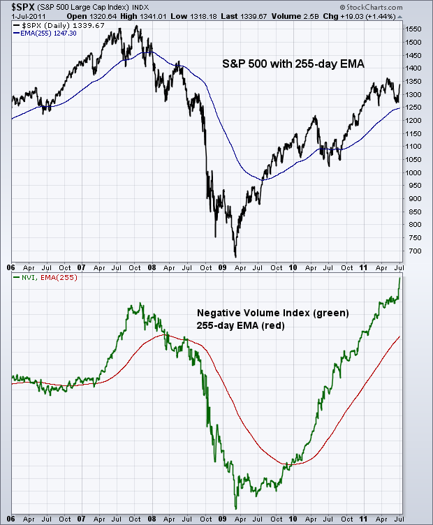
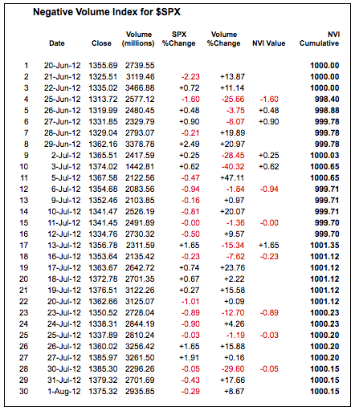
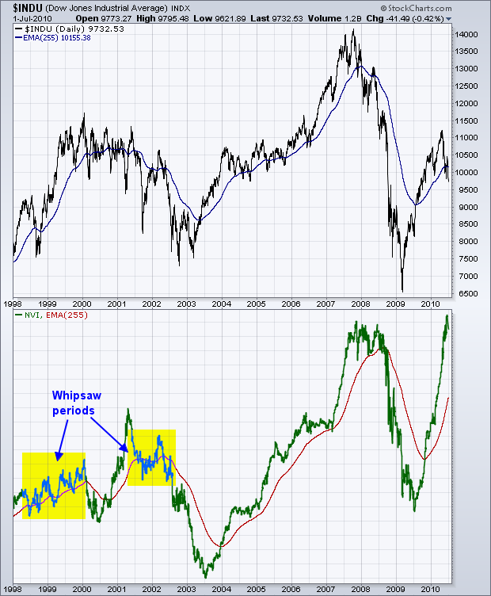
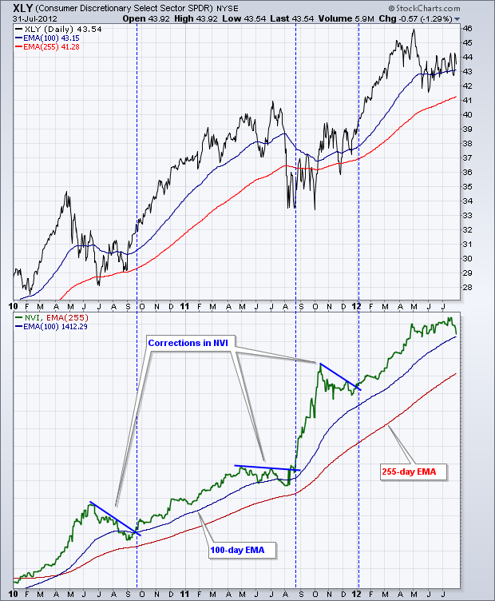
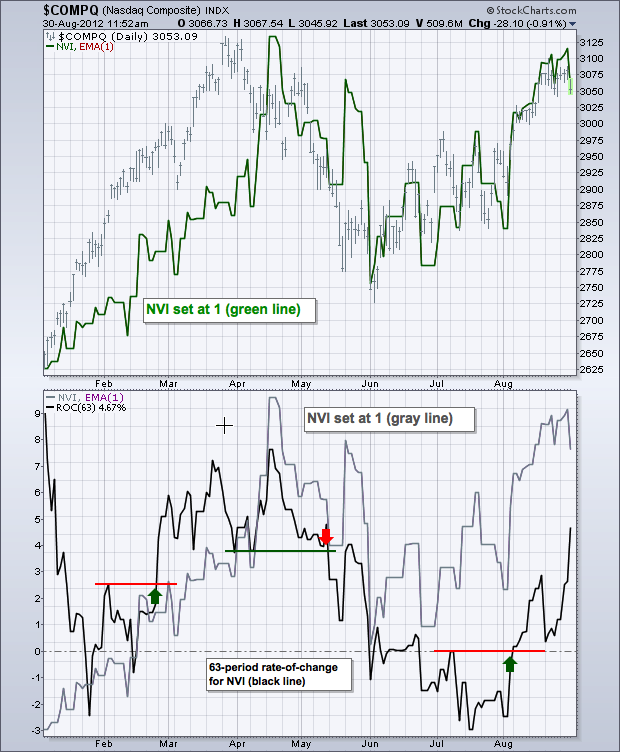
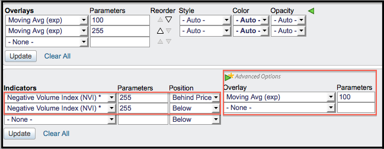

# 负量指数 (NVI) 

### 目录

+   负量指数 (NVI)

    +   简介

    +   SharpCharts 计算

    +   信号

    +   微调

    +   结论

    +   与 SharpCharts 一起使用

    +   建议的扫描

        +   看涨 NVI 信号线交叉

        +   看跌 NVI 信号线交叉

    +   进一步研究

## 简介

负量指数 (NVI) 是一个累积指标，利用成交量的变化来判断聪明的资金何时活跃。保罗·戴萨特在上世纪 30 年代首次开发了这个指标。事实上，市场技术协会于 1990 年选中戴萨特，以表彰他对技术分析的贡献。戴萨特的负量指数工作基于这样一个假设：聪明的资金在成交量减少的日子活跃，而不那么聪明的资金在成交量增加的日子活跃。

## SharpCharts 计算

负量指数有两个版本。在原始版本中，戴萨特通过在一个周期到另一个周期成交量减少时添加净进步来形成一个累积线。净进步等于上涨股票数减去下跌股票数。当成交量从一个周期增加到另一个周期时，累积 NVI 线保持不变。换句话说，什么也没做。股市逻辑的诺曼·福斯巴克通过用百分比价格变化替代净进步来调整了该指标。SharpCharts 公式使用了这个福斯巴克版本。

```py
1\. Cumulative NVI starts at 1000

2\. Add the Percentage Price Change to Cumulative NVI when Volume Decreases

3\. Cumulative NVI is Unchanged when Volume Increases

4\. Apply a 255-day EMA for Signals

```



电子表格示例详细展示了计算过程。价格 % 变化乘以 100，以减少所需的小数位数。首先注意成交量 % 变化列。当这个值为负时，标普 500 的百分比变化被输入到 NVI 值列中。当这个值为正时，NVI 值列中不会出现任何内容。从 1000 开始，每个周期应用 NVI 值，以创建一个仅在成交量减少时变化的累积指标。



点击此处下载此电子表格示例。")

## 信号

负量指数的传统用法非常简单。根据福斯巴克的说法，当 NVI 高于其 255 天 EMA 时，牛市的可能性较大；当 NVI 低于其 255 天 EMA 时，熊市的可能性较大。然而，福斯巴克指出这些可能性并不对称。当 NVI 高于其 255 天 EMA 时，牛市的可能性为 96%，但当 NVI 低于其 255 天 EMA 时，熊市的可能性仅为 53%。



上图显示了道琼工业指数及其下方的 NVI。 即使有一个长期移动平均线，也有很多鞭策（错误信号）。 请注意，随着指标在 1998-1998 年间多次穿越 255 日 EMA 而上升，它如何来回摆动。 在 2001-2002 年间，随着道琼工业指数的交易变得波动，也有几次交叉。 从 2002 年底开始的信号不太容易出现鞭策，因为更强劲的趋势出现了。 图表分析师可以预期一些滞后，因为移动平均线滞后，并且使用 255 日 EMA 来生成信号。

## 微调

尽管 NVI 的设计初衷是针对主要股票指数，但图表分析师可以将 NVI 与 ETF、股票或任何具有交易量的东西一起使用。 请记住，该指标背后的理念有点不同寻常，因为在交易量增加时的价格变动基本上被忽略。



上面的示例显示了消费者自由裁量 SPDR（XLY）及其 NVI 和两个指数移动平均线。 当 NVI 高于其 255 日 EMA（红色）时，总体趋势是向上的。 下跌到 100 日 EMA 以下显示了这一上升趋势中的修正。 图表分析师还可以通过绘制趋势线将基本技术分析应用于该指标。 从 2010 年 1 月到 2012 年 7 月有三个修正期（蓝线）。 突破这些趋势线标志着修正期的结束和上升趋势的恢复，对于 NVI 而言是如此。 这些突破信号还预示着基础资产（XLY）的重大价格波动。

## 结论

负量指数（NVI）是一种混合指标，结合了 Paul Dysart 和 Norman Fosback 的输入。 NVI 在交易量减少时计算价格变化，并在交易量增加时折扣价格变化。 假设是当交易量减少时聪明（知情）的资金在运作，而当交易量增加时不那么聪明（不知情）的资金在运作。 请记住，该指标是为广泛的市场指数和交易量设计的。 它可以用于股票和 ETF，但 NVI 并不总是按预期运作。 NVI 将与某些股票产生一些很好的看涨/看跌背离信号，但与其他股票完全不同步。 与所有指标一样，NVI 不应单独使用。 相反，图表分析师应将其与其他分析技术结合使用。

## 使用 SharpCharts

负量指标（NVI）可以在图表下方的指标部分找到。 NVI 被设置为累积指标，无法调整。 图表师可以通过更改参数框中的数字来调整指数移动平均线。 将参数设置为“1”将基本上删除移动平均线。 然后，可以将指标放置在主图表窗口后面、上面或下面。 在将其放置在主图表窗口的价格图之后时，有助于更改颜色。 图表师可以使用“高级”指标选项将另一个移动平均线或指标应用于 NVI。 下面的示例显示了应用于指标窗口中的 NVI 的变化率振荡器。 [点击这里](http://stockcharts.com/h-sc/ui?s=$COMPQ&p=D&yr=0&mn=8&dy=0&id=p79189698479&a=276034932 "http://stockcharts.com/h-sc/ui?s=$COMPQ&p=D&yr=0&mn=8&dy=0&id=p79189698479&a=276034932") 查看 NVI 实际操作的实时示例。





## 建议的扫描

### 看涨 NVI 信号线穿越

这个扫描显示了 NVI 已经穿过其信号线的股票，触发了一个看涨信号。

```py
[type = stock] AND [country = US] 
AND [Daily SMA(20,Daily Volume) > 40000] 
AND [Daily SMA(60,Daily Close) > 20] 

AND [NVI x NVI Signal(255)]

```

### 看跌 NVI 信号线穿越

这个扫描显示了 NVI 已经穿过其信号线的股票，触发了一个看跌信号。

```py
[type = stock] AND [country = US] 
AND [Daily SMA(20,Daily Volume) > 40000] 
AND [Daily SMA(60,Daily Close) > 20] 

AND [NVI Signal(255) x NVI]
```

有关用于 NVI 扫描的语法的更多详细信息，请参阅我们支持中心的[扫描指标参考](http://stockcharts.com/docs/doku.php?id=scans:indicators#negative_volume_index "http://stockcharts.com/docs/doku.php?id=scans:indicators#negative_volume_index")。

## 进一步研究

《金融市场技术分析》有一章专门讨论了交易量，另一章详细介绍了广度指标。 普林的书中有一章专门讨论如何将交易量纳入分析过程中。

| **金融市场技术分析** 约翰·J·墨菲 | **技术分析解密** 马丁·普林 |
| --- | --- |
|  |  |
|  |  |
