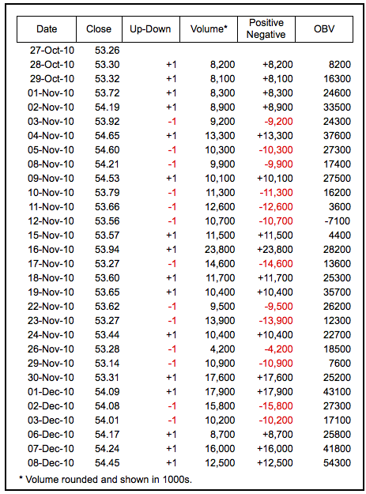
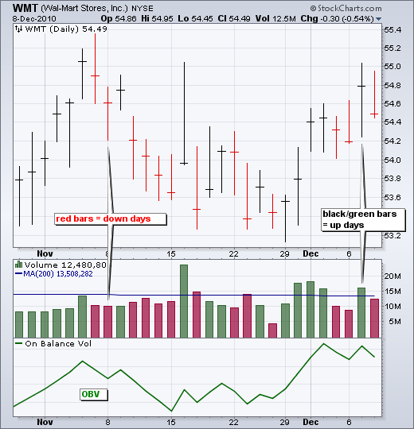
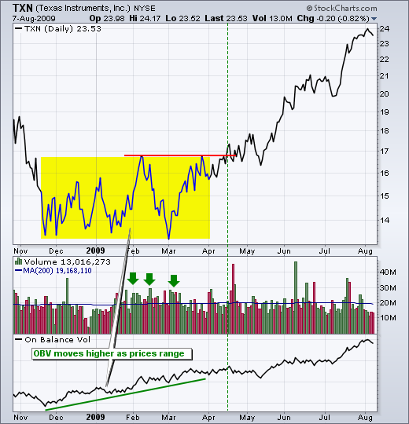
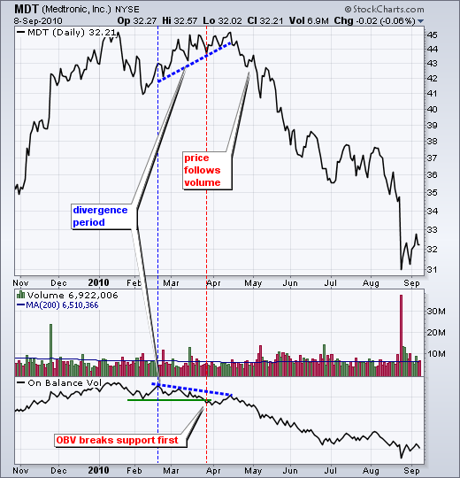
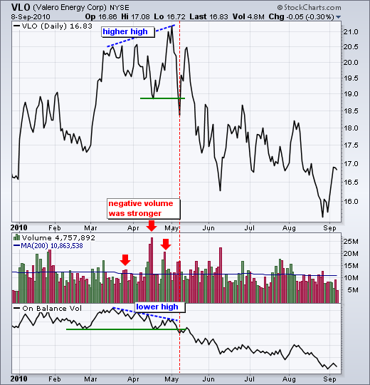
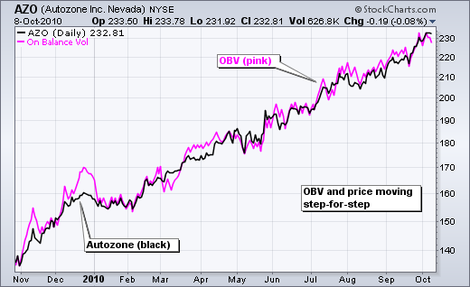
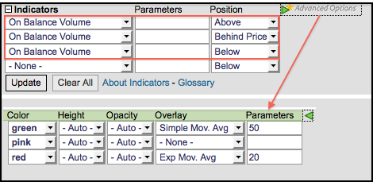

# 成交量平衡（OBV）[图表学校]

### 目录

+   成交量平衡（OBV）

    +   介绍

    +   计算

    +   解释

    +   背离

    +   趋势确认

    +   结论

    +   与 SharpCharts 一起使用

    +   建议扫描

        +   OBV 和 ADL 中的牛市背离

        +   OBV 和 ADL 中的熊市背离

    +   进一步学习

    +   额外资源

        +   股票与商品杂志文章

## 介绍

成交量平衡（OBV）衡量买卖压力，是一个累积指标，将上涨日的成交量相加，下跌日的成交量相减。OBV 由乔·格兰维尔开发，并在他 1963 年的著作《格兰维尔股市利润的新关键》中介绍。它是最早衡量正向和负向成交量流动的指标之一。图表分析师可以寻找 OBV 和价格之间的背离来预测价格走势，或使用 OBV 来确认价格趋势。

## 计算

成交量平衡（OBV）线简单地是正向和负向成交量的累计总和。当收盘价高于前一个收盘价时，该时期的成交量为正。当收盘价低于前一个收盘价时，该时期的成交量为负。

```py

If the closing price is above the prior close price then: 
Current OBV = Previous OBV + Current Volume

If the closing price is below the prior close price then: 
Current OBV = Previous OBV  -  Current Volume

If the closing prices equals the prior close price then:
Current OBV = Previous OBV (no change)

```



上表中的数据来自沃尔玛（WMT）。成交量数据已四舍五入，并以千为单位显示。换句话说，8200 实际上等于 820 万股。首先，我们必须确定沃尔玛是收盘上涨（+1）还是下跌（-1）。这个数字现在被用作成交量乘数，用于计算正向或负向成交量。最后一列（OBV）形成正向/负向成交量的累计总和。因为 OBV 必须从某个地方开始，第一个值（8200）只是等于第一个时期的正向/负向成交量。下面的图表显示了沃尔玛的成交量和 OBV。



## 解释

格兰维尔理论认为成交量先于价格。当上涨日的成交量超过下跌日的成交量时，OBV 上升。当下跌日的成交量更强时，OBV 下降。上升的 OBV 反映了正向的成交量压力，可能导致价格上涨。相反，下降的 OBV 反映了负向的成交量压力，可能预示价格下跌。格兰维尔在他的研究中指出，OBV 通常会在价格之前移动。如果 OBV 上升而价格要么持平要么下跌，预计价格会上涨。如果 OBV 下降而价格要么持平要么上涨，预计价格会下跌。

OBV 的绝对值并不重要。图表分析师应该关注 OBV 线的特征。首先，定义 OBV 的趋势。其次，确定当前趋势是否与基础证券的趋势相匹配。第三，寻找潜在的支撑或阻力水平。一旦突破，OBV 的趋势将改变，这些突破可以用来生成信号。此外，请注意 OBV 是基于收盘价的。因此，在寻找背离或支撑/阻力突破时应考虑收盘价。最后，成交量的激增有时可能会使指标失真，导致急剧波动，需要一段时间来稳定。

## 背离

多头和空头背离信号可以用来预测趋势反转。这些信号真正基于成交量领先价格的理论。当 OBV 上升或形成高点时，即使价格下跌或形成低点时，就形成了多头背离。当 OBV 下降或形成低点时，即使价格上涨或形成高点时，就形成了空头背离。OBV 与价格之间的背离应该提醒图表分析师，价格可能会发生反转。

星巴克（SBUX）的图表显示，7 月份形成了一个多头背离。在价格图表上，SBUX 在 7 月初的时候低于了 6 月的低点。然而，OBV 保持在 6 月的低点之上，形成了一个多头背离。OBV 在 SBUX 突破阻力之前就已经突破了阻力。这是一个经典的成交量领先价格的案例。SBUX 一周后突破了阻力，并继续上涨超过 20，获得了 30%以上的收益。第二张图显示了在德州仪器（TXN）交易区间内交易时，OBV 上升。在交易区间内 OBV 上升表示积累，这是多头的。




梅德特龙（MDT）的图表显示，成交量领先价格下跌的空头背离。蓝色虚线标识了背离期。MDT 上涨（从 43 涨到 45），而 OBV 下降。此外，请注意，OBV 在这个背离期间突破了支撑。随着突破 2 月低点，OBV 的上升趋势逆转。另一方面，MDT 仍在上涨。最终成交量赢得了胜利，随着 MDT 跟随成交量下跌，跌至 30 美元以下。第二张图显示了瓦莱罗能源（VLO）在 4 月形成空头背离，并在 5 月确认支撑突破。





## 趋势确认

OBV 可以用来确认价格趋势、上涨突破或下跌突破。Best Buy（BBY）的图表显示了三个确认信号以及价格趋势的确认。OBV 和 BBY 在 12 月至 1 月下跌，在 3 月至 4 月上涨，在 5 月至 8 月下跌，在 9 月至 10 月上涨。OBV 的趋势与 BBY 的趋势相匹配。


OBV 还确认了 BBY 的趋势反转。注意 BBY 如何在 2 月底突破了下降趋势线，而 OBV 在 3 月确认了阻力突破。BBY 在 4 月底突破了上升趋势线，而 OBV 在 5 月初确认了支撑线突破。BBY 在 9 月初突破了下降趋势线，而 OBV 在一周后确认了趋势线突破。这些一致的信号表明正成交量和负成交量与价格协调一致。

有时 OBV 与基础证券步调一致。在这种情况下，OBV 确认了基础趋势的强势，无论是上涨还是下跌。Autozone（AZO）的图表显示了价格为黑线，OBV 为粉线。从 2009 年 11 月至 2010 年 10 月，两者都稳步上升。正成交量在整个上涨过程中保持强劲。



## 结论

成交量平衡指标（OBV）是一个简单的指标，利用成交量和价格来衡量买盘和卖盘的压力。当正成交量超过负成交量且 OBV 线上升时，买盘明显。当负成交量超过正成交量且 OBV 线下降时，卖盘存在。技术分析师可以使用 OBV 来确认基本趋势或寻找可能预示价格变化的背离。与所有指标一样，重要的是将 OBV 与技术分析的其他方面结合使用。它不是一个独立的指标。OBV 可以与基本的图表分析结合使用，或者确认来自动量振荡器的信号。

## 使用 SharpCharts

在 SharpCharts 中，On Balance Volume（OBV）作为一个指标是可用的。选择后，OBV 可以放置在基础证券的价格图之上、之下或之后。将其放在图表之后使得比较 OBV 和基础证券变得容易。图表分析师还可以通过选择高级选项向 OBV 添加移动平均线或另一个指标，该选项位于指标位置的右侧。[点击这里](http://stockcharts.com/h-sc/ui?s=IBM&p=D&yr=0&mn=6&dy=0&id=p32660999348&listNum=30&a=216754758 "http://stockcharts.com/h-sc/ui?s=IBM&p=D&yr=0&mn=6&dy=0&id=p32660999348&listNum=30&a=216754758")查看带有 On Balance Volume 的实时图表。




## 建议的扫描

### OBV 和 ADL 的看涨背离

这个扫描从股票的基础开始，这些股票在过去 60 天的平均价格至少为$10，每日交易量为 100,000。通过查找价格低于 65 日 SMA 和 20 日 SMA，但 OBV 和积累/分布线高于 65 日 SMA 和 20 日 SMA 的股票，可以找到潜在的看涨背离。

```py
[type = stock] AND [country = US] 
AND [Daily SMA(60,Daily Volume) > 100000] 
AND [Daily SMA(60,Daily Close) > 10] 

AND [Daily Close < Daily SMA(65,Daily Close)] 
AND [Daily AccDist > Daily AccDist Signal (65)] 
AND [Daily OBV > Daily OBV Signal(65)] 
AND [Daily Close < Daily SMA(20,Daily Close)] 
AND [Daily AccDist > Daily AccDist Signal (20)] 
AND [Daily OBV > Daily OBV Signal(20)]
```

### OBV 和 ADL 的看跌背离

这个扫描从股票的基础开始，这些股票在过去 60 天的平均价格至少为$10，每日交易量为 100,000。通过查找价格高于 65 日 SMA 和 20 日 SMA，但 OBV 和积累/分布线低于 65 日 SMA 和 20 日 SMA 的股票，可以找到潜在的看跌背离。

```py
[type = stock] AND [country = US] 
AND [Daily SMA(60,Daily Volume) > 100000] 
AND [Daily SMA(60,Daily Close) > 10] 

AND [Daily Close > Daily SMA(65,Daily Close)] 
AND [Daily AccDist < Daily AccDist Signal (65)] 
AND [Daily OBV < Daily OBV Signal(65)] 
AND [Daily Close > Daily SMA(20,Daily Close)] 
AND [Daily AccDist < Daily AccDist Signal (20)] 
AND [Daily OBV < Daily OBV Signal(20)]
```

有关 OBV 扫描的语法细节，请参阅我们支持中心的[扫描指标参考](http://stockcharts.com/docs/doku.php?id=scans:indicators#on_balance_volume "http://stockcharts.com/docs/doku.php?id=scans:indicators#on_balance_volume")。

**注意**：为了扫描的目的，在交易日内，每日交易量数据是不完整的。在运行基于 OBV 等基于交易量的指标的扫描时，请确保基于“上次市场收盘价”。其他基于交易量的指标的示例包括积累/分布、Chaikin 货币流和 PVO。

## 进一步研究

这本书通过简单明了的解释涵盖了所有内容。墨菲涵盖了所有主要的图表模式和指标，包括 OBV。一个完整的章节专门讨论了理解交易量和未平仓合约。

| **金融市场技术分析** 约翰·J·墨菲 |
| --- |
|  |
|  |

* * *

## 其他资源

### 股票与商品杂志文章

**[布鲁斯·R·法伯的平衡量指标](http://stockcharts.com/h-mem/tascredirect.html?artid=\V12\C07\ONBALAN.pdf "http://stockcharts.com/h-mem/tascredirect.html?artid=\V12\C07\ONBALAN.pdf")**

1994 年 6 月 - 股票与商品

**[斯图尔特·伊文斯的平衡量](http://stockcharts.com/h-mem/tascredirect.html?artid=\V17\C05\036OBV.pdf "http://stockcharts.com/h-mem/tascredirect.html?artid=\V17\C05\036OBV.pdf")**

1999 年 4 月 - 股票与商品

**[D.W.戴维斯的平衡量日内交易](http://stockcharts.com/h-mem/tascredirect.html?artid=\V22\C01\004DAVE.PDF "http://stockcharts.com/h-mem/tascredirect.html?artid=\V22\C01\004DAVE.PDF")**

2003 年 12 月 - 股票与商品
