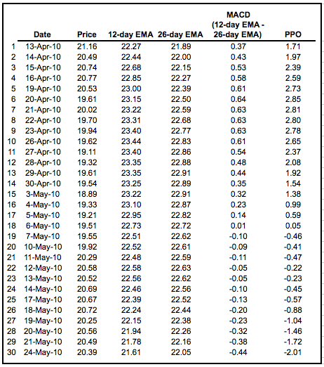
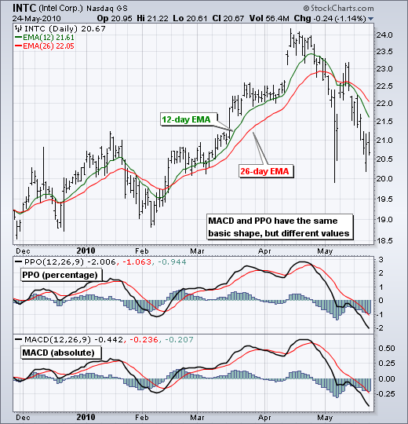
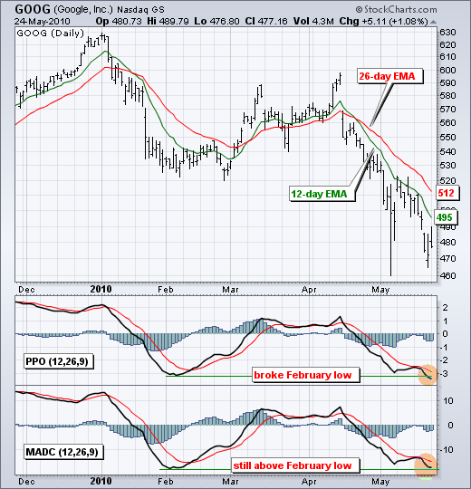
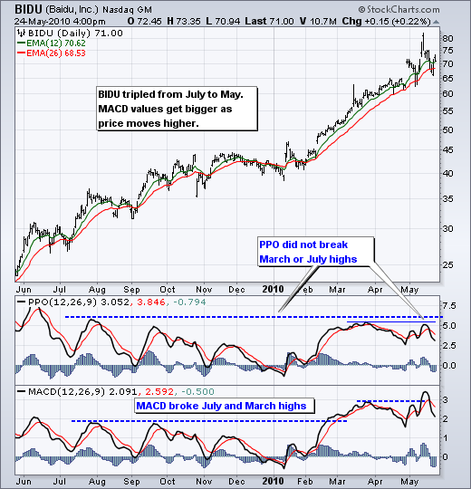
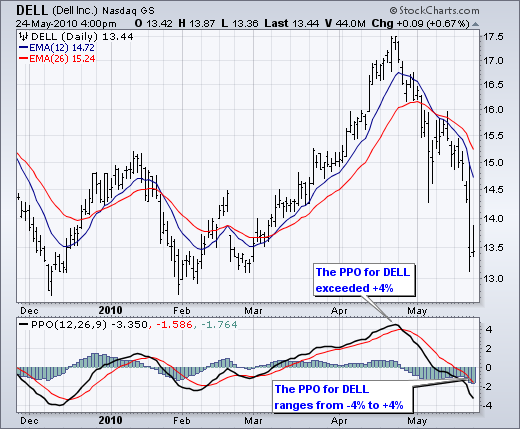
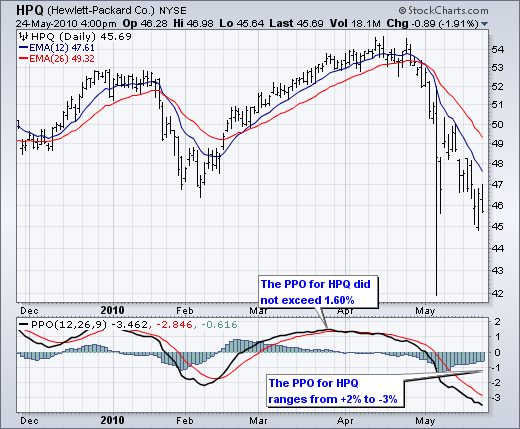
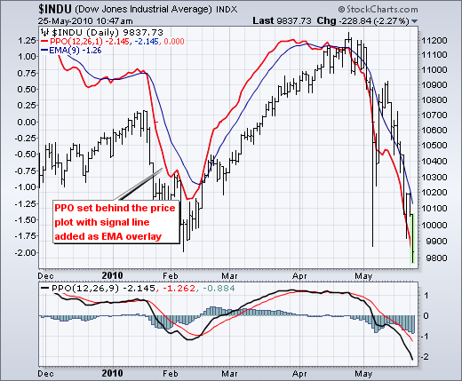
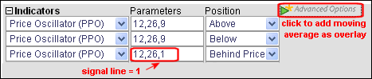

# 百分比价格振荡器 [ChartSchool]

### 目录

+   [百分比价格振荡器](#percentage_price_oscillator)

    +   [介绍](#introduction)

    +   [计算](#calculation)

    +   [解释](#interpretation)

    +   [MACD、PPO 和价格](#macd_ppo_and_price)

    +   [大幅价格变动](#large_price_changes)

    +   [比较不同证券](#comparing_different_securities)

    +   [结论](#conclusions)

    +   [使用SharpCharts](#using_with_sharpcharts)

    +   [建议扫描](#suggested_scans)

        +   [PPO 阳市信号线交叉](#ppo_bullish_signal_line_cross)

        +   [PPO 熊市信号线交叉](#ppo_bearish_signal_line_cross)

    +   [进一步研究](#further_study)

## 介绍

百分比价格振荡器（PPO）是一种动量振荡器，它以较大移动平均线的百分比来衡量两个移动平均线之间的差异。与其表兄 MACD 一样，百分比价格振荡器显示有信号线、直方图和中线。信号通过信号线交叉、中线交叉和背离产生。由于这些信号与 MACD 相关的信号没有区别，本文将重点介绍两者之间的一些区别。首先，PPO 读数不受证券价格水平的影响。其次，即使不同证券的价格存在较大差异，也可以比较不同证券的 PPO 读数。有关两者共同信号的信息，请参阅[ChartSchool 上关于 MACD 的文章](/school/doku.php?id=chart_school:technical_indicators:moving_average_convergence_divergence_macd "chart_school:technical_indicators:moving_average_convergence_divergence_macd")。

## 计算

```py
Percentage Price Oscillator (PPO): {(12-day EMA - 26-day EMA)/26-day EMA} x 100

Signal Line: 9-day EMA of PPO

PPO Histogram: PPO - Signal Line

```

虽然 MACD 衡量两个[移动平均线](/school/doku.php?id=chart_school:technical_indicators:moving_averages "chart_school:technical_indicators:moving_averages")之间的绝对差值，但 PPO 通过将差值除以较慢的移动平均线（26 天 EMA）使其成为相对值。PPO 简单地是 MACD 值除以较长的移动平均线。结果乘以 100，将小数点移动两位。下表显示了英特尔（INTC）的 12 天 EMA、26 天 EMA、MACD 和 PPO 的值。英特尔的价格在低 20 美元左右，MACD 值范围从 -44 美分到 +64 美分。PPO 将这些值转换为百分比，范围从 -2.01 到 +2.85。使用百分比更容易随时间比较水平。-2.01 相当于 -2.01%，而 +2.85 相当于 +2.85%。



[点击此处下载此电子表格示例。](/school/lib/exe/fetch.php?media=chart_school:technical_indicators_and_overlays:price_oscillators_ppo:cs-ppomacd.xls "chart_school:technical_indicators_and_overlays:price_oscillators_ppo:cs-ppomacd.xls (13.5 KB)")



标准PPO基于12日指数移动平均线（EMA）和26日EMA，但这些参数可以根据投资者或交易者的偏好进行更改。收盘价格用于计算移动平均线，因此PPO信号应根据收盘价格进行衡量。PPO的9日EMA被绘制为信号线，以识别指标的上升和下降。

## 解释

与MACD一样，PPO反映了两个移动平均线的收敛和分歧。当较短的移动平均线高于较长的移动平均线时，PPO为正。随着较短的移动平均线远离较长的移动平均线，指标进一步进入正区域。这反映了强劲的上行动量。当较短的移动平均线低于较长的移动平均线时，PPO为负。当较短的移动平均线远离较长的移动平均线（变得更负）时，负读数增加。这反映了强劲的下行动量。直方图代表PPO和其9日EMA信号线之间的差异。当PPO高于其9日EMA时，直方图为正，当PPO低于其9日EMA时，直方图为负。PPO直方图可用于预测PPO中的信号线交叉。有关信号详细信息，请参阅[MACD直方图](/school/doku.php?id=chart_school:technical_indicators:macd-histogram "chart_school:technical_indicators:macd-histogram")的ChartSchool文章。

## MACD、PPO和价格

MACD水平受到证券价格的影响。高价证券的MACD值将高于或低于低价证券，即使波动性基本相等。这是因为MACD基于两个移动平均线的绝对差异。图表2显示了谷歌的MACD和PPO以进行比较。12日EMA约为495，26日EMA约为512，差值为-17（两位数）。请注意，谷歌的MACD在上升和下降时都达到了两位数，但百分比价格振荡器范围从+2.5到-3.5。MACD值看起来较高，因为谷歌的价格相对较高。道琼斯工业指数的MACD，超过10,000，经常达到三位数。然而，PPO范围从-2到+2，这是一个更可定义的范围。



尽管指标线看起来相同，但MACD和PPO之间通常存在细微差异。在谷歌的例子中，请注意PPO跌破了二月低点，但MACD尚未跌破其二月低点。PPO的较低低点显示了扩大的下行动量。

## 大幅价格变动

由于MACD是基于绝对水平的，大幅价格变动会在较长时间内影响MACD水平。如果一支股票从20涨到100，其MACD水平在20左右会比在100左右要小得多。PPO通过以百分比形式显示MACD值来解决这个问题。图表3显示了百度（BIDU）在12个月内从25涨到75。在25-30左右的MACD值通常会比70-80左右的MACD值要小。请注意，MACD突破了7月和3月的高点，但PPO没有突破这些相应的高点。还要注意，当PPO超过+5时，百度会变得[超买](/school/doku.php?id=chart_school:glossary_o#overbought "chart_school:glossary_o")。



## 比较不同证券

由于百分比价格振荡器（PPO）是MACD的百分比版本，其值可以与其他证券进行比较。戴尔（DELL）和惠普（HPQ）属于同一行业集团，但其股价水平不同。截至2010年5月底，DELL的股价在高十几美元，而HPQ的股价在中40美元。绝对价格水平与基本面无关，但会影响MACD水平。HPQ的MACD无疑会高于DELL。然而，我们可以应用百分比价格振荡器（PPO）来比较动量。首先，注意到DELL的PPO范围为-4至+4，共8个点）。HPQ的PPO范围为-3至+2，共5个点。我们可以立即看出DELL比HPQ更具波动性，因为其PPO范围更大。其次，我们可以看到DELL在3月至4月的上涨动量比HPQ更强。DELL的PPO从负值区域上升并超过4。HPQ的PPO在DELL之前转为正值，但未超过1.6。





## 结论

百分比价格振荡器（PPO）产生与MACD相同的信号，但作为MACD的百分比版本提供了一个额外的维度。道琼斯工业指数（价格约11000）的PPO水平可以与IBM（价格约122）的PPO水平进行比较，因为PPO“水平化”了竞争环境。此外，即使价格翻倍或翻三倍，也可以比较一个证券的PPO水平，这对于MACD来说并非如此。尽管具有优势，但PPO仍不是最佳振荡器来识别超买或超卖条件，因为运动是无限的（理论上）。[RSI](/school/doku.php?id=chart_school:technical_indicators:relative_strength_index_rsi "chart_school:technical_indicators:relative_strength_index_rsi")和[随机指标](/school/doku.php?id=chart_school:technical_indicators:stochastic_oscillator_fast_slow_and_full "chart_school:technical_indicators:stochastic_oscillator_fast_slow_and_full")的水平是有限的，这使它们更适合识别超买和超卖水平。

## 使用SharpCharts

PPO可以设置为证券价格图表的上方、下方或后方的指标。一旦从下拉列表中选择指标，将显示默认参数设置（12,26,9）。这些参数可以调整以增加或减少灵敏度。较慢的长期移动平均线与较快的短期移动平均线组合将增加灵敏度。通过将信号线参数设置为1，可以移除直方图。在显示证券价格图表后面的PPO时，这很有帮助。用户甚至可以通过将9日EMA应用于PPO来重新添加信号线。单击“高级选项”以将移动平均线添加为指标的叠加层。[点击此处查看PPO的实时示例](http://stockcharts.com/h-sc/ui?s=$INDU&p=D&yr=0&mn=6&dy=0&id=p81462571466&listNum=30&a=201062788 "http://stockcharts.com/h-sc/ui?s=$INDU&p=D&yr=0&mn=6&dy=0&id=p81462571466&listNum=30&a=201062788")。





## 建议的扫描

### PPO看涨信号线交叉

此扫描显示了交易价格高于其200日移动平均线并在PPO中出现看涨信号线交叉的股票。同时注意，PPO需要为负值，以确保此上升发生在回调之后。这个扫描只是作为进一步细化的起点。

```py
[type = stock] AND [country = US] 
AND [Daily SMA(20,Daily Volume) > 40000] 
AND [Daily SMA(60,Daily Close) > 20] 

AND [Daily Close > Daily SMA(200,Daily Close)] 
AND [Yesterday's Daily PPO Line(12,26,9,Daily Close) < Daily PPO Signal(12,26,9,Daily Close)] 
AND [Daily PPO Line(12,26,9,Daily Close) > Daily PPO Signal(12,26,9,Daily Close)] 
AND [Daily PPO Line(12,26,9,Daily Close) < 0]
```

### PPO看跌信号线交叉

此扫描显示了交易价格低于其200日移动平均线并在PPO中出现看跌信号线交叉的股票。同时注意，PPO需要为正值，以确保此下降发生在反弹之后。这个扫描只是作为进一步细化的起点。

```py
[type = stock] AND [country = US] 
AND [Daily SMA(20,Daily Volume) > 40000] 
AND [Daily SMA(60,Daily Close) > 20] 

AND [Daily Close < Daily SMA(200,Daily Close)] 
AND [Yesterday's Daily PPO Line(12,26,9,Daily Close) > Daily PPO Signal(12,26,9,Daily Close)] 
AND [Daily PPO Line(12,26,9,Daily Close) < Daily PPO Signal(12,26,9,Daily Close)] 
AND [Daily PPO Line(12,26,9,Daily Close) > 0]
```

有关PPO扫描的语法详细信息，请参阅我们的[扫描指标参考](http://stockcharts.com/docs/doku.php?id=scans:indicators#percentage_price_oscillator_ppo "http://stockcharts.com/docs/doku.php?id=scans:indicators#percentage_price_oscillator_ppo")在支持中心。

## 进一步研究

| **技术分析-活跃投资者的强大工具** 杰拉德·阿普尔 |
| --- |
| [](http://store.stockcharts.com/products/technical-analysis-power-tools-for-active-investors "http://store.stockcharts.com/products/technical-analysis-power-tools-for-active-investors") |
| [](http://store.stockcharts.com/products/technical-analysis-power-tools-for-active-investors "http://store.stockcharts.com/products/technical-analysis-power-tools-for-active-investors") |
