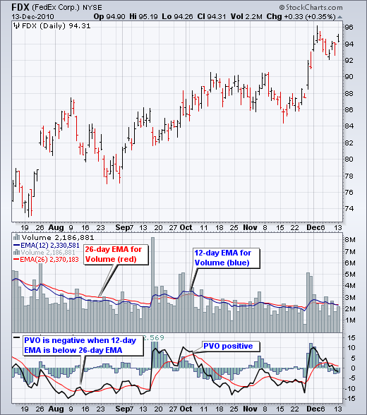
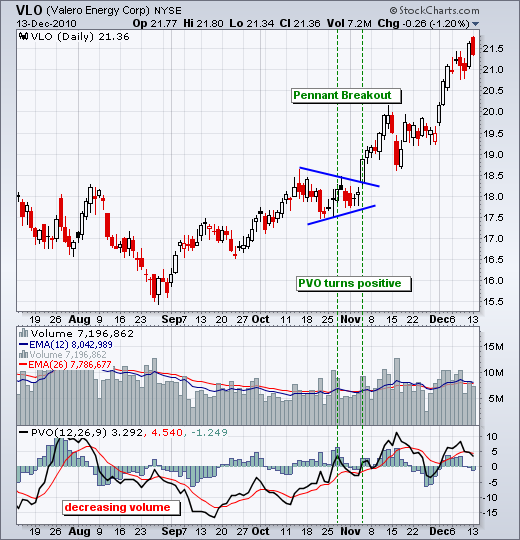
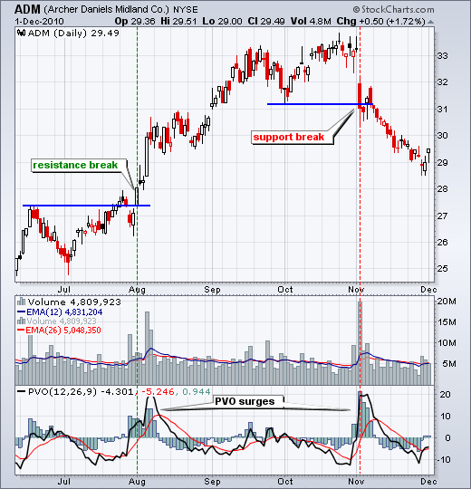
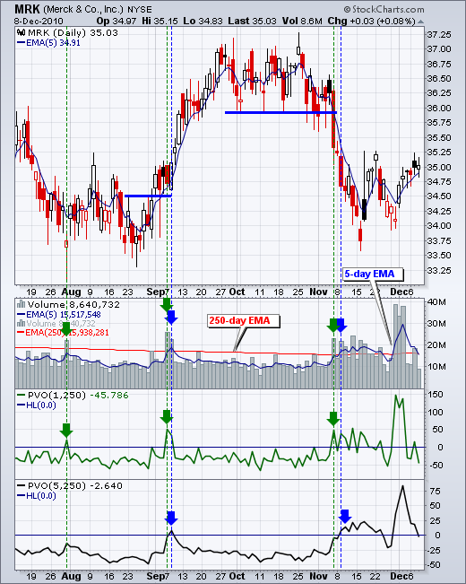
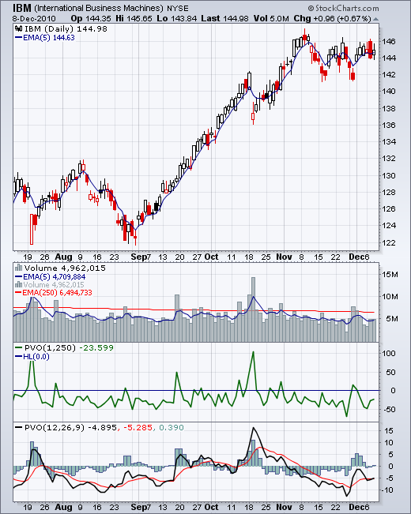
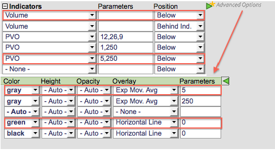

# 百分比成交量振荡器 [ChartSchool]

### 目录

+   百分比成交量振荡器

    +   介绍

    +   计算

    +   解释

    +   验证突破

    +   微调 PVO

    +   结论

    +   与 SharpCharts 一起使用

    +   建议的扫描

        +   PPO 带 PVO 正面的 PPO 穿越

        +   PVO 带 PVO 正面的 PPO 穿越

    +   进一步研究

## 介绍

百分比成交量振荡器（PVO）是一个用于成交量的动量振荡器。PVO 以较大移动平均线的百分比来衡量两个基于成交量的移动平均线之间的差异。与 MACD 和百分比价格振荡器（PPO）一样，它显示有信号线、直方图和中线。当较短的成交量 EMA 高于较长的成交量 EMA 时，PVO 为正；当较短的成交量 EMA 低于较长的成交量 EMA 时，PVO 为负。该指标可用于定义成交量的涨跌，然后可用于确认或否定其他信号。通常，当 PVO 上升或为正时，突破或支撑突破得到验证。

## 计算

```py
Percentage Volume Oscillator (PVO): 
((12-day EMA of Volume - 26-day EMA of Volume)/26-day EMA of Volume) x 100

Signal Line: 9-day EMA of PVO

PVO Histogram: PVO - Signal Line

```

PVO 的默认设置为 (12,26,9)，与 MACD 或 PPO 相同。这意味着当 12 天成交量 EMA 上穿 26 天成交量 EMA 时，PVO 为正。当 12 天成交量 EMA 下穿 26 天成交量 EMA 时，PVO 为负。

正负程度取决于远近。PVO 等于 5 表示 12 天成交量 EMA 比 26 天成交量 EMA 高 5%。PVO 等于 -3% 表示 12 天成交量 EMA 比 26 天成交量 EMA 低 3%。

PVO-Histogram 的作用类似于 MACD 和 PPO 直方图。当 PVO 在其信号线（9 天 EMA）上方交易时，PVO-Histogram 为正。当 PVO 低于其信号线时，PVO-Histogram 为负。请注意，PVO 乘以 100，以将小数点移动两位。



## 解释

一般来说，当 PVO 为正时，成交量高于平均水平，当 PVO 为负时，成交量低于平均水平。负值且上升的 PVO 表明成交量水平正在增加。正值且下降的 PVO 表明成交量水平正在减少。图表分析师可以利用这些信息来确认或否定价格图表上的运动。

尽管 PVO 基于动量振荡器公式，但重要的是要记住移动平均滞后。12 天的 EMA 携带了 12 天的成交量数据，数据更多地加权于最新数据。26 天的 EMA 滞后更多，因为它包含了 26 天的数据。这意味着 PVO(12,26,9)有时可能与价格走势不同步。

## 验证突破

百分比成交量振荡器（PVO）可用于确认支撑或阻力的突破。我们都听说过成交量验证价格走势。在成交量增加的情况下支撑位的突破比成交量较低的情况下更具可信度。同样，成交量扩大的情况下阻力位的突破显示出更多的买盘兴趣，从而增加成功的机会。

下图显示了 Volero（VLO）的 PVO(12,26,9)确认了继续图案的突破。随着 PVO 在 8 月下降，成交量直到 9 月中旬才下降。然后 PVO 转向上升，但直到 10 月下旬才进入正区域。这意味着 12 天成交量 EMA 最终超过了 26 天 EMA，成交量在增加。VLO 在第一个 PVO 交叉时仍然停留在继续图案中，但在第二个 PVO 交叉时突破了图案阻力。成交量证实了突破，VLO 继续上涨。



阿彻丹尼尔斯中部（ADM）的图表显示了 PVO 确认的支撑和阻力突破。股票在 8 月初突破了阻力位，同时 PVO 急剧上升进入正区域。在上涨突破时成交量扩大是看涨的。经过三个月的上涨，股票在跳空和 PVO 的另一次激增中突破了支撑位。请注意 PVO 两次激增到 20。这意味着 12 天成交量 EMA 比 26 天成交量 EMA 高约 20%。



## 微调 PVO

图表分析师可以微调 PVO 以突出特定时期的成交量激增。一年大约有 250 个交易日。因此，250 天的 EMA 将代表平均年度成交量，重点放在最近的时期。将其用于 PVO 中的长期 EMA，我们可以选择一个短期 EMA 来突出高于这个平均值的成交量激增。当 1 天成交量高于 250 天成交量 EMA 时，PVO(1,250)将为正。当 5 天成交量 EMA 高于 250 天 EMA 时，PVO(5,250)将为正。

Merck（MRK）的图表显示了带有 5 日 EMA 的蓝色和 250 日 EMA 的红色的成交量柱。 PVO（1,250）显示在第一个指标窗口中（绿色），而 PVO（5,250）显示在较低的指标窗口中（黑色）。 信号线未显示，因为没有输入参数。 PVO（5,250,9）将显示带有 9 日 EMA 的 PVO 作为信号线。



从上面的图表中，我们可以看到当一个成交量柱突破 250 日 EMA 时（绿色箭头），PVO（1,250）变为正。 当 5 日成交量 EMA 移动到 250 日成交量 EMA 之上时（蓝色箭头），PVO（5,250）变为正。 正如人们所预期的那样，PVO（1,250）更频繁地穿过零线，速度稍快一点。 基本上，当 PVO（1,250）为正时，成交量高于平均水平，为负时低于平均水平。 在高于平均水平的成交量上突破比低于平均水平的更稳健。 支撑突破也是如此。

## 结论

百分比成交量振荡器（PVO）是应用于成交量的动量指标。 成交量不趋势，因此这种振荡器可能非常波动。 PVO 不太适合牛市和熊市的背离。 相反，图表分析师最好寻找成交量增加并进入正区域的迹象，以及成交量减少并进入负区域的迹象。 成交量增加可以验证支撑或阻力突破。 同样，低成交量下的激增或重要支撑突破可能不够稳健。 与所有技术指标一样，重要的是将百分比成交量振荡器（PVO）与技术分析的其他方面结合使用，例如图表模式和动量振荡器。

## 使用 SharpCharts

PVO 可以设置为证券价格图的上方、下方或后方的指标。 一旦从下拉列表中选择指标，将显示默认参数（12,26,9）。 可以根据下面的示例调整这些参数。 单击“高级选项”以向指标添加移动平均线或水平线。 在下面的示例中，成交量被添加为指标两次，以显示两个移动平均线。 第二个成交量指标被放置在第一个成交量指标的后面（在 ind 后面），并且 EMA 设置为 250，使用高级选项。 [点击这里查看 PVO 的实时示例](http://stockcharts.com/h-sc/ui?s=IBM&p=D&yr=0&mn=6&dy=0&id=p28625227150&listNum=30&a=217316123 "http://stockcharts.com/h-sc/ui?s=IBM&p=D&yr=0&mn=6&dy=0&id=p28625227150&listNum=30&a=217316123")。





## 建议扫描

### PPO 穿越上行，PVO 为正

此扫描显示了 PPO(12,26,9) 上穿 PPO 信号线并且 PVO(12,26,9) 进入正区域以显示成交量增加的股票。此扫描仅作为进一步细化的起点。

```py
[type = stock] AND [country = US] 
AND [Daily SMA(20,Daily Volume) > 40000] 
AND [Daily SMA(60,Daily Close) > 20] 

AND [Daily PPO Line(12,26,9,Daily Close) crosses Daily PPO Signal(12,26,9,Daily Close)] 
AND [Daily PVO Line(12,26,9) crosses 0]
```

### PPO 穿越下行，PVO 为正

此扫描显示了 PPO(12,26,9) 下穿 PPO 信号线并且 PVO(12,26,9) 进入正区域以显示成交量增加的股票。此扫描仅作为进一步细化的起点。

```py
[type = stock] AND [country = US] 
AND [Daily SMA(20,Daily Volume) > 40000] 
AND [Daily SMA(60,Daily Close) > 20] 

AND [Daily PPO Signal(12,26,9,Daily Close) crosses Daily PPO Line(12,26,9,Daily Close)] 
AND [Daily PVO Line(12,26,9) crosses 0]
```

有关用于 PVO 扫描的语法的更多详细信息，请参阅我们的[扫描指标参考](http://stockcharts.com/docs/doku.php?id=scans:indicators#percentage_volume_oscillator "http://stockcharts.com/docs/doku.php?id=scans:indicators#percentage_volume_oscillator")在支持中心。

**注意**：为了扫描目的，交易日内的每日成交量数据是不完整的。在运行基于成交量的指标（如 PVO）的扫描时，请确保基于“最后市场收盘价”进行扫描。其他基于成交量的指标的示例包括积累/分布、钱德动量流和能量潮指标。

## 进一步研究

约翰·墨菲的书涵盖了技术分析的所有基础知识，其中有关成交量、未平仓合约和成交量指标的部分。墨菲讨论了成交量的重要性，并展示了许多图表示例。《技术分析入门》是一本附带 CD-Rom 的工作手册，其中包含超过 7 小时的视听呈现。普林格展示了如何应用、分析和解释图表以及成交量。

| **金融市场技术分析** 约翰·J·墨菲 |
| --- |
|  |
|  |
