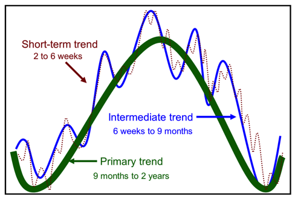
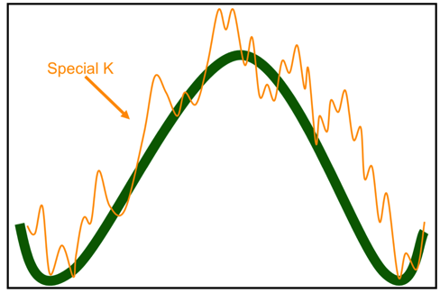
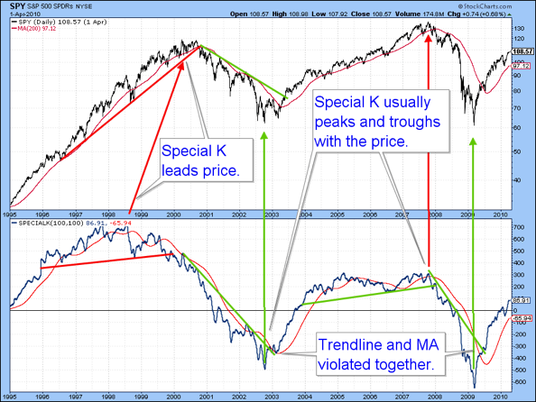
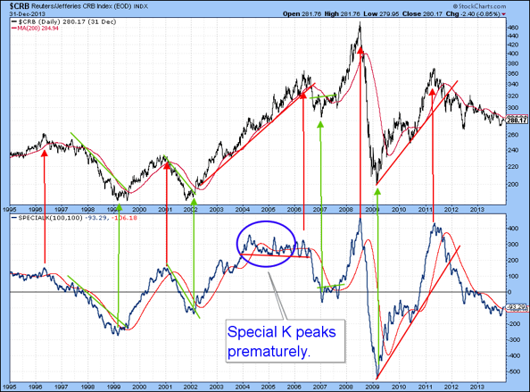
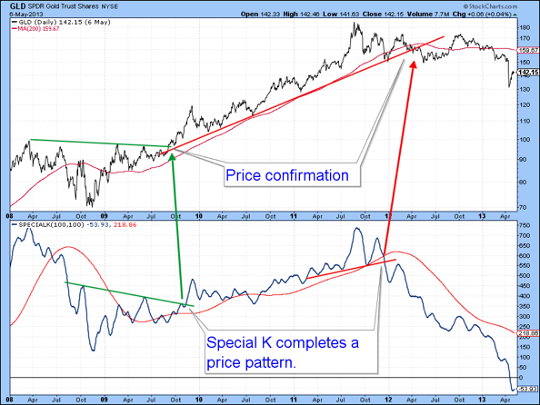
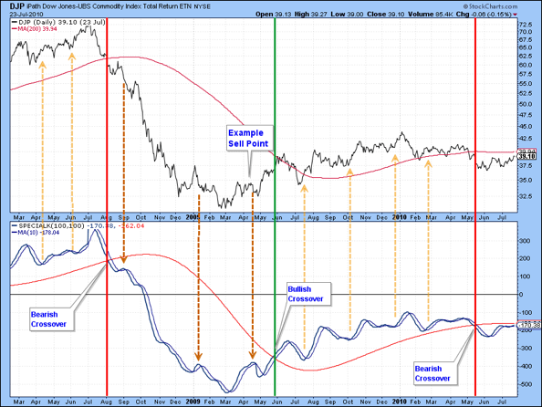
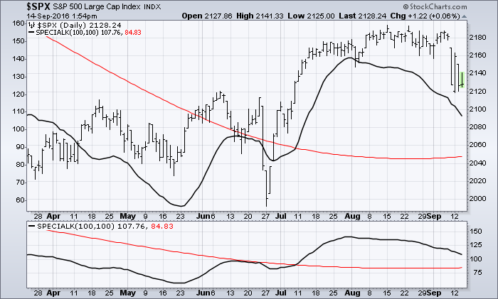
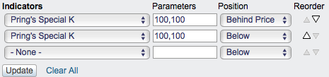

# 马丁·普林的特别K [ChartSchool]

### 目录

+   [马丁·普林的特别K](#martin_pring_s_special_k)

    +   [计算](#calculation)

    +   [使用特别K来识别长期价格走势](#using_the_special_k_to_identify_long-term_price_movements)

    +   [识别支持趋势短期买入和卖出信号](#identifying_pro_trend_short-term_buy_and_sell_signals)

    +   [使用SharpCharts](#using_with_sharpcharts)

    +   [建议扫描](#suggested_scans)

        +   [特别K看涨短期交叉](#special_k_bullish_short-term_cross)

        +   [特别K看跌短期交叉](#special_k_bearish_short-term_cross)

Pring特别K是由马丁·普林创造的动量指标，将短期、中期和长期速度合并为一个完整系列，从而给我们真正的总循环性。它有两个功能，第一是在相对早期阶段识别主要趋势反转，第二是利用该信息来确定短期支持趋势的价格波动。以下是所有三种趋势，如何以叠加的动量格式表达：



这里是（绿色）主要趋势和（橙色）特别K，实际上是前一张图中显示的短期趋势。



在理想情况下，特别K应该在牛市和熊市转折点的价格峰值和谷值几乎同时出现。在大多数情况下，实际上是这样的。当这种情况发生时，关键是尽可能快地在事后识别这些转折点。该公式假定价格围绕着四年的商业周期循环。因此，当出现线性上升趋势，例如90年代股票的长期牛市时，特别K会领先于转折点。另外，当周期被截断时，例如1987年的崩盘，该指标会延迟。图1和图2显示，大多数时候价格和SPK同时反转。

***特别K的主要功能是识别主要趋势的转折点。*** 由于该指标在计算中还包括短期数据，因此一个附带的好处在于识别较小的趋势，用于交易目的，并将其与主要趋势的方向和成熟度放在背景中。让我们考虑这两个方面，从主要趋势识别开始。

## 计算

特别K是几种不同变化率加权平均数的总和。这些周期和权重是基于多年的市场观察而选择的。

```py

  Special K = 10 Period Simple Moving Average of ROC(10) * 1
            + 10 Period Simple Moving Average of ROC(15) * 2
            + 10 Period Simple Moving Average of ROC(20) * 3
            + 15 Period Simple Moving Average of ROC(30) * 4
            + 50 Period Simple Moving Average of ROC(40) * 1
            + 65 Period Simple Moving Average of ROC(65) * 2
            + 75 Period Simple Moving Average of ROC(75) * 3
            +100 Period Simple Moving Average of ROC(100)* 4
            +130 Period Simple Moving Average of ROC(195)* 1
            +130 Period Simple Moving Average of ROC(265)* 2
            +130 Period Simple Moving Average of ROC(390)* 3
            +195 Period Simple Moving Average of ROC(530)* 4

```

请注意，至少需要725个数据点才能准确计算此指标。如果数据较少，则计算的最后一行将被跳过。

## 使用特别K来识别长期价格走势

事后看来，很容易发现特别K的转折点，并将其与主要趋势的峰值和谷值联系起来，如下图中的垂直箭头所示。不幸的是，由于交易员和投资者是实时工作的，他们没有事后的便利。以下是几种帮助发现主要趋势转折点的技术，使用特别K：

1.  由于特别K是一个相当参差不齐的指标，最适合用于趋势线构建。例如，如果违反了9个月或更长时间的趋势线，通常意味着特别K的主要趋势已经逆转，当指标改变趋势时，价格通常也会改变。

1.  通过特别K运行移动平均线是正常的。默认值是100天平滑的100天SMA。平均线的交叉通常表示主要趋势方向的逆转。偶尔，就像所有移动平均线情况一样，会触发鞭策。然而，当与趋势线突破结合时，会触发更强大和更可靠的信号。在上面的第一个图表中显示了2003年和2009年美国股市底部的例子，MA交叉和趋势线违规几乎同时发生。

1.  有时特别K会描绘价格模式。当它们被价格本身的某种趋势逆转所证实时，这通常代表了当前主要趋势逆转的有效指示。下面的GLD图表提供了两个例子。

[](http://stockcharts.com/h-sc/ui?s=SPY&p=D&st=1995-01-01&en=2010-04-01&id=p27191194097&a=351268055 "http://stockcharts.com/h-sc/ui?s=SPY&p=D&st=1995-01-01&en=2010-04-01&id=p27191194097&a=351268055")

[](http://stockcharts.com/h-sc/ui?s=$CRB&p=D&st=1995-01-01&en=2014-01-01&id=p91095913553&a=351269321 "http://stockcharts.com/h-sc/ui?s=$CRB&p=D&st=1995-01-01&en=2014-01-01&id=p91095913553&a=351269321")

[](http://stockcharts.com/h-sc/ui?s=GLD&p=D&st=2008-01-02&en=2013-05-06&id=p98657791953&a=351279812 "http://stockcharts.com/h-sc/ui?s=GLD&p=D&st=2008-01-02&en=2013-05-06&id=p98657791953&a=351279812")

需要注意的是，计算特别K的初始绘图需要数年的数据。要真正欣赏到这个指标提供的长期视角，需要额外的5-10年数据。这样就可以看到所讨论的证券是否经历了预期的周期性波动。大多数情况下是这样的，但偶尔会发现一些不是这样的。

## 识别Pro Trend短期买入和卖出信号

对于短期交易者来说，把握的最重要的事情之一是，沿着主要趋势方向执行的交易比反周期方式生成的交易更有可能成功。确定主要趋势方向的客观方法是使用特别K。显然，我们可以很容易地在事后知道实际的特别K峰值和谷底形成的位置，但在实时中我们没有这种奢侈。一个解决方案是确定其相对于其100日移动平均线的位置。正读数（即高于移动平均线）将表明主要是牛市，反之亦然。

当确定主要趋势方向为看涨时，从多头方向进行的交易将在特别K本身穿过其10日移动平均线时启动。下图中的橙色向上箭头表示这些交易。当特别K重新穿过其10日移动平均线时，交易将被平仓。空头交易将以相反的方式启动，即当特别K低于其长期移动平均线并穿过其10日移动平均线时。下图显示了道琼斯UBS商品指数的这样一个系统。绿色垂直线代表由特别K/100日移动平均线关系定义的牛市阶段的开始。

[](http://stockcharts.com/h-sc/ui?s=DJP&p=D&st=2008-02-14&en=2010-07-24&id=p13988319489&a=351486397 "http://stockcharts.com/h-sc/ui?s=DJP&p=D&st=2008-02-14&en=2010-07-24&id=p13988319489&a=351486397")

注意，在熊市期间不会产生买入信号，只会有卖出信号（棕色，向下箭头）。 “示例卖出点”表现不佳，因为它发生在牛市期间，但不幸的是，系统仍处于熊市模式，因为特别K低于其100日移动平均线，显示这种方法远非完美。与所有技术指标一样，与其盲目地将此方法作为机械系统使用，不如将其作为警报使用，并使用其他指标作为“证据权重”方法中的过滤器。

- 马丁·普林

## 使用SharpCharts

特别K可作为SharpCharts的指标使用。指标中的第一行是原始特别K值。第二行是原始特别K值的双重平滑移动平均线，作为信号线。

该指标可以放置在基础价格图的上方、下方或后方。将特别K直接放在价格图后面，突出了相对于基础证券价格走势的波动。

用户可以通过更改参数框中的数字来调整信号线设置。这两个参数指定了用于平滑的两个简单移动平均线的周期数。默认参数值为100,100。用户还可以应用“高级选项”以添加水平线。





## 建议扫描

### 特别K牛市短期交叉

此扫描显示特别K高于其信号线的股票。当特别K穿过其10日移动平均线时，将触发牛市信号。

```py
[type = stock] AND [country = US] 
AND [Daily SMA(20,Daily Volume) > 40000] 
AND [Daily SMA(60,Daily Close) > 20] 

AND [Special K > Special K Signal(100,100)]
AND [Special K x SMA(10,Special K)]
```

### 特别K熊市短期交叉

此扫描显示特别K低于其信号线的股票。当特别K穿过其10日移动平均线时，将触发熊市信号。

```py
[type = stock] AND [country = US] 
AND [Daily SMA(20,Daily Volume) > 40000] 
AND [Daily SMA(60,Daily Close) > 20] 

AND [Special K < Special K Signal(100,100)]
AND [SMA(10,Special K) x Special K]
```

有关特别K扫描使用的语法的更多详细信息，请参阅我们的[扫描指标参考](http://stockcharts.com/docs/doku.php?id=scans:indicators#pring_s_special_k "http://stockcharts.com/docs/doku.php?id=scans:indicators#pring_s_special_k")。
