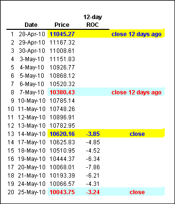
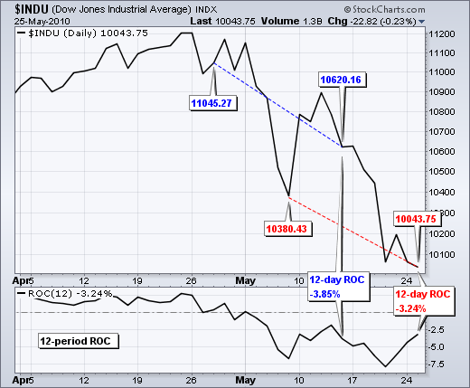
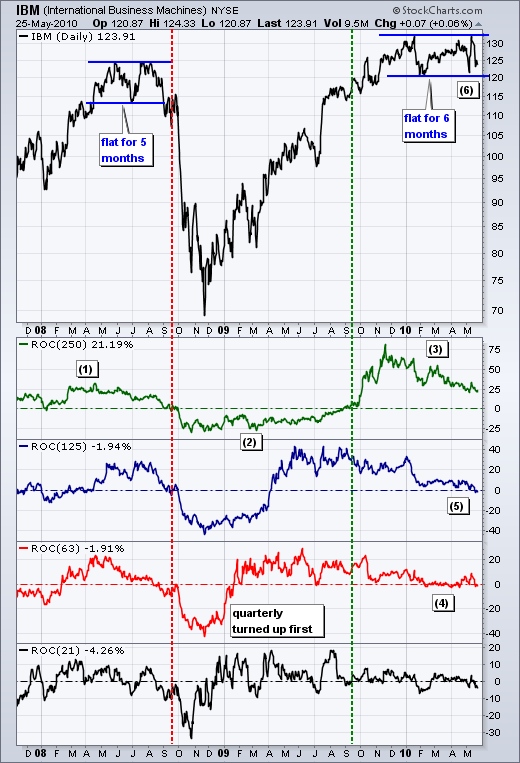
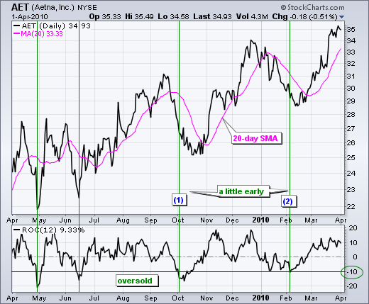
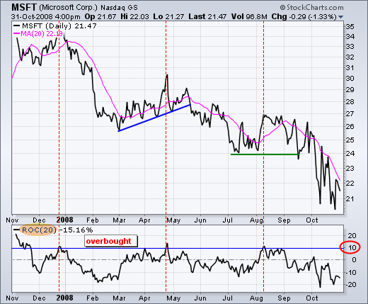
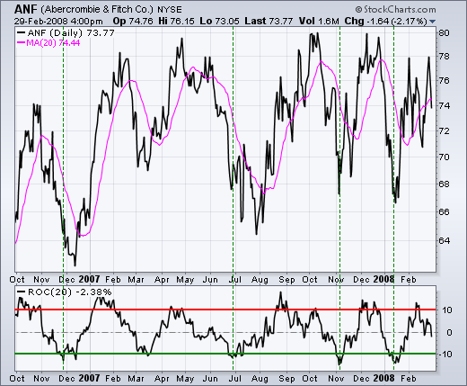
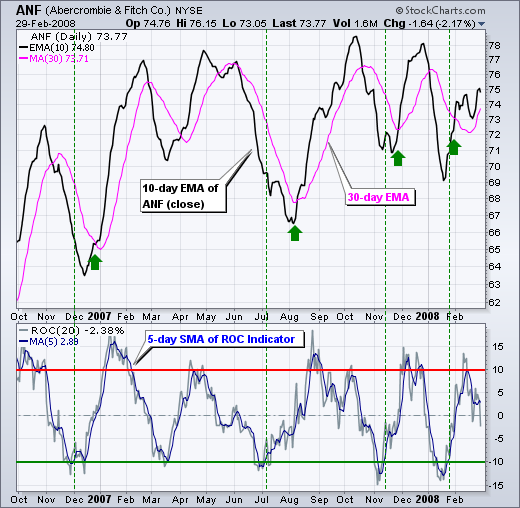
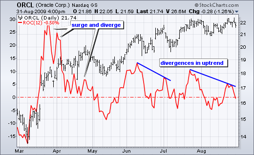
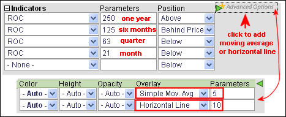

# 变动率（ROC）

### 目录

+   变动率（ROC）

    +   简介

    +   计算

    +   解释

    +   趋势识别

    +   超买/超卖极端

    +   结论

    +   使用 SharpCharts

    +   建议扫描

        +   超卖率变动率

        +   超买变动率

    +   进一步研究

## 简介

变动率（ROC）指标，也简称为动量，是一个纯粹的动量振荡器，它衡量了价格从一个时期到下一个时期的百分比变化。 ROC 计算将当前价格与“n”个时期前的价格进行比较。 绘图形成一个振荡器，随着变动率从正数变为负数而在零线上下波动。 作为一个动量振荡器，ROC 信号包括中线交叉、背离和超买-超卖读数。 背离往往不会预示逆转，因此本文将不讨论背离。 尽管中线交叉容易出现鞭策，特别是短期内，但这些交叉可以用来识别整体趋势。 识别超买或超卖极端对变动率振荡器来说是很自然的。

## 计算

```py
ROC = [(Close - Close n periods ago) / (Close n periods ago)] * 100

```



点击这里下载此电子表格示例。")



上表显示了 2010 年 5 月道琼斯工业指数的 12 天变动率计算。 黄色单元格显示了从 4 月 28 日到 5 月 14 日的变动率。 实际上是 13 个交易日，但 28 日的收盘价作为 29 日的起点。 蓝色单元格显示了从 5 月 7 日到 5 月 25 日的 12 天变动率。

## 解释

如上所述，变动率指标是动量的最纯粹形式。它衡量了在一定时间内价格的百分比增加或减少。可以将其视为上升（价格变动）与横向（时间）的比例。一般来说，只要变动率保持为正，价格就会上涨。相反，当变动率为负时，价格就会下跌。随着上涨加速，变动率扩展到正区域。随着下跌加速，变动率深入负区域。变动率没有上限。上涨的空间是无限的。然而，有一个下限。证券只能下跌 100%，即降至零。即使有这些不对称的边界，变动率产生可识别的极端情况，表明了高买入和超卖条件。

## 趋势识别

尽管动量振荡器最适合交易范围或之字形趋势，但它们也可以用来定义基础趋势的整体方向。一年大约有 250 个交易日。这可以分为每半年 125 天，每季度 63 天和每月 21 天。趋势反转始于最短时间框架，逐渐扩展到其他时间框架。一般来说，当 250 天和 125 天的变动率都为正时，长期趋势是上涨的。这意味着现在的价格比 12 个月和 6 个月前要高。6 个或 12 个月前的多头头寸将是盈利的，买家将会很高兴。



图表 2 显示了 IBM 的 250 天、125 天、63 天和 21 天变动率。在过去三年中有三个大趋势。第一个是上涨的，因为 250 天的变动率在 2008 年 9 月之前大部分为正（1）。第二个是下跌的，因为指标从 2008 年 10 月至 2009 年 9 月变为负（2）。第三个是上涨的，因为指标在 2009 年 9 月底变为正（3）。尽管大的上升趋势仍在继续，IBM 在价格图表上趋于平稳，这影响了 125 天和 63 天的变动率。63 天的变动率（季度）自 2 月以来一直在负区域徘徊（4）。125 天的变动率（六个月）自 2009 年 4 月以来首次跌入负区域（5）。这显示了 IBM 的一些恶化情况，提醒要仔细观察该股。跌破六个月交易范围将是一个熊市发展（6）的迹象。

## 高买入/超卖极端

基本上有三种价格走势：上涨、下跌和横盘。 动量振荡器非常适合处理有规律波动的横盘价格走势。 这使得更容易识别极端点并预测转折点。 当价格趋势时，证券价格也会波动。 例如，上涨趋势由一系列高点和低点组成，价格在上涨时曲折前进。 回撤通常会根据百分比变动、经过的时间或两者同时发生的规则间隔而定期发生。 下跌趋势由一系列低点和高点组成，价格在下跌时曲折下降。 反向趋势上涨会回撤前一次下跌的一部分，并且通常会在前一高点以下达到峰值。 峰值可能会根据百分比变动、经过的时间或两者同时发生的规则间隔定期发生。 变动率指标可用于识别百分比变动接近过去预示转折点的水平的时期。



图表 3 显示了 Aetna（AET）从 2009 年 4 月至 2010 年 4 月的上升趋势。 请注意股票如何曲折上升，形成一系列高点和低点。 由于总体趋势是上升的，变动率指标被用来识别短期超卖水平，作为参与更大上升趋势的机会。 短期超买信号被忽略，因为更大的趋势是上升的。 基于 5 月至 6 月的反弹，将-10%设定为超卖边界。 低于此水平的波动表明价格处于短期极端水平。 超买和超卖设置取决于基础证券的波动性。 更具波动性的股票可能会使用-15%作为超卖水平，而波动性较小的股票可能会使用-5%。 超卖读数作为警报，准备好转折点。 价格虽然超卖，但尚未实际转折。 记住，证券可能会变得超卖，并在下跌继续时保持超卖。 叠加了 20 天的移动平均线以识别实际的上升趋势。 在 10 月初变动率指标超卖后，AET 在 10 月底突破了其 20 天 SMA 以确认上升趋势（1）。 第二次超卖读数发生在 2 月初，AET 在 2 月底突破了其 20 天 SMA 以确认上升趋势（2）。



图表 4 显示了微软（MSFT）从 2007 年 11 月至 2009 年 3 月处于下降趋势。这个例子使用了一个 20 天的变动率指标来识别更大下降趋势中的超卖水平。时间周期的数量取决于个别证券和所需的交易时间框架。12 月底的高点出现在超买读数超过+10%的情况下。这意味着微软在 20 天内上涨超过 10%，大约一个月的时间。这是在更大的下降趋势中一个相当不错的反弹。下一个超买读数直到 4 月才出现，当变动率再次超过+10%。微软在 5 月突破了趋势线支撑，表明下降趋势将继续。下一个超买读数出现在 2008 年 8 月初。虽然花了一些时间，但股票最终在 9 月中旬和 10 月初再次突破了 24 的支撑位。



图表 5 显示了艾伯克龙比与菲奇（ANF）在 2006 年 10 月至 2008 年 2 月的交易范围内。20 天的变动率指标将超买设定为+10%，超卖设定为-10%。超买和超卖水平很好地识别了极端情况，但由于波动性较大，实际转折的时间更难确定。下一个图表通过使用指数移动平均线代替价格图来减少这种波动性。



图表 6 显示了 ANF 作为一个 10 天的 EMA（黑色），实际价格图是不可见的。一个 30 天的 EMA 被叠加在上面作为信号线。此外，20 天的变动率指标显示了一个 5 天的 SMA 来平滑波动。使用 5 天的 SMA 会减少超买和超卖的读数。只关注买入信号，绿色虚线显示了当 ROC 超过-10%时的情况，绿色箭头显示了 10 天 EMA 穿过 30 天 SMA 时的情况。超卖读数通常较早，但移动平均线交叉通常较晚。这就是技术分析的生活。这里的重点是通过平滑数据来减少市场波动。使用 10 天 EMA 是因为它比 10 天 SMA 更快。使用 30 天 SMA 是因为它比 30 天 EMA 更慢。加快较短的移动平均线，减慢较长的移动平均线会产生稍微更快的信号。

## 结论

变动率振荡器测量价格变动的速度。变动率的上升反映了价格的急剧上涨。急剧下跌表示价格急剧下降。尽管图表分析师可以寻找多头和空头背离，但由于价格的急剧波动，这些形态可能会误导。持续的上涨通常始于大幅上涨。随后的上涨通常不那么尖锐，这导致变动率振荡器中形成空头背离。重要的是要记住，只要变动率保持为正，价格就在不断上涨。正读数可能比以前少，但正变动率仍反映价格上涨，而不是价格下跌。与所有技术指标一样，变动率振荡器应与技术分析的其他方面结合使用。



## 使用 SharpCharts

变动率可以设置为一个指标，位于证券价格图表的上方、下方或后方。一旦从下拉列表中选择指标，就会显示默认参数设置（12）。可以调整此参数以增加或减少灵敏度。用户可以通过点击“高级选项”并选择叠加来添加移动平均线。移动平均线可用作信号线或仅用于平滑数据。还可以添加水平线以标记超买或超卖水平。[点击这里查看变动率的实时示例](http://stockcharts.com/h-sc/ui?s=$COMPQ&p=D&b=5&g=0&id=p79327039629&listNum=30&a=201216941 "http://stockcharts.com/h-sc/ui?s=$COMPQ&p=D&b=5&g=0&id=p79327039629&listNum=30&a=201216941")。



## 建议的扫描

### 超卖变动率

这个扫描显示出具有正 125 天变动率和超卖 21 天变动率（低于 -8%）的股票。一旦满足这些条件，当股票收盘价高于 20 天简单移动平均线时，就会触发一个多头信号。

```py
[type = stock] AND [country = US] 
AND [Daily SMA(20,Daily Volume) > 40000] 
AND [Daily SMA(60,Daily Close) > 20] 

AND [Daily ROC(125,Daily Close) > 0] 
AND [Daily ROC(21,Daily Close) < -8] 
AND [Yesterday's Daily Close < Yesterday's Daily SMA(20,Daily Close)] 
AND [Daily Close > Daily SMA(20,Daily Close)]
```

### 超买变动率

这个扫描显示出具有负 125 天变动率和超买 21 天变动率（超过 8%）的股票。一旦满足这些条件，当股票收盘价低于 20 天简单移动平均线时，就会触发一个空头信号。

```py
[type = stock] AND [country = US] 
AND [Daily SMA(20,Daily Volume) > 40000] 
AND [Daily SMA(60,Daily Close) > 20] 

AND [Daily ROC(125,Daily Close) < 0] 
AND [Daily ROC(21,Daily Close) > 8] 
AND [Yesterday's Daily Close > Yesterday's Daily SMA(20,Daily Close)] 
AND [Daily Close < Daily SMA(20,Daily Close)]
```

有关 ROC 扫描的语法细节，请参阅我们支持中心的[扫描指标参考](http://stockcharts.com/docs/doku.php?id=scans:indicators#rate_of_change_roc "http://stockcharts.com/docs/doku.php?id=scans:indicators#rate_of_change_roc")。

## 进一步研究

《金融市场技术分析》一书专门讨论了动量振荡器及其各种用途。墨菲涵盖了利弊以及一些特定于变动率的示例。普林的书展示了通过涵盖背离、交叉和其他信号来解释动量指标的基础知识。还有两章涵盖了具体的动量指标，并提供了大量示例。

| **金融市场技术分析** 约翰·J·墨菲 | **马丁·普林解读技术分析** 马丁·普林 |
| --- | --- |
|  |  |
|  |  |
