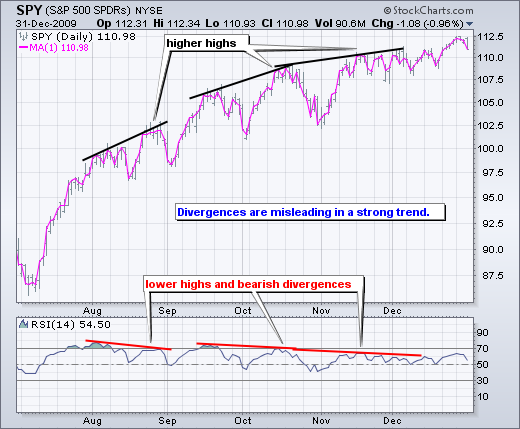
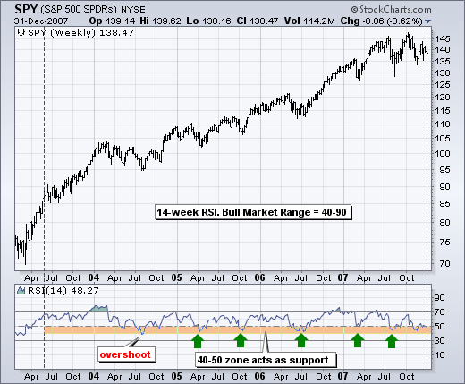

# 相对强度指数（RSI）

### 目录

+   相对强度指数（RSI）

    +   介绍

    +   计算

    +   参数

    +   超买-超卖

    +   背离

    +   失败摆动

    +   趋势识别

    +   正负反转

    +   结论

    +   与 SharpCharts 一起使用

    +   建议扫描

        +   RSI 超卖在上升趋势中

        +   RSI 超买在下跌趋势中

    +   进一步研究

    +   额外资源

        +   股票与商品杂志文章

## 介绍

由 J. Welles Wilder 开发，相对强度指数（RSI）是一个衡量价格运动速度和变化的动量振荡器。RSI 在零和 100 之间波动。传统上，根据 Wilder 的说法，当 RSI 超过 70 时被认为是超买的，当低于 30 时被认为是超卖的。信号也可以通过寻找背离、失败摆动和中线交叉来生成。RSI 也可以用来识别一般趋势。

RSI 是一个极其流行的动量指标，多年来在许多文章、采访和书籍中都有涉及。特别是，康斯坦斯·布朗的书《专业交易技术分析》介绍了 RSI 的牛市和熊市范围的概念。布朗的 RSI 导师安德鲁·卡德威尔为 RSI 引入了正负反转。此外，卡德威尔颠覆了背离的概念，字面上和比喻上都是如此。

Wilder 在他的 1978 年的书中介绍了 RSI，*技术交易系统中的新概念*。这本书还包括了抛物线 SAR、真实波幅和方向运动概念（ADX）。尽管在计算机时代之前开发，Wilder 的指标经受住了时间的考验，仍然非常受欢迎。

## 计算

```py
                  100
    RSI = 100 - --------
                 1 + RS

    RS = Average Gain / Average Loss

```

为了简化计算说明，RSI 已经被分解为其基本组成部分：**RS**，**平均增益**和**平均损失**。这个 RSI 计算基于 14 个周期，这是 Wilder 在他的书中建议的默认值。损失被表示为正值，而不是负值。

第一次的平均增益和平均损失计算是简单的 14 个周期平均值。

+   第一次平均增益 = 过去 14 个周期的增益总和 / 14。

+   第一次平均损失 = 过去 14 个周期的损失总和 / 14

第二次以及后续的计算基于先前的平均值和当前的盈亏：

+   平均增益 = [(前一次平均增益) x 13 + 当前增益] / 14。

+   平均损失 = [(前一个平均损失) x 13 + 当前损失] / 14。

将先前值加上当前值是一种平滑技术，类似于计算指数移动平均值时使用的技术。这也意味着随着计算周期的延长，RSI 值会变得更准确。SharpCharts 在计算其 RSI 值时，会使用至少 250 个数据点作为起始日期之前的数据点（假设存在这么多数据）。要精确复制我们的 RSI 数值，公式将需要至少 250 个数据点。

Wilder 的公式对 RS 进行归一化，并将其转化为在零和 100 之间波动的振荡器。实际上，RS 的图与 RSI 的图完全相同。归一化步骤使得更容易识别极端值，因为 RSI 是区间限制的。当平均收益等于零时，RSI 为 0。假设为 14 期的 RSI，零的 RSI 值意味着价格在所有 14 期内下跌。没有增益可测量。当平均损失等于零时，RSI 为 100。这意味着价格在所有 14 期内上涨。没有损失可测量。


这里有一个展示 RSI 计算开始过程的 Excel 电子表格")。

注意：平滑过程会影响 RSI 值。RS 值在第一次计算后会被平滑处理。平均损失等于前 14 次损失之和除以 14 进行第一次计算。后续计算会将先前值乘以 13，加上最新值，然后总和除以 14。这样就产生了平滑效果。平均收益也是如此。由于这种平滑处理，RSI 值可能会根据总计算周期而有所不同。250 个周期将比 30 个周期具有更多的平滑效果，这会稍微影响 RSI 值。Stockcharts.com 在可能的情况下回溯 250 天。如果平均损失等于零，则 RS 会出现“除以零”的情况，根据定义 RSI 被设定为 100。同样，当平均收益等于零时，RSI 等于 0。

## 参数

RSI 的默认回溯期为 14，但可以降低以增加灵敏度或提高以减少灵敏度。10 天的 RSI 更有可能达到超买或超卖水平，而不是 20 天的 RSI。回溯参数还取决于证券的波动性。互联网零售商亚马逊（AMZN）的 14 天 RSI 更有可能变得超买或超卖，而公用事业公司杜克能源（DUK）的 14 天 RSI 则不太可能。

当 RSI 大于 70 时被认为是超买，小于 30 时被认为是超卖。这些传统水平也可以调整以更好地适应证券或分析要求。将超买调高到 80 或将超卖调低到 20 将减少超买/超卖读数的数量。短期交易者有时使用 2 周期 RSI 寻找超买读数高于 80 和超卖读数低于 20。

## 超买-超卖

Wilder 认为 RSI 在 70 以上为超买，在 30 以下为超卖。图表 3 显示了麦当劳的 14 天 RSI。这张图表以灰色显示每日柱状图，粉色显示 1 天的简单移动平均线，以突出收盘价，因为 RSI 是基于收盘价计算的。从左到右，股票在七月底变得超卖，并在 44 左右找到支撑（1）。请注意，底部在超卖读数之后才逐渐形成。股票并没有在超卖读数出现后立即触底。触底可能是一个过程。从超卖水平，RSI 在九月中旬上升到 70 以上成为超买。尽管出现这种超买读数，股票并没有下跌。相反，股票在停滞了几周后继续上涨。在股票最终在十二月达到顶峰之前，还发生了三次超买读数（2）。动量振荡器在强劲的上升（下降）趋势中可能会变得超买（超卖）并保持在这种状态。前三次超买读数预示着整理。第四次与一个重要的高点相吻合。随后，RSI 从超买转为超卖。最终的底部并不与最初的超卖读数相吻合，因为股票最终在 46 左右几周后触底（3）。


与许多动量振荡器一样，RSI 的超买和超卖读数在价格在范围内横向移动时效果最佳。图表 4 显示了 MEMC Electronics (WFR) 在 2009 年 4 月至 9 月间在 13.5 和 21 之间交易。股票在 RSI 达到 70 后很快达到顶峰，并在股票达到 30 后很快触底。


## 背离

根据怀尔德的说法，背离信号可能预示着潜在的反转点，因为方向动量不确认价格。当基础证券创造一个较低的低点而 RSI 形成一个较高的低点时，就会出现看涨的背离。RSI 不确认较低的低点，这显示了动量的增强。当证券记录一个较高的高点而 RSI 形成一个较低的高点时，就会形成看跌的背离。RSI 不确认新高点，这显示了动量的减弱。图表 5 展示了 Ebay（EBAY）在 8 月至 10 月出现的一个看跌的背离。股票在 9 月至 10 月创新高，但 RSI 形成了较低的高点，显示了动量的减弱。随后在 10 月中旬的突破确认了动量的减弱。


一次看涨的背离形成于一月至三月。这次看涨的背离是在 eBay 在三月创新低时形成的，而 RSI 保持在先前低点之上。在二月至三月的下跌中，RSI 反映出较少的下行动量。三月中旬的突破确认了动量的改善。当背离形成在超买或超卖读数之后时，背离往往更加稳健。

在对背离作为出色交易信号感到兴奋之前，必须注意到，在强劲趋势中，背离是具有误导性的。在顶部实际出现之前，强劲的上升趋势可能显示出许多看跌的背离。相反，在强劲的下降趋势中可能出现看涨的背离 - 然而下降趋势仍在继续。图表 6 展示了标普 500 ETF（SPY）出现了三次看跌的背离，但趋势仍在持续上升。这些看跌的背离可能已经警告了短期回调，但显然没有主要的趋势逆转。



## 失败摆动

怀尔德还将失败摆动视为即将发生反转的强烈迹象。失败摆动独立于价格行动。换句话说，失败摆动仅关注 RSI 信号，忽略了背离的概念。当 RSI 下降至 30 以下（超卖），反弹至 30 以上，回落，保持在 30 以上，然后突破先前的高点时，就形成了一个看涨的失败摆动。基本上是一个移动到超卖水平然后在超卖水平以上形成一个较高的低点。图表 7 展示了研究中的运动（RIMM）形成了一个 10 天 RSI 的看涨失败摆动。


当 RSI 上升至 70 以上，回落，反弹，未能超过 70，然后突破先前的低点时，形成了一个看跌的失败摆动。基本上是一个移动到超买水平然后在超买水平以下形成一个较低的高点。图表 8 展示了 2008 年 5 月至 6 月德州仪器（TXN）的一个看跌的失败摆动。


## 趋势识别

在《专业交易技术分析》中，康斯坦斯·布朗建议振荡器不会在 0 和 100 之间波动。这也恰好是第一章的名字。布朗确定了 RSI 的牛市范围和熊市范围。在牛市（上升趋势）中，RSI 倾向于在 40 和 90 之间波动，40-50 区域充当支撑。这些范围可能会根据 RSI 参数、趋势强度和基础证券的波动性而变化。图表 9 显示了 2003 年至 2007 年间 SPY 的 14 周 RSI 在牛市中的情况。RSI 在 2003 年底上升到 70 以上，然后进入了牛市范围（40-90）。2004 年 7 月有一次低于 40 的超卖，但 RSI 至少在 2005 年 1 月至 2007 年 10 月之间五次保持在 40-50 区域（绿色箭头）。事实上，注意到回调到这个区域提供了参与上升趋势的低风险入场点。



另一方面，在熊市（下降趋势）中，RSI 倾向于在 10 和 60 之间波动，50-60 区域充当阻力。图表 10 显示了美元指数（$USD）在 2009 年下跌趋势中的 14 天 RSI。RSI 在 3 月上升到 30，标志着熊市的开始。随后的 40-50 区域标志着阻力，直到 12 月突破。


## 正负向反转

安德鲁·卡德威尔为 RSI 开发了正向和负向反转，这与熊市和牛市背离相反。卡德威尔的书已经绝版，但他提供了详细介绍这些方法的研讨会。康斯坦斯·布朗将她的 RSI 领悟归功于安德鲁·卡德威尔。在讨论反转技术之前，应该注意卡德威尔对背离的解释与怀尔德的不同。卡德威尔认为熊市背离是牛市现象。换句话说，熊市背离更有可能在上升趋势中形成。同样，牛市背离被认为是熊市现象，表明了下降趋势。

当 RSI 形成一个较低的低点，而证券形成一个较高的低点时，就形成了一个正向反转。这个较低的低点并不处于超卖水平，而通常在 30 和 50 之间。图表 11 显示了 2009 年 6 月 MMM 中形成的一个正向反转。几周后，MMM 突破了阻力，RSI 上升到 70 以上。尽管 RSI 低点较低，动量较弱，但 MMM 仍然保持在先前的低点之上，显示出潜在的强势。实质上，价格行动胜过了动量。


负反转是正反转的相反。RSI 形成了一个更高的高点，但证券形成了一个更低的高点。同样，更高的高点通常位于 50-70 区域的超买水平以下。图表 12 显示了星巴克（SBUX）形成了一个更低的高点，而 RSI 形成了一个更高的高点。尽管 RSI 形成了一个新高点且动量强劲，但价格走势未能确认，形成了更低的高点。这种负反转预示了 6 月底的重要支撑位突破和急剧下跌。


## 结论

RSI 是一个经受时间考验的多功能动量振荡器。尽管多年来市场和波动性发生了变化，但 RSI 仍然像 Wilder 时代一样重要。尽管 Wilder 的原始解释对于理解指标很有用，但 Brown 和 Cardwell 的工作将 RSI 的解释提升到了一个新的水平。适应这个水平需要传统学校派图表分析师重新思考。Wilder 认为超买条件是反转的良机，但超买也可能是强势的迹象。虽然熊市背离仍然产生一些良好的卖出信号，但在强势趋势中，当熊市背离实际上是正常的时候，图表分析师必须小心。尽管正负反转的概念似乎削弱了 Wilder 的解释，但逻辑是合理的，Wilder 几乎不会否认更加强调价格走势的价值。正负反转将基础证券的价格走势放在首位，指标放在次要位置，这才是正确的方式。熊市和牛市背离将指标放在首位，价格走势放在次要位置。通过更加强调价格走势，正负反转的概念挑战了我们对动量振荡器的思考方式。

## 与 SharpCharts 一起使用

RSI 可作为 SharpCharts 的指标。一旦选择，用户可以将指标放置在基础价格图表的上方、下方或后方。将 RSI 直接放在价格图表的顶部，突出显示了相对于基础证券价格走势的波动。用户可以应用“高级选项”来通过移动平均线平滑指标，或者添加水平线来标记超买或超卖水平。


## 建议的扫描

### 上升趋势中的 RSI 超卖

这个扫描显示了处于上升趋势且 RSI 超卖的股票。首先，股票必须在它们的 200 日移动平均线之上，才能处于总体上升趋势中。其次，RSI 必须跌破 30 才能变为超卖状态。

```py
[type = stock] AND [country = US] 
AND [Daily SMA(20,Daily Volume) > 40000] 
AND [Daily SMA(60,Daily Close) > 20] 

AND [Daily Close > Daily SMA(200,Daily Close)] 
AND [Daily RSI(5,Daily Close) <= 30]
```

### 下跌趋势中的 RSI 超买

此扫描显示处于下降趋势并且超买的 RSI 转向下的股票。首先，股票必须低于它们的 200 天移动平均线才能处于总体下降趋势。其次，RSI 必须上穿 70 才能变为超买状态。

```py
[type = stock] AND [country = US] 
AND [Daily SMA(20,Daily Volume) > 40000] 
AND [Daily SMA(60,Daily Close) > 20] 

AND [Daily Close < Daily SMA(200,Daily Close)] 
AND [Daily RSI(5,Daily Close) >= 70]
```

有关用于 RSI 扫描的语法的更多详细信息，请参阅我们的[扫描指标参考](http://stockcharts.com/docs/doku.php?id=scans:indicators#relative_strength_index_rsi "http://stockcharts.com/docs/doku.php?id=scans:indicators#relative_strength_index_rsi")在支持中心。

## 进一步研究

康斯坦斯·布朗的书将 RSI 提升到一个新水平，包括牛市和熊市范围，正面和负面反转，以及基于 RSI 的预测。书中还解释和完善了她的 RSI 导师安德鲁·卡德威尔的一些方法。

| **专业交易技术分析** Constance Brown |
| --- |
|  |
|  |

* * *

## 其他资源

### 股票与商品杂志文章

**[布鲁斯·法伯的相对强弱指数](http://stockcharts.com/h-mem/tascredirect.html?artid=\V12\C09\FABER.pdf "http://stockcharts.com/h-mem/tascredirect.html?artid=\V12\C09\FABER.pdf")**

1994 年 8 月 - 股票与商品 V. 12:9 (381-384)

**[通过相对强弱指数提高胜负比例的方法，作者托马斯·布尔科斯基](http://stockcharts.com/h-mem/tascredirect.html?artid=\V16\C03\017WIN.pdf "http://stockcharts.com/h-mem/tascredirect.html?artid=\V16\C03\017WIN.pdf")**

1998 年 2 月 - 股票与商品 V. 16:3 (111-121)
