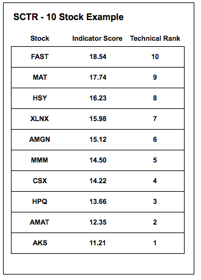
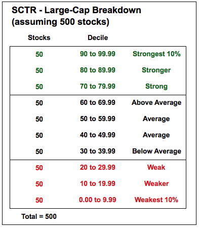
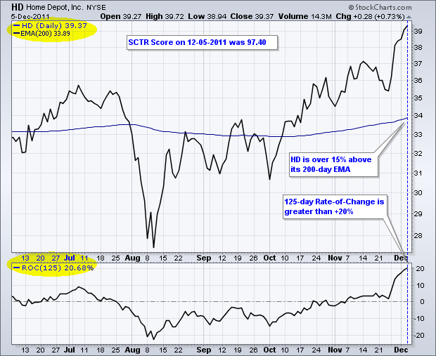
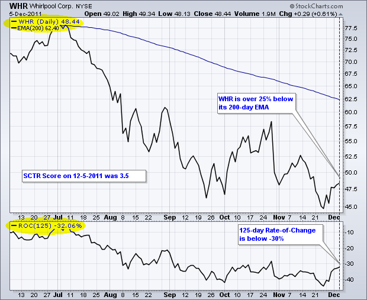
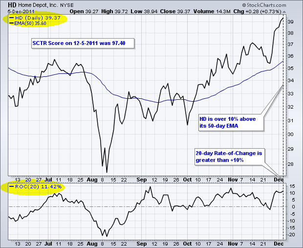
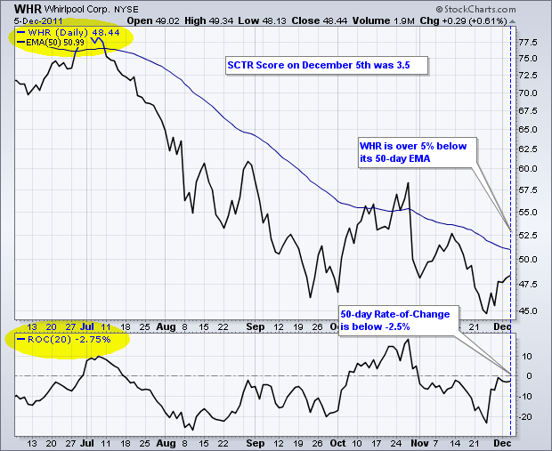
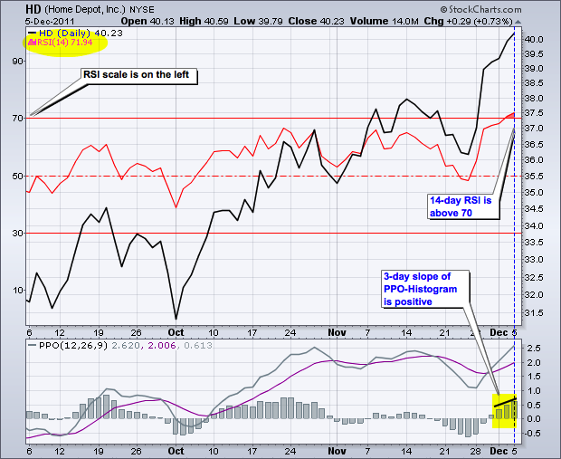
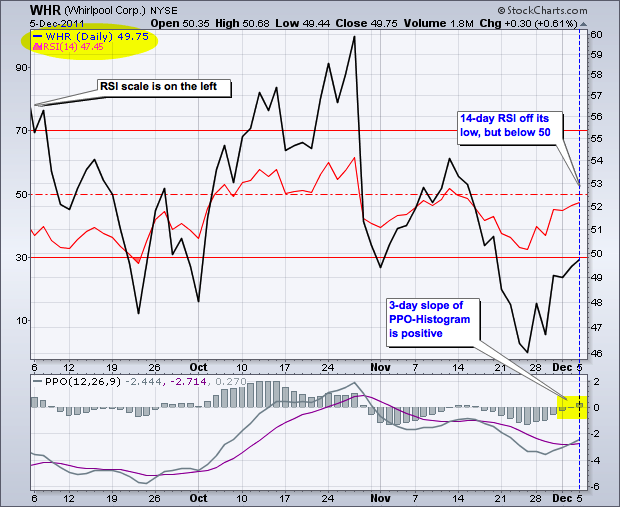
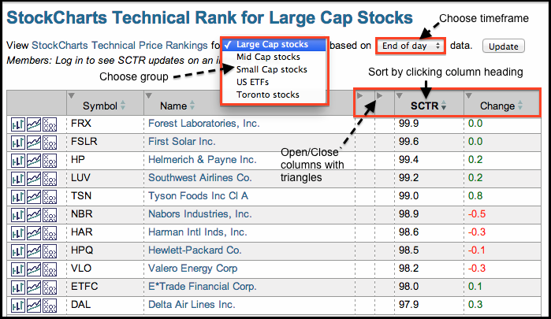

# StockCharts 技术排名（SCTR）[ChartSchool]

### 目录

+   StockCharts 技术排名（SCTR）

    +   介绍

    +   计算

    +   解释

    +   SCTR 宇宙

    +   长期指标

    +   中期指标

    +   短期指标

    +   使用 SCTR

    +   结论

    +   建议扫描

        +   SCTR 超过 90

        +   SCTR 创新高

    +   常见问题

## 介绍

StockCharts 技术排名（SCTR）是对一组股票中的股票进行排名的数值分数。这些排名的方法来自于约翰·墨菲（John Murphy）的智慧，他是技术分析领域的多本书籍的作者，也是 StockCharts.com 的 Market Message 的贡献者。股票根据六个关键指标得分，这些指标涵盖不同的时间范围。然后这些指标得分被排序并分配一个技术排名。使用 SCTR 表，图表分析师可以根据它们的技术排名对股票进行排序。这样就很容易识别特定组内的技术领导者和落后者。请注意，杠杆和反向 ETF 在 ETF 宇宙中被排除在 SCTR 排名之外。高于平均波动率和反向运动会扭曲结果。VIX ETF（VXX）也被排除在外，因为它与标普 500 指数呈反向运动。

## 计算

计算 StockCharts 技术排名（SCTR）需要两个步骤。首先，根据六个不同的技术指标对每支股票进行“评分”。这六个指标可以细分为长期、中期和短期三组。下面的框详细介绍了这些指标、相关时间范围和权重。

```py
Long-Term Indicators (weighting)
--------------------------------

  * Percent above/below 200-day EMA (30%)
  * 125-Day Rate-of-Change (30%)

Medium-Term Indicators (weighting)
----------------------------------

  * Percent above/below 50-day EMA (15%)
  * 20-day Rate-of-Change (15%)

Short-Term Indicators (weighting)
---------------------------------

  * 3-day slope of PPO-Histogram (5%)
  * 14-day RSI (5%)

```

除了 PPO-Histogram 的 3 天斜率外，原始数字用于计算指标得分。例如，如果一支股票比其 200 天移动平均线高出 15%，那么这个指标将为总指标得分贡献 4.5 分（15 x 0.30 = 4.5）。如果 20 天变动率为 -7%，那么这个指标将为总指标得分贡献 -1.05 分（-7 x 0.15 = -1.05）。

对于 PPO-Histogram，如果其斜率大于 +1（即 +45 度），则会为总指标得分贡献 5 分（100 的 5%）。如果 PPO-Histogram 的斜率小于 -45 度，则不会贡献分数。否则，将贡献 ((斜率 + 1) x 50) 的 5%。

在第一轮计算后，StockCharts.com 根据它们的指标得分对这些股票进行排名。请记住，这些股票仅在其组内（如大盘股、中盘股和小盘股）中排名。本文首先将展示一个简化的例子，使用按指标得分排序的十只股票。得分最高的股票获得最高的技术排名（10），而得分最低的股票获得最低的技术排名（1）。然后根据指标得分填充排名。



StockCharts 技术排名提供了更详细的信息。首先，排名范围从 0.00 到 99.99，0 表示绝对最弱，而 99.99 表示绝对最强。没有股票会得到完美的 100 分。其次，StockCharts.com 创建“桶”来对组内的股票进行排序。这些类似于百分位数。以一个包含 500 只股票的范围为例，将创建十个相等的桶，每个桶中有 50 只股票（50 x 10 = 500）。得分最低的 50 只股票进入底部桶，其 SCTR 范围从 0 到 10。得分最高的 50 只股票进入顶部桶，其 SCTR 范围从 90 到 99.99。然后，每个桶将相应填充并在桶内进一步排序。最终结果是 500 只股票从 0 到 99.99 排名，并在排名池中相对均匀地分布。

## 解释

指标得分独特而强大，因为它涵盖了多个时间框架。它不受限于特定的时间框架。股票必须在所有指标和所有时间框架上表现良好才能获得顶级指标得分和技术排名。指标得分更加重视两个长期指标，这占总分的 60%。这是有道理的，因为长期趋势是最强大的力量。随着评分转向短期指标，权重会下降。中期指标占 30%，短期指标占 10%。长期和中期指标共占总分的 90%。

StockCharts 技术排名显示了一只股票相对于同行的表现，而不是相对于基准指数。例如，标普 500 等指数主要由大盘股主导，可能并不能真正反映整个市场。与将一个指数作为基准相比，SCTR 对特定范围内的所有股票进行排序，例如大盘股、中盘股和小盘股。在这方面，图表分析师可以看到苹果相对于亚马逊、IBM 和其他大盘股的表现。



SCTR 表格可以轻松排序，将最强势的股票与最弱势的股票分开。在任何给定的 SCTR 宇宙中，前 10%的排名将在 90 和 100 之间，而底部 10%的排名将在 0 和 10 之间。得分为 50 的股票将是平均水平，既不显示相对强势也不显示相对弱势。一般来说，40 到 60 之间的得分被认为是平均水平。当得分低于 40 时，技术上的弱点开始显现。当得分超过 60 时，技术上的强势开始显现。

## SCTR 宇宙

要使股票具有 SCTR 值，首先必须属于一个“宇宙”。宇宙是由 StockCharts.com 建立的大量股票组成的群体，用于相对强度排名。一只股票一次只能属于一个 SCTR 宇宙。目前，我们使用国家和/或市值来确定股票属于哪个宇宙。

这里是我们支持的当前 SCTR 宇宙列表：

+   **大盘股** - 美国股票，是标准普尔 500 指数的组成部分（或过去曾是）。

+   **小盘股** - 美国股票，是罗素 2000 指数的组成部分。

+   **中盘股** - 具有显著市值但不属于大盘股或小盘股宇宙的美国股票。

+   **ETF** - 非杠杆美国交易所交易基金。

+   **多伦多** - 在多伦多证券交易所交易并具有显著市值的加拿大股票

+   **伦敦** - 在伦敦证券交易所交易并具有显著市值的股票

+   **印度** - 在印度国家证券交易所交易并具有显著市值的股票

为了保持排名股票数量可管理，短语“显著市值”的确切含义每年都会根据符合每个宇宙资格的股票数量而有所变化。

SCTR 宇宙每年约在 6 月 1 日左右“重新平衡”。

## 长期指标

有两个基于百分比的长期指标。首先，指标分数考虑股票距离其 200 天移动平均线有多远。当股票在 200 天移动平均线上方时，处于长期上升趋势，当股票在下方时，处于长期下降趋势。距离 200 天移动平均线的线确定了趋势的强度。当价格远高于 200 天时，存在强劲的上升趋势。相反，当价格远低于 200 天时，存在强劲的下降趋势。

125 天变动率是第二个长期指标。这是一个简单的指标，衡量过去 125 天的价格变化百分比，大约六个月。强势股将显示最大涨幅，而弱势股将显示最大跌幅。这是一个旨在衡量纯粹强势或弱势的直接指标。

第一张图显示了家得宝（Home Depot）的 200 天移动平均线和 125 天变动率指标。在创建这张图时，HD 的 SCTR 得分为 97.4。价格超过了其移动平均线的 40%以上，而变动率超过 20%。这些长期指标的强势为技术排名带来了巨大的正面影响。



第二张图显示了惠而浦（Whirlpool，WHR）的相同指标，但技术图景完全不同。请注意，WHR 的 SCTR 得分为 3.50，位于最低的 10%。该股票的交易价格低于其 200 天均线 25%以上，而 125 天变动率低于-30%。WHR 最近创下了 52 周新低，这表明了长期下跌趋势。这种弱势显然得到了低技术排名的确认。



## 中期指标

接下来的两个指标涵盖了中期图景。50 天移动平均线涵盖了大约 2 个半月的交易。当股票价格高于 50 天移动平均线时，股票趋势上涨；当股票价格低于 50 天移动平均线时，股票趋势下跌。当股票交易价格高于 200 天和 50 天均线时，这种正面效应会增强。当股票交易价格低于这两个移动平均线时，情况相反。

20 天变动率测量了 20 天内的价格变动百分比，大约一个月的时间。同样，20 天内有大幅正价格变动的股票表现出高于平均水平的强势，这将反映在技术排名中。20 天内大幅下跌将对技术排名产生负面影响。

第一张图显示了家得宝（Home Depot）的 50 天均线和 20 天变动率指标。记住，这张图创建时，HD 的 SCTR 得分为 97.4。中期来看，价格超过了其 50 天均线的 10%以上，而 20 天变动率大于 9%。这些数字非常强劲。



第二张图显示了惠而浦（WHR）的相同指标，但技术图景完全不同 - 再次。记住，WHR 在 12 月 5 日的 SCTR 得分为 3.50。该股票的交易价格低于其 50 天移动平均线 5%以上，而 20 天变动率低于-2.5%。这些数字并不那么激烈，绝对是相比 11 月底看到的水平有所改善。然而，与其他大市值股票相比，这些负面数字并没有帮助惠而浦，使其技术排名保持在最低的 10%。



## 短期指标

两个短期指标占指标得分的 10%。首先，14 天 RSI 用于衡量短期动量。由 Welles Wilder 开发，这个经典的动量振荡器在 0 和 100 之间波动。高水平（超过 60）反映了看涨的动量，而低水平则表示看跌的动量（低于 40）。

PPO-Histogram 的 3 天斜率也用于衡量短期动量。百分比价格振荡器（PPO）衡量股票的 9 天 EMA 和 26 天 EMA 之间的百分比差异。PPO-Histogram 是 PPO 与其 9 天 EMA 之间的差异。在某种意义上，PPO 衡量动量，而 PPO-Histogram 衡量 PPO 的动量。将这一指标进一步推进，PPO-Histogram 的 3 天斜率衡量 PPO-Histogram 在 3 天内的变化程度。斜率简单地是上升除以下降（上升/下降），即 PPO-Histogram 的 3 天变化除以 3。SharpCharts 没有这个指标，但快速查看图表告诉我们斜率是正的还是负的。我们还可以看到斜率何时相对陡峭或平坦。陡峭的斜率反映了急剧的变化，而平坦的斜率反映了轻微的变化。

第一张图显示了 Home Depot 的 14 天 RSI 为红色，而百分比价格振荡器（PPO）及其直方图显示在指标窗口中。请记住 HD 的 SCTR 得分为 97.4。RSI 显示强势，因为当时交易在 70 以上。实际上，请注意 RSI 是六个月来最高水平。这一强劲的读数为 HD 的技术排名做出了贡献。直方图的最后三根柱子定义了斜率。从第一根柱子到第三根柱子有一个急剧的上升，这是一个正斜率。



第二张图显示了 Whirlpool（WHR）与相同的短期指标。请记住，WHR 的 SCTR 得分为 3.50。14 天 RSI 从 11 月底的低点反弹，但仍然低于 50。短期动量最多是中性的，最坏的情况下略微看跌。然而，PPO-Histogram 的 3 天斜率是正的。请注意，第一根柱子在负值区域，而第三根柱子在正值区域。上升并不那么陡峭。这表明 PPO-Histogram 的 3 天斜率对指标得分的贡献不是很大。还要记住，这个指标仅占总分的 10%。



## 使用 SCTR

可以从[SCTR 报告页面](https://stockcharts.com/freecharts/sctr.html "https://stockcharts.com/freecharts/sctr.html")访问 StockCharts 技术排名功能。一旦进入页面，用户可以选择他们的股票宇宙。图表分析师还可以选择每日结束和盘中。每日结束是基于最近的每日收盘价。盘中是基于那个特定时间点的价格水平。指标，如 14 天 RSI 和 200 天移动平均线，也将基于盘中价格水平。

一旦使用 SCTR 表，用户可以使用双箭头对列进行排序。排序可以按行业组、SCTR、SCTR 变化或收盘价进行。SCTR 变化是从一个时期到下一个时期的 SCTR 值变化。按此列排序将显示图表分析师哪些股票在其技术排名中有最大变化。此功能可用于发现大幅波动的股票。请注意，杠杆和反向 ETF 在 ETF 宇宙中排除在 SCTR 排名之外。高于平均水平的波动性和反向运动会扭曲结果。VIX ETF（VXX）也被排除在外，因为它与标普 500 指数运动相反。**[点击这里](http://stockcharts.com/freecharts/sctr.html?&V=L&I=N "http://stockcharts.com/freecharts/sctr.html?&V=L&I=N")**查看 StockCharts 技术排名页面。



## 结论

StockCharts 技术排名（SCTR）将优胜劣汰。相对强度是成功交易或投资策略的重要组成部分。基于约翰·墨菲的智慧，SCTR 允许图表分析师比较一只股票的技术强度与其同行股票中的所有股票。图表分析师还可以根据技术排名对股票进行分组。排名前 30%的股票技术排名为 70 或更高。图表分析师可以专注于这些相对强劲的股票，以期望在回调时建立潜在的多头头寸。相反，图表分析师可以使用技术排名来避开弱势股票，例如技术排名低于 40 的股票。就新趋势而言，图表分析师可以寻找技术排名从中间区域（40-60）移出的股票。超过 60 的移动将显示相对强度改善，而低于 40 的移动将显示相对弱势增加。与所有技术工具一样，SCTR 应与技术分析的其他方面结合使用。

## 建议的扫描

### SCTR 突破 90

这个扫描显示了美国股票的 SCTR 刚刚突破 90 的股票。'或'子句包括所有 SCTR 值的美国股票，无论市值如何。

```py
[type = stock] AND [country = US] 
AND [Daily SMA(20,Daily Volume) > 40000] 
AND [Daily SMA(60,Daily Close) > 20] 

AND [[SCTR.large x 90] OR [SCTR.mid x 90] OR [SCTR.small x 90]]
```

### SCTR 有新高

这个扫描显示了具有新 6 个月高 SCTR 值的美国 ETF。由于扫描涵盖了单个 SCTR 宇宙中数量有限的证券，因此在这里不需要典型的定义宇宙的扫描子句。

```py
[today's SCTR.us.etf > yesterday's max(120,SCTR.us.etf)]
```

## 常见问题

**问：为什么 XYZ 没有 SCTR？**

答：只有预定义的 SCTR 宇宙组中包含的股票代码才会有 SCTR 排名。

**Q: XYZ 的 SCTR 值一直保持不变，为什么？**

A: 这意味着它在持续表现优异/劣势于同行。

**Q: SCTRs 更新频率是多少？**

A: 在交易日内，SCTRs 每 1-2 分钟更新一次。
