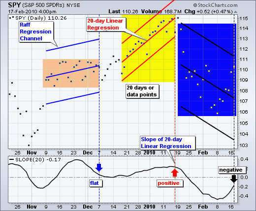
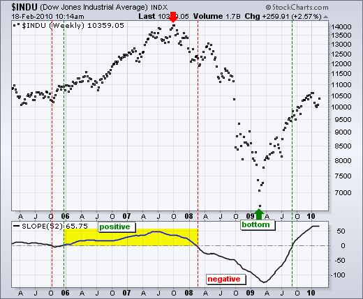
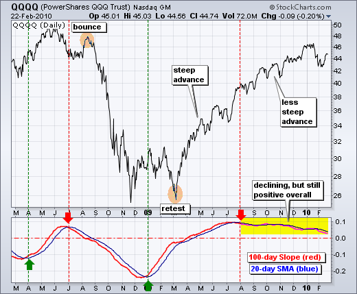
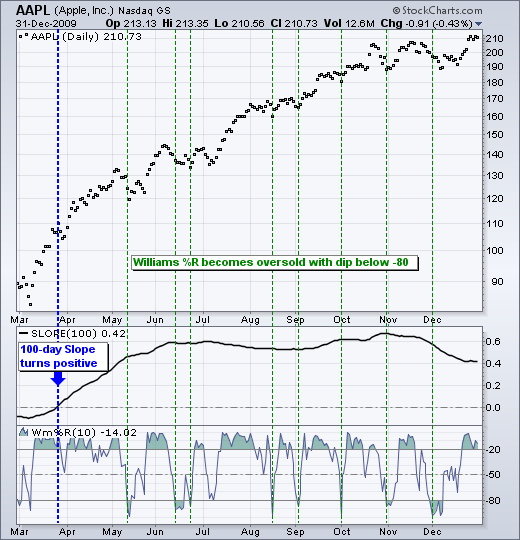
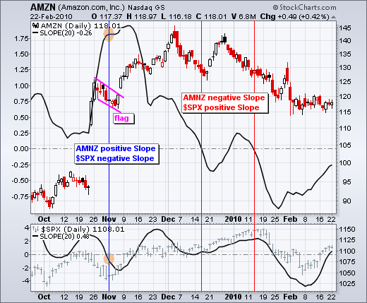

# 斜率[ChartSchool]

### 目录

+   斜率

    +   介绍

    +   计算

    +   趋势识别

    +   趋势强度

    +   交易偏好

    +   相对强度

    +   结论

    +   与 SharpCharts 一起使用

    +   建议扫描

        +   在上升趋势中超卖

        +   在下降趋势中超买

    +   进一步研究

## 介绍

斜率指标测量线性回归的上升/下降比率，即价格系列的最佳拟合线。斜率指标在零线上下波动，最像一个没有边界的动量振荡器。它不适合超买/超卖水平，但可以衡量趋势的方向和强度。它也可以与其他指标一起使用，以识别持续趋势中的潜在入场点。

## 计算

斜率基于线性回归（最佳拟合线）。尽管线性回归的公式超出了本文的范围，但可以使用 SharpCharts 中的 Raff 回归通道显示线性回归。该指标在中间显示了一个线性回归，外部趋势线等距分布。斜率等于线性回归的上升/下降比率。上升指的是价格变化。运行指的是时间范围。20 天斜率将是 20 天线性回归的上升/下降比率。如果上升了 4 个点，运行了两天，那么斜率将是 2（4/2 = 2）。如果上升了-6 个点，运行了 2 天，那么斜率将是-3（6/2 = 3）。一般来说，上升期具有正斜率，下降期具有负斜率。斜度取决于上升或下降的陡峭程度。



图表 1 显示了 SPY 与三个不同的 20 天周期（橙色、黄色、蓝色）。每个 20 天周期都显示了一个 20 天的 Raff 回归通道。中间的线性回归代表了这 20 个数据点的“最佳拟合线”。虚线标记了 20 天周期的结束和该价格点的斜率值。第一个周期相对平坦，斜率几乎为正。第二个周期上升，斜率明显为正。第三个周期下降，斜率为负。请记住，随着旧数据点被删除和新数据点被添加，斜率会发生变化。

## 趋势识别

斜率可用于量化趋势。正斜率定义为上升趋势。同样，负斜率定义为下降趋势。图表 2 显示了道琼斯工业指数的 52 周斜率（一年）。红色虚线显示了斜率变为负值，而绿色虚线显示了斜率变为正值。52 周斜率在大约两年时间内为正值（2006 年至 2007 年），然后在 2008 年 2 月变为负值。尽管道琼斯在 2009 年 3 月触底并大幅上涨，但 52 周斜率直到 2009 年 9 月才再次转为正值。请注意，斜率并不预测趋势。相反，它遵循趋势或价格点。这意味着会有一些滞后。



## 趋势强度

在分析斜率时，方向性运动也很重要。负斜率且上升显示了下降趋势中的改善。正斜率且下降显示了上升趋势中的恶化。图表 3 显示了纳斯达克 100ETF（QQQQ）的 100 天斜率。添加了 20 天简单移动平均线以识别上升和下降趋势。当斜率高于其 20 天 SMA 时，斜率上升，当低于其 20 天 SMA 时，斜率下降。此图表上标识了四个关键的交叉点（绿色/红色箭头）。请注意，这些交叉点发生在斜率变为负值或正值之前。这就像是对斜率的领先指示。此外，请注意 2008 年 7 月负交叉后的反弹以及 2009 年 1 月正交叉后的再次测试。这些早期的斜率反转预示着进入正值区域或趋势变化，但不要期望每次移动平均线交叉后都会有持续的移动。100 天斜率在 2009 年 8 月低于其 20 天 SMA，但 QQQQ 继续上涨。下降且为正值的斜率反映了上涨的陡度减小。请注意，从 2009 年 9 月至 2010 年 1 月，QQQQ 持续上涨时，100 天斜率保持为正值。



## 交易偏见

单独的斜率不能用于参与持续趋势，但可以与其他指标一起用于确定潜在的入场点。特别是，斜率可用于趋势识别以建立交易偏好。正斜率表示看涨偏好，而负斜率表示看跌偏好。建立交易偏好后，可以使用动量振荡器来确定潜在的入场点。动量振荡器的选择实际上是个人偏好。苹果的示例使用了 100 天的斜率和 10 天的威廉斯%R。斜率的回望期应明显长于动量振荡器的回望期。斜率定义了更大的趋势，而动量振荡器代表该趋势的一个子集。图表 4 显示了 100 天的斜率在 7 月上升至零以上，以建立看涨偏好。只考虑看涨信号用于动量振荡器。这些信号包括超卖读数、中线交叉或信号线交叉。威廉斯%R 没有信号线，但 MACD 和 PPO 有。蓝色虚线显示了 10 天威廉斯%R 下跌至-80%以下变为超卖时。请注意，这些读数对应股票的短期回调。除了 12 月初的最后一个超卖读数外，苹果在这些超卖读数后很快恢复了上涨趋势。



## 相对强势

两个（或更多）证券的斜率可以进行比较，以确定相对强势和相对弱势。下图显示了亚马逊（AMZN）与标普 500 指数的情况。两个证券都显示了 20 天的斜率（黑色）。蓝色垂直线标记了 11 月初的一个时间点，当时亚马逊的斜率为正，而标普 500 的斜率为负。在这个时候，亚马逊明显表现优于标普 500。事实上，当标普 500 在 11 月初触底时，亚马逊率先上涨，从 117 上涨到 143。请注意，即使斜率下降，亚马逊也在上涨。亚马逊的斜率在 12 月中旬转为负值，而标普 500 的斜率仍为正值。这种情况在 1 月的第二周重复出现。根据斜率比较，亚马逊在 11 月从相对强势转为 12 月和 1 月的相对弱势。在这两个月中，亚马逊的 20 天线性回归呈下降趋势，而标普 500 的 20 天线性回归呈上升趋势。



## 结论

Slope 测量线性回归的上升率。一般来说，当 Slope 为正时存在上升趋势，当 Slope 为负时存在下降趋势。时间范围取决于天数。10 天涵盖了短期趋势，100 天涵盖了中期趋势，250 天涵盖了长期趋势。与典型的趋势跟踪指标一样，Slope 滞后于价格，并在实际顶部或底部之后发生反转。然而，这并不减少其实用性。趋势识别和趋势强度是重要工具，即使对于交易者也是如此。与移动平均线一样，Slope 可以与动量指标一起使用，参与正在进行的趋势。[点击这里](http://stockcharts.com/h-sc/ui?s=DIA&p=D&yr=0&mn=8&dy=0&id=p93531652664&listNum=30&a=191771207 "http://stockcharts.com/h-sc/ui?s=DIA&p=D&yr=0&mn=8&dy=0&id=p93531652664&listNum=30&a=191771207") 查看带有 Slope 指标的实时图表。

## 与 SharpCharts 一起使用

在 SharpCharts 的指标列表底部可以找到 Slope。默认参数（20）可以更改以适应所需的时间范围。与所有指标一样，Slope 可以放置在价格图之上、价格图之后或价格图之下。此外，用户可以点击高级选项旁边的绿色箭头，将移动平均线或另一个指标应用于 Slope。

## 建议的扫描

### 在上升趋势中被超卖

此扫描显示了具有正 100 天 Slope 和超卖的 Williams %R（低于-80）的股票。

```py
[type = stock] AND [country = US] 
AND [Daily SMA(20,Daily Volume) > 40000] 
AND [Daily SMA(60,Daily Close) > 5] 

AND [Daily Slope(100,Daily Close) > 0] 
AND [Daily Williams %R(10) < -80]
```

### 在下降趋势中被超买

此扫描显示了具有负 100 天 Slope 和超买的 Williams %R（高于-20）的股票。

```py
[type = stock] AND [country = US] 
AND [Daily SMA(20,Daily Volume) > 40000] 
AND [Daily SMA(60,Daily Close) > 5] 

AND [Daily Slope(100,Daily Close) < 0] 
AND [Daily Williams %R(10) > -20]
```

有关 Slope 扫描的语法详细信息，请参阅我们支持中心的[扫描指标参考](http://stockcharts.com/docs/doku.php?id=scans:indicators#slope_slope "http://stockcharts.com/docs/doku.php?id=scans:indicators#slope_slope")。

## 进一步研究

本书涵盖了很多内容，但包括了使用线性回归进行回归分析的部分。

| **交易系统与方法** Perry Kaufman |
| --- |
|  |
|  |
