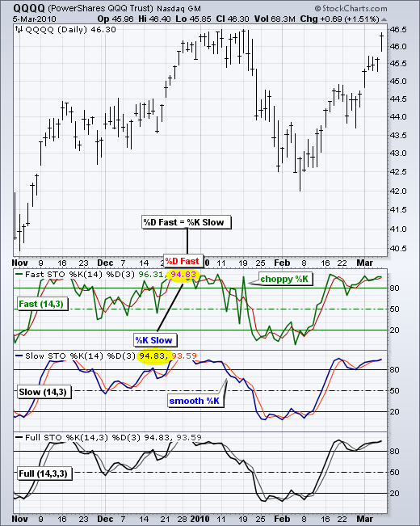

# 随机振荡器 [图表学校]

### 目录

+   随机振荡器

    +   介绍

    +   计算

    +   解释

    +   快速、慢速或完整

    +   超买超卖

    +   牛熊背离

    +   牛熊设置

    +   结论

    +   与 SharpCharts 一起使用

    +   建议的扫描

        +   随机振荡器超卖上涨

        +   随机振荡器超买下跌

    +   进一步研究

    +   其他资源

        +   股票与商品杂志文章

## 介绍

由乔治·C·莱恩在 20 世纪 50 年代末开发，随机振荡器是一种动量指标，显示收盘价相对于一定周期内的高低范围的位置。根据莱恩的一次采访，随机振荡器“不跟随价格，不跟随成交量或任何其他因素。它跟随价格的速度或动量。通常情况下，动量在价格之前改变方向。”因此，随机振荡器中的牛市和熊市背离可用于预示反转。这是莱恩确定的第一个，也是最重要的信号。莱恩还使用这个振荡器来识别牛市和熊市设置，以预期未来的反转。由于随机振荡器是区间限制的，也可用于识别超买和超卖水平。

## 计算

```py
%K = (Current Close - Lowest Low)/(Highest High - Lowest Low) * 100
%D = 3-day SMA of %K

Lowest Low = lowest low for the look-back period
Highest High = highest high for the look-back period
%K is multiplied by 100 to move the decimal point two places

```

默认设置的随机振荡器为 14 个周期，可以是天、周、月或日内时间框架。14 个周期的%K 将使用最近的收盘价，过去 14 个周期内的最高价和最低价。%D 是%K 的 3 天简单移动平均。这条线与%K 一起绘制，作为信号线或触发线。


点击这里下载此电子表格示例。")


## 解释

随机指标（Stochastic Oscillator）衡量收盘价相对于一定时间内的高低范围的水平。假设最高价为 110，最低价为 100，收盘价为 108。高低范围为 10，这是 %K 公式中的分母。收盘价减去最低价为 8，这是分子。8 除以 10 等于 0.80 或 80%。将这个数字乘以 100 即可找到 %K，如果收盘价为 103，则 %K 等于 30（.30 x 100）。当收盘价位于范围的上半部分时，随机指标高于 50，当收盘价位于范围的下半部分时，随机指标低于 50。低读数（低于 20）表明价格接近给定时间段的低点。高读数（高于 80）表明价格接近给定时间段的高点。上面的 IBM 示例显示了三个 14 天范围（黄色区域），期末的收盘价（红色虚线）。当收盘价位于范围顶部时，随机指标等于 91。当收盘价接近范围底部时，随机指标等于 15。当收盘价位于范围中间时，收盘价等于 57。

## 快速、慢速或完整

SharpCharts 上有三个版本的随机指标可用。快速随机指标基于 George Lane 的 %K 和 %D 的原始公式。快速版本中的 %K 看起来相当波动。%D 是 %K 的 3 日 SMA。事实上，Lane 使用 %D 根据多头和空头背离生成买入或卖出信号。Lane 坚称 %D 背离是“唯一会导致你买入或卖出的信号”。因为快速随机指标中的 %D 用于信号，所以引入了慢速随机指标以反映这一重点。慢速随机指标使用 3 日 SMA 平滑 %K，这正是快速随机指标中的 %D。注意慢速随机指标中的 %K 等于快速随机指标中的 %D（图表 2）。



快速随机指标：

+   快速 %K = %K 基本计算

+   快速 %D = 快速 %K 的 3 期 SMA

慢速随机指标：

+   慢速 %K = 快速 %K 平滑处理后的 3 期 SMA

+   慢速 %D = 慢速 %K 的 3 期 SMA

完整随机指标是慢速随机指标的完全可定制版本。用户可以设置回顾期、减缓 %K 的期数以及 %D 移动平均的期数。这些示例中使用了默认参数：快速随机指标（14,3）、慢速随机指标（14,3）和完整随机指标（14,3,3）。

完整随机指标（Full Stochastic Oscillator）：

+   完整 %K = 快速 %K 平滑处理后的 X 期 SMA

+   完整 %D = 完整 %K 的 X 期 SMA

## 超买 超卖

作为边界振荡器，随机振荡器可以轻松识别超买和超卖水平。振荡器的范围从零到一百。无论证券快速上涨还是下跌，随机振荡器始终在此范围内波动。传统设置使用 80 作为超买阈值，20 作为超卖阈值。这些水平可以根据分析需求和证券特性进行调整。20 天随机振荡器的读数高于 80 表示基础证券正在接近其 20 天高低范围的顶部。当证券交易在其高低范围的低端时，读数低于 20。

在查看一些图表示例之前，重要的是要注意，超买的读数并不一定是熊市的。证券在强劲上涨期间可能会变得超买并保持超买。持续接近范围顶部的收盘水平表明持续的买盘压力。同样，超卖的读数并不一定是看涨的。证券在强劲下跌期间也可能变得超卖并保持超卖。持续接近范围底部的收盘水平表明持续的卖盘压力。因此，重要的是要识别更大的趋势并朝着这个趋势的方向交易。在上涨趋势中寻找偶尔的超卖读数，并忽略频繁的超买读数。同样，在强劲下跌趋势中寻找偶尔的超买读数，并忽略频繁的超卖读数。

图表 3 显示了雅虎（YHOO）的全随机振荡器（20,5,5）。较长的回望期（20 天对比 14 天）和较长的移动平均线平滑（5 对比 3）产生了一个不太敏感的振荡器，信号较少。从 2009 年 7 月到 2010 年 4 月，雅虎的交易区间在 14 到 18 之间。这样的交易范围非常适合随机振荡器。低于 20 的跌破警告超卖条件，可能预示着反弹。高于 80 的走势警告超买条件，可能预示着下跌。请注意振荡器如何可以超过 80 并保持在 80 以上（橙色标记）。同样，振荡器低于 20 并有时保持在 20 以下。当指标高于 80 时，它既是超买的又是强劲的。需要随后下跌至 80 以下才能信号某种形式的反转或在阻力处失败（红色虚线）。相反，当振荡器低于 20 时，它既是超卖的又是弱势的。需要上涨至 20 以上才能显示实际的上升和成功的支撑测试（绿色虚线）。


图表 4 显示了 Crown Castle (CCI) 在七月份突破开始上涨趋势。完整随机指标（20,5,5）被用来识别超卖读数。超买读数被忽略，因为更大的趋势是向上的。沿着更大趋势交易可以提高胜算。完整随机指标在九月初和十一月初跌破 20。随后回升至 20 以上的走势信号了价格上涨（绿色虚线）和更大上涨趋势的延续。


图表 5 显示了 Autozone (AZO) 在 2009 年 5 月支撑线突破开始下跌趋势。在下跌趋势中，完整随机指标（10,3,3）被用来识别超买读数，预示潜在逆转。由于更大的下跌趋势，超卖读数被忽略。较短的回望期（10 与 14 相比）增加了振荡器对更多超买读数的敏感性。作为参考，完整随机指标（20,5,5）也显示出来。请注意，这个不太敏感的版本在八月、九月和十月并未变为超买。有时需要增加灵敏度以生成信号。


## 牛熊背离

背离 在价格出现新高或新低时，未被随机指标确认。当价格记录新低，但随机指标形成新高时，形成了一种看涨的背离。这显示了较少的下行动量，可能预示着一个看涨的逆转。当价格记录新高，但随机指标形成新低时，形成了一种看跌的背离。这显示了较少的上行动量，可能预示着一个看跌的逆转。一旦出现背离，图表分析师应寻找确认信号以表明实际逆转。价格图表上的支撑线突破或随机指标跌破 50（中线）可以确认看跌的背离。价格图表上的阻力线突破或随机指标突破 50 可以确认看涨的背离。

50 是一个重要的观察水平。随机振荡器在零和一百之间波动，这使得 50 成为中心线。可以将其视为橄榄球场上的 50 码线。当进攻队越过 50 码线时，得分的机会更高。只要防守队阻止进攻队越过 50 码线，防守队就有优势。随机振荡器上穿 50 表明价格正在给定回望期内的高低范围的上半部交易。这意味着杯子是半满的。相反，下穿 50 表明价格正在给定回望期内的低半部交易。这意味着杯子是半空的。

图表 6 显示了国际游戏科技（IGT）在 2010 年 2 月至 3 月出现了一个牛市背离。请注意股票如何创下新低，但随机振荡器形成了一个较高的低点。确认这个较高低点有三个步骤。第一步是信号线穿越和/或移动回到 20 以上。信号线穿越发生在 %K（黑色）穿过 %D（红色）时。这提供了可能的最早入场点。第二步是移动到 50 以上，这将使价格处于随机范围的上半部分。第三步是价格图表上的阻力突破。请注意随机振荡器在 3 月底上穿 50，并一直保持在 50 以上直到 5 月底。


图表 7 显示了 Kohls（KSS）在 2010 年 4 月出现了一个熊市背离。股票在 4 月初和 4 月底创下了新高，但随机振荡器在 3 月底达到峰值并形成了较低的高点。在这种情况下，信号线穿过并移动到 80 以下并没有提供良好的早期信号，因为 KSS 一直在上涨。随机振荡器在第二个信号时移动到 50 以下，股票在第三个信号时突破了支撑位。正如 KSS 所示，早期信号并不总是清晰简单的。信号线穿越、移动到 80 以下和移动到 20 以上是频繁出现且容易出现误导的。即使 KSS 突破了支撑位，随机振荡器移动到 50 以下，股票反弹至 57 以上，随机振荡器也反弹至 50 以上，然后股票继续急剧下跌。


## 牛熊设置

乔治·莱恩确定了另一种形式的背离来预测底部或顶部。牛市设置基本上是牛市背离的反向。基础证券形成较低高点，但随机指标形成较高高点。即使股票无法超过先前的高点，随机指标中的较高高点显示了上行动量的增强。接下来的下跌预计将导致可交易的底部。图 8 显示了 2009 年 6 月的网络设备（NTAP）的牛市设置。股票形成了较低高点，而随机指标则形成了较高高点。这个较高高点显示了上行动量的强劲。请记住，这是一个设置，而不是一个信号。该设置预示着不久的将来会有一个可交易的低点。NTAP 跌破了其 6 月低点，随机指标跌破 20 变为超卖。交易者可以在随机指标上穿过其信号线、超过 20 或超过 50 时采取行动。另外，NTAP 随后以强劲的走势突破了阻力。


当证券形成较高低点，但随机指标形成较低低点时，就会出现熊市设置。即使股票保持在先前的低点之上，随机指标中的较低低点显示出增加的下行动量。预计下一次上涨将导致一个重要的高点。图 9 显示了 2009 年 11 月摩托罗拉（MOT）的熊市设置。股票在 11 月底和 12 月初形成了较高低点，但随机指标却在 20 以下形成了较低低点。这显示了强劲的下行动量。随后的反弹并没有持续太久，因为股票很快达到了顶峰。请注意，随机指标没有回升至 80 以上，并在 12 月中旬回落至其信号线以下。


## 结论

动量振荡器最适合交易范围，但也可以与呈现锯齿形式的趋势的证券一起使用。回撤是呈锯齿状上升的上升趋势的一部分。反弹是呈锯齿状下降的下降趋势的一部分。在这方面，随机指标可以用来识别与更大趋势协调的机会。

该指标还可用于识别靠近支撑或阻力转折的时机。如果一只证券在超卖的随机指标附近交易，并且靠近支撑，寻找突破 20 的信号以表明上升趋势和成功的支撑测试。相反，如果一只证券在超买的随机指标附近交易，并且靠近阻力，寻找突破 80 的信号以表明下降趋势和阻力失效。

随机指标的设置取决于个人偏好、交易风格和时间框架。较短的回看期将产生一个波动较大的随机指标，其中包含许多超买和超卖的读数。较长的回看期将提供一个波动较小的随机指标，其中包含较少的超买和超卖读数。

像所有技术指标一样，重要的是将随机指标与其他技术分析工具结合使用。成交量、支撑/阻力和突破可以用来确认或否定随机指标产生的信号。

## 与 SharpCharts 一起使用

如上所述，在 SharpCharts 上作为指标可用的随机指标有三个版本。默认设置如下：快速随机指标（14,3）、慢速随机指标（14,3）和完整随机指标（14,3,3）。回看期（14）用于基本的%K 计算。请记住，快速随机指标中的%K 是未平滑的，而慢速随机指标中的%K 使用 3 日简单移动平均进行平滑。快速和慢速随机指标设置（14,3）中的“3”设置了%D 的移动平均期。寻求最大灵活性的图表分析师可以简单地选择完整随机指标来设置回看期、%K 的平滑因子和%D 的移动平均。指标可以放置在实际价格图表的上方、下方或后方。将随机指标放置在价格后面可以让用户轻松地将指标波动与价格波动匹配。[点击这里查看实时示例](http://stockcharts.com/h-sc/ui?s=$COMPQ&p=D&yr=0&mn=6&dy=0&id=p82180859243&listNum=30&a=201659153 "http://stockcharts.com/h-sc/ui?s=$COMPQ&p=D&yr=0&mn=6&dy=0&id=p82180859243&listNum=30&a=201659153")。


## 建议的扫描

### 随机指标超卖反转

这个扫描从股价高于它们的 200 日移动平均线的股票开始，以便关注那些处于更大上升趋势中的股票。在这些股票中，扫描接着寻找那些随机指标从超卖水平（低于 20）反转的股票。

```py
[type = stock] AND [country = US] 
AND [Daily SMA(20,Daily Volume) > 40000] 
AND [Daily SMA(60,Daily Close) > 20] 

AND [Daily Close > Daily SMA(200,Daily Close)] 
AND [Yesterday's Daily Slow Stoch %K(14,3) < 20] 
AND [Daily Slow Stoch %K(14,3) > 20]
```

### 随机指标超买反转

这个扫描从股价低于它们的 200 日移动平均线的股票开始，以便关注那些处于更大下降趋势中的股票。在这些股票中，扫描接着寻找那些随机指标在超买水平（高于 80）之后反转的股票。

```py
[type = stock] AND [country = US] 
AND [Daily SMA(20,Daily Volume) > 40000] 
AND [Daily SMA(60,Daily Close) > 20] 

AND [Daily Close < Daily SMA(200,Daily Close)] 
AND [Yesterday's Daily Slow Stoch %K(14,3) > 80] 
AND [Daily Slow Stoch %K(14,3) < 80]
```

有关用于随机指标扫描的语法详细信息，请参阅我们支持中心的[扫描指标参考](http://stockcharts.com/docs/doku.php?id=scans:indicators#stochastic_oscillators "http://stockcharts.com/docs/doku.php?id=scans:indicators#stochastic_oscillators")。

## 进一步研究

墨菲的书中有一章专门讨论动量振荡器及其各种用途。墨菲涵盖了随机振荡器的利弊以及一些特定于随机振荡器的示例。

普林的书展示了动量指标的基础，涵盖了背离、交叉以及其他信号。书中还有两章涵盖了具体的动量指标，并提供了大量示例。

| **金融市场技术分析** 约翰·J·墨菲 | **技术分析解析** 马丁·普林 |
| --- | --- |
|  |  |
|  |  |

* * *

## 附加资源

### 股票与商品杂志文章

**[乔·路易斯的随机振荡器](http://stockcharts.com/h-mem/tascredirect.html?artid=\V15\C12\THESTOC.pdf "http://stockcharts.com/h-mem/tascredirect.html?artid=\V15\C12\THESTOC.pdf")**

1997 年 11 月 - 股票与商品

**[葛雷格·莫里斯的蜡烛图和随机振荡器](http://stockcharts.com/h-mem/tascredirect.html?artid=\V09\C08\CANDLES.pdf "http://stockcharts.com/h-mem/tascredirect.html?artid=\V09\C08\CANDLES.pdf")**

1991 年 7 月 - 股票与商品
