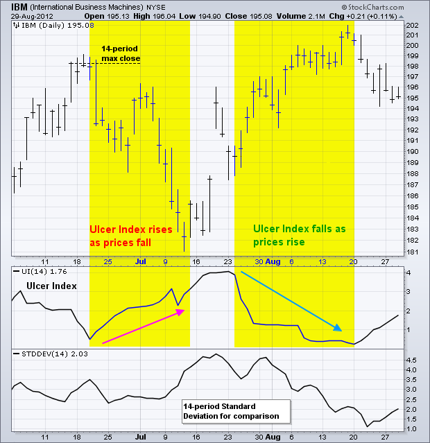
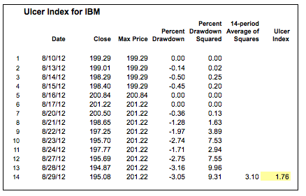
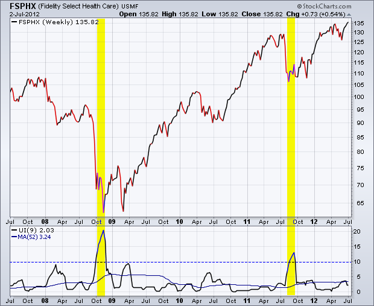
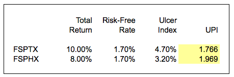
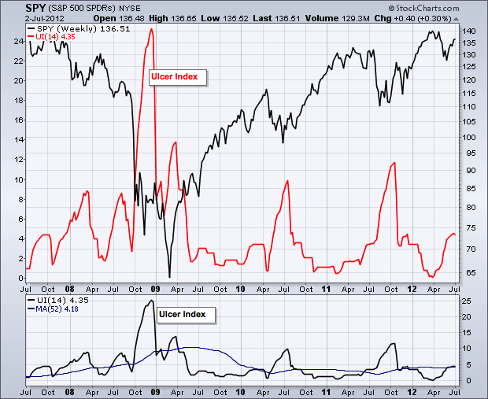
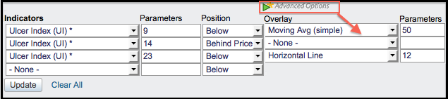

# 溃疡指数 

### 目录

+   溃疡指数

    +   计算

    +   解释

    +   比较基金

    +   风险调整回报

    +   结论

    +   与 SharpCharts 一起使用

    +   建议扫描

        +   淘汰高波动性

    +   进一步学习

1987 年由 Peter Martin 和 Byron McCann 开发，溃疡指数是一种衡量下行风险的波动性指标。溃疡指数最初是在他们 1989 年的书籍《富达基金投资者指南》中首次引入的。最初，该指数是针对共同基金设计的，这就是为什么它只关注下行风险。共同基金的设计目的是通过增值赚钱。因此，唯一的风险是回撤或下行。正如其名称所示，溃疡指数衡量投资者可以预期在任何给定证券上承受的回撤。许多人认为溃疡指数优于标准差和其他风险衡量方法。

## 计算

基于收盘价，溃疡指数根据价格从其高点的贬值来衡量波动性，这是在特定回顾期内。如果价格每个周期都收盘较高，则指数为零。这意味着没有下行风险，因为价格稳步上涨。当然，价格并不会稳步上涨，在这过程中会有下降。使用默认设置的 14 个周期，溃疡指数反映了此期间的预期百分比回撤。表格显示了 14 个周期的样本计算。



```py
Percent-Drawdown = ((Close - 14-period Max Close)/14-period Max Close) x 100

Squared Average = (14-period Sum of Percent-Drawdown Squared)/14 

Ulcer Index = Square Root of Squared Average

```



## 解释

以下内容来自 Peter G. Martin 本人：

“溃疡指数衡量价格从先前高点的百分比回撤的深度和持续时间。价值回撤越大，恢复到先前高点所需时间越长，UI 就越高。从技术上讲，它是价值回撤的平方的平均值的平方根。平方效应比例地惩罚大回撤，而不是小回撤。”

很难比这个说得更好，所以我们将保持原样。

## 比较基金

作为统计指标，投资者可以比较溃疡指数的值以确定相对风险。 马丁指出，溃疡指数在周数据中表现良好。 下图显示了富达科技基金（FSPTX）的周收盘价，指标窗口中显示了 9 周期溃疡指数。 添加了 52 周期移动平均线以平滑指数并显示长期平均值。 2008 年有三次超过 10 的尖峰，2011 年又有一次（黄色高亮显示）。 也许 2008 年是由于金融危机而出现的异常情况。 自 2008 年以来，只有一次超过 10 的尖峰，投资者可以得出结论，超过 10 的尖峰相对较少。 52 周期移动平均值为 4.71，这个值可以用来衡量调整后的回报。




第二张图显示了富达医疗保健基金（FSPHX）具有相同的图表特征。 溃疡指数在 2008 年和 2011 年各自两次突破了 10。 52 周移动平均值为 3.24，远低于技术基金的移动平均值。 这意味着医疗保健基金的风险或回撤潜力较小。

## 风险调整回报

夏普比率用于衡量风险调整回报。 它简单地是总回报减去无风险回报除以标准差。 如上所述，标准差被认为是次优的，因为它考虑了上行和下行波动性。 仅关注上行波动性的长期投资者不关心。 产生回撤和胃溃疡的是下行波动性。 为了解决这个问题，马丁引入了溃疡表现指数（UPI）或马丁比率。 这简单地是总回报减去无风险回报除以溃疡指数。 目标是找到具有最高 UPI 的证券（基金），这意味着最高的风险调整回报。



上表比较了富达科技基金（FSPTX）与富达医疗保健基金（FSPHX）。 10 年期国债收益率（$TNX）代表无风险利率。 溃疡指数是 9 周溃疡指数的 52 周平均值。 预期回报基于晨星的 10 年总回报数据。 技术基金的预期回报和溃疡指数都较高。 基于较高的 UPI，医疗保健基金似乎提供了比技术基金更好的风险调整回报。

## 结论

溃疡指数通过关注价格下跌所代表的回撤来衡量风险。这意味着它最适合长期投资者或交易者。当价格经常创下新高并上涨时，指数接近零。当价格下跌并远离最近的高点时，指数上升。请记住，溃疡指数本身并不是一个指标。它只是一个衡量下行风险的指标，可用于计算风险调整后的回报。

## 与 SharpCharts 一起使用

溃疡指数可作为 SharpCharts 的指标。一旦选择，用户可以将指标放置在基础价格图的上方、下方或后方。将溃疡指数直接放在价格图的后面，突出了相对于基础证券价格走势的波动。用户可以应用“高级选项”添加水平线以设定风险阈值。[点击这里](http://stockcharts.com/h-sc/ui?s=SPY&p=W&st=2007-07-02&en=2012-07-02&id=p91585692867&a=276604685 "http://stockcharts.com/h-sc/ui?s=SPY&p=W&st=2007-07-02&en=2012-07-02&id=p91585692867&a=276604685") 查看溃疡指数实际应用的实例。





## 建议的扫描

### 淘汰高波动性

溃疡指数可用于扫描以淘汰极高波动性的证券。这个简单的扫描搜索处于上升趋势的 S&P 600 股票。最终的扫描子句排除了高波动性股票的结果。

```py
[group is SP600]
AND [Daily EMA(50,close) > Daily EMA(200,close)]  

AND [ULCER(14) < 10] 
```

有关溃疡指数扫描的语法详细信息，请参阅我们支持中心的[扫描指标参考](http://stockcharts.com/docs/doku.php?id=scans:indicators#ulcer_index_ulcer "http://stockcharts.com/docs/doku.php?id=scans:indicators#ulcer_index_ulcer")。

## 进一步研究

| **金融市场技术分析** 约翰·J·墨菲 | **马丁·普林解读技术分析** 马丁·普林 |
| --- | --- |
|  |  |
|  |  |
