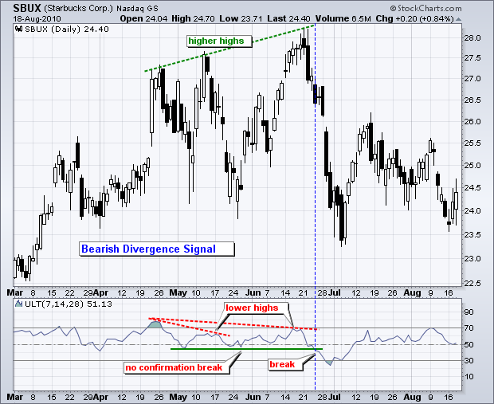

# 终极振荡器 

### 目录

+   终极振荡器

    +   介绍

    +   计算

    +   解释

    +   买入信号

    +   卖出信号

    +   时间框架

    +   结论

    +   与 SharpCharts 一起使用

    +   建议扫描

        +   看涨长期交叉

        +   看跌长期交叉

    +   进一步研究

    +   额外资源

        +   股票与商品杂志文章

## 介绍

由 Larry Williams 于 1976 年开发，并于 1985 年在《股票与商品杂志》上推出的终极振荡器是一种动量振荡器，旨在捕捉三个不同时间框架的动量。多时间框架目标旨在避免其他振荡器的缺陷。许多动量振荡器在强劲上涨开始时激增，然后随着上涨的持续形成熊市背离。这是因为它们被困在一个时间框架中。终极振荡器试图通过将较长的时间框架纳入基本公式来纠正这个缺陷。威廉姆斯根据看涨背离确定了买入信号，根据看跌背离确定了卖出信号。

## 计算

终极振荡器（UO）计算涉及许多步骤。此示例基于默认设置（7,14,28）。首先，计算买入压力（BP）以确定价格走势的总体方向。其次，测量买入压力相对于真实波幅（TR）。这告诉我们收益或损失的真实幅度。第三，基于涉及的三个时间框架（7,14,28）创建平均值。第四，创建三个平均值的加权平均值。

```py
BP = Close - Minimum(Low or Prior Close).

TR = Maximum(High or Prior Close)  -  Minimum(Low or Prior Close)

Average7 = (7-period BP Sum) / (7-period TR Sum)
Average14 = (14-period BP Sum) / (14-period TR Sum)
Average28 = (28-period BP Sum) / (28-period TR Sum)

UO = 100 x [(4 x Average7)+(2 x Average14)+Average28]/(4+2+1)

```

买入压力（BP）衡量当前收盘价相对于当前最低价或先前收盘价（以较低者为准）的水平。真实波幅（TR）衡量从当前最高价或先前收盘价（以较高者为准）到当前最低价或先前收盘价（以较低者为准）的价格范围。买入压力和真实波幅都包含先前收盘价，以考虑可能从一个周期到下一个周期的间隙。然后通过将 BP 的 X 周期总和除以 TR 的 X 周期总和来相对于真实波幅显示买入压力。为 7、14 和 28 个周期创建平均值。这些数字对应默认参数。然后通过将最短平均值乘以 4、中间平均值乘以 2 和最长平均值乘以 1 来创建加权平均值。然后将这些加权金额相加，并除以权重之和（4+2+1）。


点击这里")查看 Excel 电子表格中的终极振荡器计算。


## 解释

购买压力及其与真实波幅的关系构成了终极振荡器的基础。威廉姆斯认为，衡量购买压力的最佳方法就是简单地将收盘价减去最低价或前一收盘价中较低的那个。这将反映出真正的上涨幅度，因此也反映了购买压力。当购买压力强劲时，终极振荡器上升，而当购买压力较弱时则下降。

终极振荡器测量三个不同时间段的动量。请注意，第二个时间段是第一个时间段的两倍，第三个时间段是第二个时间段的两倍。尽管最短的时间段权重最大，但最长的时间段也不会被忽视，这应该会减少错误分歧的数量。这很重要，因为基本的买入信号是基于看涨分歧，而基本的卖出信号是基于看跌分歧。

## 买入信号

买入信号有三个步骤。首先，指标与证券价格之间形成了一个看涨分歧。这意味着终极振荡器形成了一个较高的低点，而价格则形成了一个较低的低点。振荡器中的较高低点显示出较小的下行动量。其次，看涨分歧的低点应低于 30。这是为了确保价格有些超卖或处于相对极端状态。第三，振荡器上升至看涨分歧的高点之上。

最佳购买（BBY）显示终极振荡器（7,14,28）在六月底超卖，并在八月底形成与之形成大的看涨分歧，直到九月中旬技术上指标才确认了分歧。然而，技术分析需要一些灵活性。图表分析师可以使用超过 50 的移动作为终极振荡器的触发器。这个中心线充当指标的牛熊阈值。当在上方时，杯子是半满的（看涨偏向），当在下方时，杯子是半空的（看跌偏向）。还要注意，该股票突破了六月的趋势线，并在九月初突破了短期阻力以进一步确认。


下图显示了美国鹰（AEO）的一个较小的看涨背离信号。随着股票在 6 月初下跌，终极振荡器跌至超卖水平（<30）。虽然股票在 6 月底创下新低，但指标仍高于先前的低点和 30 以上。随后突破间歇高点确认了看涨背离信号。还要注意，AEO 在四天内突破了阻力。即使错过了突破的人也有第二次机会，因为股票在 8 月回落后再次突破了阻力。


## 卖出信号

卖出信号有三个步骤。首先，在指标和证券价格之间形成了一个看跌背离。这意味着终极振荡器形成了一个较低的高点，而价格则形成了一个较高的高点。振荡器中的较低高点显示出较少的上涨动能。其次，看跌背离的高点应该在 70 以上。这是为了确保价格有些超买或处于相对极端状态。第三，振荡器跌破看跌背离的低点以确认逆转。


卡特彼勒在 4 月下旬大幅上涨，但终极振荡器未能确认这一高点，并形成了一个较低的高点。此外，请注意指标在 4 月中旬变得超买。随后在 4 月下旬突破背离低点确认了看跌信号。CAT 两天后突破了趋势线支撑，并在 6 月初急剧下跌。



上图显示了星巴克的一个未经证实的看跌信号，然后是一个经证实的信号。终极振荡器在 4 月下旬变得超买。随着股票创下新高，指标在 5 月中旬和 6 月底再次形成较低高点。一个看跌背离在 5 月中旬起作用，但指标从未突破其背离低点以确认。在形成更大的背离后，指标在 6 月底突破了其背离低点，预示了一次相当急剧的下跌。

## 时间框架

终极振荡器可用于日内、日线、周线或月线图表。有时需要调整参数以生成超买或超卖读数，这些是买入和卖出信号的一部分。相对温和的股票或证券可能不会使用默认参数（7,14,28）生成超买或超卖读数。图表分析师需要通过缩短时间框架来增加灵敏度。波音（BA）的图表显示终极振荡器（7,14,28）在六个月内在 30 和 70 之间交易。没有超买或超卖读数。将时间框架缩短至（4,8,16）可以增加灵敏度，并生成至少六个超买或超卖读数。对于波动性较高的证券，有时需要延长时间框架以减少灵敏度和信号数量。


## 结论

终极振荡器是一个结合了三个不同时间框架的动量振荡器。传统信号来自看涨和看跌的背离，但图表分析师也可以查看实际水平以获取交易偏好。这通常在较长参数和较长趋势下效果更好。例如，当终极振荡器（20,40,80）和价格趋势在 50 以上时，偏向多头，而在 50 以下时偏向空头。与所有指标一样，终极振荡器不应单独使用。应该使用辅助指标、图表模式和其他分析工具来确认信号。

## 与 SharpCharts 一起使用

终极振荡器可作为 SharpCharts 指标使用，可以放置在基础证券的价格图表的上方、下方或后方。将其直接放在价格图表的后面并使用鲜明的颜色使得比较指标运动与价格运动变得容易。用户可以点击“高级选项”旁边的绿色箭头添加水平线或移动平均线。


## 建议扫描

### 看涨的长期交叉

此扫描显示终极振荡器上穿 50 的股票，这是一个看涨的信号。这个扫描只是一个起点。需要进一步的细化和分析。

```py
[type = stock] AND [country = US] 
AND [Daily SMA(20,Daily Volume) > 40000] 
AND [Daily SMA(60,Daily Close) > 20] 

AND [Ultimate Osc(20,40,80) x 50]
```

### 看跌的长期交叉

这个扫描显示了终极振荡器下穿 50 的股票，这是一个看涨的信号。这个扫描只是一个起点。需要进一步的细化和分析。

```py
[type = stock] AND [country = US] 
AND [Daily SMA(20,Daily Volume) > 40000] 
AND [Daily SMA(60,Daily Close) > 20] 

AND [50 x Ultimate Osc(20,40,80)]
```

有关使用终极振荡器扫描的语法详细信息，请参阅我们[扫描指标参考](http://stockcharts.com/docs/doku.php?id=scans:indicators#ultimate_oscillator_ultimate_osc "http://stockcharts.com/docs/doku.php?id=scans:indicators#ultimate_oscillator_ultimate_osc")中的支持中心。

## 进一步研究

墨菲的书有一个专门讨论动量振荡器及其各种用途的章节。墨菲涵盖了优缺点以及一些特定于商品通道指数的示例。

《技术分析解析》展示了动量指标的基础知识，涵盖了背离、交叉和其他信号。还有两个章节涵盖了具体的动量指标，并提供了大量示例。

| **金融市场技术分析** 约翰·J·墨菲 | **技术分析解析** 马丁·普林 |
| --- | --- |
|  |  |
|  |  |

* * *

## 其他资源

### 股票与商品杂志文章

**[拉里·威廉姆斯的终极振荡器](http://stockcharts.com/h-mem/tascredirect.html?artid=\V03\C04\ULTI.PDF "http://stockcharts.com/h-mem/tascredirect.html?artid=\V03\C04\ULTI.PDF")**

1985 年 7 月 - 股票与商品 V. 3:4 (140-141)
