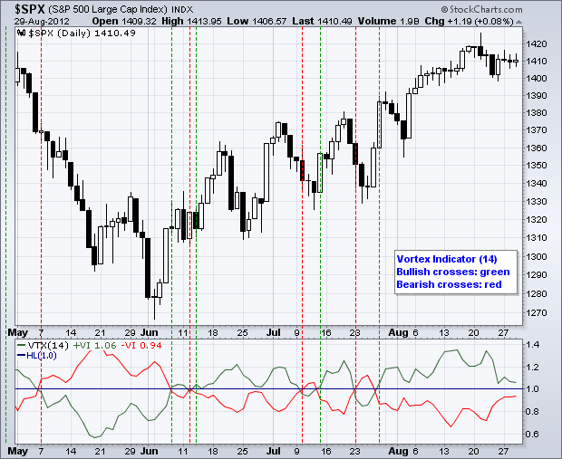
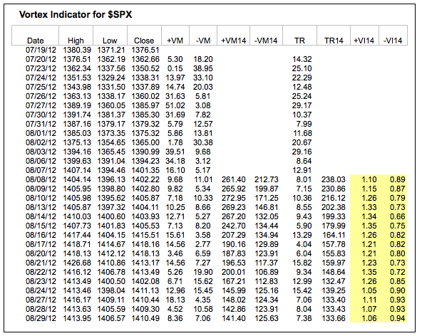
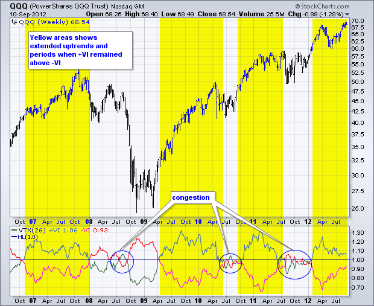
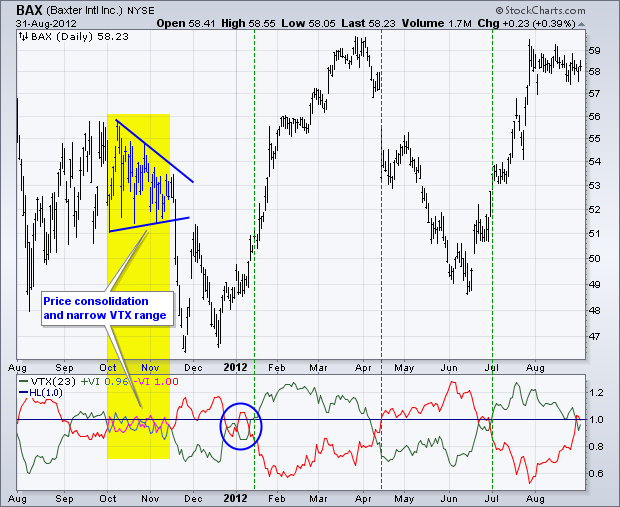
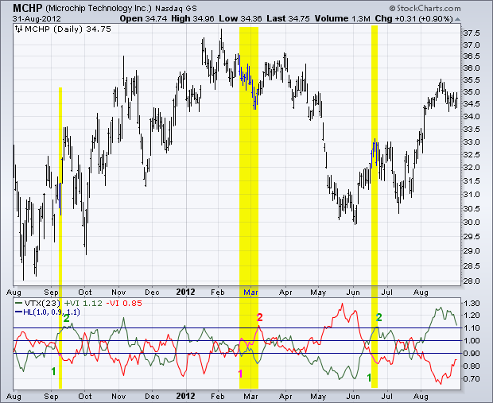
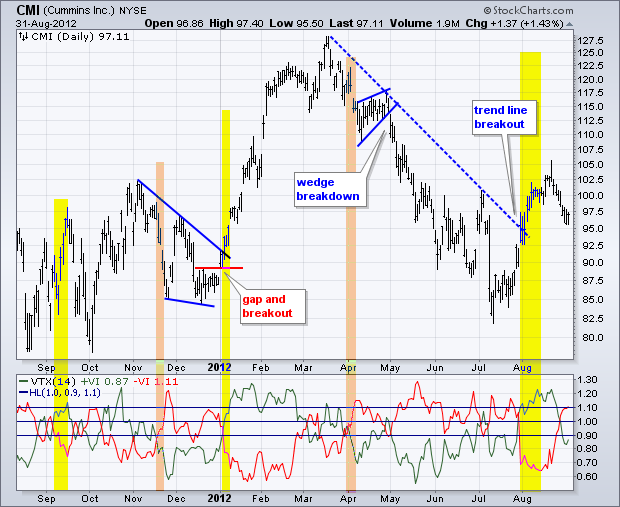
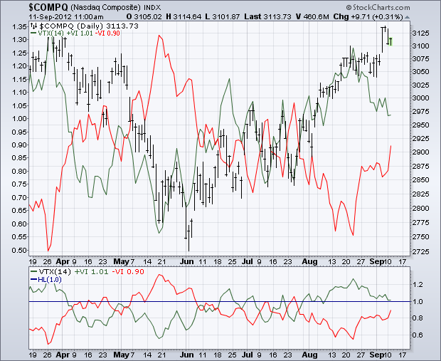

# 涡旋指标 

### 目录

+   涡旋指标

    +   SharpCharts 计算

    +   解释

    +   VM 交叉

    +   VM 阈值

    +   结论

    +   与 SharpCharts 一起使用

    +   建议的扫描

        +   整体上升趋势，+VI 上穿 -VI

        +   整体下降趋势，-VI 上穿 +VI

    +   进一步研究

由 Etienne Botes 和 Douglas Siepman 开发的涡旋指标由两个捕捉正向和负向趋势运动的振荡器组成。在创建这一指标时，Botes 和 Seipman 借鉴了 Welles Wilder 和被认为是内爆技术之父的维克托·绍伯格的工作。尽管公式相当复杂，但该指标非常容易理解和解释。当正向趋势指标上穿负向趋势指标或关键水平时，将触发看涨信号。当负向趋势指标上穿正向趋势指标或关键水平时，将触发看跌信号。涡旋指标始终在这些水平之上或之下，这意味着它始终具有明确的看涨或看跌偏向。

## SharpCharts 计算



涡旋指标（VTX）的计算可以分为三部分。首先，根据最近两个周期的高点和低点计算正向和负向趋势运动。正向趋势运动是当前高点到前一低点的距离。当前高点距离前一低点越远，趋势运动越正向。负向趋势运动是当前低点到前一高点的距离。当前低点距离前一高点越远，趋势运动越负向。然后根据指标设置（通常为 14 个周期）对这些周期性值进行求和。

第二部分涉及真实波幅，由 Welles Wilder 创建。该指标使用当前高点、当前低点和前一收盘价来衡量波动性。详情请参见下面的公式框。

第三部分通过将正负趋势运动除以真实波幅来进行标准化。实际上，涡旋指标显示了经过波动调整的正向趋势运动和负向趋势运动。最终结果产生了两个在 1 之上/之下振荡的指标。

```py
Positive and negative trend movement:

+VM = Current High less Prior Low (absolute value)
-VM = Current Low less Prior High (absolute value)

+VM14 = 14-period Sum of +VM
-VM14 = 14-period Sum of -VM

True Range (TR) is the greatest of:

  * Current High less current Low
  * Current High less previous Close (absolute value)
  * Current Low less previous Close (absolute value)

TR14 = 14-period Sum of TR

Normalize the positive and negative trend movements:

+VI14 = +VM14/TR14
-VI14 = -VM14/TR14

```



上表来自 Excel 电子表格。点击此处下载") 这个电子表格。

## 解释

涡流指标（VTX）可用于识别趋势的开始，并随后确认趋势方向。首先，两个振荡器的简单交叉可用于信号趋势的开始。在这种交叉之后，当 +VI 大于 -VI 时，趋势为上升，当 -VI 大于 +VI 时，趋势为下降。其次，在特定水平之上或之下的交叉可以信号趋势的开始，并且这些水平可以用来确认趋势方向。

## VM 交叉

最简单的信号触发是 +VI 和 -VI 的交叉。下面的例子展示了纳斯达克 100 ETF（QQQ）使用周线和 26 期 VTX，大约相当于六个月的时间。在六年半的时间里有超过十二次交叉。黄色区域显示了持续超过六个月的看涨交叉。这就是在强劲上升趋势中发生的情况。在 2008 年下半年还有一个重要的看跌交叉。尽管有很多良好的信号，但也有 whipsaws。这只是事物的本质和指标的一般性质。蓝色圈显示了当两个趋势指标在 1 附近徘徊时和标普 500 整理时的犹豫期。



第二个例子展示了 Baxter（BAX）使用日线图和 23 期 VTX，大约涵盖一个月的时间。并非每次交叉都会产生明确的趋势信号。请注意，从十月到十一月初 VTX 在 1 附近的狭窄范围内交易（黄色区域）。这标志着价格形成三角形的整理。在 2012 年初有一些 whipsaws（蓝色圈），然后在年底有一些良好的信号。有时候通过等待移动到 1 以上来确认信号会有所帮助。当 +VM 移动到 1 以上时，看涨交叉进一步得到验证，当 -VM 移动到 1 以上时，看跌交叉得到验证。



## VM 阈值

交易者可以通过将信号阈值设置在 1 的略高和略低处来减少 whipsaws。一个看涨信号可以分为两部分。首先，向下的趋势运动减弱。其次，向上的趋势运动加强。在一个上升趋势开始之前，+VI 通常会减弱并移动到 .90 以下。在这种向下趋势运动减弱之后，随着 +VI 移动到 1.10 以上完成看涨信号，向上运动加强。这个看涨信号会一直有效，直到被看跌信号抵消。相反的逻辑也可以用来生成看跌信号。首先，向上的趋势运动减弱，移动到 .90 以下。其次，向下的趋势运动加强，移动到 1.10 以上。



上图显示了 Microchip Technology 使用日线图和 23 周期 VTX。尽管两个振荡器交叉频繁，但在十二个月内只有三个“阈值”信号。首先，在九月初，-VM 下跌至 0.90 以下，几天后+VI 上穿 1.1。尽管+VM 多次下跌至 0.90 以下，但由于-VI 从未上穿 1.10，这个看涨信号并未完全逆转。第二个信号是在二月下旬，+VI 下跌至 0.90 以下，-VI 在三月初上穿 1.1。第三个信号是在六月中旬，-VI 下跌至 0.90 以下，几天后+VI 上穿 1.1。

缩短回溯期将增加灵敏度，并导致更多的阈值交叉。下图显示了康明斯（CMI）使用日线和 14 周期 VTX。这个指标比 23 周期版本更敏感（波动性更大）。黄色标记表示看涨信号，橙色标记表示看跌信号。



请记住，VTX 并非作为独立指标设计。图表分析师应该使用技术分析的其他方面来确认 VTX，提高交易设置的风险收益比，或得出买卖信号。一月初的看涨 VTX 信号得到了楔形突破的确认。四月的看跌 VTX 信号后，CMI 形成了一个上升楔形，并在五月初急剧下跌时突破了楔形支撑。VTX 提供了警报，价格图表提供了信号。

## 结论

涡流指标是一种独特的方向指标，提供清晰的信号并定义整体趋势。与所有技术分析工具和指标一样，涡流指标可以应用于各种证券和不同时间框架。例如，VTX 可以应用于周线和月线图表以定义更大的趋势，然后应用于日线图表以在该趋势内生成信号。使用日线图表，图表分析师可以在周线图表上的 VTX 指示上升趋势时专注于看涨信号。相反，当日线图表上的 VTX 处于熊市模式时，图表分析师可以专注于看跌信号。

## 使用 SharpCharts

涡流指数可作为 SharpCharts 的指标使用。一旦选择，用户可以将指标放置在基础价格图之上、之下或之后。将指标直接放在价格图后面，突出了相对于基础证券价格走势的波动。用户可以应用“高级选项”添加水平线并设置信号阈值。[点击这里](http://stockcharts.com/h-sc/ui?s=$COMPQ&p=D&yr=0&mn=6&dy=0&id=p98321339986&a=277125891 "http://stockcharts.com/h-sc/ui?s=$COMPQ&p=D&yr=0&mn=6&dy=0&id=p98321339986&a=277125891") 查看涡流指标实际运行的示例。




## 建议扫描

### 总体上升趋势，+VI 穿过-VI

这个扫描从平均每日交易量为 100,000 股且平均收盘价高于 10 的股票开始。当交易高于 50 日 SMA 时存在上升趋势。当+VI 穿过-VI 时出现买入信号。

```py
[type = stock] AND [country = US] 
AND [Daily SMA(20,Daily Volume) > 100000] 
AND [Daily SMA(60,Daily Close) > 10] 

AND [Daily VTX Plus(14) x Daily VTX Minus(14)] 
AND [Daily Close > Daily SMA(50,Daily Close)]
```

### 总体下降趋势，-VI 穿过+VI

这个扫描从平均每日交易量为 100,000 股且平均收盘价高于 10 的股票开始。当交易低于 50 日 SMA 时存在下降趋势。当-VI 穿过+VI 时出现卖出信号。

```py
[type = stock] AND [country = US] 
AND [Daily SMA(20,Daily Volume) > 100000] 
AND [Daily SMA(60,Daily Close) > 10] 

AND [Daily VTX Minus(14) x Daily VTX Plus(14)] 
AND [Daily Close < Daily SMA(50,Daily Close)]
```

欲了解有关涡旋指标扫描的语法更多细节，请参阅我们的[扫描指标参考](http://stockcharts.com/docs/doku.php?id=scans:indicators#vortex_indicator "http://stockcharts.com/docs/doku.php?id=scans:indicators#vortex_indicator")在支持中心。

## 进一步研究

| **金融市场技术分析** 约翰·J·墨菲 | **马丁·普林解读技术分析** 马丁·普林 |
| --- | --- |
|  |  |
|  |  |
