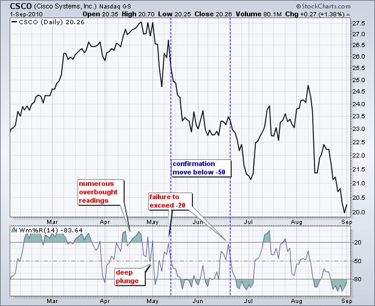
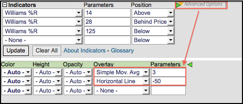

# 威廉斯%R [图表学校]

### 目录

+   威廉斯%R

    +   介绍

    +   计算

    +   解释

    +   超买/超卖

    +   动量失败

    +   结论

    +   与 SharpCharts 一起使用

    +   建议的扫描

        +   威廉斯%R 从超卖水平上升

        +   威廉斯%R 从超买水平下降

    +   进一步研究

## 介绍

由 Larry Williams 开发，威廉斯%R 是一个动量指标，是快速随机振荡器的倒数。也称为%R，威廉斯%R 反映了收盘价相对于回顾期内最高价的水平。相比之下，随机振荡器反映了收盘价相对于最低价的水平。%R 通过将原始值乘以-100 来纠正反转。因此，快速随机振荡器和威廉斯%R 产生完全相同的线，只是比例不同。威廉斯%R 在 0 到-100 之间振荡。0 到-20 的读数被认为是超买的。-80 到-100 的读数被认为是超卖的。毫不奇怪，从随机振荡器派生的信号也适用于威廉斯%R。

## 计算

```py
%R = (Highest High - Close)/(Highest High - Lowest Low) * -100

Lowest Low = lowest low for the look-back period
Highest High = highest high for the look-back period
%R is multiplied by -100 correct the inversion and move the decimal.

```

威廉斯%R 的默认设置是 14 个周期，可以是天、周、月或日内时间框架。14 个周期的%R 将使用最近的收盘价，过去 14 个周期内的最高价和最低价。


点击这里下载这个电子表格示例。")


## 解释

与随机振荡器类似，威廉斯%R 反映了收盘价相对于一定时间内的最高-最低范围的水平。假设最高价为 110，最低价为 100，收盘价为 108。最高-最低范围为 10（110-100），这是%R 公式中的分母。最高价减去收盘价为 2（110-108），这是分子。0.2 除以 10 等于 0.20。将这个数字乘以-100 得到%R 为-20。如果收盘价为 103，威廉斯%R 将为-70（（（110-103）/10）x -100）。

中线，-50，是一个重要的观察水平。威廉斯%R 在 0 和-100 之间波动，这使得-50 成为中点。可以将其视为橄榄球场上的 50 码线。当进攻队越过 50 码线时，得分的机会更大。只要防守阻止进攻队越过 50 码线，防守就有优势。威廉斯%R 穿过-50 表示价格正在给定回顾期内的高低范围的上半部交易。这表明杯子是半满的。相反，穿过-50 意味着价格正在给定回顾期内的底部交易。这表明杯子是半空的。

低读数（低于-80）表示价格接近给定时间段的低点。高读数（高于-20）表示价格接近给定时间段的高点。上面的 IBM 示例显示了三个 14 天范围（黄色区域），期末的收盘价（红色虚线）。当收盘价位于范围顶部时，威廉斯%R 等于-9。当收盘价接近范围底部时，威廉斯%R 等于-87。当收盘价位于范围中间时，收盘价等于-43。

## 超买/超卖

作为边界振荡器，威廉斯%R 使得识别超买和超卖水平变得容易。该振荡器的范围从 0 到-100。无论证券是如何快速上涨或下跌，威廉斯%R 始终在此范围内波动。传统设置使用-20 作为超买阈值，-80 作为超卖阈值。这些水平可以根据分析需求和证券特性进行调整。14 天威廉斯%R 的读数超过-20 表示基础证券正在接近其 14 天高低范围的顶部。读数低于-80 表示证券正在交易其高低范围的低端。

在查看一些图表示例之前，重要的是要注意，超买读数并不一定是熊市的信号。证券可以在强劲的上涨趋势中变得超买并保持超买状态。持续接近范围顶部的收盘水平表明持续的买盘压力。同样，超卖读数也不一定是看涨的。证券也可以在强劲的下跌趋势中变得超卖并保持超卖状态。持续接近范围底部的收盘水平表明持续的卖盘压力。

图表 3 显示了阿奇煤炭公司（ACI）的 14 天威廉指标%R 经常触及超买和超卖水平。红色虚线标记了超买信号后下跌至-50 以下的情况。绿色虚线标记了超卖信号后上涨至-50 以上的情况。如上所述，超买并不一定是熊市信号，超卖也不一定是牛市信号。顶部和底部选择者可以在超买或超卖时采取行动，但等待确认动作通常是明智的。在超买信号后下跌至-50 以下确认了下跌。在超卖信号后上涨至-50 以上确认了上涨。


## 动量失败

未能重新进入超买或超卖区域表明了动量的变化，可能预示着重大价格波动。能够持续上移至-20 以上显示出了强势。毕竟，需要买盘压力才能将%R 推入超买区域。一旦一项证券通过多次进入超买区域显示出了强势，随后未能超过此水平的失败表明了动量的减弱，可能预示着下跌。



上图显示了思科公司的 14 天%R。该股票在 2 月至 4 月间表现强劲，出现了许多超买信号。即使在 4 月初跌破-80 之后，%R 又迅速回升至-20 以上，显示出持续的强势。经过几周的超买信号后，%R 在 5 月初暴跌至超卖水平。这次急剧的暴跌显示出强烈的卖压。随后的反弹未能达到-20 以下，也未能达到超买区域。这是第二个弱势信号。在跌破-20 以下后，跌破-50 标志着动量的下降，股票急剧下跌。6 月中旬再次在-20 以下失败也导致了急剧下跌。


上图显示了 TJX 公司（TJX）的 28 天威廉指标%R。图表分析师可以调整回溯期以适应其分析目标。较长的时间框架使指标变得不太敏感。在 10 月份超买后，指标下跌并在 12 月两次超卖。1 月份的激增将%R 推入超买区域，股票突破了通道阻力。这些都是有希望的迹象。在随后的回调中，%R 保持在-80 以上，并未超卖。这显示了潜在的强势。随后的上移超过-50 预示着接下来几个月的急剧上涨。

## 结论

威廉斯%R 是一种动量振荡器，它测量收盘价相对于一定时间内的高低范围的水平。除了上述信号外，图表分析师还可以使用%R 来衡量某种证券的六个月趋势。125 天的%R 大约涵盖了 6 个月。当%R 高于-50 时，价格高于其 6 个月平均值，这与上升趋势一致。当%R 低于-50 时，读数与下降趋势一致。在这方面，%R 可用于帮助定义更大的趋势（六个月）。与所有技术指标一样，重要的是将威廉斯%R 与其他技术分析工具结合使用。成交量、图表模式和突破可以用来确认或否定威廉斯%R 产生的信号。


## 使用 SharpCharts

威廉斯%R 可作为 SharpCharts 的指标。默认设置为 14，但用户可以选择更短的时间框架以产生更敏感的振荡器，或者选择更长的时间框架以产生更不敏感的振荡器。一旦选择，指标可以放置在基础价格图表的上方、下方或后面。单击“高级选项”以添加移动平均线、水平线或另一个指标。可以添加 3 天的 SMA 作为信号线。[点击这里查看实时示例](http://stockcharts.com/h-sc/ui?s=QQQQ&p=D&yr=0&mn=6&dy=0&id=p67764551359&listNum=30&a=219822109 "http://stockcharts.com/h-sc/ui?s=QQQQ&p=D&yr=0&mn=6&dy=0&id=p67764551359&listNum=30&a=219822109")。




## 建议扫描

### 威廉斯%R 从超卖水平上升

此扫描搜索交易在其 200 日移动平均线上方的股票，以定义长期上升趋势。当%R 移动到-80 以下时，识别回撤，当%R 移动到-50 以上时，发生随后的上涨。

```py
[type = stock] AND [country = US] 
AND [Daily SMA(20,Daily Volume) > 40000] 
AND [Daily SMA(60,Daily Close) > 20] 

AND [Daily Close > Daily SMA(200,Daily Close)] 
AND [20 days ago Daily Williams %R(14) < -80] 
AND [Daily Williams %R(14) crosses -50]
```

### 威廉斯%R 从超买水平下降

此扫描搜索交易在其 200 日移动平均线下方的股票，以定义长期下降趋势。当%R 移动到-20 以上时，识别超卖反弹，当%R 移动到-50 以下时，发生随后的下降。

```py
[type = stock] AND [country = US] 
AND [Daily SMA(20,Daily Volume) > 40000] 
AND [Daily SMA(60,Daily Close) > 20] 

AND [Daily Close < Daily SMA(200,Daily Close)] 
AND [20 days ago Daily Williams %R(14) > -20] 
AND [-50 crosses Daily Williams %R(14)]
```

有关威廉斯%R 扫描的语法详细信息，请参阅我们的[扫描指标参考](http://stockcharts.com/docs/doku.php?id=scans:indicators#williams_r_williams_r "http://stockcharts.com/docs/doku.php?id=scans:indicators#williams_r_williams_r")在支持中心。

## 进一步研究

《金融市场技术分析》一书专门讨论了动量振荡器及其各种用途。墨菲涵盖了%R 和随机振荡器的利弊以及一些具体示例。

Pring 的书展示了动量指标的基础知识，涵盖了背离、交叉和其他信号。还有两章专门介绍了具体的动量指标，并附有大量示例。

| **金融市场技术分析** 约翰·J·墨菲 | **马丁·普林格的技术分析解析** 马丁·普林格 |
| --- | --- |
|  |  |
|  |  |
