# 时间序列计量经济学


Francis X. Diebold
宾夕法尼亚大学

2015年版
2015.03.22版本

# # 时间序列计量经济学

# # 时间序列计量经济学
## 简明课程

弗朗西斯·X·迪博尔德

版权所有 ◯ 2013年至今，Francis X. Diebold著。
保留所有权利。

献给Marc Nerlove先生，
他教会了我时间序列，


以及我出色的博士生们，
他的“曾孙辈们”


# # 简要目录

- 关于作者 xvii
- 关于封面 xviii
- 电子功能指南 xix
- 致谢 xx
- 前言 xxiv
- 第1章 引言 1
- 第2章 沃尔德表示及其近似 5
- 第3章 非参数估计和预测 20
- 第4章 谱分析 29
- 第5章 马尔可夫结构、线性高斯状态空间和最优（卡尔曼）滤波 52
- 第6章 频率主义时间序列似然评估、优化和推断 84
- 第7章 经济理论、计量经济理论、估计、推断和优化的模拟 96
- 第8章 马尔可夫链蒙特卡洛贝叶斯时间序列后验分析 119
- 第9章 非平稳性：积分、协整和长记忆 129
- 第10章 波动性动态 139
- 第11章 非线性非高斯状态空间和最优滤波 179
- 附录 185
- 附录A 有用书籍“图书馆” 186
- 附录B 连续时间过程的要素 188

# 附录C. 看似无关的回归

# 详细目录

- 关于作者 xvii
- 关于封面 xviii
- 电子功能指南 xix
- 致谢 xx
- 前言 xxiv

- 第1章 引言 1
    - 1.1 经济时间序列及其分析 1
    - 1.2 实用工具包 1
        - 1.2.1 软件（和一点点硬件） 1
        - 1.2.2 数据 2
        - 1.2.3 标记 3
        - 1.2.4 版本控制 3
    - 1.3 练习、问题和补充 3
    - 1.4 注释 4

- 第2章 沃尔德表示及其近似 5
    - 2.1 环境 5
    - 2.2 白噪声 6
    - 2.3 沃尔德分解和一般线性过程 7
    - 2.4 近似沃尔德表示 9
        - 2.4.1 MA (q) 过程 9
        - 2.4.2 AR(p) 过程 9
        - 2.4.3 ARMA(p, q) 过程 9
    - 2.5 维纳-科尔莫戈洛夫-沃尔德提取和预测 9
        - 2.5.1 提取 9
        - 2.5.2 预测 9
    - 2.6 多元 10
        - 2.6.1 环境 10
        - 2.6.2 多元通用线性过程 11
        - 2.6.3 向量自回归 12
    - 2.7 一个小型实证工具包 13
        - 2.7.1 非参数：样本自协方差 13
        - 2.7.2 参数化：ARMA 模型选择、拟合和诊断 14
    - 2.8 练习、问题和补充 15
    - 2.9 注释 18

- 第3章 非参数估计和预测 20
    - 3.1 密度估计 20
        - 3.1.1 基本问题 20
        - 3.1.2 核密度估计 20
        - 3.1.3 偏差-方差权衡 21
        - 3.1.4 最优带宽选择 22
    - 3.2 多元 23
    - 3.3 功能估计 25
    - 3.4 局部非参数回归 25
        - 3.4.1 核回归 25
        - 3.4.2 最近邻回归 26
    - 3.5 全局非参数回归 27
        - 3.5.1 系列（筛选、投影等） 27
        - 3.5.2 神经网络 27
    - 3.6 时间序列方面 27
    - 3.7 练习、问题和补充 28
    - 3.8 注释 28

- 第4章 谱分析 29
    - 4.1 频谱分析的多种用途 29
    - 4.2 频谱及其性质 29
    - 4.3 有理谱 32
    - 4.4 多元 33
    - 4.5 滤波分析与设计 36
    - 4.6 估计频谱 40
        - 4.6.1 单变量 40
        - 4.6.2 多变量 42
    - 4.7 练习、问题和补充 42
    - 4.8 注释 51

- 第5章 马尔可夫结构、线性高斯状态空间和最优（卡尔曼）滤波 52
    - 5.1 马尔可夫结构 52
        - 5.1.1 齐次离散状态离散时间马尔可夫过程 52
        - 5.1.2 多步转换：查普曼-科尔莫哥洛夫 52
        - 5.1.3 大量定义（以及一个关键定理） 53
        - 5.1.4 一个简单的两态示例 54
        - 5.1.5 构建具有有用稳态分布的马尔可夫过程 55
        - 5.1.6 变体和扩展：制度转换和更多 56
        - 5.1.7 连续状态马尔可夫过程 57
    - 5.2 状态空间表示 58
        - 5.2.1 基本框架 58
        - 5.2.2 ARMA模型 60
        - 5.2.3 具有时变参数和更多的线性回归 65
        - 5.2.4 动态因子模型和协整 67
        - 5.2.5 未观测成分模型 68
    - 5.3 卡尔曼滤波器和平滑器 69
        - 5.3.1 卡尔曼滤波器的陈述 70
        - 5.3.2 卡尔曼滤波器的推导 71
        - 5.3.3 计算 P0 74
        - 5.3.4 预测 yt 74
        - 5.3.5 稳态和创新表示 75
        - 5.3.6 卡尔曼平滑 77
    - 5.4 练习、问题和补充 77
    - 5.5 注释 83

- 第6章 频率主义时间序列似然评估、优化和推断 - 84
    - 6.1 似然估计：预测误差分解和卡尔曼滤波 - 84
    - 6.2 基于梯度的似然估计最大化：牛顿和拟牛顿方法 - 85
        - 6.2.1 通用基于梯度的算法 - 85
        - 6.2.2 牛顿算法 - 86
        - 6.2.3 拟牛顿算法 - 87
        - 6.2.4 “线搜索”与“信赖域”方法：Levenberg-Marquardt - 87
    - 6.3 基于梯度的无梯度似然估计最大化：EM算法 - 88
        - 6.3.1 “不完全正确的EM算法”（但它捕捉并传达了直觉） - 89
        - 6.3.2 完全正确的EM算法 - 89
    - 6.4 似然推断 - 91
        - 6.4.1 在正确规范下 - 91
        - 6.4.2 在可能的错误规范下 - 92
    - 6.5 练习、问题和补充 - 94
    - 6.6 注释 - 95

- 第7章 经济理论、计量经济理论、估计、推断和优化的模拟 - 96
    - 7.1 生成U(0,1)的随机数 - 96
    - 7.2 基础知识：累积分布函数反演，Box-Mueller，简单接受-拒绝 - 98
        - 7.2.1 反向累积分布函数 - 98
        - 7.2.2 Box-Muller - 99
        - 7.2.3 简单接受-拒绝 - 99
    - 7.3 模拟时间序列过程的精确和近似实现 - 101
    - 7.4 更多 - 101
    - 7.5 通过模拟进行的经济理论：“校准” - 101
    - 7.6 通过模拟进行的计量经济理论：蒙特卡洛和方差缩减 - 101
        - 7.6.1 实验设计 - 102
        - 7.6.2 模拟 - 103
        - 7.6.3 方差缩减：重要性抽样、反向抽样、控制变量和公共随机数 - 104
        - 7.6.4 响应曲面 - 109
    - 7.7 通过模拟进行的估计：广义矩估计法、模拟矩估计法和间接推断 - 110
        - 7.7.1 广义矩估计法 - 110
        - 7.7.2 模拟矩估计法 - 110
        - 7.7.3 间接推断 - 111
    - 7.8 通过模拟进行的推断：自助法 - 112
        - 7.8.1 独立同分布环境 - 112
        - 7.8.2 时间序列环境 - 114
    - 7.9 通过模拟进行的优化 - 116
        - 7.9.1 局部 - 116
        - 7.9.2 全局 - 116
        - 7.9.3 是一个局部最优解吗？ - 117
    - 7.10 通过模拟进行区间和密度预测 - 118
    - 7.11 练习、问题和补充 - 118
    - 7.12 注释 - 118

- 第8章 马尔可夫链蒙特卡洛贝叶斯时间序列后验分析 - 119
    - 8.1 贝叶斯基础知识 - 119
    - 8.2 贝叶斯和频率学派的比较方面 - 119
    - 8.3 马尔可夫链蒙特卡洛 - 121
        - 8.3.1 Metropolis-Hastings 独立链 - 121
        - 8.3.2 Metropolis-Hastings 随机行走链 121
        - 8.3.3 更多 121
        - 8.3.4 Gibbs 和 Metropolis-Within-Gibbs 122
    - 8.4 线性回归的共轭贝叶斯分析 123
    - 8.5 用于采样边际后验的 Gibbs 124
    - 8.6 一般状态空间：Carter-Kohn 多步 Gibbs 125
    - 8.7 练习、问题和补充 128
    - 8.8 注释 128

- 第9章 非平稳性：积分、协整和长记忆 129
    - 9.1 随机游走作为 I(1) 建模块：Beveridge-Nelson 分解 129
    - 9.2 随机 vs. 确定性趋势 130
    - 9.3 单位根分布 131
    - 9.4 单变量和多变量增广 Dickey-Fuller 表示 132
    - 9.5 伪回归 133
    - 9.6 协整、误差修正和 Granger 表示定理 133
    - 9.7 分数积分和长期记忆 137
        - 9.7.1 特征化积分状态 137
    - 9.8 练习、问题和补充 137
    - 9.9 注释 138

- 第10章 波动性动态 139
    - 10.1 波动性和金融计量经济学 139
    - 10.2 GARCH 139
    - 10.3 随机波动性 139
    - 10.4 基于观测的与基于参数的过程 139
    - 10.5 练习、问题和补充 178
    - 10.6 注释 178

- 第11章 非线性非高斯状态空间和最优滤波 179
    - 11.1 非线性非高斯模型的种类 179
    - 11.2 马尔可夫链再次拯救：粒子滤波器 179
    - 11.3 用于估计的粒子滤波：Doucet定理 179
    - 11.4 关键应用I：随机波动性（再访） 179
    - 11.5 关键应用II：信用风险和违约选择权 179
    - 11.6 关键应用III：动态随机一般均衡（DSGE）宏观经济模型 179
    - 11.7 部分“解决方案”：扩展卡尔曼滤波器 179

- 附录 185
    - 附录A 有用书籍“图书馆” 186
    - 附录B 连续时间过程的要素 188
        - B.1 扩散 188
        - B.2 跳跃 191
        - B.3 二次变差、双幂变差等 191
        - B.4 集成和实现波动性 191
        - B.5 大数据多元环境中的实现协方差矩阵建模 191
        - B.6 练习、问题和补充 191
        - B.7 注释 191
    - 附录C. 看似无关的回归 192

# # 关于作者


Francis X. Diebold是宾夕法尼亚大学和沃顿商学院的保罗·F·米勒经济学教授和金融与统计学教授，也是剑桥国家经济研究局的教职研究员，曾任金融计量学会主席。他在计量经济学、预测、金融和宏观经济学方面发表了大量著作，并担任了许多学术期刊的编辑委员会成员。他是计量经济学会、美国统计学会和国际预测研究所的当选会员，并获得了斯隆、古根海姆和洪堡学者奖。迪博尔德在全球范围内积极讲学，并因杰出教学而获得了多个奖项。他曾在普林斯顿大学、剑桥大学、芝加哥大学、伦敦经济学院、约翰霍普金斯大学和纽约大学担任经济学和金融学的访问学者。他的研究和教学都紧密联系于应用领域；他曾在华盛顿特区的联邦储备系统理事会担任保罗·沃尔克和艾伦·格林斯潘的经济学家，摩根士丹利投资管理公司的执行董事，沃顿金融机构中心的联合主任，以及联邦储备系统模型验证委员会的主席。他的所有学位都来自宾夕法尼亚大学；他于1981年在沃顿商学院获得学士学位，于1986年获得经济学博士学位。他已婚，有三个孩子，居住在费城郊区。

# 关于封面


这个多彩的图形是由彼得·米尔斯基作的，从维基共享资源获得。正如在那里注明的那样，它代表了“Gaspard-Rice散射系统的吸引盆地在双冲击参数上的投影”（不管那意味着什么）。我主要使用它是因为我喜欢它，而且它也让我想起了一个趋势性的时间序列。

详细信息请参见[http://commons.wikimedia.org/wiki/File%3AGR_Basins2.tiff](http://commons.wikimedia.org/wiki/File%3AGR_Basins2.tiff)。完整的归属权归属于：彼得·米尔斯基作（自己的作品）[CC-BY-SA-3.0](http://creativecommons.org/licenses/by-sa/3.0)，通过维基共享资源。

# 电子功能指南

- 内部项目的超链接（目录、索引、脚注等）显示为红色。
- 参考文献的超链接显示为绿色。
- 网页的超链接显示为青色。
- 外部文件（例如视频）的超链接显示为蓝色。
- 许多图像可点击以查看相关材料。
- 其他相关材料可能会出现在[http://www.ssc.upenn.edu/~fdiebold](http://www.ssc.upenn.edu/~fdiebold)。这些可能包括书籍更新、演示幻灯片、数据集和R代码。
- Facebook群组：Diebold时间序列计量经济学
- 相关博客（ 毫不犹豫 ）：www.fxdiebold.blogspot.com

# # 致谢

所有媒体（图像、音频、视频等）要么是我制作的（使用R进行计算机图形、原始音频/视频等），要么是从维基共享资源库中获取的公共领域。

# 图表目录

1.1 R主页 2
1.2 经济学家资源网页 3
3.1 带宽选择-来自Silverman (1986) 22
4.1 Granger经济变量的典型频谱形状 33
4.2 差分滤波器1 – L的增益 37
4.3 Kuznets滤波器1的增益 38
4.4 Kuznets滤波器2的增益 38
4.5 Kuznets两个滤波器的复合增益 39
7.1 Ripley的 “恐怖”图对各种模2048的同余生成器的 (U_{i+1}, U_i) 进行绘制 (来自Ripley, 1987) 97
7.2 从U(0,1)转换为f (来自Davidson和MacKinnon, 1993) 98
7.3 简单接受-拒绝方法 100
10.1 每日纽约证券交易所收益率的时间序列 140
10.2 每日纽约证券交易所收益率的自相关图 141
10.3 每日纽约证券交易所收益率的直方图和统计数据 141
10.4 每日纽约证券交易所平方收益率的时间序列 142
10.5 每日纽约证券交易所平方收益率的自相关图 142
10.6 当波动性持续存在时，名义1% HS-VaR的真实超额概率 145
我们从一个真实校准的动态波动性模型中模拟收益率，然后使用500个观测值的滚动窗口计算1天1% HS-VaR。我们绘制了真实条件超额概率的每日系列，这是我们从模型中推断出来的。为了视觉参考，我们在所需的1%概率水平上包括一条水平线。
10.7 GARCH(1,1) 估计，每日纽约证券交易所收益率。 151
10.8 GARCH(1,1) 残差的平方标准化自相关图，每日纽约证券交易所收益率。 152
10.9 估计的条件标准差，每日纽约证券交易所收益率。 152
10.10 条件标准差，历史和预测，每日纽约证券交易所收益率。 152
10.11 AR(1) 带有阈值的 t-GARCH(1,1)-均值模型的收益率。 153
10.12 S&P500 每日收益率和波动率 (百分比)。顶部面板显示每日S&P500 收益率，底部面板显示每日 S&P500 实现波动率。我们计算实现波动率为 AvgRV 的平方根，其中 AvgRV是从1分钟网格的5分钟平方收益率计算的五个每日RV的平均值S&P500期货价格。 154
10.13 S&P500：实现波动率和对数实现波动率的 QQ 图。
顶部面板绘制了每日实现波动率与相应正态分位数的分位数。底部面板绘制了每日自然对数实现波动率与相应正态分位数的分位数。我们将实现波动率计算为 $AvgRV$ 的平方根，其中 $AvgRV$ 是从S&P500期货价格的1分钟网格上计算的五个每日RV的平均值。
10.14 S&P500：每日实现方差和每日样本自相关系数
回报。顶部面板显示了实现方差的自相关系数，底部面板显示了回报的自相关系数，位移范围从1到250天。水平线表示95%的巴特利带。实现方差是 $AvgRV$，是从S&P500期货价格的1分钟网格上计算的五个每日RV的平均值。
10.15 时变国际股票相关性。该图显示了从1973年到2009年对16个不同发达市场的股票指数回报DECO模型估计得到的相关性。估计的等相关性来自于DECO模型，涵盖了从1973年到2009年的16个不同发达市场的股票指数回报。
10.16 标准普尔500指数回报的QQ图。我们展示了1990年1月2日至2010年12月31日的每日标准普尔500指数回报的分位数，与来自标准正态分布的相应分位数进行比较。
10.17 标准化NGARCH波动率的S&P500收益QQ图。我们
展示了每日S&P500收益根据NGARCH模型动态波动率标准化的分位数与标准正态分布相对应的分位数。
样本期间为1990年1月2日至2010年12月31日。每个轴上的单位为标准差。
10.18 标准化实现波动率的S&P500收益QQ图。我们展示了
标准化后的每日S&P500收益的分位数，相对于相应的标准正态分布。样本期间为1990年1月2日至2010年12月31日。每个轴上的单位为标准差。
10.19 十六个发达股票市场的平均阈值相关性。
实线显示了十六个发达股票市场的GARCH残差的平均经验阈值相关性。虚线显示了由具有恒定相关性的多元标准正态分布隐含的阈值相关性。
带有方形标记的线显示了从16个股票市场的GARCH残差估计的DECO模型的阈值相关性。该图基于1973年至2009年的周收益。
10.20 模拟数据，$\rho = 0.5$
10.21 模拟数据，$\rho = 0.9$
10.22 模拟数据

## 表格清单

- 10.1 股票回报波动率在经济衰退期间。总体股票回报波动率是基于每日回报数据的季度实现标准差。公司级别的股票回报波动率是季度回报的四分位数范围。

- 10.2 经济增长波动率在经济衰退期间。总体实际增长波动率是季度条件标准差。公司级别的实际增长波动率是季度实际销售增长的四分位数范围。

## 前言

时间序列计量经济学（TSE）提供了一门现代且简明的博士级课程，涵盖了计量经济学中的时间序列分析。实际上，这门课程可以在一个学期内完成；事实上，我多年来一直成功地将这些材料用于宾夕法尼亚大学的博士一年级学生。

房间里的大象当然是汉密尔顿的时间序列分析，所以让我立即解释一下。TSE以三个关键方式补充了它。首先，TSE提供了简明而准确的概述-从Wold、Wiener和Kolmogorov的经典早期框架，直到具有粒子滤波器的非线性非高斯状态空间模型的先进贝叶斯MCMC分析-汉密尔顿的书可以用于那些重叠主题的更广泛的背景阅读。

其次，然而，许多主题并不重叠，因为TSE涵盖了许多最近强调的主题。它始终强调马尔可夫结构，从线性状态空间到MCMC，再到优化，非线性状态空间和粒子滤波。贝叶斯在其中占据重要地位，仿真、连续时间、实现波动性、非参数、全局优化等也是重点。

最后，TSE与现代计算环境保持联系。它始终使用R语言，这在作者看来是可预见的未来的明确选择。
此外，TSE通常具有电子意识，内部项目、参考文献、互联网（网页、视频等）、数据库等都有众多超链接。

弗朗西斯·X·迪博尔德

费城

2015年3月22日星期日

## 时间序列计量经济学

## 第一章

## 引言

## 1.1 经济时间序列及其分析

任何一系列按照单一维度（如时间）排序的观察结果，都可以被视为时间序列。时间序列分析的重点是研究不同时点观察结果之间的依赖关系。

许多经济和金融变量，如价格、销售额、股票、国内生产总值及其组成部分、股票回报率、利率和外汇汇率，都是随时间观察到的；除了对这些变量之间的相互关系感兴趣外，我们还关注一个或多个变量的当前值和过去值之间的关系，即随时间的关系。

从最广泛的层面上讲，时间序列分析提供了随机动力学的语言。因此，它是纯动态经济理论的语言，与经验分析无关。然而，它是经验分析的重要工具，在“理论前”模式下（在理论化之前“弄清事实”总是一个好主意），在“理论后”模式下（结构估计和推断），以及在预测中（无论是非结构化还是结构化）。

从经验上讲，对经济时间序列的分析在广泛的应用中起着核心作用，包括商业周期测量、金融风险管理、政策分析和预测。经济时间序列中的特殊特征包括趋势和非平稳性、季节性、周期性和持续性、可预测性（或缺乏可预测性）、结构变化以及波动性波动和制度转换等非线性特征。

## 1.2 一个实用工具包

### 1.2.1 软件（和一点点硬件）

让我们从最高层次到最低层次进行。

Eviews是一个用于经济时间序列分析的良好高级环境。它是一个现代的面向对象的环境，具有广泛的时间序列、建模和预测能力。它实现了本书中描述的几乎所有方法，以及更多其他方法。

确实，将时间序列分析与一般的多变量分析区分开来的是对观察值施加的时间顺序。

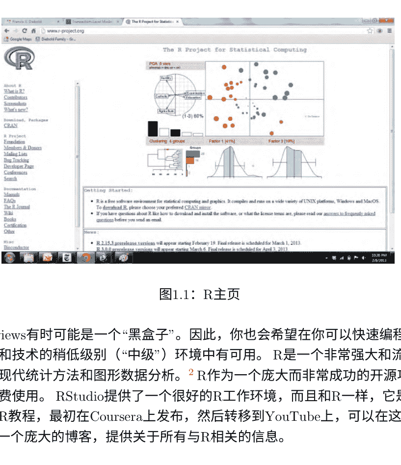

图1.1：R主页

然而，Eviews有时可能是一个“黑盒子”。因此，你也会希望在你可以快速编程、评估和应用新工具和技术的稍低级别（“中级”）环境中有可用。R是一个非常强大和流行的环境，特别擅长现代统计方法和图形数据分析。R作为一个庞大而非常成功的开源项目的一部分，可以免费使用。RStudio提供了一个很好的R工作环境，而且和R一样，它是免费的。一个很好的R教程，最初在Coursera上发布，然后转移到YouTube上，可以在这里找到。R-bloggers是一个庞大的博客，提供关于所有与R相关的信息。

如果你需要真正的速度，比如用于大规模模拟，你可能需要一个低级别的环境，比如Fortran或C++。而且在极限情况下（在硬件方面），如果你需要用于大规模模拟等的高速并行计算，图形卡（图形处理单元，或GPU）提供了惊人的性能提升，例如在Aldrich等人（2011）的文献中有记录。实际上，真正的极限是量子计算，但我们还没有达到那个阶段。关于计量经济学和统计软件的汇编，请参阅由Marius Ooms在《计量经济学杂志》上维护的软件链接网站。

### 1.2.2 数据

在这里，我们只提到了一些关键的“必知”网站。经济学家资源，由美国经济学会维护，是一个非常好的门户网站，几乎包含了经济学家感兴趣的任何内容。它包含了数百个链接到数据源、期刊、专业组织等的链接。FRED（美联储经济数据）是一个非常方便的经济数据来源。美国经济研究局网站提供了关于美国商业周期的数据，而美联储银行的实时数据研究中心则提供了实时数据。

费城拥有实时的宏观经济数据。Quandl是一个有趣的新进入者，覆盖范围广泛；它似乎拥有每一个时间序列，并且有一个很好的R接口。

### 1.2.3 标记

标记语言有效地提供排版或“文字处理”。HTML是最著名的例子。研究论文和书籍通常使用LaTeX编写。MiCTeX是一个好的、流行的LaTeX版本，而TeXworks是一个专为LaTeX设计的好编辑器。knitr是一个R包，但值得单独提及，因为它强大地集成了R和LaTeX。您可以在RStudio中访问所有内容。

另一个值得一提的标记语言是Sphinx，它在Python下运行。Stachurchski-Sargent的电子书《Quantitative Economics》中，Python占据了重要地位，是用Sphinx编写的。

### 1.2.4 版本控制

Git和GitHub对于开放/协作开发和版本控制非常有用。对于我这种小组项目，我发现Dropbox或类似的工具可以让我保持同步，但对于严肃的大规模开发，使用git或类似的工具似乎至关重要。

## 1.3 练习、问题和补充

- 1. 经济时间序列分析的方法和问题。
考虑以下观点/反观点。在每种情况下，你认为哪种对于经济时间序列分析更有用？为什么？

    - 连续/离散
    - 线性/非线性
    - 确定性/随机性
    - 单变量/多变量
    - 时间域/频率域
    - 条件均值/条件方差
    - 趋势/季节/周期/噪声
    - 按时间顺序排列/按空间顺序排列
    - 股票/流量
    - 平稳的/非平稳的
    - 总体的/细分的
    - 高斯的/非高斯的

- 2. 诺贝尔奖与时间序列分析相关的工作。
请访问经济学诺贝尔奖网站。阅读关于经济学诺贝尔奖得主Frisch、Tinbergen、Kuznets、Tobin、Klein、Modigliani、Friedman、Lucas、Engle、Granger、Prescott、Sargent、Sims、Fama、Shiller和Hansen的信息。他们都对时间序列分析做出了广泛的贡献或广泛地使用了该方法。其他获得该奖项的计量经济学家和实证经济学家包括Leontief、Heckman、McFadden、Koopmans、Stone、Modigliani和Haavelmo。

## 1.4 注释

- 研究时间序列，例如天文观测，早在有记录的历史之前就存在了。早期的经济学作家偶尔明确提到天文学是他们思想的来源。例如，Cournot强调，与天文学一样，有必要认识到独立于周期性变化的长期变化。同样，Jevons明确表示他对短期波动的研究采用了天文学和气象学的方法。19世纪，对社会和经济时间序列的兴趣和分析逐渐发展成为一个独立于天文学和气象学发展的新领域。时间序列分析随后蓬勃发展。Nerlove等人（1979年）对该领域的早期发展提供了简要历史。

- 有关新旧参考资料，请参阅附录A中的“图书馆”。

## 第二章

## 沃尔德表示及其近似

### 2.1 环境

时间序列 $Y_t$ （双向无限）

实现 $y_t$ （再次双向无限）

样本路径 $y_t, t=1,...,T$

严格平稳性
一组观测的联合累积分布函数仅依赖于位移，而不是时间。

弱平稳性
(二阶平稳性，广义平稳性，协方差平稳性，...)

$$E y_t = \mu, \quad \forall t$$
$$\gamma(t, \tau) = E(y_t - E y_t)(y_{t+\tau} - E y_{t+\tau}) = \gamma(\tau), \quad \forall t$$
$$0 < \gamma(0) < \infty$$

自协方差函数

- (a) 对称的
$\gamma(\tau) = \gamma(-\tau), \quad \forall \tau$
- (b) 非负定
$a'\Sigma a \geq 0, \quad \forall a$
其中Toeplitz矩阵$\Sigma$的$ij$元素为 $\gamma(i-j)$
- (c) 受方差限制
$\gamma(0) \geq |\gamma(\tau)|, \quad \forall \tau$

自协方差生成函数
$$g(z) = \sum_{\tau=-\infty}^{\infty} \gamma(\tau) z^{\tau}$$

自相关函数
$$\rho(\tau) = \frac{\gamma(\tau)}{\gamma(0)}$$

## 2.2 白噪声

- 白噪声: η_t ~ WN(μ, σ²) (序列不相关)
- 零均值白噪声: η_t ~ WN(0, σ²)
- 独立(强)白噪声: η_t ~ (0, σ²) （独立同分布）
- 高斯白噪声: η_t ~ N(0, σ²) （独立同分布）

强白噪声的无条件矩结构
$$E(η_t) = 0$$
$$var(η_t) = σ^2$$

强白噪声的条件矩结构
$$E(η_t | Ω_{t-1}) = 0$$
$$var(η_t | Ω_{t-1}) = E[(η_t - E(η_t | Ω_{t-1}))^2 | Ω_{t-1}] = σ^2$$
其中
$$Ω_{t-1} = η_{t-1}, η_{t-2}, ...$$

强白噪声的自相关结构
$$\gamma(\tau) = \begin{cases} \sigma^2, & \tau = 0 \\ 0, & \tau \ge 1 \end{cases}$$

$$\rho(\tau) = \begin{cases} 1, & \tau = 0 \\ 0, & \tau \ge 1 \end{cases}$$

关于均值处理的一点说明
在理论工作中，我们假设均值为零，$\mu = 0$。
这样可以减少符号混乱，并且不会损失一般性。
(将 $y_t$ 视为已经围绕其均值 $\mu$ 居中，并注意到 $y_t - \mu$ 的构造使其均值为零。)
(在实证工作中，我们明确允许非零均值，可以通过将数据居中在样本均值周围或包括截距来实现。)

## 2.3 WOLD分解和一般线性过程

在正则条件下，每个协方差平稳过程 $\{y_t\}$ 可以表示为：
$$y_t = \sum_{i=0}^{\infty} b_i \varepsilon_{t-i}$$
其中：
$$b_0 = 1$$
$$\sum_{i=0}^{\infty} b_i^2 < \infty$$
$$\varepsilon_t = [y_t - P(y_t|y_{t-1}, y_{t-2}, ...)] \sim WN(0, \sigma^2)$$

广义线性过程
$$y_t = B(L)\varepsilon_t = \sum_{i=0}^{\infty} b_i \varepsilon_{t-i}$$
$$\varepsilon_t \sim WN(0, \sigma^2)$$
$$b_0 = 1$$
$$\sum_{i=0}^{\infty} b_i^2 < \infty$$

LRCSSP的无条件矩结构
$$E(y_t) = E\left(\sum_{i=0}^{\infty} b_i \varepsilon_{t-i}\right) = \sum_{i=0}^{\infty} b_i E\varepsilon_{t-i} = \sum_{i=0}^{\infty} b_i \cdot 0 = 0$$
$$var(y_t) = var\left(\sum_{i=0}^{\infty} b_i \varepsilon_{t-i}\right) = \sum_{i=0}^{\infty} b_i^2 var(\varepsilon_{t-i}) = \sigma^2 \sum_{i=0}^{\infty} b_i^2$$

条件矩结构
$$E(y_t|\Omega_{t-1}) = E(\varepsilon_t|\Omega_{t-1}) + b_1 E(\varepsilon_{t-1}|\Omega_{t-1}) + b_2 E(\varepsilon_{t-2}|\Omega_{t-1}) + ...$$
$$(\Omega_{t-1} = \varepsilon_{t-1}, \varepsilon_{t-2}, ...)$$
$$= 0 + b_1 \varepsilon_{t-1} + b_2 \varepsilon_{t-2} + ... = \sum_{i=1}^{\infty} b_i \varepsilon_{t-i}$$

$$var(y_t|\Omega_{t-1}) = E[(y_t - E(y_t|\Omega_{t-1}))^2|\Omega_{t-1}]$$
$$= E(\varepsilon_t^2|\Omega_{t-1}) = E(\varepsilon_t^2) = \sigma^2$$
> （这些计算假设强白噪声创新。为什么？）

自协方差结构
$$\gamma(\tau) = E\left[ \left( \sum_{i=0}^{\infty} b_i \varepsilon_{t-i} \right) \left( \sum_{h=0}^{\infty} b_h \varepsilon_{t-\tau-h} \right) \right] = \sigma^2 \sum_{i=0}^{\infty} b_i b_{i-\tau}$$
(其中 $b_i \equiv 0$ 如果 $i < 0$)
$$g(z) = \sigma^2 B(z) B(z^{-1})$$

## 2.4 近似沃尔德表示

### 2.4.1 MA(q) 过程
(明显截断)
无条件矩结构，条件矩结构，自协方差函数，平稳性和可逆性条件

### 2.4.2 AR(p) 过程
(随机差分方程)
无条件矩结构，条件矩结构，自协方差函数，平稳性和可逆性条件

### 2.4.3 ARMA(p,q) 过程
有理 B(L)，后来的有理谱，以及与状态空间的联系。
无条件矩结构，条件矩结构，自协方差函数，平稳性和可逆性条件

## 2.5 维纳-科尔莫戈洛夫-沃尔德提取和预测

### 2.5.1 提取

### 2.5.2 预测
$$y_t = \varepsilon_t + b_1 \varepsilon_{t-1} + ...$$
$$+ b_h \varepsilon_T + b_{h+1} \varepsilon_{T-1} + ...$$
项目在$\Omega_T = \{\varepsilon_T, \varepsilon_{T-1}, ...\}$上进行，以获得：
$$y_{T+h,T} = b_h \varepsilon_T + b_{h+1} \varepsilon_{T-1} + ...$$
请注意，投影是在无限过去
预测误差上进行的
$$e_{T+h,T} = y_{T+h} - y_{T+h,T} = \sum_{i=0}^{h-1} b_i \varepsilon_{T+h-i}$$
（一个MA(h-1)过程！）
$$E(e_{T+h,T}) = 0$$
$$var(e_{T+h,T}) = \sigma^2 \sum_{i=0}^{h-1} b_i^2$$

沃尔德链规则自回归
考虑一个AR(1)过程：
$$y_t = \phi y_{t-1} + \varepsilon_t$$

- 历史：
$$\{y_t\}_{t=1}^T$$

- 立即，
$$y_{T+1,T} = \phi y_T$$
$$y_{T+2,T} = \phi y_{T+1,T} = \phi^2 y_T$$
$$\vdots$$
$$y_{T+h,T} = \phi y_{T+h-1,T} = \phi^h y_T$$

对于AR(p)和AR($\infty$)的扩展是直接的。

## 2.6 多元

### 2.6.1 环境
$(y_{1t}, y_{2t})'$ 如果协方差平稳，则为：
$$E(y_{1t}) = \mu_1 \; \forall \; t$$
$$E(y_{2t}) = \mu_2 \; \forall \; t$$
$$\Gamma_{y_1y_2}(t, \tau) = E \begin{pmatrix} y_{1t} - \mu_1 \\ y_{2t} - \mu_2 \end{pmatrix} (y_{1,t-\tau} - \mu_1, y_{2,t-\tau} - \mu_2)$$
$$=\begin{pmatrix} \gamma_{11}(\tau) & \gamma_{12}(\tau) \\ \gamma_{21}(\tau) & \gamma_{22}(\tau) \end{pmatrix}$$
$$\tau = 0, 1, 2, ...$$

交叉协方差和生成函数
$$\gamma_{12}(\tau) = \gamma_{12}(-\tau)$$
$$\gamma_{12}(\tau) = \gamma_{21}(-\tau)$$
$$\Gamma_{y_1y_2}(\tau) = \Gamma'_{y_1y_2}(-\tau), \ \tau = 0, 1, 2, ...$$
$$G_{y_1y_2}(z) = \sum_{\tau=-\infty}^{\infty} \Gamma_{y_1y_2}(\tau) z^{\tau}$$

交叉相关
$$R_{y_1y_2}(\tau) = D_{y_1y_2}^{-1} \Gamma_{y_1y_2}(\tau) D_{y_1y_2}^{-1}, \ \tau = 0, 1, 2, ...$$
$$D = \begin{pmatrix} \sigma_1 & 0 \\ 0 & \sigma_2 \end{pmatrix}$$

### 2.6.2 多元通用线性过程
$$\begin{pmatrix} y_{1t} \\ y_{2t} \end{pmatrix} = \begin{pmatrix} B_{11}(L) & B_{12}(L) \\ B_{21}(L) & B_{22}(L) \end{pmatrix} \begin{pmatrix} \varepsilon_{1t} \\ \varepsilon_{2t} \end{pmatrix}$$
$$y_t = B(L)\varepsilon_t = (I + B_1L + B_2L^2 + ...)\varepsilon_t$$
$$E(\varepsilon_t\varepsilon'_s) = \begin{cases} \Sigma & \text{if } t = s \\ 0 & \text{otherwise} \end{cases}$$
$$\sum_{i=0}^{\infty} \| B_i \|^2 < \infty$$

## 自相关结构

$$\Gamma_{y_1 y_2}(\tau) = \sum_{i=-\infty}^{\infty} B_i \Sigma B'_{i-\tau}$$
（其中 $B_i = 0$ 如果 $i < 0$）

$$G_y(z) = B(z) \Sigma B'(z^{-1})$$

## 2.6.3 向量自回归

$N$变量VAR的阶数 $p$:
$$\Phi(L) \ y_t = \varepsilon_t$$
$$(N \times N) (N \times 1) (N \times 1)$$

$$\varepsilon_t \sim (0, \Sigma)$$
$$(N \times 1) (N \times N)$$

-   简单估计和分析（OLS）
-   Granger-Sims因果关系
-   在理论化之前搞清楚事实；评估经济理论所暗示的限制冲击响应函数

一个对 $y_{it}$（单独）的冲击如何动态地影响 $y_{jt}$？

冲击响应是MA（$\infty$）表示的一部分:
$$y_t = (I + \Theta_1 L + \Theta_2 L^2 + ...) \varepsilon_t$$

$$\varepsilon_t \sim (0, \Sigma)$$

问题：$\Sigma$通常不是对角线

## 乔列斯基因子识别

$$(I - \Phi_1 L - ... - \Phi_p L^p)y_t = \varepsilon_t$$

$$(I - \Phi_1 L - ... - \Phi_p L^P)y_t = P v_t$$
$$\text{其中} v_t \sim (0, I) \text{ and } \Sigma = P P'$$

冲击响应函数:

$$y_t = (I + \Theta_1 L + \Theta_2 L^2 + ...) P v_t$$
$$= (P + \Theta_1 P L + \Theta_2 P L^2 + ...) v_t$$

## 2.7 一个小型经验工具包

## 2.7.1 非参数化: 样本自协方差

$$\hat{\gamma}(\tau) = \frac{1}{T} \sum_{t=1}^{T-|\tau|} x_t x_{t+|\tau|}, \tau = 0, \pm 1, ..., \pm (T-1)$$
$$\gamma^*(\tau) = \frac{1}{T-|\tau|} \sum_{t=1}^{T-|\tau|} x_t x_{t+|\tau|}, \tau = 0, \pm 1, ..., \pm (T-1)$$

也许令人惊讶的是, $\hat{\gamma}(\tau)$ 更好

样本自相关的渐近分布

$$\rho = (\rho(0), \rho(1), ..., \rho(r))'$$
$$\sqrt{T}(\hat{\rho} - \rho) \xrightarrow{d} N(0, \Sigma)$$

重要特例 (iid):

$$asyvar(\hat{\rho}(\tau)) = \frac{1}{T}, \forall \tau$$
$$ascov(\hat{\rho}(\tau), \hat{\rho}(\tau+v)) = 0$$

> “巴特利特标准误差”

## 2.7.2 参数化：ARMA模型选择、拟合和诊断

### 2.7.2.1 拟合和选择

拟合：OLS，MLE，GMM。

模型选择（相对模型性能）

不要做什么...

$$MSE = \frac{\sum_{t=1}^{T} e_{t}^{2}}{T}$$

$$R^{2} = 1 - \frac{\sum_{t=1}^{T} e_{t}^{2}}{\sum_{t=1}^{T}(y_{t} - \bar{y})^{2}}$$

$$= 1 - \frac{MSE}{\frac{1}{T}\sum_{t=1}^{T}(y_{t} - \bar{y})^{2}}$$

仍然不好：

$$s^{2} = \frac{\sum_{t=1}^{T} e_{t}^{2}}{T - k}$$

$$s^{2} = \left(\frac{T}{T - k}\right)\left(\frac{\sum_{t=1}^{T} e_{t}^{2}}{T}\right)$$

$$\bar{R}^{2} = 1 - \frac{\sum_{t=1}^{T} e_{t}^{2} / T - k}{\sum_{t=1}^{T}(y_{t} - \bar{y}_{t})^{2} / T - 1}$$

$$= 1 - \frac{s^{2}}{\sum_{t=1}^{T}(y_{t} - \bar{y}_{t})^{2} / T - 1}$$

好：

$$SIC = T^{\left(\frac{k}{T}\right)}\left(\frac{\sum_{t=1}^{T} e_{t}^{2}}{T}\right)$$

更一般地说，

$$SIC = \frac{-2lnL}{T} + \frac{KlnT}{T}$$

一致性（神谕特性）

### 2.7.2.2 诊断

Box-Pierce和相关结果：

$$Q_{BP} = T \sum_{\tau=1}^{m} \hat{\rho}^2(\tau) \sim \chi^2(m)$$

$$Q_{LB} = T(T+2) \sum_{\tau=1}^{m} \left( \frac{1}{T-\tau} \right) \hat{\rho}^2(\tau)$$

## 2.8 练习，问题和补充

-   1. 遍历性。

我们可以（口语上）说，如果可以基于一个实现进行关于其随机结构的一致推断，则时间序列是遍历的。虽然遍历性是描述所讨论的时间序列的分布函数的深层数学特性，但对于平稳时间序列来说，它的意义基本上是在时间上相隔足够远的观测之间的独立性。

遍历性是指仅基于单个实现的一致矩估计能力，而不是关于随机过程的时间-恒定性的平稳性。因此，对于非平稳过程的遍历性提出问题是没有意义的。我们强调，即使有（双重）无限样本路径，也无法“检查”遍历性。直观上讲，无论时间-序列是否遍历性，样本矩都会收敛到一个随机变量。如果时间序列是遍历性的，那么这个随机变量实际上是一个（退化的）常数。因此，即使有一个无限大的样本，也无法确定样本矩是否收敛到一个常数（在重复实现中固定）还是一个随机变量的特定实现（会随实现而变化）。要检查遍历性，必须有一个完整的集合，而这在实践中是不可能的。

由于无法在观察到的时间序列中经验性地检验遍历性，因此注意力集中在研究可以在理论上建立遍历性的特定参数化上。例如，下面讨论的重要LRCSSP始终是遍历的。更一般地，我们寻求足够的条件，以证明大数定律（LLN）成立。对于一系列独立、同分布的随机变量，科尔莫哥洛夫的大数定律成立。对于相关、同分布（无条件）的时间序列，大数定律的充分条件是众所周知的。最近的许多研究探讨了大数定律的充分条件更一般的情况下，如具有异质创新的相关时间序列。由此产生的混合理论、鞅差分理论和近-周期相关序列在White（1984）、Gallant和White（198*）以及White（199*）等人的著作中进行了讨论。

## 2. MA(1)过程的自协方差函数，重新审视。

在文本中我们写道

$$ \gamma(\tau) = E(y_t y_{t-\tau}) = E((\epsilon_t + \theta \epsilon_{t-1})(\epsilon_{t-\tau} + \theta \epsilon_{t-\tau-1})) = \begin{cases} \theta \sigma^2, & \tau = 1 \\ 0, & \text{否则。} \end{cases} $$

通过明确计算期望值来填补缺失的步骤

$$ E((\epsilon_t + \theta \epsilon_{t-1})(\epsilon_{t-\tau} + \theta \epsilon_{t-\tau-1}))。 $$

## 3. 预测 AR 过程。

证明以下内容。

-   (a) 如果 $y_t$ 是一个协方差平稳的 $AR(1)$过程，即 $y_t = \alpha y_{t-1} + \epsilon_t$ 且 $|\alpha| <1$，则 $y_{t+h,t} = \alpha^h y_{t}$。
-   (b) 如果 $y_t$ 是 $AR(2)$模型，
$$ y_t = (\alpha_1 + \alpha_2)y_{t-1} - \alpha_1 \alpha_2 y_{t-2} + \epsilon_t, $$
其中 $| \alpha_1 |, | \alpha_2 | <1$，那么
$$ y_{t+1,t} = (\alpha_1 + \alpha_2)y_t - \alpha_1 \alpha_2 y_{t-1}。 $$
-   (c) 一般来说，$AR(p)$模型的结果为
$$ y_{t+k,t} = \psi_1 y_{t+k-1,t} + ... + \psi_p y_{t+k-p,t}, $$
其中 $y_{t-j} = y_{t-j}$，对于 $j= 0,1,...$，在时间 $t$。因此对于纯自回归模型，最小均方误差预测是仅基于最近观测到的 $p$ 个值的线性组合。

## 4. 预测 MA 过程。

如果 $y_t$ 是 $MA(1)$，
$$ y_t = \epsilon_t - \beta \epsilon_{t-1}, $$
其中 $|\beta| <1$，那么
$$ y_{t+1} = -\beta \sum_{j=0}^{\infty} \beta^j x_{t-j}, $$
而且 $y_{t+k} = 0$ 对于所有 $k > 1$。
对于更一般的移动平均过程，对于未来大于过程阶数的预测为零，对于较近的期间的预测不能用有限数量的过去观测值来表示。

## 5. 预测$ARMA(1,1)$过程。

如果 $y_t$ 是$ARMA(1,1)$，
$$y_t - \alpha y_{t-1} = \epsilon_t - \beta \epsilon_{t-1},$$
其中 $|\alpha|, |\beta| < 1$，那么
$$y_{t+k,t} = \alpha^{k-1}(\alpha - \beta) \sum_{j=0}^{\infty} \beta^j y_{t-j}.$$

## 6. 预测误差动态。

考虑具有强白噪声创新的一般线性过程。证明Wiener-Kolmogorov $h$步预测误差的条件（相对于信息集$\Omega_t = \{\epsilon_t, \epsilon_{t-1}, ...\}$）和无条件矩相同。

## 7. 截断Wiener-Kolmogorov预测器。

考虑样本路径， $\{y_t\}_{t=1}^T$，其中数据生成过程为 $y_t = B(L)\epsilon_t$ 且 $B(L)$ 为无限阶。你如何修改Wiener-Kolmogorov线性最小二乘预测公式以生成一个可操作的3步预测？
（提示：截断。）你建议的预测器是线性最小二乘吗？在仅使用 $T$ 个过去观测的线性预测器类中，最小二乘法是最佳选择吗？

## 8. 实证GDP动态。

-   (a) 从FRB圣路易斯获得通常的季度支出型美国$GDP_E$，1960.1至今。
-   (b) 在排除最近的12个季度数据的情况下，对$GDP_E$对数增长进行完整的自相关分析。
-   (c) 再次排除最近的12个季度数据，为$GDP_E$对数增长指定、估计和辩护适当的 $AR(p)$ 和 $ARMA(p,q)$ 模型。
-   (d) 使用你首选的$GDP_E$对数增长的 $AR(p)$ 和 $ARMA(p,q)$ 模型，为“留存”样本生成12个季度的线性最小二乘路径预测。你的 $AR(p)$ 和 $ARMA(p,q)$ 预测与实际值相比如何？哪个看起来更准确？
-   (e) 从费城联邦储备银行获取ADNSS GDP加上对数增长率，阅读相关信息，并重复上述步骤。
-   (f) 对比 $GDP_E$ 的结果与对数增长和 $GDP_{plus}$ 的结果与对数增长。

## 9. 对住房开工和竣工的时域分析。

-   (a) 从圣路易斯联邦储备银行的FRED获取美国住房开工和竣工的月度数据，进行季节调整，时间范围为1960.1至今。你的两个系列应该具有相等的长度。
-   (b) 仅使用观测值 $\{1, ..., T-4\}$，对开工和竣工进行完整的自相关分析。详细讨论。
-   (c) 仅使用观测值 $\{1, ..., T-4\}$，为开工和竣工指定和估计适当的单变量 $ARMA(p,q)$ 模型，以及适当的 $VAR(p)$。详细讨论。
-   (d) 描述你估计的 $VAR(p)$ 的 Granger 因果结构。详细讨论。
-   (e) 使用所有可能的 Cholesky 排序，描述你估计的 $VAR(p)$ 的冲击响应结构。详细讨论。
-   (f) 使用你偏好的 $ARMA(p,q)$ 模型和 $VAR(p)$ 模型，仅使用观测数据 $\{1, ..., T-4\}$ 进行规范和估计，为“预留数据”的四个季度生成线性最小二乘路径预测，即 $\{T-3, T-2, T-1, T\}$。你的预测与实际值相比如何？详细讨论。

## 10. 因子结构。

考虑双变量线性不确定过程，

$$\begin{pmatrix} y_{1t} \\ y_{2t} \end{pmatrix} = \begin{pmatrix} B_{11}(L) & B_{12}(L) \\ B_{21}(L) & B_{22}(L) \end{pmatrix} \begin{pmatrix} \varepsilon_{1t} \\ \varepsilon_{2t} \end{pmatrix},$$

在通常的假设下。进一步假设 $B_{11}(L)=B_{21}(L)=0$ 和 $\varepsilon_{1t}=\varepsilon_{2t}=\varepsilon_t$ (方差为 $\sigma^2$)。讨论这个系统的性质。为什么它在经济学中可能有用？

## 2.9 注释

通过自回归、移动平均或ARMA模型的方法对时间序列进行表征，这个框架几乎同时由俄罗斯统计学家和经济学家E.斯拉茨基和英国统计学家G.U.尤尔提出。斯拉茨基-尤尔框架在1970年的一本经典著作中被现代化、扩展，并成为创新和操作建模与预测范式的一部分。事实上，ARMA和相关模型通常被称为“Box-Jenkins模型”。

到1930年，斯拉茨基和尤尔已经表明，通过对随机冲击进行加权平均可以获得丰富的动态效果。Wold于1937年提出的著名分解定理将协方差平稳序列分解为随机冲击的加权平均，为维纳、科尔莫哥洛夫、卡尔曼等人的开创性工作铺平了道路。Wold的学生Whittle在1963年进行了精彩的处理，后来在Tom Sargent的精彩介绍下进行了更新和重印，至今仍广泛阅读。宏观经济学的很多基础都建立在斯拉茨基-尤尔-沃尔德-维纳-科尔莫哥洛夫的基础上。关于宏观经济学历史的一部分的迷人概述，请参阅Davies和Mahon（2009），网址为http://www.minneapolisfed.org/publications_papers/pub_display.cfm?id=4348。

## 第三章

## 非参数估计和预测

### 3.1 密度估计

#### 3.1.1 基本问题

独立同分布 $\{x_i\}_{i=1}^N \sim f(x)$ 在 $[x_0 - h, x_0 + h]$ 上平滑的 f 目标：在任意点 $x = x_0$ 估计 $f(x)$

根据均值定理， $f(x_0) \approx \frac{1}{2h} \int_{x_0-h}^{x_0+h} f(u)du = \frac{2}{h}$

估计 $P(x \in [x_0 - h, x_0 + h])$ 通过 $\# x_i \in [x_0 - h, x_0 + h]$

估计 $P(x \in [x_0 - h, x_0 + h])/N$

$\hat{f}_h(x_0) = \frac{1}{2h} \frac{\# x_i \in [x_0 - h, x_0 + h]}{N} = \frac{1}{Nh} \sum_{i=1}^{N} \frac{1}{2} I\left(\left|\frac{x_0 - x_i}{h}\right| \le 1\right)$

“罗森布拉特估计器”核 密度估计器，核函数为：$K(u) = \frac{1}{2} I(|u| \le 1)$

带宽：$h$

#### 3.1.2 核密度估计

均匀核函数的问题：

-   1. 为什么要给远离的观测值赋予与附近观测值一样的权重？
-   2. 如果我们认为 $f$ 是平滑的，为什么要使用不连续的核函数？

明显的解决方案：选择平滑核函数

标准条件：

$$\int K(u)du = 1$$
$$K(u) = K(-u)$$

常见的核函数选择

-   标准正态分布：$K(u) = \frac{1}{\sqrt{2\pi}} e^{-\frac{u^2}{2}}$
-   三角：$K(u) = (1 - |u|)I(|u| \leq 1)$
-   Epinechnikov: $K(u) = \frac{3}{4}(1 - u^2)I(|u| \leq 1)$

核密度估计的一般形式

$$\hat{f}_h(x_0) = \frac{1}{N h} \sum_{i=1}^N K\left( \frac{x_0 - x_i}{h} \right)$$

“罗森布拉特-帕兹恩估计器”

#### 3.1.3 偏差-方差权衡

##### 3.1.3.1 不可避免的偏差-方差权衡（在实践中，固定 $N$）

##### 3.1.3.2 可避免的偏差-方差权衡（在理论中，$N \to \infty$）

$$E(\hat{f}_h(x_0)) \approx f(x_0) + \frac{h^2}{2} \cdot O_p(1)$$
（所以 $h \to 0 \implies bias \to 0$）

$$var(\hat{f}_h(x_0)) \approx \frac{1}{N h} \cdot O_p(1)$$
（所以 $N h \to \infty \implies var \to 0$）

因此,

$$\left. \begin{array}{l} h \to 0 \\ N h \to \infty \end{array} \right\} \implies \hat{f}_h(x_0) \xrightarrow{p} f(x_0)$$

## 3.1.3.3 收敛速度

$$\sqrt{N} h(\hat{f}_h(x_0) - f(x_0)) \xrightarrow{d} D$$

K的影响较小；h的影响较大。

## 3.1.4 最优带宽选择

$$MSE(\hat{f}_h(x_0)) = E\left(\hat{f}_h(x_0) - f(x_0)\right)^2$$
$$IMSE = \int MSE(\hat{f}_h(x_0)) f(x) dx$$

选择带宽以最小化IMSE：

$$h^* = \gamma^* N^{-1/5}$$

相应的最佳收敛速度

回顾：

$$\sqrt{N} h \left(\hat{f}_h(x_0) - f(x_0)\right) \xrightarrow{d} D$$
$$h^* \propto N^{-1/5}$$

代入得到最佳可获得速度：

$$\sqrt{N^{4/5}} \left( \hat{f}_h(x_0) - f(x_0) \right) \xrightarrow{d} D$$

“Stone最佳速度”

Silverman规则

对于高斯情况，

$$h^* = 1.06 \sigma N^{-1/5}$$

因此使用：

$$\hat{h}^* = 1.06 \hat{\sigma} N^{-1/5}$$

最好稍微少一些平滑：

$$\hat{h}^* = \hat{\sigma} N^{-1/5}$$

## 3.2 多元

之前的单变量核密度估计器：

$$\hat{f}_h(x_0) = \frac{1}{N h} \sum_{i=1}^N K \left( \frac{x_0 - x_i}{h} \right)$$

可以写成：

$$\hat{f}_h(x_0) = \frac{1}{N} \sum_{i=1}^N K_h(x_0 - x_i)$$

其中 $K_h(\cdot) = \frac{1}{h} K \left( \frac{\cdot}{h} \right)$

或者 $K_h(\cdot) = h^{-1} K(h^{-1} \cdot)$

多元版本（d维）

精确地遵循方程（3.2）：

$$\hat{f}_H(x_0) = \frac{1}{N} \sum_{i=1}^N K_H(x_0 - x_i),$$

其中 $K_H(\cdot) = |H|^{-1} K(H^{-1} \cdot)$，而 $H$（d×d）是半正定的。

常见选择：$ K(u) = N(0, I), H = hI $

$$ \implies K_H(\cdot) = \frac{1}{h^d} K\left( \frac{1}{h} \cdot \right) = \frac{1}{h^d} K\left( \frac{x_0 - x_i}{h} \right) $$

$$ \implies \hat{f}_h(x_0) = \frac{1}{N h^d} \sum_{i=1}^{N} K\left( \frac{x_0 - x_i}{h} \right) $$

偏差-方差权衡，收敛速度，最优带宽，相应的最优收敛速度

$$ \left. \begin{array}{l} h \to 0 \\ N h^d \to \infty \end{array} \right\} \implies \hat{f}_h(x_0) \overset{p}{\to} f(x_0) $$

$$ \sqrt{N h^d} \left( \hat{f}_h(x_0) - f(x_0) \right) \overset{d}{\to} D $$

$$ h^* \propto N^{-\frac{1}{d+4}} $$

$$ \sqrt{N^{1-\frac{d}{d+4}}} \left( \hat{f}_h(x_0) - f(x_0) \right) \overset{d}{\to} D $$

Stone最优速率随着 $ d $ 的减小而下降

“维度诅咒”

Silverman的规则

$$ \hat{h}^* = \left( \frac{4}{d+2} \right)^{\frac{1}{d+4}} \hat{\sigma} N^{-\frac{1}{d+4}} $$

其中

$$ \hat{\sigma}^2 = \frac{1}{d} \sum_{i=1}^{d} \hat{\sigma}_i^2 $$

(样本方差的平均)

## 3.3 函数估计

条件均值（回归）

$$E(y|x) = M(x) = \int y \frac{f(y, x)}{f(x)} dy$$

斜率回归

$$\beta(x) = \frac{\partial M(x)}{\partial x_j} = \lim_{h \to 0} \frac{M(x + \frac{h}{2}) - M(x - \frac{h}{2})}{h}$$

回归扰动密度

$$f(u), u = y - M(x)$$

条件方差

$$var(y|x) = V(x) = \int y^2 \frac{f(y, x)}{f(x)} dy - M(x)^2$$

危险函数

$$\lambda(t) = \frac{f(t)}{1 - F(t)}$$

曲率（高阶导数估计）

$$C(x) = \frac{\partial}{\partial x_j} \beta(x) = \left( \frac{\partial^2}{\partial x_j^2} \right) M(x) = \lim_{h \to 0} \frac{\beta(x + \frac{h}{2}) - \beta(x - \frac{h}{2})}{h}$$

维度诅咒对曲率的影响更严重...

$d$-向量: $r = (r_1, ..., r_d)$, $|r| = \sum_{i=1}^d r_i$

定义 $M^{(r)}(x) \equiv \partial^{|r|} x_1^{r_1}, ..., x_d^{r_d} M(x)$

那么 $\sqrt{N} h^{2|r|+d} [\hat{M}^{(r)}(x_0) - M^{(r)}(x_0)] \rightarrow_d D$

## 3.4 本地非参数回归

### 3.4.1 核回归

$$M(x_0) = \int y f(y|x_0) dy = \int y \frac{f(x_0, y)}{f(x_0)} dy$$

使用多元核密度估计和操作得到“Nadaraya-Watson”估计量：

$$\hat{M}_h(x_0) = \sum_{i=1}^N \left[ \frac{K\left(\frac{x_0 - x_i}{h}\right)}{\sum_{i=1}^N K\left(\frac{x_0 - x_i}{h}\right)} \right] y_i$$

$h \to 0, N h \to \infty \implies$

$$\sqrt{N h^d} (\hat{M}_h(x_0) - M(x_0)) \xrightarrow{d} N(0, V)$$

### 3.4.2 最近邻回归

### 3.4.2.1 基本最近邻回归

$\hat{M}_k(x_0) = \frac{1}{k} \sum_{i \in n(x_0)} y_i$ (局部常数, 均匀加权)

$k \to \infty, \frac{k}{N} \to 0 \Rightarrow \hat{M}_k (x_0) \xrightarrow{P} M(x_0)$

$$\sqrt{k} (\hat{M}_k(x_0) - M(x_0)) \xrightarrow{d} D$$

等价于Nadaraya-Watson核回归，其中：

$K(u) = \frac{1}{2} I(|u| \le 1)$ (均匀) 和 $h = R(k)$ (从 $x_0$ 到 $k^{th}$ 最近邻的距离)

$\Rightarrow$可变带宽！

### 3.4.2.2 局部加权最近邻回归 (局部多项式, 非均匀加权)

$$y_t = g(x_t) + \varepsilon_t$$

计算 $\hat{g}(x^*)$ :

$0 < \xi \le 1$

$k_T = \text{int}(\xi \cdot T)$

使用范数找到 $K_T$个最近邻：

$\lambda(x^*, x^*_{k_T}) = [\sum_{j=1}^P (x^*_{k_T j} - x^*_j)^2]^{\frac{1}{2}}$

邻域权重函数:

$$v_t(x_t, x^*, x_{k_T}^*) = C\left(\frac{\lambda(x_t, x^*)}{\lambda(x^*, x_{k_T}^*)}\right)$$

$$C(u) = \begin{cases} (1-u^3)^3 & \text{对于 } u < 1 \\ 0 & \text{否则} \end{cases}$$

## 3.5 全局非参数回归

### 3.5.1 系列（筛选、投影等）

$$M(x_0) = \Sigma_{j=0}^{\infty} \beta_j \phi_j(x_0)$$
(the $\phi_j$ are orthogonal basis functions)
$$\hat{M}_J(x_0) = \Sigma_{j=0}^{J} \hat{\beta}_j \phi_j(x_0)$$

$$J \rightarrow \infty, \frac{J}{N} \rightarrow 0 \Rightarrow \hat{M}_J(x_0) \stackrel{P}{\rightarrow} M(x_0)$$
对于适当选择的 $J$，石头最优收敛速度。

### 3.5.2 神经网络

通过“压缩函数”运行输入的线性组合 $i=1, ..., R$输入，$j = 1, ..., S$ 神经元
$$h_{jt} = \Psi(\gamma_{j0} + \Sigma_{i=1}^{R} \gamma_{ij} x_{it}), j = 1, ..., S \text{ (神经元 } j \text{ )}$$
例如，$\Psi(\cdot)$可以是逻辑回归，0-1（分类）
$$O_t = \Phi(\beta_0 + \Sigma_{j=1}^{S} \beta_j h_{jt})$$
例如，$\Phi(\cdot)$可以是恒等函数
简洁地说：$$O_t = \Phi(\beta_0 + \Sigma_{j=1}^{S} \beta_j \Psi(\gamma_{j0} + \Sigma_{i=1}^{R} \gamma_{ij} x_{it})) \equiv f(x_t; \theta)$$
通用逼近器：$$S \rightarrow \infty, \frac{S}{N} \rightarrow 0 \Rightarrow \hat{O}(x_0) \rightarrow_p O(x_0)$$
与其他非参数方法相同。

## 3.6 时间序列方面

1. 许多结果在混合或马尔可夫条件下成立。
2. 递归核回归。
    使用递归核估计器：
    $$\hat{f}_N(x_0) = \left(\frac{N-1}{N}\right)\hat{f}_{N-1}(x_0) + \frac{1}{N h^d} K\left(\frac{x_0 - x_N}{h}\right)$$

得到：

$$\hat{M}_N(x_0) = \frac{(N-1)h^d \hat{f}_{N-1}(x_0) \hat{M}_{N-1}(x_0) + Y_N K\left(\frac{x_0 - x_N}{h}\right)}{(N-1)h^d \hat{f}_{N-1}(x_0) + K\left(\frac{x_0 - x_N}{h}\right)}$$

3. 通过递归预测选择带宽。

4. 非参数非线性自回归。

$$y_t = g(y_{t-1}, ..., y_{t-p}) + \varepsilon_t$$
$$E(y_{t+1} \mid y_t, ..., y_{t-p+1}) = \int y_{t+1} f(y_{t+1} \mid y_t, ..., y_{t-p+1}) dy$$
$$= \int y_{t+1} \frac{f(y_{t+1}, ..., y_{t-p+1})}{f(y_t, ..., y_{t-p+1})} dy$$

实现：核函数、序列、神经网络、局部加权回归

5. 循环神经网络。

$$h_{jt} = \Psi(\gamma_{j0} + \Sigma_{i=1}^R \gamma_{ij} x_{it} + \Sigma_{l=1}^S \delta_{jl} h_{l, t-1}), j = 1, ..., S$$

$$O_t = \Phi(\beta_0 + \Sigma_{j=1}^S \beta_j h_{jt})$$

简洁地说：$$O_t = \Phi(\beta_0 + \Sigma_{j=1}^S \beta_j \Psi(\gamma_{j0} + \Sigma_{i=1}^R \gamma_{ij} x_{it} + \Sigma_{l=1}^S \delta_{jl} h_{l, t-1}))$$

回代法：

$$O_t = g(x_t, x_{t-1}, ..., x_1; \theta)$$

## 3.7 练习，问题和补充

1. 对于时间序列预测，紧密参数化模型通常是最好的选择。广义并不总是好的；限制通常有助于！
2. 半参数化和相关方法。
$\sqrt{N}$一致估计。自适应估计。

## 3.8 注释

# 第四章

## 频谱分析

### 4.1 频谱分析的多种用途

频谱分析

- 与acov函数一样，“搞清楚事实”
- 趋势和持久性（接近零的功率）
- 积分，协整和长期记忆
- 周期（在周期频率上的功率）
- 季节性（在基本频率和谐波上的功率峰值）
- 滤波分析和设计
- 最大似然估计（包括带宽频谱）
- 评估模型和数据之间的一致性
- 鲁棒（HAC）方差估计

### 4.2 频谱及其属性

回顾一般线性过程

$$y_t = B(L)\varepsilon_t = \sum_{i=0}^{\infty} b_i \varepsilon_{t-i}$$

自协方差生成函数：

$$g(z) = \sum_{\tau=-\infty}^{\infty} \gamma(\tau) \, z^{\tau}$$
$$= \sigma^{2} B(z)B(z^{-1})$$

$\gamma(\tau)$ 和 $g(z)$ 是一对z变换

频谱

在单位圆上评估$g(z)$，$z = e^{-i\omega}$：

$$g(e^{-i\omega}) = \sum_{\tau=-\infty}^{\infty} \gamma(\tau) e^{-i\omega\tau}, \quad -\pi < \omega < \pi$$

$$= \sigma^2 B(e^{i\omega}) B(e^{-i\omega})$$

$$= \sigma^2 |B(e^{i\omega})|^2$$

频谱

三角形式：

$$g(\omega) = \sum_{\tau=-\infty}^{\infty} \gamma(\tau)e^{-i\omega\tau}$$

$$= \gamma(0) + \sum_{\tau=1}^{\infty} \gamma(\tau) \left( e^{i\omega\tau} + e^{-i\omega\tau} \right)$$

$$= \gamma(0) + 2 \sum_{\tau=1}^{\infty} \gamma(\tau) \cos(\omega\tau)$$

谱密度函数

$$f(\omega) = \frac{1}{2\pi} g(\omega)$$

$$f(\omega) = \frac{1}{2\pi} \sum_{\tau=-\infty}^{\infty} \gamma(\tau)e^{-i\omega\tau} \quad (-\pi < \omega < \pi)$$

$$= \frac{1}{2\pi} \gamma(0) + \frac{1}{\pi} \sum_{\tau=1}^{\infty} \gamma(\tau) \cos(\omega\tau)$$

$$= \frac{\sigma^2}{2\pi} B \left( e^{i\omega} \right) B \left( e^{-i\omega} \right)$$

$$= \frac{\sigma^2}{2\pi} |B \left( e^{i\omega} \right)|^2$$

频谱和谱密度的性质

1. 关于 $\omega = 0$ 对称
2. 实数值
3. $2\pi$周期性
4. 非负

傅里叶变换对

$$g(\omega) = \sum_{\tau=-\infty}^{\infty} \gamma(\tau) e^{-i\omega\tau}$$

$$\gamma(\tau) = \frac{1}{2\pi} \int_{-\pi}^{\pi} g(\omega) e^{i\omega\tau} d\omega$$

按频率的方差分解

$$\gamma(\tau) = \frac{1}{2\pi} \int_{-\pi}^{\pi} g(\omega) e^{i\omega\tau} d\omega$$

$$= \int_{-\pi}^{\pi} f(\omega) e^{i\omega\tau} d\omega$$

因此

$$\gamma(0) = \int_{-\pi}^{\pi} f(\omega) d\omega$$

鲁棒方差估计

$$\bar{x} = \frac{1}{T} \sum_{t=1}^{T} x_t$$
$$var(\bar{x}) = \frac{1}{T^2} \sum_{s=1}^{T} \sum_{t=1}^{T} \gamma(t-s)$$
（“添加行求和”）
$$= \frac{1}{T} \sum_{\tau=-(T-1)}^{T-1} \left(1-\frac{|\tau|}{T}\right) \gamma(\tau)$$
（“添加对角线求和”，使用变量变换 $\tau = t-s$）

因此:

$$\sqrt{T}(\bar{x}-\mu) \sim \left(0, \sum_{\tau=-(T-1)}^{T-1} \left(1-\frac{|\tau|}{T}\right) \gamma(\tau)\right)$$

$$\sqrt{T}(\bar{x}-\mu) \xrightarrow{d} N(0, g_x(0))$$

## 4.3 有理谱

### 白噪声谱密度

$$y_t = \varepsilon_t$$

$$\varepsilon_t \sim WN(0, \sigma^2)$$

$$f(\omega) = \frac{\sigma^2}{2\pi} B\left(e^{i\omega}\right)B\left(e^{-i\omega}\right)$$

$$f(\omega) = \frac{\sigma^2}{2\pi}$$

### AR(1)谱密度

$$y_t = \phi y_{t-1} + \varepsilon_t$$

$$\varepsilon_t \sim WN(0, \sigma^2)$$

$$f(\omega) = \frac{\sigma^2}{2\pi} B(e^{i\omega})B(e^{-i\omega})$$

$$= \frac{\sigma^2}{2\pi} \frac{1}{(1-\phi e^{i\omega})(1-\phi e^{-i\omega})}$$

$$= \frac{\sigma^2}{2\pi} \frac{1}{1-2\phi \cos(\omega) + \phi^2}$$

形状如何取决于 $\phi$? 峰值在哪里?

### ARMA(1,1)谱密度

$$(1 - \phi L)y_t = (1 - \theta L)\varepsilon_t$$

$$f(\omega) = \frac{\sigma^2}{2\pi} \frac{1-2\theta\cos(\omega) + \theta^2}{1-2\phi\cos(\omega) + \phi^2}$$

“有理谱密度”

内部峰值？需要什么条件？

图4.1：格兰杰经济变量的典型谱形状

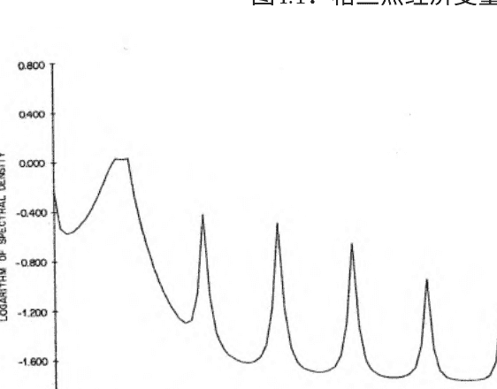

## 4.4 多元

多元频域

协方差生成函数;

$$G_{yx}(z)=\sum_{\tau=-\infty}^{\infty}\Gamma_{yx}(\tau)z^{\tau}$$

谱密度函数:

$$F_{yx}(\omega)=\frac{1}{2\pi}G_{yx}(e^{-i\omega})$$
$$=\frac{1}{2\pi}\sum_{\tau=-\infty}^{\infty}\Gamma_{yx}(\tau)e^{-i\omega\tau},\quad -\pi < \omega < \pi$$

(复数)

共谱和正交谱

$$F_{yx}(\omega)=C_{yx}(\omega)+iQ_{yx}(\omega)$$
$$C_{yx}(\omega)=\frac{1}{2\pi}\sum_{\tau=-\infty}^{\infty}\Gamma_{yx}(\tau)\cos(\omega\tau)$$
$$Q_{yx}(\omega)=\frac{-1}{2\pi}\sum_{\tau=-\infty}^{\infty}\Gamma_{yx}(\tau)\sin(\omega\tau)$$

交叉谱

$$f_{yx}(\omega)=ga_{yx}(\omega)exp(i\ ph_{yx}(\omega))$$ (通用交叉谱)

$$ga_{yx}(\omega) = [C_{yx}^2(\omega) + Q_{yx}^2(\omega)]^{\frac{1}{2}}$$ (增益)

$$ph_{yx}(\omega) = arctan \left( \frac{Q_{yx}(\omega)}{C_{yx}(\omega)} \right)$$ (相位)

(相位偏移以时间单位为 \(\frac{ph(\omega)}{\omega}\))

$$coh_{yx}(\omega) = \frac{|f_{yx}(\omega)|^2}{f_{xx}(\omega)f_{yy}(\omega)}$$ (相干性)

### 频率分解的平方相关性

用于滤波器设计和分析的有用谱结果

- (线性滤波器的效果)
  - 如果 \(y_t = B(L)x_t\), 那么:
    - \(f_{yy}(\omega) = |B(e^{-i\omega})|^2 f_{xx}(\omega)\)
    - \(f_{yx}(\omega) = B(e^{-i\omega})f_{xx}(\omega)\).
  - \(B(e^{-i\omega})\) 是滤波器的频率响应函数。

- 一系列线性滤波器的效果（显而易见）
  - 如果 \(y_t = A(L)B(L)x_t\), 那么
    - \(f_{yy}(\omega) = |A(e^{-i\omega})|^2 |B(e^{-i\omega})|^2 f_{xx}(\omega)\)
    - \(f_{yx}(\omega) = A(e^{-i\omega})B(e^{-i\omega})f_{xx}(\omega)\).

- (独立和的频谱)
  - 如果 \(y = \sum_{i=1}^{N} x_i\), 并且 \(x_i\) 是独立的，那么
    - \(f_{y}(\omega) = \sum_{i=1}^{N} f_{x_i}(\omega)\).

细微差别...注意

$$B(e^{-i\omega}) = \frac{f_{yx}(\omega)}{f_{xx}(\omega)}$$

$$\Longrightarrow B(e^{-i\omega}) = \frac{ga_{yx}(\omega)e^{i\ ph_{yx}(\omega)}}{f_{xx}(\omega)}$$

\(f_{yx}\) 的相位( \(\omega\)) 和 \(B(e^{-i\omega})\) 是相同的。

增益密切相关。

### 例子

$$y_t = .5x_{t-1} + \varepsilon_t$$

相关结构

自相关和交叉相关函数很直观：

$$\varepsilon_t \sim W N(0,1)$$

$$x_t = .9x_{t-1} + \eta_t$$

$$\eta_t \sim W N(0,1)$$

$$\rho_y(\tau) = .9^{|\tau|}$$

$$\rho_x(\tau) \propto .9^{|\tau|}$$

$$\rho_{yx}(\tau) \propto .9^{|\tau-1|}$$

($\rho_{yx}(\tau)$的定性形状是什么？)

频谱密度的$x$

$$x_t = \frac{1}{1 - .9L} \eta_t$$

$$\Rightarrow f_{xx}(\omega) = \frac{1}{2\pi} \cdot \frac{1}{1 - .9e^{-i\omega}} \cdot \frac{1}{1 - .9e^{i\omega}}$$

$$= \frac{1}{2\pi} \cdot \frac{1}{1 - 2(.9)\cos(\omega) + (.9)^2}$$

$$= \frac{1}{11.37 - 11.30 \cos(\omega)}$$

形状？

$y$的谱密度

$$y_t = 0.5Lx_t + \varepsilon_t$$

$$\Rightarrow f_{yy}(\omega) = |0.5e^{-i\omega}|^2 f_{xx}(\omega) + \frac{1}{2\pi}$$

$$= 0.25 f_{xx}(\omega) + \frac{1}{2\pi}$$

$$= \dfrac{0.25}{11.37 - 11.30 \cos(\omega)} + \dfrac{1}{2\pi}$$

形状？

交叉谱

$$B(L) = 0.5L$$

$$B(e^{-i\omega}) = 0.5e^{-i\omega}$$

$$f_{yx}(\omega) = B(e^{-i\omega})f_{xx}(\omega)$$

$$= 0.5e^{-i\omega}f_{xx}(\omega)$$

$$= (0.5f_{xx}(\omega))e^{-i\omega}$$

$$g_{yx}(\omega) = 0.5f_{xx}(\omega) = \dfrac{0.5}{11.37 - 11.30 \cos(\omega)}$$

$$ph_{yx}(\omega) = -\omega$$

(以时间单位计算，$ph_{yx}(\omega) = -1$，所以$y$领先于$x-1$)

相干性

$$\text{Coh}_{yx}(\omega) = \dfrac{|f_{yx}(\omega)|^2}{f_{xx}(\omega)f_{yy}(\omega)} = \dfrac{0.25f_{xx}^2(\omega)}{f_{xx}(\omega)f_{yy}(\omega)} = \dfrac{0.25f_{xx}(\omega)}{f_{yy}(\omega)}$$

$$= \dfrac{0.25 \cdot \dfrac{1}{2\pi} \cdot \dfrac{1}{1 - 2(.9)\cos(\omega) + .9^2}}{0.25 \cdot \dfrac{1}{2\pi} \cdot \dfrac{1}{1 - 2(.9)\cos(\omega) + .9^2} + \dfrac{1}{2\pi}} = \dfrac{1}{8.24 + 7.20 \cos(\omega)}$$

形状？

## 4.5 滤波器分析与设计

滤波器分析：一个微不足道（但重要）的高通滤波器

$$y_t = x_t - x_{t-1}$$

$$\Rightarrow B(e^{-i\omega}) = 1 - e^{-i\omega}$$

因此，滤波器增益为：

$$|B(e^{-i\omega})| = |1 - e^{-i\omega}| = 2(1 - \cos(\omega))$$

对于$B(L) = 1 + L$，增益会如何？

滤波器分析：库兹涅茨的臭名昭著滤波器

总体实际产出增长的低频波动。

“库兹涅茨周期”-20年周期

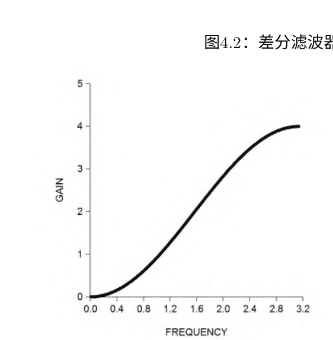

### 滤波器1（移动平均）：

$$y_t = \frac{1}{5} \sum_{j=-2}^{2} x_{t-j}$$

$$\Longrightarrow B_1(e^{-i\omega}) = \frac{1}{5} \sum_{j=-2}^{2} e^{-i\omega j} = \frac{sin(5\omega/2)}{5sin(\omega/2)}$$

因此，滤波器增益为：

$$|B_1(e^{-i\omega})| = \left| \frac{sin(5\omega/2)}{5sin(\omega/2)} \right|$$

- 库兹涅茨滤波器，连续
- 库兹涅茨滤波器，连续

### 滤波器2（高级差分）：

$$z_t = y_{t+5} - y_{t-5}$$

$$\Longrightarrow B_2(e^{-i\omega}) = e^{i5\omega} - e^{-i5\omega} = 2sin(5\omega)$$

因此，滤波器增益为：

$$|B_2(e^{-i\omega})| = |2sin(5\omega)|$$

- 库兹涅茨滤波器，连续
- 库兹涅茨滤波器，连续

复合增益：

图4.3：库兹涅茨滤波器1的增益

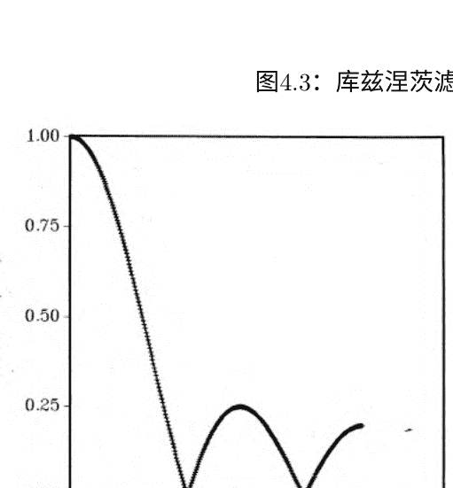

图4.4：库兹涅茨滤波器2的增益

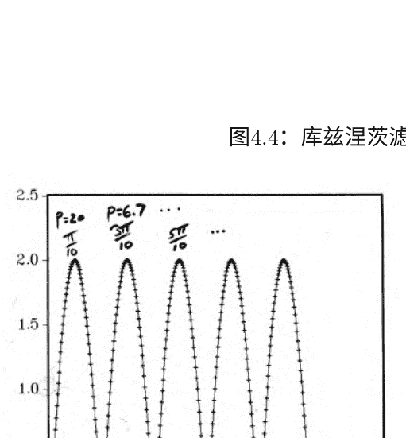

图4.5：库兹涅茨两个滤波器的复合增益

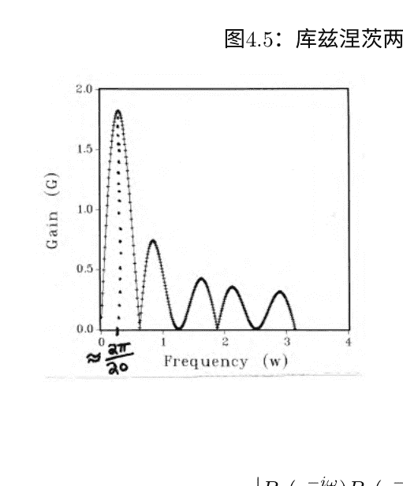

$$|B_1(e^{-i\omega})B_2(e^{-i\omega})| = \left| \frac{\sin(5\omega/2)}{5\sin(\omega/2)} \right| |2\sin(5\omega)|$$

库兹涅茨滤波器，继续

滤波器设计：带通滤波器

典型问题：

找到 $B(L)$ 使得

$$f_y(\omega) = \begin{cases} f_x(\omega) \text{在} [a, b] \cup [-b, -a] \text{上的值} \\ 0 \text{ otherwise} \end{cases}$$

，其中

$$y_t = B(L)x_t = \sum_{j=-\infty}^{\infty} b_j \epsilon_{t-j}$$

带通滤波器，继续

回忆

$$f_y(\omega) = |B(e^{-i\omega})|^2 f_x(\omega).$$

因此我们需要：

$$B(e^{-i\omega}) = \begin{cases} 1 \text{ on } [a, b] \cup [-b, -a], 0 < a < b < \pi \\ 0 \text{ otherwise} \end{cases}$$

通过傅里叶级数展开（“逆傅里叶变换”）：

$$b_j = \frac{1}{2\pi} \int_{-\pi}^{\pi} B(e^{-i\omega})e^{i\omega j} d\omega$$

$$= \frac{1}{\pi} \left( \frac{\sin(jb) - \sin(ja)}{j} \right), \forall j \in Z$$

带通滤波器，继续

许多有趣的问题：

- 加权模式是什么？双边的吗？权重是否对称于0？
- 如何在实践中使这个滤波器变得可行？这是什么意思？简单截断吗？
- 单边版本？
- 相位移动？

## 4.6 估计频谱

### 4.6.1 单变量

频谱密度函数估计

频率 ω处的周期图纵坐标：

$$I(\omega) = \frac{2}{T} \left| \sum_{t=1}^{T} y_t e^{-i\omega t} \right|^2 = \left( \sqrt{\frac{2}{T}} \sum_{t=1}^{T} y_t e^{-i\omega t} \right) \left( \sqrt{\frac{2}{T}} \sum_{t=1}^{T} y_t e^{i\omega t} \right)$$

$$-\pi \leq \omega \leq \pi$$

通常检查频率 $\omega_j = \frac{2\pi j}{T}, j = 0, 1, 2, ..., \frac{T}{2}$

样本频谱密度

$$\hat{f}(\omega) = \frac{1}{2\pi} \sum_{\tau = -(T-1)}^{T-1} \hat{\gamma}(\tau) e^{-i\omega \tau}$$

$$\hat{f}(\omega) = \frac{1}{2\pi T} \left| \sum_{t=1}^{T} y_t e^{-i\omega t} \right|^2$$
$$= \left( \frac{1}{\sqrt{2\pi T}} \sum_{t=1}^{T} y_t e^{-i\omega t} \right) \left( \frac{1}{\sqrt{2\pi T}} \sum_{t=1}^{T} y_t e^{i\omega t} \right)$$
$$= \frac{1}{4\pi} I(\omega)$$

样本频谱密度的性质

(在整个过程中我们使用 $\omega_j, j = \frac{2\pi j}{T} = 0, 1, ..., \frac{T}{2}$ )

- 纵坐标渐近无偏
- 纵坐标渐近无关
- 但方差不趋近于0 (自由度不累积)
- 因此不一致

对于高斯序列，我们有：

$$ \frac{2\hat{f}(\omega_j)}{f(\omega_j)} \xrightarrow{d} \chi^2_2 $$

其中 $\chi^2$ 随机变量在频率上是独立的

一致的（滞后窗口）谱估计

$$ \hat{f}(\omega) = \frac{1}{2\pi} \sum_{\tau=-(T-1)}^{T-1} \hat{\gamma}(\tau)e^{-i\omega\tau} = \frac{1}{2\pi} \hat{\gamma}(0) + \frac{2}{2\pi} \sum_{\tau=1}^{T-1} \hat{\gamma}(\tau) \cos(\omega\tau) $$

$$ f^{*}(\omega) = \frac{1}{2\pi} \sum_{\tau=-(T-1)}^{T-1} \lambda(\tau)\hat{\gamma}(\tau)e^{-i\omega\tau} $$

常见的滞后窗口截断滞后 $M_T$：

$$ \lambda(\tau) = 1, |\tau| \leq M_T \quad \text{且其他情况为0（矩形窗口或箱形窗口）} $$

$$ \lambda(\tau) = 1 - \frac{|\tau|}{M_T}, \tau \leq M_T \quad \text{，否则为0} $$
（三角形，或巴特利特，或纽伊-韦斯特）

一致性： $$M_T \rightarrow \infty$$ 和 $$\frac{M_T}{T} \rightarrow 0$$

截断滞后必须与 $T$ "适当地" 增加

其他（密切相关的）一致谱估计方法

- 拟合参数逼近模型（例如，自回归）
- （“基于模型的估计”）
- 让阶数随样本大小适当增加
- 平滑样本谱密度（“谱窗估计”）
- 让窗口宽度随样本大小适当减小

## 4.6.2 多变量

谱密度矩阵：

$$F_{yx}(ω) = \frac{1}{2π} \sum_{\tau=-\infty}^{\infty} \Gamma_{yx}(\tau)e^{-iωτ}, \quad -\pi < ω < \pi$$

一致性（滞后窗口）估计器：

$$F_{yx}^*(ω) = \frac{1}{2π} \sum_{\tau=-(T-1)}^{(T-1)} \lambda(\tau)\hat{\Gamma}_{yx}(\tau) e^{-iωτ}, \quad -\pi < ω < \pi$$

不同的滞后窗口可以用于 $F_{yx}(ω)$ 或者基于模型的...

## 4.7 练习、问题和补充

- 1. 季节性和季节性调整
- 2. HAC 估计
- 3. 应用频谱估计。
选择一个有趣且合适的实时序列。计算并绘制（如果适用）样本均值、样本自协方差、样本自相关、样本偏自相关和样本谱密度函数。还要计算并绘制样本相干性和相位超前。详细讨论你使用的方法。对于样本频谱，尝试讨论各种平滑方案。尝试平滑周期图以及平滑自协方差，还可以尝试自回归谱估计器。
- 4. 样本频谱。
生成大小为32、64、128、256、512、1024和2056的高斯白噪声样本，并计算和绘制常规频率下的样本谱密度函数。你的图表说明了什么？
- 5. 滞后窗口和频谱窗口。
提供矩形、巴特利特、图基-哈明和帕尔森滞后窗口的图表。
推导并绘制相应的频谱窗口。
- 6. 自助法样本自相关。
在假设正态性的情况下，提出一种“参数自助法”来评估样本自相关的有限样本分布。如何将其推广以评估整个自相关函数的抽样不确定性？
你如何摒弃正态性假设？
解决方案：假设正态性，然后使用正态随机数生成器和数据协方差矩阵的Cholesky分解来从过程中进行抽样。这个过程可以用来逐个估计自相关的抽样分布。在进行Cholesky分解之前，人们肯定会希望对长滞后自相关进行降权，并让这种降权适应样本大小。评估整个自相关函数的抽样不确定性（例如，找到95%的置信“通道”）似乎更困难，因为样本自相关之间存在相关性，但可能可以通过数值方法来完成。似乎很难摒弃正态性假设。
- 7. 自助法样本频谱。
假设正态性，提出一种“参数自助法”来评估一致估计器在不同选定频率下的谱密度函数的有限样本分布。如何将此推广以评估整个谱密度函数的抽样不确定性?
解决方案：在上述自相关自助法的每个自助复制中，进行傅里叶变换以获得相应的谱密度函数。
- 8. 非正态性的自助法频谱。
放弃正态性假设，并提出一种“参数自助法”来评估（1）在不同选定频率下的谱密度函数的一致估计器的有限样本分布，以及（2）样本自相关。
解决方案：利用周期图坐标的渐近分布。
- 9. 样本相干性。
如果直接从样本谱密度矩阵（无平滑）计算样本相干性，根据定义，结果将为1。因此，在构建相干性估计器之前，对样本频谱和交叉谱进行平滑处理非常重要。
解决方案：
$$coh(\omega) = \frac{|f_{yx}(\omega)|^2}{f_x(\omega) f_y(\omega)}$$
在未平滑的样本谱密度模拟中，
$$\hat{coh}(\omega) = \frac{[\sum y_t e^{-i\omega t} \sum x_t e^{+i\omega t}][\sum y_t e^{+i\omega t} \sum x_t e^{-i\omega t}]}{[\sum x_t e^{-i\omega t} \sum x_t e^{+i\omega t}][\sum y_t e^{-i\omega t} \sum y_t e^{+i\omega t}]} \equiv 1.$$
- 10. 去均值化。
考虑一个协方差平稳的时间序列的两种形式：“原始”和“去均值化”。
对比它们在坐标2πj/T, j = 0, 1, ...的样本谱密度函数, T/2. 你得出什么结论？现在对比它们的样本谱密度函数，其纵坐标不是2πj/T的倍数。讨论一下。
解决方案：在集合2πj/T中，j = 0, 1, ..., T/2，只有频率为0的样本谱密度受到去均值的影响。然而，去均值确实会影响集合2 πj/T之外的所有频率[0,π]处的样本谱密度函数，其中j = 0, 1, ..., T/2。参见Priestley (1980, p. 417)。这个结果对于分数阶积分模型的时域和频域估计器的性质非常重要。特别要注意
$$I(\omega_j) \propto \frac{1}{T}|\sum y_t e^{i\omega_j t}|^2$$
以便
$$I(0) \propto \frac{1}{T}|\sum y_t|^2 \propto T\bar{y}^2,$$
只要均值非零，它会随着样本量的增加趋近于无穷大。因此，在估计中使用I(0)没有太多意义，无论数据是否已被去均值。
- 11. Schuster的周期图。
周期图坐标可以写成
$$I(\omega_j) = \frac{2}{T}([\sum_{t=1}^{T} y_t \cos \omega_j t]^2 + [\sum_{t=1}^{T} y_t \sin \omega_j t]^2).$$
解释这个结果。
- 12. 应用估计。
选择一个有趣且合适的实时序列。计算并绘制（如果适用）样本均值、样本自协方差、样本自相关、样本偏自相关和样本谱密度函数。还要计算并绘制样本相干性和相位超前。详细讨论所使用的方法。对于样本频谱，尝试并讨论各种平滑方案。如果可能的话，尝试平滑周期图以及平滑自协方差，还可以尝试自回归谱估计器。
- 13. 周期图和样本谱。
证明 $I(\omega) = 4π\hat{f}(\omega)$。
- 14. 估计样本均值的方差。
回顾一下，对于一个自相关时间序列（其自相关性的形式未知），样本均值的方差依赖于在 $\omega=0$ 处评估的序列的谱密度。在此基础上，提出一个估计量这样的时间序列的样本均值的方差。如果你非常有雄心壮志，你可能想要在蒙特卡洛实验中探索你的标准误差估计器与标准误差的标准估计器在不同人口模型（例如，AR（1）对于不同的ρ值）和样本大小下的抽样特性。如果你不那么有雄心壮志，至少猜测一下这样一个实验的结果。
- 15. 一致性。
- a. 写出两个时间序列x和y之间相干性的公式。
- b. $(1 - b_1L) x_t$ 和$(1 - b_2L) y_t$ 的相干性是多少？（假设$b_1= b_2$。）
- c. 如果$b_1= b_2$会发生什么？讨论一下。
- 16. 多元频谱。
证明多元LRCSSP的公式为：
$$F_y(ω) = B(e^{-iω}) \Sigma B^*(e^{-iω})$$
其中“*”表示共轭转置。
- 17. 滤波增益。
计算、绘制并讨论以下每个滤波器的平方增益函数。
- (a) B(L) = (1 - L)
- (b) B(L) = (1 + L)
- (c) B(L) = (1 - .5 L^{12})^{-1}
- (d) B(L) = (1 - .5 L^{12})
解决方案：
- (a) $G^2 = |1 - e^{-iω}|^2$ 在[0, π]上单调递增。这是一个“高通”滤波器的例子。
- (b) $G^2 = |1 + e^{-iω}|^2$ 在[0, π]上单调递减。这是一个“低通”滤波器的例子。
- (c) $G^2 = |1 - .5 e^{-12iω}|^{-2}$ 在基本季节频率及其谐波处有峰值，符合预期。请注意，它对应于季节性自回归。
- (d) $G^2 = |1 - .5 e^{-12iω}|^{2}$ 在基本季节频率及其谐波处有低谷，符合预期，因为它是上述(c)中季节性滤波器的倒数。
因此，与上述滤波器相关的季节性过程将通过当前滤波器适当地进行“季节性调整”，即其逆过程。
- 18. 过滤
- (a) 考虑线性滤波器 B(L) = 1 + θL。假设 $y_t = B(L) x_t$，其中 $x_t ~ WN(0, σ^2)$。计算 $f_y(ω)$。
- (b) 鉴于白噪声的谱密度为 $σ^2/2π$，讨论如何使用滤波定理将任何LRCSSP的频谱确定为将其视为白噪声的线性滤波器。
解决方案:
- (a) $f_y(ω) = |1 + θe^{-iω}|^2 f_x(ω) = σ^2/2π (1 + θe^{-iω})(1 + θe^{iω}) = σ^2/2π (1 + θ^2 + 2θ \cos ω)$，这立即被认为是一个MA(1)过程的sdf。
- (b) 我们研究的所有LRCSSP都是通过对白噪声应用线性滤波器得到的。因此，滤波定理给出它们的sdf为$f(ω) = σ^2/2π |B(e^{-iω})|^2 = σ^2/2π B(e^{-iω}) B(e^{iω}) = σ^2/2π B(z) B(z^{-1})$，在 $|z| = 1$处求值，与我们之前的结果相匹配。
- 19. 零频谱。
假设一个时间序列的频谱在一个正测度区间上为零。你能推断出什么？
解决方案：该系列必须是确定性的，因为可以设计一个滤波器，使得滤后的系列在任何地方的频谱都为零。
- 20. 时期。
时期为2π/ω，以时间/周期表示。1/P，周期/时间。在工程中，时间通常以秒为单位，1/P为赫兹。
- 21. 季节性自回归。
考虑“季节性”自回归 $(1 - φL^{12}) y_t = ε_t$。
- (a) 这样的结构是否特征于月度季节性数据还是季度季节性数据？
- (b) 计算并绘制不同 φ值的谱密度$f(ω)$。它在(0, π)上有内部峰吗？讨论一下。
- (c) 最低频率的内部峰出现在所谓的基本季节频率上。它是多少？对应的周期是多少？
- (d) 更高频率的谱峰出现在基本季节频率的谐波上。它们是什么？对应的周期是多少？
解决方案：
- (a) 每月，因为有12期滞后。
- (b) $f(ω) = \frac{σ^2}{2π} (1 + φ^2 - 2φ \cos(12ω))^{-1}$。sdf在 ω= 0, π/6, 2π/6, ..., 5π/6和 π处有峰值。
- (c) 基本频率为 π/6，对应于12个月的周期。
- (d) 谐波频率为2π/6, ..., 5π/6和 π，分别对应于6个月，4个月，3个月，12/5个月和2个月的周期。
- 22. 更多季节性自回归。
考虑“季节性”自回归 $(1 - φ L^4) y_t = ε_t$。
- (a) 这样的结构是否特征于月度季节性数据还是季度季节性数据？
- (b) 计算并绘制不同 φ值的谱密度$f(ω)$。它在(0, π)上有内部峰吗？讨论一下。
- (c) 最低频率的内部峰出现在所谓的基本季节频率上。它是多少？对应的周期是多少？
- (d) 更高频率的谱峰出现在基本季节频率的谐波上。它们是什么？对应的周期是多少？
解决方案：(a) 季度数据，因为有4期滞后。
- (b) $f(ω) = \frac{σ^2}{2π}(1 + φ^2 - 2φ\cos(4ω))^{-1}$。sdf在$\omega=0, \pi/2$和$\pi$处有峰值。
- (c) 基本频率为$\pi/2$，对应4个季度的周期。
- (d) 唯一的谐波是$\pi$，对应2个季度的周期。
- 23. 长期。
讨论并对比经济概念“长期”和统计概念“低频”的差异。给出例子，展示何时，如果有的话，可以有效地将这两个概念等同起来，并且有益地进行比较。同时给出例子，展示何时，如果有的话，将这两个概念等同起来是不合适的。
解决方案: 当经济学家将“长期”视为“稳态”时，这两个概念可能存在分歧，这意味着没有动态变化。
- 24. 样本均值的方差。
一个序列相关的时间序列的样本均值的方差与频率为零的谱密度函数成正比。
解决方案:
让 $\bar{x} = \frac{1}{T} \sum_{t=1}^{T} x_t$。
那么 $var(\bar{x}) = \frac{1}{T^2} \sum_{s=1}^{T} \sum_{t=1}^{T} \gamma(t-s) = \frac{1}{T} \sum_{\tau=-(T-1)}^{T-1} (1 - \frac{|\tau|}{T}) \gamma(\tau)$。
其中 $\gamma(\tau)$是x的自协方差函数。因此对于大的T，我们有 $var(\bar{x}) \approx \frac{2π f_x(0)}{T}$。
- 25. ARCH过程谱。
考虑ARCH(1)过程$x_t$，其中 $x_t | x_{t-1} \sim N(0, .2 + .8 x_{t-1}^2)$。
- a. 计算并绘制其谱密度函数。
- b. 计算并绘制 $x_t^2$的谱密度函数。讨论。
解决方案:
- a. 根据迭代期望法则，我们有 $E(x_t) = E[E(x_t|x_{t-1})] = E(0) = 0$。
$\gamma(0) = E(x_t^2) = E[E(x_t^2|x_{t-1})] = E[E(0.2 + 0.8x_{t-1}^2)] = 0.2 + 0.8\gamma(0)$。
$\gamma(0) = \frac{0.2}{1 - 0.8} = 1$。
$\gamma(\tau) = E(x_t x_{t-\tau}) = E[E(x_t x_{t-\tau}|x_{t-1}, x_{t-2}, \cdots)] = E[x_{t-\tau} E(x_t|x_{t-1}, x_{t-2}, \cdots)] = E(x_{t-\tau} 0) = 0$。对于 $\tau = 1, 2, \ldots$
因此 $f(ω) = \frac{1}{2π} \sum_{\tau=-\infty}^{\infty} \gamma(\tau) e^{-iωτ} = \frac{1}{2π} \gamma(0) = \frac{1}{2π}$。因为它是白噪声，频谱将是平坦的。
- b. 由于正态随机变量的峰度为3，我们有 $E(x_t^4) = E[E(x_t^4|x_{t-1}, x_{t-2} \cdots)] = E[3(0.2 + 0.8x_{t-1}^2)^2] = 3[0.04 + 0.32E(x_{t-1}^2) + 0.64E(x_{t-1}^4)]$。
$\therefore \gamma_{x^2}(0) = E(x_t^4) - (E(x_t^2))^2 = 3 - 1 = 2$。
因为 $x_t^2$ 遵循AR(1)过程，可以得出 $\gamma_{x^2}(\tau) = 0.8\gamma_{x^2}(\tau-1)$ 对于 $\tau=1,2,....$ 我们可以将s.d.f.写成 $f(ω) = \frac{1}{2π}\gamma_{x^2}(0) + 2\sum_{\tau=1}^{\infty} \gamma_{x^2}(\tau) \cos(ωτ) = \frac{1}{2π}(1 + 2\sum_{\tau=1}^{\infty} 0.8^\tau \cos(ωτ))$。它看起来像是一个AR(1)过程的s.d.f.
- 26. 计算频谱.
计算、绘制并讨论以下函数的频谱密度
- a. $y_t = .8y_{t-12} + \epsilon_t$
- b. $y_t = .8\epsilon_{t-12} + \epsilon_t$
解决方案:
- a. $f(ω) = \frac{σ^2}{2π}[(1 - 0.8e^{12iω})(1 - 0.8e^{-12iω})]^{-1} = \frac{σ^2}{2π}(1 - 1.6\cos(12ω) + 0.64)^{-1}$
- b. $f(ω) = \frac{σ^2}{2π}(1 + 0.8e^{12iω})(1 + 0.8e^{-12iω}) = \frac{σ^2}{2π}(1 + 1.6\cos(12ω) + 0.64)$
- 27. 频域回归。
渐近对角化定理不仅提供了在频域中近似（即渐近）MLE的关键，还提供了许多其他重要技术，如Hannan高效回归： $\hat{\beta}_{GLS} = (X'\Sigma^{-1}X)^{-1}X'\Sigma^{-1}Y$。但渐近地, $\Sigma = P'DP$ 所以 $\Sigma^{-1} = P'D^{-1}P$。因此渐近地 $\hat{\beta}_{GLS} = (X'P'D^{-1}PX)^{-1}X'P'D^{-1}PY$。这只是对傅里叶变换后的数据进行加权最小二乘回归。
- 28. 频带谱回归

## 4.8 注释

谐波分析是最早用于分析时间序列的方法之一，认为时间序列具有某种周期性。在这种分析中，时间序列或其某种简单变换被假设为正弦和余弦波的叠加结果，这些波具有不同的频率。然而，由于有限数量的严格周期函数的求和总是导致完全周期的序列，而这在实践中很少观察到，因此通常允许添加一个随机成分，有时称为“噪声”。因此，观察者必须面对在数据中搜索“隐藏周期性”的问题，即在噪声中隐藏的正弦波波动的未知频率和振幅。

早期的一种方法是周期图分析，最初用于分析太阳黑子数据，后来用于分析经济时间序列。

频谱分析是周期图分析的现代化版本，修改后考虑了整个时间序列的随机性，而不仅仅是噪声成分。如果假设经济时间序列完全是随机的，那么旧的周期图技术是不合适的，并且在解释经济序列的周期图时可能会遇到相当大的困难。

> 这些笔记部分参考了Diebold、Kilian和Nerlove的《新帕尔格雷夫》。

## 5. 马尔可夫结构、线性高斯状态空间和最优（卡尔曼）滤波

### 5.1 马尔可夫结构

#### 5.1.1 齐次离散状态离散时间马尔可夫过程

$\{X_t\}, t=0,1,2,\ldots$
可能的值（”状态”）为 $X_t: 1,2,3,\ldots$
一阶齐次马尔可夫过程：
$$Prob(X_{t+1}=j|X_t=i, X_{t-1}=i_{t-1},\ldots,X_0=i_0)=Prob(X_{t+1}=j|X_t=i)=p_{ij}$$
1步转移概率矩阵：
$$P\equiv\begin{pmatrix} p_{11} & p_{12} & \cdots \\ p_{21} & p_{22} & \cdots \\ . & . & \cdots \\ . & . & \\ . & . & \end{pmatrix}$$
$p_{ij}\geq0,\quad \sum_{j=1}^{\infty}p_{ij}=1$

### 5.1.2 多步转换：查普曼-科尔莫哥洛夫

$m$步转移概率：
$$p_{ij}^{(m)}=Prob(X_{t+m}=j|X_t=i)$$
令 $P^{(m)}=(p_{ij}^{(m)})$。

## 查普曼-科尔莫戈洛夫定理：

$$P^{(m+n)} = P^{(m)}P^{(n)}$$

**推论：** $$P^{(m)} = P^m$$

## 5.1.3 大量定义（以及一个关键定理）

如果对于某个 $n$，有 $p_{ij}^{(n)} > 0$，则状态从状态 $i$ 可达。

如果每个状态 $i$ 和 $j$ 都可达对方，则它们互相通信（或者属于同一类）。我们用 $i \leftrightarrow j$ 表示。

如果只存在一个类（即所有状态互相通信），则马尔可夫过程是不可约的。

如果对于所有满足 $n/d \in Z$ 的 $n$，有 $p_{ii}^{(n)} = 0$，并且 $d$ 是满足该性质的最大整数，则状态 $i$ 的周期为 $d$。（也就是说，返回到状态 $i$ 只能在 $d$ 的倍数步骤中发生。）周期为1的状态称为非周期状态。

所有状态都是非周期性的马尔可夫过程称为非周期性马尔可夫过程。

还有更多的定义...

第一次转移概率是指从 $i$ 开始，在经过n次转移后第一次转移到 $j$ 的概率：

记 $f_{ij}^{(n)} = Prob(X_n = j, X_k \neq j, k=1,..., (n-1) | X_0 = i)$

将从 $i$ 到 $j$ 的最终转移概率记为 $f_{ij} (= \sum_{n=1}^{\infty} f_{ij}^{(n)})$。

如果 $f_{jj} = 1$，则状态 $j$ 是经常性的，否则是短暂的。

将返回到经常性状态 $j$ 所需的平均转移次数记为 $\mu_{jj} (= \sum_{n=1}^{\infty} n f_{jj}^{(n)})$。

如果 $\mu_{jj} < \infty$，则经常性状态 $j$ 是正经常的，如果 $\mu_{jj} = \infty$，则是零经常的。

一个最终定义...

行向量 $\pi$ 被称为 $P$ 的稳态分布，如果：

$$\pi P = \pi$$

稳态分布也被称为稳定分布。

定理：考虑一个不可约、非周期的马尔可夫过程。

（1）所有状态都是瞬态的，或者所有状态都是零回归的

$p_{ij}^{(n)} \to 0$ as $n \to \infty$ $\forall i, j$. 没有稳态分布。

或者

（2）所有状态都是正回归的。

$p_{ij}^{(n)} \to \pi_j, j=1,2,3,...$ 是唯一的稳态分布。

$\pi$ 是 $\lim_{n \to \infty} P^n$ 的任意一行。

## 5.1.4 一个简单的两态示例

考虑一个具有转移概率矩阵的马尔可夫过程：

$$P = \begin{pmatrix} 0 & 1 \\ 1 & 0 \end{pmatrix}$$

将状态1和2称为。

我们将验证我们的许多论断，并计算稳态分布。

### 5.1.4.1 有效的转移概率矩阵

- $p_{ij} \ge 0 \quad \forall i, j$
- $\sum_{j=1}^{2} p_{1j} = 1, \quad \sum_{j=1}^{2} p_{2j} = 1$

### 5.1.4.2 Chapman-Kolmogorov定理（对于 $P^{(2)}$）

$$P^{(2)} = P \cdot P = \begin{pmatrix} 0 & 1 \\ 1 & 0 \end{pmatrix} \begin{pmatrix} 0 & 1 \\ 1 & 0 \end{pmatrix} = \begin{pmatrix} 1 & 0 \\ 0 & 1 \end{pmatrix}$$

### 5.1.4.3 通信和可约性

显然，$1 \leftrightarrow 2$，所以 $P$是不可约的。

### 5.1.4.4 周期性

- 状态1:   d(1) = 2
- 状态2:   d(2) = 2

### 5.1.4.5 首次和最终转移概率

$f_{12}^{(1)} = 1, f_{12}^{(n)} = 0 \forall n > 1 \Rightarrow f_{12} = 1$
$f_{21}^{(1)} = 1, f_{21}^{(n)} = 0 \forall n > 1 \Rightarrow f_{21} = 1$

### 5.1.4.6 循环

因为 $f_{21} = f_{12} = 1$，状态1和2都是循环的。

此外，
$\mu_{11} = \sum_{n=1}^{\infty} nf_{11}^{(n)} = 2 < \infty$ (同样地 $\mu_{22} = 2 < \infty$)
因此，状态1和2是正循环的。

### 5.1.4.7 静态概率

我们将猜测并验证。

令 $\pi_1 = .5, \pi_2 = .5$，并检查 $\pi P = \pi$：
$(.5, .5) \begin{pmatrix} 0 & 1 \\ 1 & 0 \end{pmatrix} = (.5, .5)$

因此，静态概率为0.5和0.5。

请注意，在这个例子中，我们不能通过取 $\lim_{n\to\infty} P^n$ 来得到静态概率。为什么呢？

## 5.1.5 构建具有有用稳态分布的马尔可夫过程

在5.1.4节中，我们考虑了一个形式为“对于给定的马尔可夫过程，描述其特性”的例子。有趣的是，许多重要的工具来自于相反的考虑，“对于给定的特性，找到具有这些特性的马尔可夫过程。”

### 5.1.5.1 马尔可夫链蒙特卡洛

（例如，吉布斯抽样）
我们希望从 $f(z) = f(z_1, z_2)$ 采样。
使用 $z_2^{(0)}$ 初始化。

吉布斯迭代 $j=1$：从 $f(z_1|z_2^{(0)})$ 抽取 $z_1^{(1)}$，从 $f(z_2|z_1^{(1)})$ 抽取 $z_2^{(1)}$。
重复 $j = 2, 3, ...$

### 5.1.5.2 全局优化

（例如，模拟退火）
如果 $\theta^c \notin N(\theta^{(m)})$，则 $P(\theta^{(m+1)} = \theta^c|\theta^{(m)}) = 0$。

如果 $\theta^c \in N(\theta^{(m)})$，那么 $P(\theta^{(m+1)} = \theta^c | \theta^{(m)}) = exp\left(min\left[0, \frac{\Delta}{T(m)}\right]\right)$。

## 5.1.6 变体和扩展：制度转换和更多

### 5.1.6.1 马尔可夫转换

$$P = \begin{pmatrix} p_{11} & 1 - p_{11} \\ 1 - p_{22} & p_{22} \end{pmatrix}$$

$$s_t \sim P$$

$$y_t = c_{s_t} + \phi_{s_t}y_{t-1} + \varepsilon_t$$

$$\varepsilon_t \sim iid \ N(0, \sigma^2_{s_t})$$

“马尔可夫转换”或“隐藏马尔可夫”模型

宏观经济基本面的流行模型

### 5.1.6.2 异质马尔可夫过程

$$P_t = \begin{pmatrix} p_{11,t} & p_{12,t} & \cdots \\ p_{21,t} & p_{22,t} & \cdots \\ . & . & \cdots \\ . & . & \cdots \end{pmatrix}$$

例如，具有时间变化的转换概率的制度转换：

$$s_t \sim P_t$$

$$y_t = c_{s_t} + \phi_{s_t} y_{t-1} + \varepsilon_t$$

$$\varepsilon_t \sim iid N(0, \sigma_{s_t}^2)$$

- 商业周期持续依赖性：$p_{ij,t} = g_{ij}(t)$
- 周期内的信用迁移：$p_{ij,t} = g_{ij}(\text{周期}_t)$
- 一般协变量：$p_{ij,t} = g_{ij}(\text{变量}_t)$

### 5.1.6.3 半马尔可夫过程

我们称具有由P控制的转换的过程为半马尔可夫过程，其状态持续时间（转换之间的时间）本身是随机变量。该过程不是马尔可夫过程，因为在预测未来时，不仅要考虑当前状态，还要考虑在状态中的时间截至日期可能是有用的，但其中嵌入了一个马尔可夫过程。

关键结果：平稳分布仅取决于P和预期状态持续时间。持续时间分布的其他方面是无关紧要的。

与迪伯尔德-鲁德布什关于持续依赖性的研究的联系：如果福利仅受到转移概率的影响，那么持续时间分布的均值是唯一相关的方面。其他方面，如差距、持续依赖等都是无关紧要的。

### 5.1.6.4 可逆时间过程

定理：如果 $\{X_t\}$ 是一个具有转移概率 $p_{ij}$ 和稳态概率 $\pi_i$ 的平稳马尔可夫过程，那么反向过程也是马尔可夫过程，其转移概率为

$$p_{ij}^* = \frac{\pi_j}{\pi_i} p_{ji}$$

一般来说，$p_{ij}^* \neq p_{ij}$。在特殊情况下，$p_{ij}^* = p_{ij}$（这意味着 $\pi_i p_{ij} = \pi_j p_{ji}$），我们称该过程是可逆的。

## 5.1.7 连续状态马尔可夫过程

### 5.1.7.1 线性高斯状态空间系统

$$\alpha_t = T \alpha_{t-1} + R \eta_t$$

$$y_t = Z \alpha_t + \varepsilon_t$$

$$\eta_t \sim N, \varepsilon_t \sim N$$

### 5.1.7.2 非线性、非高斯状态空间系统

$$\alpha_t = Q(\alpha_{t-1}, \eta_t)$$

$$y_t = G(\alpha_t, \varepsilon_t)$$

$$\eta_t \sim D^{\eta}, \varepsilon_t \sim D^{\varepsilon}$$

仍然是马尔可夫的！

## 5.2 状态空间表示

### 5.2.1 基本框架

#### 转移方程

$$\alpha_t = T \alpha_{t-1} + R \eta_t$$

$$t = 1, 2, ..., T$$

#### 测量方程

$$y_t = Z \alpha_t + \Gamma w_t + \varepsilon_t$$

(这是针对单变量的y的情况。我们很快会处理多变量。)

$$t = 1, 2, ..., T$$

#### (重要) 细节

$$\begin{pmatrix} \eta_t \\ \varepsilon_t \end{pmatrix} \sim WN \left( \mathbf{0}, \text{diag}(Q, h) \right)$$

$$E(\alpha_0 \eta_t') = 0_{m \times g}$$

$$E(\alpha_0 \varepsilon_t) = 0_{m \times 1}$$

一切现在开始

$$ \alpha_t = T \alpha_{t-1} + R \eta_t $$

$$ y_t = Z \alpha_t + \Gamma w_t + \varepsilon_t $$

$$ \begin{pmatrix} \eta_t \\ \varepsilon_t \end{pmatrix} \sim WN \left( \mathbf{0}, \text{diag}(Q, h) \right) $$

$$ E(\alpha_0 \varepsilon_t) = 0_{m \times 1} \quad E(\alpha_0 \eta_t') = 0_{m \times g} $$

状态空间表示不唯一

通过非奇异矩阵 $B$ 进行转换。

原始系统为：

$$ \alpha_t = T \alpha_{t-1} + R \eta_t $$

$$ y_t = Z \alpha_t + \Gamma w_t + \varepsilon_t $$

将系统重写为两个步骤

首先，将其写为：

$$ \alpha_t = T B^{-1} B \alpha_{t-1} + R \eta_t $$

$$ y_t = Z B^{-1} B \alpha_t + \Gamma w_t + \varepsilon_t $$

其次，将转移方程前乘以 $B$ 得到：

$(B \alpha_t)_{mx1} = (B T B^{-1})_{mxm} (B \alpha_{t-1})_{mx1} + (B R)_{mxg} \eta_{t, gx1}$

$y_t = (Z B^{-1})_{1xm} (B \alpha_t)_{mx1} + \Gamma_{1xL} w_{t, Lx1} + \varepsilon_{t, 1x1}$

(等效状态空间表示)

### 5.2.2 ARMA模型

AR(1)的状态空间表示

$y_t = \phi y_{t-1} + \eta_t$

$\eta_t \sim WN(0, \sigma_\eta^2)$

已经处于状态空间形式！

$\alpha_t = \phi \alpha_{t-1} + \eta_t$

$y_t = \alpha_t$

$(T = \phi, R = 1, Z = 1, \Gamma = 0, Q = \sigma_\eta^2, h = 0)$

MA(1)

$y_t = \Theta(L) \varepsilon_t$

$\varepsilon_t \sim WN(0, \sigma^2)$

其中

$\Theta(L) = 1 + \theta_1 L$

在状态空间形式中的MA(1)

$y_t = \eta_t + \theta \eta_{t-1}$

$\eta_t \sim WN(0, \sigma_\eta^2)$

$$\begin{pmatrix} \alpha_{1t} \\ \alpha_{2t} \end{pmatrix} = \begin{pmatrix} 0 & 1 \\ 0 & 0 \end{pmatrix} \begin{pmatrix} \alpha_{1,t-1} \\ \alpha_{2,t-1} \end{pmatrix} + \begin{pmatrix} 1 \\ \theta \end{pmatrix} \eta_t$$

$$y_t = (1, 0) \alpha_t = \alpha_{1t}$$

在状态空间形式中的MA(1)

为什么？从底部向上的递归替代得到：

$$\alpha_t = \begin{pmatrix} y_t \\ \theta \eta_t \end{pmatrix}$$

MA(q)

$$y_t = \Theta(L) \varepsilon_t$$

$$\varepsilon_t \sim WN(0, \sigma^2)$$

其中

$$\Theta(L) = 1 + \theta_1 L + ... + \theta_q L^q$$

状态空间形式中的MA(q)

$$y_t = \eta_t + \theta_1 \eta_{t-1} + ... + \theta_q \eta_{t-q}$$

$$\eta_t \sim WN(0, \sigma_\eta^2)$$

$$\begin{pmatrix} \alpha_{1t} \\ \alpha_{2t} \\ \vdots \\ \alpha_{q+1,t} \end{pmatrix} = \begin{pmatrix} 0 & & \\ 0 & I_q & \\ \vdots & & \\ 0 & 0' & \end{pmatrix} \begin{pmatrix} \alpha_{1,t-1} \\ \alpha_{2,t-1} \\ \vdots \\ \alpha_{q+1,t-1} \end{pmatrix} + \begin{pmatrix} 1 \\ \theta_1 \\ \vdots \\ \theta_q \end{pmatrix} \eta_t$$

$$y_t = (1, 0, ..., 0) \alpha_t = \alpha_{1t}$$

状态空间形式中的MA(q)

从底部向上递归替换得到：

$$\alpha_t = \begin{pmatrix} y_t \\ \vdots \\ \theta_q \eta_{t-1} + \theta_{q-1} y_t \\ \theta_q \eta_t \end{pmatrix}$$

AR(p)

$$\Phi(L) y_t = \varepsilon_t$$

$$\varepsilon_t \sim WN(0, \sigma^2)$$

其中

$$\Phi(L) = (1 - \phi_1 L - \phi_2 L^2 - \ldots - \phi_p L^p)$$

AR(p)在状态空间形式中

$$y_t = \phi_1 y_{t-1} + \ldots + \phi_p y_{t-p} + \eta_t$$

$$\eta_t \sim WN(0, \sigma_\eta^2)$$

$$\alpha_t = \begin{pmatrix} \alpha_{1t} \\ \alpha_{2t} \\ \vdots \\ \alpha_{pt} \end{pmatrix} = \begin{pmatrix} \phi_1 & I_{p-1} \\ \phi_2 & \\ \vdots & 0' \\ \phi_p \end{pmatrix} \begin{pmatrix} \alpha_{1,t-1} \\ \alpha_{2,t-1} \\ \vdots \\ \alpha_{p,t-1} \end{pmatrix} + \begin{pmatrix} 1 \\ 0 \\ \vdots \\ 0 \end{pmatrix} \eta_t$$

$$y_t = (1, 0, \ldots, 0) \alpha_t = \alpha_{1t}$$

AR(p)在状态空间形式中 从底部向上递归替换得到：

$$\alpha_t = \begin{pmatrix} \alpha_{1t} \\ \vdots \\ \alpha_{p-1,t} \\ \alpha_{pt} \end{pmatrix} = \begin{pmatrix} + \phi_p \alpha_{1,t-p} + \eta_t \\ \vdots \\ \phi_{p-1} \alpha_{1,t-1} + \phi_p \alpha_{1,t-2} \\ \phi_p \alpha_{1,t-1} \end{pmatrix}$$

$$= \begin{pmatrix} y_t \\ \vdots \\ \phi_{p-1} y_{t-1} + \phi_p y_{t-2} \\ \phi_p y_{t-1} \end{pmatrix}$$

ARMA(p,q)$\Phi(L)y_t = \Theta(L)\varepsilon_t$

$\varepsilon_t \sim WN(0, \sigma^2)$

其中

$\Phi(L) = (1 - \phi_1 L - \phi_2 L^2 - ... - \phi_p L^p)$

$\Theta(L) = 1 + \theta_1 L + ... + \theta_q L^q$

## ARMA(p,q)在状态空间形式中

$y_t +\phi_1 y_{t-1} + \phi_2 y_{t-2} + ... +\phi_p y_{t-p} = \eta_t + \theta_1\eta_{t-1} + ... + \theta_q\eta_{t-q}$

$\eta_t \sim WN(0, \sigma_\eta^2)$

## 令 $m = \max(p, q + 1)$，并将其写成ARMA($m, m-1$)形式：

$(\phi_1, \phi_2, ..., \phi_m) = (\phi_1, ..., \phi_p, 0, ..., 0)$

$(\theta_1, \theta_2, ..., \theta_{m-1}) = (\theta_1, ..., \theta_q, 0, ..., 0)$

## 以状态空间形式表示的ARMA(p,q)

$\alpha_t = \begin{pmatrix} \phi_1 & & \\ \phi_2 & I_{m-1} & \\ \vdots & & \\ \phi_m & 0' \end{pmatrix} \alpha_{t-1} + \begin{pmatrix} 1 \\ \theta_1 \\ \vdots \\ \theta_{m-1} \end{pmatrix} \eta_t$

$y_t = (1, 0, ..., 0) \alpha_t$

## 在状态空间形式中的ARMA(p,q) 从底向上递归替换得到:

$\begin{pmatrix} \alpha_{1t} \\ \vdots \\ \alpha_{m-1,t} \\ \alpha_{mt} \end{pmatrix} = \begin{pmatrix} \phi_1 \alpha_{1,t-1} + \phi_2 \alpha_{2,t-1} + ... + \phi_m \alpha_{m,t-1} + \eta_t + \theta_1\eta_{t-1} + ... + \theta_{m-1}\eta_{t-m+1} \\ \vdots \\ \alpha_{m-1,t} = \alpha_{m,t-1} + \theta_{m-1}\eta_{t-1} \\ \alpha_{mt} = \theta_{m-1}\eta_t \end{pmatrix}$

$= \begin{pmatrix} y_t \\ \vdots \\ \phi_{m-1}y_{t-1} + \phi_m y_{t-2} + \theta_{m-1}\eta_{t-1} + \theta_{m-2}\eta_t \\ \phi_m y_{t-1} + \theta_{m-1}\eta_t \end{pmatrix}$

## 多元状态空间

## (相同框架， N > 1可观测变量)

$\begin{array}{cccccc} \alpha_t & = & T & \alpha_{t-1} & + & R & \eta_t \\ \text{维度: } m x1 & & m xm & m x1 & & m xg & g x1 \end{array}$

$y_t = Z \alpha_t + \Gamma W_t + \varepsilon_t$

维度: $N x1$, $N xm$, $m x1$, $N xL$, $L x1$, $N x1$

$\begin{pmatrix} \eta_t \\ \varepsilon_t \end{pmatrix} \sim WN\left(0, \mathrm{diag}(Q, H)\right)$

维度: $g x g$, $N x N$

$E(\alpha_0 \eta_t') = 0_{m x g} \quad E(\alpha_0 \varepsilon_t') = 0_{m x N}$

## N-变量 VAR(p)

$y_t = \Phi_1 y_{t-1} + ... + \Phi_p y_{t-p} + \eta_t$

维度: $N x1$, $N xN$, $N x1$

$\eta_t \sim WN(0, \Sigma)$

## 状态空间表示

$\begin{pmatrix} \alpha_{1t} \\ \alpha_{2t} \\ \vdots \\ \alpha_{pt} \end{pmatrix}_{N p x 1} = \begin{pmatrix} \Phi_1 & I_{N(p-1)} \\ \Phi_2 & 0' \\ \vdots & \\ \Phi_p & 0 \end{pmatrix}_{N p x N p} \begin{pmatrix} \alpha_{1,t-1} \\ \alpha_{2,t-1} \\ \vdots \\ \alpha_{p,t-1} \end{pmatrix}_{N p x 1} + \begin{pmatrix} I_N \\ 0_{N x N} \\ \vdots \\ 0_{N x N} \end{pmatrix}_{N p x N} \eta_t$

$y_t = (I_N, 0_N, ..., 0_N) \alpha_t$

维度: $N x1$, $N xN p$, $N p x1$

## 多元ARMA(p,q)

$y_t = \Phi_1 y_{t-1} + ... + \Phi_p y_{t-p} + \eta_t + \Theta_1 \eta_{t-1} + ... + \Theta_q \eta_{t-q}$

维度: $N x1$, $N xN$, $N xN$, $N xN$, $N xN$

$\eta_t \sim WN(0, \Sigma)$

## 多元ARMA(p,q)

$\alpha_t = \begin{pmatrix} \Phi_1 \\ \Phi_2 & I_{N(m-1)} \\ \vdots \\ \Phi_m & 0_{N \times N(m-1)} \end{pmatrix} \alpha_{t-1} + \begin{pmatrix} I \\ \Theta_1 \\ \vdots \\ \Theta_{m-1} \end{pmatrix} \eta_t$

$y_t = (I, 0, \ldots, 0) \alpha_t = \alpha_{1t}$

其中 $m = \max(p, q + 1)$

## 5.2.3 具有时变参数和更多的线性回归

线性回归模型，第一个例子：

转换: 不相关

测量:

$y_t = \beta' x_t + \varepsilon_t$

(只是一个带有外生变量的测量方程)

($T=0, R=0, Z=0, \gamma=\beta', W_t=x_t, H=\sigma_\varepsilon^2$)

## 线性回归模型， 第二部分

过渡:

$\alpha_t = \alpha_{t-1}$

测量:

$y_t = x_t' \alpha_t + \varepsilon_t$

($T=I, R=0, Z_t=x_t', \gamma=0, H=\sigma_\varepsilon^2$)

注意时间变化的系统矩阵。

## 带有ARMA(p,q)扰动的线性回归

$y_t = \beta x_t + u_t$

$u_t = \phi_1 u_{t-1} + \ldots + \phi_p u_{t-p} + \eta_t + \theta_1 \eta_{t-1} + \ldots + \theta_q \eta_{t-q}$

$\alpha_t = \begin{pmatrix} \phi_1 \\ \phi_2 & I_{m-1} \\ \vdots \\ \phi_m & 0' \end{pmatrix} \alpha_{t-1} + \begin{pmatrix} 1 \\ \theta_1 \\ \vdots \\ \theta_{m-1} \end{pmatrix} \eta_t$

$y_t = (1, 0, ..., 0)\alpha_t + \beta x_t$

其中 $m = \max(p, q + 1)$

## 具有时变系数的线性回归

转换:

$\alpha_t = \phi \alpha_{t-1} + \eta_t$

测量:

$y_t = x'_t \alpha_t + \varepsilon_t$

($T = \phi, R = I, Q = \mathrm{cov}(\eta_t), Z_t = x'_t, \gamma = 0, H = \sigma^2_\varepsilon$)

### 动机
- 味道、技术和制度的渐进演变
- 卢卡斯批判
- 平稳或非平稳

## 5.2.3.1 同时方程

N-变量动态结构方程模型

结构:

$y_t = \Phi_0^{-1} \Phi_1 y_{t-1} + ... + \Phi_0^{-1} \Phi_p y_{t-p} + \Phi_0^{-1} P \eta_t$

$\eta_t \sim WN(0, I)$

简化形式:

$y_t = \tilde{\Phi}_1 y_{t-1} + ... + \tilde{\Phi}_p y_{t-p} + \tilde{\eta}_t$

假设系统被识别

## SEM状态空间表示

$\begin{pmatrix} \alpha_{1t} \\ \alpha_{2t} \\ \vdots \\ \alpha_{pt} \end{pmatrix} = \begin{pmatrix} \Phi_0^{-1} \Phi_1 & & \\ \Phi_0^{-1} \Phi_2 & I & \\ \vdots & & \\ \Phi_0^{-1} \Phi_p & 0' \end{pmatrix} \begin{pmatrix} \alpha_{1,t-1} \\ \alpha_{2,t-1} \\ \vdots \\ \alpha_{p,t-1} \end{pmatrix} + \begin{pmatrix} \Phi_0^{-1} P & & \\ 0 & & \\ \vdots & & \\ 0 & & \end{pmatrix} \begin{pmatrix} \eta_{1t} \\ \vdots \\ \eta_{Nt} \end{pmatrix}$

$y_t = (I_N, 0_N, ..., 0_N) \alpha_t$

$\underset{N \times 1}{y_t} = \underset{N \times N p}{(I_N, 0_N, ..., 0_N)} \underset{N p \times 1}{\alpha_t}$

## 5.2.4 动态因子模型和协整

### 动态因子模型 - 单一AR(1)因子
(白噪声特异因子彼此不相关
且与因子在所有前后滞后期都不相关...)

$\begin{pmatrix} y_{1t} \\ \vdots \\ y_{Nt} \end{pmatrix} = \begin{pmatrix} \mu_1 \\ \vdots \\ \mu_N \end{pmatrix} + \begin{pmatrix} \lambda_1 \\ \vdots \\ \lambda_N \end{pmatrix} F_t + \begin{pmatrix} \varepsilon_{1t} \\ \vdots \\ \varepsilon_{Nt} \end{pmatrix}$

$F_t = \phi F_{t-1} + \eta_t$

已经处于状态空间形式！

### 动态因子模型 - 单一ARMA(p,q)因子

$\begin{pmatrix} y_{1t} \\ \vdots \\ y_{Nt} \end{pmatrix} = \begin{pmatrix} \mu_1 \\ \vdots \\ \mu_N \end{pmatrix} + \begin{pmatrix} \lambda_1 \\ \vdots \\ \lambda_N \end{pmatrix} F_t + \begin{pmatrix} \varepsilon_{1t} \\ \vdots \\ \varepsilon_{Nt} \end{pmatrix}$

$\Phi(L) F_t = \Theta(L) \eta_t$

### 动态因子模型 - 单一ARMA(p,q)因子 状态向量为 F的状态向量

系统为：

$\alpha_t = \begin{pmatrix} \phi_1 & & \\ \phi_2 & I_{m-1} & \\ \vdots & & \\ \phi_m & 0' \end{pmatrix} \alpha_{t-1} + \begin{pmatrix} 1 \\ \theta_1 \\ \vdots \\ \theta_{m-1} \end{pmatrix} \eta_t$

动态因子模型 - 单一ARMA(p,q)因子 系统测量方程为：

$\begin{pmatrix} y_{1t} \\ \vdots \\ y_{Nt} \end{pmatrix} = \begin{pmatrix} \mu_1 \\ \vdots \\ \mu_N \end{pmatrix} + \begin{pmatrix} \lambda_1 \\ \vdots \\ \lambda_N \end{pmatrix} (1, 0, ..., 0) \alpha_t + \begin{pmatrix} \varepsilon_{1t} \\ \vdots \\ \varepsilon_{Nt} \end{pmatrix}$

$= \begin{pmatrix} \mu_1 \\ \vdots \\ \mu_N \end{pmatrix} + \begin{pmatrix} \lambda_1 & 0 & ... & 0 \\ \vdots & & & \\ \lambda_N & 0 & ... & 0 \end{pmatrix} \alpha_t + \begin{pmatrix} \varepsilon_{1t} \\ \vdots \\ \varepsilon_{Nt} \end{pmatrix}$

### 协整（一种特殊的动态因子模型）

$\begin{pmatrix} y_{1t} \\ y_{2t} \end{pmatrix} = \begin{pmatrix} \lambda_1 \\ \lambda_2 \end{pmatrix} \alpha_t + \begin{pmatrix} \varepsilon_{1t} \\ \varepsilon_{2t} \end{pmatrix}$

$\alpha_t = \alpha_{t-1} + \eta_t$

“共同趋势” $\alpha_t$

请注意 $\frac{y_{1t}}{\lambda_1} - \frac{y_{2t}}{\lambda_2} = \frac{\varepsilon_{1t}}{\lambda_1} - \frac{\varepsilon_{2t}}{\lambda_2}$

也就是说，$I(1) - I(1) = I(0)$

“CI(1,0)”

## 5.2.5 未观测成分模型

- 分离不同特征的组成部分
- 信号提取
- 趋势和去趋势
- 季节性和季节性调整
- 永久-短暂分解
- 周期（“信号”） + 噪声模型

$x_t = \phi x_{t-1} + \eta_t$

$y_t = x_t + \varepsilon_t$

$\begin{pmatrix} \varepsilon_t \\ \eta_t \end{pmatrix} \sim WN\left(\begin{pmatrix} 0 \\ 0 \end{pmatrix}, \begin{pmatrix} \sigma_\varepsilon^2 & 0 \\ 0 & \sigma_\eta^2 \end{pmatrix}\right)$

($\alpha_t = x_t, T = \phi, R = 1, Z = 1, \gamma = 0, Q = \sigma_\eta^2, H = \sigma_\varepsilon^2$)

### 周期 + 季节性 + 噪声

$y_t = c_t + s_t + \varepsilon_t$

$c_t = \phi c_{t-1} + \eta_{ct}$

$s_t = \gamma s_{t-4} + \eta_{st}$

周期和季节性的转换方程：

$\alpha_{ct} = \phi \alpha_{c,t-1} + \eta_{ct}$

$\alpha_{st} = \begin{pmatrix} 0 \\ 0 \\ 0 \\ \gamma \end{pmatrix} \alpha_{s,t-1} + \begin{pmatrix} 1 \\ 0 \\ 0 \\ 0 \end{pmatrix} \eta_{st}$

周期 + 季节性 + 噪声 堆叠转换方程得到总的转换方程:

$\begin{pmatrix} \alpha_{st} \\ \alpha_{ct} \end{pmatrix} = \begin{pmatrix} 0 & 1 & 0 & 0 & 0 \\ 0 & 0 & 1 & 0 & 0 \\ 0 & 0 & 0 & 1 & 0 \\ \gamma & 0 & 0 & 0 & 0 \\ 0 & 0 & 0 & 0 & \phi \end{pmatrix} \begin{pmatrix} \alpha_{s,t-1} \\ \alpha_{c,t-1} \end{pmatrix} + \begin{pmatrix} 1 & 0 \\ 0 & 0 \\ 0 & 0 \\ 0 & 0 \\ 0 & 1 \end{pmatrix} \begin{pmatrix} \eta_{st} \\ \eta_{ct} \end{pmatrix}$

最后，测量方程为:

$y_t = (1, 0, 0, 0, 1) \begin{pmatrix} \alpha_{st} \\ \alpha_{ct} \end{pmatrix} + \varepsilon_t$

## 5.3 卡尔曼滤波器和平滑器

### 状态空间表示

$\alpha_t = T \alpha_{t-1} + R \eta_t$

$y_t = Z \alpha_t + \gamma W_t + \varepsilon_t$

$\begin{pmatrix} \eta_t \\ \varepsilon_t \end{pmatrix} \sim WN \left(0, \mathrm{diag} \left( \overset{g \times g}{Q}, \overset{N \times N}{H} \right) \right)$

$E(\alpha_0 \eta_t') = 0_{m x g}$

$E(\alpha_0 \varepsilon_t') = 0_{m x N}$

## 5.3.1 卡尔曼滤波器的陈述

### I. 初始状态估计和均方误差

$$a_{0} = E(\alpha_{0})$$

$$P_{0} = E(\alpha_{0} - a_{0}) (\alpha_{0} - a_{0})'$$

### II. 预测递归

$$a_{t/t-1} = T a_{t-1}$$

$$P_{t/t-1} = T P_{t-1} T' + R Q R'$$

### III. 更新递归

$$a_t = a_{t/t-1} + P_{t/t-1} Z' F_t^{-1} (y_t - Z a_{t/t-1} - \gamma W_t)$$

$$(\text{其中 } F_t = Z P_{t/t-1} Z' + H)$$

$$P_t = P_{t/t-1} - P_{t/t-1} Z' F_t^{-1} Z P_{t/t-1}$$

$$t = 1, \dots, T$$

### 密度形式的状态空间模型（假设正态分布）

$$\alpha_t | \alpha_{t-1} \sim N(T \alpha_{t-1}, RQR')$$

$$y_t | \alpha_t \sim N(Z \alpha_t, H)$$

### 密度形式的卡尔曼滤波（假设正态分布）

初始化为 $a_0$, $P_0$。

状态预测：

$$\alpha_t | \tilde{y}_{t-1} \sim N(a_{t/t-1}, P_{t/t-1})$$

$$a_{t/t-1} = T a_{t-1}$$

$$P_{t/t-1} = T P_{t-1} T' + RQR'$$

数据预测：

$$y_t | \tilde{y}_{t-1} \sim N(Z a_{t/t-1}, F_t)$$

更新：

$$\alpha_t | \tilde{y}_t \sim N(a_t, P_t)$$

$$a_t = a_{t|t-1} + K_t (y_t - Z a_{t|t-1})$$

$$P_t = P_{t|t-1} - K_t Z P_{t|t-1}$$

其中 $\tilde{y}_t = \{y_1, ..., y_t\}$。

## 5.3.2 卡尔曼滤波器的推导

### 有用的结果1：在正态条件下，条件期望是最小均方误差提取。假设

$$\begin{pmatrix} x \\ y \end{pmatrix} \sim N \left( \mu, \Sigma \right)$$

其中x是未观测到的，y是观测到的。那么

$$E(x|y) = \text{argmin}_{\hat{x}(y)} \iint (x - \hat{x}(y))^2 \, f(x, y) \, dx \, dy$$

### 有用的结果2：多元正态分布的性质

$$\begin{pmatrix} x \\ y \end{pmatrix} \sim N \left( \mu, \Sigma \right) \quad \mu = (\mu_x, \mu_y)' \quad \Sigma = \begin{pmatrix} \Sigma_{xx} & \Sigma_{xy} \\ \Sigma_{yx} & \Sigma_{yy} \end{pmatrix}$$

$$\Longrightarrow x|y \sim N \left( \mu_{x|y} \ , \ \Sigma_{x|y} \right)$$

$$\mu_{x|y} = \mu_x + \Sigma_{xy} \Sigma_{yy}^{-1} (y - \mu_y)$$

$$\Sigma_{x|y} = \Sigma_{xx} - \Sigma_{xy} \Sigma_{yy}^{-1} \Sigma_{yx}$$

### 正态条件下卡尔曼滤波器的建立推导

令 $E_t(\cdot) \equiv E(\cdot | \Omega_t)$, 其中 $\Omega_t \equiv \{y_1, ..., y_t\}$。

时间0“更新”：

$$a_0 = E_0(\alpha_0) = E(\alpha_0)$$

$$P_0 = \text{var}_0(\alpha_0) = E[(\alpha_0 - a_0)(\alpha_0 - a_0)']$$

### 时间0预测

$$\alpha_1 = T \alpha_0 + R \eta_1$$

$$\Rightarrow a_{1/0} = E_0(\alpha_1) = T E_0(\alpha_0) + R E_0(\eta_1) = T a_0$$

$$P_{1/0} = E_0\left( (\alpha_1 - a_{1/0}) (\alpha_1 - a_{1/0})' \right)$$

(代入 $a_{1/0}$) = $E_0\left( (\alpha_1 - T a_0) (\alpha_1 - T a_0)' \right)$

(代入 $\alpha_1$) = $E_0\left( (T(\alpha_0 - a_0) + R \eta_1) (T(\alpha_0 - a_0) + R \eta_1)' \right)$

$$= T P_0 T' + R Q R'$$

(使用 $E(\alpha_0 \eta_t') = 0 \quad \forall t$)。

### 时间1更新

我们将推导出分布：

$$\begin{pmatrix} \alpha_1 \\ y_1 \end{pmatrix} | \Omega_0$$

然后转换为

$$\alpha_1 | (\Omega_0 \cup y_1)$$

or

$$\alpha_1 | \Omega_1$$

均值：

$$E_0(\alpha_1) = a_{1/0}$$

$$E_0(y_1) = Z a_{1/0} + \gamma W_1$$

### 方差-协方差矩阵：

$$\text{var}_0(\alpha_1) = E_0 \left((\alpha_1 - a_{1/0}) (\alpha_1 - a_{1/0})'\right) = P_{1/0}$$

$$\text{var}_0(y_1) = E_0 \left((y_1 - Z a_{1/0} - \gamma W_1) (y_1 - Z a_{1/0} - \gamma W_1)'\right)$$

$$= E_0 \left((Z(\alpha_1 - a_{1/0}) + \varepsilon_1) (Z(\alpha_1 - a_{1/0}) + \varepsilon_1)'\right)$$

$$= Z P_{1/0} Z' + H \quad (\text{使用} \ \varepsilon \perp \eta)$$

$$\text{cov}_0(\alpha_1, y_1) = E_0(\alpha_1 - a_{1/0}) (Z(\alpha_1 - a_{1/0}) + \varepsilon_1)'$$

$$= P_{1/0} Z' \quad (\text{使用} \ \varepsilon \perp \eta)$$

### 因此：

$$\left. \begin{pmatrix} \alpha_1 \\ y_1 \end{pmatrix} \right| \Omega_0 \sim N \left( \begin{pmatrix} a_{1/0} \\ Z a_{1/0} + \gamma W_1 \end{pmatrix}, \begin{pmatrix} P_{1/0} & P_{1/0} Z' \\ Z P_{1/0} & Z P_{1/0} Z' + H \end{pmatrix} \right)$$

$$\text{现在根据结果2，} \alpha_1 | \Omega_0 \cup y_1 \sim N(a_1, P_1)$$

$$a_1 = a_{1/0} + P_{1/0} Z' F_1^{-1} (y_1 - Z a_{1/0} - \gamma W_1)$$

$$P_1 = P_{1/0} - P_{1/0} Z' F_1^{-1} Z P_{1/0}$$

$$(F_1 = Z P_{1/0} Z' + H)$$

重复操作得到卡尔曼滤波器。我们做了什么？在正态分布下，我们证明了卡尔曼滤波器可以提供MVU预测和提取。放弃正态性，还可以证明卡尔曼滤波器的输出是**BLU预测和提取**。

## 5.3.3 计算 $P_0$

初始协方差矩阵的处理: $P_0= \Gamma(0)$ (协方差平稳情况: 所有特征值 $T$在 $|z|= 1$内)

$$\begin{aligned}
\alpha_t &= T \alpha_{t-1} + R\eta_t \\
\Longrightarrow \Gamma_{\alpha}(0) &= E(T\alpha_{t-1} + R\eta_t)(T\alpha_{t-1} + R\eta_t)' = T\Gamma_{\alpha}(0)T' + RQR' \\
\Longrightarrow P_0 &= T P_0 T' + RQR' \\
\Longrightarrow \text{vec}(P_0) &= \text{vec}(T P_0 T') + \text{vec}(RQR') \\
&= (T \otimes T)\text{vec}(P_0) + \text{vec}(RQR') \\
\Longrightarrow \text{vec}(P_0) &= (I - (T \otimes T))^{-1}\text{vec}(RQR')
\end{aligned}$$

## 5.3.4 预测 $y_t$

点预测:

$$y_{t|t-1} = Z a_{t|t-1} + \gamma W_t$$

预测误差:

$$v_t = y_t - (Z a_{t|t-1} + \gamma W_t)$$

$y_t$的密度预测

$$y_t|\Omega_{t-1} \sim N(y_{t|t-1}, F_t)$$

或等价地

$$v_t|\Omega_{t-1} \sim N(0, F_t)$$

$$\begin{aligned}
E_{t-1} v_t &= E_{t-1}[y_t - (Z a_{t|t-1} + \gamma W_t)] \\
&= E_{t-1}[Z(\alpha_t - a_{t|t-1}) + \varepsilon_t] = 0
\end{aligned}$$

$$E_{t-1}v_t v_t' = E_{t-1}[Z(\alpha_t - a_{t/t-1}) + \varepsilon_t][Z(\alpha_t - a_{t/t-1}) + \varepsilon_t]' = ZP_{t/t-1}Z' + H \equiv F_t$$

正态性来自于所有转换的线性性。

### 5.3.4.1 组合状态向量预测和更新

+   (为了符号方便，我们现在省略 $W_t$)
1.  预测: $a_{t+1|t} = T a_t$
2.  更新: $a_t = a_{t|t-1} + P_{t|t-1} Z' F_t^{-1} (y_t - Z a_{t|t-1}) = a_{t|t-1} + K_t v_t$

其中 $K_t = P_{t|t-1} Z' F_t^{-1}$。将 (2) 代入 (1): $a_{t+1|t} = T a_{t|t-1} + T K_t v_t$。

## 5.3.5 稳态和创新表示

回顾“两个冲击”状态空间表示

$$\alpha_t = T \alpha_{t-1} + R \eta_t$$

$$y_t = Z \alpha_t + \varepsilon_t$$

$$E(\eta_t \eta_t') = Q$$

$$E(\varepsilon_t \varepsilon_t') = H$$

(没有新内容)

### 5.3.5.1 结合协方差矩阵预测和更新

+   1.  预测: $P_{t+1|t} = T P_t T' + R Q R'$
2.  更新: $P_t = P_{t|t-1} - K_t Z P_{t|t-1}$

将(2)代入(1):

$$P_{t+1|t} = T P_{t|t-1} T' - T K_t Z P_{t|t-1} T' + R Q R'$$

(矩阵Ricatti方程)。为什么关心预测和更新的组合？这使我们得出卡尔曼滤波器稳态的概念... ...这是从Wold表示到状态空间表示的桥梁。

### 5.3.5.2 “一次冲击” (“预测误差”) 表示

我们已经看到

$$a_{t+1|t} = T a_{t|t-1} + T K_t v_t \text{ (转移)}$$

此外，这是显然成立的

$$y_t = Z a_{t|t-1} + (y_t - Z a_{t|t-1}) = Z a_{t|t-1} + v_t \text{ (测量)}$$

请注意，一次冲击状态空间表示具有时变系统矩阵：

+   -   过渡方程中的“$R$矩阵”是$T K_t$
-   $v_t$的协方差矩阵是$F_t$

### 5.3.5.3 “创新” (稳态) 表示

$$a_{t+1|t} = T a_{t|t-1} + T \bar{K} v_t$$

$$y_t = Z a_{t|t-1} + v_t$$

其中

$$\bar{K} = \bar{P} Z' \bar{F}^{-1}$$

$$E(v_t v_t') = \bar{F} = Z \bar{P} Z' + H$$

$\bar{P}$ 解矩阵Ricatti方程 - 有效地Wold-Wiener-Kolmogorov预测和提取。

−预测 $y_{t+1|t}$ 现在是 $y_{t+1}$ 在无限过去的投影，而一步预测错误 $v_t$ 现在是 Wold-Wiener-Kolmogorov 创新。

#### 关于稳态的备注

1.  如果满足以下条件，将接近稳态:
    +   *   基础的两个冲击系统是时不变的
    *   矩阵 $T$ 的所有特征值都小于1
    *   矩阵 $P_{1|0}$ 是正半定的
2.  因为 $P_{t|t-1}$ 和 $K_t$ 的递归不依赖于数据，而只依赖于 $P_0$，我们可以通过让滤波器在样本中前向运行来计算 $P$ 和 $K$ 的任意接近近似值。

## 5.3.6 卡尔曼平滑

+   1.  (卡尔曼) 滤波器通过样本向前运行， $t = 1, ..., T$
2.  平滑向后， $t = T, (T-1), (T-2), ..., 1$

初始化： $a_{T|T} = a_T, \; P_{T|T} = P_T$

然后:

$$a_{t|T} = a_t + J_t(a_{t+1|T} - a_{t+1|t})$$

$$P_{t|T} = P_t + J_t(P_{t+1|T} - P_{t+1|t})J_t'$$

其中

$$J_t = P_t T' P_{t+1|t}^{-1}$$

## 5.4 练习、问题和补充

+   1.  马尔可夫过程理论。证明以下关于马尔可夫过程的性质。
    (a) 通信是一个等价关系；即，$i \leftrightarrow i$ (自反性)，$i \leftrightarrow j \Rightarrow j \leftrightarrow i$ (对称性)， and $i \leftrightarrow j, j \leftrightarrow k \Rightarrow i \leftrightarrow k$ (传递性).
    (b) 任意两个类要么不相交，要么相同.
    (c) 周期性是一个类的特性.
    (d) 让 $f_{ij}$ 表示从 $i$ 到 $j$ 的最终转换的概率。那么 $f_{ij} = \sum_{n=1}^{\infty} f_{ij}^n$.
    (e) 一个经常性状态的预期回归次数是无限的，而一个短暂状态的预期回归次数是有限的。也就是说，状态 $j$ 是经常性的 $\Leftrightarrow \sum_{n=1}^{\infty} P_{jj}^n = \infty$，状态 $j$ 是短暂的 $\Leftrightarrow \sum_{n=1}^{\infty} P_{jj}^n < \infty$。
    (f) 循环是一个类属性。也就是说，如果 $i$ 是循环的，并且 $i \leftrightarrow j$，则 $j$ 是循环的。
    (g) 进入瞬态状态的预期转换次数是有限的。也就是说，$j$ 瞬态 $\Rightarrow \sum_{n=1}^{\infty} f_{ij}^n < \infty, \forall i$。
    (h) 正递归和零递归是类属性。
    (i) 如果 $X_0$ 的概率分布（记作 $\pi_j = P(X_0 = j)$, $j \ge 1$）是一个平稳分布，则对于任意的 $t$，有 $P(X_t = j) = \pi_j$。此外，该过程是平稳的。
    (j) 如果一个平稳马尔可夫过程从 $i$ 到 $i$ 的每条路径的概率与反向路径的概率相同，则该过程是可逆的，对于任意的 $i$。

+   2.  一个简单的马尔可夫过程。考虑以下马尔可夫过程：
    $$P = \begin{pmatrix} .9 & .1 \\ .3 & .7 \end{pmatrix}$$
    验证和/或计算：
    +   (a) 过渡概率矩阵的有效性
    (b) Chapman-Kolmogorov 定理
    (c) 可达性/通信
    (d) 周期性
    (e) 过渡时间
    (f) 递归/瞬时性
    (g) 平稳性
    (h) 时间可逆性

解决方案:

+   (a) 参考 Ross 或其他优秀的教材。

+   (b) 有效的转移概率矩阵:
    $$P_{ij} \geq 0 \quad \forall i, j$$
    $$\sum_{j=1}^{2} P_{1j} = 1, \quad \sum_{j=1}^{2} P_{2j} = 1$$

+   (c) 阐述查普曼-科尔莫哥洛夫定理:
    $$P^3 = \begin{pmatrix} .9 & .1 \\ .3 & .7 \end{pmatrix} \begin{pmatrix} .9 & .1 \\ .3 & .7 \end{pmatrix} \begin{pmatrix} .9 & .1 \\ .3 & .7 \end{pmatrix} = \begin{pmatrix} .804 & .196 \\ .588 & .412 \end{pmatrix}$$

+   (d) 通信和可约性: $1 \leftrightarrow 2$, 因此由 $P$ 表示的马尔可夫过程是不可约的。

+   (e) 周期性: 状态1: $d(1) = 1$，状态2: $d(2) = 1$。因此，两个状态都是非周期的。

+   (f) 第一次和最终转移概率:
    第一次:
    $$f_{12}^{(1)} = .1$$
    $$f_{12}^{(2)} = .9 * .1 = .09$$
    $$f_{12}^{(3)} = .9^{2} * .1 = .081$$
    $$f_{12}^{(4)} = .9^{3} * .1 = .0729$$
    $$\ldots$$
    $$f_{21}^{(1)} = .3$$
    $$f_{21}^{(2)} = .7 * .3 = .21$$
    $$f_{21}^{(3)} = .7^{2} * .3 = .147$$
    $$f_{21}^{(4)} = .7^{3} * .3 = .1029$$
    $$\ldots$$
    最终:
    $$f_{12} = \sum_{n=1}^{\infty} f_{12}^{(n)} = \frac{.1}{1 - .9} = 1$$

f_{21} = \sum_{n=1}^{\infty} f_{21}^{(n)} = \frac{.3}{1 - .7} = 1

## (g) 循环性:

因为 f12 = f21 = 1，所以状态1和状态2都是循环的。此外，

\mu_{11} = \sum_{n=1}^{\infty} n f_{11}^{(n)} < \infty

\mu_{22} = \sum_{n=1}^{\infty} n f_{22}^{(n)} < \infty

因此，状态1和状态2都是正循环的，并且（根据之前建立的非周期性）是遍历的。

## (h) 稳态分布

我们可以迭代 P矩阵来看:

\lim_{n \to \infty} P^n = \begin{pmatrix} .75 & .25 \\ .75 & .25 \end{pmatrix}

因此 π1 = 0.75 和 π2 = 0.25。

或者，在两个状态的情况下，我们可以按照以下方式解析地求解稳态概率。

\begin{pmatrix} \pi_1 & \pi_2 \end{pmatrix} \begin{pmatrix} P_{11} & P_{12} \\ P_{21} & P_{22} \end{pmatrix} = \begin{pmatrix} \pi_1 & \pi_2 \end{pmatrix}

\begin{aligned}
\pi_1 P_{11} + \pi_2 P_{21} &= \pi_1 \quad (1) \\
\pi_1 P_{12} + \pi_2 P_{22} &= \pi_2 \quad (2)
\end{aligned}

使用 π2 = 1 - π1，我们从(1)中得到

\pi_1 P_{11} + (1 - \pi_1) P_{21} = \pi_1

\begin{aligned}
\pi_1 &= \frac{P_{21}}{1 - P_{11} + P_{21}} \\
\pi_2 &= \frac{1 - P_{11}}{1 - P_{11} + P_{21}}
\end{aligned}

因此，

\lim_{n \to \infty} P^n = \frac{1}{(1 - P_{11} + P_{21})} \begin{pmatrix} P_{21} & 1 - P_{11} \\ P_{21} & 1 - P_{11} \end{pmatrix}

## (i) 时间可逆性:

\begin{aligned}
P_{12}^* &= \frac{\pi_2}{\pi_1} P_{21} = .1 \\
P_{21}^* &= \frac{\pi_2}{\pi_1} P_{12} = .3
\end{aligned}

我们有一个时间可逆的过程。

# 3. AR(p) 在状态空间形式中。

找到一个与文本中使用的不同的状态空间表示，其中状态向量为 (y1, ..., yp)'。这正是人们对状态的直观想法所期望的：在 AR(p)中，所有对未来演变有影响的历史是 (y1, ..., yp)'。

# 4. ARMA(1,1)的状态空间形式。

y_t = \phi y_{t-1} + \eta_t + \theta \eta_{t-1}

\eta_t \sim WN(0, \sigma_\eta^2)

\begin{pmatrix} \alpha_{1t} \\ \alpha_{2t} \end{pmatrix} = \begin{pmatrix} \phi & 1 \\ 0 & 0 \end{pmatrix} \begin{pmatrix} \alpha_{1,t-1} \\ \alpha_{2,t-1} \end{pmatrix} + \begin{pmatrix} 1 \\ \theta \end{pmatrix} \eta_t

y_t = (1,0) \alpha_t = \alpha_{1t}

从底部向上递归替换得到：

\alpha_t = \begin{pmatrix} \phi y_{t-1} + \theta \eta_{t-1} + \eta_t \\ \theta \eta_t \end{pmatrix} = \begin{pmatrix} y_t \\ \theta \eta_t \end{pmatrix}

# 5. 有理谱和状态空间形式。

所有线性离散时间系统都可以写成状态空间形式吗？特别地，有理谱与状态空间形式之间是否存在关系？

# 6. 冲击响应和方差分解。

如果给定一个状态空间形式的模型，你将如何计算冲击响应和方差分解？

# 7. UCM中的识别。

讨论UC创新在所有前导和滞后时期都是正交的识别假设。这对观察到的未观察到的分量的总和有什么方便的数学性质？它有哪些限制性质？

解决方案：组成创新的正交性意味着观察到的时间序列的频谱仅仅是组成部分频谱的总和。此外，正交性有助于识别。然而，这个假设相当严格，因为它不涉及周期性和长期经济波动之间的相互作用。

# 8. ARMA(1,1)信号加噪声模型的“简化形式”。

考虑“结构”模型：

$$x_t = y_t + u_t$$

$$y_t = \alpha y_{t-1} + v_t.$$

证明简化形式是ARM A(1, 1):

$$y_t = \alpha y_{t-1} + \varepsilon_t + \beta \varepsilon_{t-1}$$

并给出 $\sigma_\varepsilon^2$ 和 $\beta$ 的表达式，其中包含底层参数 $\alpha$, $\sigma_v^2$ 和 $\sigma_u^2$.

解决方案:

Box和Jenkins (1976) 以及Nerlove等人 (1979) 展示了ARMA结果并给出了 $\beta$ 的公式。这留下了 $\sigma_\varepsilon^2$。我们将首先从UCM和ARMA (1,1) 约简形式计算 $var(x)$，然后将它们等同起来。

从UCM中:

$$var(x) = \frac{\sigma_v^2}{1 - \alpha^2} + \sigma_u^2$$

从约简形式中:

$$var(x) = \sigma_\varepsilon^2 \frac{(1 + \beta^2 - 2\alpha\beta)}{1 - \alpha^2}$$

等式得出

$$\sigma_\varepsilon^2 = \frac{\sigma_v^2 + \sigma_u^2 (1 - \alpha^2)}{1 + \beta^2 - 2\alpha\beta}$$

# 9. 最优提取的特性。

在季节性被建模为与非季节性独立且观测数据只是两者之和的情况下，以下断言（也许令人惊讶地）都是正确的：

- i) 非季节性的最佳提取等于观测数据减去季节性的最佳提取（即，$y \equiv y_s + y_n \equiv y_n$），因此无论您是直接估计非季节性还是通过最佳提取来估计非季节性都没有关系

提取季节性并相减-两种方法得到相同的答案；
- ii) ^y_s，估计的季节性，比真实的季节性 y_s 更不变，而估计的非季节性 ^y_n 比真实的非季节性 y_n 更不变。令人矛盾的是，根据（ii），这两个估计值都比其真实对应物更不变，然而根据（i），它们仍然与其真实对应物相加得到相同的观测序列。这个悖论的解释在于，与其真实对应物不同，估计值 ^y_s 和 ^y_n 是相关的（因此它们的总方差可能大于各自方差之和）。

### 5.5 注释

# 第六章

## 频率主义时间序列似然评估、优化和推断

### 6.1 似然评估：预测误差分解和卡尔曼滤波器

蛮力直接评估：

$$y_t \sim N(\mu, \Sigma(\theta))$$

例子：AR(1)

$$(y_t - \mu) = \phi(y_{t-1} - \mu) + \varepsilon_t$$

$$\Sigma_{ij}(\phi) = \frac{\sigma^2}{1 - \phi^2} \phi^{|i-j|}$$

$$L(y; \theta) = (2\pi)^{T/2} |\Sigma(\theta)|^{-1/2} \exp\left(-\frac{1}{2} (y-\mu)' \Sigma^{-1}(\theta) (y-\mu)\right)$$

$$\ln L(y; \theta) = const - \frac{1}{2} \ln|\Sigma(\theta)| - \frac{1}{2} (y-\mu)' \Sigma^{-1}(\theta) (y-\mu)$$

$T \times T$矩阵 $\Sigma(\theta)$ 可能很难计算（我们需要自动协方差的解析公式）和求逆（数值不稳定和不准确；即使可能，速度也很慢）预测误差分解和卡尔曼滤波器：

Schweppes的预测误差似然分解是：

$$L(y_1, \dots, y_T; \theta) = \prod_{t=1}^T L_t(y_t|y_{t-1}, \dots, y_1; \theta)$$

或者：

$$\ln L(y_1, \dots, y_T; \theta) = \sum_{t=1}^T \ln L_t(y_t|y_{t-1}, \dots, y_1; \theta)$$

# “预测误差分解”

在单变量高斯情况下，Schweppes分解是

$$\ln L = -\frac{T}{2} \ln 2\pi - \frac{1}{2} \sum_{t=1}^{T} \ln \sigma_t^2 - \frac{1}{2} \sum_{t=1}^{T} \frac{(y_t - \mu_t)^2}{\sigma_t^2}$$

$$= -\frac{T}{2} \ln 2\pi - \frac{1}{2} \sum_{t=1}^{T} \ln F_t - \frac{1}{2} \sum_{t=1}^{T} \frac{v_t^2}{F_t}$$

卡尔曼滤波器输出 $v_t$ 和 $F_t$!

无需自协方差计算或矩阵求逆!

在多元高斯情况下，Schweppes分解是

$$\ln L = -\frac{N T}{2} \ln 2\pi - \frac{1}{2} \sum_{t=1}^{T} \ln |\Sigma_t| - \frac{1}{2} \sum_{t=1}^{T} (y_t - \mu_t)' \Sigma_t^{-1} (y_t - \mu_t)$$

$$= -\frac{N T}{2} \ln 2\pi - \frac{1}{2} \sum_{t=1}^{T} \ln |F_t| - \frac{1}{2} \sum_{t=1}^{T} v_t' F_t^{-1} v_t$$

卡尔曼滤波器再次提供 $v_t$和 $F_t$。

只需要求逆小矩阵 $F_t$ ($N \times N$)。

### 6.2 基于梯度的似然最大化：牛顿和拟牛顿方法

关键是能够评估给定参数配置的 $\ln L$

然后我们可以爬坡来最大化 $\ln L$以获得MLE

# 粗略搜索

要优化的函数 $\ln L$ ($\theta$) 关于 $\theta$，

$\theta \in \Theta$，是 $R^k$的一个紧致子集

- 确定性搜索：在每个维度的 $r$位置上搜索 $k$维度。
- 随机搜索：重复从$\Theta$中采样，重复评估 $\ln L$ ($\theta$)
- 荒谬的慢（维度诅咒）

### 6.2.1 通用基于梯度的算法

所以使用梯度作为指导。

“基于梯度”的迭代算法（“线搜索”）

迭代时的参数向量 $m: \theta^{(m)}$。

θ^(m+1) = θ^(m) + C^(m)，其中 C^(m) 是步长。
梯度算法:  C^(m) = -t^(m) D^(m) s^(m)
t^(m) 是步长，或者步长大小（一个正数）
D^(m) 是正定的方向矩阵
s^(m) 是在 θ^(m) 处计算的得分（梯度）向量

- 通用算法
1. 指定    θ^(0)
2. 计算    D^(m) 和  s^(m)
3. 确定步长 t^(m)
   （通常，在每一步中，选择 t^(m) 以优化目标函数（“变步长”））
4. 计算    θ^(m+1)
5. 如果未满足收敛准则，则转到步骤2。

收敛
收敛准则
|| s^(m) || "小"
|| θ^(m) - θ^(m-1) || "小"
收敛速度
p such that lim_{m→∞} (||θ^(m+1) - θ̂||) / (||θ^(m) - θ̂||^p) = O(1)

最陡下降法
使用 D^(m) = I, t^(m)=1,  ∀ m.

- 特性:
1. 可能会收敛到临界点而不是最小值
   (当然)
2. 只需要目标函数的一阶导数
3. 收敛速度非常慢 ( p = 1)

### 6.2.2 牛顿算法

将 D^(m) 作为 lnL(θ) 在 θ^(m) 处的 Hessian 矩阵

D^(m) = H^{-1(m)} = \begin{pmatrix}
\frac{\partial^2 ln L}{\partial \theta_1^2}|_{\theta^{(m)}} & \cdots & \frac{\partial^2 ln L}{\partial \theta_1 \partial \theta_k}|_{\theta^{(m)}} \\ \vdots & & \vdots \\ \frac{\partial^2 ln L}{\partial \theta_k \partial \theta_1}|_{\theta^{(m)}} & \cdots & \frac{\partial^2 ln L}{\partial \theta_k^2}|_{\theta^{(m)}}
\end{pmatrix}^{-1}

同时取 $ t^{(m)} = 1 $ 那么 $ θ^{(n+1)} = θ^{(n)} - H^{-1}(n) s^{(n)} $

# 从二阶泰勒展开式推导

初始猜测: $ θ^{(0)} $

$$ ln L(θ) ≈ ln L(θ^{(0)}) + s^{(0)}(θ - θ^{(0)}) + \frac{1}{2} (θ - θ^{(0)})' H^{(0)} (θ - θ^{(0)}) $$

一阶条件:

$$ s^{(0)} + H^{(0)}(θ^* - θ^{(0)}) = 0 $$

或者

$$ θ^* = θ^{(0)} - H^{-1}(0) s^{(0)} $$

# 牛顿法的性质

$ ln L(θ) $ 二次 $ \Rightarrow $ 单次迭代中的完全收敛

更一般地，迭代至收敛:

$$ θ^{(m+1)} = θ^{(m)} - H^{-1}(m) s^{(m)} $$

比最陡下降法更快 ($ p=2 $ vs. $ p=1 $)

但是有一个代价:

需要目标函数的一阶和二阶导数

需要每次迭代时的逆Hessian矩阵

### 6.2.3 拟牛顿算法

例如, Davidon-Fletcher-Powell (DFP):

$$ D^{(0)} = I $$

$$ D^{(m)} = D^{(m-1)} + f(D^{(m-1)}, δ^{(m)}, φ^{(m)}), \quad m = 1, 2, 3, ... $$

$$ δ^{(m)} = θ^{(m)} - θ^{(m-1)} $$

$$ φ^{(m)} = s^{(m)} - s^{(m-1)} $$

- 不需要二阶导数，但需要一阶导数
- 在迭代过程中逐步建立Hessian的近似
- 如果 $ ln L(θ) $ 是二次的，则 $ D^{(k)} = H $，其中 $ k = dim(Θ) $
- 中间收敛速度 ($ p ≈ 1.6 $)

### 6.2.4 “线搜索”与“信赖域”方法: Levenberg-Marquardt

一个有趣的对偶...

- 线搜索: 先确定方向，然后确定步长
- 信赖域: 先确定步长，然后确定方向
- 在包含所有可行步长的信赖域内局部近似函数
- 然后确定方向

经典例子: Levenberg-Marquardt

相关的R包:
trust (信赖域优化)
minpack.lm (MINPACK中Levenberg-Marquardt的R接口)

### 6.3 无梯度似然最大化: EM

回顾卡尔曼平滑

- 1. 通过样本将卡尔曼滤波器向前推进， $t= 1, ..., T$
- 2. 卡尔曼平滑状态向后推导, $t = T, (T - 1), (T - 2), ..., 1$

初始化:

$$a_{T;T} = a_T$$

$$P_{T;T} = P_T$$

平滑:

$$a_{t;T} = a_t + J_t (a_{t+1,T} - a_{t+1,t})$$

$$P_{t;T} = P_t + J_t (P_{t+1,T} - P_{t+1,t}) J_t'$$

其中 $J_t = P_t T' P_{t+1,t}^{-1}$

另一个相关的平滑部分，用于EM

- 3. 同时获取平滑的预测协方差矩阵:

$$P_{(t,t-1),T} = E[(\alpha_t - a_{t,T})(\alpha_{t-1} - a_{t-1,T})']$$

初始化:

$$P_{(T,T-1),T} = (I - K_T Z)T P_{T-1}$$

然后:

$$P_{(t-1,t-2),T} = P_{t-1} J_{t-2}' + J_{t-1}(P_{(t,t-1),T} - T P_{t-1}) J_{t-2}'$$

其中 $K_t$ 是卡尔曼增益。

EM“数据增广算法”将 $\{\alpha_t\}_{t=1}^{T}$ 视为不幸地缺失的数据

$$\alpha_t = T \alpha_{t-1} + \eta_t$$

$$y_t = Z \alpha_t + \varepsilon_t$$## 不完整数据似然函数:
$$lnL(y; \theta)$$

## 完整数据似然函数: （如果我们有完整数据的话！）
$$lnL\left(y, \{\alpha_t\}_{t=0}^T; \theta\right)$$

## 预期完整数据似然函数:
$$lnL^{(m)}(y; \theta) \approx \mathbf{E}_\alpha \left[ lnL\left(y, \{\alpha_t\}_{t=0}^T; \theta\right) \right]$$

EM迭代地构建和最大化预期完整数据似然函数，这个函数（令人惊讶地）与最大化器作为（相关的）不完全数据似然。

## EM（期望/最大化）算法
- 1. E步骤：构造 $lnL^{(m)}(y; \theta) \approx \mathbf{E}_\alpha \left[ lnL\left(y, \{\alpha_t\}_{t=0}^T; \theta\right) \right]$
- 2. M步骤：$\theta^{(m+1)} = argmax_\theta \left\{ lnL^{(m)}(y; \theta) \right\}$
- 3. 如果收敛准则未满足，返回到1

但如何执行E和M步骤？

### 6.3.1 “不完全正确的EM”
（但它捕捉并传达了直觉）
- 1. E步骤：通过用卡尔曼平滑器中的at,T替换 $\{\alpha_t\}_{t=0}^T$ 来近似 “完全数据” 情况
- 2. M步骤：通过运行回归来估计参数：
$a_{t,T} \rightarrow a_{t-1,T}$
$y_t \rightarrow a_{t,T}$
- 3. 如果收敛准则未满足，则转到1

### 6.3.2 完全正确的EM算法

#### 6.3.2.1 完全数据似然函数
完全数据为
$$\left\{\alpha_0, \{\alpha_t, y_t\}_{t=1}^T\right\}$$

完全数据似然函数:
$$f_{\theta}(y, \alpha_0, \{\alpha_t\}_{t=1}^T) = f_{a_0, P_0}(\alpha_0) \prod_{t=1}^T f_{T, Q}(\alpha_t|\alpha_{t-1}) \prod_{t=1}^T f_{Z, H}(y_t|\alpha_t)$$

高斯完全数据对数似然函数:
$$\ln L(y, \{\alpha_t\}_{t=1}^T; \theta) = const - \frac{1}{2} \ln |P_0| - \frac{1}{2}(\alpha_0 - a_0)'P_0^{-1}(\alpha_0 - a_0)$$
$$\quad - \frac{T}{2} \ln |Q| - \frac{1}{2} \sum_{t=1}^{T} (\alpha_t - T\alpha_{t-1})'Q^{-1}(\alpha_t - T\alpha_{t-1})$$
$$\quad - \frac{T}{2} \ln |H| - \frac{1}{2} \sum_{t=1}^{T} (y_t - Z\alpha_t)'H^{-1}(y_t - Z\alpha_t)$$

#### 6.3.2.2 E步
构造:
$$\ln L^{(m)} (y; \theta) \approx \mathbf{E}_{\alpha} \left[ \ln L \left( y, \{\alpha_t\}_{t=0}^T; \theta \right) \right]$$

$$\mathbf{E}_{\alpha} \left[ \ln L(y, \{\alpha_t\}_{t=0}^T; \theta) \right] = \text{常数} - \frac{1}{2} \ln |P_0| - \frac{1}{2} \mathbf{E}_{\alpha} \left[(\alpha_0 - a_0)'P_0^{-1}(\alpha_0 - a_0) \right]$$
$$\quad - \frac{T}{2} \ln |Q| - \frac{1}{2} \sum_{t=1}^{T} \mathbf{E}_{\alpha} \left[(\alpha_t - T\alpha_{t-1})'Q^{-1}(\alpha_t - T\alpha_{t-1}) \right]$$
$$\quad - \frac{T}{2} \ln |H| - \frac{1}{2} \sum_{t=1}^{T} \mathbf{E}_{\alpha} \left[(y_t - Z\alpha_t)'H^{-1}(y_t - Z\alpha_t) \right]$$

- 函数的参数为 $\{a_{t,T}(\theta^{(m)}), P_{t,T}(\theta^{(m)}), \text{和} P_{(t,t-1),T}(\theta^{(m)})\}_{t=1}^T$
- 因此，E步骤实际上只是运行三个平滑器

#### 6.3.2.3 M步骤公式
寻找: $\theta^{(m+1)} = \underset{\theta}{argmax} \left\{ \ln L^{(m)}(y; \theta) \right\}$

$$\hat{T}' = \left( \sum_{t=1}^{T} \mathbf{E}_{\alpha} \left[\alpha_t \alpha_{t-1}'\right] \right) \left( \sum_{t=1}^{T} \mathbf{E}_{\alpha} \left[\alpha_{t-1}\alpha_{t-1}'\right] \right)^{-1}$$

$$\hat{\eta}_t = (\alpha_t - \hat{T}\alpha_{t-1})$$

$$\hat{Q} = \frac{1}{T} \sum_{t=1}^{T} \mathbf{E}_{\alpha} [\hat{\eta}_t\hat{\eta}_t']$$

$$\hat{Z}' = \left( \sum_{t=1}^{T} y_t \mathbf{E}_{\alpha} [\alpha_t]' \right) \left( \sum_{t=1}^{T} \mathbf{E}_{\alpha} [\alpha_t \alpha_t'] \right)^{-1}$$

$$\hat{\epsilon}_t = (y_t - \hat{Z}\alpha_t)$$

$$\hat{H} = \frac{1}{T} \sum_{t=1}^{T} \mathbf{E}_{\alpha} [\hat{e}_t \hat{e}_t']$$

其中：
$$\mathbf{E}_{\alpha} [\alpha_t] = a_{t|T}$$

$$\mathbf{E}_{\alpha} [\alpha_t \alpha_t'] = a_{t|T} a_{t|T}' + P_{t|T}$$

$$\mathbf{E}_{\alpha} [\alpha_t \alpha_{t-1}'] = a_{t|T} a_{t-1|T}' + P_{(t,t-1)|T}$$

仅仅用 $a_{t,T}$ 替换 $\alpha_t$ 不起作用，因为 $E[\alpha_t \alpha_t'|\Omega_T] = a_{t,T}a'_{t,T}$
相反，我们有 $E[\alpha_t \alpha_t'|\Omega_T] = E[\alpha_t|\Omega_T]E[\alpha_t|\Omega_T]' + Var(\alpha_t|\Omega_T) = a_{t,T}a'_{t,T} + P_{t,T}$

## 6.4 似然推断

### 6.4.1 在正确规范下
$$\ln L(\theta) = \sum_{t=1}^{T} \ln L_t(\theta)$$

- 在独立同分布环境中始终成立
- 在时间序列中也成立，通过对 $\ln L$ 的预测误差分解

真实参数$\theta_0$处的期望费舍尔信息

得分为 $\theta_0$:
$$s(\theta_0) = \left. \frac{\partial \ln L(\theta)}{\partial \theta} \right|_{\theta_0} = \sum_{t=1}^{T} \left. \frac{\partial \ln L_t(\theta)}{\partial \theta} \right|_{\theta_0} = \sum_{t=1}^{T} s_t(\theta_0)$$

真实参数 $\theta_0$处的期望费舍尔信息：
$$I_{EX,H}(\theta_0) = -E\left( \left. \frac{\partial^2 \ln L(\theta)}{\partial \theta \partial \theta'} \right|_{\theta_0} \right)$$
$$= -EH(\theta_0) = \sum_{t=1}^{T} -E\left( \left. \frac{\partial^2 \ln L_t(\theta)}{\partial \theta \partial \theta'} \right|_{\theta_0} \right) = \sum_{t=1}^{T} -EH_t(\theta_0)$$

更多关于期望信息矩阵的内容

(1) 我们已经有了: $I_{EX,H}(\theta_0) = \sum_{t=1}^{T} - E H_t(\theta_0)$

“基于海森矩阵的期望信息”

(2) 还可以形成: $I_{EX,s}(\theta_0) = \sum_{t=1}^{T} E s_t(\theta_0) s_t'(\theta_0)$

“基于得分的期望信息”

（稍后我们将看到为什么这很重要）

### 在正确规范下MLE的分布

在正确的规范和正则条件下，
$$
\sqrt{T}(\hat{\theta}_{ML} - \theta_0) \stackrel{d}{\to} N(0, V_{EX}(\theta_0)) \tag{6.1}
$$
其中
$$
V_{EX}(\theta_0) = V_{EX,H}(\theta_0) = plim_{T\to\infty}\left( \frac{I_{EX,H}(\theta_0)}{T} \right)^{-1}
$$
$$
= V_{EX,s}(\theta_0) = plim_{T\to\infty}\left( \frac{I_{EX,s}(\theta_0)}{T} \right)^{-1}
$$
$\hat{\theta}_{ML}$一致，渐近正态，渐近有效（Cramer-Rao下界满足）

### 观测信息矩阵
- (1) $I_{OB,H}(\theta_0) = \sum_{t=1}^T -H_t(\theta_0)$ （“基于海森矩阵的观测信息”）
- (2) $I_{OB,s}(\theta_0) = \sum_{t=1}^T s_t(\theta_0) s_t'(\theta_0)$ （“基于得分的观测信息”）

一会儿我们会看到为什么这些很有趣。

一致估计的 $V_{EX}(\theta_0)$
$$
\hat{V}_{EX,H}(\theta_0) = \left( \frac{I_{EX,H}(\hat{\theta}_{ML})}{T} \right)^{-1} \quad \hat{V}_{EX,s}(\theta_0) = \left( \frac{I_{EX,s}(\hat{\theta}_{ML})}{T} \right)^{-1}
$$
$$
\hat{V}_{OB,H}(\theta_0) = \left( \frac{I_{OB,H}(\hat{\theta}_{ML})}{T} \right)^{-1} \quad \hat{V}_{OB,s}(\theta_0) = \left( \frac{I_{OB,s}(\hat{\theta}_{ML})}{T} \right)^{-1}
$$

在正确的规范下，当 $T$ 趋向于无穷大时， $plim_{T\to\infty} \hat{V}_{EX,H}(\theta_0) = plim_{T\to\infty} \hat{V}_{EX,s}(\theta_0) = V_{EX}(\theta_0)$
$plim_{T\to\infty} \hat{V}_{OB,H}(\theta_0) = plim_{T\to\infty} \hat{V}_{OB,s}(\theta_0) = V_{EX}(\theta_0)$

### 6.4.2 在可能的错误规范下

#### 6.4.2.1 分布错误规范
在可能的分布错误规范下（但仍假设正确的条件均值和方差函数规范），
$$
\sqrt{T}(\theta_{ML} - \theta_0) \stackrel{d}{\to} N(0, V_{EXm}(\theta_0)) \tag{6.2}
$$

其中：
$$V_{EX}^{m}(\theta_0) = V_{EX,H}(\theta_0)^{-1} V_{EX,s}(\theta_0)V_{EX,H}(\theta_0)^{-1}$$

“准最大似然估计”或“伪最大似然估计”

在正确的规范下：(6.2)会收敛到标准结果(6.1)

在分布错误的情况下：

$\hat{\theta}_{ML}$一致，渐近正态，渐近无效（CRLB未满足），但我们仍然可以进行可信的（如果不是完全有效的）推断 $V_{EX}^{m}(\theta_0)$的一致估计：
$$\hat{V}_{EX}^{m}(\theta_0) = \left( \frac{I_{EX,H}(\hat{\theta}_{ML})}{T} \right)^{-1} \left( \frac{I_{EX,s}(\hat{\theta}_{ML})}{T} \right) \left( \frac{I_{EX,H}(\hat{\theta}_{ML})}{T} \right)^{-1}$$
$$\hat{V}_{OB}^{m}(\theta_0) = \left( \frac{I_{OB,H}(\hat{\theta}_{ML})}{T} \right)^{-1} \left( \frac{I_{OB,s}(\hat{\theta}_{ML})}{T} \right) \left( \frac{I_{OB,H}(\hat{\theta}_{ML})}{T} \right)^{-1}$$

“三明治估计量”

#### 6.4.2.2 一般错误规范
在可能的一般错误规范下，
$$\sqrt{T}(\hat{\theta}_{ML} - \theta_*) \xrightarrow{d} N(0, V_{EX}^{m}(\theta_*)) \tag{6.3}$$
其中：
$$V_{EX}^{m}(\theta_*) = V_{EX,H}(\theta_*)^{-1} V_{EX,s}(\theta_*)V_{EX,H}(\theta_*)^{-1}$$

在正确的规范下：收敛到标准结果 (6.1)

在纯粹分布规范下：收敛到结果 (6.2)

在一般错误规范下：

$\hat{\theta}_{ML}$一致估计 KLIC-最优伪真值 $\theta_*$，

渐近正态，我们可以进行可信推断

一致估计 $V_{EX}^{m}(\theta_*)$：
$$\hat{V}_{EX}^{m}(\theta_*) = \left( \frac{I_{EX,H}(\hat{\theta}_{ML})}{T} \right)^{-1} \left( \frac{I_{EX,s}(\hat{\theta}_{ML})}{T} \right) \left( \frac{I_{EX,H}(\hat{\theta}_{ML})}{T} \right)^{-1}$$
$$\hat{V}^m_{OB}(\theta_*) = \left( \frac{I_{OB,H}(\hat{\theta}_{ML})}{T} \right)^{-1} \left( \frac{I_{OB,s}(\hat{\theta}_{ML})}{T} \right) \left( \frac{I_{OB,H}(\hat{\theta}_{ML})}{T} \right)^{-1}$$

## 6.5 练习，问题和补充
- 1. 近似（渐近）频域高斯似然

回想一下，对于高斯序列，我们有当 $T \to \infty$ 时：

$x_j = \frac{2\hat{f}(\omega_j)}{f(\omega_j;\theta)} \stackrel{d}{\to} \chi^2_2$

其中 $f(\omega_j;\theta)$ 是谱密度，而 $\chi^2$ 随机变量在不同频率上是独立的

$\omega_j = \frac{2\pi j}{T}, j=0,1,...,\frac{T}{2}$

$\Rightarrow$ 任意一个 $x_j$ 的矩母函数是

$M_x(t) = \frac{1}{1-2t}$

让

$y_j = \hat{f}(\omega_j) = \frac{f(\omega_j;\theta) x_j}{2}$

$\Rightarrow M_y(t) = M_x\left( \frac{f(\omega_j;\theta)}{2} t \right) = \frac{1}{1 - f(\omega_j;\theta) t}$

这是参数为1的指数随机变量的MGF $/ f(\omega_j;\theta)$。

$\Rightarrow g(\hat{f}(\omega_j); \theta) = \frac{1}{f(\omega_j;\theta)} e^{\frac{-\hat{f}(\omega_j)}{f(\omega_j;\theta)}}$

单变量渐近高斯对数似然函数：

$\ln L(\hat{f}; \theta) = -\sum_{j=0}^{T/2} \ln f(\omega_j;\theta) - \sum_{j=0}^{T/2} \frac{\hat{f}(\omega_j)}{f(\omega_j;\theta)}$

多元渐近高斯对数似然函数：$$\ln L(\hat{f};\theta) = -\sum_{j=0}^{T/2} \ln |F(\omega_j;\theta)| - \text{trace} \left( \sum_{j=0}^{T/2} F^{-1}(\omega_j;\theta) \hat{F}(\omega_j) \right)$$

2. 使用预测误差分解和卡尔曼滤波器的精确高斯伪最大似然估计拟合状态空间模型。

阅读Aruoba等人（2013）的论文，并使用预测误差分解和卡尔曼滤波器的精确高斯伪最大似然估计拟合块对角动态因子模型（3）-（4）。获取状态序列的滤波和平滑估计。将它们与“原始”GDP、$GDP_E$和$GDP_I$系列以及FRB Philadelphia的当前版本的$GDPplus$进行比较。

## 3. 评分方法

对牛顿法的轻微变化：

使用 $\left(E(H^{(m)})\right)^{-1}$ rather than $H^{-1(m)}$ (预期而不是观察到的海森矩阵。)

## 4. 受限优化。

- (a) 直接替换约束条件并使用斯拉茨基定理。
  - 为了保持对称矩阵非负定，将其写成 $P P'$
  - 为了保持参数在$[0, 1]$范围内，将其写成 $p^2/(1 + p^2)$。
- (b) 屏障和惩罚函数

## 6.6 注释

## 第七章

### 7.1 生成U(0,1)偏差

(伪) 随机数生成的准则

- 1. 统计独立
- 2. 可重现
- 3. 不重复
- 4. 快速生成
- 5. 内存需求最小

典型问题：均匀(0,1)偏差

同余方法
$a = b(mod m)$
“$a$与 $b$模 $m$同余”
“$(a - b)$是 $m$的整数倍”

示例：
$255 = 5(mod50)$
$255 = 5(mod10)$
$123 = 23(mod10)$

关键递归：$\quad x_t = a x_{t-1} (mod m)$
要得到 $x_t$，只需将 $a x_{t-1}$除以 $m$并保留余数

乘法同余法

```
$$x_t = a x_{t-1} (mod m), \quad x_t, a, m \in Z_+$$
```

例子：


图7.1: Ripley的‘恐怖’图对各种模2048同余生成器的 $(U_{i+1}, U_i)$ 进行绘制（来自 Ripley, 1987）

$x_t = 3x_{t-1} (mod 16), \quad x_0 = 1$

$x_0 = 1, x_1 = 3, x_2 = 9, x_3 = 11, x_4 = 1, x_5 = 3, ...$

完全周期性，周期为4。

推广：

$x_t = (a x_{t-1} + c) (mod m) \quad (x_t, a, c, m \in Z_+)$

## 备注

- 1. $x_t \in [0, m-1], \forall t.$ 所以取 $x^*_t = \frac{x_t}{m}, \forall t$
- 2. 伪随机数是完全周期性的。
- 3. 如果满足以下条件，混合同余生成器可以达到最大周期 $m$:
  - $c$ 和 $m$ 没有公约数
  - $a = 1 (mod p) \forall$ 质因数 $p$ of $m$
  - $a = 1 (mod 4)$ 如果 $m$ 是4的倍数
- 4. $m$ 通常由机器字长确定；例如，$2^{64}$
- 5. 给定 $U(0,1)$，$U(\alpha, \beta)$ 是立即的

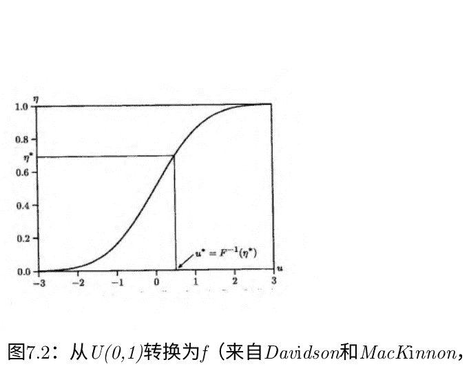

图7.2：从$U(0,1)$转换为$f$（来自Davidson和MacKinnon，1993年）

### 7.2 基础知识：C.D.F.反演，Box-Muller，简单接受-拒绝

### 7.2.1 反向累积分布函数

反向cdf方法（“反演方法”）

期望密度：$f(x)$

- 1. 找到与$f(x)$相对应的解析$cdf$，$F(x)$
- 2. 生成$T$个$U(0,1)$偏差$\{r_1,...,r_T\}$
- 3. 计算$\{F^{-1}(r_1),...,F^{-1}(r_T)\}$

反向cdf方法的图形表示

示例：$exp(\beta)$偏差的反向cdf方法

$f(x) = \beta e^{-\beta x}$，其中$\beta > 0$，$x \geq 0$
$\Rightarrow F(x) = \int_{0}^{x} \beta e^{-\beta t} dt$
$= \left. \frac{\beta e^{-\beta t}}{-\beta} \right|_{0}^{x} = -e^{-\beta x} + 1 = 1 - e^{-\beta x}$
因此 $e^{-\beta x} = 1 - F(x)$ 所以 $x = \frac{\ln(1 - F(x))}{-\beta}$
然后为 $F(x)$ 插入一个 $U(0,1)$ 偏差
复杂性 分析逆cdf不总是可用的（例如，$N(0,1)$ 分布）。

- • 方法1: 数值评估cdf
- • 方法2: 使用不同的方法 例如，CLT近似：取 $(\sum_{i=1}^{12} U_i(0,1) - 6)$ 对于 $N(0,1)$

### 7.2.2 Box-Muller

一种高效的高斯方法：Box-Muller

设 $x_1$ 和 $x_2$ 是独立同分布的 $U(0,1)$，考虑

```
$y_1 = \sqrt{-2 \ln x_1} \cos(2\pi x_2)$ \\ $y_2 = \sqrt{-2 \ln x_1} \sin(2\pi x_2)$
```

找到 $y_1$ 和 $y_2$ 的分布。我们知道

```
$f(y_1, y_2) = f(x_1, x_2) \begin{vmatrix} \frac{\partial x_1}{\partial y_1} & \frac{\partial x_1}{\partial y_2} \\ \frac{\partial x_2}{\partial y_1} & \frac{\partial x_2}{\partial y_2} \end{vmatrix}$
```

Box-Muller (续) 这里我们有

```
$x_1 = e^{-\frac{1}{2}(y_1^2 + y_2^2)}$ 和 $x_2 = \frac{1}{2\pi} \arctan\left(\frac{y_2}{y_1}\right)$
```

```
因此 $\begin{vmatrix} \frac{\partial x_1}{\partial y_1} & \frac{\partial x_1}{\partial y_2} \\ \frac{\partial x_2}{\partial y_1} & \frac{\partial x_2}{\partial y_2} \end{vmatrix} = \left( \frac{1}{\sqrt{2\pi}} e^{-y_1^2/2} \right) \left( \frac{1}{\sqrt{2\pi}} e^{-y_2^2/2} \right)$
```

双变量密度是两个 $N(0,1)$ 密度的乘积，因此我们生成了两个独立的 $N(0,1)$ 偏差。

生成源自 $N(0,1)$ 的偏差

```
$\chi_1^2 = [N(0,1)]^2$ \\ $\chi_d^2 = \sum_{i=1}^d [N_i(0,1)]^2$, 其中 $N_i(0,1)$ 是独立的 \\ $N(\mu, \sigma^2) = \mu + \sigma N(0,1)$ \\ $t_d = N(0,1) / \sqrt{\chi_d^2/d}$, 其中 $N(0,1)$ 和 $\chi_d^2$ 是独立的 \\ $F_{d_1,d_2} = \chi_{d_1}^2/d_1 / \chi_{d_2}^2/d_2$ 其中 $\chi_{d_1}^2$ 和 $\chi_{d_2}^2$ 是独立的
```

多元正态分布

```
$N(0, I)$ (N维) – 只需堆叠 $N$ $N(0,1)$'s
```

```
$N(\mu, \Sigma)$ (N维)
```

```
令 $P P' = \Sigma$ ($P$ 是 $\Sigma$ 的乔列斯基分解矩阵)
```

```
令 $X \sim N(0, I)$. 则 $P X \sim N(0, \Sigma)$
```

从 $N(\mu,\Sigma)$ 中抽样，取 $\mu + P X$

### 7.2.3 简单接受-拒绝

接受-拒绝

(简单但有启示性的例子)

我们想要从 $f(x)$ 中抽样 $x \sim N(x$

绘制:

```
$\nu_1 \sim U(\alpha, \beta)$
```

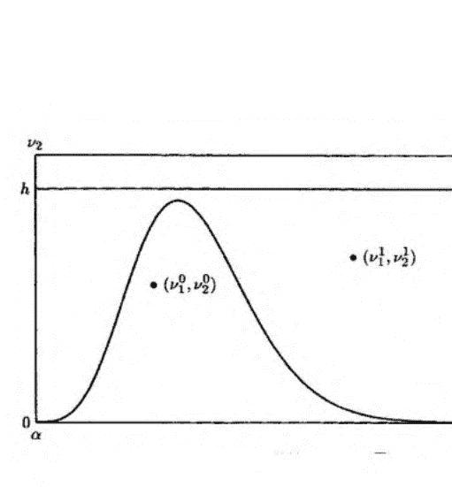

图7.3：朴素接受-拒绝方法

$v_2 \sim U(0, h)$

如果 $v_1, v_2$ 在密度函数 $f(x)$ 下方，则取 $x = v_1$ 否则拒绝并重复

朴素接受-拒绝的图形表示

接受-拒绝

一般（非朴素）情况

我们想要从 $f(x)$ 中采样 $x \sim f(x)$，但我们只知道如何从 $g(x)$ 中采样 $x \sim g(x)$

设M满足 $\frac{f(x)}{g(x)} \leq M < \infty, \forall x$。那么：

- 1. 从 $g(x)$ 中抽取 $x_0 \sim g(x)$
- 2. 以概率 $f(x_0)/g(x_0)M$ 取 $x = x_0$；否则转到1.

(允许“全局”函数 $g(\cdot)$ 比均匀函数更高效)

请注意，接受-拒绝算法要求我们能够对任意x评估 $f(x)$ 和 $g(x)$。

混合

在任何抽样 $i$ 上，

$x \sim f_i(x)$, 概率为 $p_i$

其中

$0 \leq p_i \leq 1$, 对于所有

$\sum_{i=1}^{N} p_i = 1$

例如，所有的 f_i 都可以是均匀分布，但具有不同的位置和尺度。

### 7.3 模拟时间序列过程的精确和近似实现

模拟时间序列过程

VAR(1) 模拟是关键（状态转移动力学）。

- 1. 非参数化：通过所需协方差矩阵的乔列斯基分解得到精确实现。只需指定自协方差即可。
- 2. 参数化I：通过对应于所需参数化模型的协方差矩阵的乔列斯基分解实现精确实现
- 3. 参数化II：通过任意初始值进行近似实现，并丢弃早期实现
- 4. 参数化III：通过从无条件密度中抽取初始值实现精确实现

### 7.4 更多

切片采样

Copulas和从一般联合密度中采样

### 7.5 通过模拟的经济理论：“校准”

### 7.6 通过模拟的计量经济理论：蒙特卡洛和方差缩减

蒙特卡洛

关键：通过模拟随机模拟解决确定性问题，将解析未知量重新表述为待估参数。

蒙特卡洛做出了许多重要的发现。

同时，蒙特卡洛也避免了许多错误！

这些要素：

- (I) 实验设计
- (II) 模拟（包括方差缩减技术）
- (III) 分析：响应曲面（也可减少方差）

### 7.6.1 实验设计

### (一) 实验设计

- - 数据生成过程（DGP） ， $M(\theta)$
- - 目标
  - - 例如，估计量的均方误差（MSE）：
    $$E[(\theta - \hat{\theta})^2] = g(\theta, T)$$
  - - 例如，检验的功效函数：
    $$\pi = g(\theta, T)$$

### 实验设计，继续

- - 选择要探索的 $(\theta, T)$ 配置
  a. 我们需要一个“完整设计”吗？一般来说，需要探索许多 $\theta$ 和 $T$ 的值。但是，如果，例如，$g(\theta, T) = g_1(\theta) + g_2(T)$，那么只需探索单个 $T$ 的 $\theta$ 值，以及单个 $\theta$ 的值（即，没有交互作用）。
  b. 参数不变性是否存在 $(\theta, T)$ 在 $\theta$ 中不变？例如，如果 $y = X\beta + \varepsilon$, $\varepsilon \sim N(0, \sigma^2\Omega(\alpha))$，则 $\hat{\beta}_{MLE} - \beta$ 的确切有限样本分布 $\frac{\hat{\sigma}^2_{MLE}}{\sigma^2}$ 和 $\frac{\hat{\beta}_{MLE} - \beta}{\hat{\sigma}_{MLE}}$ 对真实的 $\beta$, $\sigma^2$ 是不变的。因此，只有 $\alpha$ 变化，$\beta$ 和 $\sigma$ 保持不变（例如，设置为0和1）。在设计中要小心不要暗示关于未探索方面的不变性（例如，上述 $X$ 变量的结构）。

### 实验设计，继续

- - 蒙特卡洛重复次数（$N$）
  例如，计算测试大小的MC计算
  名义大小 $\alpha_0$，真实大小 $\alpha$，估计器 $\hat{\alpha} = \frac{\#rej}{N} = \frac{\Sigma_{i=1}^{N} I(rej_i)}{N}$
  正态近似：$\hat{\alpha} \sim N\left(\alpha, \frac{\alpha(1-\alpha)}{N}\right)$
  $P\left(\alpha \in \left[\hat{\alpha} \pm 1.96 \sqrt{\frac{\alpha(1-\alpha)}{N}}\right]\right) = .95$
  假设我们希望 $\alpha$ 的95\%置信区间长度为0.01。

策略1 (使用 $\alpha = \alpha_0$; 如果 $\alpha > \alpha_0$，则不够保守):

```
$$2 * 1.96 \sqrt{\frac{\alpha_0(1-\alpha_0)}{N}} = .01$$
```

如果 $\alpha_0= .05$, N = 7299

策略2 (使用 $\alpha = \frac{1}{2} = argmax_{\alpha} [\alpha(1 - \alpha)]; 保守):

```
$$2 * 1.96 \sqrt{\frac{\frac{1}{2}(\frac{1}{2})}{N}} = .01 \Rightarrow N = 38416$$
```

策略3 (使用 $\alpha= \hat{\alpha}$; 显而易见的策略)

### 7.6.2 模拟

(II) 模拟

运行示例：蒙特卡洛积分

定积分: $\theta = \int_{0}^{1} m(x)dx$

关键见解:

```
$$\theta = \int_{0}^{1} m(x)dx = E(m(x))$$
```

```
$$x \sim U(0, 1)$$
```

符号:

```
$$\theta = E[m(x)]$$
```

```
$$\sigma^2 = var(m(x))$$
```

直接模拟:

任意函数, 均匀分布

生成 $N$ $U(0,1)$ 的随机数 $x_i, i=1, ..., N$

形成 $N$个随机数 $m_i = m(x_i), i=1, ..., N$

```
$$\hat{\theta} = \frac{1}{N} \sum_{i=1}^{N} m_i$$
```

```
$$\sqrt{N}(\hat{\theta} - \theta) \overset{d}{\to} N(0, \sigma^2)$$
```

直接模拟一般情况:

任意函数, 任意密度

```
$$\theta = E(m(x)) = \int m(x)f(x)dx$$
```

- 不定积分，任意函数 $m(\cdot)$，任意密度 $f(x)$ 画出 $x_i \sim f(\cdot)$，然后形成 $m_i(x_i)$，

```
$\hat{\theta} = \frac{1}{N} \sum_{i=1}^{N} m_i$
```

```
$\sqrt{N}(\hat{\theta} - \theta) \xrightarrow{d} N(0, \sigma^2)$
```

直接模拟主要案例

均值函数，任意密度

(例如，后验均值)

```
$\theta = E(x) = \int x f(x) dx$
```

- 不定积分， $x$ 具有任意密度 $f(x)$ 画出 $x_i \sim f(\cdot)$

```
$\hat{\theta} = \frac{1}{N} \sum_{i=1}^{N} x_i$
```

```
$\sqrt{N}(\hat{\theta} - \theta) \xrightarrow{d} N(0, \sigma^2)$
```

### 7.6.3 方差缩减：重要性抽样、反向抽样、控制变量和公共随机数

重要性抽样以便进行抽样 从 $f(\cdot)$中抽样可能很困难。所以改为：

```
$\theta = \int x \frac{f(x)}{g(x)} g(x) dx$
```

其中“重要性抽样密度” $g(\cdot)$很容易抽样 画出 $x_i \sim g(\cdot)$，然后形成 $m_i = \frac{f(x_i)}{g(x_i)} x_i, i = 1, ..., N$

```
$\hat{\theta}_* = \frac{1}{N} \sum_{i=1}^{N} m_i = \frac{1}{N} \sum_{i=1}^{N} \frac{f(x_i)}{g(x_i)} x_i = \sum_{i=1}^{N} w_i x_i$
```

```
$\sqrt{N}(\hat{\theta}_* - \theta) \xrightarrow{d} N(0, \sigma_*^2)$
```

平均值由 f(x)的抽样替换为 g(x)的加权平均值
- 权重 w_i 反映了 f(x_i)和 g(x_i)的相对高度

## 重要性抽样

考虑计算随机变量 E(y)的均值的经典问题，其中E(y)具有边际密度:

$$ f(y) = \int f(y|x) f(x) dx. $$

标准解决方案是形成:

$$ E(y) = \frac{1}{N} \sum_{i=1}^{N} f(y|x_i) $$

其中 x_i 是从 f(x)中独立抽取的样本。

但是从 f(x)中抽样可能很困难! 该怎么办?

## 重要性抽样

写

$$ f(y) = \int f(y|x) \frac{f(x)}{g(x)} g(x) dx, $$

其中“重要性采样器” g(x)很容易进行抽样。

取

$$ E(y) = \sum_{i=1}^{N} \frac{ \frac{f(x_i)}{g(x_i)} }{ \sum_{j=1}^{N} \frac{f(x_j)}{g(x_j)} } f(y|x_i) = \sum_{i=1}^{N} w_i f(y|x_i). $$

因此，重要性采样用从初始抽样中得到的 f(y|x_i) 的加权平均值替代了基于f(x)的简单平均值。

这些初始抽样是从 g(x)中得到的，其中权重 w_i 反映了 f(x_i)和 g(x_i)的相对高度。

## 间接模拟

“方差缩减技术”

“(“欺诈”)”

使用重要性采样实现方差缩减

再次使用:

$$ \theta = \int x \frac{f(x)}{g(x)} g(x) dx, $$

再次我们到达

$$ \sqrt{N} (\hat{\theta}_* - \theta) \xrightarrow{d} N(0, \sigma_*^2) $$

如果 g(x)被明智选择, $\sigma_*^2 \ll \sigma^2$

关键: 选择 $g(x)$ 使得 $\frac{xf(x)}{g(x)}$ 方差较小

## 重要性抽样示例

假设 $x \sim N(0,1)$，并估计 $I(x > 1.96)$ 的均值：

$$\theta = E(I(x > 1.96)) = P(x > 1.96) = \int I(x > 1.96) \phi(x) dx$$

$$\hat{\theta} = \sum_{i=1}^N \frac{I(x_i > 1.96)}{N} \quad (\text{方差为 } \sigma^2)$$

使用重要性采样器：

$$g(x) = N(1.96, 1)$$

$$P(x > 1.96) = \int \frac{I(x > 1.96) \phi(x)}{g(x)} g(x) dx$$

$$\hat{\theta}_* = \frac{\sum_{i=1}^N \frac{I(x_i > 1.96) \phi(x_i)}{g(x_i)}}{N} \quad (\text{方差为 } \sigma_*^2)$$

$$\frac{\sigma_*^2}{\sigma^2} \approx 0.06$$

## 对偶变量法

我们对 $\theta$ 的负相关无偏估计值进行平均（保持无偏性，降低方差）

关键在于：如果 $x \sim$对称分布$(\mu, v)$，那么 $x_i \pm \mu$是等可能的

例如，如果 $x \sim U(0,1)$，那么 $(1 - x)$ 也是如此

例如，如果 $x \sim N(0, v)$，那么 $-x$ 也是如此

例如，考虑零均值对称 $f(x)$的情况

$$\theta = \int m(x) f(x) dx$$

直接 ： $$\hat{\theta} = \frac{1}{N} \sum_{i=1}^N m_i$$, ($\hat{\theta}$基于$x_i, i = 1, ..., N$)

反向 ： $$\hat{\theta}_* = \frac{1}{2} \hat{\theta}_{(x)} + \frac{1}{2} \hat{\theta}_{(-x)}$$

($\hat{\theta}_{(x)}$基于 $x_i, i= 1, ..., N/2$ ,和 $\hat{\theta}_{(-x)}$基于 $-x_i, i= 1, ..., N/2)$

反向变量，继续

更简洁地说,

$$ \hat{\theta}_* = \frac{2}{N} \sum_{i=1}^{N/2} k_i(x_i) $$

其中:

$$ k_i = \frac{1}{2} m(x_i) + \frac{1}{2} m(-x_i) $$

$$ \sqrt{N}(\hat{\theta}_* - \theta) \xrightarrow{d} N(0, \sigma_*^2) $$

$$ \sigma_*^2 = \frac{1}{4} var(m(x)) + \frac{1}{4} var(m(-x)) + \frac{1}{2} cov(m(x), m(-x)) $$
 <0 for m monotone incr.

通常 $\sigma_*^2 \ll \sigma^2$

$$ \theta = \int m(x)f(x)dx = \int g(x)f(x)dx + \int [m(x) - g(x)]f(x)dx $$

控制函数 $g(x)$ 足够简单以便进行解析积分，同时足够灵活以吸收 $m(x)$ 中的大部分变异。

我们只需找到 $m(x) - g(x)$ 的均值，其中 $g(x)$ 具有已知均值且与 $m(x)$ 高度相关。

## 控制变量

$$ \hat{\theta} = \int g(x)dx + \frac{1}{N} \sum_{i=1}^{N} [m(x_i) - g(x_i)] $$

$$ \sqrt{N}(\hat{\theta} - \theta) \xrightarrow{d} N(0, \sigma_*^2) $$

如果 $g(x)$ 被明智选择，$\sigma_*^2 \ll \sigma^2$.

相关方法（条件）：找到 $E(z|w)$ 的均值，而不是 $z$ 的均值。当然，这两者是相同的（条件均值等于无条件均值），但是 $var(E[z|w]) \leq var(z)$.

## 控制变量示例

$$ f(x) = \int_0^1 e^x dx $$

控制变量： $g(x) = 1 + 1.7x$

$\Rightarrow \int_0^1 g(x) dx = \left. \left( x + \frac{1.7}{2} x^2 \right) \right|_0^1 = 1.85$

$\hat{\theta}_{\text{直接}} = \frac{1}{N} \sum_{i=1}^N e^{x_i}$

$\hat{\theta}_{cv} = 1.85 + \frac{1}{N} \sum_{i=1}^N \left[ e^{x_i} - (1 + 1.7x_i) \right]$

$\frac{\text{var}(\hat{\theta}_{\text{direct}})}{\text{var}(\hat{\theta}_{CV})} \approx 78$

## 共同随机数

我们已经讨论了单个积分的估计：

$$\int_0^1 f_1(x) dx$$

但兴趣通常集中在两个积分的差异（或比率）上：

$$\int_0^1 f_1(x) dx - \int_0^1 f_2(x) dx$$

关键是使用相同的随机数来评估每个积分。

## 估计器比较中的共同随机数

两个估计器 $\hat{\theta}, \tilde{\theta}$；真实参数 $\theta_0$

比较均方误差：$E(\hat{\theta} - \theta_0)^2, E(\tilde{\theta} - \theta_0)^2$

预期差异：$E \left( (\hat{\theta} - \theta_0)^2 - (\tilde{\theta} - \theta_0)^2 \right)$

估计：

$$\frac{1}{N} \sum_{i=1}^N \left( (\hat{\theta}_i - \theta_0)^2 - (\tilde{\theta}_i - \theta_0)^2 \right)$$

估计的方差：

$$\frac{1}{N} \text{方差} \left( (\hat{\theta} - \theta_0)^2 \right) + \frac{1}{N} \text{方差} \left( (\tilde{\theta} - \theta_0)^2 \right) - \frac{2}{N} \text{协方差} \left( (\hat{\theta} - \theta_0)^2, (\tilde{\theta} - \theta_0)^2 \right)$$

## 扩展...

- 顺序重要性抽样：在抽样过程中建立改进的提议密度

## 7.6.4 响应曲面

## (III) 响应曲面

- 1. 直接响应曲面
- 2. 间接响应曲面：

- 清晰且信息丰富的图形展示
- 方差减少
- 施加已知渐近结果
  （例如，当 $ T \rightarrow \infty $时，功效 $ \rightarrow 1 $）
- 施加已知函数形式的特征
  （例如，功效 $ \in [0,1] $）

示例：评估有限样本检验大小

$$ \alpha = P(s > s^*|T, H_0 \text{ true}) = g(T) $$

（$ \alpha $ 是经验大小，$ s $ 是检验统计量，$ s^* $ 是渐近临界值）

$$ \hat{\alpha} = \frac{rej}{N} $$

$$ \hat{\alpha} \sim N \left( \alpha, \frac{\alpha(1 - \alpha)}{N} \right) $$

或者

$$ \hat{\alpha} = \alpha + \varepsilon = g(T) + \varepsilon $$

$$ \varepsilon \sim N \left( 0, \frac{g(T)(1 - g(T))}{N} \right) $$

注意异方差性：$ \varepsilon $的方差随 $ T $变化。

例子：评估有限样本检验大小

在$ \hat{\alpha} $上强制使用已知的分析结构。

常见方法：

$$ \hat{\alpha} = \alpha_0 + T^{-\frac{1}{2}} \left( c_0 + \sum_{i=1}^{p} c_i T^{-\frac{i}{2}} \right) + \varepsilon $$

$ \alpha_0 $是名义尺寸，在 $ T \rightarrow \infty $时获得。第二项是逐渐消失的尺寸失真。

响应曲面回归：

$$ \hat{\alpha} - \alpha_0 \to T^{-1/2}, T^{-1}, T^{-3/2}, ... $$

扰动将近似服从正态分布，但异方差性存在。

因此使用广义最小二乘法（GLS）或鲁棒标准误差。

通过模拟进行估计：GMM、SMM和间接推断

## 7.7.1 广义矩估计法

k维经济模型参数 θ

$$ \hat{\theta}_{GMM} = \arg\min_\theta d(\theta)' \Sigma d(\theta) $$

其中

$$ d(\theta) = \begin{pmatrix} m_1(\theta) - \hat{m}_1 \\ m_2(\theta) - \hat{m}_2 \\ \vdots \\ m_r(\theta) - \hat{m}_r \end{pmatrix} $$

The $m_i(\theta)$ are model moments and the $\hat{m}_i$ are data moments.

MM: $k = r$ and the $m_i(\theta)$ calculated analytically

GMM: $k < r$ and the $m_i(\theta)$ calculated analytically

- 相对于MLE而言效率低，但在似然函数不可用时很有用

## 7.7.2 模拟矩估计法

($k \le r$ and the $m_i(\theta)$ calculated by simulation )

- GMM的模型矩可能也无法获得（即，解析难以处理）

- SMM：如果你能模拟，你就能一致地估计
  - 模拟能力是对模型理解的良好测试
  - 如果你无法弄清楚如何从给定的概率模型中模拟伪数据，那么你就不理解该模型（或该模型不合理）
  - 汇总一切：如果你理解一个模型，你就能模拟它，如果你能模拟它，你就能一致地估计它。尤利卡！
  - 即使在原则上“可用”，也无需计算可能非常复杂的似然函数

- 失去MLE效率可能是获得SMM可处理性的小代价。

在错误规范下的SMM
所有计量经济模型都是错误规范的。
从这个角度来看，GMM/SMM具有特殊吸引力。

- 在正确规范下，任何一致估计量（例如MLE或GMM/SMM）都会在渐近意义下带你到正确的位置，而MLE还具有额外的效率好处。

- 在错误规范下，一致性成为一个问题，与效率的次要问题完全不同。一个目的的最佳DGP逼近可能与另一个目的的最佳逼近非常不同。

- 在这种情况下，GMM/SMM很有吸引力，因为它迫使思考要匹配哪些矩$M=\{m_1(\theta), \ldots, m_r(\theta)\}$，并且通过构造可以保证一致性对于$M$-最优逼近。

在错误规范下的SMM，继续

- 相比之下，伪最大似然估计束缚你的手。例如，高斯伪最大似然估计对于KLIC-最优逼近（1步预测均方误差）是一致的。

- 底线是：在错误规范下，最大似然估计可能对你想要的不一致，而通过构造，GMM对于你想要的是一致的（一旦你决定你想要什么）。

## 7.7.3 间接推断

k维经济模型参数 $\theta$

$\delta > k$维辅助模型参数 $\beta$

$$ \hat{\theta}_{IE} = \arg\min_{\theta} d(\theta)' \Sigma d(\theta) $$

其中

$$ d(\theta) = \begin{pmatrix} \hat{\beta}_1(\theta) - \hat{\beta}_1 \\ \hat{\beta}_2(\theta) - \hat{\beta}_2 \\ \vdots \\ \hat{\beta}_d(\theta) - \hat{\beta}_d \end{pmatrix} $$

$\hat{\beta}_i(\theta)$ 是拟合到模拟模型数据的辅助模型估计参数

$\hat{\beta}_i$是拟合到真实数据的辅助模型估计参数

- 如果经济模型正确规定，则一致估计真实 $\theta$
- 否则一致估计伪真实 $\theta$
- 我们引入了“Wald形式”；还有LR和LM形式

> Ruge-Murcia (2010)

## 7.8 通过模拟进行推断：自助法

## 7.8.1 独立同分布环境

最简单的（独立同分布）情况

独立同分布
$\{x_t\}_{t=1}^T \sim (\mu, \sigma^2)$

100α百分比置信区间为 μ:

$$ I = \left[\bar{x}_T - u_{(1+\alpha)/2} \frac{\sigma}{\sqrt{T}}, \bar{x}_T - u_{(1-\alpha)/2} \frac{\sigma}{\sqrt{T}}\right] $$
$$ \bar{x}_T = \frac{1}{T} \sum_{t=1}^T x_t, \sigma^2(x) = E(x - \mu)^2 $$
$$ u_\alpha \text{ solves } P \left( \frac{(\bar{x}_T - \mu)}{\frac{\sigma}{\sqrt{T}}} \leq u_\alpha \right) = \alpha $$

无论基础分布如何，都是精确区间。

操作版本

$$ I = \left[\bar{x}_T - \hat{u}_{(1+\alpha)/2} \frac{\hat{\sigma}(x)}{\sqrt{T}}, \bar{x}_T - \hat{u}_{(1-\alpha)/2} \frac{\hat{\sigma}(x)}{\sqrt{T}}\right] $$
$$ \hat{\sigma}^2(x) = \frac{1}{T-1} \sum_{t=1}^T (x_t - \bar{x}_T)^2 $$
$$ \hat{u}_\alpha \text{ solves } P \left( \frac{(\bar{x}_T - \mu)}{\frac{\hat{\sigma}(x)}{\sqrt{T}}} \leq \hat{u}_\alpha \right) = \alpha $$

经典（高斯）例子：

$$ I = \bar{x}_T \pm t_{(1-\alpha)/2} \frac{\hat{\sigma}(x)}{\sqrt{T}} $$

## Bootstrap方法：不需要假设高斯数据。

> “百分位数自助法”

根 ： $ S = \frac{(\bar{x}_T - \mu)}{\frac{\sigma}{\sqrt{T}}} $

根累积分布函数 ： $ H(z) = P\left(\frac{(\bar{x}_T - \mu)}{\frac{\sigma}{\sqrt{T}}} \leq z\right) $

- 1. 从 $\{x_i\}_{i=1}^T$ 中有放回地抽取 $\{x_i^{(j)}\}_{j=1}^T$
- 2. 计算 $\frac{\bar{x}_T^{(j)} - \bar{x}_T}{\frac{\hat{\sigma}(x)}{\sqrt{T}}}$
- 3. 重复多次并建立 $\bar{x}_T^{(j)}$ 的抽样分布

这是对 $\bar{x}_T - \frac{\hat{\sigma}(x)}{\sqrt{T}} \mu$的近似分布

> “俄罗斯套娃原理”

## 百分位自助法，继续

## H(z)的自助法估计：

$$ \hat{H}(z) = P\left(\frac{(\bar{x}_T^{(j)} - \bar{x}_T)}{\frac{\hat{\sigma}(x)}{\sqrt{T}}} \leq z\right) $$

## 转化为自助法100\alpha百分位置信区间：

$$ \hat{I} = \left[\bar{x}_T - \hat{u}_{(1+\alpha)/2} \frac{\hat{\sigma}(x)}{\sqrt{T}}, \bar{x}_T - \hat{u}_{(1-\alpha)/2} \frac{\hat{\sigma}(x)}{\sqrt{T}}\right] $$

其中 $P\left(\frac{(\bar{x}_T^{(j)} - \bar{x}_T)}{\frac{\hat{\sigma}(x)}{\sqrt{T}}} \leq \hat{u}_\alpha\right) = \hat{H}(\hat{u}_\alpha) = \alpha$

## “百分位- t”自助法

$$ S = \frac{(\bar{x}_T - \mu)}{\frac{\hat{\sigma}(x)}{\sqrt{T}}} $$

$$ H(z) = P\left(\frac{(\bar{x}_T - \mu)}{\frac{\hat{\sigma}(x)}{\sqrt{T}}} \leq z\right) $$

$$ \hat{H}(z) = P\left(\frac{(\bar{x}_T^{(j)} - \bar{x}_T)}{\frac{\hat{\sigma}(x^{(j)})}{\sqrt{T}}} \leq z\right) $$

$$\hat{I} = \left[ \bar{x}_T - \hat{u}_{(1+\alpha)/2} \frac{\hat{\sigma}(x)}{\sqrt{T}}, \bar{x}_T - \hat{u}_{(1-\alpha)/2} \frac{\hat{\sigma}(x)}{\sqrt{T}} \right]$$

$$P \left( \frac{(\bar{x}_T^{(j)} - \bar{x}_T)}{\frac{\hat{\sigma}(x^{(j)})}{\sqrt{T}}} \leq \hat{u}_\alpha \right) = \alpha$$

## 百分位数- t 自助法，继续

## 关键见解：

百分位数: $\bar{x}_T^{(j)}$在自助法重复中发生变化
百分位数-t : $\bar{x}_T^{(j)}$和$\hat{\sigma}(x^{(j)})$在自助法重复中都发生变化
实际上，百分位数方法自助法对参数进行自助，而百分位数-t自助法对统计量进行自助

## 关键自助法特性：一致推断

## 现实世界根：

$$\stackrel{d}{S \rightarrow D} \quad (as T \rightarrow \infty)$$

## 自助法世界根：

$$\stackrel{d}{S^* \rightarrow D^*} \quad (as T, N \rightarrow \infty)$$

如果 $D = D^*$，则自助法一致（“有效”，“一阶有效”）.

在正则条件下成立.

但是难道没有更简单的一致推断方法吗？

当然有。但是：

- 1. 自助法的思想可以机械地扩展到更复杂的模型上
- 2. 自助法可以提供更高阶的改进
  (例如，百分位数-t)
- 3. 蒙特卡洛实验证明自助法在有限样本中通常表现良好（与2有关，但不需要2）
- 4. 基本自助法的许多变体和扩展

### 7.8.2 时间序列环境

稳定时间序列案例之前：

- 1. 使用 $S = \frac{(\bar{x}_T - \mu)}{\frac{\hat{\sigma}(x)}{\sqrt{T}}}$
- 2. 抽取 $\{x_t^{(j)}\}_{t=1}^T$

## 问题：

- 1. 对于动态数据，对 S 的不恰当标准化。因此，用 $2\pi f^*_x(0)$ 替换 $\hat{\sigma}^2(x)$，其中 $f^*_x(0)$ 是 x 在频率0处的一致估计量的谱密度。
- 2. 不适宜绘制 $\{x_t^{(j)}\}^T_{t=1}$ 用于动态数据的替换。该怎么办？

## 非参数时间序列自助法

(重叠块抽样)

样本路径中的重叠块大小为 b：

$$\xi_t = (x_t, ..., x_{t+b-1}), \quad t = 1, ..., T - b + 1$$

从 $\{\xi_t\}^{T-b+1}_{t=1}$ 中抽取 k 个块（其中 T = kb）：

$$\xi_1^{(j)}, ..., \xi_k^{(j)}$$

连接: $(x_1^{(j)}, ..., x_T^{(j)}) = (\xi_1^{(j)} ... \xi_k^{(j)})$

当 $b \to \infty$ 且 $T \to \infty$ 时一致，且 $b/T \to 0$

## AR(1)参数时间序列自助法

$$x_t = c + \phi x_{t-1} + \varepsilon_t, \quad \varepsilon_t \sim iid$$

- 1. 回归 $x_t \to (c, x_{t-1})$ 以获得 $\hat{c}$ 和 $\hat{\phi}$，并保存残差 $\{e_t\}^{T}_{t=1}$
- 2. 从 $\{e_t\}^{T}_{t=1}$ 中有放回地抽取 $\{e_t^{(j)}\}^{T}_{t=1}$
- 3. 从 $\{x_t\}^{T}_{t=1}$ 中抽取 $x_0^{(j)}$
- 4. 生成 $x_t^{(j)} = \hat{c} + \hat{\phi} x_{t-1}^{(j)} + \varepsilon_t^{(j)}, \quad t = 1, ..., T$
- 5. 回归 $x_t^{(j)} \to (c, x_{t-1}^{(j)})$ 以获得 $\hat{c}^{(j)}$ 和 $\hat{\phi}^{(j)}$，以及相关的 t 统计量等
- 6. 重复 $j = 1, ..., R$，并建立感兴趣的分布

## 一般状态空间参数时间序列自助法

回顾预测误差状态空间表示：

$$a_{t+1/t} = T a_{t/t-1} + T K_t v_t$$

$$y_t = Z a_{t/t-1} + v_t$$

- 1. 估计系统参数 $\theta$。（我们很快会看到如何做到这一点。）
- 2. 在估计的参数值 $\hat{\theta}$，运行卡尔曼滤波器以获得相应的1步预测误差 $\hat{v}_t \sim (0, \hat{F}_t)$ 并将其标准化为 $\hat{u}_t = \Omega_t^{-1/2} \hat{v}_t \sim (0, I)$，其中 $\Omega_t' \hat{\Omega}_t = \hat{F}_t$。
- 3. 画   $\{u_t^{(j)}\}_{t=1}^T$从$\{\hat{u}_t\}_{t=1}^T$有放回地抽样，并转换为$\{v_t^{(j)}\}_{t=1}^T = \{\hat{\Omega} u_t^{(j)}\}_{t=1}^T$。
- 4. 使用预测误差抽样 $\{v_t^{(j)}\}_{t=1}^T$，模拟模型，得到$\{y_t^{(j)}\}_{t=1}^T$。
- 5. 估计模型，得到$\hat{\theta}^{(j)}$和相关的对象。
- 6. 重复 $j=1, \dots, R$，模拟感兴趣的分布。

许多变化和扩展...

- 平稳块自助法：随机（指数）长度的块
- 野外自助法：随机将自助法抽样的冲击乘以 $\pm 1$以实现对称性
- 子采样

## 7.9 通过模拟进行优化

马尔可夫链再次出现。

### 7.9.1 局部

使用MCMC进行MLE（和其他极值估计）
Chernozukov和Hong展示了如何计算极值估计量，作为伪后验分布的均值，可以通过MCMC进行模拟，并以参数速率1/进行估计 √与标准后验模式极值估计器通过任何方法实现的非参数速率相比，Chernozukov和Hong展示了如何计算极值估计量，作为伪后验分布的均值，可以通过MCMC进行模拟，并以参数速率1/进行估计

### 7.9.2 全局

本地优化摘要：

- 1. 初始猜测   $\theta^{(0)}$
- 2. 当停止准则未满足时执行
- 3. 选择   $\theta^{(c)} \in N(\theta^{(m)})$（经典方法：使用梯度）
- 4. if $\Delta = lnL(\theta^{(c)}) - lnL(\theta^{(m)}) > 0$ then $\theta^{(m+1)} = \theta^{(c)}$
- 5. 结束循环

模拟退火
(在离散参数空间中进行演示)
框架：

- 1. 一个集合 $\Theta$，以及定义在 $\Theta$ 上满足正则性条件的实值函数 $lnL$。令 $\Theta^* \subset \Theta$ 为 $lnL$的全局最大值的集合。
- 2. 对于每个$\theta^{(m)} \in \Theta$，存在一个集合 $N(\theta^{(m)}) \subset \Theta - \theta^{(m)}$，即 $\theta^{(m)}$ 的邻居集合
- 3. 一个非递增函数 $T(m): N \rightarrow (0, \infty)$（“冷却进程”），其中 $T(m)$是第 $m$次迭代的“温度”。
- 4. 一个初始猜测 $\theta^{(0)} \in \Theta$模拟退火

算法
- 1. 初始猜测 $\theta^{(0)}$
- 2. 当停止准则未满足时执行
- 3. 选择   $\theta^{(c)} \in N(\theta^{(m)})$
- 4. 如果 $\Delta > 0$或$\exp (\Delta/T(m))> U(0,1)$那么 $\theta^{(m+1)} = \theta^{(c)}$
- 5. 结束循环

注意极值：

$T= 0$ 表示没有随机化（类似于经典的基于梯度的方法）

$T = ∞$表示完全随机化（类似于随机搜索）

一个（异质）马尔可夫链

如果 $\theta^{(c)} \notin N(\theta^{(m)})$ 那么
$P(\theta^{(m+1)} = \theta^{(c)}|\theta^{(m)}) = 0$

如果 $\theta^{(c)} \in N(\theta^{(m)})$ 那么
$P(\theta^{(m+1)} = \theta^{(c)}|\theta^{(m)}) = \exp (\min[0, \Delta/T(m)])$

> 全局优化器的收敛性

定义。如果模拟退火算法收敛，则$\lim_{m\to\infty} P[\theta^{(m)} \in \Theta^*] = 1$。

定义：如果存在一条路径在$\Theta$中（路径中的每个元素都是前一个元素的邻居），从 $\theta^{(m)}$开始并以$\Theta^*$中的某个元素结束，使得路径上 $\ln L$的最小值为 $\ln L(\theta^{(m)}) - d$，则我们说$\theta^{(m)}$与$\Theta^*$在深度 $d$上相互通信。

> 模拟退火的收敛性

定理：设 $d^*$是最小的数，使得每个 $\theta^{(m)} \in \Theta$与$\Theta^*$在深度 $d^*$上相互通信。
如果且仅当 $m\to \infty$时，模拟退火算法收敛，且$T(m) \to 0$并且
$$\sum \exp(-d^*/T(m)) \to \infty.$$

问题：如何选择 $T$，而且我们不知道 $d^*$
常用的冷却函数选择：$T(m) = \frac{1}{\ln m}$
关于收敛速度，我们所知甚少

### 7.9.3 是一个局部最优解吗？

- 1. 尝试多个初始值（听起来很琐碎，但非常重要）
- 2. 最后，使用极值理论评估局部最优解是全局最优的可能性（“Veall的方法”）

$\theta \in \Theta \subset R^k$

$\ln L(\theta)$ 是连续的

$\ln L(\theta^*)$ 是 $\ln L(\theta)$的唯一有限全局最大值，其中 $\theta \in \Theta$

$H(\theta^*)$ 存在且非奇异

$\ln L(\theta)$ 是局部最大值

为 $\theta^*$开发统计推断

从$\Theta$中均匀地绘制$\{\theta_i\}_{i=1}^{N}$，并形成$\{\ln L(\theta_i)\}_{i=1}^{N}$

$\ln L_1$第一序统计量， $\ln L_2$第二序统计量

$P[\ln L(\theta^*) \in (\ln L_1, \ln L^\alpha)] = (1 - \alpha)$, 当 $N\to \infty$

其中

$\ln L^\alpha = \ln L_1 + \frac{\ln L_1 - \ln L_2}{(1-\alpha)^{-\frac{2}{k}} - 1}$

### 7.10 通过模拟进行区间和密度预测

### 7.11 练习，问题和补充

- 1. **凸松弛。**

  我们对全局优化的方法是攻击一个复杂的目标函数，使用巧妙的随机化方法。或者，可以用友好的（凸）目标函数来近似复杂的目标函数，希望两者具有相同的全局最优解。这被称为“凸松弛”，当两个最优解重合时，我们说松弛是“紧密的”。

### 7.12 注释

## 第八章

## 贝叶斯时间序列后验分析通过马尔可夫链蒙特卡罗

### 8.1 贝叶斯基础知识

### 8.2 贝叶斯派和频率派范式的比较

总体范式 (T→∞)

$$\sqrt{T}(\hat{\theta} - \theta) \sim N(0, \Sigma)$$

经典派和贝叶斯派共享，但解释不同。经典: $\hat{\theta}$ 随机，$\theta$ 固定。贝叶斯: $\hat{\theta}$ 固定，$\theta$ 随机。经典: 描述随机数据 ($\hat{\theta}$) 在固定“真实” $\theta$ 条件下的分布。关注最大似然 ($\hat{\theta}_{ML}$) 和最大似然曲率在最大值的 $\epsilon$-邻域内。贝叶斯: 描述随机 $\theta$ 在固定“真实”数据 ($\hat{\theta}$) 条件下的分布。检查整个似然函数。

## 贝叶斯计算力学

数据 $y = \{y_1, \dots, y_T\}$

贝叶斯定理:

$$f(\theta | y) = \frac{f(y | \theta) f(\theta)}{f(y)}$$

or

$$f(\theta | y) = c \, f(y | \theta) f(\theta)$$
其中 $c^{-1} = \int f(y | \theta) f(\theta)$
$f(\theta | y) \propto f(y | \theta) f(\theta)$
$p(\theta | y) \propto L(\theta | y) g(\theta)$

后验 $\propto$ 似然 · 先验

经典范式 (T→∞)

$$\sqrt{T}(\hat{\theta}_{ML} - \theta) \xrightarrow{d} N\left(0, \left(\frac{I_{EX, H}(\theta)}{T}\right)^{-1}\right)$$

或者更粗略地说

$$\sqrt{T}(\hat{\theta}_{ML} - \theta) \sim N(0, \Sigma)$$

(说得够了。)

贝叶斯范式 ( $T \rightarrow \infty$ )

(注意，当 $T \rightarrow \infty$ 时， $p(\theta | y) \approx L(\theta | y)$，因此下面的似然可以看作是后验。)

在固定的$\hat{\theta}_{ML}$周围展开$lnL(\theta/y)$：
$lnL(\theta/y) \approx lnL(\hat{\theta}_{ML}/y) + S(\hat{\theta}_{ML}/y)'(\theta - \hat{\theta}_{ML})$
$-1/2(\theta - \hat{\theta}_{ML})'I_{OB,H}(\hat{\theta}_{ML}/y)(\theta - \hat{\theta}_{ML})$
但是$S(\hat{\theta}_{ML}/y) = 0$，所以：
$lnL(\theta/y) \approx lnL(\hat{\theta}_{ML}/y) - 1/2(\theta - \hat{\theta}_{ML})'I_{OB,H}(\hat{\theta}_{ML}/y)(\theta - \hat{\theta}_{ML})$
忽略展开的余项，我们有：
$L(\theta/y) \propto exp(-1/2(\theta - \hat{\theta}_{ML})'I_{OB,H}(\hat{\theta}_{ML}/y)(\theta - \hat{\theta}_{ML}))$

或者
$L(\theta/y) \propto N(\hat{\theta}_{ML}, I_{OB,H}^{-1}(\hat{\theta}_{ML}/y))$
或者，后验概率，$\sqrt{T}(\theta - \hat{\theta}_{ML}) \sim N(0, \Sigma)$
贝叶斯估计和模型比较
估计：

- 完整的后验密度
- 最高后验密度区间
- 后验均值，中位数，众数（取决于损失函数）

### 模型比较：

$$
\frac{p(M_i|y)}{p(M_j|y)} = \frac{p(y|M_i)}{p(y|M_j)} \cdot \frac{p(M_i)}{p(M_j)}
$$
$\underbrace{\quad\quad\quad\quad}_{\text{后验几率}}$ $\underbrace{\quad\quad\quad\quad}_{\text{贝叶斯因子}}$ $\underbrace{\quad\quad\quad\quad}_{\text{先验几率}}$

贝叶斯因子是边际似然或边际数据密度的比值。

- 用于比较，只需报告后验几率
- 用于选择，采用0-1损失函数，即选择具有最高后验概率的模型。
- 因此，如果先验几率为1:1，则选择具有最高边际似然的模型。

### 理解边际似然

作为一种惩罚对数似然函数：
当$T \rightarrow \infty$时，边际似然近似等于最大化对数似然减去$KlnT/2$。这就是SIC！

### 作为预测似然：

$$
\begin{aligned}
P(y) &= P(y_1, ..., y_T) = \prod_{t=1}^{T} P(y_t|y_{1:t-1}) \\
&\Rightarrow lnP(y) = \sum_{t=1}^{T} lnP(y_t|y_{1:t-1}) \\
&= \sum_{t=1}^{T} ln \int P(y_t|\theta, y_{1:t-1})P(\theta|y_{1:t-1}) d\theta
\end{aligned}
$$

### 贝叶斯模型平均：

根据后验模型概率进行加权：

$$
P(y_{t+1}|y_{1:t}) = \pi_{it} P(y_{t+1}|y_{1:t}, M_i) + \pi_{jt} P(y_{t+1}|y_{1:t}, M_j)
$$

当$T \rightarrow \infty$时，模型平均和模型选择之间的区别消失，因为一个$\pi$趋近于0，另一个趋近于1。

如果其中一个模型为真，则模型选择和模型平均对于真实模型是一致的。否则，它们对于真实模型的X最优近似是一致的。这里的X = KLIC吗？

## 8.3 马尔可夫链蒙特卡洛

Metropolis-Hastings
我们想从概率分布 \( p(\theta) \) 中抽取 \( S \) 个 \( \theta \) 值。在 \( \theta^{(0)} \) 处初始化链条并进行燃烧。

- 1. 从提议密度 \( q(\theta; \theta^{(s-1)}) \) 中抽取 \( \theta^* \)。

- 2. 计算接受概率 \( \alpha(\theta^{(s-1)}, \theta^*) \)

- 3. 设置

\[
\theta^s = \begin{cases} \theta^* & \text{概率为 } \alpha(\theta^{(s-1)}, \theta^*) \text{ 时“接受”} \\ \theta^{(s-1)} & \text{概率为 } 1 - \alpha(\theta^{(s-1)}, \theta^*) \text{ 时“拒绝”} \end{cases}
\]

- 4. 重复步骤1-3，\( s = 1, ..., S \)

当然，问题是在步骤2中使用什么。

## 8.3.1 Metropolis-Hastings 独立链

固定的提议密度：

\[ q(\theta; \theta^{(s-1)}) = q^*(\theta) \]

接受概率：

\[ \alpha(\theta^{(s-1)}, \theta^*) = \min\left[ \frac{p(\theta = \theta^*) q^*(\theta = \theta^{(s-1)})}{p(\theta = \theta^{(s-1)}) q^*(\theta = \theta^*)}, 1 \right] \]

## 8.3.2 Metropolis-Hastings 随机行走链

随机游走提议：

\[ \theta^* = \theta^{(s-1)} + \varepsilon \]

接受概率降低为：

\[ \alpha(\theta^{(s-1)}, \theta^*) = \min\left[ \frac{p(\theta = \theta^*)}{p(\theta = \theta^{(s-1)})}, 1 \right] \]

## 8.3.3 更多

燃烧期、抽样和相关性

“总模拟” = “燃烧期” + “抽样”

问题：

如何评估达到稳态的收敛性？

在马尔可夫链的情况下，为什么不做如下操作。每当时间 \( t \) 是 \( m \) 的倍数时，使用无分布假设的非参数（随机化）检验来测试未知分布 \( f_1 \) of \( x_t, ..., x_{t-(m/2)} \) 是否等于未知分布 \( f_2 \) of \( x_{t-(m/2)+1}, ..., x_{t-m} \)。例如，如果我们选择 \( m = 20,000 \)，则每当时间 \( t \) 是20,000的倍数时，我们将测试 distributions of \( x_t, ..., x_{t-10000} \) 和 \( x_{t-10001}, ..., x_{t-20000} \) 的相等性。当零假设不被拒绝时，我们宣布达到稳态。或者类似于这样的操作。

当然，马尔可夫链是序列相关的，但是谁在乎呢，因为我们只是试图评估无条件分布的相等性。也就是说，对于 \( x_t, ..., x_{t-(m/2)} \) 和 \( x_{t-(m/2)+1}, ..., x_{t-m} \) 的随机化会破坏序列相关性，但又怎样呢？

如何处理采样链中的依赖关系？

是运行一个长链还是多个较短的并行链更好？

接受-拒绝算法的一个有用特性

（例如，Metropolis算法）

Metropolis算法只需要知道感兴趣的密度函数的常数部分，因为接受概率由比值 \( p(\theta = \theta^*)/p(\theta = \theta^{(s-1)}) \) 决定。这对于贝叶斯分析来说非常重要。

## Metropolis-Hastings算法（离散）

对于期望 \( \pi \)，我们想要找到 \( P \) 使得 \( \pi P = \pi \)。只需找到 \( P \) 使得 \( \pi_i P_{ij} = \pi_j P_{ji} \) 即可。

假设我们已经得到 \( z_i \)。使用对称、不可约的转移矩阵 \( Q = [Q_{ij}] \) 生成提议。

也就是说，使用 \( Q \) 的第 \( i \) 行的概率绘制提议 \( z_j \)。

以概率 \( \alpha_{ij} \) 移动到 \( z_j \)，其中：

| 条件 | \( \alpha_{ij} \) |
| :--- | :--- |
| 如果 \( \frac{\pi_j}{\pi_i} \geq 1 \) | \( \alpha_{ij} = 1 \) |
| 否则 | \( \alpha_{ij} = \frac{\pi_j}{\pi_i} \) |

等价地，以概率 \( \alpha_{ij} \) 移动到 \( z_j \)，其中：

\[ \alpha_{ij} = \min\left(\frac{\pi_j}{\pi_i}, 1\right) \]

## Metropolis-Hastings，续...

这定义了一个马尔可夫链 \( P \)，其中：

\[
P_{ij} = \begin{cases} \alpha_{ij} Q_{ij}, & \text{对于 } i \neq j \\ 1 - \sum_{j \neq i} P_{ij}, & \text{对于 } i = j \end{cases}
\]

迭代这个链直到收敛，并从 \( \pi \) 开始采样。

阻塞策略：于和孟（2010年）

请注意，我已经设置了在末尾列出参考文献。这会导致编译错误，但你可以跳过它，一切在最后看起来都很好。

> 阻塞MH算法: Ed Herbst Siddhartha Chib和Srikanth Ramamurthy。定制随机块MCMC方法及其在DSGE模型中的应用。经济计量学杂志，155 (1) : 1938年，2010年。VascoCurdia和Ricardo Reis。相关扰动和美国商业周期。2009年。Nikolay Iskrev。评估线性化DSGE模型中的信息矩阵。经济学快报，99: 607610，2008年。Robert Kohn，PaoloGiordani和Ingvar Strid。DSGE模型的自适应混合Metropolis-Hastings采样器。工作论文，2010年。G.O.Roberts和S.K.Sahu。用于Gibbs采样器的更新方案，相关结构，阻塞和参数化。皇家统计学会系列B（方法论），59 (2) : 291317，1997年。

## 8.3.4 Gibbs 和 Metropolis-Within-Gibbs

## 双变量吉布斯抽样

- 1. 我们想要从 \( f(z) = f(z_1, z_2) \) 抽取样本。
- 2. 初始化 (\( j = 0 \)) 使用 \( z_2^0 \)。
- 3. 吉布斯迭代 \( j = 1 \)：
    - a. 从 \( f(z_1|z_2^0) \) 中抽取 \( z_1^1 \)
    - b. 从 \( f(z_2|z_1^1) \) 中抽取 \( z_2^1 \)
- 4. 重复 \( j = 2, 3, ... \)

定理 (Clifford-Hammersley): 当 \( j \rightarrow \infty \) 时，\( f(z^j) = f(z) \)

如果/当条件已知且易于抽样，但联合分布和边缘分布不易抽样时非常有用。（这在贝叶斯分析中经常发生。）

## 一般吉布斯抽样

- 1. 我们想要从 \( f(z) = f(z_1, z_2, ..., z_k) \) 抽取样本。
- 2. 初始化 (\( j = 0 \)) 使用 \( z_2^0, z_3^0, ..., z_k^0 \)。
- 吉布斯迭代 \( j = 1 \):
    - a. 从 \( f(z_1|z_2^0, z_3^0, \dots, z_k^0) \) 中抽取 \( z_1^1 \)
    - b. 从 \( f(z_2|z_1^1, z_3^0, \dots, z_k^0) \) 中抽取 \( z_2^1 \)
    - c. 从 \( f(z_3|z_1^1, z_2^1, z_4^0, \dots, z_k^0) \) 中抽取 \( z_3^1 \)
    - ...
    - k. 从 \( f( z_k|z_1^1, \dots, z_{k-1}^1) \) 中抽取 \( z_k^1 \)
- 重复 \( j= 2, 3, \dots \)

再次，当 \( j \rightarrow \infty \) 时, \( f(z^j) = f(z) \)

Metropolis Within Gibbs
吉布斯将一个大的抽样分解为许多小的（条件）步骤。如果你幸运的话，这些小步骤是简单的。
如果/当吉布斯步骤很困难，即不清楚如何从相关条件中抽样，可以通过Metropolis方法来完成。（“吉布斯内Metropolis”）

Metropolis方法更通用但也更繁琐，所以只在必要时使用。

组合
我们可能希望从 \( f (x, y) \) 中抽样得到 \( (x_1, y_1) \) , ..., \( (x_N, y_N) \sim iid \)。
或者我们可能希望从 \( f (y) \) 中抽样得到 \( y_1 \), ..., \( y_N \sim iid \)。
直接从中抽样可能很困难。

- 但有时候很容易：
    - 抽取 \( x^* \sim f (x) \)
    - 抽取 \( y^* \sim f (y|x^*) \)

然后：
- \( (x_1, y_1) \), ..., \( (x_N, y_N) \sim iid  f(x, y) \)
- \( (y_1, ..., y_N) \sim iid  f(y) \)

## 8.4 线性回归的共轭贝叶斯分析

具有共轭先验的高斯回归的贝叶斯方法

```
y = Xβ + ε
ε ~ iid N(0, σ^2 I)
```

标准结果:

```
\hat{β}_{ML} = (X'X)^{-1}X'y
\hat{σ}^2_{ML} = \frac{e'e}{T}
\hat{β}_{ML} \sim N \left( β, σ^2 (X'X)^{-1} \right)
\frac{T\hat{σ}^2_{ML}}{σ^2} \sim χ^2_{T-K}
```

贝叶斯推断 β/σ

先验分布:
\[ β/σ^2 \sim N(β_0, Σ_0) \]
\[ g(β/σ^2) \propto exp(-1/2(β - β_0)'Σ_0^{-1}(β - β_0)) \]

似然函数:
\[ L(β/σ^2, y) \propto exp(\frac{-1}{2σ^2}(y - Xβ)'(y - Xβ)) \]

后验概率:
\[ p(β/σ^2, y) \propto exp(-1/2(β - β_0)'Σ_0^{-1}(β - β_0) - \frac{1}{2σ^2}(y - Xβ)'(y - Xβ)) \]

这是一个正态分布的核心 (*问题*):
\[ β/σ^2, y \sim N(β_1, Σ_1) \]
其中
\[ β_1 = (Σ_0^{-1} + σ^{-2}(X'X))^{-1} (Σ_0^{-1}β_0 + σ^{-2}(X'X)\hat{β}_{ML}) \]
\[ \Sigma_1 = (\Sigma_0^{-1} + \sigma^{-2}(X'X))^{-1} \]

Gamma和Inverse Gamma复习

\[ z_t \stackrel{iid}{\sim} N\left(0, \frac{1}{\delta}\right), x = \sum_{t=1}^{v} z_t^2 \Rightarrow x \sim \Gamma\left(x; \frac{v}{2}, \frac{\delta}{2}\right) \]

(注意 δ=1 ⇒ x ~ χ_v^2, 所以 χ^2是Γ的特殊情况)

\[ \Gamma\left(x; \frac{v}{2}, \frac{\delta}{2}\right) \propto x^{\frac{v}{2} - 1} \exp\left(-\frac{x\delta}{2}\right) \]

\[ E(x) = \frac{v}{\delta} \]

\[ var(x) = \frac{2v}{\delta^2} \]

\[ x \sim \Gamma^{-1}\left(\frac{v}{2}, \frac{\delta}{2}\right) \quad (\text{“逆伽玛分布”}) \quad \Leftrightarrow \quad \frac{1}{x} \sim \Gamma\left(\frac{v}{2}, \frac{\delta}{2}\right) \]

贝叶斯推断 σ^2/β

先验分布：

\[ \frac{1}{\sigma^2}/\beta \sim \Gamma\left(\frac{v_0}{2}, \frac{\delta_0}{2}\right) \]

\[ g\left(\frac{1}{\sigma^2}/\beta\right) \propto \left(\frac{1}{\sigma^2}\right)^{\frac{v_0}{2} - 1} \exp\left(-\frac{\delta_0}{2\sigma^2}\right) \]

(与 β无关，但为了完整性写作 σ^2/β)

\[ L\left(\frac{1}{\sigma^2}/\beta, y\right) \propto \left(\sigma^2\right)^{-T/2} \exp\left(-\frac{1}{2\sigma^2}(y - X\beta)'(y - X\beta)\right) \]

(*问题*: 与之前的L (β/σ^2, y) 不同，我们没有将 (σ^2)^{-T/2}项吸收到比例常数中。为什么？) 因此 (*问题*) :

\[ p\left(\frac{1}{\sigma^2}/\beta, y\right) \propto \left(\frac{1}{\sigma^2}\right)^{\frac{v_1}{2} - 1} \exp\left(-\frac{\delta_1}{2\sigma^2}\right) \]

\[ \text{或 } \frac{1}{\sigma^2}/\beta, y \sim \Gamma\left(\frac{v_1}{2}, \frac{\delta_1}{2}\right) \]

\[ v_1 = v_0 + T \]

\[ \delta_1 = \delta_0 + (y - X\beta)'(y - X\beta) \]

贝叶斯派到目前为止

- 1. 集中于 p(θ/y) 是合理的。在重复样本中，经典相对频率被取决于实际获得的单个样本的主观信念程度所取代。
- 2. 精确的有限样本全密度推断。

贝叶斯派的缺点到目前为止

- 1. 先验分布从哪里来？ 如何引导先验分布？
- 2. 如何进行“客观”分析？
   （例如，什么是“无信息”的先验分布？均匀分布？）
   （然而，先验分布可能是有益的和有帮助的。例如，参见以下卡通：http://fxdiebold.blogspot.com/2014/04/more-from-xkcdcom.html）
- 3. 我们仍然没有我们真正想要的边际后验分布：p(β, σ^2/y), p(β/y)。
   – 在任何情况下都有问题!

## 8.5 吉布斯采样边际后验

马尔可夫链蒙特卡洛解决问题!
0. 初始化: σ^2 = (σ^2)^(0)
在通用迭代 j 处的吉布斯采样器:
- j1. 从 p(σ^2/β^(j), y) 中抽取 (σ^2)^(j)
    \[ \left(\Gamma^{-1}\left(\frac{v_1}{2}, \frac{\delta_1}{2}\right)\right) \]
- j2. 从 p(β/(σ^2)^(j+1), y) 中抽取 β^(j+1)
    \[ \left(N(\beta_1, \Sigma_1)\right) \]

迭代到稳定状态并估计感兴趣的后验矩

## 8.6 一般状态空间：卡特-科恩多步吉布斯

贝叶斯分析状态空间模型

\[
\alpha_t = T\alpha_{t-1} + R\eta_t
\]
\[
y_t = Z\alpha_t + \varepsilon_t
\]

\[
\begin{pmatrix} \eta_t \\ \varepsilon_t \end{pmatrix} \stackrel{iid}{\sim} N \left( \begin{pmatrix} 0 \\ 0 \end{pmatrix}, \begin{pmatrix} Q & 0 \\ 0 & H \end{pmatrix} \right)
\]

令 \( \tilde{\alpha}_T = (\alpha'_1, \dots, \alpha'_T)', \theta = (T', R', Z', Q', H')' \)

关键点：将 \( \tilde{\alpha}_T \) 视为一个参数，与系统矩阵 \( \theta \) 一起处理

## 回顾密度形式的状态空间模型

\[
\alpha_t|\alpha_{t-1} \sim N(T\alpha_{t-1}, RQR')
\]
\[
y_t|\alpha_t \sim N(Z\alpha_t, H)
\]

## 回顾密度形式的卡尔曼滤波器

初始化为 \( a_0 \), \( P_0 \)

状态预测：
\[
\alpha_t|\tilde{y}_{t-1} \sim N(a_{t|t-1}, P_{t|t-1})
\]
\[
a_{t|t-1} = Ta_{t-1}
\]
\[
P_{t|t-1} = TP_{t-1}T' + RQR'
\]

状态更新：
\[
\alpha_t|\tilde{y}_t \sim N(a_t, P_t)
\]
\[
a_t = a_{t|t-1} + K_t(y_t - Za_{t|t-1})
\]
\[
P_t = P_{t|t-1} - K_tZP_{t|t-1}
\]

数据预测：
\[
y_t|\tilde{y}_{t-1} \sim N(Za_{t|t-1}, F_t)
\]
其中 \( \tilde{y}_t = (y'_1, \dots, y'_t)' \)

## Carter-Kohn 多步骤吉布斯采样器

令 \( \tilde{y}_T = (y'_1, \dots, y'_T)' \)

0. 初始化 \( \theta^{(0)} \)

在通用迭代中的吉布斯采样器 \( j \):
- j1. 从后验分布中抽取 \( \tilde{\alpha}_T^{(j)}/\theta^{(j-1)}, \tilde{y}_T \) (“hard”)
- j2. 从后验分布中抽取 \( \theta^{(j)}/\tilde{\alpha}_T^{(j)}, \tilde{y}_T \) (“easy”)

迭代至收敛，然后估计感兴趣的后验矩

只需两个吉布斯抽样: (1) \( \tilde{\alpha}_T \) 参数, (2) \( \theta \) 参数

多步吉布斯采样器, 步骤 2 (\( \theta^{(j)}|\tilde{\alpha}_T^{(j)}, \tilde{y}_T \)) (“easy”)

在抽取 \( \tilde{\alpha}^{(j)} \) 的条件下 \( T \)，抽样 \( \theta^{(j)} \) 成为一个多元回归问题。

我们已经学过如何进行单变量回归。我们可以很容易地扩展到多变量回归。

## 吉布斯采样器继续工作。

多变量回归

\[
\underset{T \times n}{Y} = \underset{T \times k}{X} \underset{k \times n}{B} + \underset{T \times n}{E},
\]

其中 \( E = [\epsilon_1, \epsilon_2, ..., \epsilon_T]', \epsilon_t = [\epsilon_{1,t}, ...\epsilon_{n,t}]' \)

\[
\epsilon_t \stackrel{iid}{\sim} N(0, \Sigma)
\]与单变量回归相比的重要差异：

- a) B 是一个矩阵而不是一个向量。
- b) Σ 是一个矩阵而不是一个标量。

## 多变量回归的共轭先验分布

B|Σ 多元正态先验分布：

> $$ vec(B)|\Sigma \sim N(B_0, \Sigma_0) $$

逆 Wishart 分布（多元逆伽马）：

> $$ X \sim W^{-1}(n, V) \leftrightarrow X^{-1} \sim W(n, V) $$

其中

> $$ W(X; n, V) \propto |X|^{-\frac{n-p-1}{2}} \exp\left(-\frac{1}{2}tr(XV^{-1})\right) $$

Σ|B 逆 Wishart 先验：

> $$ p(\Sigma^{-1}|vec(B)) \propto |\Sigma^{-1}|^{\frac{n-p-1}{2}} \exp\left(-\frac{1}{2}tr(\Sigma^{-1}V^{-1})\right) $$

## 贝叶斯推断 for B|Σ

先验：

> $$ p(vec(B)|\Sigma) \propto \exp\left(-\frac{1}{2}tr\left((vec(B)-B_0)'V_0^{-1}vec(B-B_0)\right)\right) $$

似然函数：

> $$ p(Y, X|B, \Sigma) \propto \exp\left(-\frac{1}{2}\sum_{t=1}^{T}(Y_t - B'X_t)'\Sigma^{-1}(Y_t - B'X_t)\right) $$
> $$ \propto \exp\left(-\frac{1}{2}tr\left(\Sigma^{-1}(Y - XB)'(Y - XB)\right)\right) $$
> $$ \propto \exp\left(-\frac{1}{2}tr\left(vec(B - \hat{B})'(\Sigma^{-1}\otimes X'X)vec(B - \hat{B})\right)\right) $$

后验概率：

> $$ p(vec(B)|\Sigma, Y) \propto exp\left(-\frac{1}{2}\left(tr\left(vec(B-\hat{B})'(\Sigma^{-1}\otimes X'X)vec(B-\hat{B})\right) + vec(B-B_0)'V_0^{-1}vec(B-B_0)\right)\right) $$

这是多元正态分布的核心部分：

> $$ vec(B)|\Sigma, Y \sim N(B_1, V_1) $$

> $$ vec(B_1) = V_1\left[(\Sigma^{-1}\otimes X'X)vec(\hat{B}) + V_0^{-1}B_0\right], V_1 = \left[\Sigma^{-1}\otimes X'X + V_0^{-1}\right]^{-1} $$
> $$ and \ \hat{B} = (X'X)^{-1}(X'Y) $$

## Σ|B的贝叶斯推断

先验：

> $$ p(\Sigma^{-1}|vec(B)) \propto |\Sigma^{-1}|^{\frac{n-p-1}{2}} \exp\left(-\frac{1}{2}tr(\Sigma^{-1}V^{-1})\right) $$

似然函数：

> $$ p(Y, X|B, \Sigma) \propto |\Sigma|^{-\frac{T}{2}} \exp\left(-\frac{1}{2}tr\left(\Sigma^{-1}(Y-XB)'(Y-XB)\right)\right) $$

后验概率：

这是 Wishart 分布的核心：

$$
\Sigma^{-1}|vec(B), Y \sim W(T + n, ((Y - XB)'(Y - XB) + \mathbf{V}^{-1})^{-1})
$$

多步 Gibbs 采样器，第一步 ($\sim \alpha_{T}^{(j)}/\theta^{(j-1)}, \tilde{y}_{T}$) (“困难”)。为了符号简化，我们写作 $p(\alpha_{T}/\tilde{y}_{T})$, 省略对 $\theta$的依赖。

$$
p(\alpha_{T}/\tilde{y}_{T}) = p(\alpha_{T}/\tilde{y}_{T})p(\alpha_{T-1}/\alpha_{T}, \tilde{y}_{T}) \n= p(\alpha_{T}/\tilde{y}_{T})p(\alpha_{T-1}/\alpha_{T}, \tilde{y}_{T})p(\alpha_{T-2}/\alpha_{T-1}, \alpha_{T}, \tilde{y}_{T}) \n= ... \n= p(\alpha_{T}/\tilde{y}_{T})\Pi_{t=1}^{(T-1)} p(\alpha_{t}/\alpha_{t+1}, \tilde{y}_{t})
$$

(*问题*: 填写在“…”下面缺失的步骤)

因此，要从 $p(\alpha_{T}/\tilde{y}_{T})$中抽取样本，我们需要能够从 $p(\alpha_{T}/\tilde{y}_{T})$ 和 $p(\alpha_{t}/\alpha_{t+1}, \tilde{y}_{t}), t = 1, ..., (T-1)$中抽取样本。

多步 Gibbs 抽样器，继续。关键是向后工作：

- 从 $p(\alpha_{T}/\tilde{y}_{T})$中抽取样本，
- 然后从 $p(\alpha_{T-1}/\alpha_{T}, \tilde{y}_{T-1})$
- 然后从 $p(\alpha_{T-2}/\alpha_{T-1}, \tilde{y}_{T-2})$
- 等等

时间 $T$ 绘制很容易：$p(\alpha_{T}/\tilde{y}_{T})$ 服从 $N(a_{T,T}, P_{T,T})$（其中卡尔曼滤波器提供 $a_{T,T}$ 和 $P_{T,T}$）。

较早的时间绘制更困难：如何获得 $p(\alpha_{t}/\alpha_{t+1}, \tilde{y}_{t}), t = (T-1), ..., 1$?

多步骤吉布斯采样器，继续。可以证明 (*问题*)：

$$
p(\alpha_{t}/\alpha_{t+1}, \tilde{y}_{t}), t = (T-1), ..., 1, \text{服从 } N(a_{t|t, \alpha_{t+1}}, P_{t|t, \alpha_{t+1}})
$$

其中

$$
a_{t|t, \alpha_{t+1}} = E(\alpha_{t}/\tilde{y}_{t}, \alpha_{t+1}) = E(\alpha_{t}|a_{t}, \alpha_{t+1}) \n= a_{t} + P_{t} T' (T P_{t} T' + Q)^{-1}(\alpha_{t+1} - T a_{t}) \nP_{t|t, \alpha_{t+1}} = cov(\alpha_{t}/\tilde{y}_{t}, \alpha_{t+1}) = cov(\alpha_{t}|a_{t}, \alpha_{t+1}) \n= P_{t} - P_{t} T' (T P_{t} T' + Q)^{-1} T P_{t}
$$

*** 展开 $S(\hat{\theta}_{M L})$ 关于 $\theta$ 得到：

$$
S(\hat{\theta}_{M L}) \approx S(\theta) + S'(\theta)(\hat{\theta}_{M L} - \theta) = S(\theta) + H(\theta))(\hat{\theta}_{M L} - \theta).
$$

注意到 $S(\hat{\theta}_{M L}) = 0$ 并且取期望得到：

$$
0 \approx S(\theta) - I_{EX,H}(\theta)(\hat{\theta}_{M L} - \theta)
$$

或者

$$
(\hat{\theta}_{M L} - \theta) \approx I_{EX,H}^{-1}(\theta).
$$

使用 $S(\theta) \overset{a}{\sim} N(0, I_{EX,H}(\theta))$ 可以推导出：

$$
(\hat{\theta}_{M L} - \theta) \overset{a}{\sim} N(0, I_{EX,H}^{-1}(\theta))
$$

或者

情况3 $\beta$ 和 $\sigma^2$。联合先验分布 $g(\beta, \frac{1}{\sigma^2}) = g(\beta/\frac{1}{\sigma^2})g(\frac{1}{\sigma^2})$，其中 $\beta/\frac{1}{\sigma^2} \sim N(\beta_0, \Sigma_0)$ 且 $\frac{1}{\sigma^2} \sim G(\frac{\nu_0}{2}, \frac{\delta_0}{2})$。请证明联合后验分布为：

$$
p(\beta, \frac{1}{\sigma^2}/y) = g(\beta, \frac{1}{\sigma^2})L(\beta, \frac{1}{\sigma^2}/y)
$$

可以分解为 $p(\beta/\frac{1}{\sigma^2}, y)p(\frac{1}{\sigma^2}/y)$，其中 $\beta/\frac{1}{\sigma^2}, y \sim N(\beta_1, \Sigma_1)$ 和 $\frac{1}{\sigma^2}/y \sim G(\frac{\nu_1}{2}, \frac{\delta_1}{2})$，并推导出 $\beta$ 的表达式 $_{1}, \Sigma_1, \nu_1, \delta_1$。

以 $\beta_0, \Sigma_0, \delta_0, x$ 和 $y$ 为基础，进一步推导出关键边际后验 $P(\beta/y) = \int_0^\infty p(\beta, \frac{1}{\sigma^2}/y) d\sigma^2$ 是多元的 $t$。通过吉布斯抽样实现贝叶斯方法。

## 8.7 练习，问题和补充

## 8.8 注释

## 第九章

## 非平稳性：积分、协整和长记忆

### 9.1 随机游走作为I(1)的构建模块：贝弗里奇-纳尔逊分解

随机游走

随机游走：

```
y_t = y_{t-1} + \varepsilon_t
\varepsilon_t \sim WN(0, \sigma^2)
```

带漂移的随机游走：

```
y_t = \delta + y_{t-1} + \varepsilon_t
\varepsilon_t \sim WN(0, \sigma^2)
```

随机游走的特性

```
y_t = y_0 + \sum_{i=1}^{t} \varepsilon_i
```

（冲击完全持久）

```
E(y_t) = y_0
\text{var}(y_t) = t\sigma^2
\lim_{t \to \infty} \text{var}(y_t) = \infty
```

带漂移的随机游走的特性

```
y_t = t\delta + y_0 + \sum_{i=1}^{t} \varepsilon_i
```

（冲击再次完全持久）

```
E(y_t) = y_0 + t\delta
\text{var}(y_t) = t\sigma^2
\lim_{t \to \infty} \text{var}(y_t) = \infty
```

随机游走作为构建模块

随机游走的推广：ARIMA(p,1,q)

Beveridge-Nelson分解：

```
y_t \sim ARIMA(p, 1, q) \Rightarrow y_t = x_t + z_t
x_t = 随机游走
z_t = 协方差平稳
- 因此，对于 ARIMA(p, 1, q) 的冲击是持久的，但不是完全持久的。
```

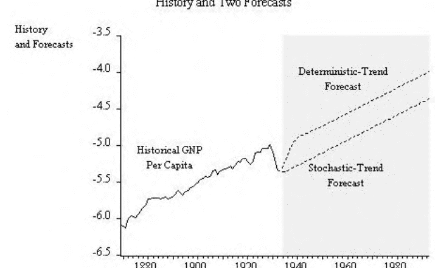

- 这是单变量BN。我们将在后面推导多变量BN。

### 带漂移的随机游走预测

```
math
x_t = b + x_{t-1} + \varepsilon_t
\varepsilon_t \sim WN(0, \sigma^2)
```

### 最优预测：

```
math
x_{T+h,T} = bh + x_T
```

预测不会回归到趋势

### 线性趋势 + 平稳AR(1)的预测

```
math
x_t = a + bt + y_t
```

```
math
y_t = \phi y_{t-1} + \varepsilon_t
\varepsilon_t \sim WN(0, \sigma^2)
```

### 最优预测：

```
math
x_{T+h,T} = a + b(T+h) + \phi^h y_T
```

预测回归到趋势

### 9.2 随机趋势与确定性趋势

一些语言...

- “随机漫步与漂移” vs. “统计AR(1) 环绕线性趋势”
- “单位根” vs. “平稳根”
- “差分平稳” vs. “趋势平稳”
- “随机趋势” vs. “确定性趋势”
- “I(1)” vs. “I(0)”
- 随机趋势 vs. 确定性趋势

### 9.3 单位根分布

AR(1) 过程中的单位根分布

```
y_t = y_{t-1} + \varepsilon_t
```

$$
T(\hat{\phi}_{LS} - 1) \xrightarrow{d} DF
$$

超一致

有限样本中有偏 ( E\hat{\phi} < \phi \quad \forall \phi \in (0,1) )

“Hurwicz偏差” “Dickey-Fuller偏差”

“Nelson-Kang虚假周期性”

当 T \to 0 时，越大 \phi \to 1，截距和趋势也越大

非高斯分布（左偏）

由蒙特卡洛法计算的DF值

标准化版本

$$
\hat{\tau} = \frac{\hat{\phi} - 1}{s \sqrt{\frac{1}{\sum_{t=2}^{T} y_{t-1}^2}}}
$$

不在有限样本中

不在渐近 (0,1) 中

再次由蒙特卡洛法计算

替代假设下的非零均值

$$
(y_t - \mu) = \phi (y_{t-1} - \mu) + \varepsilon_t
$$

$$
y_t = \alpha + \phi y_{t-1} + \varepsilon_t
$$

其中 \alpha = \mu(1-\phi)

随机游走零假设 vs. 均值回归替代假设

标准化统计量 \hat{\tau}_{\mu}

替代假设下的确定性趋势

$$
(y_t - a - b t) = \phi (y_{t-1} - a - b (t-1)) + \varepsilon_t
$$

$$
y_t = \alpha + \beta t + \phi y_{t-1} + \varepsilon_t
$$

其中 \alpha = a(1-\phi) + b\phi 和 \beta = b(1-\phi)

H_0: \phi = 1 (单位根)

H_1: \phi < 1 (平稳根)

“带漂移的随机游走” vs. “统计AR(1) 环绕线性趋势”

“差分平稳” vs. “趋势平稳”

“随机趋势” vs. “确定性趋势”

“I(1)” vs. “I(0)”

学生化统计量 \hat{\tau}_{\tau}

制表迪基-富勒分布

- 1. 设置 T
- 2. 绘制 T N(0,1) 变量
- 3. 构建 y_t
- 4. 运行三个DF回归（使用常见的随机数）

+ - $\tau: y_t = \phi y_{t-1} + e_t$
- $\tau_\mu: y_t = c + \phi y_{t-1} + e_t$
- $\tau_\tau: y_t = c + \beta t + \phi y_{t-1} + e_t$

- 5. 重复 $N$ 次，得到 $\{\hat{\tau}^i, \hat{\tau}_\mu^i, \hat{\tau}_\tau^i\}_{i=1}^N$
- 6. 排序和计算分位数
- 7. 拟合响应曲面

### $AR(p)$

```
$y_t + \sum_{j=1}^p \phi_j y_{t-j} = \varepsilon_t$

$y_t = \rho_1 y_{t-1} + \sum_{j=2}^p \rho_j (y_{t-j+1} - y_{t-j}) + \varepsilon_t$

其中 $p \geq 2$, $\rho_1 = -\sum_{j=1}^p \phi_j$, 而 $\rho_i = \sum_{j=i}^p \phi_j$, $i=2, ..., p$
```

标准化统计量 $\hat{\tau}$

考虑非零均值的备择假设

```
$(y_t - \mu) + \sum_{j=1}^p \phi_j (y_{t-j} - \mu) = \varepsilon_t$

$y_t = \alpha + \rho_1 y_{t-1} + \sum_{j=2}^p \rho_j (y_{t-j+1} - y_{t-j}) + \varepsilon_t$

其中 $\alpha = \mu(1 + \sum_{j=1}^p \phi_j)$
```

标准化统计量 $\hat{\tau}_\mu$

考虑替代趋势

```
$(y_t - a - bt) + \sum_{j=1}^p \phi_j (y_{t-j} - a - b(t-j)) = \varepsilon_t$

$y_t = k_1 + k_2 t + \rho_1 y_{t-1} + \sum_{j=2}^p \rho_j (y_{t-j+1} - y_{t-j}) + \varepsilon_t$

$k_1 = a(1 + \sum_{i=1}^p \phi_i) - b \sum_{i=1}^p i \phi_i$

$k_2 = b (1 + \sum_{i=1}^p \phi_i)$
```

在零假设下，$k_1 = -b \sum_{i=1}^p i \phi_i$ 和 $k_2 = 0$

标准化统计量 $\hat{\tau}_\tau$

### 9.4 单变量和多变量增广迪基-富勒

### 表示

一般 $ARMA$ 表示

(“增广迪基-富勒”(ADF))

使用其中一个表示:$y_t = \rho_1 y_{t-1} + \sum_{j=2}^{k-1} \rho_j (y_{t-j+1} - y_{t-j}) + \varepsilon_t$

$y_t = \alpha + \rho_1 y_{t-1} + \sum_{j=2}^{k-1} \rho_j (y_{t-j+1} - y_{t-j}) + \varepsilon_t$

$y_t = k_1 + k_2 t + \rho_1 y_{t-1} + \sum_{j=2}^{k-1} \rho_j (y_{t-j+1} - y_{t-j}) + \varepsilon_t$

令 $k \to \infty$ 且 $k/T \to 0$

ADF的“检验形式”

$(y_t - y_{t-1}) = (\rho_1 - 1)y_{t-1} + \sum_{j=2}^{k-1} \rho_j (y_{t-j+1} - y_{t-j}) + \varepsilon_t$

- 单位根对应于 $(\rho_1 - 1) = 0$
- 使用标准的自动计算 $t$-统计量（当然没有 $t$-分布）

## 9.5 虚假回归

多元问题：虚假时间序列回归

将一个持久变量回归到一个不相关的持久变量上：

$y_t = \beta x_t + \varepsilon_t$

（典型情况：$y$, $x$是独立的无漂移随机游走）

$R^2 \stackrel{d}{\to} RV$（非零）

$\frac{t}{\sqrt{T}} \stackrel{d}{\to} RV$（$t$ 发散）

$\frac{\hat{\beta}}{\sqrt{T}} \stackrel{d}{\to} RV$（$\beta$ 发散）

何时I(1)水平回归不是虚假的？

答案：当变量是协整的时候。

## 9.6 协整、误差修正和格兰杰的表示定理

协整

考虑一个 $N$维变量 $x$:

$x \sim CI (d, b)$ 如果

- 1. $x_i \sim I(d), i=1,...,N$
- 2. $\exists$1个或多个线性组合 $z_t = \alpha'x_t$ s.t. $z_t \sim I(d-b), b>0$

典型案例

$x \sim CI(1,1)$ 如果

- (1) $x_i \sim I(1), i = 1, ..., N$
- (2) $\exists$1个或多个线性组合 $z_t = \alpha'x_t$ s.t. $z_t \sim I(0)$

例子

```
x_t = x_{t-1} + v_t, v_t ~ WN
y_t = x_{t-1} + ε_t, ε_t ~ WN, ε_t ⊥ v_{t-τ}, ∀t, τ
⇒ (y_t - x_t) = ε_t - v_t = I(0)
```

协整和“吸引子集”

$x_t$ 是 $N$ 维的，但在 $\mathbb{R}^N$ 中不是随机漫步

$\alpha'x_t$ 被一个 $(N - R)$ 维子空间吸引 $\mathbb{R}^N$

$N$: 空间维度

$R$: 协整关系数

吸引子维度 = $N - R$

(“潜在单位根的数量”)

(“共同趋势的数量”)

例子

3维VAR(p)，所有变量I(1)

- $R=0$ ⇔ 没有协整 ⇔ $x$在$\mathbb{R}^3$中漫游
- $R=1$ ⇔ 1个协整向量 ⇔ $x$被一个2维超平面吸引在$\mathbb{R}^3$中，由$\alpha'_1 x=0$给出
- $R=2$ ⇔ 2个协整向量 ⇔ $x$被一个1维超平面（直线）吸引在$\mathbb{R}^3$中，由两个2维超平面的交点给出，$\alpha'_1 x=0$和$\alpha'_2 x=0$
- $R=3$ ⇔ 3个协整向量 ⇔ $x$吸引到$\mathbb{R}^3$中的一个0维超平面（点），由三个2维超平面的交集给出，$\alpha'_1 x=0$，$\alpha'_2 x=0$和$\alpha'_3 x=0$（在E(x)周围的协方差平稳）

协整动机：动态因子结构具有I(1)因子的因子结构

$(N - R)$ I(1)因子驱动 $N$个变量

例如，单因子模型：

```
\begin{pmatrix} y_{1t} \\ \vdots \\ y_{Nt} \end{pmatrix} = \begin{pmatrix} 1 \\ \vdots \\ 1 \end{pmatrix} f_t + \begin{pmatrix} \varepsilon_{1t} \\ \vdots \\ \varepsilon_{Nt} \end{pmatrix}
f_t = f_{t-1} + η_t
```

$R=(N-1)$协整组合：$(y_{2t}-y_{1t}), ..., (y_{Nt}-y_{1t})$

$(N-R)=N-(N-1)=1$个共同趋势

协整动机：最优预测

I(1)变量始终与其最优预测共整

例子：

```
x_t = x_{t-1} + ε_t
x_{t+h|t} = x_t
⇒ x_{t+h} - x_{t+h|t} = Σ_{i=1}^h ε_{t+i}
```

### 简单AR案例 (ECM) :

```
$$\Delta y_t = \alpha \Delta y_{t-1} + \beta \Delta x_{t-1} - \gamma(y_{t-1} - \delta x_{t-1}) + u_t$$
$$= \alpha \Delta y_{t-1} + \beta \Delta x_{t-1} - \gamma z_{t-1} + u_t$$
```

### 广义AR模型 (VECM) :

```
$$A(L) \Delta x_t = -\gamma z_{t-1} + u_t$$
```

其中:
$$z_t = \alpha' x_t$$

多元ADF
任何VAR模型都可以写成:

```
$$\Delta x_t = -\Pi x_{t-1} + \sum_{i=1}^{p-1} B_i \Delta x_{t-i} + u_t$$
```

### 积分/协整状态

- 秩 (II) = 0
    0个协整向量，N个基本单位根
    (所有变量以适当的差分方式规定)
- 秩 (II) = N
    N个协整向量，0个单位根
    (所有变量以水平方式适当规定)
- 秩 (II) = R   (0 < R < N)
    R个协整向量，N-R个单位根
    新的重要中间情况
    (在单变量中不可能)

### Granger表示定理

```
$$x_t \sim VECM \quad \Leftrightarrow \quad x_t \sim CI(1,1)$$
```

$$VECM \Leftarrow 协整$$
我们总是可以写成
$$\Delta x_t = \sum_{i=1}^{p-1} B_i \Delta x_{t-i} - \Pi x_{t-1} + u_t$$
但在协整下，秩(II) = R < N, 所以$\Pi$是N×N的矩阵，秩为R，可以分解为$\Pi = \gamma \alpha'$，其中$\gamma$和$\alpha'$是N×R的矩阵。

```
$$\Rightarrow \Delta x_{t} = \sum_{i=1}^{p-1} B_i \Delta x_{t-i} - \gamma \alpha' x_{t-1} + u_t$$
$$= \sum_{i=1}^{p-1} B_i \Delta x_{t-i} - \gamma z_{t-1} + u_t$$
```

$$VECM \Rightarrow 协整$$

```
$$\Delta x_{t} = \sum_{i=1}^{p-1} B_i \Delta x_{t-i} - \gamma \alpha' x_{t-1} + u_t$$
```

乘以$\alpha'$:

```
$$\alpha' \Delta x_{t} = \alpha' \sum_{i=1}^{p-1} B_i \Delta x_{t-i} - \alpha' \gamma \alpha' x_{t-1} + \alpha' u_t$$
```
由于$\alpha' \gamma$是满秩的(R×R)，$\alpha' x_{t-1}$必须是平稳的。

因此，方程平衡要求 $\alpha' x_{t-1}$ 是平稳的。

### 平稳-非平稳分解

```
$$ M'_{(N \times N)} x_{(N \times 1)} = \begin{pmatrix} \alpha'_{(R \times N)} \\ \delta_{(N-R) \times N} \end{pmatrix} x = \begin{pmatrix} CI组合 \\ 共同趋势 \end{pmatrix} $$
```

（行向量 $\delta$ ⊥ 列向量 $\gamma$）

直观上，通过 $\delta$ 对系统进行转换

```
$$ \delta \Delta x_t = \sum_{i=1}^{p-1} \delta B_i \Delta x_{t-i} - \delta \gamma \alpha' x_{t-1} + \delta u_t $$
```

因此，$\delta$ 隔离了VECM中适当规定为差分VAR的部分。

请注意，如果我们从$M'x$开始，那么观察到的系列是$(M')^{-1} M'x$, 因此非平稳性在整个系统中传播。

### 例子

```
$$ x_{1t} = x_{1t-1} + u_{1t} $$
$$ x_{2t} = x_{1t-1} + u_{2t} $$
```

水平形式：

```
$$ \left( \begin{pmatrix} 1 & 0 \\ 0 & 1 \end{pmatrix} - \begin{pmatrix} 1 & 0 \\ 1 & 0 \end{pmatrix} L \right) \begin{pmatrix} x_{1t} \\ x_{2t} \end{pmatrix} = \begin{pmatrix} u_{1t} \\ u_{2t} \end{pmatrix} $$
```

Dickey-Fuller形式：

```
$$ \begin{pmatrix} \Delta x_{1t} \\ \Delta x_{2t} \end{pmatrix} = - \begin{pmatrix} 0 & 0 \\ -1 & 1 \end{pmatrix} \begin{pmatrix} x_{1t-1} \\ x_{2t-1} \end{pmatrix} + \begin{pmatrix} u_{1t} \\ u_{2t} \end{pmatrix} $$
```

示例，继续

```
$$ \Pi = \begin{pmatrix} 0 \\ 1 \end{pmatrix} \begin{pmatrix} -1 & 1 \end{pmatrix} = \gamma \alpha' $$
```

```
$$ M' = \begin{pmatrix} -1 & 1 \\ 1 & 0 \end{pmatrix} = \begin{pmatrix} \alpha' \\ \delta \end{pmatrix} $$
```
其中 $\delta = (1, 0)$ 且 $\alpha' = (-1, 1)$，满足 $\delta \gamma = 0$。

## 9.7 分数积分和长记忆

长记忆和分数积分

“整数积分”$ARIMA(p, d, q)\ I(d)$：

```
$$(1-L)^d\Phi(L)y_t = \Theta(L)\varepsilon_t,\ d = 0, 1, ...$$
```

协方差平稳性:　　$ARIMA(p,0,q)$

随机游走:$ARIMA(0,1,0)$ “纯单位根过程”

“分数阶积分”$ARFIMA(p, d, q)\ I(d)$：

```
$$(1-L)^d\Phi(L)y_t = \Theta(L)\varepsilon_t,\ -\frac{1}{2} < d < \frac{1}{2}$$
```

协方差平稳性:　　$-\frac{1}{2} < d < \frac{1}{2}$ (关注于 $0 < d < \frac{1}{2}$)

$ARFIMA(0,d,0)$:“纯分数阶积分过程”

```
$$(1-L)^d = 1 - dL + \frac{d(d-1)}{2!}L^2 - \frac{d(d-1)(d-2)}{3!}L^3 + ...$$
```

长记忆和分数阶积分，持续时间域，$\tau \rightarrow \infty$

- $I(1) : \rho(\tau) \propto const$
- $I(0) : \rho(\tau) \propto r^\tau\ (0 < r < 1)$
- $I(d) : \rho(\tau) \propto \tau^{2d-1}\ (0 < d < 1/2)$

### 9.7.1 特征化积分状态

频率域，　　$\omega \rightarrow 0$

- $I(1) : f(\omega) \propto \omega^{-2}$
- $I(0) : f(\omega) \propto const$
- $I(d) : f(\omega) \propto \omega^{-2d}\ (0 < d < 1/2)$

频域 $I(d)$ 行为意味着对于低频率，

```
$$ln\ f^*(\omega) = \beta_0 + \underbrace{\beta_1}_{-2d}ln\omega + \varepsilon_t$$
```

GPH 估计器的$d$: 回归$ln\ f^*(\omega)$ on $const,\ ln\ \omega$

所以取 $\hat{d} = -\frac{1}{2}\hat{\beta_1}$. “GPH 估计器”

## 9.8 练习, 问题和补充

1. 应用建模.
获取美国工业生产系列,每月,1947.01-至今,未经季节性调整.丢弃最后20个观测值.现在绘制该系列.详细检查其趋势和季节性模式.线性趋势（拟合对数）是否合适？每月季节性虚拟变量是否合适？对该系列的对数，拟合具有线性趋势和每月季节性虚拟变量的ARMA模型.确保尝试各种我们所涵盖的技术（样本自相关和偏自相关函数，巴特利特标准误差，Box-Pierce检验，回归的标准误差，调整的$R^2$等）来选择一个合适的模型.一旦选择并估计了一个模型，使用它来预测最后20个观测值，并将您的预测与实际实现值进行比较.将该方法的结果与Box-Jenkins季节性ARIMA方法的结果进行对比，该方法涉及根据需要进行首次和季节性差分以诱导协方差平稳性，然后拟合一个乘法季节性ARMA模型.

2. 聚合。
格兰杰（1980）表明，大量平稳ARMA时间序列的聚合，在正则条件下（在罗宾逊，1991年进行了推广），会产生一个分数阶积分过程。因此，短期记忆过程的聚合会产生长期记忆过程。在ARMA过程的聚合定理的光下讨论这个结果。特别地，回想一下，ARMA过程的聚合会产生新的ARMA过程，通常比组成部分的阶数更高。

3. 过度差分和UCM. 随机趋势

```
T_t = T_{t-1} + \beta_{t-1} + \eta_t \\
\beta_t = \beta_{t-1} + \zeta_t
```
有两个单位根。从经济时间序列的“过度差分”角度进行讨论。

## 9.9 注释

## 第十章 波动性动态

### 10.1 波动性与金融计量经济学

### 10.2 GARCH

### 10.3 随机波动性

### 10.4 基于观测和基于参数的过程

### 序言：阅读

接下来的内容很大程度上依赖于：

- Andersen, T.G., Bollerslev, T., Christoffersen, P.F. and Diebold, F.X. (2012), "金融风险管理的金融风险测量," in G. Constantinedes, M.Harris and Rene Stulz (eds.),金融经济学手册, Elsevier.
- Andersen, T.G., Bollerslev, T. and Diebold, F.X. (2010), "参数化和非参数化波动性测量," in L.P. Hansen and Y. Ait-Sahalia (eds.),金融计量经济学手册. 阿姆斯特丹：北荷兰, 67-138.
- Andersen, T.G., Bollerslev, T., Christoffersen, P.F., and Diebold, F.X. (2006), "波动性和相关性预测," in G. Elliott, C.W.J. Granger, and A. Timmermann(eds.),经济预测手册. 阿姆斯特丹：北荷兰, 778-878.

### 序言

- 贯穿全书：条件风险测量的可取性
- 聚合水平
    - 投资组合水平（聚合的、单变量的）风险测量
    - 资产水平（分解的、多变量的）：风险管理
- 数据观测频率
    - 低频数据与高频数据
    - 参数化与非参数化波动率测量
- 测量和建模的对象
    - 从条件方差到条件密度
- 在“大数据”多变量环境中的维度约简
    - 从临时统计限制到因子结构

### 数据中有什么？

回报率
关键事实1：回报率大致上是序列无相关的
关键事实2：回报率不服从高斯分布
关键事实3：回报率有条件异方差性I
关键事实3：回报率有条件异方差性II

### 为什么关心波动率动态？

当波动率是动态的时候，一切都会改变

- 风险管理
- 投资组合配置
- 资产定价
- 套期保值
- 交易

风险管理

图10.2：纽约证交所每日回报的自相关图

图10.3：纽约证交所每日回报的直方图和统计数据

| 统计量 | 值 |
|--------|----|
| Series | R |
| Sample | 1 3461 |
| Observations | 3461 |
| Mean | 0.000522 |
| Median | 0.000640 |
| Maximum | 0.047840 |
| Minimum | -0.063910 |
| Std. Dev. | 0.008541 |
| Skewness | -0.505540 |
| Kurtosis | 8.535016 |
| Jarque-Bera | 4565.446 |
| Probability | 0.000000 |## 图10.4：纽约证交所每日平方回报的时间序列

## 图10.5：纽约证交所每日平方回报的自相关图

## 个体资产回报率：
$r \sim (\mu, \Sigma)$

## 投资组合回报率：
$r_p = \lambda' r \sim (\lambda' \mu, \lambda' \Sigma \lambda)$

如果$\Sigma$变化，我们需要追踪时变的投资组合风险， $\lambda' \Sigma_t \lambda$

投资组合配置
最优投资组合份额 $w^*$求解：
$最小_w w' \Sigma w$
$s.t. w' \mu = \mu_p$

重要的是， $w^* = f(\Sigma)$
如果$\Sigma$变化，我们有 $w_t^* = f(\Sigma_t)$

## 资产定价I：夏普比率

标准夏普：
$\frac{E(r_{it} - r_{ft})}{\sigma}$

条件夏普：
$\frac{E(r_{it} - r_{ft})}{\sigma_t}$

## 资产定价II：CAPM标准CAPM：
$(r_{it} - r_{ft}) = \alpha + \beta (r_{mt} - r_{ft})$
$\beta = \frac{cov((r_{it} - r_{ft}), (r_{mt} - r_{ft}))}{var(r_{mt} - r_{ft})}$

条件CAPM：
$\beta_t = \frac{cov_t((r_{it} - r_{ft}), (r_{mt} - r_{ft}))}{var_t(r_{mt} - r_{ft})}$

## 资产定价III：衍生品

布莱克-斯科尔斯：
$C = N(d_1)S - N(d_2)Ke^{-r\tau}$
$d_1 = \frac{ln(S/K) + (r + \sigma^2/2)\tau}{\sigma\sqrt{\tau}}$
$d_2 = \frac{ln(S/K) + (r - \sigma^2/2)\tau}{\sigma\sqrt{\tau}}$
$P_C = BS(\sigma, ...)$

（标准布莱克-斯科尔斯期权定价）当 $\sigma$ 变化时完全不同！

对冲

- 标准Delta对冲
  $\Delta H_t = \delta \Delta S_t + u_t$
  $\delta = \frac{cov(\Delta H_t, \Delta S_t)}{var(\Delta S_t)}$

- 动态对冲
  $\Delta H_t = \delta_t \Delta S_t + u_t$
  $\delta_t = \frac{cov_t(\Delta H_t, \Delta S_t)}{var_t(\Delta S_t)}$

## 交易

- 标准情况：无法根据固定波动性进行交易
- 波动性变化 I：期权跨式、跨式等。根据是否 $P_C><f(\sigma_{t+h,t},...)$（间接）采取立场
- 波动性变化 II：波动性掉期实质上是对基础“实现波动性”（直接）撰写的期货合约

## 一些热身

无条件波动性测量

- 方差：$\sigma^2 = E(r_t - \mu)^2$（或标准差：$\sigma$）
- 平均绝对偏差：$MAD = E|r_t - \mu|$
- 四分位距：$IQR = 75\% - 25\%$

图10.6: 当波动性为持久时，名义1% HS-VaR的真实超额概率
持久的。我们从一个真实校准的动态波动性模型中模拟收益率，然后使用500个观测值的滚动窗口计算1天1% HS-VaR。我们绘制从模型中推断出的真实条件超额概率的日度系列。为了视觉参考，我们在所需的1%概率水平上包括一条水平线。

p%风险值 ( VaR^p): x s.t. P(r_t < x) = p

异常值概率: P|r_t - μ| > 5σ (例如)

尾指数: γ s.t. P(r_t > r) = k r^{-γ}

峰度: K = E(r - μ)^4 / σ^4

过于无条件的视角的危险性 (HS-VaR)

无条件视角的危险性，第二部分

无条件的HS-VaR视角鼓励使用不正确的经验法则，比如按比例缩放以将1天的波动转换为h天的波动。条件VaR √条件VaR

条件VaR (VaR_{T+1|T}) 的解决方法是：
$p = P_T(r_{T+1} \leq -VaR^p_{T+1|T}) = \int_{-\infty}^{-VaR^p_{T+1|T}} f_T(r_{T+1}) dr_{T+1}$
（f_T(r_{T+1}) 是在时间-T信息条件下的+1密度）

但是任何风格的VaR都存在问题

- 当超过VaR时，VaR对预期损失保持沉默
（未能评估整个分布尾部）
- VaR无法捕捉投资组合多样化的益处

条件期望损失：
$ES^p_{T+1|T} = p^{-1} \int_{0}^{p} VaR^\gamma_{T+1|T} d\gamma$

- ES评估整个分布尾部
- ES捕捉投资组合多样化的益处

## 指数平滑和RiskMetrics
$\sigma_t^2 = \lambda \sigma_{t-1}^2 + (1-\lambda) r_{t-1}^2$
$\sigma_t^2 = \sum_{j=0}^{\infty} \varphi_j r_{t-1-j}^2$
$\varphi_j = (1-\lambda) \lambda^j$
(可以有多种初始化方法: $r_1^2$, 样本方差等)
$\text{RM-VaR}_{T+1|T}^p = \sigma_{T+1} \Phi_p^{-1}$

- 方差的随机游走
- 平方收益的随机游走加噪声模型
- 任何时点的波动率预测都是当前平滑值
- 但是平稳的波动率期限结构并不现实

## 严格建模 I

## 从“每日”数据中得出的条件单变量波动性动态

条件回报分布
$f(r_t) \text{ vs. } f(r_t|\Omega_{t-1})$

关键点 1: $E(r_t|\Omega_{t-1})$

回报是否有条件均值独立性? 可以说是有的。

回报 (可以说) 近似序列无相关, 并且 (可以说) 近似没有额外的非线性条件均值依赖性。

条件回报分布, 继续关键点 2: $var(r_t|\Omega_{t-1}) = E((r_t - \mu)^2|\Omega_{t-1})$

回报是否有条件方差独立性? 不可能!

平方回报序列相关, 通常衰减非常缓慢。

标准模型

(线性不确定过程与独立同分布创新)
$y_t = \sum_{i=0}^{\infty} b_i \varepsilon_{t-i}$
$\varepsilon \sim iid(0, \sigma_\varepsilon^2) \quad \sum_{i=0}^{\infty} b_i^2 < \infty \quad b_0 = 1$

无条件均值: $E(y_t) = 0$ (常数)

无条件方差: $E(y_t - E(y_t))^2 = \sigma_\varepsilon^2 \sum_{i=0}^{\infty} b_i^2$ (常数)

条件均值: $E(y_t | \Omega_{t-1}) = \sum_{i=1}^{\infty} b_i \varepsilon_{t-i}$ (变化)

条件方差: $E([y_t - E(y_t | \Omega_{t-1})]^2 | \Omega_{t-1}) = \sigma_\varepsilon^2$ (常数)

## 标准模型，续

## k步最小二乘预测
$E(y_{t+k} | \Omega_t) = \sum_{i=0}^{\infty} b_{k+i} \varepsilon_{t-i}$

相关预测误差:
$y_{t+k} - E(y_{t+k} | \Omega_t) = \sum_{i=0}^{k-1} b_i \varepsilon_{t+k-i}$

条件预测误差方差:
$E([y_{t+k} - E(y_{t+k} | \Omega_t)]^2 | \Omega_t) = \sigma_\varepsilon^2 \sum_{i=0}^{k-1} b_i^2$

关键: 仅取决于k，不取决于$\Omega_t$

## ARCH(1)过程
$r_t | \Omega_{t-1} \sim N(0, h_t)$
$h_t = \omega + \alpha r_{t-1}^2$
$E(r_t) = 0$
$E(r_t - E(r_t))^2 = \frac{\omega}{(1 - \alpha)}$
$E(r_t | \Omega_{t-1}) = 0$
$E([r_t - E(r_t | \Omega_{t-1})]^2 | \Omega_{t-1}) = \omega + \alpha r_{t-1}^2$

## GARCH(1,1) 过程

## “广义ARCH”
$r_t | \Omega_{t-1} \sim N(0, h_t)$
GARCH的方差方程
$$h_t = \omega + \alpha r_{t-1}^2 + \beta h_{t-1}$$
$$E(r_t) = 0$$
$$E(r_t - E(r_t))^2 = \frac{\omega}{(1 - \alpha - \beta)}$$
$$E(r_t|\Omega_{t-1}) = 0$$
$$E([r_t - E(r_t \mid \Omega_{t-1})]^2 \mid \Omega_{t-1}) = \omega + \alpha r_{t-1}^2 + \beta h_{t-1}$$

## 基于条件高斯GARCH的1日VaR
$$\text{GARCH-VaR}^p_{T+1|T} \equiv \sigma_{T+1|T} \Phi_p^{-1}$$

- 与无条件回报分布的尾部一致
- 可扩展以允许尾部厚尾的条件分布

## 统一的理论框架

- 波动性动态 (当然，通过构建)
- 条件对称性转化为无条件对称性
- 波动性聚集产生无条件的厚尾

## 可操作的经验框架
$$L(\theta; r_1, \dots, r_T) \approx f(r_T|\Omega_{T-1}; \theta) f(r_{T-1}|\Omega_{T-2}; \theta) \dots f(r_{p+1}|\Omega_p; \theta)$$

如果条件密度是高斯分布的话，
$$f(\mathbf{R}_t|\Omega_{t-1}; \theta) = \frac{1}{\sqrt{2\pi}} h_t(\theta)^{-1/2} \exp\left(-\frac{1}{2} \frac{R_t^2}{h_t(\theta)}\right)$$
$$\ln L(\theta; \mathbf{R}_{p+1}, \dots, \mathbf{R}_T) \approx -\frac{T-p}{2} \ln(2\pi) - \frac{1}{2} \sum_{t=p+1}^{T} \ln h_t(\theta) - \frac{1}{2} \sum_{t=p+1}^{T} \frac{R_t^2}{h_t(\theta)}$$

## GARCH(1,1)和指数平滑

## 指数平滑递归：
$$\bar{r}_t^2 = \gamma r_t^2 + (1-\gamma) \bar{r}_{t-1}^2$$
通过反向代换得到：
$$\bar{r}_t^2 = \sum w_j r_{t-j}^2$$
其中 $w_j = \gamma(1-\gamma)^j$

但在GARCH(1,1)中我们有：
$$h_t = \omega + \alpha r_{t-1}^2 + \beta h_{t-1}$$
$$h_t = \frac{\omega}{1-\beta} + \alpha \sum \beta^{j-1} r_{t-j}^2$$

## 方差定位

## 样本无条件方差：
$$\hat{\sigma}^2 = \frac{1}{T} \sum_{t=1}^{T} R_t^2$$

## 隐含无条件GARCH(1,1)方差：
$$\sigma^2 = \frac{\omega}{1-\alpha-\beta}$$
我们可以通过约束 $\sigma^2 = \hat{\sigma}^2$ 来约束：
$$\omega = (1-\alpha-\beta)\hat{\sigma}^2$$

- 节省一个自由度并确保合理性

## 平方中的ARMA表示
$r_t^2$ has the ARMA(1,1) representation:
$$r_t^2 = \omega + (\alpha+\beta)r_{t-1}^2 - \beta\nu_{t-1} + \nu_t,$$
where $\nu_t = r_t^2 - h_t$.

## GARCH主题的变体

## 带有GARCH扰动的回归
$$y_t = x_t'\beta + \varepsilon_t$$
$$\varepsilon_t|\Omega_{t-1} \sim N(0, h_t)$$

- 带有GARCH扰动的回归
- 纳入外生变量
- 非对称响应和杠杆效应:
- 尾部厚重的条件密度
- 时变风险溢价

## 纳入外生变量
$$ h_t = \omega + \alpha r_{t-1}^{2} + \beta h_{t-1} + \gamma' z_t $$
$\gamma$是一个参数向量
$z$是一组正的外生变量。

## 非对称响应和杠杆效应I: TARCH
标准GARCH: $h_t = \omega + \alpha r_{t-1}^{2} + \beta h_{t-1}$
TARCH: $h_t = \omega + \alpha r_{t-1}^{2} + \gamma r_{t-1}^{2} D_{t-1} + \beta h_{t-1}$
$$ D_t = \begin{cases} 1 & \text{如果 } r_t < 0 \\ 0 & \text{否则} \end{cases} $$
正收益（好消息）：对波动率的$\alpha$效应
负收益（坏消息）：对波动率的$\alpha + \gamma$效应

$\gamma = 0$: 非对称新闻响应
$\gamma > 0$: 杠杆效应

## 非对称响应II: E-GARCH
$$ \ln(h_t) = \omega + \alpha \left| \frac{r_{t-1}}{h_{t-1}^{1/2}} \right| + \gamma \frac{r_{t-1}}{h_{t-1}^{1/2}} + \beta \ln(h_{t-1}) $$

- 对数规范确保条件方差为正
- 波动性由冲击的大小和符号驱动
- 当$\gamma < 0$时存在杠杆效应

## 尾厚条件密度: t-GARCH
如果$r_t$在条件下服从高斯分布，则 $\frac{r_t}{\sqrt{h_t}} \sim N(0,1)$
但在高频数据中经常出现 $\frac{r_t}{\sqrt{h_t}} \sim \text{尾厚}$
因此取:
$r_t = h_t^{1/2} z_t$
独立同分布
$$ z_t \sim \frac{t_d}{\text{std}(t_d)} $$

| Coefficient | Std. Error | z-Statistic | Prob. |
|-------------|------------|-------------|-------|
| C           | 0.000640   | 0.000127    | 5.036942 | 0.0000 |
| **Variance Equation** | | | | |
| C           | 1.06E-06   | 1.49E-07    | 7.136840 | 0.0000 |
| ARCH(1)     | 0.067410   | 0.004955    | 13.60315 | 0.0000 |
| GARCH(1)    | 0.919714   | 0.006122    | 150.2195 | 0.0000 |

## 图10.7: GARCH(1,1)估计，纽约证券交易所每日收益率。

## 时变风险溢价: GARCH-M

## 标准GARCH回归模型:
$$ y_t = x_t'\beta + \varepsilon_t $$
$$ \varepsilon_t|\Omega_{t-1} \sim N(0, h_t) $$

## GARCH-M模型是一个特例:
$$ y_t = x_t'\beta + \gamma h_t + \varepsilon_t $$
$$ \varepsilon_t|\Omega_{t-1} \sim N(0, h_t) $$

- 一个GARCH(1,1)示例
- 一个GARCH(1,1)示例
- 一个GARCH(1,1)示例
- 一个GARCH(1,1)示例

在探索了许多可能的扩展之后...

## 严格建模II

## 来自高频数据的条件单变量波动性动态

图10.8：GARCH(1,1)残差的平方标准化自相关图，每日纽约证券交易所收益率.

图10.9：估计的条件标准差，每日纽约证券交易所收益率.

图10.10：条件标准差，历史和预测，每日纽约证券交易所收益率.

因变量：R
方法：ML - ARCH (Marquardt) - 学生t分布
日期：04/10/12 时间：13:48
样本（调整后）：2 3461
调整后的观测值：3460
经过19次迭代达到收敛
预样本方差：反向预测（参数=0.7）
GARCH = C(4) + C(5)*RESID(-1)^2 + C(6)*RESID(-1)^2*(RESID(-1)<0) + C(7)*GARCH(-1)

| 变量 | 系数 | 标准误差 | z统计量 | 概率 |
|------|------|----------|---------|------|
| @SQRT(GARCH) | 0.083360 | 0.053138 | 1.568753 | 0.1167 |
| C | 1.28E-05 | 0.000372 | 0.034443 | 0.9725 |
| R(-1) | 0.073763 | 0.017611 | 4.188535 | 0.0000 |
| **方差方程** |  |  |  |  |
| C | 1.03E-06 | 2.23E-07 | 4.628790 | 0.0000 |
| RESID(-1)^2 | 0.014945 | 0.009765 | 1.530473 | 0.1259 |
| RESID(-1)^2*(RESID(-1)<0) | 0.094014 | 0.014945 | 6.290700 | 0.0000 |
| GARCH(-1) | 0.922745 | 0.009129 | 101.0741 | 0.0000 |
| T分布自由度 | 5.531579 | 0.478432 | 11.56188 | 0.0000 |

## 图10.11：具有阈值t-GARCH(1,1)-均值的AR(1)收益。

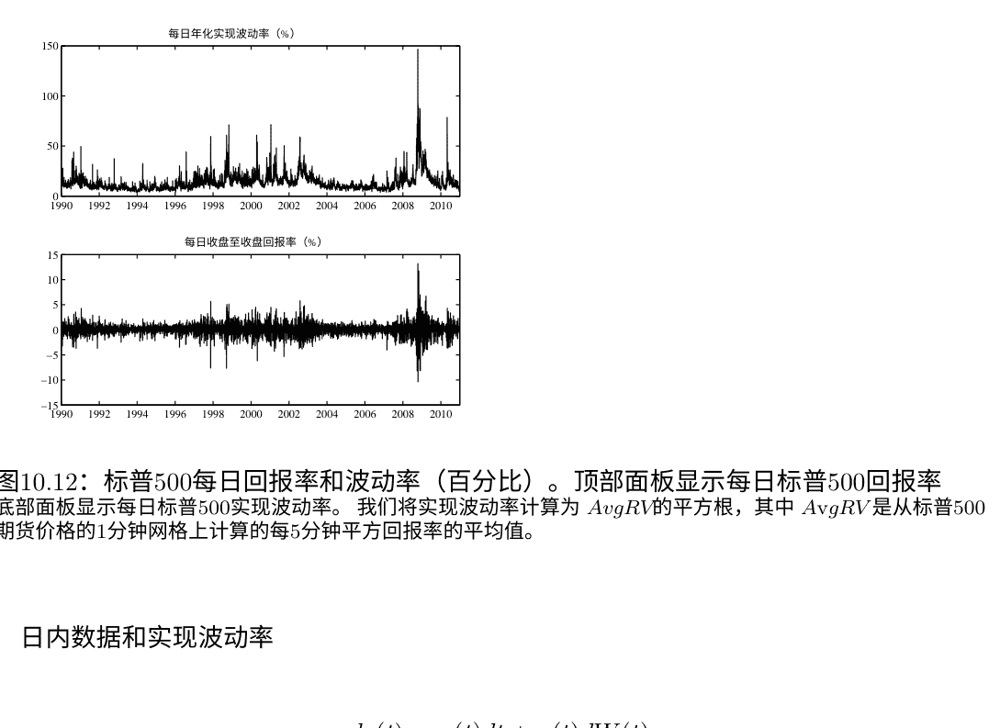

## 图10.12：标普500每日回报率和波动率（百分比）

顶部面板显示每日标普500回报率。底部面板显示每日标普500实现波动率。我们将实现波动率计算为 AvgRV 的平方根，其中 AvgRV 是从标普500期货价格的1分钟网格上计算的每5分钟平方回报率的平均值。

## 日内数据和实现波动率

$$dp(t) = \mu(t)dt + \sigma(t)dW(t)$$

$$RV_t (\Delta) \equiv \sum_{j=1}^{N(\Delta)} \left( p_{t-1+j\Delta} - p_{t-1+(j-1)\Delta} \right)^2$$

$$RV_t (\Delta) \rightarrow IV_t = \int_{t-1}^{t} \sigma^2(\tau) d\tau$$

-   状态空间信号提取
-   平均实现方差
-   实现核函数
-   其他许多

RV是持久的

RV可以合理地近似为对数正态分布

RV具有长期记忆

精确和近似的长期记忆

精确的长期记忆：

$$(1 - L)^d RV_t = \beta_0 + \nu_t$$


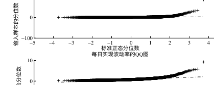

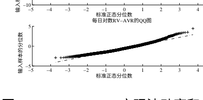

## 图10.13：S&P500：实现波动率和对数实现波动率的QQ图

顶部面板绘制了每日实现波动率的分位数与相应的正态分位数之间的关系。底部面板绘制了每日实现波动率的自然对数的分位数与相应的正态分位数之间的关系。我们将实现波动率计算为 $AvgRV$ 的平方根，其中 $AvgRV$ 是从S&P500期货价格的1分钟网格上计算的五个每日 $RV$ 的平均值。

“Corsi模型”（HAR）：

```
$RV_t = \beta_0 + \beta_1 RV_{t-1} + \beta_2 RV_{t-5:t-1} + \beta_3 RV_{t-21:t-1} + \nu_t$
```

更好的是：

```
$\log RV_t = \beta_0 + \beta_1 \log RV_{t-1} + \beta_2 \log RV_{t-5:t-1} + \beta_3 \log RV_{t-21:t-1} + \nu_t$
```

-   确保正性并促进正态分布

RV-VaR

```
$RV - VaR_{T+1|T}^{p} = RV_{T+1|T} \Phi_p^{-1},$
```

GARCH-RV

```
$\sigma_t^2 = \omega + \beta \sigma_{t-1}^2 + \gamma RV_{t-1}$
```

-   1步的罚款
-   多步骤需要用RV方程“关闭系统”
-   “实现GARCH”
-   “HEAVY”

分离跳跃

```
$QV_t = IV_t + JV_t$
```

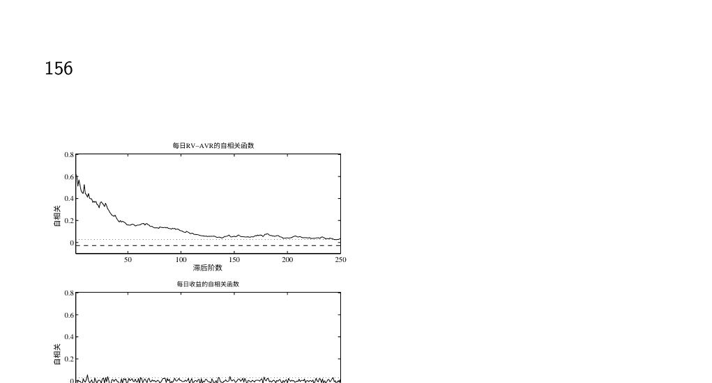

## 图10.14：S&P500：每日实现方差和每日收益的样本自相关函数

顶部面板显示了实现方差的自相关函数，底部面板显示了收益的自相关函数，从1到250天的位移。水平线表示95%的Bartlett带。实现方差是AvgRV，它是从1分钟的S&P500期货价格的5分钟平方收益计算出的五个每日RV的平均值。

其中
$$JV_t = \sum_{j=1}^{J_t} J_{t,j}^2$$

例如，我们可能想要探索：
$$RV_t = \beta_0 + \beta_1 IV_{t-1} + \beta_2 IV_{t-5:t-1} + \beta_3 IV_{t-21:t-1} + \alpha_1 JV_{t-1} + \alpha_2 JV_{t-5:t-1} + \alpha_3 JV_{t-21:t-1} + \nu_t$$

但是如何分离跳跃点？

-   截断：
$$TV_t(\Delta) = \sum_{j=1}^{N(\Delta)} \Delta p_{t-1+j\Delta}^2 I(\Delta p_{t-1+j\Delta} < \mathcal{T})$$

-   双功率变化：
$$BPV_t(\Delta) = \frac{\pi}{2} \frac{N(\Delta)}{N(\Delta)-1} \sum_{j=1}^{N(\Delta)-1} |\Delta p_{t-1+j\Delta}| |\Delta p_{t-1+(j+1)\Delta}|$$

-   最小值：
$$MinRV_t(\Delta) = \frac{\pi}{\pi-2} \frac{N(\Delta)}{N(\Delta)-1} \sum_{j=1}^{N(\Delta)-1} \min\{|\Delta p_{t-1+j\Delta}|, |\Delta p_{t-1+(j+1)\Delta}|\}^2$$

## 严格建模III

## 条件资产水平（多元）波动性动态

## 从“每日”数据中提取

多元
单变量波动性模型对于投资组合风险测量（VaR、ES等）很有用
但风险管理问题如何处理呢：

-   在涉及一组资产或资产类别的价格变动的某种情景下，投资组合风险会发生变化吗？
-   如果某些相关性突然增加，投资组合风险会发生变化吗？
-   如果我增加英特尔的持股数量，投资组合风险会发生变化吗？
-   如果协方差矩阵以某种方式变动，最优投资组合份额会发生变化吗？

同样，资产定价、对冲、交易中的几乎任何其他问题呢？ 几乎都涉及相关性。

## 基本框架和问题 I

N × 1 收益向量 $R_t$
N × N 协方差矩阵 $\Omega_t$

-   $\frac{N(N+1)}{2}$ 不同的元素
-   需要满足正定或半正定的结构
-   即使对于适度的 $N$，参数数量也很大
-   而 $N$可能不是适度的!

## 基本框架和问题 II

单变量:

```
$r_t = \sigma_t z_t$
$z_t \sim i.i.d.(0,1)$
```

多变量:

```
$R_t = \Omega_t^{1/2} Z_t$
$Z_t \sim i.i.d.(0,\mathcal{I})$
```

其中 $\Omega_t^{1/2}$ 是 $\Omega_t$ 的“平方根”（例如，Cholesky因子）

Ad Hoc指数平滑（RM）

```
$\Omega_t = \lambda \Omega_{t-1} + (1-\lambda) R_{t-1} R_{t-1}'$
```

-   假设所有方差和协方差的动态都由一个标量参数 λ（相同的平滑度）驱动
-   只要 Ω₀ 是正定的，就保证平滑的协方差矩阵是正定的
-   常见策略是将 Ω₀设置为样本协方差矩阵 $\frac{1}{T} \sum_{t=1}^{T} R_t R'_t$（如果 T > N，则协方差矩阵是正定的）
-   但是协方差矩阵的预测继承了单变量RM预测的不合理缩放特性，通常是次优的

## 多元GARCH(1,1)

$vech(\Omega_t) = vech(C) + B vech(\Omega_{t-1}) + A vech(R_{t-1}R'_{t-1})$

-   vech运算符将对称矩阵的上三角转换为 $\frac{1}{2}N(N+1) \times 1$ 列向量
-   矩阵 A 和 B 的维度都是 $\frac{1}{2}N(N+1) \times \frac{1}{2}N(N+1)$
-   即使在这个“简约”的GARCH(1,1)模型中，也有 $O(N^4)$ 个参数
    -   当 N = 100时，超过5000万个参数！

## 鼓励简约性：对角线GARCH(1,1)

对角线GARCH将 A 和 B 矩阵限制为对角线矩阵。

$vech(\Omega_t) = vech(C) + (I\beta) vech(\Omega_{t-1}) + (I\alpha) vech(R_{t-1}R'_{t-1})$
-   仍然有 $O(N^2)$ 个参数。

## 鼓励简洁：标量GARCH(1,1)

标量GARCH将 A 和 B 矩阵约束为标量：

$vech(\Omega_t) = vech(C) + (I\beta) vech(\Omega_{t-1}) + (I\alpha) vech(R_{t-1}R'_{t-1})$
-   与RM相似，但重要的区别是 Ω_t 的预测现在回归到
    $\Omega = (1 - \alpha - \beta)^{-1}C$
比对角线参数少，但仍然是 $O(N)^2$
（因为 C）

## 鼓励简洁：协方差定位

协方差定位是明显的多元一般化：

```
vech(C) = (I - A - B) vech(\frac{1}{T} \sum_{t=1}^{T} R_t R_t')
```

–鼓励简洁和合理

## 恒定条件相关性（CCC）模型

> [关键是认识到相关矩阵是标准化收益的协方差矩阵]

两步估计：

-   估计 N适当的单变量GARCH模型
-   计算标准化收益向量，$\hat{e}_t = R_t \hat{D}_t^{-1}$
-   估计相关矩阵$\Gamma$（假定恒定）为 $\frac{1}{T} - \sum_{t=1}^{T} \hat{e}_t \hat{e}_t'$

–相当灵活，因为 $N$ 模型可以在收益之间有所不同

## 动态条件相关性（DCC）模型

两步估计：

-   估计 N适当的单变量GARCH模型
-   计算标准化收益向量，$\hat{e}_t = R_t \hat{D}_t^{-1}$
-   估计相关矩阵$\Gamma_t$（假设具有标量GARCH（1,1）风格动态）如下

```
vech(Γ_t) = vech(C) + (Iβ) vech(Γ_{t-1}) + (Iα) vech(ε_{t-1} ε_{t-1}')
```

–“相关性定位”是有帮助的

## DECO

-   假设时间变化的相关性在所有资产对之间是相同的，这意味着：

```
Γ_t = (1 - ρ_t) I + ρ_t J,
```

其中 $J$ 是一个 $N \times N$ 的全1矩阵

-   分析逆矩阵有助于估计：

```
Γ_t^{-1} = \frac{1}{(1 - ρ_t)} [ I - \frac{ρ_t}{1 + (N - 1)ρ_t} J ]
```

-   假设GARCH(1,1)风格的条件相关性结构：

```
ρ_t = ω_ρ + α_ρ u_t + β_ρ ρ_{t-1}
```

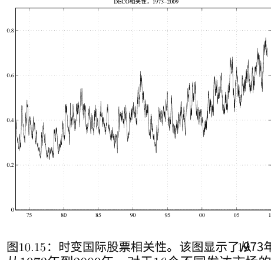

## 图10.15：时变国际股票相关性

该图显示了从1973年到2009年对16个不同发达市场的总体股票指数回报由DECO模型估计得到的等相关性。从1973年到2009年，对于16个不同发达市场的总体股票指数回报，DECO模型估计得到的等相关性如下。

-   更新规则自然地由标准化回报的平均条件相关性给出，

$$ u_t = \frac{2 \sum_{i=1}^{N} \sum_{j>i}^{N} e_{i,t} e_{j,t}}{N \sum_{i=1}^{N} e_{i,t}^2} $$

-   需要估计的三个参数，$\omega_{\rho}$，$\alpha_{\rho}$ 和 $\beta_{\rho}$。

## DECO示例

## 因子结构

$$ R_t = \lambda F_t + \nu_t $$

其中

$$ F_t = \Omega_{F_t}^{1/2} Z_t $$

$$ Z_t \sim i.i.d.(0, \mathcal{I}) $$

$$ \nu_t \sim i.i.d.(0, \Omega_{\nu}) $$

$$ \Longrightarrow \Omega_t = \lambda \Omega_{F_t} \lambda' + \Omega_{\nu_t} $$

单因素情况下，所有变量正交

$$ R_t = \lambda f_t + \nu_t $$

其中

$$ f_t = \sigma_{ft} z_t $$
$$ z_t \sim i.i.d.(0, 1) $$
$$ \nu_t \sim i.i.d.(0, \sigma_{\nu}^2) $$
$$ \Rightarrow \Omega_t = \sigma_{ft}^2 \lambda \lambda' + \Omega_{\nu} $$
$$ \sigma_{it}^2 = \sigma_{ft}^2 \lambda_i^2 + \sigma_{\nu i}^2 $$
$$ \sigma_{ijt}^2 = \sigma_{ft}^2 \lambda_i \lambda_j $$

## 严格建模IV

## 来自高频数据的条件资产水平（多元）波动动力学

## 实现协方差

$$ dP(t) = M(t) dt + \Omega(t)^{1/2} dW(t) $$
$$ RCov_t(\Delta) \equiv \sum_{j=1}^{N(\Delta)} R_{t-1+j\Delta, \Delta} R'_{t-1+j\Delta, \Delta} $$
$$ RCov_t(\Delta) \rightarrow ICov_t = \int_{t-1}^{t} \Omega(\tau) d\tau $$

-   p.d. 只要 N(\Delta) > N; 否则使用正则化方法
-   异步交易和Epps效应
    -   Epps效应会使协方差估计偏低
    -   通过降低采样频率以适应最少交易的资产，可以克服Epps问题，但这会浪费数据
    -   相反的极端情况：使用适当的采样计算每个成对实现协方差矩阵；然后组装和正则化正则化（收缩）

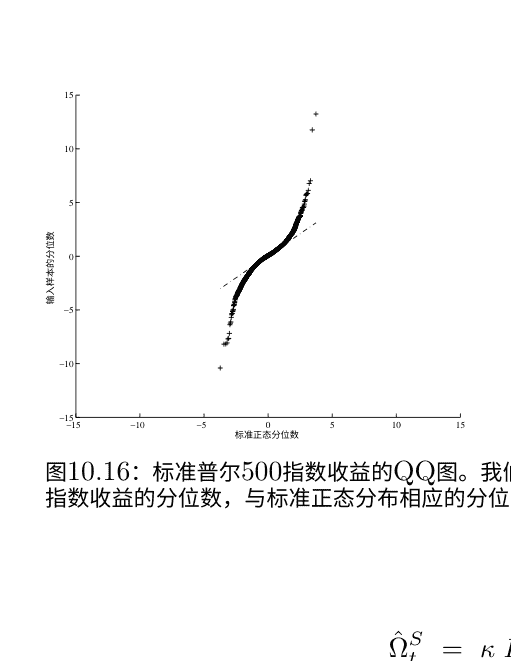

我们展示了1990年1月2日至2010年12月31日的每日标准普尔500指数收益的分位数，与标准正态分布相应的分位数进行比较。

$$ \hat{\Omega}^S_t = \kappa RCov_t(\Delta) + (1 - \kappa) \Upsilon_t $$

-   $\Upsilon_t$ 是正定的，$0 < \kappa < 1$
-   $\Upsilon_t = I$ (天真基准)
-   $\Upsilon_t = \Omega$ (无条件协方差矩阵)
-   $\Upsilon_t = \sigma_f^2 \lambda \lambda' + \Omega_\nu$ (单因素市场模型)

多元GARCH-RV

```
vech(\Omega_t) = vech(C) + B vech(\Omega_{t-1}) + A vech(\hat{\Omega}_{t-1})
```

-   1步骤的罚款
-   多步骤需要通过RV方程“关闭系统”
-   Noureldin et al. (2011), 多元HEAVY

## 严格建模 V

## 分布

建模整个回报分布：
回报不是无条件高斯分布

建模整个回报分布：
回报通常不是条件高斯分布

建模整个回报分布：问题
-   高斯QQ图有效地显示不同水平的高斯VaR的校准
-   高斯无条件VaR很糟糕
-   高斯条件VaR稍微好一些，但左尾仍然糟糕

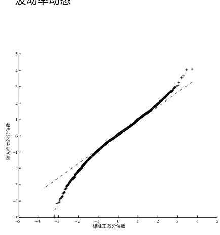

## 图10.17: 标准化NGARCH波动率的S&P500回报的QQ图

我们展示标准化后的每日S&P500收益的分位数，由NGARCH模型的动态波动率与标准正态分布的相应分位数进行比较。样本期为1990年1月2日至2010年12月31日。每个轴上的单位是标准差。

-   高斯条件预期损失，在左尾部进行积分，将会很糟糕。
-   因此，我们希望对诸如 $VaR_{T+1|T}^{p}$ 这样的事物进行更准确的评估，而不是在高斯假设下获得的评估。
    -   为了所有 $p \in [0,1]$ 的值进行这样的操作，需要估计整个条件收益分布。
    -   更一般地说，最佳实践的风险测量是关于跟踪整个条件收益分布。

## 基于观测驱动的密度预测

使用 $r = \sigma \epsilon$ 和 GARCH 假设：

$$ r_{T+1} = \sigma_{T+1|T} \epsilon_{T+1} $$
$$ \epsilon_{T+1} \sim iid(0, 1) $$

将 $\epsilon_{T+1}$ 的抽样乘以 $\sigma_{T+1/T}$(从GARCH模型中固定抽样得到)来建立 $r_{T+1}$ 的条件密度。

-   从标准正态分布中模拟得到 $\epsilon_{T+1}$
-   从标准t分布中模拟得到 $\epsilon_{T+1}$
-   从核密度估计拟合中模拟得到 $\epsilon_{T+1}$  $\frac{r_{T+1}}{\sigma_{T+1|T}}$
-   从任何可模拟的密度中模拟得到 $\epsilon_{T+1}$图10.18: 标准化后的实现波动率的S&P500收益的QQ图。我们展示每日S&P500收益经过 Avg RV 标准化后与标准正态分布相应分位数的对比。样本期间为1990年1月2日至2010年1月31日。每个轴上的单位为标准差。

## 参数驱动的密度预测

使用 $r = \sigma \varepsilon$ 和 SV

假设：

$$
r_{T+1} = \sigma_{T+1} \varepsilon_{T+1}
$$

$$
\varepsilon_{T+1} \sim iid(0,1)
$$

将 $\varepsilon_{T+1}$ 的抽样乘以 $\sigma_{T+1}$ 的抽样（来自模拟的SV模型），以建立起 $r_{T+1}$ 的条件密度。

- 再次，从任何被认为相关的密度中模拟 $\varepsilon_{T+1}$

建模整个收益分布：

通过RV标准化的收益近似为高斯分布

一种特殊的参数驱动的密度预测方法

使用 $r = \sigma \varepsilon$ 和 RV

(对数正态分布/正态分布混合)

假设：

$$
r_{T+1} = \sigma_{T+1} \varepsilon_{T+1}
$$

$$
\varepsilon_{T+1} \sim iid(0,1)
$$

## “r = σ ε”方法的缺陷

在条件高斯情况下，我们可以毫不损失地写成：
$$
r_{T+1} = \sigma_{T+1/T} \varepsilon_{T+1}
$$
$$
\varepsilon_{T+1} \sim iid N(0, 1)
$$

但在条件非高斯情况下，写成以下形式可能会有一定的损失：
$$
r_{T+1} = \sigma_{T+1/T} \varepsilon_{T+1}
$$
$$
\varepsilon_{T+1} \sim iid(0, 1),
$$
因为除了 $\sigma_{T+1/T}$ 之外，条件矩可能存在时间变化，并且使用 $\varepsilon_{T+1} \sim iid(0,1)$ 假设除去了

## 多元回报分布

- 如果可靠的实现协方差可用，可以进行多元模拟之前的对数正态/正态混合模型。但迄今为止，文献主要集中在“每日”数据的条件分布上。

## 回报版本：

$$Z_t = \Omega_t^{-1/2} R_t, \quad Z_t \sim i.i.d., \quad E_{t-1}(Z_t) = 0 \quad Var_{t-1}(Z_t) = \mathcal{I}$$

## 标准化收益版本（如DCC中）：

$$e_t = D_t^{-1} R_t, \quad E_{t-1}(e_t) = 0, \quad Var_{t-1}(e_t) = \Gamma_t$$
其中，$D_t$表示每个资产的条件标准差的对角矩阵，$\Gamma_t$指的是可能时变的条件相关矩阵。

## 主要示例

### 多元正态分布：

$$f(e_t) = C(\Gamma_t) \exp \left( -\frac{1}{2} e_t' \Gamma_t^{-1} e_t \right)$$

### 多元 t：

$$f(e_t) = C(d, \Gamma_t) \left( 1 + \frac{e_t' \Gamma_t^{-1} e_t}{(d-2)} \right)^{-(d+N)/2}$$

### 多元非对称 $t$:

$$ f(e_t) = \frac{C\left(d, \hat{\Gamma}_t\right) K_{\frac{d+N}{2}}\left(\sqrt{\left(d+(e_t-\hat{\mu})' \hat{\Gamma}_t^{-1}\left(e_t-\hat{\mu}\right)\right) \xi' \hat{\Gamma}_t^{-1} \xi}\right) \exp \left((e_t-\hat{\mu})' \hat{\Gamma}_t^{-1} \xi\right)}{\left(1+\frac{(e_t-\hat{\mu})' \hat{\Gamma}_t^{-1}\left(e_t-\hat{\mu}\right)}{d}\right)^{\frac{(d+N)}{2}}\left(\sqrt{\left(d+(e_t-\hat{\mu})' \hat{\Gamma}_t^{-1}\left(e_t-\hat{\mu}\right)\right) \xi' \hat{\Gamma}_t^{-1} \xi}\right)^{\frac{(d+N)}{2}}} $$

– 比对称性更灵活 $t$ 但需要同时估计 $N$ 不对称参数 si-与其他参数，这在高维度中是具有挑战性的。

Copula方法有时提供了一种更简单的两步方法。

## Copula方法

### Sklar定理：

$$ F(e) = G(F_1(e_1), ..., F_N(e_N)) \equiv G(u_1, ..., u_N) \equiv G(u) $$

$$ f(e) = \frac{\partial^N G(F_1(e_1), ..., F_N(e_N))}{\partial e_1...\partial e_N} = g(u) \times \prod_{i=1}^N f_i(e_i) $$

$$ \Longrightarrow \quad \log L = \sum_{t=1}^T \log g(u_t) + \sum_{t=1}^T \sum_{i=1}^N \log f_i(e_{i,t}) $$

### 标准Copulas

#### 正态分布：

$$ g(u_t; \Gamma_t^*) = |\Gamma_t^*|^{-\frac{1}{2}} \exp \left\{ -\frac{1}{2} \Phi^{-1}(u_t)' (\Gamma_t^{*-1} - I) \Phi^{-1}(u_t) \right\} $$

其中 $\Phi^{-1}(u_t)$ 指的是标准逆单变量正态分布的 $N \times 1$ 向量，相关矩阵 $\Gamma_t^*$ 涉及到典型元素为 $N \times 1$ 向量 $e_t^*$，

$$ e_{i,t}^* = \Phi^{-1}(u_{i,t}) = \Phi^{-1}(F_i(e_{i,t})). $$

通常不允许尾事件之间存在足够的依赖关系。

- t copula
- 非对称 t copula

非对称尾相关性

### 多元分布模拟（一般情况）

使用以下方法进行模拟：

$$ R_t = \hat{\Omega}_t^{1/2} Z_t $$
$$ Z_t \sim i.i.d.(0, \mathcal{I}) $$

- $Z_t$ 可以从参数化（高斯，t，...）或非参数化拟合中绘制

图10.19：十六个发达股票市场的平均阈值相关性。该实线显示了16个发达股票市场的GARCH残差的平均经验阈值相关性。虚线显示了由多元标准正态分布与恒定相关性所暗示的阈值相关性。带有方形标记的线显示了从16个股票市场的GARCH残差估计的DECO模型的阈值相关性。该图基于1973年至2009年的周收益率。

### 多元分布模拟（因子情况）

使用以下方式进行模拟：

$$ F_t = \hat{\Omega}^{1/2}_{F,t} Z_{F,t} $$

$$ R_t = \hat{\lambda} F_t + \nu_t $$

- $Z_{F,t}$ 和 $\nu_t$ 可以从参数拟合的分布或非参数拟合的分布中抽取，或者从经验分布中有放回地抽取。

## 严格建模 VI

### 风险、回报和宏观经济基本面

我们想要理解金融/实际连接

统计学与“科学”模型

回报 ↔ 基本面

r ↔ f

断开连接？

“过度波动”，“断开连接”，“难题”，...

μ_r, σ_r, σ_f, μ_f

连接是复杂的：

μ_r ↔ σ_r ↔ σ_f ↔ μ_f

波动性作为中介？

例如...

| | 平均衰退波动性增加 | 标准误差 | 样本周期 |
| :--- | :--- | :--- | :--- |
| 总体回报 | 43.5% | 3.8% | 63Q1-09Q3 |
| 公司层面回报 | 28.6% | 6.7% | 69Q1-09Q2 |

表10.1: 经济衰退期间的股票回报波动率。总体股票回报波动率是基于每日回报数据的季度实现标准差。公司层面的股票回报波动率是季度回报的横截面四分位数范围。

| | 平均衰退波动性增加 | 标准误差 | 样本周期 |
| :--- | :--- | :--- | :--- |
| 总体增长 | 37.5% | 7.3% | 62Q1-09Q2 |
| 公司层面增长 | 23.1% | 3.5% | 67Q1-08Q3 |

表10.2: 经济衰退期间的实际增长波动率。总体实际增长波动率是季度条件标准差。公司层面的实际增长波动率是季度实际销售增长的横截面四分位数范围。

GARCH $\sigma_r$ 通常没有 $\mu_f$ 或 $\sigma_f$：

$$\sigma_{r,t}^2 = \omega + \alpha r_{t-1}^2 + \beta \sigma_{r,t-1}^2.$$

$$\sigma_{r,t}^2 = \omega + \alpha r_{t-1}^2 + \beta \sigma_{r,t-1}^2 + \delta_1 \mu_{f,t-1} + \delta \sigma_{f,t-1}。$$

$\mu_f \leftrightarrow \sigma_r$ 经济衰退时的回报波动性较高 Schwert (1989年) 的“失败”：很难将市场风险与预期基本面（杠杆、公司盈利能力等）联系起来。实际上是一个巨大的成功：

经济衰退中回报波动性显著较高的关键观察！

- 早期：Officer (1973年)
- 后来：Hamilton和Lin (1996年)，Bloom等人 (2009年)

通过Merton模型扩展到信用利差的商业周期效应 $\mu_f \leftrightarrow \sigma_r$，续 Bloom等人 (2009年) 的结果 $\mu_f \leftrightarrow \sigma_f$ 在经济衰退期间，基本波动性更高 更多的布鲁姆、弗洛托托和贾莫维奇 (2009) 的结果 $\sigma_f \leftrightarrow \sigma_r$ 回报波动与基本波动呈正相关 这一点可以从已有的关系中立即得出 此外，直接探索提供了直接证据： - Engle等人 (2006) 的时间序列

- Diebold和Yilmaz (2010) 的横截面
- Engle和Rangel (2008) 的面板
可以扩展到相关性的基本决定因素 (Engle和Rangle, 2011)
[附注：通货膨胀及其基本面 (美国时间序列) ]

通货膨胀/货币增长的联系较弱

[通货膨胀及其基本面 (巴罗的横截面) ]

通货膨胀/货币增长的联系较强

回到 σ_f ↔ σ_r：横截面证据

现在考虑涉及股票溢价的关系
?? μ_r ??
μ_r ↔ σ_r

“风险-回报权衡”（或其缺乏）
至少从马科维茨开始研究

ARCH-M特征：

$$
R_t = \beta_0 + \beta_1 X_t + \beta_2 \sigma_t + \varepsilon_t
$$

$$
\sigma_t^2 = \omega + \alpha r_{t-1}^2 + \beta \sigma_{t-1}^2
$$

– 但是细微之处出现了...
μ_r ↔ μ_f

奇怪的法玛-法国（1989年）：

$$
r_{t+1} = \beta_0 + \beta_1 dp_t + \beta_2 term_t + \beta_3 def_t + \epsilon_{t+1}
$$

不那么奇怪的莱托-卢德维格森（2001年）：

$$
r_{t+1} = \beta_0 + \beta_1 dp_t + \beta_2 term_t + \beta_3 def_t + \beta_4 cay_t + \epsilon_{t+1}
$$

自然坎贝尔-迪博尔德（2009）：

$$
r_{t+1} = \beta_0 + \beta_1 dp_t + \beta_2 term_t + \beta_3 def_t + \beta_4 cay_t + \beta_5 g_t^e + \epsilon_{t+1}
$$

- 同样的戈茨曼等人（2009）平行横截面分析

- 预期的商业环境非常重要！

μ_r ↔ σ_f

班萨尔和亚伦（2004）

（以及最近的许多其他人）

| | (1) | (2) | (3) | (4) | (5) | (6) | (7) |
|---|---|---|---|---|---|---|---|
| $g_{t}^{e}$ | -0.22 (0.08) | -- | -- | -0.21 (0.09) | -0.20 (0.09) | -- | -0.20 (0.10) |
| $DP_{t}$ | -- | -- | 0.25 (0.10) | 0.17 (0.10) | -- | 0.19 (0.12) | 0.12 (0.11) |
| $DEF_{t}$ | -- | -- | -0.11 (0.07) | -0.01 (0.09) | -- | -0.10 (0.08) | 0.00 (0.09) |
| $TERM_{t}$ | -- | -- | 0.15 (0.07) | 0.17 (0.07) | -- | 0.09 (0.09) | 0.11 (0.09) |
| $CAY_{t}$ | -- | 0.24 (0.07) | -- | -- | 0.22 (0.08) | 0.17 (0.11) | 0.15 (0.10) |

所以，好消息是：

我们越来越多地了解到这些联系

- 自从马科维茨以来，我们已经走了很长的路：

$\mu_{r} \leftrightarrow \sigma_{r}$

### 关键教训

商业周期对于 $\mu_{r}$ 和 $\sigma_{r}$ 都非常重要

强调高频率商业周期监测的重要性。 我们需要与费城联邦储备银行的Aruoba-Diebold-Scotti实时框架等高频率实际活动和高频率金融市场活动进行互动结论

- 可靠的风险测量需要允许时间变化的条件模型。
- 可以使用单变量波动率模型进行风险测量。 许多重要的最新发展。
- 高频率回报数据包含丰富的波动率信息。
- 其他任务需要多变量模型。 许多重要的最新发展，特别是对于 $N$ 大的情况。 因子结构通常很有用。
- 商业周期成为驱动风险的关键宏观经济基本因素。
- 高频率宏观监测的新发展提供了与高频率金融市场数据相匹配的高频率实际活动数据。

*****************************

## 非负变量模型（来自Minchul）

介绍动机：为什么我们需要针对正值的动态模型？

- 波动性：时变条件方差
- 持续时间：交易间隔，失业期
- 计数：美国公司的违约情况

### 自回归伽玛过程（ARG）

- Gourieroux和Jasiak（2006）
- Monfort, Pegoraro, Renne和Roussellet（2014）

### 替代模型

- Engle和Russell（1998）的自回归条件持续时间（ACD）
- 通过动态条件得分模型进行扩展
    - Harvey（2013）
    - Creal, Koopman和Lucas（2013）

### 自回归伽玛过程

自回归伽玛过程（ARG）的定义定义：$Y_t$如果遵循自回归伽玛过程

$Y_t$在给定$Y_{t-1}$的条件下，遵循非中心伽玛分布，其

- 自由度参数：$\delta$
- 非中心参数：$\beta Y_{t-1}$
- 尺度参数：$c$

非常奇特...但我们可以猜测

- 伽玛分布 $-t$ 可能取正值
- 通过非中心参数的条件动力学

ARG过程：状态空间表示 如果 $Y_t$遵循ARG， 则

测量：

$$Y_t | Z_t \sim \text{伽玛分布}(\delta + Z_t, c)$$

过渡：

$$Z_t | Y_{t-1} \sim \text{泊松分布}(\beta Y_{t-1})$$

- $Y_t$取正实数
- $Z_t$取正整数
- 通过 $Z_t$的动力学

### 条件矩测量：

$$Y_t \mid Z_t \sim \text{伽玛分布}(\delta + Z_t, c)$$

### 过渡：

$$Z_t \mid Y_{t-1} \sim \text{泊松分布}(\beta Y_{t-1})$$

### 条件矩：

$$E(Y_t\mid Y_{t-1}) = \rho Y_{t-1} + c\delta$$

$$V(Y_t\mid Y_{t-1}) = 2\rho c Y_{t-1} + c^2\delta$$

$$Corr(Y_t, Y_{t-h}) = \rho^h$$

其中 $\rho = \beta c > 0$.

当$\rho < 1$ 时，该过程是平稳的。

条件过离散性存在的充分必要条件是

$$V(Y_t\mid Y_{t-1}) > E(Y_t\mid Y_{t-1})^2$$

### 当$\delta < 1$ 时，

- 平稳的ARG过程具有边际过离散性。
- 该过程可能具有条件欠离散性或过离散性，取决于 $Y_{t-1}$的值。

备注：ACD (自回归条件持续时间) 模型假设路径无关的过离散性。

ARG(1)的连续时间极限是CIR过程的离散化版本。

$$dY_t = a(b - Y_t)dt + \sigma \sqrt{Y_t} dW_t$$

其中

$$a = -\log \rho$$

$$b = \frac{c\delta}{1-\rho}$$

$$\sigma^2 = \frac{-2\log \rho}{1-\rho} c$$

- 这个过程几乎肯定是非负的。
- 最初用于利率模型。
- 也用于波动性动态。

图10.20：模拟数据，ρ = 0.5

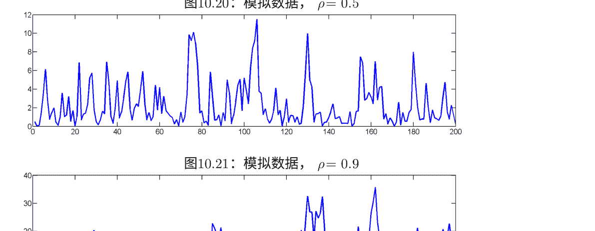

图10.21：模拟数据，ρ = 0.9

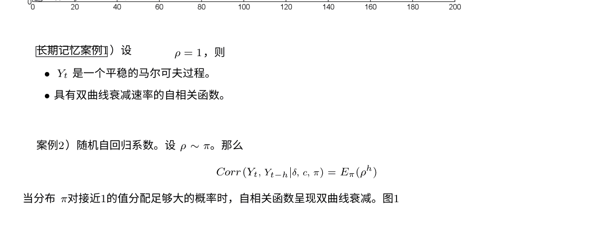

[长期记忆案例]）设 ρ = 1，则

- Yt 是一个平稳的马尔可夫过程。
- 具有双曲线衰减速率的自相关函数。

案例2）随机自回归系数。设 ρ ∼ π。那么

Corr(Y_t, Y_{t-h} | δ, c, π) = E_π(ρ^h)

当分布 π 对接近1的值分配足够大的概率时，自相关函数呈现双曲线衰减。图1应用于原始论文

测量：

Y_t | Z_t ∼ Gamma(δ + Z_t, c)

过渡：

Z_t | Y_{t-1} ∼ Poisson(β Y_{t-1})

- Yt：多伦多证券交易所在1998年10月交易的戴顿矿业股票的报价间隔。
- 基于QMLE的估计

扩展Creal（2013）考虑以下非线性状态空间

# 测量

$$y_t \sim p(y_t|h_t, x_t; \theta)$$

其中 $x_t$ 是外生回归变量。

# 转换

$$h_t \sim Gamma(\delta + z_t, c)$$

$$z_t \sim Poisson (\rho h_{t-1})$$

- 当 $y_t = h_t$ 时，该过程变为ARG。
- 各种应用都符合这种形式。

# 示例1：随机波动模型测量

$$y_t = \mu + x_t\beta + \sqrt{h_t} e_t, \quad e_t \sim N(0, 1)$$

# 转换

$$h_t \sim Gamma(\delta + z_t, c)$$

$$z_t \sim Poisson (\rho h_{t-1})$$

# 示例2：随机持续时间和强度模型测量

$$y_t \sim Gamma(\alpha, \ h_t \exp(x_t\beta))$$

# 转换

$$h_t \sim Gamma(\delta + z_t, c)$$

$$z_t \sim Poisson(\rho h_{t-1})$$

# 例子3：随机计数模型测量

$$y_t \sim Poisson(h_t \exp(x_t\beta))$$

# 转换

$$h_t \sim Gamma(\delta + z_t, c)$$

$$z_t \sim Poisson (\rho h_{t-1})$$

最近的扩展：ARG-zero过程1 Monfort, Pegoraro, Renne, Roussellet (2014) 扩展ARG过程以考虑零下界周期。

最近的扩展：ARG-zero过程2 Monfort, Pegoraro, Renne, Roussellet (2014) 扩展ARG过程以考虑零下界周期。

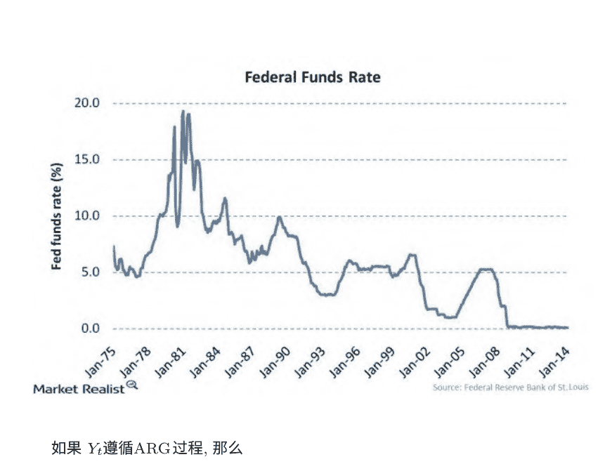

如果 $Y_t$ 遵循ARG过程，那么
$$Y_t | Z_t \sim Gamma(\delta + Z_t, c)$$
$$Z_t | Y_{t-1} \sim Poisson(\beta Y_{t-1})$$

如果 $Y_t$ 遵循ARG-zero过程，那么
$$Y_t | Z_t \sim Gamma(Z_t, c)$$
$$Z_t | Y_{t-1} \sim Poisson(\alpha + \beta Y_{t-1})$$

两个修改

- $\delta = 0$: 当 $\delta \to 0$时，$Gamma(\delta, c)$ 收敛到狄拉克函数。
- $\alpha$ 与逃离零下限的概率有关。

特征ARG-zero的概率密度为
$$p(Y_t|Y_{t-1}; \alpha, \beta, c) = \sum_{z=1}^{\infty} g(Y_t, Y_{t-1}, \alpha, \beta, c, z)1_{\{Y_t > 0\}} + \exp(-\alpha - \beta Y_{t-1})1_{\{Y_t = 0\}}$$

- 第二项是 $\delta \to 0$ 的结果。
- 如果 $\alpha = 0$，$Y_t = 0$ 成为吸收状态。

条件矩
$$E[Y_t|Y_{t-1}] = \alpha c + \rho Y_{t-1}$$
和
$$V(Y_t|Y_{t-1}) = 2c^2 \alpha + 2c\rho Y_{t-1}$$
其中 $\rho = \beta c$。
图: ARG-zero

ACD和DCS

# 图10.22：模拟数据

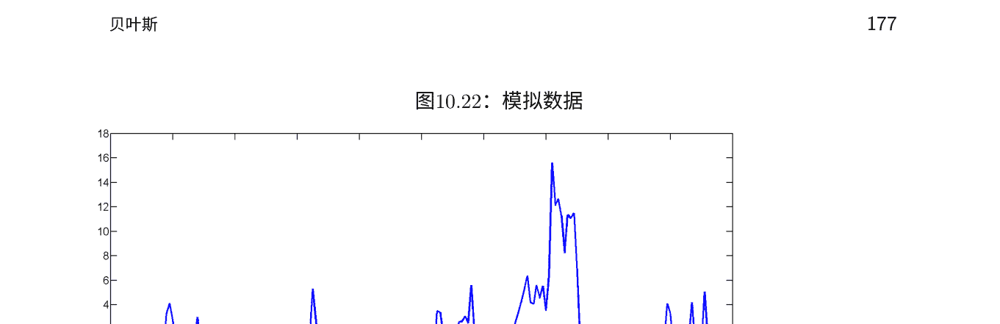

自回归条件持续时间模型（ACD） \( Y_t \) 如果遵循自回归条件持续时间模型，则

$$
y_t = \mu_t e_t, \quad E[e_t] = 1
$$
$$
\mu_t = w + \alpha \mu_{t-1} + \beta y_{t-1}
$$

- 由于其乘法形式，它被归类为乘法误差模型（MEM）。
- 条件矩
  - \( E[y_t|y_{1:t-1}] = \mu_t \)
  - \( V(y_t|y_{1:t-1}) = k_0 \mu_t^2 \)
- 条件过离散是路径无关的
  - \( \frac{V(y_t|y_{1:t-1})}{E[y_t|y_{1:t-1}]^2} = k_0 \)

回想一下，ARG过程可能具有路径相关的过离散性。

动态条件得分（DCS）模型动态条件得分模型（或广义自回归得分模型）是一类观测驱动模型。

- 观测驱动模型是一个时间变化的参数模型，其中时间变化的参数是一个可观测历史的函数。例如，GARCH，ACD，...
- DCS（GAS）模型包括GARCH，ACD和其他观测驱动模型。

这个想法非常简单和实用

- 给我一个条件似然和时变参数，我会给你一个时变参数的运动规律。
- 方便而通用的建模策略。 我将在模型的MEM类中进行描述。

DCS示例：ACD 1回顾

$$
y_t = \mu_t e_t, \quad E[e_t] = 1
$$
$$
\mu_t = w + \alpha \mu_{t-1} + \beta y_{t-1}
$$

相反，我们应用DCS原则：“给我条件似然和时变参数，然后我会给你一个运动规律”

$$
y_t = \mu_t e_t, \quad e_t \sim \text{Gamma}(\kappa, 1/\kappa)
$$

DCS示例: ACD 2

$$
y_t = \mu_t e_t, \quad e_t \sim \text{Gamma}(\kappa, 1/\kappa)
$$

然后DCS规定了 $\mu_t$ 的运动规律如下：

$$
\mu_t = w + \alpha \mu_{t-1} + \beta s_{t-1}
$$

其中 $(w, \alpha, \beta)$ 是额外的参数，$s_t$ 是一个缩放得分，

$$
s_t = E_{t-1} \left[ \frac{\partial \log p(y_t | \mu_t, y_{1:t}; \kappa)}{\partial \mu_t} \frac{\partial \log p(y_t | \mu_t, y_{1:t}; \kappa)}{\partial \mu_t}' \right]^{-1} \frac{\partial \log p(y_t | \mu_t, y_{1:t}; \kappa)}{\partial \mu_t}
$$

在这种情况下，它碰巧是

$$
\mu_t = w + \alpha \mu_{t-1} + \beta y_{t-1}
$$

这是ACD。

然而，不同的分布选择将导致不同的运动规律——广义伽玛分布、对数-对数分布、伯尔分布、帕累托分布和许多其他分布。

# 10.5 练习、问题和补充

# 10.6 注释

# 第十一章

# 非线性非高斯状态空间和最优滤波

# 11.1 非线性非高斯模型的种类

# 11.2 马尔可夫链拯救（再次）：粒子滤波器

# 11.3 用于估计的粒子滤波：杜塞定理

# 11.4 关键应用I：随机波动性（再讨论）

# 11.5 关键应用II：信用风险和违约期权

# 11.6 关键应用III：动态随机一般均衡（DSGE）宏观经济模型

# 11.7 部分“解决方案”：扩展卡尔曼滤波器

熟悉的线性/高斯状态空间

$$
\begin{aligned}
\alpha_t &= T\alpha_{t-1} + R\eta_t \\
y_t &= Z\alpha_t + \varepsilon_t
\end{aligned}
$$

$$
\eta_t \sim N(0, Q), \varepsilon_t \sim N(0, H)
$$

线性/非高斯

$$
\begin{aligned}
\alpha_t &= T\alpha_{t-1} + R\eta_t \\
y_t &= Z\alpha_t + \varepsilon_t
\end{aligned}
$$

$$
\eta_t \sim D^{\eta}, \varepsilon_t \sim D^{\varepsilon}
$$

# 非线性/高斯

$$
\alpha_t = Q(\alpha_{t-1}, \eta_t)
$$

$$
y_t = G(\alpha_t, \varepsilon_t)
$$

$$
\eta_t \sim N(0, Q), \varepsilon_t \sim N(0, H)
$$

# 非线性/高斯 II

（具有时变系统矩阵的线性/高斯模型）

$$
\alpha_t = T_t \alpha_{t-1} + R_t \eta_t
$$

$$
y_t = Z_t \alpha_t + \varepsilon_t
$$

$$
\eta_t \sim N^{\eta}, \quad \varepsilon_t \sim N^{\varepsilon}
$$

# “条件高斯”
怀特定理
非线性/非高斯

$$
\alpha_t = Q(\alpha_{t-1}, \eta_t)
$$

$$
y_t = G(\alpha_t, \varepsilon_t)
$$

$$
\eta_t \sim D^{\eta}, \quad \varepsilon_t \sim D^{\varepsilon}
$$

（DSGE宏观经济模型采用这种形式）

# 非线性/非高斯，专业化

$$
\alpha_t = Q(\alpha_{t-1}) + \eta_t
$$

$$
y_t = G(\alpha_t) + \varepsilon_t
$$

# 非线性/非高斯，广义化

$$\eta_t \sim D^\eta, \quad \varepsilon_t \sim D^\varepsilon$$

$$\alpha_t = Q_t(\alpha_{t-1}, \eta_t)$$
$$y_t = G_t(\alpha_t, \varepsilon_t)$$

$$\eta_t \sim D_t^\eta, \quad \varepsilon_t \sim D_t^\varepsilon$$

# 信用风险模型（非线性/非高斯）

公司资产价值 $V_t$:
$$V_t = \mu V_{t-1}\eta_t', \quad \eta_t' \sim \text{对数正态分布}$$

公司发行债务 $D$: 零息债券，到期日为 $T$，支付 $D$

公司股权价值 $S_t$:
$$S_t = \max(V_t - D, 0)$$

从 $S_t$ 的看涨期权结构，可以得到Black-Scholes公式:
$$S_t = BS(V_t)\varepsilon_t'$$
$\varepsilon_t' \sim \text{对数正态分布}$
($\varepsilon_t'$ 捕捉到BS错误规范等)

# 信用风险模型（非线性/高斯形式）

取对数使其成为高斯分布，但本质上是非线性的:
$$\ln V_t = \ln \mu + V_{t-1} + \eta_t$$
$$\ln S_t = \ln BS(V_t) + \varepsilon_t$$
$\eta_t \sim N, \varepsilon_t \sim N$

# 制度转换模型（非线性/高斯）

$$\begin{pmatrix} \alpha_{1t} \\ \alpha_{2t} \end{pmatrix} = \begin{pmatrix} \phi & 0 \\ 0 & \gamma \end{pmatrix} \begin{pmatrix} \alpha_{1,t-1} \\ \alpha_{2,t-1} \end{pmatrix} + \begin{pmatrix} \eta_{1t} \\ \eta_{2t} \end{pmatrix}$$

$$y_t = \mu_0 + \delta I(\alpha_{2t} > 0) + (1, 0) \begin{pmatrix} \alpha_{1t} \\ \alpha_{2t} \end{pmatrix}$$

$$\eta_{1t} \sim N^{\eta_1} \quad \eta_{2t} \sim N^{\eta_2} \quad \eta_{1t} \perp \eta_{2t}$$

# 扩展到:

- 更丰富的 $\alpha_1$ 动态 (影响观察到的 $y$)
- 更丰富的 $\alpha_2$ 动态 (影响潜在制度)
- 更丰富的 $\eta_t$ 分布 (例如，$\eta_{2t}$ 不对称)
- 多于两个状态
- 在动态参数、波动性等方面也进行切换

# 多元随机波动模型（非线性/高斯形式）

$$
\begin{aligned}
h_t &= \omega + \beta h_{t-1} + \eta_t \quad (\text{转换}) \\
r_t &= \sqrt{e^{h_t}} \varepsilon_t \quad (\text{测量}) \\
\eta_t &\sim N(0, \sigma_\eta^2), \quad \varepsilon_t \sim N(0,1)
\end{aligned}
$$

# 随机波动模型（线性/非高斯形式）

$$
\begin{aligned}
h_t &= \omega + \beta h_{t-1} + \eta_t \quad (\text{转换}) \\
2\ln|r_t| &= h_t + 2\ln|\varepsilon_t| \quad (\text{测量}) \\
\eta_t &\sim N(0, \sigma_\eta^2), \quad u_t \sim D^u
\end{aligned}
$$

或

$$
\begin{aligned}
h_t &= \omega + \beta h_{t-1} + \eta_t \\
y_t &= h_t + u_t \\
\eta_t &\sim N(0, \sigma_\eta^2), \quad u_t \sim D^u
\end{aligned}
$$

- 一个“信号加（非高斯）噪声”成分模型用于波动性实现和积分波动性

$$
\begin{aligned}
IV_t &= \phi IV_{t-1} + \eta_t \\
RV_t &= IV_t + \varepsilon_t
\end{aligned}
$$

ε表示RV基于不无限采样频率的事实。微观结构噪声模型

**Hasbrouck（非线性/非高斯）**

卡尔曼滤波的分布陈述***

具有因子结构的多元随机波动***

解决一般过滤问题的方法Kitagawa（1987），数值积分（线性/非高斯）最近，蒙特卡洛积分扩展卡尔曼滤波器（非线性/高斯）

$$
\begin{aligned}
\alpha_t &= Q(\alpha_{t-1}, \eta_t) \\
y_t &= G(\alpha_t, \varepsilon_t) \\
\eta_t &\sim N, \quad \varepsilon_t \sim N
\end{aligned}
$$

对以下进行一阶泰勒展开：Q在a_{t-1}，G在a_{t,t-1}周围；在近似系统上使用卡尔曼滤波器；无香卡尔曼滤波器（非线性/高斯）；SSM的贝叶斯分析：Carlin-Polson-Stoffer 1992 JASA；“单次移动”吉布斯采样器（吉布斯迭代的许多部分：参数向量，然后是状态向量的每个观测值，逐期）；多次移动的吉布斯采样器可以处理非高斯分布（通过正态分布的混合），但不能处理非线性问题。单次移动的吉布斯采样器可以处理非线性和非高斯分布。

将 $S(\hat{\theta}_{ML})$ 在 $\theta$ 周围展开得到：
$S(\hat{\theta}_{ML}) \approx S(\theta) + S'(\theta)(\hat{\theta}_{ML} - \theta) = S(\theta) + H(\theta)(\hat{\theta}_{ML} - \theta)$。
注意到 $S(\hat{\theta}_{ML}) \equiv 0$ 并且取期望得到：
$0 \approx S(\theta) - I_{EX,H}(\theta)(\hat{\theta}_{ML} - \theta)$
或者
$(\hat{\theta}_{ML} - \theta) \approx I_{EX,H}^{-1}(\theta)$。
使用 $S(\theta) \cong N(0, I_{EX,H}(\theta))$ 可以推导出：
$(\hat{\theta}_{ML} - \theta) \cong N(0, I_{EX,H}^{-1}(\theta))$
或
***

# 情况3 $\beta$ 和 $\sigma^2$

联合先验分布 $g(\beta, \frac{1}{\sigma^2}) = g(\beta / \frac{1}{\sigma^2}) g(\frac{1}{\sigma^2})$
其中 $\beta / \frac{1}{\sigma^2} \sim N(\beta_0, \Sigma_0)$ 且 $\frac{1}{\sigma^2} \sim G(\frac{\nu_0}{2}, \frac{\delta_0}{2})$
请证明联合后验分布为：
$p(\beta, \frac{1}{\sigma^2} / y) = g(\beta, \frac{1}{\sigma^2}) L(\beta, \frac{1}{\sigma^2} / y)$
可以分解为 $p(\beta / \frac{1}{\sigma^2}, y) p(\frac{1}{\sigma^2} / y)$
其中 $\beta / \frac{1}{\sigma^2}, y \sim N(\beta_1, \Sigma_1)$
和 $\frac{1}{\sigma^2} / y \sim G(\frac{\nu_1}{2}, \frac{\delta_1}{2})$,
并推导出 $\beta_1, \Sigma_1, \nu_1, \delta_1$ 的表达式，其中 $\beta_0, \Sigma_0, \delta_0, x$ 和 $y$ 为已知。此外，关键边际后验

$P(\beta/y) = \int^{\infty} p(\beta, 1/\sigma^2 / y) d\sigma^2$ 是多元的 $t$。

通过吉布斯抽样实现贝叶斯方法。

# 线性二次商业周期模型

汉森和萨金特

# 线性高斯状态空间系统

# 参数驱动与观测驱动模型

参数驱动：可测量的时变参数与潜在变量相关
观测驱动：可测量的时变参数与可观测变量相关
参数驱动模型在数学上很有吸引力，但很难估计。观测驱动模型在数学上不太吸引人，但易于估计。总的来说，状态空间模型是参数驱动的。
随机波动模型是参数驱动的，而ARCH模型是观测驱动的。

# 制度转换

我们强调了动态线性模型，在实践中非常重要。它们被称为线性模型，因为 $y_t$ 是过去 $y$ 或过去 $\epsilon$ 的简单线性函数。然而，在某些预测情况下，良好的动态统计特征可能需要一些制度转换的概念，即“好”和“坏”状态之间的转换，这是一种非线性模型。

在商业周期分析中，融入制度转换的模型有着悠久的传统，其中扩张是好的状态，而收缩（衰退）是坏的状态。这个想法在大众媒体中也得到了广泛关注，例如在识别和预测经济活动的转折点方面。只有在制度转换的框架内，转折点的概念才具有内在的意义；转折点自然而直接地被定义为区分扩张和收缩的时刻。

# 可观测的制度指标

阈值模型与制度转换的传统完全一致。以下是一个阈值模型，例如，它有三个制度，两个阈值，以及一个调节转换的延迟期：

$$ y_t = \begin{cases} c^{(u)} + \phi^{(u)} y_{t-1} + \varepsilon_t^{(u)}, & \theta^{(u)} < y_{t-d} \\ c^{(m)} + \phi^{(m)} y_{t-1} + \varepsilon_t^{(m)}, & \theta^{(l)} < y_{t-d} < \theta^{(u)} \\ c^{(l)} + \phi^{(l)} y_{t-1} + \varepsilon_t^{(l)}, & \theta^{(l)} > y_{t-d}. \end{cases} $$

上标表示“上限”，“中间”和“下限”制度，并且在任何时间 \( t \) 上运行的制度取决于可观察到的过去历史 \( y_{t-1} \) 特别是 \( y_{t-d} \) 的值。

## 潜在马尔可夫制度

尽管可观察到的阈值模型很有趣，但在许多商业、经济和金融环境中，具有潜在状态而不是观察到的状态的模型可能更合适。在这样的设置中，时间序列动态由一个有限维参数向量控制，该向量在实现两个不可观察状态之一时切换（可能每个时期都切换），状态转换由一阶马尔可夫过程控制。

为了使问题具体化，让我们举一个简单的例子。让 \( \{s_t\}_{t=1}^{T} \) 是一个（潜在的）两状态一阶自回归过程的样本路径，只取值为0或1，转移概率矩阵如下所示

$$ M = \begin{pmatrix} p_{00} & 1-p_{00} \\ 1-p_{11} & p_{11} \end{pmatrix}. $$

矩阵 \( M \) 的第 \( ij \) 个元素给出了从状态 \( i \) （在时间 \( t-1 \) ）到状态 \( j \) （在时间 \( t \) ）的转移概率。请注意，只有两个自由参数，即停留概率 \( p_{00} \) 和 \( p_{11} \)。

设 \( \{y_t\}_{t=1}^{T} \) 为依赖于 \( \{s_t\}_{t=1}^{T} \) 的观测时间序列的样本路径，其条件密度为

$$ f(y_t|s_t; \theta) = \frac{1}{\sqrt{2\pi}\sigma} \exp \left( \frac{-(y_t - \mu_{s_t})^2}{2\sigma^2} \right). $$

因此，\( y_t \) 是具有潜在切换均值的高斯白噪声。围绕 \( y_t \) 移动的两个均值具有特殊的意义，例如可能对应于不同增长率的时期（“繁荣”和“衰退”，“牛市”和“熊市”等）。

## 附录

### 附录A

### 一本有用的书籍“图书馆”

- Ait-Sahalia, Y. 和 Hansen, L.P. eds. (2010), 金融计量经济学手册。阿姆斯特丹：北荷兰。
- Ait-Sahalia, Y. 和 Jacod, J. (2014), 高频金融计量经济学，普林斯顿大学出版社。
- Beran, J., Feng, Y., Ghosh, S. 和 Kulik, R. (2013), 长记忆过程：概率性质和统计方法，斯普林格。
- Box, G.E.P. 和 Jenkins, G.W. (1970), 时间序列分析、预测和控制，普林斯顿大学出版社。
- Davidson, R. 和 MacKinnon, J. (1993), 计量经济学中的估计和推断，牛津大学出版社。
- Diebold, F.X. (1998), 预测要素，南西方。
- Douc, R., Moulines, E. 和 Stoffer, D.S. (2014), 非线性时间序列：理论、方法和应用，带有R示例，查普曼和霍尔。
- Durbin, J. 和 Koopman, S.J. (2001), 状态空间方法的时间序列分析，牛津大学出版社。
- Efron, B. 和 Tibshirani, R.J. (1993), 自助法导论，查普曼和霍尔。
- Elliott, G., Granger, C.W.J. 和 Timmermann, A., 编辑. (2006), 经济预测手册，卷1，北荷兰。
- Elliott, G., Granger, C.W.J. 和 Timmermann, A., 编辑. (2013), 经济预测手册，卷2，北荷兰。
- Engle, R.F. 和 McFadden, D., 编辑. (1995), 计量经济学手册，卷4，北荷兰。
- Geweke, J. (2010), 完整和不完整的计量经济模型，普林斯顿大学出版社。
- Geweke, J., Koop, G. 和 van Dijk, H., 编辑. (2011), 贝叶斯计量经济学牛津手册，牛津大学出版社。
- Granger, C.W.J. 和 Newbold, P. (1977), 预测经济时间序列，学术出版社。
- Granger, C.W.J. 和 Tersvirta, Y. (1996), 建模非线性经济关系，牛津大学出版社。

## 有用的书籍

- Hall, P. (1992), Bootstrap和Edgeworth扩展，斯普林格出版社。
- Hammersley, J.M. 和 Handscomb, D.C. (1964), 蒙特卡洛方法，查普曼和霍尔出版社。
- Hansen, L.P. 和 Sargent, T.J. (2013), 动态线性经济模型，普林斯顿大学出版社。
- Harvey, A.C. (1989), 预测、结构时间序列模型和卡尔曼滤波器，剑桥大学出版社。
- Harvey, A.C. (1993), 时间序列模型，麻省理工学院出版社。
- Harvey, A.C. (2013), 波动性和重尾动态模型，剑桥大学出版社。
- Hastie, T., Tibshirani, R. 和 Friedman, J. (2001), 统计学习的要素：数据挖掘、推断和预测，Springer-Verlag。
- Herbst, E. 和 Schorfheide, F. (2015), DSGE模型的贝叶斯估计，手稿。
- Kim, C.-J. 和 Nelson, C.R. (1999), 具有制度转换的状态空间模型，MIT Press。
- Koop, G. (2004), 贝叶斯计量经济学，John Wiley。
- Nerlove, M., Grether, D.M., Carvalho, J.L. (1979), 经济时间序列分析：综合研究，Academic Press。
- Priestley, M. (1981), 频谱分析和时间序列，Academic Press。
- Silverman, B.W. (1986), 统计与数据分析的密度估计，Chapman and Hall。
- Whittle, P. (1963), 线性最小二乘法的预测和调节，University of Minnesota Press。
- Zellner, A. (1971), 贝叶斯推断在计量经济学中的介绍，约翰·威利和儿子。

## 附录B

## 连续时间过程的要素

### B.1 扩散

Karatzas和Shreve(1991)是一个重要的参考文献。具有有限方差的连续时间白噪声很难定义（为什么？例如，参见Priestley,1980, pp. 156-158）。连续时间随机游走的类比更容易定义，因此它们在连续时间过程的构建中起着更关键的作用。

扩散是具有马尔可夫结构和连续（但非可微分）样本路径的过程。一些重要的特殊情况：

- 标准布朗运动
  $$dx = dW,$$
  其中
  $$W(t) = \int_0^t \varepsilon(u)du$$
  （也就是说，它是一个加法过程）。\( W(t) \) 是离散时间无漂移高斯随机游走的连续时间类比。直观地说，正态性来自于过程的加法性质引起的中心极限考虑。布朗运动的一个关键特性是其独立的高斯增量，
  $$(W(t) - W(s)) \overset{iid}{\sim} N(0, t - s), \forall 0 \leq s \leq t < \infty$$
  布朗运动是基础，因为具有更丰富动态的过程是通过它的位置和尺度变换构建起来的。“W”代表“维纳过程”。标准布朗运动是稍微更一般的维纳过程的最简单的例子。

- 维纳过程。标准布朗运动的平移和缩放。
  $$dx = \alpha\ dt + \sigma\ dW.$$
  图：具有漂移、最佳点和区间预测的高斯随机游走
  维纳过程是离散时间二项树的连续极限。离散期间 \( \Delta t \)。每个周期，该过程上升 \( \Delta h \) 的概率为p，下降 \( \Delta h \) 的概率为1-p。如果我们让 \( \Delta t \rightarrow 0 \) 并适当调整 \( \Delta h \) 和p（因为它们依赖于 \( \Delta t \)），我们就得到了维纳过程。在简化的衍生品定价中很有用，如Cox、Ross和Rubinstein（1979，JFE）。

- 维纳过程受限反射障碍物影响
  $$dx = \alpha\ dt + \sigma\ dW.$$
  s.t. \(|x| < c\)
  图：带漂移的高斯随机游走受限反射障碍物影响
  存在稳定分布。对称性取决于是否存在漂移，并且如果存在，则取决于漂移的符号。
  该过程是离散时间二项树受限反射障碍物的连续极限产生的。
  离散期间 \( \Delta t \)。每个期间，该过程上升 \( \Delta h \) 概率为 p，下降 \( \Delta h \) 概率为 1-p，但是如果它试图移动到 c 或 -c，则被禁止这样做。

- 伊藤过程
  $$dx = \alpha(x, t) dt + \sigma(x, t) dW$$
  维纳过程的一个重要推广。

- 几何布朗运动
  $$dx = \alpha x dt + \sigma x dW.$$
  简单而重要的Ito过程。
  图：具有漂移、最佳点和区间预测的对数高斯随机游走的指数

- 奥恩斯坦-乌伦贝克过程
  $$dx = (\alpha + \beta x)dt + \sigma dW.$$
  简单而重要的Ito过程。回归到均值 \( -\alpha/\beta \)。Priestley (1980)展示了当从离散时间的AR(1)过程开始时，如何在转换为连续时间时产生。
  图：具有非零均值、最佳点和区间预测的高斯AR(1)过程

- Cox, Ingersoll和Ross (1985, Econometrica)的平方根过程：
  $$dx = (\alpha + \beta x)dt + \sigma \sqrt{x} dW.$$
  这是一个重要的Ito过程的例子——这次是异方差的，因为方差取决于水平。

- 广义CIR过程 (Chan等人, JOF 1992; Kroner等人)
  $$dr = (a + \beta r)dt + \psi r^{\gamma} dW$$
  离散近似：
  $$ \Delta r_t = a + \beta r_{t-1} + \varepsilon_t \Rightarrow r_t = a + b r_{t-1} + \varepsilon_t $$
  $$ \varepsilon_t | \Omega_{t-1} \sim N(0, h_t) $$
  $$ h_t = \psi^2 r_{t-1}^{2\gamma}, $$
  其中
  $$ b \equiv (1 + \beta) $$
  更准确地说，让 \( r_{1,t} \) 表示时间t的“1-聚合”系列。然后
  $$ r_{1,t} = a + b r_{1,t-1} + \varepsilon_{1,t} $$
  $$ \varepsilon_{1,t} | \Omega_{t-1} \sim N(0, \psi^2 r_{1,t-1}^{2\gamma}). $$
  反向替换得到：
  \( r_{1, t} = a \sum_{i=0}^{h-1} b^i + b^h r_{1, t-h} + \sum_{i=0}^{h-1} b^i \varepsilon_{1, t-i} \)
  因此，h-聚合系列如下：
  \( r_{h, t} = a \sum_{i=0}^{h-1} b^i + b^h r_{h, t-1} + \varepsilon_{h, t} \)
  其中
  \( \varepsilon_{h, t} | \Omega_{t-1} \sim N \left(0, \sum_{i=0}^{h-1} b^{2i} var(\varepsilon_{1, t-i}) \right), \)
  \( var(\varepsilon_{1, t-i}) = \psi^2 r_{1, t-i-1}^{2\gamma} \)
  请注意，尽管“离散化间隔”必须由调查人员设置，并且因此受到自由裁量权的限制，但从那时起，参数估计值（渐近地）对于数据记录间隔是不变的。

- GARCH的扩散极限 (Nelson, 1990; Drost-Werker, 1996)
  $$ dr_t = \sigma_t dW_{pt} $$
  $$ d\sigma_t^2 = \theta(\omega - \sigma_t^2) + \sqrt{2\lambda} \sigma_t^2 dW_{st} $$
  $$ \omega > 0, \theta > 0, 0 < \lambda < 1, W_{pt} \text{独立于} W_{st} $$
  Drost和Werker（1996）证明了近似离散化方法的可行性，这些方法遵循弱GARCH过程，因此在时间聚合下是封闭的。他们提供了连续时间系数的公式，以离散弱GARCH系数表示在任何聚合级别上。
  为连续和离散时间之间的整洁框架提供了便利。参见Andersen和Bollerslev（1998）。

- 泊松跳跃扩散
  可以证明，任何加法过程都可以写成Wiener过程和“跳跃”过程的和。“跳跃扩散”。在许多应用中，跳跃部分是不存在的。在这里，我们考虑纯跳跃扩散，由泊松跳跃驱动，
  $$ dx = \alpha(x, t) dt + \sigma(x, t) dP $$
  其中 \( dP = \begin{cases} 0, & \text{概率为} 1 - \lambda dt \\ u, & \text{概率为} \lambda dt \end{cases} \)
  而 \( u \) 是一个跳跃大小，它本身可以是一个随机变量。
  这是一个非标准的布朗运动的例子，也就是说增量不是高斯分布的。
  这是一个非标准的布朗运动的例子，也就是说增量不是高斯分布的。

### 伊藤引理

设F(x, t)是一个关于扩散的函数，至少在x方向上二阶可微，在t方向上一阶可微。那么：

$$ dF = \left[ \frac{\partial F}{\partial t} + \alpha(x, t) \frac{\partial F}{\partial x} + \frac{1}{2} \sigma^2(x, t) \frac{\partial^2 F}{\partial x^2} \right] dt + \sigma(x, t) \frac{\partial F}{\partial x} dW $$

伊藤引理非常重要，因为我们经常需要描述基础扩散的函数的扩散特性，比如衍生品定价。

举个例子，假设x遵循几何布朗运动。那么简单应用伊藤引理可以得出lnx遵循简单维纳过程：\( dF=(α – ½ σ²) dt + σ dW \)，其中 \( F = lnx \)。
因此，lnx是对数高斯随机游走的连续时间极限。

### B.2 跳跃

### B.3 二次变差、双幂变差等

### B.4 积分和实现波动性

### B.5 在大数据多元环境中建模实现协方差矩阵

### B.6 练习、问题和补充

- 1. 非参数估计中的一个关键问题。估计漂移函数 \( f(t) \) 在：
  $$ dy_t = f(t)dt + \frac{1}{\sqrt{N}} dW, \quad t \in [0, 1] $$
  一致地（\( N→∞ \)）。

### B.7 注释

## 附录C

## 看似无关的回归

$$ y_{it} = X_{it}^{\prime}\beta^i + \varepsilon_{it} $$
$$ cov(\varepsilon_{it}, \varepsilon_{jt}) = \sigma_{ij}, \Sigma = [\sigma_{ij}] $$
$$ i = 1, ..., N; t = 1, ...T $$

矩阵形式： \( y^i = X^i\beta^i + \varepsilon^i, i = 1, ..., N \)

堆叠版本：
$$\begin{pmatrix} y^1 \\ \vdots \\ y^N \end{pmatrix} = \begin{pmatrix} X^1 & & 0 \\ & X^2 & \\ 0 & \cdots & X^N \end{pmatrix} \begin{pmatrix} \beta^1 \\ \vdots \\ \beta^N \end{pmatrix} + \begin{pmatrix} \varepsilon^1 \\ \vdots \\ \varepsilon^N \end{pmatrix}$$

\( y = X\beta + \varepsilon \)
\( cov(\varepsilon) = \Sigma \otimes I \equiv \Omega \)

$$ \hat{\beta}_{SUR} = \left(X^{\prime}\hat{\Omega}^{-1}X\right)^{-1}X^{\prime}\hat{\Omega}^{-1}y $$

## 参考文献

Aldrich, E.M., F. Fernández-Villaverde, A.R. Gallant, and J.F. Rubio-Ramírez (2011), “利用图形处理器解决动态均衡模型：在你的桌面上利用超级计算机，” 经济动态与控制, 35, 386-393.

Aruoba, S.B., F.X. Diebold, J. Nalewaik, F. Schorfheide, and D. Song (2013), “改进GDP测量：从测量误差的角度看，” 工作论文, 马里兰大学, 美联储委员会和宾夕法尼亚大学.

Nerlove, M., D.M. Grether, and J.L. Carvalho (1979), 经济时间序列分析：综合. 纽约: 学术出版社. 第二版.

Ruge-Murcia, Francisco J. (2010), “通过模拟矩法估计非线性DSGE模型”, 手稿, 蒙特利尔大学.

Yu, Yaming and Xiao-Li Meng (2010), “中心化与否：这不是问题，提高MCMC效率的一个辅助-充分交织策略(ASIS)”, 手稿, 哈佛大学.