# 计量经济学：简化、应用与电子意识

Francis X. Diebold
宾夕法尼亚大学

2015年版
版本：2015年3月10日

# 计量经济学

# 计量经济学
简化、应用与电子意识

弗朗西斯·X·迪博尔德

# 版权所有 2013年、2014年、2015年
# Francis X. Diebold

本作品免费提供使用，但请注意：它是初步的、不完整的和不断发展的。它根据创意共享署名-非商业性使用-禁止演绎 4.0 国际许可证进行许可。（简而言之：我保留版权，但您可以进行非商业性的使用、复制和分发，只要您给予我署名并且不进行修改。要查看许可证的副本，请访问 http://creativecommons.org/licenses/by-nc-nd/4.0/。）作为回报，我请求您在适当的时候引用本书，如下所示：“Diebold，F.X.（20XX年），斜体书名，宾夕法尼亚大学经济学系，http://www.ssc.upenn.edu/~fdiebold/Textbooks.html。”

致我的本科生们，你们不断给我带来惊喜和启发

## 简要目录

- 关于作者 xix
- 封面说明 xxi
- 电子功能指南 xxiii
- 前言 xxxi
- 1 计量经济学导论 1
- 2 图形和图表样式 11
- 3 概率和统计的几个要素 27
- 4 在完全理想条件下的回归 39
- 5 非正态扰动 75
- 6 随机回归器I：测量误差、遗漏变量和多重共线性 85
- 7 截面数据中的指示变量：群体异质性 93
- 8 时间序列中的指示变量：趋势和季节性 101
- 9 截面数据中的非线性函数形式 115
- 10 时间序列中的非线性和结构性变化 133
- 11 截面异方差和聚类 151
- 12 观测时间序列中的序列相关 159
- 13 时间序列回归中的序列相关 205
- 14 时间序列中的异方差 225
- 附录I 267
- A 工资数据集的构建 269
- B 一些值得遇到的流行书籍 275

## 详细目录

- 关于作者 xix
- 封面说明 xxi
- 电子功能指南 xxiii
- 前言 xxxi
- 1 引言计量经济学 1
  - 1.1 欢迎 1
    - 1.1.1 谁使用计量经济学？ 1
    - 1.1.2 什么区别计量经济学？ 3
  - 1.2 记录的经济数据类型 3
  - 1.3 在线信息和数据 4
  - 1.4 软件 5
  - 1.5 如何使用本书的提示 7
  - 1.6 练习、问题和补充 8
  - 1.7 注释 9
- 2 图形和图形风格 11
  - 2.1 简单的图形分析技术 11
    - 2.1.1 单变量图形 12
    - 2.1.2 多变量图形 12
    - 2.1.3 总结和扩展 15
  - 2.2 图形风格的要素 17
  - 2.3 美国每小时工资 19
  - 2.4 结语 19
  - 2.5 练习、问题和补充 20
  - 2.6 注释 24
  - 2.7 图形图例：爱德华·图夫特 25
- 3 概率和统计的几个要素 27
  - 3.1 总体：随机变量、分布和矩 27
    - 3.1.1 一元 27
    - 3.1.2 多元 30
  - 3.2 样本：样本矩 31
    - 3.2.1 一元 31
    - 3.2.2 多元 33
  - 3.3 有限样本和渐近抽样分布的样本均值 34
    - 3.3.1 精确的有限样本结果 34
    - 3.3.2 近似的渐近结果（在较弱的条件下） 35
  - 3.4 练习、问题和补充 36
  - 3.5 注释 38
- 4 完全理想条件下的回归 39
  - 4.1 初步图形 39
  - 4.2 回归作为曲线拟合 41
    - 4.2.1 双变量或简单线性回归 41
    - 4.2.2 多元线性回归 44
    - 4.2.3 向前 45
  - 4.3 回归作为概率模型 45
    - 4.3.1 一个总体模型和一个样本估计量 45
    - 4.3.2 符号、假设和结果：完全理想条件 47
      - 一点矩阵符号 47
      - 假设：完全理想条件 (FIC) 48
      - 结果 49
  - 4.4 薪资方程 50
    - 4.4.1 平均因变量 2.342 53
    - 4.4.2 标准差因变量 .561 53
    - 4.4.3 残差平方和 319.938 54
    - 4.4.4 对数似然 -938.236 54
    - 4.4.5 F 统计量 199.626 55
    - 4.4.6 Prob(F 统计量) 0.000000 55
    - 4.4.7 回归的标准误差 .492 55
    - 4.4.8 R平方 .232 57
    - 4.4.9 调整后的 R平方 .231 57
    - 4.4.10 赤池信息准则 1.423 58
    - 4.4.11 施瓦茨准则 1.435 58
    - 4.4.12 汉南-奎因准则 1.427 59
    - 4.4.13 达宾-沃森统计量 1.926 59
    - 4.4.14 残差散点图 60
    - 4.4.15 残差图 61
    - 4.4.16 关于AIC和SIC的更多说明 62
  - 4.5 分位数回归 63
  - 4.6 练习、问题和补充 66
  - 4.7 注释 72
  - 4.8 回归的发明者：卡尔·弗里德里希·高斯 73
- 5 非正态扰动 75
  - 5.0.1 结果 75
  - 5.1 评估正态性 76
    - 5.1.1 QQ图 77
    - 5.1.2 残差样本偏度和峰度 77
    - 5.1.3 Jarque-Bera检验 77
  - 5.2 异常值 78
    - 5.2.1 异常值检测 79
      - 图形 79
      - 留一法和杠杆 79
  - 5.3 鲁棒估计 79
    - 5.3.1 鲁棒性迭代 80
    - 5.3.2 最小绝对偏差 81
  - 5.4 工资决定 81
    - 5.4.1 工资 81
    - 5.4.2 调整后工资 82
  - 5.5 练习、问题和补充 82
  - 5.6 注释 84
- 6 随机回归器I：测量误差、遗漏变量和多重共线性 85
  - 6.1 放弃“固定 X”假设 85
  - 6.2 遗漏变量
  - 6.3 测量误差
  - 6.4 多重共线性
    - 6.4.1 完美多重共线性
    - 6.4.2 不完美多重共线性
    - 6.4.3 更多内容
  - 6.5 练习、问题和补充
- 7 横截面中的指标变量：群体异质性
  - 7.1 0-1虚拟变量
  - 7.2 工资回归中的群体虚拟变量
  - 7.3 练习、问题和补充
  - 7.4 注释
  - 7.5 虚拟变量、方差分析和罗纳德·费舍尔
- 8 时间序列中的指标变量：趋势和季节性
  - 8.1 线性趋势
  - 8.2 季节性
    - 8.2.1 季节性虚拟变量
    - 8.2.2 更一般的日历效应
  - 8.3 酒类销售中的趋势和季节性
  - 8.4 练习、问题和补充
  - 8.5 笔记
- 9 非线性横截面函数形式
  - 9.1 转换变量线性模型
    - 9.1.1 对数
    - 9.1.2 Box-Cox和GLM
  - 9.2 内在非线性模型
    - 9.2.1 非线性最小二乘法
  - 9.3 级数展开
  - 9.4 关于非线性和FIC的最后一句话
  - 9.5 选择非线性模型
    - 9.5.1 t和F检验和信息准则
    - 9.5.2 RESET检验
  - 9.6 工资决定中的非线性
    - 9.6.1 连续和离散变量中的非线性 125
  - 9.7 练习、问题和补充 127
  - 9.8 笔记 131
- 10 时间序列中的非线性和结构性变化 133
  - 10.1 指数趋势 133
  - 10.2 二次趋势 135
  - 10.3 更多关于非线性趋势的内容 136
    - 10.3.1 移动平均趋势和去趋势 137
    - 10.3.2 Hodrick-Prescott 趋势和去趋势 138
  - 10.4 结构性变化 138
    - 10.4.1 渐进参数演化 139
    - 10.4.2 突变参数断点 139
      - 外生指定断点 139
      - Chow 检验与内生断点选择 140
  - 10.5 虚拟变量和遗漏变量，再次 141
    - 10.5.1 虚拟变量 141
    - 10.5.2 遗漏变量 141
  - 10.6 酒类销售趋势的非线性 142
  - 10.7 练习、问题和补充 144
  - 10.8 注释 149
- 11 截面异方差和聚类 151
  - 11.1 协方差矩阵“聚类” 158
  - 11.2 练习、问题和补充 158
  - 11.3 注释 158
- 12 观测时间序列中的序列相关 159
  - 12.1 描述时间序列动态 159
    - 12.1.1 协方差平稳时间序列 160
  - 12.2 白噪声 165
  - 12.3 均值、自相关和估计与推断
    - 偏自相关函数 170
    - 12.3.1 样本均值 170
    - 12.3.2 样本自相关 171
    - 12.3.3 样本偏自相关 174
  - 12.4 自相关时间序列的自回归模型
    - 12.4.1 一些初步符号：滞后算子
    - 12.4.2 自回归
      - AR(1)过程
    - 12.4.3 AR(p)过程
    - 12.4.4 估计自回归的替代方法
  - 12.5 练习、问题和补充
  - 12.6 注释
- 13 时间序列回归中的序列相关
  - 13.1 测试序列相关性
    - 13.1.1 杜宾-沃森检验
    - 13.1.2 布鲁斯-戈德弗雷检验
    - 13.1.3 残差自相关图
  - 13.2 带有序列相关性的估计
    - 13.2.1 序列相关扰动的回归
    - 13.2.2 序列相关扰动 vs. 滞后因变量
    - 13.2.3 酒类销售的完整模型
  - 13.3 练习、问题和补充
  - 13.4 注释
- 14 时间序列中的异方差
  - 14.1 基本的ARCH过程
  - 14.2 GARCH过程
  - 14.3 ARCH和GARCH模型的扩展
    - 14.3.1 非对称响应
    - 14.3.2 波动函数中的外生变量
    - 14.3.3 带有GARCH扰动和GARCH-M的回归
    - 14.3.4 成分GARCH
- 附录I 267
  - A 工资数据集的构建 269
  - B 一些值得一读的流行书籍 275

## 关于作者

Francis X. Diebold是宾夕法尼亚大学的经济学和统计学教授，他在计量经济学、预测、金融和宏观经济学方面发表了广泛的著作。他是NBER的教职研究员，也是计量经济学会、美国统计学会和国际预测学会的会员。他还曾获得斯隆、古根海姆和洪堡学者奖学金，担任沃顿金融机构中心的联合主任，并担任金融计量学会的主席。他的学术研究与实际问题紧密联系：1986年至1989年期间，他曾在美联储董事会担任保罗·沃尔克和艾伦·格林斯潘的经济学家，2007年至2008年期间，他曾担任摩根士丹利投资管理公司的执行董事，2012年至2013年期间，他曾担任美联储模型验证委员会主席。Diebold因出色的教学而获得了多个奖项，他的学术“家族”包括近75名博士生。

## 封面介绍

这幅多彩的画作是来自维基共享资源的格伦·乔塞尔森的作品《谜团》，如下所示：

格伦·乔塞尔森于1971年出生在约翰内斯堡。他的艺术作品在全国各地的艺术画廊展出过，其中一些展览在南非艺术界取得了巨大成功...
格伦对抽象艺术的迷恋来自于毕加索、波洛克、米罗和当地的非洲艺术家。

我选择这幅画主要是因为我喜欢它。但计量经济学确实是一种谜团，既有经济学的一部分，又有统计学的一部分，既是科学的一部分，又是艺术的一部分，它在庞大的噪音中寻找微弱而短暂的信号。然而，令人惊讶的是，它经常能够成功。

## 电子功能指南

- 内部项目的超链接（目录、索引、脚注等）以红色显示。
- 参考文献的超链接以绿色显示。
- 网页的超链接以青色显示。
- 外部文件的超链接（例如视频）显示为蓝色。
- 许多图像可点击以查看相关材料。
- 关键概念以粗体显示，并且它们也出现在书的（超链接）索引中。
- 书的网页上还有其他相关材料。这些可能包括书的更新、演示幻灯片、数据集和计算机代码。
- Facebook群组：Diebold Econometrics。
- 其他相关材料有时会出现在Facebook群组Diebold Forecasting和Diebold Time Series Econometrics上，以及在Twitter上的@FrancisDiebold和No Hesitations博客上。

## 图表目录

- 1.1 经济学家资源网页 5
- 1.2 Eviews主页 6
- 1.3 Stata主页 7
- 1.4 R主页 8
- 2.1 1年期政府债券收益率，水平和变化 13
- 2.2 1年期政府债券收益率的直方图 14
- 2.3 双变量散点图，1年期和10年期政府债券收益率 15
- 2.4 散点图矩阵，1年、10年、20年和30年政府债券收益率 16
- 2.5 工资和对数工资的分布 19
- 2.6 图夫特教学，附带一本伽利略的第一版书 25
- 4.1 对数工资、教育和经验的分布 40
- 4.2 (对数工资、教育) 散点图 42
- 4.3 (对数工资、教育) 散点图上叠加的回归线 43
- 4.4 回归输出 43
- 4.5 工资回归残差散点图 50
- 4.6 工资回归残差图 60
- 4.7 卡尔·弗里德里希·高斯 62
- 7.1 工资协变量的直方图 73
- 7.2 教育和经验对工资的回归 94
- 7.3 教育、经验和组别虚拟变量对工资的回归 96
- 7.4 教育、经验和组别虚拟变量对工资回归的残差散点图 97
- 7.5 教育、经验和组别虚拟变量对工资回归的残差散点图 97
- 7.5 罗纳德·费舍尔爵士 100

## 表格列表

- 2.1 收益统计 .................................................. 23

# 前言

大多数优秀的教材都源于希望在学科上留下自己的印记，通过培养未来的学生一代，认识到现有的教材在各个方面存在不足。我的动力并没有什么不同，但更加强烈：近年来，我发现大多数现有的教材在四个方面都存在很大的不足。

首先，许多现有的教材试图进行详尽的覆盖，导致了无法在一个课程（甚至两个或三个课程）中完成的庞大著作。相比之下，计量经济学并不试图进行详尽的覆盖。事实上，覆盖范围是有意选择和简化的，重点放在具有最广泛适用性的核心方法上。换句话说，计量经济学的设计并不是为了展示我知识的广度，而是为了教授真实的学生，并且可以在一个学期的课程中实际完成。

核心材料出现在主文本中，额外材料出现在章末的“练习、问题和补充”部分。其次，许多现有教材强调理论而忽视了严肃的应用。相比之下，计量经济学始终以应用为导向，使用详细的实际应用来说明理论，而不仅仅是为了说明理论，而是为了教授它（在真实的情况下，不是一切都完美运作！）。

计量经济学始终使用现代软件，但讨论不局限于任何特定的软件 - 学生和教师可以使用他们最喜欢的计算环境。

第三，尽管计量经济学旨在为计量经济学的初级课程设计，并且只使用基础数学，但它仍然传达了近年来取得的重要进展的强烈感觉。它涉及 - 有时广泛涉及 - 诸如：

- 统计图形和探索性数据分析
- 非线性和非高斯环境
- 模拟方法
- 单位根和随机趋势
- 波动率建模
- 大数据：选择、收缩等

这些材料大部分出现在前面提到的练习、问题和补充中，它们是本书的一个组成部分。它们被组织得让教师和学生可以根据自己的背景和兴趣进行选择。涵盖这些主题有助于为学生准备更高级或专业化的书籍，比如我的《预测》。最后，几乎所有现有的教材仍然受制于中世纪的纸质技术。相比之下，计量经济学是电子意识的。它是多彩的，内部和外部都有超链接，并与各种媒体相结合-实际上是传统“书籍”、DVD、网页、Facebook群组、博客和我能找到的其他有用的东西的结合。它在网络上不断发展和改进，并且对所有人免费提供，而不是现在标准的令人发指的250美元一堆纸。这不会让我在传统出版商中交到新朋友，但这不是我的目标。

计量经济学对于各个领域的学生都应该有用 - 当然包括经济学，还有商业、金融、公共政策、统计学，甚至工程学。它可以直接在本科和硕士水平上使用，因为唯一的先决条件是一门概率论和统计学的入门课程。

多年来，我在宾夕法尼亚大学的本科计量经济学课程中成功地使用了这些材料，作为其他本科课程的背景，并在面向经济学、商业、金融和政府专业人士的硕士级行政教育课程中使用过。

许多人为这本书的发展做出了贡献。无论如何，以下所有人都值得感谢：宾夕法尼亚大学的Xu Cheng；Bocconi大学的Barbara Chizzolini；宾夕法尼亚大学的Frank Di Traglia；Bocconi大学的Carlo Favero；威斯康星大学的Bruce Hansen；宾夕法尼亚大学的Frank Schorfheide；哈佛大学的James H. Stock；普林斯顿大学的Mark W. Watson。我特别感谢宾夕法尼亚大学，多年来它为我提供了无与伦比的智力家园，是这些想法凝结的完美孵化器。此外，我还要感谢一支充满活力和热情的宾夕法尼亚大学研究生和本科生团队，他们阅读并改进了大部分的手稿和代码。

- 研究生包括Ross Askanazi、Lorenzo Braccini、Laura Liu、Minchul Shin和Molin Zhong。
- 本科生包括Cathy Chen、Tingyan Jia、Mai Li、M.D. Mangini、Ian Masters、Joonyup Park、John Ro、Carlos Rodriguez、Ken Teoh、Han Tian和Zach Winston。

最后，我为无疑仍然存在的许多错误和不足之处道歉并承担全部责任 - 无论是小的还是大的 - 尽管我们一直在努力消除它们。

Francis X. Diebold

费城

2015年3月10日星期二

# 计量经济学

# 第1章 计量经济学导论

## 1.1 欢迎

### 1.1.1 谁使用计量经济学？

计量经济建模很重要 - 在商业、金融、经济学、政府、咨询和许多其他领域中都经常使用。计量经济模型通常用于从数据描述到政策分析的任务，并最终指导许多重要决策。

为了对计量经济学应用的巨大多样性有所了解，让我们简要介绍一些它们显著特征的领域以及相应的决策多样性。

一个关键领域是经济学（当然），广义上定义。世界各地的政府、企业、政策组织、中央银行、金融服务公司和经济咨询公司通常使用计量经济学。

政府、中央银行和政策组织使用计量经济模型来指导货币政策、财政政策，以及教育和培训、健康和转移政策。

企业使用计量经济学进行战略规划任务。这些包括各种类型的管理策略，包括运营管理和控制（招聘、生产、库存、投资等），市场营销（定价、分销、广告等），会计（预算收入和支出）等等。销售建模是一个很好的例子。公司通常使用销售的计量经济模型来帮助指导库存管理、销售团队管理、生产计划、新市场进入等管理决策。此外，公司还使用对未来价格和输入可用性的预测来指导生产决策。

计量经济模型在金融服务中也至关重要，包括资产管理、资产定价、并购、投资银行和保险。例如，投资组合经理一直对实证建模和对资产回报（如股票回报、利率、汇率和商品价格）的理解感兴趣。

计量经济学同样对金融风险管理至关重要。近几十年来，计量经济学方法已经被广泛应用于评估和保险与资产组合相关的风险，以及定价期权和其他衍生品。

最后，计量经济学对各种咨询公司的工作至关重要，其中许多公司支持已经提到的业务功能。诉讼支持也是一个非常活跃的领域，计量经济模型常常被用于损害评估（例如失去的收入）、“但是”分析等。

确实，这些例子只是冰山一角。你肯定可以想到更多的情况，其中计量经济学被使用的许多其他情况。

### 1.1.2 什么区别计量经济学?

计量经济学远不止于“使用经济数据的统计学”，尽管它与统计学密切相关。

- 计量经济学必须面对经济数据不是从精心设计的实验中产生的这一事实。相反，计量经济学家通常必须接受所谓的“观察数据”。
- 计量经济学必须应对经济数据中经常出现的特殊问题和特征，如趋势、季节性和周期性。
- 计量经济学家有时对非因果预测建模感兴趣，这只需要理解相关性（或更准确地说，条件期望），有时对评估治疗效果感兴趣，这涉及更深层次的因果关系问题。

由于计量经济学有如此多的应用和问题，你可能担心存在大量的计量经济学技术，而你必须掌握所有这些技术。幸运的是，事实并非如此。相反，一小部分工具构成了许多计量经济建模的共同核心。

我们将专注于那些基本原则。

## 1.2 记录的经济数据类型

经济数据的几个方面将经常引起我们的关注。

一个问题是数据是连续的还是二进制的。连续数据在一个连续的范围内取值，例如国内生产总值（GDP）增长，原则上可以取任何实数值。相反，二进制数据只有两个值，例如一个0-1指示器，表示某人上个月是否购买了特定产品。

另一个问题是数据是随时间、随空间还是两者的组合记录的。时间序列数据是随时间记录的，例如美国的GDP，每个季度测量一次。一个GDP数据集可能包含从1960年到现在的数据。相反，横截面数据是在空间上（在某个时间点）记录的，例如美国标准普尔500指数公司的昨天收盘价。数据结构可以混合，例如时间序列的横截面数据。此外，如果横截面单位随时间保持不变，我们称之为面板数据或纵向数据。一个例子是美国标准普尔500指数公司每日收盘价，记录了过去30天的数据。

## 1.3 在线信息和数据

网络上提供了许多有用的信息。了解其中的内容的最佳方法是花几个小时在网络上搜索你感兴趣的内容。在这里，我们只提到了一些关键的“必知”网站。美国经济学会维护的“经济学家资源”是一个非常好的门户网站，几乎包含了经济学家感兴趣的任何内容。（见图1.1）它包含了数百个链接，链接到数据源、期刊、专业组织等等。FRED（美联储经济数据）是一个非常方便的经济数据来源。美国经济研究局网站提供了美国商业周期的数据，而费城联邦储备银行的实时数据研究中心则提供了实时的宏观经济数据。最后，可以查看Quandl，它提供了对数百万个网络数据系列的访问。


图1.1：经济学家资源网页

## 1.4 软件

计量经济学软件工具广泛可用。最好的高级环境之一是Eviews，这是一个现代的面向对象环境，具有广泛的时间序列、建模和预测能力。（见图1.2）。它实现了本书中描述的几乎所有方法，以及更多其他方法。

Eviews反映了一种综合与专业化的平衡，使其成为我们关心的任务的理想选择，本书中的大多数示例都使用它完成。然而，如果你对其他软件包更熟悉，那也没问题——我们的讨论与Eviews无关，我们的大多数技术可以在各种软件包中实现。

Eviews在时间序列环境中具有特殊优势。Stata是一个同样好的软件包，特别擅长于横截面和面板数据。（见图1.3）

Eviews和Stata是非常高级的建模环境的例子。

如果你继续学习更高级的计量经济学，你可能还想要有稍微低级的（“中级”）环境，可以快速编程、评估和应用新的工具和技术。R是一个非常强大和受欢迎的这样的环境，特别擅长现代统计方法和图形数据分析。（见图1.4。）在本作者谦逊的意见中，R是可预见的未来的关键中级计量经济环境。其他值得注意的这样的环境包括Python和迅速崛起的Julia。


图1.2: Eviews主页


图1.3：Stata主页

## 1.5 如何使用本书的提示

在阅读本书时，请记住以下内容。

- 内部项目的超链接（目录、索引、脚注等）以红色显示。
- 参考文献的超链接显示为绿色。
- 外部项目（网页、视频等）的超链接显示为青色。
- 关键概念以粗体显示，并且它们也出现在（超链接的）索引中。
- 许多图表都可以点击以查看相关材料，例如本章中的所有图表。
- 大多数章节都包含至少一个广泛的实证例子，在“实证计量经济学”部分。

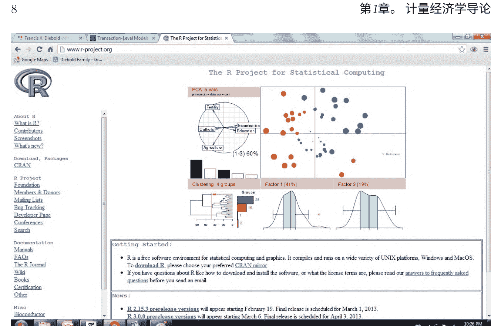

图1.4：R主页

●章末的“练习、问题和补充”部分非常重要，应该认真学习。练习通常是对你理解的简单检查。相比之下，问题通常更加复杂，无论是在分析上还是在计算上。补充部分通常介绍了主要文本中未涉及的重要辅助材料。

## 1.6 练习、问题和补充

- 1.（没有例子是确定的！）

请记住，正如文本中提到的，大多数章节都包含至少一个广泛的实证例子。同时，这些例子不应被视为确定或完整的处理方式 - 没有这样的处理方式。

## 1.7. 注释

事情！一个好主意是考虑每章末尾的隐含的“问题0”作为“批判本章计量经济学实践部分的建模，获取相关数据，并进行更优的分析。”

## 2. （名义、序数、区间和比例数据）

我们强调时间序列、横截面和面板数据，无论是连续还是离散，但还有其他互补的分类方式。特别是在名义数据、序数数据、区间数据和比例数据之间经常进行区分。在经济学和相关领域中，哪些数据最常见和有用？为什么？

## 3. （软件差异和错误：买家需谨慎）

请注意：没有软件是完美的。事实上，所有软件都存在很大的不完美！在不同软件环境中建模时获得的结果可能会有所不同，原因各种各样。例如，实现的细节可能在不同的软件包中有所不同，而细节上的小差异有时可能导致结果上的大差异。因此，重要的是你要准确地了解你的软件在做什么（在可能的情况下，因为有些软件文档比其他软件更完整）。当然，除了正确实现的细节差异之外，还可能存在不完善的实现：没有无缺陷的软件。

## 1.7 笔记

有关计量经济学和统计软件的汇编，请参阅由Marius Ooms在计量经济学杂志维护的软件链接网站。

R作为一个庞大而非常成功的开源项目的一部分，可以免费使用。 RStudio提供了一个良好的R工作环境，而且和R一样，它是免费的。 一个很好的R教程，最初在Coursera上发布，然后转移到YouTube上，可以在这里找到。 R-bloggers是一个庞大的博客，提供有关R的各种信息。 最后，Quandl有一个很好的R接口。

## 第二章

### 图形和图表样式

几乎总是一个好主意，用图形数据分析开始计量经济分析。 与现代计量经济方法相比，图形分析可能看起来非常简单，甚至简单到无法提供深入的见解。 事实并非如此：在许多方面，人眼比最复杂的统计技术更为复杂，是数据分析和建模的更高级工具。 换句话说，图形是一种复杂的技术。 当然，并不是说仅凭图形分析就能完成工作 - 当然，图形分析也有其局限性 - 但通常这是开始的最佳位置。 考虑到这一点，我们在本章介绍一些简单的图形技术，并考虑一些图形风格的基本要素。

## 2.1 简单的图形分析技术

我们将讨论分为两个部分：单变量和多变量。 由于图形分析“让数据自己说话”，当数据的维度较低时，即处理单变量或低维多变量数据时，它是最有用的。

### 2.1.1 单变量图形

首先考虑时间序列数据。图形用于揭示时间序列数据中的模式。单变量时间序列图是单变量时间序列图的重要工具，在该图中，所关注的系列随时间变化而绘制。

例如，在图2.1的顶部面板中，我们呈现了大约500个月内的1年期政府债券收益率的时间序列图。该系列的一些重要特征显而易见。除其他外，它的变动似乎迟缓而持久，它在样本的中间大约趋势缓慢上升，然后在此之后趋势缓慢下降。

图2.1的底部面板提供了一个不同的视角；我们绘制了1年期债券收益率的变化，突出了波动性的波动。中间样本的利率波动非常高。

单变量图形技术通常也用于评估时间序列或横截面的分布形状。例如，直方图提供了一个随机变量概率密度的简单估计。观察到的系列变化范围被分成若干等长的段，并且在一个段上放置的条形的高度是落在该段中的观测值的百分比。在图2.2中，我们展示了<sup>1</sup>年期债券收益率的直方图。

### 2.1.2 多变量图形

当有两个或更多的变量可用时，变量之间的关系可能变得重要，我们使用图形来揭示这种关系的存在和性质。我们使用关系图形来显示关系并标记异常观测。你已经理解了双变量散点图的概念。<sup>2</sup>例如，在图2.3中，我们展示了1960.01-2005.03期间1年期美国国债利率与10年期美国国债利率的双变量散点图。散点图表明两者密切相关；特别是，它们呈正相关关系。

到目前为止，我们对多元图形的讨论都是双变量的。那是因为图形技术最适合低维数据。最近的许多研究都致力于高维数据的图形技术，但是所有这些高维图形分析都受到一定的固有限制。

一种简单而受欢迎的高维数据散点图技术是散点图矩阵，它已经存在很长时间了。散点图矩阵只是所有可能的双变量散点图的集合，排列在矩阵的右上角或左下角，以便进行比较。如果我们有关于 \(N\)个变量的数据，那么就会有 \(\frac{N^2-N}{2}\) 这样的成对散点图。例如，在图2.4中，我们展示了1960.01-2005.03期间美国1年期、10年期、20年期和30年期国债利率的散点图矩阵。总共有六个成对散点图，并且多重比较清楚地表明，尽管利率在每种情况下都密切相关，回归斜率约为一，但在某些情况下（例如20年期和30年期利率）关系更为精确，而在其他情况下（例如1年期和30年期利率）关系不太精确。

<sup>1</sup>在一些软件包（例如Eviews）中，放置在一个段上的条形的高度仅仅是落在该段中的观测数量，而不是百分比。严格来说，这样的直方图不是密度估计器，因为“曲线下的面积”不等于一，但它们同样有用于总结密度的形状。

<sup>2</sup>请注意，“连接数据点”通常在散点图中没有用处。这与时间序列图形相反，在时间序列图形中，连接数据点是可以的，而且通常会这样做。

### 2.1.3 总结和扩展

让我们总结和扩展一下我们对图形的认识：

- a. 图形帮助我们总结和揭示单变量时间序列数据中的模式。时间序列图对于了解时间序列数据的许多特征非常有帮助，包括趋势、季节性、周期性、任何异常观测值（“离群值”）的性质和位置、结构性断点等。
- b. 图形帮助我们总结和揭示单变量横截面数据中的模式。直方图有助于了解分布形状。
- c. 图形帮助我们在多变量时间序列和多变量横截面环境中识别关系并理解其性质。关键的图形工具是散点图，它可以帮助我们开始回答许多问题，包括：是否存在关系？它是线性还是非线性的？是否存在异常值？
- d. 图形帮助我们在面板数据中识别关系并理解其性质。例如，可以通过时间段来检查横截面直方图，或者通过横截面单位来检查时间序列图。
- e. 图形通过多重比较促进和鼓励对不同数据片段的比较。散点图矩阵是多重比较图形的经典示例。

在大数据时代，我们可能还可以将另一个非常相关的项目添加到这个列表中：图形能够帮助我们对大型数据集进行总结和学习。在第??章中，我们将研究大数据计量经济学的各个方面。

## 2.2 图形风格的要素

在前面的章节中，我们强调了图形的强大功能，并介绍了各种图形工具。然而，就像所有工具一样，图形工具可以被有效地使用，也可以被无效地使用，糟糕的图形比没有图形更糟糕。在本节中，您将学习什么样的图形是好的，什么样的图形是糟糕的。在这样做的过程中，您将学会有效地使用图形工具。糟糕的图形就像淫秽物：很难定义，但当你看到它时，你就知道它是糟糕的。相反，制作好的图形就像写作一样：它是一个迭代的、试错的过程，非常注重艺术而不是科学。但这并不意味着任何事情都可以；就像好的写作一样，好的图形需要纪律。好的图形至少有三个关键点：

- a. 了解你的受众，了解你的目标。
- b. 只展示数据，且仅限于合理范围内。
- c. 反复修订和编辑（再次、再次、再次）。使用默认软件生成的图形几乎从不令人满意。

我们可以使用多种方法来展示数据。首先，避免扭曲数据或误导观众，以揭示真实的数据变化，而不是设计变化所造成的虚假印象。因此，例如，在进行多个比较时，避免在中途更改比例尺，使用共同的比例尺等等。图形中的效果大小应与数据中的大小相匹配。

其次，在合理范围内最小化非数据墨水（用于描绘除数据点以外的任何东西的墨水）。避免图表杂乱无章（难以解读的复杂阴影和网格，多余的装饰，包括虚假的三维透视，过于鲜艳的颜色等等）。

第三，选择图形的纵横比（图形的高度与宽度的比例）以最大化模式的展现。一个好的纵横比通常使连接数据点的线段的平均绝对斜率近似等于45度。这个过程被称为将图形倾斜到45度。

第四，最大化图形数据密度。好的图形通常展示大量的数据，事实上，数据量非常大以至于无法从表格中学习。<sup>3</sup> 好的图形可以以简洁易懂的形式呈现大量的数据，揭示事实并引发新的问题，无论是在“微观”还是“宏观”层面上。<sup>4</sup>

图形通常可以大大缩小而不会损失，就像火花线（小型图形，通常是时间序列图，用于与文本流动）和在多重比较图中使用子图，增加每单位面积的数据墨水量。

<sup>3</sup>相反地，对于少量的数据，一个好的表格可能比图形更合适和更有信息量。

<sup>4</sup>注意如何最大化图形数据密度，这与我们早期的最大化数据墨水与非数据墨水比例的建议相辅相成，该建议涉及最大化数据墨水的相对数量。高数据密度还涉及最大化数据墨水的绝对数量。

## 2.3 美国每小时工资

我们使用CPS每小时工资数据；详细描述请参见附录A。

- 工资直方图-偏斜
- 工资核密度估计与正态分布叠加-偏斜
- 对数工资直方图-更对称
- 对数工资核密度估计与正态分布叠加-拟合程度不错

## 2.4 结语

最终良好的图形处理方式与良好的写作方式一样，如果良好的写作是良好的思考，那么良好的图形也是良好的思考。而良好的写作就是良好的思考。所以下次当你听到有人发表意见时无知地沿着“我不喜欢写作；我喜欢思考”的思路，可以放心，他的写作和思考都可能很差。事实上，许多经典的散文风格参考书中包含了许多可以改进图形的见解（即使斯特朗克和怀特可能认为我在这个句子中使用“事实上”是无价值的填充物）。因此，在制作图形时，就像写作时一样，要思考。然后修订和编辑，修订和编辑， ...

## 2.5 练习、问题和补充

- 1. (NBER经济衰退条：一个有用的图形设备)
  在美国的时间序列情况下，将“NBER经济衰退条”叠加在时间序列图上通常是有用的，可以帮助将事物放入背景中。你可以在http://www.nber.org/cycles.html找到NBER扩张和收缩的日期。
- 2. (实证热身)
  - (a) 获取你选择的一个国家的季度实际GDP和季度实际消费的时间序列。提供详细信息。
  - (b) 显示时间序列图和散点图（将消费放在纵轴上）。
  - (c) 将你的系列转换为百分比的增长率，并再次显示时间序列图。
  - (d) 从现在开始只使用增长率系列。
  - (e) 对于每个系列，提供摘要统计信息（例如，均值、标准差、范围、偏度、峰度等）。
  - (f) 对于每个系列，进行零假设的t检验，即人口平均增长率为2%。
  - (g) 对于每个系列，计算人口平均增长率的90%和95%置信区间。对于每个系列，哪个区间更宽，为什么？
  - (h) 将消费与GDP进行回归。讨论。
- 3. (简单相关与偏相关)
  多元散点图的一组成对散点图提供了关于一组变量的联合分布的有用信息，但它是不完整的信息，应该谨慎解释。成对散点图总结了关于 $x$ 和 $y$之间的简单相关的信息。但是，即使在成对散点图中， $x$和 $y$看起来高度相关，如果它们实际上是无关的，那么每个变量都依赖于第三个变量$z$。问题的关键在于，在成对散点图中无法检查 $x$和 $y$在控制$z$的情况下的相关性，我们称之为偏相关。在解读散点图矩阵时，要记住成对的散点图仅提供简单相关性的信息。
- 4. (图形和大数据)
  统计图形的另一个强大之处在于分析大型数据集时发挥作用，因此在我们这个“大数据”时代变得越来越重要：图形能够在小空间中呈现大量数据，从而帮助使大型数据集连贯起来。例如，我们可能拥有超市扫描仪数据，记录了一年中每五分钟的四个食品类别（奶制品、肉类、谷物和蔬菜）的销售数量。对这种数据进行表格或类似的分析根本不现实，但图形仍然简单明了，并且可以揭示重要的模式。
- 5. (颜色)
  人们往往会误以为彩色图形总是比灰度图形更好。事实往往远非如此，而且通常最好节制地使用颜色。
  - a. 颜色可以是（并且通常是）图表中的无用信息。如何以及为什么呢？
  - b. 尽管某些人相信颜色有自然的排序，但实际上它没有。对于“热力图”图形有什么影响呢？可能使用单一颜色的不同阴影（例如从白色或浅灰色到黑色）会更好吗？
  - c. 然而，颜色有时可以在显示数据和吸引观众方面对图形有帮助。其中一个关键的“显示数据”的用途是注释。你能想到其他用途吗？在吸引观众方面有什么用途呢？
  - d. 在考虑图形风格原则的基础上，尽可能提出关于彩色图形的准则。
- 6. （表格风格原则）
  与图形风格原则一样，表格在显示数据和揭示模式方面的能力相对较弱，尤其在大数据时代。然而，表格有时仍然有帮助，并且有表格风格原则。例如，将精美格式的表格2.1（不需要担心它是什么或来自哪里...）与类似Excel的电子表格所生成的进行比较。尝试制定一套表格样式原则。（提示：一个原则是表格中几乎不应出现垂直线，就像上面的表格一样。）
- 7. （关于图形样式的更多信息：吸引观众）
  其他图形指南帮助我们吸引观众。首先，使用清晰且适度的字体，避免使用助记符和缩写词，尽可能使用标签而不是图例。其次，使图形自包含；一个有经验的读者应该能够在不阅读大量附带文本的情况下理解你的图形。第三，与我们展示数据的建议一样，避免使用无用的图表元素。
- 8. (“黄金”长宽比、视觉吸引力和数据展示)
  视觉吸引力的一种历史悠久的方法是使用一种长宽比，使得高度与宽度之比等于宽度与高度和宽度之和的比例。事实证明，这对应于高度大约为宽度的百分之六十，即所谓的“黄金比例”。符合黄金比例的图形，高度略小于宽度的三分之二，视觉上更具吸引力。其他条件相同的情况下，在制作图形时牢记黄金比例是个好主意。然而，并非总是其他条件相同。特别是，黄金长宽比可能不是最大化模式展示的比例（例如，通过倾斜到45度）。
- 9. 图形、非盈利和盈利性。
  - 请访问非盈利组织“创意人群社区”网站[www.visualizing.org](http://www.visualizing.org)。
  - 请访问[Google Charts网站](https://developers.google.com/chart/)。浏览一下。有什么好的？有什么不好的？你能用它来做sparklines吗？
  - 请访问[www.zevross.com](http://www.zevross.com)。

## 2.6 注释

R实现了各种复杂的图形技术，在许多方面代表了统计图形软件的前沿。

ggplot2是一个重要的R包，提供了广泛的图形功能目录；请参阅[www.ggplot2.org](http://www.ggplot2.org)。它实现了Leland Wilkenson开发的图形语法，允许您以模块化的方式生成高度定制的图形。这种语法导致了稍微不寻常的语法，需要学习，但一旦学会，几乎可以做任何事情。

(R中的简单绘图命令允许进行一些自定义，并且学习曲线较短，但它们不太强大。) ggplot2文档位于[www.cran.r-project.org/web/packages/ggplot2/ggplot2.pdf](http://www.cran.r-project.org/web/packages/ggplot2/ggplot2.pdf)。有用的“备忘单”位于[www.zevross.com/blog/2014/08/04/beautiful-plotting-in#change-the-grid-lines-panel.grid.major](http://www.zevross.com/blog/2014/08/04/beautiful-plotting-in#change-the-grid-lines-panel.grid.major)。

## 2.7 图形图例：爱德华·图夫特

本章受到图夫特（1983年）的深刻影响，所有现代的统计图形讨论都受到他的影响。<sup>5</sup>图夫特的书是关于图形风格的有见地和有趣的杰作，我强烈推荐。一定要查看他的网页和其他书籍，它们远远超出了他1983年的作品。

## 第三章

### 概率和统计的几个要素

## 3.1 总体：随机变量、分布和矩

### 3.1.1 一元

考虑一个具有一组可能结果的实验 O。一个随机变量 Y 只是从 O 到实数的映射。例如，实验可能是抛两次硬币，这种情况下 O = {(正面, 正面), (反面, 反面), (正面, 反面), (反面, 正面)}。我们可以定义一个随机变量 Y 为两次翻转中观察到的正面数，这种情况下 Y 可以取三个值， y= 0， y= 1 或 y= 2。

离散随机变量，即具有离散概率分布的随机变量，只能取可数个值，每个都有正概率 $p_i, p_i > 0, \sum_i p_i = 1$。概率分布 $f(y)$ 给每个这样的值 $y_i$ 分配一个概率 $p_i$ 。

在这个例子中， Y 是一个离散随机变量，且 $f(y) = 0.25$ 对于 $y= 0$， $f(y) = 0.50$ 对于 $y= 1$， $f(y) = 0.25$ 对于 $y= 2$，且 $f(y) = 0$ 其他情况。

<sup>1</sup>注意，原则上，我们用大写字母表示随机变量（Y），用小写字母表示它们的实现（y）。然而，我们经常忽略这种形式主义，因为从上下文中意义会很清楚。

表2.1：收益统计

| 到期日（月） | 平均值 | 标准差 | 相关系数（1） | 相关系数（12） |
| :--- | :--- | :--- | :--- | :--- |
| 6 | 4.9 | 2.1 | 0.98 | 0.64 |
| 12 | 5.1 | 2.1 | 0.98 | 0.65 |
| 24 | 5.3 | 2.1 | 0.97 | 0.65 |
| 36 | 5.6 | 2.0 | 0.97 | 0.65 |
| 60 | 5.9 | 1.9 | 0.97 | 0.66 |
| 120 | 6.5 | 1.8 | 0.97 | 0.68 |

注：我们提供不同到期日的月末收益的描述性统计数据。我们展示样本均值、样本标准差以及一阶和十二阶样本自相关系数。数据来自美联储理事会。样本期间为1985年1月至2008年12月。

## 第三章 概率和统计的几个要素

相比之下，连续随机变量可以取连续的值范围，概率密度函数 $f(y)$ 是一个非负连续函数，使得 $f(y)$ 在任意点 $a$ 和 $b$ 之间的面积就是 $Y$ 取值在 $a$ 和 $b$ 之间的概率。$^2$ 在接下来的内容中，我们将简单地称之为“分布” $f(y)$。从上下文中可以清楚地看出，我们实际上是在讨论具有概率分布 $f(y)$ 的离散随机变量还是连续随机变量具有概率密度 $f(y)$。

矩提供了分布各个方面的重要总结。粗略地说，矩就是随机变量的幂的期望，不同幂的期望传达不同类型的信息。你已经熟悉了两个非常重要的矩，均值和方差。接下来我们将考虑前四个矩：均值、方差、偏度和峰度。$^3$

离散随机变量的均值，或期望值，是它可能取值的概率加权平均值，$^4$

$$E(y) = \sum_i p_i y_i.$$

通常我们使用希腊字母 $\mu$ 来表示均值，它衡量了 $y$ 的位置，或者中心趋势。

离散随机变量 $y$ 的方差是它与均值的期望平方差，

$$var(y) = E[(y - \mu)^2].$$

我们使用 $\sigma^2$ 来表示方差，它衡量了 $y$ 围绕均值的离散程度或尺度。

通常我们使用方差的平方根来评估离散程度，即称为标准差，

$$\sigma = std(y) = \sqrt{E[(y - \mu)^2]}$$

标准差比方差更容易解释，因为它与 $y$ 具有相同的测量单位。也就是说，如果 $y$ 以美元为单位（例如），那么 $std(y)$ 也是以美元为单位。相比之下，方差 $Var(y)$ 的测量单位是“平方美元”，比较难理解。

偏度 (skewness) of $y$ 是其离均值的期望立方偏差（通过 $\sigma^3$ 进行缩放，出于技术原因），

$$S = \frac{E[(y - \mu)^3]}{\sigma^3}$$

偏度度量分布的不对称性的程度。偏度的绝对值越大，分布的不对称性就越大。一个较大的正值表示右尾较长，一个较大的负值表示左尾较长。零值表示围绕均值对称。

$y$ 的峰度是 $y$ 与其均值的偏差的期望的四次方（再次为技术原因而缩放）

$$K = \frac{E[(y - \mu)^4]}{\sigma^4}$$

峰度度量了分布的尾部厚度。峰度大于三表示相对于之前学习的正态或高斯分布而言存在“厚尾”或“尖峰峰度”。因此，峰度大于三表示极端事件（“尾事件”）更有可能发生，而不是在正态分布下的情况。

### 3.1.2 多元

现在假设我们不是只有一个随机变量 $Y$，而是有两个随机变量 $Y$ 和 $X$。我们可以分别研究 $Y$ 或 $X$ 的分布，这被称为边际分布。这实际上是我们已经学过的。但现在更多的是：$Y$ 和 $X$ 可能是相关的，因此以各种方式一起移动，这需要一个联合分布来描述。在离散情况下，联合分布 $f(y, x)$ 给出与每对可能的 $y$ 和 $x$ 值相关的概率，在连续情况下，联合密度 $f(y, x)$ 使得其下任何区域的面积给出 $(y, x)$ 落在该区域的概率。

我们可以分别研究 $y$ 或 $x$ 的矩，例如均值、方差、偏度和峰度。但现在又有了更多的内容：为了帮助评估 $y$ 和 $x$ 之间的依赖关系，我们经常研究多元环境中的一个关键时刻，即协方差。$y$ 和 $x$ 之间的协方差简单地说就是 $y$ 和 $x$ 与它们各自均值的偏差的期望乘积。

$$cov(y, x) = E[(y_t - \mu_y)(x_t - \mu_x)].$$

正协方差意味着 $y$ 和 $x$ 呈正相关；也就是说，当 $y$ 高于其均值时，$x$ 往往高于其均值，而当 $y$ 低于其均值时，$x$ 往往低于其均值。相反，负协方差意味着 $y$ 和 $x$ 呈反相关；也就是说，当 $y$ 低于其均值时，$x$ 往往高于其均值，反之亦然。协方差可以取任何实数值。

通常我们通过标准化将协方差转换为相关性，由 $\sigma_y$ 和 $\sigma_x$ 的乘积得到

$$ corr(y, x) = \frac{cov(y, x)}{\sigma_y \sigma_x} $$

相关性的取值范围为 $[-1, 1]$。请注意，协方差取决于测量单位（例如，美元、分、十亿美元），但相关性不取决于单位。因此，相关性更容易解释，这也是它受欢迎的原因。

还要注意，协方差和相关性只测量线性相关性；特别地，零协方差或相关性并不一定意味着 $y$ 和 $x$ 是独立的。也就是说，它们可能是非线性相关的。然而，如果两个随机变量联合服从正态分布且协方差为零，则它们是独立的。

我们的多元讨论集中在联合分布 $f(y, x)$ 上。在各个章节中，我们还将大量使用条件分布 $f(y|x)$，即在给定 $X = x$ 的条件下，随机变量 $Y$ 的分布。条件矩同样重要。特别是，在计量经济学中，条件均值和条件方差在很大程度上起着关键作用，因为关注点通常集中在过去的条件下的均值或方差上。

## 3.2 样本：样本矩

### 3.2.1 一元

到目前为止，我们已经回顾了随机变量在总体中已知分布的各个方面。然而，通常情况下，我们有一个从未知总体分布 $f$ 中抽取的样本数据。

$$ \{y_i\}_{i=1}^N \sim f(y), $$

我们希望从样本中了解 $f$ 的各个方面，例如其矩。为了做到这一点，我们使用各种估计量。$^6$ 我们可以通过用样本平均值替换总体期望来获得估计量，因为算术平均值是总体期望的样本类比。这种“类比估计量”通常具有良好的性质。样本均值就是算术平均值，

$$\bar{y} = \frac{1}{N} \sum_{i=1}^{N} y_i.$$

它提供了一个关于 $y$ 位置的经验度量。

样本方差是样本均值与样本均值之间的平方差的平均值，

$$\hat{\sigma}^2 = \frac{\sum_{i=1}^{N} (y_i - \bar{y})^2}{N}.$$

它提供了一个关于 $y$ 离其均值的离散程度的经验度量。

我们通常使用一个稍微不同的版本的 $\hat{\sigma}^2$，它校正了在估计 $\bar{y}$ 时使用的一个自由度，从而产生一个无偏估计量 $\sigma^2$，

$$s^2 = \frac{\sum_{i=1}^{N} (y_i - \bar{y})^2}{N-1}.$$

同样，样本标准差可以定义为

$$\hat{\sigma} = \sqrt{\hat{\sigma}^2} = \sqrt{\frac{\sum_{i=1}^{N} (y_i - \bar{y})^2}{N}}$$

或者

$$s = \sqrt{s^2} = \sqrt{\frac{\sum_{i=1}^{N} (y_i - \bar{y})^2}{N-1}}.$$

它提供了一个与 $y$ 相同单位的离散度的经验度量。

样本偏度是

$$\hat{S} = \frac{\frac{1}{N} \sum_{i=1}^{N} (y_i - \bar{y})^3}{\hat{\sigma}^3}$$

它提供了一个实证度量 $y$ 分布的不对称程度。样本峰度是

$$\hat{K} = \frac{\frac{1}{N} \sum_{i=1}^{N} (y_i - \bar{y})^4}{\hat{\sigma}^4}$$

它提供了一个实证度量 $y$ 分布相对于正态分布的尾部厚度。

在样本矩的背景下，许多最著名和重要的统计抽样分布产生了，而正态分布是其中的鼻祖。特别是，著名的中心极限定理确立了在相当普遍的条件下，样本均值 $\bar{y}$ 将具有正态分布，随着样本大小的增大。$\chi^2$ 分布来自平方正态随机变量，$t$ 分布来自正态和 $\chi^2$ 变量的比率，$F$ 分布来自 $\chi^2$ 变量的比率。由于正态分布的基本性质已经由中心极限定理确立，它已经被广泛研究，对它已经有了很多了解，并且已经开发出了各种强大的工具与之配合使用。

### 3.2.2 多元

我们还有多元分布的矩样本版本。特别地，样本协方差是

$$cov(y, x) = \frac{1}{N} \sum_{i=1}^{N} [(y_i - \bar{y})(x_i - \bar{x})],$$

以及样本相关性是

$$corr(y, x) = \frac{cov(y, x)}{\hat{\sigma}_y \hat{\sigma}_x}.$$

## 3.3 有限样本和渐近抽样分布：样本均值

在这里，我们回顾一下最重要的样本矩，即样本均值的抽样分布。

### 3.3.1 精确的有限样本结果

在你之前的学习中，你学习了统计推断，例如如何根据样本均值构建总体均值的置信区间，如何检验关于总体均值的假设等等。在这里，我们部分地回顾一下。

考虑高斯简单随机抽样的基准情况，

$$y_i \sim iid \ N(\mu, \sigma^2), i = 1, ..., N,$$

这对应于我们后面将称之为回归建模的“完全理想条件”的特殊情况。样本均值 $\bar{y}$ 是总体均值 $\mu$ 的自然估计量。在这种情况下，正如你之前学到的，$\bar{y}$ 是无偏的、一致的、服从正态分布且方差为 $\sigma^2/N$ 的最小方差无偏估计量。我们写作

$$\bar{y} \sim N \left( \mu, \frac{\sigma^2}{N} \right),$$

或等价地

$$\sqrt{N}(\bar{y} - \mu) \sim N(0, \sigma^2).$$

我们构建了精确的有限样本置信区间来估计 $\mu$，如下所示

$$\mu \in \left[ \bar{y} \pm t_{1 - \frac{\alpha}{2}}(N - 1) \frac{s}{\sqrt{N}} \right] \text{ 概率为 } \alpha,$$

其中 $t_{1 - \frac{\alpha}{2}}(N - 1)$ 是自由度为 $N - 1$ 的 $t$ 分布的 $1 - \frac{\alpha}{2}$ 百分位数。同样，我们使用精确的有限样本（似然比）假设检验构建了对两边备择假设 $H_0: \mu = \mu_0$ 的检验。

$$\frac{\bar{y} - \mu_0}{\frac{s}{\sqrt{N}}} \sim t_{1 - \frac{\alpha}{2}}(N - 1).$$

### 3.3.2 近似渐近结果（在较弱的假设下）

统计推断的很大一部分与大样本考虑有关，比如大数定律和中心极限定理，这些你之前也学过。在这里我们再次提醒你。

再次考虑一个简单随机样本，但不假设正态性。

$$y_i \sim iid(\mu, \sigma^2), i = 1, ..., N.$$

尽管我们放弃了正态性假设，我们仍然有 $\bar{y}$ 是无偏的、一致的、渐近正态分布的，方差为 $\sigma^2 / N$，最佳线性无偏估计 (BLUE)。我们写成，

$$\bar{y} \stackrel{a}{\sim} N \left( \mu, \frac{\sigma^2}{N} \right).$$

更准确地说，当 $N \to \infty$ 时，

$$\sqrt{N}(\bar{y} - \mu) \rightarrow_d N(0, \sigma^2).$$

这个结果为渐近推断提供了基础。这是一个高斯中心极限定理，它还嵌入了大数定律 ($\bar{y} \to_p \mu$)。

我们构建了渐近有效的置信区间来估计 $\mu$，如下所示

$$\mu \in \left[ \bar{y} \pm z_{1-\frac{\alpha}{2}} \frac{\hat{\sigma}}{\sqrt{N}} \right] \text{ 概率为 } \alpha,$$

其中 $z_{1-\frac{\alpha}{2}}$ 是 $N(0,1)$ 分布的 $1 - \frac{\alpha}{2}$ 百分位数。同样地，我们使用渐近有效的假设检验构建 $H_0: \mu = \mu_0$ 对双边备择假设进行检验

$$\frac{\bar{y} - \mu_0}{\frac{\hat{\sigma}}{\sqrt{N}}} \sim N(0,1).$$

## 3.4 练习、问题和补充

1.  （解释分布和密度）
    夏普铅笔公司有严格的质量控制监测程序。作为该程序的一部分，公司确定每一批一百支铅笔芯的石墨含量的分布是连续的，并且在一克到两克之间均匀分布。也就是说，对于每一批一百支铅笔芯，石墨含量在 $[1,2]$ 之间时，$f(y) = 1$，否则为零，其中 $y$ 是每一批一百支铅笔芯的石墨含量。
    a. $y$ 是离散还是连续随机变量？
    b. $f(y)$ 是概率分布还是密度函数？
    c. $y$ 在1和2之间的概率是多少？在1和1.3之间的概率是多少？恰好等于1.67的概率是多少？
    d. 对于高质量的铅笔，每批次所需的石墨含量为1.8克，批次间变化小。在此基础上，讨论密度函数 $f(y)$ 的性质。

2.  （协方差和相关性）
    假设世界上两个最大的石油生产商的年收入具有协方差1,735,492。
    a. 根据协方差，声称收入“非常强烈地正相关”。评估该声明。
    b. 假设根据协方差，声称收入“正相关”。评估该声明。
    c. 假设你得知收入具有0.93的相关性。根据这个新信息，重新评估上面a和b部分的声明。

3.  （模拟）
    你经常需要从各种模型中模拟数据。最简单的模型是 $iidN(\mu, \sigma^2)$ （高斯简单随机抽样）模型。
    a. 使用随机数生成器，模拟一个样本大小为30的 $y$，其中 $y \sim iidN(0, 1)$。
    b. 样本均值是多少？样本标准差？样本偏度？样本峰度？讨论。
    c. 构建适当的95%置信区间，以估计 $E(y)$。
    d. 进行一个假设检验，假设 $E(y) = 0$。
    e. 进行一个假设检验，假设 $E(y) = 1$。

4.  （工资数据的样本矩）
    使用1995年的工资数据集。
    a. 计算样本平均工资并检验假设它等于每小时9美元。
    b. 计算样本偏度。
    c. 计算并讨论工资和教育年限之间的样本相关性。

5.  符号表示。
    我们使用了标准的横截面符号表示： $i=1,...,N$。标准的时间序列表示为 $t=1,...,T$。我们的讨论大部分适用于横截面和时间序列环境，但我们仍然需要选择一种符号表示。为了不失一般性，我们通常使用 $t=1,...,T$。

## 3.5 注释

有许多优秀的概率和统计入门书籍。Wonnacott 和 Wonnacott（1990）是一本历史悠久的经典著作，你可以参考它来复习统计分布、估计和假设检验。Anderson 等人（2008）是一本写得很好的近期教材。

## 第四章 在完全理想条件下的回归

你已经接触过概率和统计学，但在深入研究回归之前，可能需要进行一些复习，所以先学习附录3。然而，请注意：它不能替代完整的概率和统计学入门课程，你应该已经学过了。相反，它有意地更加狭窄，重点回顾了与随机变量的矩相关的一些材料，我们将会反复使用这些内容。它还引入了符号表示，并预示了一些我们随后会更详细讨论的思想。

## 4.1 初步图形

在本章中，我们将使用关于对数工资、教育和经验的横截面数据进行工作。我们已经研究了对数工资的分布。为了方便起见，我们在图4.1中重现了它，同时还有关于教育和经验的新数据的分布。


图4.1：对数工资、教育和经验的分布

## 4.2 回归作为曲线拟合

### 4.2.1 双变量或简单线性回归

假设我们有两个变量的数据，y和x，如图4.2所示，并且假设我们想要找到最佳拟合y的x的线性函数，其中“最佳拟合”意味着数据点到拟合线的垂直偏差的平方和尽可能小。当我们“进行回归”或“拟合回归线”时，我们所做的就是这样。估计策略被称为最小二乘法，有时也称为“普通最小二乘法”，以区别于我们稍后介绍的更高级版本。

图4.2中显示的具体数据是近1500人的对数工资（LWAGE，y）和教育水平（EDUC，x）的随机样本，详见附录A。

让我们详细说明回归线的拟合以及“最小二乘法”的原因。当我们进行回归分析时，我们使用计算机通过解决问题来拟合线条

$$\min_{\beta} \sum_{t=1}^T (y_t - \beta_1 - \beta_2 x_t)^2$$

其中 $\beta$ 是两个参数的简写符号，即 $\beta_1$ 和 $\beta_2$。我们用 $\hat{\beta}$ 表示拟合参数集合，用 $\hat{\beta}_1$ 和 $\hat{\beta}_2$ 表示其元素。

事实证明，解决最小二乘问题的 $\beta_1$ 和 $\beta_2$ 值具有众所周知的数学公式。（稍后详细介绍。）我们可以使用计算机简单、稳定和即时地评估这些公式。

拟合值为 $\hat{y}_t = \hat{\beta}_1 + \hat{\beta}_2 x_t, \ t = 1, ..., T.$ 残差是实际值与拟合值之间的差异，$e_t = y_t - \hat{y}_t, \ t = 1, ..., T.$

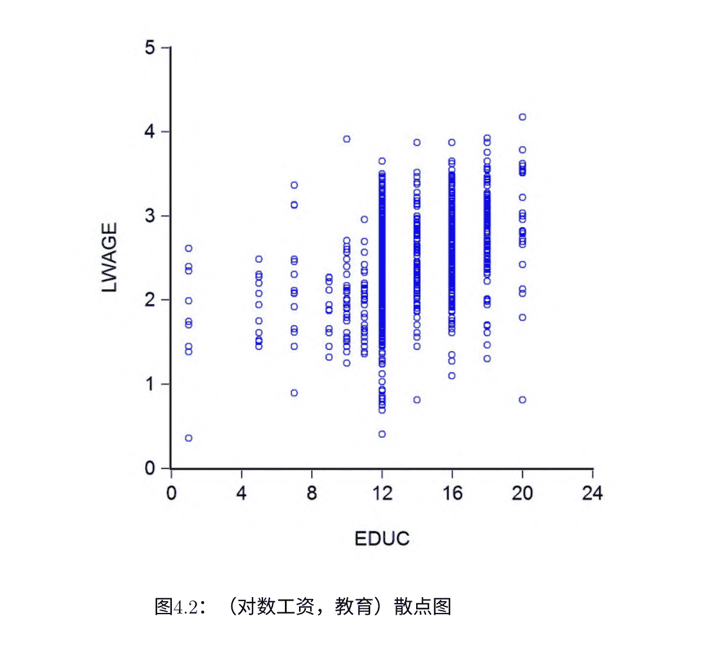

图4.2：（对数工资，教育）散点图

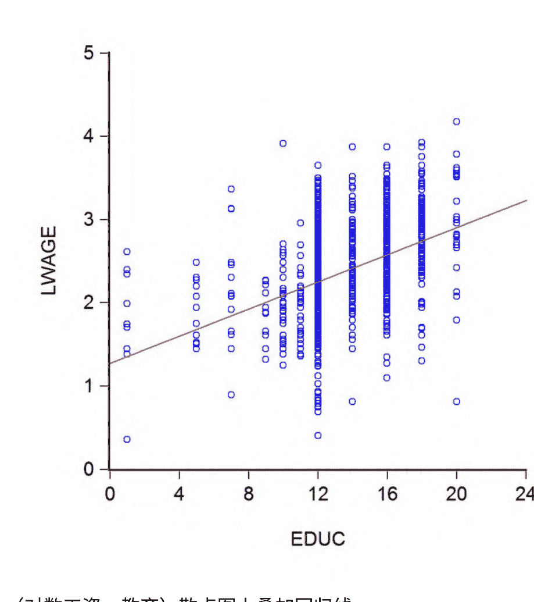

图4.3：（对数工资，教育）散点图上叠加回归线

在图4.3中，我们以图形方式展示了对LWAGE在EDUC上进行回归的结果。最佳拟合线向上倾斜，反映出LWAGE和EDUC之间的正相关关系。请注意，数据点并不完全满足拟合的线性关系；而是在平均上满足。为了预测在给定EDUC值的情况下的LWAGE，我们使用拟合线找到与给定EDUC值相对应的LWAGE值。

$^2$ 此外，$f(y)$ 的总面积必须为1。
$^3$ 原则上，我们当然可以考虑超过四阶的矩，但实际上通常只考虑前四阶。
$^4$ 在连续情况下，类似的公式成立。
$^6$ 估计量是样本观测值的一个函数的例子，也称为统计量或样本统计量。
$^1$ 注意使用对数工资有几个期望。首先，它促进了正态性，正如我们在第2章中讨论的那样。其次，它强制拟合工资的正值，因为 $WAGE = \exp(LWAGE)$，而 $\exp(x) > 0$ 对于任何 $x$ 都成立。

数值上，拟合线是：

$$LWAGE = 1.273 + .081EDUC$$

### 4.2.2 多元线性回归

一切都可以推广到允许多个自变量的情况。这被称为多元线性回归。

例如，假设我们有两个自变量，$x_2$和$x_3$。之前我们将最小二乘线拟合到二维数据云；现在我们将最小二乘平面拟合到三维数据云中。我们使用计算机找到解决问题的$\beta_1$，$\beta_2$和$\beta_3$的值。

$$\min_{\beta} \sum_{t=1} (Y_t - \beta_1 - \beta_2 x_{2t} - \beta_3 x_{3t})^2,$$

其中$\beta$表示三个模型参数的集合。我们用$\hat{\beta}$表示估计参数的集合，其中包括元素$\hat{\beta}_1$，$\hat{\beta}_2$和$\hat{\beta}_3$。拟合值为

$$\hat{y}_t = \hat{\beta}_1 + \hat{\beta}_2 x_{2t} + \hat{\beta}_3 x_{3t},$$

残差为

$$e_t = y_t - \hat{y}_t,$$

$t = 1, ..., T$.

对于我们的工资数据，拟合模型为

$$LWAGE = .867 + .093EDUC + .013EXPER.$$

扩展到一般的多元线性回归模型，包括任意数量的右手边（RHS）变量（$K$，包括常数项），是很容易的。计算机再次完成所有工作。拟合线为

$$\hat{y}_t = \hat{\beta}_1 + \hat{\beta}_2 x_{2t} + \hat{\beta}_3 x_{3t} + ... + \hat{\beta}_K x_{Kt},$$

有时我们会更简洁地写成

$$\hat{y}_t = \sum_{k=1}^K \hat{\beta}_i x_{it}$$

其中 $x_{1t}=1$ 对于所有 $t$.

## 4.3 回归作为概率模型

在继续之前，值得注意我们迄今为止所做的两个方面。首先，我们现在有两种分析数据并揭示其模式的方法。一种是图4.2的散点图，我们从中开始，它提供了数据的视觉视图。另一种是图4.3的拟合回归线，它通过线性拟合的方式总结了数据。每种方法都有其优点，两者互补而不是替代，但请注意，线性回归更容易推广到高维度。

其次，迄今为止介绍的最小二乘法与统计学或计量经济学几乎没有什么关系。相反，它只是一种以严谨、可复制和合理的方式指导计算机拟合散点图上的一条线的方法。现在我们转向概率解释。

我们使用完整的多元回归模型（简单回归当然是一种特殊情况）。将RHS变量收集到向量 $x$中，其中 $x'_t = (1, x_{1t}, x_{2t}, ..., x_{Kt})$。

### 4.3.1 一个总体模型和一个样本估计量

到目前为止，我们还没有假设一个将 $y_t$和 $x_t$相关的概率模型；相反，我们只是对 $y_t$在 $x_t$上进行了机械回归，以找到最佳的 $y_t$的拟合，形成了 $x_t$的线性函数。然而，构建起来很容易一个概率框架，让我们对拟合线的属性进行统计评估。我们假设 $y_t$与外生确定的 $x_t$呈线性关系，并添加一个独立且独立同分布的零均值（iid）高斯扰动：

$$ y_t = \beta_1 + \beta_2 x_{2t} + ... + \beta_K x_{Kt} + \varepsilon_t $$

$$ \varepsilon_t \sim iid N(0, \sigma^2) $$

$t=1,...,T$。线的截距为 $\beta_1$，斜率参数为$\beta_i$，扰动的方差为 $\sigma^2$。总体上，我们称 $\beta$为模型的参数。指标 $t$跟踪时间；数据样本从我们称之为“1”的某个时间开始，到我们称之为“T”的某个时间结束，因此我们写作 $t=1,...,T$。（或者，在横截面中，我们通过 $i$对横截面单位进行索引，并写作 $i=1,...,N$。）

请注意，在线性回归模型中，给定x的特定值（例如$x^*$），y的条件期望值E(y|x=x^*)是

$$ E(y|x=x^*) = \beta_1 + \beta_2 x_2^* + ... + \beta_K x_{Kt}^* $$

也就是说，回归函数是y的条件期望值。我们假设所描绘的线性模型在总体中成立；也就是说，它是数据生成过程（DGP）。但在实践中，我们当然不知道模型参数$\beta_1$，$\beta_2$，...，$\beta_K$和$\sigma^2$的值。我们的工作是利用来自总体的样本数据来估计它们。我们像以前一样精确地估计$\beta$，使用计算机来解决min$_{\beta} \sum_{t=1}^T \varepsilon_t^2$的问题。

### 4.3.2 符号、假设和结果：完全理想条件

到目前为止的讨论有意地有些宽松，侧重于动机和直觉。现在让我们更加准确地说明我们的假设和得出的结果。

#### 一点矩阵符号

将所有的RHS变量排列成一个矩阵 $X$ 将会很有用。$X$ 有 $K$ 列，每个回归变量一列。在回归中包含一个常数相当于包含一个特殊的RHS变量，该变量始终为1。我们将其放在 $X$ 矩阵的最左列，即全为1。其他列包含关于其他RHS变量的数据，在横截面情况下是跨截面上的数据，即 $i=1,...,N$ ，或者在时间序列情况下是随时间变化的数据，即 $t=1,..., T$。

不失一般性，假设我们处于时间序列情况下；那么符号上 $X$ 是一个 $T \times K$ 矩阵。

$$ X = \begin{pmatrix} 1 & x_{21} & x_{31} & \dots & x_{K1} \\ 1 & x_{22} & x_{32} & \dots & x_{K2} \\ \vdots & & & & \vdots \\ 1 & x_{2T} & x_{3T} & \dots & x_{KT} \end{pmatrix} . $$

矩阵 $X$ 的一个有用之处在于可以使用它非常简洁地编写回归模型。我们已经将模型写成了

$$ y_t = \beta_1 + \beta_2 x_{2t} + ... + \beta_K x_{Kt} + \varepsilon_t, t=1,..., T. $$

或者，将 $y_t, t=1,..., T$ 堆叠成向量 $y$，其中 $y'=(y_1, y_2, ..., y_T)$，将 $\beta_j, j=1,..., K$ 堆叠成向量 $\beta$，其中 $\beta'=(\beta_1, \beta_2, ..., \beta_K)$，以及将 $\varepsilon_t, t=1,..., T$ 堆叠成向量 $\varepsilon$，其中 $\varepsilon'=(\varepsilon_1, \varepsilon_2, ..., \varepsilon_T)$。

然后我们可以将完整模型写成所有观测的形式

$$y = X\beta + \varepsilon.\tag{4.1}$$

我们的要求是

$$\varepsilon_t \sim iid\ N(0, \sigma^2)$$

变成

$$\varepsilon \sim N(0, \sigma^2I)\tag{4.2}$$

这种简洁的表示非常方便。

事实上，表示式(4.1)-(4.2)非常重要，不仅仅因为它简洁，而且因为我们需要得到各种统计结果所需的各种假设在方程(4.1)中最自然、最简单地陈述在 $X$和 $\varepsilon$上。我们现在继续讨论这些假设。

#### 假设：完全理想条件（FIC）

- 1. DGP是(4.1)-(4.2)，拟合模型与DGP完全匹配。
- 2. $X$在重复样本中是固定的。
- 3. $X$具有完整的列秩（$K$）

FIC 1有许多重要的嵌入式子条件。例如：

- 1. 线性关系，$E(y) = X\beta$
- 2. 固定系数，$\beta$
- 3. $\varepsilon \sim N$
- 4. $\varepsilon$具有恒定方差 $\sigma^2$
- 5. $\varepsilon$之间是不相关的。

FIC 2表示重新运行世界以生成新样本 $y^*$ 将需要仅仅生成新的冲击 $\varepsilon^*$ 并通过方程 (4.1)运行它们：

$$
y^* = X\beta + \varepsilon^*.
$$

也就是说，$X$ 在重复实验中保持不变。这个“固定 $X$”的条件看起来无害，但实际上并非如此，我们将对此进行更详细的讨论。FIC 3更多是一个技术细节。它实际上表示 $X$ 中的变量之间没有冗余（更准确地说，没有一个回归变量是其他变量的完全线性组合）。满列秩的 $X$ 保证 $X'X$ 是非奇异的，因此可逆，这对于计算OLS估计量 $(X'X)^{-1}X'y$ 是必要的。这个条件在技术上是很重要的，因为除非你做一些非常愚蠢的事情，比如两次输入相同的回归变量，否则 $X$ 总是满列秩的。然而，$X'X$ 几乎是奇异的情况可能会发生并引发问题，甚至导致灾难。我们将在后面讨论这类情况。

在许多情况下，FIC肯定是英勇的，而计量经济学的很大一部分是致力于检测和处理各种FIC的失败。但在我们担心FIC的失败之前，首先了解它们保持时会发生什么是非常宝贵的。

#### 结果

最小二乘估计器是

$$
\hat{\beta}_{LS} = (X'X)^{-1}X'y,
$$

在FIC下，它是MVUE并且服从正态分布，其协方差矩阵为 $\sigma^2(X'X)^{-1}$。我们写作

$$
\hat{\beta}_{LS} \sim N \left(\beta, \, \sigma^2(X'X)^{-1}\right).
$$

我们使用 \( s^2 (X'X)^{-1} \) 来估计协方差矩阵 \( \sigma^2 (X'X)^{-1} \)，其中 \( s^2 = \sum_{t=1}^{T} e_t^2 / (T - K) \).

## 4.4 薪资方程

现在让我们不仅仅对回归拟合进行简单的图形分析。相反，让我们详细查看计算机输出，如图7.2所示，这是对截距、\( EDUC \)和\( EXPER \)进行回归的结果。在本书中，我们运行了数十次回归，输出格式和解释始终相同，因此迅速熟悉它非常重要。输出格式为\( Eviews \)格式。其他软件将产生基本相同的信息，这是基本和标准的。

在继续之前，请注意该数据集可能不满足FIC，但我们将假设它们满足。在本书中，我们将遇到各种假设的违反 - 这正是计量经济学的主要内容 - 我们将反复讨论对于这个数据集和其他数据集。但我们必须从头开始。

打印输出开始时提醒我们正在运行最小二乘 (LS) 回归，并且左侧变量 (LHS) 是对数工资 (LWAGE)，使用了1323个观测值。

接下来是一个表格，列出了每个RHS变量以及四个统计量。RHS变量EDUC和EXPER分别表示教育和经验，C变量是前面提到的截距。变量 C始终等于一，因此 C的估计系数是回归线的估计截距。

| 变量 | 系数 | 标准误差 | t-统计量 | 概率 |
| :--- | :--- | :--- | :--- | :--- |
| C | .867 | .08 | 10.84 | .0000 |
| EDUC | .093 | .006 | 15.50 | .0000 |
| EXPER | .013 | .003 | 4.33 | .0000 |

与每个RHS变量相关的四个统计量是估计的系数 (“系数”)，标准误差 (“标准误差”)，一个 t统计量和相应的概率值 (“概率”)。估计系数的标准误差表示它们的抽样变异性和可靠性。估计系数加减一个标准误差大约是真实但未知的总体参数的68%置信区间，估计系数加减两个标准误差大约是95%置信区间，假设估计系数近似正态分布，这将在回归扰动近似正态分布或样本量较大时成立。

因此，大的系数标准误差会转化为宽的置信区间。

每个 t统计量都提供了对变量无关性假设的检验：即真实但未知的总体参数为零，因此相应的变量对预测回归没有贡献，可以被剔除。一种检验变量无关性的方法是，例如，以5%的错误拒绝概率检查零是否在95%的置信区间之外。如果是这样，我们就拒绝无关性。这个 t统计量只是估计系数与其标准误差的比值，因此如果零在95%的置信区间之外，那么这个 t统计量必须是绝对值大于二。因此，我们可以通过检查统计量的绝对值是否大于二，快速测试在5%的水平上的无关性。⁴

最后，与每个统计量相关的是一个概率值，即在假设无关性的情况下，获得一个绝对值至少与实际获得的值一样大的统计量的概率。因此，如果一个统计量为二，相应的概率值将约为0.05。概率值越小，反对无关性的证据越强。没有魔法的分界点，但通常概率值小于0.1被视为反对无关性的强有力证据，概率值小于0.05被视为非常强有力的反对无关性的证据。概率值很有用，因为它们消除了查阅分布表的需要。实际上，计算机为我们完成了这项工作，并告诉我们拒绝无关性假设的显著水平。

现在让我们解释实际估计的系数、标准误差、统计量和概率值。估计的截距约为.867，因此在教育和经验为零的条件下，我们对对数工资的最佳预测为86.7美分。此外，截距的估计非常精确，这可以从相对于估计系数的小标准误差.08来证明。对于真实但未知的总体截距，一个近似的95%置信区间为 .867 ± 2(.08)，即[.71, 1.03]。零远远超出该区间，因此相应的 t 统计量非常大，其概率值在小数点后四位为零。

EDUC的估计系数为.093，标准误差再次相对于估计系数的大小很小，因此 t统计量很大，其概率值很小。系数为正，因此当教育水平提高时，LWAGE往往会上升。事实上，估计系数为0.09的解释是，保持其他一切不变，教育年限增加一年将导致LWAGE增加0.093。经验年限的估计系数为0.013。它的标准误差也很小，因此它的t统计量很大，概率值很小。

因此，我们拒绝了经验年限对预测回归没有贡献的假设。教育年限增加一年往往会导致LWAGE增加0.013。

接下来是各种诊断统计量；它们帮助我们评估回归的适应性。我们在其他地方对许多诊断统计量进行了详细讨论。在这里，我们简要介绍它们：

### 4.4.1 平均因变量 2.342

依赖变量的样本均值是

$$\bar{y} = \frac{1}{T} \sum_{t=1}^{T} y_t$$

它衡量了 $y$ 的中心趋势或位置。

### 4.4.2 标准差因变量 .561

依赖变量的样本标准差是

$$SD = \sqrt{\frac{\sum_{t=1}^{T} (y_t - \bar{y})^2}{T-1}}$$

它衡量了 $y$ 的离散程度或尺度。

### 4.4.3 残差平方和 319.938

最小化残差平方和是最小二乘估计的目标。因此，记录残差平方和的最小值是很自然的。单独来看，它没有太大的价值，但它作为其他诊断的输入很有用，我们很快会讨论。此外，它对于比较模型和测试假设也很有用。公式如下：

$$SSR = \sum_{t=1} e_t^2$$

### 4.4.4 对数似然 -938.236

似然函数是数据的联合密度函数，视为模型参数的函数。因此，一种自然的估计策略，称为最大似然估计，是找到（并用作估计）最大化似然函数的参数值。毕竟，通过构建，这些参数值最大化了获得实际数据的可能性。在正态分布的回归扰动的主要情况下，最大化似然函数（或等价地，最大化对数似然函数，因为对数是单调变换）等价于最小化残差平方和，因此最大似然参数估计与最小二乘参数估计相同。报告的数字是似然函数对数的最大化值。与残差平方和一样，它本身没有直接用途，但对于比较模型和测试假设很有用。我们很少直接使用对数似然函数，而是主要关注残差平方和。

### 4.4.5 F 统计量199.626

我们使用F统计量来检验回归中除截距以外的所有变量系数是否同时为零。也就是说，我们测试包含在预测模型中的变量作为一个整体是否具有任何预测价值。这与t统计量形成对比，我们使用它来逐个检验变量的预测价值。如果没有任何变量具有预测价值，那么F统计量将服从自由度为k-1和T-k的F分布。计算公式如下

$$F = \frac{(SSR_{res} - SSR)/(K - 1)}{SSR/(T - K)}$$

其中SSR_{res}是来自只包含截距的受限回归的残差平方和。因此，该检验通过检查当除了常数项之外的所有变量被剔除时，SSR增加了多少来进行。如果增加了很多，就有证据表明至少有一个变量具有预测内容。

### 4.4.6 Prob(F 统计量) 0.000000

F统计量的概率值给出了我们可以拒绝RHS变量集合没有预测价值的假设的显著性水平。在这里，该值与零无法区分，因此我们极其拒绝该假设。

### 4.4.7 回归的标准误差 .492

如果我们知道β的元素并使用x'_tβ预测y_t，那么我们的预测误差将是ε_t，方差为σ^2。我们希望对σ^2进行估计，因为它告诉我们我们的预测误差可能是大或小。观测到的残差，即e的，实际上是未观测到的总体扰动ε的估计。因此，e的样本方差，我们表示为s^2（读作s-squared），是σ^2的一个自然估计量：

$$s^2 = \frac{\sum_{t=1}^{T} e_t^2}{T - K}$$

s²是回归扰动的离散度估计，因此用于评估模型的拟合程度以及我们可能产生的预测误差的大小。s²越大，模型的拟合程度越差，我们可能产生的预测误差也越大。s²涉及自由度校正（除以T - K而不是T - 1，反映了估计了K个回归系数的事实），这是为了基于样本内残差获得样本外预测误差方差的良好估计的尝试。

回归的标准误差（SER）传达相同的信息；它是σ的估计量而不是σ²，因此我们只需使用s而不是s²。公式为

$$SER = \sqrt{s^2} = \sqrt{\frac{\sum_{t=1}^{T} e_t^2}{T - K}}$$

回归的标准误差比s²更容易解释，因为它的单位与e的单位相同，而s²的单位不同。如果e的单位是美元，那么平方的e的单位是美元的平方，所以s²的单位是美元的平方。在所有计算结束后，通过取平方根，SER将单位转换回美元。

有时候，比较回归（或其近似）的标准误差与因变量（或其近似）的标准差是很有信息量的。回归的标准误差是回归模型预测误差的标准差的估计，而因变量的标准差是标准的估计。

### 4.4.8 R平方

如果回归中包括截距，这几乎总是情况，R平方必须介于零和一之间。在这种情况下，R平方通常写作 R²，是因变量 y 的方差的百分比，由回归中包括的变量解释。R²衡量回归方程在预测 y 的样本内成功程度；因此，它被广泛用作快速检查 y 的拟合程度或基于回归中包括的变量的可预测性。这里的 R²约为55% - 不错但也不是很好。公式为

$$R^2 = 1 - \frac{\sum_{t=1}^{T} e_t^2}{\sum_{t=1}^{T} (y_t - \bar{y})^2}$$

我们可以用更迂回的方式写出 R²

$$R^2 = 1 - \frac{\frac{1}{T}\sum_{t=1}^{T} e_t^2}{\frac{1}{T}\sum_{t=1}^{T} (y_t - \bar{y})^2}$$

这使得分子非常接近于 $s^2$，而分母非常接近于 y 的样本方差。

### 4.4.9 调整后的 R平方

解释与 R²相同，但公式有些不同。调整后的 R²考虑了拟合模型中使用的自由度调整，以抵消如果尝试了许多RHS变量并选择了“最佳模型”时出现的过度拟合的外观。因此，调整后的 R²是比 R²更可靠的拟合度量。只要模型中有一个以上的RHS变量，调整后的R2比R2小；然而，在这里，两者非常接近（53% vs. 55%）。

调整后的 $R^2$通常表示为$\bar{R}^2$；公式为

$\bar{R}^2 = 1 - \frac{\frac{1}{T-K}\sum_{t=1}^T e_t^2}{\frac{1}{T-1}\sum_{t=1}^T (y_t - \bar{y})^2}$

其中 $K$是RHS变量的数量，包括常数项。在大样本中，分子精确地是 $s^2$，分母精确地是 $y$的样本方差。

### 4.4.10 赤池信息准则

阿卡伊克信息准则（AIC）实际上是对样本外预测误差方差的估计，与 $s^2$ 相同，但它更严厉地惩罚自由度。它用于在竞争的预测模型中进行选择。公式如下：

$AIC = e^{\left(\frac{2K}{T}\right)} \frac{\sum_{t=1}^T e_t^2}{T}$

### 4.4.11 施瓦茨准则

Schwarz信息准则，或 $SIC$，是与 $AIC$具有相同解释的一种替代方法，但对自由度的惩罚更严厉。公式如下：

$SIC = T^{\left(\frac{K}{T}\right)} \frac{\sum_{t=1}^T e_t^2}{T}$

$AIC$和 $SIC$在指导模型选择方面非常重要，以避免数据挖掘和样本内过拟合。在第??章中，我们将详细讨论残差平方和、回归标准误差、$R^2$、调整后的$R^2$、 $AIC$和$SIC$之间的关系，以及它们在选择预测模型中的作用。

### 4.4.12 汉南-奎因准则

Hannan-Quinn是另一种用于模型选择的信息准则。我们在本书中不会使用它。

### 4.4.13 达宾-沃森统计量

Durbin-Watson统计量在时间序列环境中对评估ε_t是否随时间相关很有用；也就是说，评估ε_t是否违反了独立同分布的假设（完全理想条件的一部分）。对于使用横截面数据的工资问题，这是无关紧要的。尽管如此，我们在这里简要介绍一下。

Durbin-Watson统计量用于检验回归扰动的时间相关性，也称为串行相关性。它适用于具有扰动的回归模型的上下文中。

$$\varepsilon_t = \varphi\varepsilon_{t-1} + v_t$$
$$v_t \sim iidN(0, \sigma^2).$$

当$\varphi=0$时，回归扰动不存在串行相关性。我们感兴趣的假设是$\varphi=0$。当$\varphi=0$时，理想条件成立，但当$\varphi \neq 0$时，扰动存在串行相关性。更具体地说，当$\varphi=0$时，我们说$\varepsilon_t$遵循一阶自回归过程，或简称为AR(1)。如果$\varphi>0$，则扰动呈正串行相关性，如果$\varphi<0$，则扰动呈负串行相关性。在我们关注的应用中，正串行相关性通常是相关的。Durbin-Watson（DW）统计量的公式为

$$DW = \frac{\sum_{t=2}^{T}(e_t - e_{t-1})^2}{\sum_{t=1}^{T}e_t^2}.$$

DW的取值范围在[0, 4]之间，如果一切正常，DW 应该在2左右。如果DW明显小于2，就存在正串行相关的证据。作为一个经验法则，如果DW 小于1.5，可能有理由担忧，我们应该查阅许多统计学和计量经济学教材中提供的 DW统计量表。

### 4.4.14 残差散点图

残差散点图在横截面和时间序列情况下通常很有用。它是一个 y与ŷ的图。完美拟合（R²= 1）对应于所有点在45度线上，而没有拟合（R²= 0）对应于所有点在水平线上，对应于 y=ȳ。

在图4.5中，我们展示了工资回归的残差散点图。它不是一个水平线，但肯定也不是45度线，对应于相对较低的R²值为0.23。

### 4.4.15 残差图

在时间序列设置中，通过实际数据的时间序列图(y_t's)，拟合值的时间序列图(ŷ_t's)和残差的时间序列图(e_t's)来直观评估模型的适应性总是一个好主意。通常，我们将这些图绘制在同一张图中，称为残差图。我们将在本书中经常使用残差图。请注意，即使在回归模型中有许多右手边变量， y的实际值和拟合值以及残差仍然是简单的单变量序列，可以轻松绘制。

我们检查残差图的原因是，模式会表明我们的独立同分布假设存在违反。在时间序列情况下，我们特别关注检查残差图中是否存在序列相关的证据，这将表明独立同分布回归扰动的假设失败。更一般地说，残差图还可以通过标记异常残差来评估模型的整体性能，这可能是由于离群值、被忽略的变量或结构性突变引起的。

我们的工资回归是横截面的，因此观察值没有自然的排序，残差图的价值有限。但是我们仍然可以使用它，例如用来检查异常值。

在图4.6中，我们展示了对EDUC和EXPER进行回归的LWAGE的残差图。实际值和拟合值显示在图的顶部，它们的刻度在右侧。拟合值与实际值相当吻合。残差显示在图的底部，它们的刻度在左侧。重要的是要注意，刻度是不同的；残差实际上比实际值或拟合值要小得多且变动较小。我们通过残差的零线进行视觉比较。没有明显的异常值。

### 4.4.16 关于AIC和SIC的更多说明

我们将在第??章详细讨论使用 AIC和 SIC进行模型选择，但是你会想要立即开始使用 AIC和 SIC，所以我们在这里提供一些更多的信息。通过最大化 R²或者等价地最小化残差 SSR来进行模型选择是不明智的，因为它们不对自由度进行惩罚，因此倾向于选择“过大”的模型。通过最大化 R¯²或者等价地最小化残差 s²来进行模型选择仍然是不明智的，即使 R¯²和 s²对自由度进行了惩罚，因为它们的惩罚程度仍然不够，因此仍然倾向于选择过大的模型。相比之下， AIC和 SIC做得恰到好处。

当候选模型集被视为随着样本量增长而固定时， SIC具有很好的渐近最优性质：基本上， SIC在渐近情况下“做对了”，在某种意义上选择了 DGP（如果 DGP在考虑的模型中）或者最好的 DGP近似。

我们将在第??章中明确说明。 AIC具有不同的渐近最优性质，被称为“效率”，讨论在第??章中进行了精确的讨论。当候选模型集被视为随着样本大小的增长而扩展时。实际上，AIC和SIC选择的模型很少有分歧。

## 4.5 分位数回归

### 超越OLS：非二次目标

普通最小二乘法（OLS）

回想一下，OLS估计量\(\hat{\beta}_{OLS}\)，解决了：

$$\min_{\beta} \sum_{t=1}^{T} (y_t - \beta_1 - \beta_2 x_{2t} - ... - \beta_K x_{Kt})^2 = \min_{\beta} \sum_{t=1}^{T} \varepsilon_t^2$$

- 简单 (解析闭式表达式，\((X'X)^{-1}X'y\))
- 在FIC下具有出色的性质 (无偏、一致、高斯、MVUE)

但其他方法也是可能的，有时也是有用的。

### 最小绝对偏差 (LAD)

LAD估计量， $\hat{\beta}_{LAD}$，解决：

$$\min_{\beta} \sum_{t=1}^{T} |\varepsilon_t|$$

- 不像OLS那么简单，但仍然简单 (解决线性规划问题)
- 在一些FIC违规情况下具有有用的性质 (对异常值具有鲁棒性；稍后详细介绍)
- 但有一个更重要的原因来关注

条件均值和中位数函数

- OLS拟合条件均值函数： $$mean(y|X) = X\beta$$
- LAD拟合条件中位数函数（50%分位数）： $$median(y|X) = X\beta$$

在对称性下，两者相等，就像FIC一样，但在非对称性下，它们不相等，此时中位数是更好的集中趋势测量。

分位数回归 (QR)

目标类似于LAD，但在0的两侧斜率不相等。

## 4.5. 分位数回归

QR估计器$\hat{\beta}_{QR}$最小化“linlin损失”或“检查函数损失”：

$$\min_{\beta} \sum_{t=1}^{T} linlin(\epsilon_t)$$

其中：

| linlin(e) = | $\begin{cases} a|e|, & \text{如果 } e \leq 0 \\ b|e|, & \text{如果 } e > 0 \end{cases}$ = $a|e| I(e \leq 0) + b|e| I(e > 0)$ |
| :--- | :--- |

$I(x) = 1$, 如果 $x$为真, 否则 $I(x) = 0$。

“I(.)”代表“指示”变量。

“linlin”指的是原点两侧的线性关系。

不像OLS那么简单, 但仍然简单 (解决线性规划问题)

### 分位数回归适用于什么？

- QR适用于 $d \cdot 100\%$分位数： $$d(y|X) = X\beta$$
其中 $$d = \frac{b}{a + b} = \frac{1}{1 + a/b}$$
- 中位数回归（LAD）是 $d = .5$的特殊情况
- 中位数回归的重要推广 (例如, 工资分布的极左尾部的人的工资如何随教育和经验变化, 与工资分布中心的人相比如何？)

## ## 4.6 练习、问题和补充

1. （带有和不带有常数项的回归）考虑图4.3，在其中我们展示了 $y$ 与 $x$ 的散点图，并叠加了拟合的回归线。
    - a. 在拟合回归线时，我们包含了一个常数项。你怎么能知道呢？
    - b. 假设我们没有包含一个常数项。图形会是什么样子？
    - c. 在估计回归时，我们几乎总是包含一个常数项。为什么？
    - d. 什么时候，如果有的话，你可能想要明确排除常数项？

2. （解释系数和变量）设 $y_t = \beta_1 + \beta_2 x_t + \beta_3 z_t + \varepsilon_t$，其中 $y_t$ 是某一天在游乐园卖出的热狗数量，$x_t$ 是当天售出的门票数量，$z_t$ 是当天的最高气温，$\varepsilon_t$ 是一个随机误差。
    - a. 说明每个 $y_t, x_t, z_t, \beta_1, \beta_2$ 和 $\beta_3$ 是系数还是变量。
    - b. 确定 $\beta_1, \beta_2$ 和 $\beta_3$ 的单位，并描述每个的物理含义。
    - c. 各系数的符号告诉你各个变量对热狗销量的影响如何？ 对于各个系数的符号，你有什么期望（负数、零、正数或不确定）？
    - d. 考虑存在非零截距（即，$\beta_1 \neq 0$）的可能性是否合理？ $\beta_2 > 0$？ $\beta_3 < 0$？

3. （散点图和回归线）为以下两个变量数据集绘制定性散点图和回归线，并给出每个情况下的 $R^2$:
    - a. 数据集1：y和x的相关性为1
    - b. 数据集2：y和x的相关性为-1
    - c. 数据集3：y和x的相关性为0。

4. （回归诊断统计的期望值）对于下面列出的每个诊断统计量，请指出在其他条件相同的情况下，“越大越好”，“越小越好”还是“无关紧要”。 请解释你的理由。（提示：要小心，先思考再回答，并适当地限定你的答案。）
    - a. 系数
    - b. 标准误差
    - c. $t$ 统计量
    - d. $t$统计量的概率值
    - e. $R$平方
    - f. 调整后的 $R$平方
    - g. 回归的标准误差
    - h. 残差平方和
    - i. 对数似然函数
    - j. Durbin-Watson统计量
    - k. 因变量的均值
    - l. 因变量的标准差
    - m. 阿卡伊克信息准则
    - n. 施瓦茨信息准则
    - o. F 统计量
    - p. F统计量的概率值

5. （回归语义学）回归分析非常重要，被很多人经常使用，因此多年来出现了许多相关术语，对于我们的目的来说，它们都是相同的。在阅读中可能会遇到它们，所以了解它们很重要。以下是一些例子：
    - a. 普通最小二乘法，最小二乘法，OLS，LS。
    - b. y，LHS变量，被解释变量，内生变量
    - c. x的，RHS变量，解释变量，外生变量，预测变量，协变量
    - d. 概率值，概率值，p值，边际显著性水平
    - e. Schwarz准则，Schwarz信息准则，SIC，贝叶斯信息准则，BIC

6. （当 X只包含截距时的回归）考虑回归模型（4.1） - （4.2），但 X只包含一个截距。
    - a. OLS估计截距的是什么？
    - b. 在完全理想条件下，OLS估计的分布是什么？
    - c. 在理想条件下，OLS估计的方差-协方差矩阵是否依赖于任何未知参数，如果是，你将如何估计它们？

### 7. (维度)

我们在第2章中强调过，图形是构建和评估计量经济模型的一种强大工具。 然而，我们要迅速补充的是，图形也有其局限性。 特别是，随着数据维度的增加，图形的能力大大降低。 如果我们有十个维度的数据，并试图将其压缩成二维或三维来制作图形，必然会有一些信息丢失。

因此，与在二维或三维中分析数据相比，在高维图形分析中拟合模型会导致信息损失，而低维图形分析则不会。但在更高维度中，图形方法失去了其相对优势。 在更高维度中，图形分析可能变得相对费时且不太有洞察力。

### 8. (工资回归)

工资与其决定因素之间的关系是经济学中最重要的关系之一。 在文本中，我们已经对1995年使用CPS子样本进行了研究，并将继续进行研究。在这里，你将彻底分析2004年和2012年的关系，将结果与1995年的结果进行比较，并且认真思考结果的平均性和合法性。

- 1. (a) 获取相关的1995年、2004年和2012年CPS子样本。
- 2. (b) 讨论数据集中的任何差异。 每个数据集中的人都是相同的吗？
- 3. (c) 暂时假设理想条件的有效性。 使用每个数据集，运行OLS回归 $WAGE \rightarrow c, EDUC, EXPER$。（注意LHS变量是$WAGE$，而不是$LWAGE$。）详细讨论和比较结果。
- 4. (d) 现在想尽可能多的理由怀疑你的结果。（这主要意味着尽可能多地考虑IC可能失败的原因。）IC可能失败吗？一个？几个？全部？为什么？在可能的范围内，逐个讨论IC，讨论在这里可能发生失败的方式/原因，失败的影响，如何检测失败，如果检测到失败会怎么做等等。
- 5. (e) 使用$LWAGE$作为LHS变量重复上述所有步骤。

### 9. 分位数回归。

对于1995年CPS子样本（参见EPC 8），重新进行回归$LWAGE \rightarrow c, EDUC, EXPER$，使用20%、50%和80%的分位数回归，而不是OLS回归。

### 10. （理解模型选择标准）

您正在跟踪和预测一家新公司开发和应用专有纳米技术的收益。收益正在上升。您拟合线性、二次和指数趋势模型，得到的残差平方和分别为4352、2791和2749。您会选择哪种趋势模型，为什么？

### 11. （不同软件包报告的“信息准则”种类）

一些作者和软件包会检查和报告AIC和SIC的对数值，

$$\ln(AIC) = \ln \left( \frac{\sum_{t=1}^{T} e_t^2}{T} \right) + \left( \frac{2K}{T} \right)$$
$$\ln(SIC) = \ln \left( \frac{\sum_{t=1}^{T} e_t^2}{T} \right) + \frac{K \ln(T)}{T}.$$

这种做法非常常见，log(AIC)和log(SIC)通常被简称为“AIC”和“SIC”。AIC和SIC必须大于零，所以log(AIC)和log(SIC)始终是明确定义的，并且可以取任何实数值。然而，重要的洞察力是，尽管这些变化当然会改变计算机生成的AIC和SIC的数值，但它们不会改变模型在各种标准下的排名。例如，考虑在三个模型中进行选择。如果AIC₁< AIC₂< AIC₃，则ln( AIC₁ ) < ln(AIC₂) < ln(AIC₃)也必然成立，因此我们将选择模型1，无论使用何种信息准则的“定义”。

### 12. 样本均值和OLS估计量。

首先考虑高斯简单随机抽样下的样本均值。
- (a) 什么是高斯简单随机抽样?
- (b) 样本均值是什么，以及在高斯简单随机抽样下它具有什么有限样本性质?
- (c) 显示并讨论样本均值的精确分布。
- (d) 如何估计和绘制样本均值的精确分布?

现在考虑FIC下的OLS估计量。
- (a) 什么是FIC?
- (b) OLS估计量是什么，以及它具有什么有限样本性质?
- (c) 显示并讨论OLS估计量的精确分布。

在什么条件下，如果有的话，你的“样本均值答案”和“OLS答案”完全一致？

### 13. 残差平方和，SSR。
- (a) 什么是 SSR ，为什么要报告它？

## 4.7 注释

许多软件包实现了线性回归分析。除非明确指示，大多数自动地在线性回归中包含一个截距。也就是说，它们自动创建并包含一个 \( C \) 变量。

用于普通最小二乘回归的R命令是“lm”。它已经作为默认包加载到R中，用于估计线性模型。它使用标准的R格式来指定公式、数据和各种估计选项。它返回通过OLS估计的模型，包括系数、残差和拟合值。你还可以使用summary函数轻松计算摘要统计信息。

标准的R分位数回归包是quantreg，由Roger Koenker编写，他是分位数回归的发明者。命令 “rq” 的功能类似于 “lm”。它接受公式、数据、要估计的分位数和各种估计选项作为输入。

(b) 你同意“越大越好”，“越小越好”还是两者都不同意？要小心。

(c) 详细描述并讨论回归统计中的使用 \( R^2, \bar{R}^2, F, SER \) 和 \( SIC \)。在每个测试统计量中，\( SSR \) 扮演什么角色？

(d) 在FIC下，最大化的对数似然与 \( SSR \) 有关吗？如果有关，是如何关联的？如果我们放弃正态性，你的答案会改变吗？

## 4.8 回归的发明者：卡尔·弗里德里希·高斯

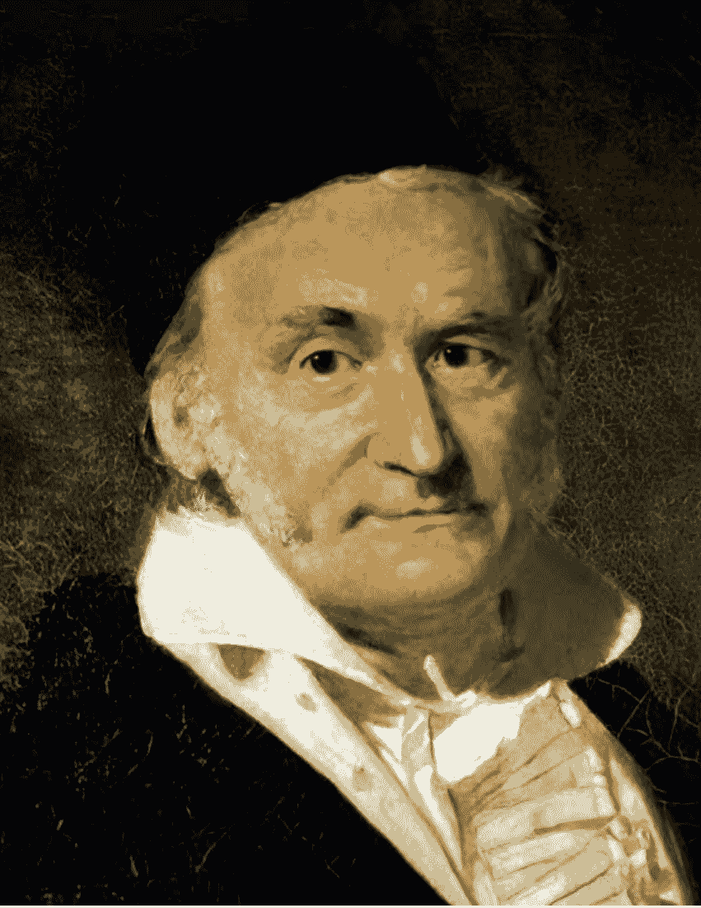

图4.7：卡尔·弗里德里希·高斯

这是德国数学家和哲学家卡尔·弗里德里希·高斯的公共领域艺术作品的照片复制，由G. Biermann（1824-1908）绘制。日期：1887年（绘画）。来源：Gau-Gesellschaft Göttingen e.V.（照片：A. Wittmann）。照片由A. Wittmann拍摄。

## 第四章 在完全理想条件下的回归

## 第5章

## 非正态扰动

在这里，我们考虑了对完全理想条件的违反，非正态扰动。

非正态性和异常值在本章中介绍，它们密切相关，因为与高斯行为的偏离通常表现为比高斯分布更厚的尾部，从而产生异常值。 重要的是要注意，异常值不一定是“坏的”或需要“处理”的。根据定义，每个数据集都必须有一些最极端的观察结果！此外，统计估计的效率随着数据的变异性增加而增加。 最极端的观察结果可能对感兴趣的现象提供最有价值的信息。 相比之下，“坏”的异常值与数据记录错误（例如，你输入.753时实际上是想输入75.3）或一次性事件（例如，罢工或自然灾害）相关。

## 5.0.1 结果

为了在没有正态性的情况下理解OLS的性质，首先考虑在没有正态性的情况下样本均值的性质是有帮助的。

正如第3章所述，对于非高斯简单随机样本，

```
y_t \sim iid(\mu, \sigma^2), i = 1, ..., T,
```

我们知道样本均值是最佳线性无偏估计（BLUE），具有

$$
\overset{a}{\bar{y}} \sim N\left(\mu, \frac{\sigma^2}{T}\right).
$$

这个结果是渐近推断的基础。这是一个高斯中心极限定理。我们使用 $s^2/T$一致估计样本均值的大样本方差。

现在考虑没有正态扰动的完全线性回归模型。我们知道线性回归估计是BLUE，具有

$$
\overset{a}{\hat{\beta}_{OLS}} \sim N\left(\beta, \sigma^2 (X'X)^{-1}\right).
$$

我们使用 $s^2 (X'X)^{-1}$一致估计$\hat{\beta}_{OLS}$的大样本方差。显然，高斯与非高斯情况下的线性回归结果与高斯与非高斯情况下的样本均值完全相同。$^1$在每种情况下，原始结果在放弃正态性时仍然成立，只是变成了大样本而不是精确有限样本的结果。中心极限定理是一件了不起的事情！

## 5.1 评估正态性

有许多方法，从图形到正式测试都有。

$^1$确实如此，因为样本均值对应于截距的回归。参见第4章的EPC 6。

### 5.1.1 QQ图

我们在第2章早些时候介绍了直方图作为了解分布形状的图形工具。然而，如果兴趣集中在分布的尾部，QQ图通常能够更清晰地显示实际分布与参考分布之间的一致性或差异。

QQ图简单地是将标准化数据的分位数绘制在标准化参考分布的分位数上（例如，正态分布）。如果分布匹配，QQ图将是45度线。在QQ图与45度线不匹配的程度上，差异的性质可以提供非常有信息量，例如指示尾部厚重。

### 5.1.2 残差样本偏度和峰度

回顾偏度和峰度，我们在这里为了方便起见进行复制：

```
$S = \frac{E(y - \mu)^3}{\sigma^3}$
```

```
$K = \frac{E(y - \mu)^4}{\sigma^4}$
```

显然，每个都揭示了非正态性的不同方面。峰度，特别是相对于正态分布的分布尾部的胖瘦。一个简单的策略是通过非正式检查 S= 0和 K= 3等残差正态性的各种含义，如$\hat{S}$和$\hat{K}$。

### 5.1.3 Jarque-Bera检验

Jarque-Bera检验（JB）有效地综合了关于偏度和峰度的数据信息，以产生关于 S= 0和 K= 3的联合假设的整体检验，基于$\hat{S}$和 $\hat{K}$。检验统计量为

```
$JB = \frac{T}{6} \left( \hat{S}^2 + \frac{1}{4}(\hat{K} - 3)^2 \right)$
```

在独立正态分布观测值的零假设下 ($S= 0, K= 3$), $JB$ 在大样本中服从 $\chi^2$ 自由度为2的随机变量。²

## 5.2 异常值

异常值指的是总体中的大扰动或样本中的残差。
异常值可能出现的原因多种多样，并且可能需要特别关注，因为它们可能对拟合的回归线产生重大影响。

一方面，在这种异常值情况下，OLS保持其魔力-无论扰动分布如何，它都是最佳线性无偏估计。 另一方面，完全最优（MVUE）估计可能是高度非线性的，因此OLS保持最佳线性无偏估计并不完全令人放心。 事实上，OLS参数估计对异常值的扭曲特别敏感，因为二次最小二乘目标函数真的讨厌大误差（由于平方）并且会尽力倾斜拟合曲面以最小化它们。

如何识别和处理异常值是数据分析中一个历史悠久的问题，没有简单的答案。 如果异常值只是数据记录错误，那么最好将其丢弃，如果无法获取正确的数据。 另一方面，即使是完全“干净”的数据集也会有“最极端的观测值”，但这并不意味着应该将其丢弃。 事实上，最极端的观测值通常是最有信息量的-精确估计需要数据的变化。

²我们已经讨论了观察到的时间序列的情况。 如果被测试正态性的序列是模型的残差，则可以用 $T-K$ 替换 $T$，其中 $K$ 是估计的参数个数，尽管渐近上的区别是无关紧要的。

### 5.2.1 异常值检测

**图形**

在双变量回归情况下，识别异常值的一种明显方法是通过图形：一个 \(xy\) 散点图胜过千言万语。在更高维度中，残差 \(\hat{y}y\) 散点图仍然非常有价值，以及 \(y - \hat{y}\) 的残差图。

**留一法和杠杆**

识别异常值的另一种方法是“留一法”系数图，即使用计算机在样本中逐个排除观测值，检查参数估计值与观测值之间的差异

\(t\) 内部与外部。也就是说，我们以明显的符号表示，检查并绘制 \(\hat{\beta}_{OLS}^{(-t)} - \hat{\beta}_{OLS}\) 的图形 \(t = 1, ..., T\).

然而，可以证明 \(\hat{\beta}_{OLS}\) 的变化是

```
\[\hat{\beta}_{OLS}^{(-t)} - \hat{\beta}_{OLS} = -\frac{1}{1 - h_t} (X'X)^{-1}x_t'e_t,\]
```

其中 \(h_t\) 是“帽子矩阵” \(X(X'X)^{-1}X'\) 的第 \(t\) 个对角元素

因此，估计的系数变化 \(\hat{\beta}_{OLS}^{(-t)} - \hat{\beta}_{OLS}\) 是由 \(\frac{1}{1-h_t} \circ h_t\) 被称为时间杠杆。\(h_t\) 可以证明在 \([0, 1]\) 范围内，因此 \(h_t\) 越大， \(\hat{\beta}_{OLS}^{(-t)} - \hat{\beta}_{OLS}\) 越大。因此，只需要检查杠杆序列，并仔细审查具有高杠杆的观测值。

## 5.3 鲁棒估计

鲁棒估计提供了一个有用的折中方案，既不完全丢弃被认为是异常值的观测数据（“将其排除”），也不什么都不做。在这里，我们介绍了对回归分析进行异常值鲁棒处理的方法。第一种方法是在加权数据上进行OLS回归分析，第二种方法是

### 5.3.1 鲁棒性迭代

在鲁棒性迭代0中的适应度：

```
$\hat{y}^{(0)} = X\hat{\beta}^{(0)}$
```

其中

```
$\hat{\beta}^{(0)} = \argmin\limits_{t=1}^{求和} \left[(y_t - x_t'\beta)^2\right]$
```

在迭代1中的鲁棒性权重：

```
$\rho_t^{(1)} = S\left(\frac{e_t^{(0)}}{6 med|e_t^{(0)}|}\right)$
```

其中

```
$e_t^{(0)} = y_t - \hat{y}_t^{(0)},$
```

而 $S(z)$是一个函数，使得 $S(z)=1$对于 $z \in [-1,1]$但是在该区间之外减小权重。在鲁棒性迭代1中的适应度：

```
$\hat{y}^{(1)} = X\hat{\beta}^{(1)}$
```

其中

```
$\hat{\beta}^{(1)} = \argmin\limits_{t=1}^{求和} \left[\rho_t^{(1)}(y_t - x_t'\beta)^2\right]$
```

按需继续。

### 5.3.2 最小绝对偏差

回想一下，OLS估计器解决

```
$$\min_{\beta} \sum_{t=1}^{T} (y_t - \beta_1 - \beta_2 x_{2t} - ... - \beta_K x_{Kt})^2.$$
```

现在我们只需将目标改为

```
$$\min_{\beta} \sum_{t=1}^{T} |y_t - \beta_1 - \beta_2 x_{2t} - ... - \beta_K x_{Kt}|.$$
```

也就是说，我们从平方误差损失改为绝对误差损失。 我们将新的估计器称为“最小绝对偏差”（LAD）。 通过构造，绝对误差损失下的解决方案不像二次损失下的解决方案那样容易受到异常值的影响。 换句话说，与OLS相比，LAD对异常值更具鲁棒性。

当然，没有什么是免费的，LAD的代价是相对于OLS而言稍微增加了一些计算复杂性。特别是，LAD估计器没有像OLS那样简洁的闭式解析表达式，因此我们不能只是插入一个简单的公式来获得它。相反，我们需要使用计算机直接找到最优的 $\beta$。 如果听起来很复杂，放心，使用现代数值方法，嵌入在现代软件中，这在很大程度上是微不足道的。

## 5.4 工资决定

### 5.4.1 $W$ 年龄

考虑$W$ 年龄 $\rightarrow$ 性别, 教育程度, 工作经验

**残差图**

- 残差散点图
- 残差直方图和统计数据
- 残差高斯 QQ 图
- 杠杆点，	$\{h_t\}, t = 1, ..., T$
- 鲁棒性迭代估计
- $LAD$ 估计

### 5.4.2 $LW$ 年龄

考虑$LW$年龄 $\rightarrow$ 性别, 教育程度, 工作经验

- 残差图
- 残差散点图
- 残差直方图和统计数据
- 残差高斯 QQ 图
- 留一法图
- 鲁棒性迭代
- $LAD$ 估计

## 5.5 练习、问题和补充

1. （塔勒布的《黑天鹅》）

纳西姆·塔勒布是一位金融市场交易员转行的畅销书作家。他的书，《黑天鹅》（Taleb (2007)），涉及了本章提出的许多问题。“黑天鹅”是看似不可能或非常低概率事件 - 毕竟，天鹅应该是白色的 - 在现实中却经常发生。阅读他的书。你对下面的A到B的反应在哪个范围内？

A. 塔勒布为计量经济学家提供了重要的教训，增强了意识，以一种其他方式难以实现。阅读塔勒布之后，很难不担心非正态性、模型不确定性等问题。

B. 塔勒布在数百页中反复强调显而易见的观点，傲慢地“告诉”我们非正态性普遍存在，所有模型都被错误规定等等。此外，需要一个模型来击败另一个模型，而塔勒布提供的帮助很少。

2. (自助法标准误差)

我们可以超越试图使自己对正态性假设的失败更加稳健的程度。相反，使用模拟方法，我们可以接受我们所面临的非正态性（和小样本）的精确性。

3. (“留一出”系数图)

“留一出”系数图对于横截面数据比时间序列数据更合适。为什么？你如何适应它们来处理时间序列数据？

4. 量化“异常值”的其他方法。

+ (a) 考虑异常值概率，

$P|y - \mu| > 5\sigma$

(当然，我们选择5并没有什么神奇之处)。实际上，我们使用样本版本的总体对象。

+ (b) 考虑“尾指数” $\gamma$，使得

$P(y > y^*) = ky^{* - \gamma}$.

实际上，我们使用样本版本的总体对象。

## 5.6 注释

Jarque-Bera检验是由Jarque和Bera（1987）开发的。Koenker（2005）对LAD及其扩展进行了广泛讨论。

# 第6章 随机回归器I：测量误差、遗漏变量和多重共线性

## 6.1 放弃“固定 X”假设

有时在FIC中保持“固定 X”假设在逻辑上是不可能的，例如当 X包含滞后的因变量时。¹无论如何，即使在逻辑上可以保持固定 X假设，它通常感觉不自然，我们希望放松它。

实际上，这与我们如何概念化回归有关。“固定 X”（“固定设计”）更像是一个实验，其中实验者以某种方式“处理”某些主体，他可以并且会在重复样本中以完全相同的方式进行。“随机 X”（“随机设计”）更像是一项观察性研究，其中既不由实验者控制 y也不由实验者控制 X。

如果我们放弃固定的 X假设，那么在一个关键条件下（加上一些关于 X的正则性条件-参见EPC 2），我们之前的许多结果仍然成立。特别地，\(\hat{\beta}_{OLS}\)仍然一致且渐近正态分布，其协方差矩阵仍然一致估计。

关键条件是 $E(X' \varepsilon) = 0$。 在FIC的其余部分，该条件表示 $X$和 $\varepsilon$是独立的。 我们甚至可以放宽正态性和固定的$X$同时成立的条件，只要 $X$和 $\varepsilon$是独立的，我们通常的估计量仍然具有通常的渐近性质。${}^2$注意，从固定的到随机的 $X$的转变在计算$\hat{\beta}_{OLS}$、其样本协方差矩阵和渐近正态性方面没有任何改变。 这是因为推断是在观测到的$X$条件下进行的。但是一切的关键在于正交性条件， $E(X' \varepsilon) = 0$。

注意，在固定 $X$的情况下，我们不需要担心它 - $X$不能与 $\varepsilon$相关，因为它不是随机的，因此不能与任何东西相关。 但在随机 $X$的情况下，有很多需要担心的事情。在这里，我们开始担心。让我们将较弱的条件（具有FIC但没有正态性，并且将“固定 $X$”假设替换为具有 $\varepsilon$和 $X$独立的随机 $X$）称为“理想条件”（IC），与FIC相对。现在我们允许随机 $X$，我们可以引入一些明确涉及随机 $X$矩阵的违规行为。

## 6.2 遗漏变量

我们介绍的许多诊断统计量旨在检测完全理想条件的违规（例如，Durbin-Watson检验用于检测扰动的串行相关性）。 省略相关变量是完全理想条件的另一种违规。

假设DGP是

$$y_t = \beta_1 + \beta_2 z_t + \varepsilon_t,$$

但我们错误地运行了

```
$y \to c, x$
```

其中 $corr(x_t, z_t) > 0$。 显然，我们将在大样本和小样本中都估计出 $x$ 对 $y$ 的正效应，尽管这完全是虚假的，并且如果 $z$ 被包括在回归中，它将消失。 正向偏差的产生是因为在我们的例子中，我们假设 $corr(x_t, z_t) >0$；一般来说，偏差的符号可能是任意的。我们称之为“遗漏变量偏差”。注意IC中的关键破坏：回归中的回归变量和扰动之间独立的假设被违反了。

```
$y \to c, x.$
```

重要的是要注意我们所称之为“预测效应的一致性”和“治疗效应的一致性”的区别。通过运行

```
$y \to c, x$
```

对于给定的观测值 $x$，有助于预测 $y$（“预测效应的一致性”）。 但对于确定 $x$ 的外生变动对 $y$ 的影响是没有用的（真实效应为0！）（“治疗效应的一致性”）。

## 6.3 测量误差

假设DGP是

```
$y_t = \beta_1 + \beta_2 x_t + \varepsilon_t$
```

，但我们无法准确测量 $x_t$。相反，我们测量

```
$x_t^m = x_t + v_t.$
```

将 $v_t$ 视为方差为 $\sigma_v^2$ 的独立同分布的测量误差。（假设它也与 $\varepsilon_t$ 独立。）显然，当 $\sigma_v^2$ 相对于 $\sigma_x^2$ 变大时，拟合的回归

$$y \rightarrow c, x^m$$

逐渐无法准确识别真实关系。当 $\sigma_v^2 / \sigma_x^2 \rightarrow \infty$ 时，这是不可能的。无论如何，$\hat{\beta}_{LS}$ 都会偏向零，在小样本和大样本中都是如此。我们谈论的是“变量误差”问题。

## 6.4 多重共线性

共线性是指两个高度相关的 $x$ 变量。但是所有两两相关可能都很小，但一个 $x$ 变量与其他 $x$ 变量的线性组合高度相关。这引出了多重共线性的概念，其中一个 $x$ 变量与其他 $x$ 变量的线性组合高度相关。因此，共线性是多重共线性的特例，从现在开始我们将简单地谈论多重共线性。

多重共线性有两种类型，完全共线性和不完全共线性。

### 6.4.1 完美多重共线性

完全共线性指的是一些回归变量之间的完全相关性，或者是回归变量的线性组合。完全共线性确实是一个问题；$X'X$ 矩阵是奇异的，所以 $(X'X)^{-1}$  does不存在，OLS估计量甚至无法计算！完全共线性是灾难性的，但是除非你做了一些非常愚蠢的事情，比如两次输入相同的回归变量，否则不太可能发生。$^{3}$ 无论如何，解决方案都很简单：只需删除其中一个冗余变量。

$^{3}$ 一个经典且更复杂的例子涉及“虚拟变量陷阱”，其中我们将一组完整的虚拟变量和一个截距作为回归变量。我们将在第7章和第8章中定义虚拟变量并注意虚拟变量陷阱。

### 6.4.2 不完美多重共线性

不完全多重共线性虽然经常发生，但并不一定是问题，尽管在极端情况下可能需要一些注意。不完全共线性/多重共线性是指一些回归变量之间（不完全）相关，或者是回归变量的线性组合之间的相关。不完全多重共线性并不是指某种错误的“问题”，也不是对Gauss-Markov条件的违反。相反，它只是反映了经济和金融数据的本质。但我们仍然需要意识到它并了解其影响。

显著的症状是大的F和R^2，但是小的t（大的标准误差），和/或对样本期间的小变化敏感的系数。也就是说，OLS在解析个别影响方面存在困难，但很明显存在着总体关系。

OLS在某种意义上就是医生所开的药方-正交投影。

### 6.4.3 更多内容

可以证明，并且非常直观，

$$var(\hat{\beta}_k) = f\left( \sigma^2, \sigma_{x_k}^2, R_k^2 \right)$$

其中 R_k^2 是对其他自变量进行回归后的 R^2。在极限情况下，当 R_k^2 \rightarrow 1时， var(\hat{\beta}_k) \rightarrow \infty，因为 x_k 完全被其他变量“解释”，因此完全多余。R_k^2 实际上是衡量影响 \beta_k 的多重共线性的“强度”的指标。我们经常用“方差膨胀因子”来衡量多重共线性的强度，

$$VIF(\hat{\beta}_k) = \frac{1}{1 - R_k^2},$$

这只是 R_k^2 的一个转换。

## 6.5 练习、问题和补充

- 1. 固定X和滞后的因变量。在第6.1节中，我们声称在存在滞后的因变量的情况下，保持假设的逻辑上是不可能的。为什么？
- 2. 关于X的正则条件。我们在第6.1节中多次提到了关于X的“正则条件”，但没有进一步说明，这些条件对于所声称的各种结果是必需的。在横截面中，对于X iid，足够的正则性将得到满足。在时间序列中，对于X协方差平稳，足够的正则性将得到满足。我们将在第12章中定义和讨论协方差平稳性。它对应于X动态中随时间的某种稳定性。
- 3. 放弃X和ε独立的假设。实际上，我们可以比6.1节更进一步，放宽正态性和固定-X同时满足，甚至在不需要X和ε完全独立的更弱条件下，我们通常的估计量仍然具有通常的渐近性质。我们只需要ε是条件均值和方差与X独立的。更准确地说，在iid X（横截面）情况下，我们需要 E (ε_t|x_t) = 0 和 var (ε_t|x_t) = σ^2，在动态（时间序列）情况下，我们需要 E (ε_t|x_t, x_t-1, ...) = 0 和 var (ε_t|x_t, x_t-1, ...) = σ^2。
- 4. 测量误差与X相关。在第6.3节中，我们考虑了与ε独立的测量误差 v，并且我们认为这种测量误差会使OLS估计量偏向0。如果 v和 ε相关会发生什么？
- 5. 遗漏变量偏误。你如何评估回归是否存在遗漏变量偏误？
- 6. 包含无关变量。另一个违反完全理想条件的情况是包含无关变量。幸运的是，影响很小；一些自由度被浪费，但其他方面没有问题。你如何评估回归中包含的变量是否无关？一组变量？

# 第7章 截面数据中的指标变量：群体异质性

从一个角度来看，我们继续在Gauss-Markov条件下工作。从另一个角度来看，我们现在开始放松Gauss-Markov条件，通过识别原始工资回归中被省略但不应该被省略的RHS变量。

## 7.1 0-1虚拟变量

虚拟变量，或者指示变量，只是一个0-1变量，用于指示某些情况，比如一个人是否是女性、非白人或工会成员。我们使用虚拟变量来解释这种“群体效应”，如果有的话。例如，我们可以定义虚拟变量UNION，如果一个人是工会成员，则为1，否则为0。

$$UNION_t = \begin{cases}
1, & \text{如果观测 } t \text{对应于工会成员} \\
0, & \text{否则。}
\end{cases}$$

在图7.1中，我们展示了所有潜在工资决定因素的直方图和统计数据。教育（EDUC）和经验（EXPER）是标准的连续变量，尽管我们只以离散方式（以年为单位）来衡量它们。

我们之前已经对它们进行了检查，没有什么新的可说的。新的变量是0-1虚拟变量，UNION（已定义）和NONWHITE，其中

$$NONWHITE_t = \begin{cases} 1, & \text{如果观察 } t \text{对应于非白人} \\ 0, & \text{否则。} \end{cases}$$

注意，虚拟变量的样本均值是具有指定属性的样本比例。直方图显示，在我们的样本中，大约五分之一的人是工会成员，大约五分之一是非白人。

我们还有第三个虚拟变量，FEMALE，其中

$$FEMALE_t = \begin{cases} 1, & \text{如果观察 } t \text{对应于女性} \\ 0, & \text{否则。} \end{cases}$$

我们不显示它的直方图，因为显而易见，FEMALE应该是大约1/2的概率为0，1/2的概率为1，而实际上是这样的。

## 7.2 工资回归中的群体虚拟变量

有时候像UNION、NONWHITE和FEMALE这样的虚拟变量被称为截距虚拟变量，因为它们有效地允许每个群体（工会与非工会、非白人与白人、女性与男性）有不同的截距。

回归截距对应于“基准情况”（所有虚拟变量取零值），而虚拟变量的系数则表示当相应的虚拟变量等于一时的额外效应。例如，在一个包含截距和单个虚拟变量（比如UNION）的工资回归中，截距对应于非工会成员，而UNION的估计系数则表示工会成员的额外效应（增加或减少）对于LWAGE。

或者，我们可以为每个类别定义和使用一组完整的虚拟变量（例如，同时包括工会虚拟变量和非工会虚拟变量），并且去掉截距，直接读取工会和非工会的效应。

无论如何，永远不要包括一个完整的虚拟变量集和一个截距。这样做是多余的，因为一个完整的虚拟变量集的总和只是一个单位向量，但这就是截距的作用。如果包括一个截距，必须舍弃一个虚拟变量类别。

回想一下我们的基本工资回归模型，

$$LWAGE \rightarrow c, EDUC, EXPER,$$

如图7.2所示。两个解释变量都非常显著，符合预期的方向。

现在考虑相同的回归模型，但加入我们的三个组别虚拟变量，如图7.3所示。所有虚拟变量都显著，符合预期的方向，而且R²更高。SIC和AIC都支持包括组别虚拟变量。我们在图7.4中展示了残差散点图。当然，这几乎没有什么意义。

> 1我们将在后面详细研究“多重共线性”时，对这些问题进行讨论。

### 图7.2：教育和经验对工资回归

| Variable        | Coefficient | Std. Error | t-Statistic | Prob. |
|-----------------|-------------|------------|-------------|-------|
| C               | 0.867382    | 0.075331   | 11.51431    | 0.0000 |
| EDUC            | 0.093229    | 0.005045   | 18.48002    | 0.0000 |
| EXPER           | 0.013104    | 0.001164   | 11.26208    | 0.0000 |

| R-squared           | 0.232224     | Mean dependent var     | 2.341995 |
| Adjusted R-squared  | 0.231061     | S.D. dependent var     | 0.561435 |
| S.E. of regression  | 0.492318     | Akaike info criterion  | 1.422881 |
| Sum squared resid   | 319.9376     | Schwarz criterion      | 1.434644 |
| Log likelihood      | -938.2358    | Hannan-Quinn criter.   | 1.427291 |
| F-statistic         | 199.6260     | Durbin-Watson stat     | 1.926045 |
| Prob(F-statistic)   | 0.000000     |             |       |

### 图7.3：教育、经验和群体虚拟变量对工资回归

| Variable        | Coefficient | Std. Error | t-Statistic | Prob. |
|-----------------|-------------|------------|-------------|-------|
| C               | 1.000385    | 0.073180   | 13.67013    | 0.0000 |
| EDUC            | 0.090809    | 0.004814   | 18.86314    | 0.0000 |
| EXPER           | 0.012707    | 0.001119   | 11.35624    | 0.0000 |
| FEMALE          | -0.237535   | 0.025965   | -9.148397   | 0.0000 |
| NONWHITE        | -0.085286   | 0.035786   | -2.383199   | 0.0173 |
| UNION           | 0.223392    | 0.035307   | 6.327126    | 0.0000 |

| R-squared           | 0.307856     | Mean dependent var     | 2.341995 |
| Adjusted R-squared  | 0.305229     | S.D. dependent var     | 0.561435 |
| S.E. of regression  | 0.467973     | Akaike info criterion  | 1.323712 |
| Sum squared resid   | 288.4212     | Schwarz criterion      | 1.347239 |
| Log likelihood      | -869.6356    | Hannan-Quinn criter.   | 1.332532 |
| F-statistic         | 117.1568     | Durbin-Watson stat     | 1.910120 |
| Prob(F-statistic)   | 0.000000     |             |       |

图7.4：教育、经验和群体虚拟变量对工资回归的残差散点图

四十五度线（回归 R^2更高，但仍然只有0.31），但它越来越接近。

## 7.3 练习、问题和补充

- 1. (斜率虚拟变量) 考虑回归模型
$$y_t = \beta_1 + \beta_2 x_t + \varepsilon_t.$$
在文本中介绍的虚拟变量模型可以推广为截距项可以在群体之间变化。我们将截距项写为 $\beta_1 + \delta D_t$，而不是 $\beta_1$。我们还可以允许斜率系数随着群体的变化而变化。我们将斜率写成 $\beta_2 + \gamma D_t$，而不是 $\beta_2$。因此，为了捕捉群体间的斜率变化，我们不仅要回归截距和 $x$，还要回归 $D * x$。允许截距和斜率在群体间变化对应于回归截距、$D$、$x$和 $D * x$。
- 2. (虚拟变量 vs. 分开回归) 考虑简单回归，$y_t \rightarrow c, x_{t}$。
    - 包含群体 $G$ 截距虚拟变量与分开回归的概念有什么关系？这两种策略是否等价？为什么？
    - 包含群体 $G$ 截距和斜率虚拟变量与分开回归的概念有什么关系？这两种策略是否等价？为什么？
- 3. (方差分析（ANOVA）和虚拟变量回归) [你应该在之前的统计课程中学过方差分析（ANOVA）。无论如何，有个好消息：如果你理解虚拟变量回归，那么你就理解了方差分析（ANOVA），因为任何方差分析都可以通过虚拟变量回归来完成。所以我们开始吧。] 你处理目前不使用肥料的1000个随机选择的农场之一。你可以什么都不做，或者使用四种实验性肥料之一，A、B、C或D。使用虚拟变量回归设置：
    - (a) 你如何测试四种新肥料都无效的假设？
    - (b) 假设你拒绝了原假设，你如何估计使用肥料A、B、C或D所带来的改善（或恶化）？

## 7.4 注释

方差分析可以追溯到罗纳德·费舍尔于1918年发表的文章《基于孟德尔遗传假设的亲属相关性》，并且在他的经典著作《统计方法用于研究工作者》中得到了突出的展示。费舍尔在很多方面都是现代统计学的“奠基人”。

## 7.5 虚拟变量、方差分析和罗纳德·费舍尔

图7.5：罗纳德·费舍尔

图片来源：来自维基共享资源。来源：http://www.swlearning.com/quant/kohler/stat/biographical_sketches/Fisher_3.jpeg 理由：摄影师已故超过70年 = PD。日期：2008-05-30（原始上传日期）。来源：从en.wikipedia转载。作者：原始上传者是Bletchleyat en.wikipedia。许可（重用此文件）：根据GNU自由文档许可证发布；PD-OLD-70。允许复制、分发和/或修改本文档的条款是由自由软件基金会发布的GNU自由文档许可证的1.2版或任何以后发布的版本；没有不变的章节、没有封面文字和没有封底文字。许可证的副本包含在名为GNU自由文档许可证的部分中。

# 第8章 时间序列中的指标变量：趋势和季节性

我们想要建模的时间序列随时间变化，我们经常将这种变化归因于与趋势和季节性相关的未观察到的基本组成部分。

## 8.1 线性趋势

趋势涉及我们想要建模和预测的变量的缓慢、长期的演变。例如，在商业、金融和经济学中，趋势是由缓慢演变的偏好、技术、机构和人口统计数据产生的。我们在这里将重点放在确定性趋势模型上，其中趋势以完全可预测的方式演变。确定性趋势模型在实践中非常有用。线性趋势是时间的简单线性函数，

$$趋势_t = \beta_1 + \beta_2 * 时间_t$$

指标变量时间是人为构造的，被称为“时间趋势”或“时间虚拟变量”。在样本的第一个时期，时间等于1。第二个时期为2，依此类推。因此，对于样本大小为 T的样本，TIME =(1, 2, 3, ..., T - 1, T)。换句话说，TIME_t = t，因此时间变量仅表示时间。β1是截距；它是时间在t=0时的趋势值。β2是斜率；如果趋势增加，则为正值，如果趋势减少，则为负值。趋势的斜率绝对值越大，趋势越陡峭。例如，在图8.1中，我们展示了两种线性趋势，一种增加，一种减少。增加的趋势的截距为 β1 = -50，斜率为 β2 = .8，而减少的趋势的截距为 β1=10，斜率的绝对值较小，为 β2 = -.25。在商业、金融和经济学中，线性趋势通常是增加的，对应着增长，但不一定总是如此。例如，在最近几十年中，男性劳动力参与率一直在下降，股票交易之间的时间也在缩短。在其他情况下，例如记录（例如马拉松的世界纪录），趋势是明确下降的。

对于线性趋势模型（例如一个序列 y），估计是很容易的。首先，我们需要在计算机上创建并存储变量TIME。幸运的是，我们不需要手动输入TIME的值（1、2、3、4等）；在大多数好的软件环境中，存在一个命令可以自动创建趋势。然后，我们只需运行最小二乘回归 y →c, TIME。

## 8.2 季节性

在上一节中，我们关注了趋势；现在我们将关注季节性。季节性模式是每年重复出现的模式。年度重复可以是精确的，这种情况下我们称之为确定性季节性，或者是近似的，这种情况下我们称之为随机季节性。在这里，我们专门关注确定性季节性模型。

季节性源于技术、偏好和机构与日历的联系。天气（例如每日最高温度）是一个微不足道但非常重要的季节性序列，因为夏天总是比冬天热。任何涉及天气的技术，例如农产品生产，很可能也具有季节性。

偏好也可能与日历相关。例如，考虑汽油销售。人们在夏季更愿意进行更多的度假旅行，这往往会增加夏季汽油销售的价格和数量，这两者都会导致当前美元销售额的增加。

最后，与日历相关的社会机构，如节日，对各种系列的季节性变化负有责任。例如，在西方国家，每年12月的零售商品销售量飙升，圣诞季节。相反，耐用品的销售在12月份下降，因为圣诞购物往往是非耐用品。（你不会给别人买一台冰箱作为圣诞礼物。）

你可能会想象，尽管某些系列由于上述原因而具有季节性，但季节性在商业和经济领域仍然不常见。相反，也许令人惊讶的是，季节性在商业和经济领域普遍存在。例如，许多工业化经济体每年都会迅速扩张。

因此请注意，每年记录一次或不到一次的数据是不可能有季节性的，因此也不是一个问题。

# 第8章 时间序列中的指标变量：趋势和季节性

每年第四季度并在每年第一季度签订合同。

### 8.2.1 季节性虚拟变量

建模季节性的一个关键技术是对季节性虚拟变量进行回归。让 s 表示一年中的季节数。通常我们认为一年有四个季节，但这个概念对我们来说太过限制性。相反，将 s 视为每年系列观察的数量。因此，如果我们有季度数据，则 s=4；如果我们有月度数据，则 s=12；如果我们有周度数据，则 s=52，依此类推。

纯季节性虚拟变量模型为：

季节性 t = ∑_{i=1}^{s} γ_i SEAS_{it}

其中 SEAS_{it} = 如果观察 t 落在季节 i 中，则为1；否则为0。

SEAS_{it}变量被称为季节性虚拟变量。它们只是指示我们处于哪个季节。

操作化模型很简单。假设，例如，我们有季度数据，所以 s=4。然后我们创建四个变量³: SEAS_1 = (1,0,0,0,1,0,0,0,1,0,0,0,...,0)' SEAS_2 = (0,1,0,0,0,1,0,0,0,1,0,0,...,0)' SEAS_3 = (0,0,1,0,0,0,1,0,0,0,1,0,...,0)' SEAS_4 = (0,0,0,1,0,0,0,1,0,0,0,1,...,1)'.

SEAS_1 表示我们是否处于第一季度（第一季度为1，否则为零），SEAS_2 表示我们是否处于第二季度（第二季度为1，否则为零），以此类推。在任何给定的时间，我们只能处于四个季度中的一个，所以一个季节虚拟变量为1，其他都为零。

³为了说明问题，假设数据样本从Q1开始，到Q4结束。

为了估计一个系列 y 的模型，我们只需运行最小二乘回归。

y → SEAS_1, ..., SEAS_s。

实际上，我们只是在一个截距上进行回归，但我们允许每个季节有一个不同的截距。这些不同的截距（即 γ_i）被称为季节因子；它们总结了一年中的季节模式，我们经常希望对它们进行检查和绘图。在没有季节性的情况下，这些截距都是相同的，所以我们可以放弃所有季节虚拟变量，而是以通常的方式包括一个截距。

在时间序列的背景下，通常最自然的做法是包含一个完整的季节虚拟变量集合，而不包含截距项。当然，我们也可以选择包含任意数量的季节虚拟变量和一个截距项。那么常数项就是被省略季节的截距，而季节虚拟变量的系数则表示相对于被省略季节的季节性增加或减少。然而，在任何情况下，我们都不应该同时包含季节虚拟变量和截距项。

包含截距项等价于在回归中包含一个始终为1的变量，但请注意，完整的季节虚拟变量集合的和等于一个始终为1的变量，因此它是完全多余的。

趋势也可以被包含进来。例如，我们可以通过运行⁴来考虑季节性和线性趋势：

y → TIME, SEAS_1, ..., SEAS_s。

实际上，你可以将我们在本节中所做的看作是对上一节内容的推广，上一节中我们只关注趋势。我们仍然希望考虑趋势，如果存在的话，但我们希望扩展模型以考虑季节性。

### 8.2.2 更一般的日历效应

季节性的概念可以扩展以允许更一般的日历效应。“标准”季节性只是一种日历效应的类型之一。另外两种重要的日历效应是假日变化和交易日变化。

假日变化指的是一些假日的日期随时间变化的事实。也就是说，尽管它们每年大致在同一时间到来，但确切的日期不同。复活节是一个常见的例子。因为许多系列的行为，如销售、出货、库存、工作小时等，部分取决于这些假日的时间安排，我们可能希望在我们的预测模型中跟踪它们。与季节性一样，假日效应可以用虚拟变量来处理。例如，在一个月度模型中，除了一整套季节性虚拟变量之外，我们可能还包括一个“复活节虚拟变量”，如果该月包含复活节则为1，否则为0。

交易日变动是指不同月份包含不同数量的交易日或工作日，这是建模和预测某些系列时的重要考虑因素。例如，在伦敦证券交易所的月度预测模型中，除了一整套季节性虚拟变量之外，我们可能还会包括一个交易日变量，该变量每个月的值是该月的交易日数量。

更一般地说，您可以通过构建和包含一个或多个适当的虚拟变量来建模任何类型的日历效应。

## 8.3 酒类销售中的趋势和季节性

我们将通过一个关于酒类销售的应用来说明趋势和季节性建模。数据以月为单位进行测量。

图8.2显示了酒类销售的时间序列，清晰地显示了趋势（销售额增加）和季节性（圣诞节期间销售额飙升）。主要是季节性因素等等）

我们在图8.3中展示了对数酒类销售额；我们取对数是为了稳定方差，因为方差随时间增长。⁵对数酒类销售额具有更稳定的方差，这是我们将建立模型的系列。⁶

线性趋势估计结果显示在表8.4中。趋势是增长的，并且非常显著。调整后的 R²为84%，反映了趋势在酒类销售变动中的重要性。

然而，残差图（图8.5）表明线性趋势是不足够的。相反，对数酒类销售额的趋势呈非线性，而被忽视的非线性被转储到残差中。（我们将在后面介绍非线性趋势。）残差图还显示了明显的残差季节性。德宾-沃森统计量没有发现它，显然是因为它不具备对季节性动态的检测能力。⁷

在图8.6中，我们展示了具有线性趋势模型的估计结果和季节性虚拟变量。（注意我们去掉了截距！）季节性虚拟变量非常显著，并且在许多情况下彼此之间显著不同。R²更高。

在图8.7中，我们展示了相应的残差图。现在模型捕捉到了很多季节性，如季节性拟合序列和非季节性残差所反映的那样。

在图8.8中，我们绘制了估计的季节模式，在冬季假期期间达到高峰。

所有这些结果都是粗略的近似，因为线性趋势明显不足够。随后我们将考虑更复杂的（非线性）趋势。

⁵对数变换的性质是“压缩”了增加的方差。制作一个以x为自变量的 log(x)的图表，你就会明白为什么了。
⁶从这一点开始，为了简洁起见，我们将简单地称之为“酒类销售”，但请记住我们已经取了对数。
⁷回想一下，Durbin-Watson检验旨在检测简单的 AR(1)动态。它还具有检测其他类型动态的能力，但显然不适用于当前应用中的动态，因为它们与简单的 AR(1)非常不同。

## 8.4 练习、问题和补充

- 1. （趋势估计和去趋势的机制）
从网络上获取美国实际GDP的季度时间序列，跨越过去四十年，以Q4结束。
a. 生成一个时间序列图并讨论。

| 变量 | 系数 | 标准误差 | t统计量 | 概率 |
| :--- | :--- | :--- | :--- | :--- |
| C | 6.454290 | 0.017468 | 369.4834 | 0.0000 |
| 时间 | 0.003809 | 8.98E-05 | 42.39935 | 0.0000 |
| R平方 | 0.843318 | 平均因变量 | 7.096188 | |
| 调整后的R平方 | 0.842849 | 因变量的标准差 | 0.402962 | |
| 回归的标准误差 | 0.159743 | 赤池信息准则 | -0.824561 | |
| 平方残差和 | 8.523001 | 施瓦茨准则 | -0.801840 | |
| 对数似然 | 140.5262 | 汉南-奎因准则 | -0.815504 | |
| F统计量 | 1797.705 | 达宾-沃森统计量 | 1.078573 | |
| F统计量的概率 | 0.000000 | | | |

**图8.4：线性趋势估计**

- b. 拟合线性趋势。讨论估计结果和残差图。
- c. 残差中是否存在季节性的证据？为什么或为什么不？
- d. 你拟合模型的残差实际上是原始序列的线性去趋势版本。为什么？讨论。

- 2. (季节性调整)
就像我们有时想要从一系列中去除趋势一样，有时我们想要在对其建模之前对一系列进行季节性调整。可以使用各种方法进行季节性调整。
- a. 详细讨论如何使用线性趋势加季节虚拟变量模型对系列进行季节调整。
- b. 使用线性趋势加季节虚拟变量模型对对数酒类销售数据进行季节调整。讨论季节调整系列中存在和不存在的模式。
- c. 在网络（或图书馆）上搜索有关最新的美国人口普查局季节调整程序的信息，并报告你所了解到的。

- 3. （处理复杂的日历效应）
描述如何构建一个纯粹的季节性模型，用于以下月度系列。特别是，你会使用哪些虚拟变量来捕捉相关效应？
- a. 一家体育用品店怀疑去趋势化的月销售额在给定的三个月季节中大致相同。例如，冬季的一月、二月和三月的销售额相似，春季的四月、五月和六月的销售额也相似，依此类推。
- b. （学术日历效应）一个大学书店怀疑去趋势化的月销售额在大学学期的开始和结束时更高。例如，一月、五月和九月，即第一、第二和第三个学期的第一个月的销售额相似。
- c. （交易日效应）一位金融市场交易员怀疑去趋势化的交易量取决于每个月的交易日数量，而这在不同的月份之间有所不同。
- d. （时变节假日效应）一个糖果制造商怀疑去趋势化的糖果销售在复活节时倾向于上升。

- 4. （季节性检验）使用对数酒类销售数据：
- a. 按照本章的方法，构建并估计一个包含完整一组季节性哑变量的模型。
- b. 检验无季节性变化的假设。讨论。
- c. 检验1月至4月季节性因子的相等性。讨论。
- d. 检验5月至11月季节性因子的相等性。讨论。
- e. 估计一个适当的“修剪”模型，其中包含少于12个季节性哑变量，但仍然能够充分捕捉季节性模式。

## 8.5 笔记

Nerlove等人（1979）和Harvey（1991）讨论了各种趋势和季节性模型。

两种最常见和重要的“官方”季节调整方法是X-12-ARIMA和TRAMO-SEATS。X-12-ARIMA是来自美国人口普查局的，TRAMO-SEATS是来自西班牙银行的。

# 第9章 交叉截面中的非线性函数形式

一般来说，条件均值函数没有理由是线性的。也就是说，适当的函数形式可能不是线性的。线性是否提供了足够的近似是一个经验问题。

非线性与非正态性有关，我们在第9章中研究过。特别是在多元正态情况下，条件均值函数在条件变量中是线性的。但一旦我们离开多元正态的领域，一切都有可能。条件均值函数和扰动可以是线性和高斯的，非线性和高斯的，线性和非高斯的，或非线性和非高斯的。

在高斯情况下，因为条件均值是条件变量的线性函数，它与线性投影重合。然而，在非高斯情况下，线性投影最好被视为通常非线性条件均值函数的近似。也就是说，我们可以将线性回归模型视为通常非线性条件均值函数的线性近似。有时线性近似可能是足够的，有时则不是。

## 9.1 转换变量线性模型

模型可以是非线性的，但在非线性转换变量中仍然是线性的。一个重要的例子涉及对数，现在我们来讨论一下。这可以非常方便。此外，系数的解释是特殊的，同样也很方便。

### 9.1.1 对数

对数将乘法模型变为加法模型，并且中和指数函数。
对数模型虽然是非线性的，但在对数中是“线性的”。除了将某些非线性模型变为线性模型外，它们还可以用于强制左侧变量的非负性和稳定扰动方差。（稍后会详细介绍。）

**对数-对数回归**
首先，考虑对数-对数回归。我们将其写出来，以简单的回归情况为例，但当然我们可以有多个解释变量。我们有：

ln y_t = β_1 + β_2 ln x_t + ε_t

y_t 是 x 的非线性函数，但该函数在对数中是线性的，因此可以应用最小二乘法。

以一个简单的例子来说明，考虑一个柯布-道格拉斯生产函数，其中产出是劳动力和资本的函数，

y_t = A L_t^α K_t^β exp(ε_t)

直接估计参数 A，α，β 需要特殊的技术。
然而，取对数后得到

ln y_t = ln A + α ln L_t + β ln K_t + ε_t

这个转换后的模型可以立即通过普通最小二乘法进行估计。我们只需对截距、lnL和lnK进行简单的回归。这种对数-对数回归经常捕捉到相关的非线性，同时保持普通最小二乘法的便利性。

请注意，估计的截距是对lnA的估计（而不是A），所以如果你想要对A进行估计，你必须对估计的截距进行指数化，而其他估计的参数则是对α和β的估计，正如所期望的那样。

请记住，对于接近的 y 和 x，（ln y - ln x）大约是 y 和 x 之间的百分比差异。因此，对数-对数回归中的系数给出了在 x 变化1%时，E(y|x) 的预期百分比变化，也就是所谓的 y 相对于 x 的弹性。

**对数-线性回归。**
其次，考虑对数线性回归，其中 ln y_t = β x_t + ε。我们在左边有一个对数，但在右边没有。经典的例子涉及指数增长的工作模型：

y_t = A e^{rt}

由于指数的存在，它是非线性的，但取对数后变为线性的

ln y_t = ln A + rt

这是线性的。增长率 r 给出了时间变化一个单位时 E(y_t|t) 的近似百分比变化。

**线性对数回归**
最后，考虑线性对数回归：

y_t = β ln x_t + ε

这有点奇特，但有时会出现。β给出了当 x_t 变化百分之一时，对 E(y_t|x_t) 的影响，因为对数只出现在右边。

### 9.1.2 Box-Cox和GLM

**Box-Cox**

Box-Cox变换推广了对数线性回归。我们有：

B(y_t) = β_1 + β_2 x_t + ε_t

其中

B(y_t) = (y_t^λ - 1) / λ

因此

E(y_t|x_t) = B^{-1}(β_1 + β_2 x_t)

因为

lim_{λ → 0} ((y^λ - 1) / λ) = ln(y_t)

Box-Cox模型对应于特殊情况下的对数线性模型 λ = 0。

**广义线性模型**

所谓的“广义线性模型”（GLM）提供了一个更加灵活的框架。几乎所有左侧变量转换的模型都是广义线性模型（GLM）中允许的特殊情况之一。在GLM中，我们有：

G(y_t) = β_1 + β_2 x_t + ε_t

以便

E(y_t|x_t) = G^{-1}(β_1 + β_2 x_t)

可以考虑广泛的“链接函数” G 类。例如，当 G(y_t) = ln(y_t) 时，出现对数线性回归，当 G(y_t) = (y_t^{λ} - 1) / λ 时，出现Box-Cox回归。

## 9.2 内在非线性模型

有时我们会遇到内在非线性模型。也就是说，无法将它们转化为线性模型，因此无法像我们迄今为止一直做的那样通过最小二乘法简单估计它们。以逻辑模型为例，

y = 1 / (a + b r^x)

满足 0 < r < 1。当然，逻辑曲线的精确形状取决于 a, b 和 r 的精确值，但其“S形”通常很有用。对于我们目前的目的，关键点在于没有简单的变换可以使得 y 的模型线性化。

### 9.2.1 非线性最小二乘法

最小二乘估计常被称为“普通”最小二乘法，或OLS。正如我们之前看到的，OLS估计器具有简单的闭式解析表达式，这使得在现代计算机上实现变得微不足道。它的计算速度快且可靠。

形容词“普通”将普通最小二乘法与寻找使得残差平方和最小化的参数配置的更繁琐的策略区分开来，例如非线性最小二乘法（NLS）估计器。当我们使用非线性最小二乘法进行估计时，我们使用计算机直接找到使残差平方和最小化的最小值，使用数值方法，通过尝试许多（也许数百甚至数千个）不同的 β 值，直到找到那些似乎最小化残差平方和的值。这不仅更加繁琐（因此速度较慢），而且不太可靠，例如，可能会得到一个局部但不是全局的最小值。

那么为什么有人会使用非线性最小二乘法而不是OLS？确实，当OLS可行时，我们通常更喜欢它。例如，在迄今讨论的所有回归模型中，OLS是适用的，所以我们更喜欢它。然而，本质上非线性模型无法使用OLS进行估计，但可以使用非线性最小二乘法进行估计。在这种情况下，我们采用非线性最小二乘法。

本质上非线性模型显然违反了FIC的线性假设。但这个违反并不是什么大问题。在剩余的FIC下（即仅放弃线性），\hat{\beta}_{NL} 具有类似于FIC下的抽样分布。

## 9.3 级数展开

实际上并不存在本质上非线性的模型...

在双变量情况下，我们可以将关系看作是：

y_t = g(x_t, ε_t)

或稍微不那么一般化的形式

y_t = f(x_t) + ε_t

**泰勒**
首先考虑 f(x_t)的泰勒级数展开。

线性（一阶）近似为：

f(x_t) ≈ β_1 + β_2 x_t,

二次（二阶）近似为：

f(x_t) ≈ β_1 + β_2 x_t + β_3 x_t^2.

## 9.3. 级数展开

在多元回归情况下，泰勒近似也涉及交互项。例如，考虑 $f(x_t, z_t)$:

$$f(x_t, z_t) \approx \beta_1 + \beta_2 x_t + \beta_3 z_t + \beta_4 x_t^2 + \beta_5 z_t^2 + \beta_6 x_t z_t + ....$$

在涉及虚拟变量的情况下，这种相互作用效应也是相关的。在这里，我们通过包括虚拟变量的乘积来捕捉相互作用。关键见解：

最终的观点是，所谓的“本质上非线性”的模型在从级数展开的角度看是线性的。原则上，当然需要无限多个级数项，但在实践中，非线性通常相当平缓（例如二次方程），因此只需要几个级数项。

- 因此，非线性在某种意义上真的是一个遗漏变量的问题

### 傅里叶

$$f(x_t) \approx \beta_1 + \beta_2 \sin(x_t) + \beta_3 \cos(x_t) + \beta_4 \sin(2x_t) + \beta_5 \cos(2x_t) + ...$$

- 人们还可以通过回归不仅仅在幂和交叉乘积上（“泰勒项”），还在各种正弦和余弦上（“傅里叶项”）混合泰勒和傅里叶逼近。

混合可能有助于简化。

> 注意，如果个体虚拟变量都为1，那么虚拟变量的乘积也为1。

## 9.4 关于非线性和FIC的最后一句话

有趣的是退后一步，问一下我们的各种非线性模型中违反了FIC的哪些部分。

在转换后的变量上线性的模型（例如，对数-对数回归）实际上并不违反FIC。如果采用的展开阶数被认为是正确的，那么级数展开模型也不违反FIC，因为它们也是在转换后的变量上线性的。

处理非线性的级数方法实际上非常通用，也可以处理本质上非线性的模型，而且在实践中，低阶展开通常是足够的，即使在理论上需要无限展开。如果需要级数项，一个纯线性模型会因为省略了高阶展开项而导致 X 矩阵的错配（违反了FIC）。因此，本章讨论的FIC的失败可以被视为以下两种情况之一：

- 1. 线性假设 ($E(y|X) = X'\beta$) 是错误的，或者
- 2. 线性假设 ($E(y|X) = X'\beta$) 是正确的，但是假设 $X$ 被正确规范化（即没有遗漏变量）是错误的，因为遗漏了高阶展开项。

## 9.5 选择非线性模型

### 9.5.1 $t$和 $F$检验，以及信息准则

在嵌套情况下，可以使用常规的 $t$和 $F$检验来测试线性模型与非线性替代模型之间的差异，并使用信息准则 ($AIC$和 $SIC$)来测试非嵌套情况下的非线性替代模型。例如，在简单回归情况下，为了测试线性性与二次替代模型之间的差异，我们可以简单地运行 $y \rightarrow c, x, x^2$并进行 $t$检验以检验 $x^2$的相关性。

当然，像往常一样使用 $AIC$和 $SIC$。

### 9.5.2 RESET检验

直接在回归中包含各种X变量的幂和交叉项可能会浪费自由度，特别是如果回归中除了一个或两个右侧变量之外还有更多变量，或者非线性程度很严重，以至于需要较高的幂和交互项来捕捉它。

基于此，一个有用的策略是首先拟合一个线性回归$y_t \to c, X_t$并获得拟合值$\hat{y}_t$。然后，为了测试非线性，我们再次运行回归，包括各种幂的$\hat{y}_t$。

$$y_t \to c, X_t, \hat{y}_t^2, ..., \hat{y}_t^m$$

请注意，$\hat{y}_t$的幂次是$\hat{y}_t$的幂次和交叉乘积的线性组合 - 正是医生所要求的。不需要包括$\hat{y}_t$的一次幂，因为那将与包括的X变量重复。相反，我们包括幂次$\hat{y}_t^2$, $\hat{y}_t^3$, ...通常一个小的m就足够了。可以使用F检验来检查包括的$\hat{y}_t$幂次集的显著性。这个过程被称为RESET（回归规范误差检验）。

## 9.6 工资决定中的非线性

为了方便起见，我们在图9.1中重现了我们当前线性工资回归的结果。

$$LWAGE \to c, EDUC, EXPER, FEMALE, UNION, NONWHITE$$

从该回归的RESET检验表明存在被忽视的非线性；在RESET检验回归中使用$\hat{y}_t^2$和$\hat{y}_t^3$时，p值为0.03。

EDUC和EXPER的非线性：幂和交互作用

根据RESET检验的结果，我们继续考虑非线性。
在图9.2中，我们展示了二次回归的结果

$$LWAGE \to EDUC, EXPER, EDUC^2, EXPER^2, EDUC*EXPER, FEMALE, UNION, NONWHITE$$

两个非线性效应是显著的。经验的影响是递减的，并且经验似乎与教育相互抵消，因为交互作用是负的。

$FEMALE$，$UNION$和$NONWHITE$的非线性：交互作用就像连续变量如$EDUC$和$EXPER$可以相互作用一样（我们发现它们确实可以），离散的虚拟变量也可以相互作用。例如，作为女性和非白人的工资影响可能不仅仅是个体效应的总和。我们将其估计为个体虚拟变量$FEMALE$和$NONWHITE$的系数之和加上系数

# 9.6. 工资决定中的非线性

| Variable | Coefficient | Std. Error | t-Statistic | Prob. |
|----------|-------------|------------|-------------|-------|
| C        | 0.473236    | 0.240586   | 1.967017    | 0.0494 |
| EDUC     | 0.109673    | 0.028918   | 3.792608    | 0.0002 |
| EXPER    | 0.064422    | 0.007652   | 8.419060    | 0.0000 |
| EDUC2    | 0.000501    | 0.000895   | 0.559994    | 0.5756 |
| EXPER2   | -0.000705   | 8.86E-05   | -7.962263   | 0.0000 |
| EDU_EXP  | -0.001789   | 0.000429   | -4.173423   | 0.0000 |
| FEMALE   | -0.237696   | 0.025506   | -9.319335   | 0.0000 |
| UNION    | 0.202955    | 0.034569   | 5.870998    | 0.0000 |
| NONWHITE | -0.095028   | 0.034931   | -2.720476   | 0.0066 |

图9.2：二次工资回归

在交互虚拟变量$FEMALE*NONWHITE$中。

在图9.4中，我们展示了结果

$$LWAGE \rightarrow EDUC, EXPER, FEMALE, UNION, NONWHITE, FEMALE*UNION, FEMALE*NONWHITE, UNION*NONWHITE.$$

虚拟交互作用是不显著的。

### 9.6.1 连续和离散变量的非线性同时

现在让我们在$EDUC$和$EXPER$中加入幂和交互作用，以及在$FEMALE$，$UNION$和$NONWHITE$中的交互作用。在图9.4中，我们展示了结果

$$LWAGE \rightarrow EDUC, EXPER, EDUC^2, EXPER^2, EDUC*EXPER, FEMALE, UNION, NONWHITE, FEMALE*UNION, FEMALE*NONWHITE, UNION*NONWHITE.$$

| Variable | Coefficient | Std. Error | t-Statistic | Prob. |
|----------|-------------|------------|-------------|-------|
| C        | 1.011503    | 0.073797   | 13.70657    | 0.0000 |
| EDUC     | 0.090805    | 0.004819   | 18.84231    | 0.0000 |
| EXPER    | 0.012674    | 0.001120   | 11.31689    | 0.0000 |
| FEMALE   | -0.257621   | 0.030125   | -8.551814   | 0.0000 |
| UNION    | 0.216911    | 0.047498   | 4.566771    | 0.0000 |
| NONWHITE | -0.157606   | 0.056446   | -2.792173   | 0.0053 |
| FEM_UNI  | 0.003921    | 0.072024   | 0.054439    | 0.9566 |
| FEM_NON  | 0.125567    | 0.071781   | 1.749313    | 0.0805 |
| UNI_NON  | 0.017743    | 0.091336   | 0.194258    | 0.8460 |

虚拟交互作用仍然不显著。

请注意，我们可以探索EDUC,EXPER和各种虚拟变量之间的其他交互作用。我们将留给读者来处理。

汇总所有结果，到目前为止，我们的初步“最佳”模型是第9.6节的模型。

$$LWAGE \rightarrow EDUC, EXPER, EDUC^2, EXPER^2, EDUC*EXPER, FEMALE, UNION, NONWHITE.$$

RESET统计量的p值为0.19，因此我们不会拒绝充分性。

图9.4: 具有连续非线性和交互作用以及离散交互作用的工资回归

在传统水平上的函数形式。

## 9.7 练习、问题和补充

- 1. (非线性与线性关系)
  美国国会预算办公室（CBO）正在帮助总统制定税收政策。特别是，总统要求在哪里设置平均税率以最大化每个纳税人的税收收入。对于23个国家，CBO已经获得了纳税人每人纳税收入和平均税率的数据。税收可能与税率有关吗？这种关系可能是线性的吗？（提示：在零税率下将收集多少税收？百分之五十？百分之一百？）

- 2. (图形回归诊断： $e_t$与 $x_t$的散点图)
  这个图可以帮助我们评估y和一组 x之间的关系是否真的是线性的，就像线性回归分析中所假设的那样。如果不是的话，线性回归的残差将依赖于 $x$。在只有一个自变量的情况下，如上所示，我们可以简单地制作一个 $e_t$ 与 $x_t$ 的散点图。当有多个自变量时，我们可以为每个变量制作单独的图表，尽管这个过程会失去一些简单和透明度。

- 3. （非线性优化的困难）
  非线性优化可能是一个棘手的问题，充满了问题。有些问题是通用的。例如，找到一个局部最优解相对容易，但要确定局部最优解是否是全局最优解则更加困难。常规的简单检查，如尝试各种初始值并检查收敛到的最优解，虽然经常被使用，但问题仍然存在。其他问题可能是软件特定的。例如，某些软件可能使用高精度的解析导数，而其他软件使用近似的数值导数。即使是同一个软件包在不同版本中也可能改变算法或实现细节，导致不同的结果。

- 4. （条件均值函数）
  考虑回归模型，
  $y_t = \beta_1 + \beta_2 x_t + \beta_3 x_t^2 + \beta_4 z_t + \varepsilon_t$
  在完全理想的条件下。找出在给定条件下 $y$ 的均值，其中 $x_t = x_t^*$ 和 $z_t = z_t^*$。在 $(x_t^*, z_t^*)$ 中，条件均值是否是线性的？

- 5. (OLS vs. NLS)
  考虑以下三个回归模型：
  $y_t = \beta_1 + \beta_2 x_t + \varepsilon_t$
  $y_t = \beta_1 e^{\beta_2 x_t} \varepsilon_t$
  $$ y_t = \beta_1 + e^{\beta_2 x_t} + \varepsilon_t $$
  a. 对于每个模型，确定是否可以使用OLS进行估计（可能需要转换数据），或者是否需要使用NLS。
  b. 对于那些可以使用OLS的模型，你是否期望NLS和OLS的估计结果完全一致？为什么或为什么不？
  c. 对于那些“需要”使用NLS的模型，展示如何通过级数展开来避免使用NLS。

- 6. (图形回归诊断：$e_t$与$x_t$的散点图)
  这个图可以帮助我们评估 $y$ 与一组 $x$ 之间的关系是否真正是线性的，就像线性回归分析中所假设的那样。如果不是的话，线性回归的残差将取决于 $x$。在只有一个自变量的情况下，我们可以简单地绘制 $e_t$ 与 $x_t$ 的散点图。当有多个自变量时，我们可以为每个自变量绘制单独的图，尽管这个过程会失去一些简洁和透明度。

- 7. (线性回归到底在估计什么？)
  重要的是要注意条件均值和线性投影之间的区别。条件均值不一定是条件变量的线性函数。线性投影是根据条件变量的线性函数构建的。
  最好将线性投影视为通常非线性条件均值函数的近似。也就是说，我们可以将经验线性回归视为估计总体线性投影，而总体线性投影又是总体条件期望的近似。
  有时线性投影可能是一个足够的近似，有时则不是。

- 8. 将许多事物放在一起。
  考虑我们广泛研究过的横截面（对数）工资方程，在图9.5中再次出现供您参考。
  (a) 该模型使用普通最小二乘法（OLS）进行估计。在计算OLS估计时，优化的是哪个损失函数？（给出一个公式和一个图表）OLS估计器的公式（如果有的话）是什么，以及在完全理想条件（FIC）下，它的确切有限样本分布是什么？
  (b) 考虑使用数值方法（即NLS）而不是分析方法（即OLS）来估计相同的模型。在计算NLS估计时，优化的是哪个损失函数？（给出一个公式和一个图表）NLS估计器的公式（如果有的话）是什么，以及在完全理想条件（FIC）下，它的确切有限样本分布是什么？
  (c) 估计的方程是否表明工会地位对于对数工资有统计显著影响？经济上重要的影响吗？对于UNION的估计系数的精确解释是什么？如果工资没有取对数，解释会如何改变？
  (d) F统计量测试的是哪个假设？它与哪两个OLS回归相关的受限和不受限残差平方和是什么？
  (e) 考虑一个额外的回归变量AGE，其中AGE = 6 + EDUC + EXPER。（这个想法是早期6年的童年，加上EDUC年的教育，再加上EXPER年的工作经验，在某些假设下，应该等于一个人的年龄。）讨论将AGE添加到回归中可能产生的影响，如果有的话。
  (f) 对数工资当然可能不是EDUC和EXPER的线性函数。你如何评估二次非线性效应的可能性？使用t检验？F检验？Schwarz准则（SIC）？R²？
  (g) 假设你发现对数工资关系确实是非线性的，但仍然非常简单，除了图9.5中的变量之外，只有EXPER²参与。$\frac{\partial E(\text{LWAGE} | X)}{\partial \text{EXPER}}$ 是多少？在扩展模型中是什么？与图9.5中的原始模型相比，它如何比较？图9.5中的原始模型的经济解释是什么？这两个导数的经济解释是什么？(X指的是回归中包含的全部右侧变量集。)
  (h) 返回到图9.5中的原始模型。如何使用Durbin-Watson统计量评估拟合模型的整体适应性？回归的标准误差？模型残差？哪个可能最有用/信息丰富？
  (i) 考虑通过分位数回归（QR）来估计模型，而不是OLS或NLS。在计算QR估计时，优化的是哪个损失函数？(给出一个公式和一个图表) QR估计器的公式是什么（如果有的话）？最小绝对偏差（LAD）估计器与QR估计器有什么关系？在FIC下，OLS和LAD估计值是否很接近？为什么或为什么不接近？
  (j) 讨论如何通过使用线性时间趋势变量和一组季节虚拟变量来纳入趋势和季节性。

# 第9章。横截面中的非线性函数形式

图9.5：回归输出

# 第10章 时间序列中的非线性和结构性变化

在时间序列中，非线性趋势是一个核心问题。在这里我们重点关注它。

## 10.1 指数趋势

指数增长在水平上是非线性的，但在对数上是线性的，这让我们想到指数趋势或对数线性趋势，在商业、金融和经济学中非常常见。指数趋势之所以常见，是因为经济变量通常显示出大致恒定的实际增长率（例如，每年2%）。如果趋势以恒定的增长率 β₂ 来描述，那么我们可以写成

$$趋势_{t} = \beta_{1} e^{\beta_{2}时间_{t}}$$

趋势是时间的非线性（指数）函数，在水平上，但在对数中，我们有

$$\ln(趋势_{t}) = \ln(\beta_{1}) + \beta_{2}时间_{t} \qquad\qquad\qquad(10.1)$$

因此，$\ln(趋势_{t})$是时间的线性函数。

> 在本书中，对数是自然对数（以e为底）对数。

# 第10章 时间序列中的非线性和结构性变化

在图10.1中，我们展示了根据参数可以获得的各种指数趋势形状。根据参数值的符号和大小，指数趋势可以实现各种模式，以不同的速度增长或减少。

尽管指数趋势模型是非线性的，但我们可以通过简单的最小二乘回归来估计它，因为在对数中是线性的。我们只需运行最小二乘回归，$\ln y \rightarrow c$, 时间。请注意，因为方程（10.1）中的截距不是$\beta_1$，而是$\ln(\beta_1)$，所以我们需要对估计的截距进行指数化，以获得$\beta_1$的估计值。同样，这个回归的拟合值是$\ln y$的拟合值，所以它们必须进行指数化，以获得$y$的拟合值。这是必要的，例如，为了适当地比较估计的指数趋势模型的拟合值或残差（或基于残差的统计量，如$AIC$和$SIC$）与其他趋势模型的拟合值或残差。

需要注意的是，尽管二次和指数趋势可以实现相同类型的定性趋势形状，但它们之间存在微妙的差异。某些系列中的非线性趋势可以很好地用二次趋势近似，而其他系列中的趋势则更适合用指数趋势近似。最终，哪种趋势在特定应用中最好是一个实证问题。

## 10.2 二次趋势

有时候趋势呈现非线性或曲线状，例如当变量以递增或递减的速度增加时。最终，我们并不要求趋势是线性的，只要它们是平滑的即可。

我们可以通过包括不仅是时间，还有时间²来考虑轻微的曲率。

$$ 趋势_t = \beta_1 + \beta_2 时间_t + \beta_3 时间_t^2 $$

这被称为二次趋势，因为趋势是时间的二次函数。²当 $\beta_3=0$ 时，线性趋势成为一个特殊（潜在的限制性）情况。

根据系数的符号和大小，可以得到各种不同的非线性二次趋势形状；我们在图10.2中展示了几个。特别地，如果 $\beta_2 >0$ 且 $\beta_3 >0$，如左上方的面板所示，趋势是单调但非线性增加的；相反，如果 $\beta_2 <0$ 且 $\beta_3 <0$，趋势是单调递减的。如果 $\beta_2 <0$ 且 $\beta_3 >0$，趋势呈现U形状；如果 $\beta_2 >0$ 且 $\beta_3 <0$，趋势呈现倒U形状。请记住，二次趋势用于提供局部近似；例如，很少会出现“U形”趋势。相反，所有数据可能都位于“U”形的一侧或另一侧。

> 估计二次趋势模型并不比估计线性趋势模型更难

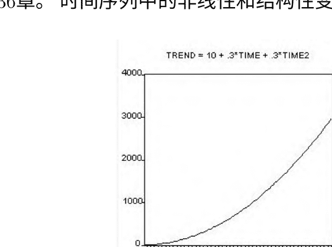

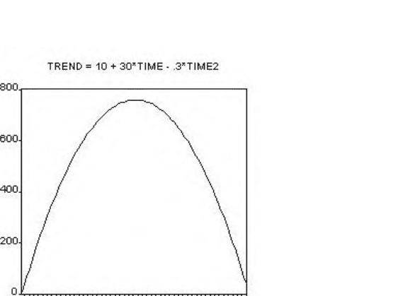

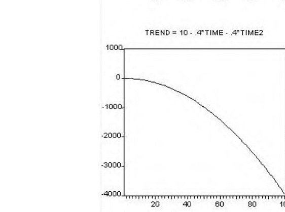

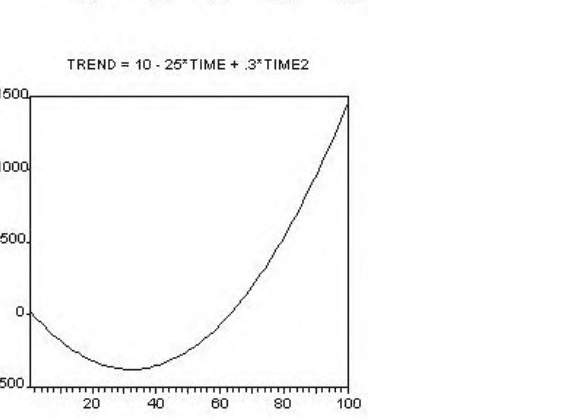

图10.2：各种二次趋势

趋势模型。我们首先创建时间及其平方；称之为时间2，其中时间2_t = 时间_t^2。因为时间 = (1, 2, ..., T)，时间2 = (1, 4, ..., T^2)。然后我们简单地运行最小二乘回归 y → c, 时间, 时间2。特别要注意的是，尽管二次函数是非线性的，但在变量时间和时间2中是线性的。

## 10.3 更多关于非线性趋势的内容

趋势回归技术是一种估计趋势的方法之一。另外两种方法涉及无模型平滑技术。它们是移动平均平滑器和霍德里克-普雷斯科特平滑器。我们在这里简要介绍它们。

### 10.3.1 移动平均趋势和去趋势

我们将重点关注三种方法：双边移动平均、单边移动平均和单边加权移动平均。

用 $\{y_t\}_{t=1}^{T}$ 表示原始数据，用 $\{s_t\}_{t=1}^{T}$ 表示平滑数据。那么，双边移动平均是

$$s_t = (2m + 1)^{-1} \sum_{i=-m}^{m} y_{t-i},$$

单边移动平均是

$$s_t = (m + 1)^{-1} \sum_{i=0}^{m} y_{t-i},$$

而单边加权移动平均是

$$s_t = \sum_{i=0}^{m} w_i y_{t-i},$$

其中 $w_i$ 是权重，$m$ 是用户选择的整数。“标准”的单边移动平均对应于所有权重均等于 $(m+1)^{-1}$ 的单边加权移动平均。

a. 对于每种平滑技术，讨论 $m$ 的作用。当 $m$ 变得非常大时会发生什么？非常小呢？在某种意义上，$m$ 与多项式趋势的阶数 $p$ 扮演类似的角色。

b. 如果原始数据从时间1到时间 $T$，每种平滑方法可以产生哪个范围内的平滑值？这对于“实时”平滑或“在线”平滑与“事后”平滑或“离线”平滑有什么影响？

### 10.3.2 Hodrick-Prescott 趋势和去趋势

趋势拟合和去趋势化的最终方法被称为霍德里克-普雷斯科特滤波。“HP趋势”解决了以下问题：

$$ \min_{\{s_t\}_{t=1}^T} \sum_{t=1}^{T} (y_t - s_t)^2 + \lambda \sum_{t=2}^{T-1} ((s_{t+1} - s_t) - (s_t - s_{t-1}))^2 $$

a. $\lambda$通常被称为“惩罚参数”。$\lambda$控制着什么？
b. 当 $\lambda \rightarrow 0$时会发生什么？
c. 当 $\lambda\rightarrow \infty$时会发生什么？
d. 人们通常在高频数据中使用更大的 $\lambda$。为什么？（年度、季度和月度数据的常见值分别为 $\lambda= 100$、1600和14,400。）

## 10.4 结构性变化

回想一下完美条件。在这里，我们处理的是假设违反了系数 $\beta$固定的假设。

我们已经研究过的截面虚拟变量有效地允许截面结构变化（群体间的异质性）。

但是结构变化在时间序列中具有特殊的相关性。它可以是渐进的（卢卡斯批评、学习、口味演变等）或突然的（例如，新的立法）。

结构变化与非线性相关，因为突然的结构变化实际上是一种非线性类型。结构变化也与异常值相关，因为异常值有时可以被视为一种结构变化 - 快速截距的突变和回归。

为了符号简化，我们考虑了简单回归的情况，但这些思想立即扩展到多元回归。

### 10.4.1 渐进参数演化

在许多情况下，参数可能逐渐演变而不是突然中断。例如，假设

$$y_t = \beta_{1t} + \beta_{2t}x_t + \varepsilon_t$$

其中

$$\beta_{1t} = \gamma_1 + \gamma_2 T IM E_t$$

$$\beta_{2t} = \delta_1 + \delta_2 T IM E_t$$

然后我们有：

$$y_t = (\gamma_1 + \gamma_2 T IM E_t) + (\delta_1 + \delta_2 T IM E_t)x_t + \varepsilon_t$$

我们只需运行：

$$y_t \rightarrow c, , T IM E_t, x_t, T IM E_t \cdot x_t$$

这是虚拟变量的另一个重要用途。回归分析既可以用于检验结构性变化（F检验 \(\gamma_2 = \delta_2 = 0\)），也可以用于适应结构性变化。

### 10.4.2 突变参数断点

**外生指定断点**

假设我们不知道是否发生了突变，但我们知道如果发生了突变，它发生在时间 \(T^*\)。

一种虚拟变量方法也就是说，我们考虑了这种可能性

$$y_t = \begin{cases} \beta_1^1 + \beta_2^1 x_t + \varepsilon_t, & t = 1, ..., T^* \\ \beta_1^2 + \beta_2^2 x_t + \varepsilon_t, & t = T^* + 1, ..., T \end{cases}$$

让

$$D_t = \begin{cases} 0, t = 1, ..., T^* \\ 1, t = T^* + 1, ...T \end{cases}$$

然后我们可以将模型写成：

$$y_t = (\beta_1^1 + (\beta_1^2 - \beta_1^1)D_t) + (\beta_2^1 + (\beta_2^2 - \beta_2^1)D_t)x_t + \varepsilon_t$$

我们只需运行：

$$y_t \rightarrow c, D_t, x_t, D_t \cdot x_t$$

回归分析可以用于测试结构性变化，并在存在时进行适应。它代表了虚拟变量的另一种用途。无断点假设对应于 \(D_t\) 和 \(D_t \cdot x_t\) 上的系数为零的联合假设，适用于 \(F\) 检验。

> *Chow检验上述虚拟变量设置和相关的 F检验实际上只是计算所谓的Chow断点检验统计量的繁琐方式。*

$$Chow = \frac{(SSR_{res} - SSR)/K}{SSR/(T - 2K)},$$

其中 \(SSR_{res}\) 来自使用样本 \(t = 1, ..., T\) 进行回归，而 \(SSR = SSR_1 + SSR_2\)，其中 \(SSR_1\) 来自使用样本 \(t = 1, ..., T^*\) 进行回归，而 \(SSR_2\) 来自使用样本 \(t = T^*+1, ...T\)。在FIC下，Chow服从 \(F\) 分布，自由度为 \(K\) 和 \(T - 2K\)。

**具有内生性断点选择的Chow检验**

到目前为止，我们（不切实际地）假设潜在的断点日期是已知的。实际上，潜在的断点日期通常是未知的，并且通过“窥视”数据来确定。我们可以通过在每个可能的断点日期上顺序地将样本分割，并选择Chow断点检验统计量最大的分割来捕捉这种现象。实际上，即使人们不总是意识到或承认，他们通常也是这样做的。

这种检验统计量的分布不是传统的 F分布，而是 F的多次抽样中的最大值，它将被推到单个 F抽样分布的右侧。相反，该分布是从多次抽样中的最大值中得到的，它将被推到单个F抽样分布的右侧。

检验统计量是

$$ MaxChow = \max_{\tau_1 \le \tau \le \tau_2} Chow(\tau) $$

其中 τ表示样本比例（通常我们取 τ1 = .15 和 τ2 = .85）。 MaxChow 的分布已经列成表格。

## 10.5 虚拟变量和被省略变量，再次和再次

### 10.5.1 虚拟变量

请注意，虚拟（指示）变量在我们的讨论中反复出现。我们在横截面中使用0-1虚拟变量来处理群体异质性。我们在时间序列中使用时间虚拟变量来表示日期。我们在时间序列中使用0-1季节性虚拟变量来表示季节。现在，在本章中，我们同时使用了（1）时间虚拟变量来允许渐进的参数演变，和（2）0-1虚拟变量来表示一个突变日期，在时间序列中。

### 10.5.2 遗漏变量

请注意，被省略变量在我们的讨论中也反复出现。

1.  如果在横截面回归中存在被忽略的群体效应，我们通过包括必要的群体虚拟变量来解决这个问题（被忽略的群体虚拟变量）的问题。
2.  如果在时间序列回归中存在被忽略的趋势或季节性，我们通过包括必要的趋势或季节性虚拟变量来解决这个问题（被忽略的趋势或季节性虚拟变量）的问题。
3.  如果存在被忽略的非线性，我们通过包括必要的泰勒级数项来解决这个问题（被忽略的泰勒级数项）的问题。
4.  如果在时间序列回归中存在被忽略的结构性变化，我们通过包括必要的趋势虚拟变量或断点虚拟变量来解决这个问题（被忽略的参数趋势虚拟变量或断点虚拟变量）的问题。

你可以将基本的“超级策略”理解为“如果模型中缺少某个系统特征，则将其包括在内”。也就是说，如果有什么东西缺失了，那么就模拟缺失的东西，然后新的超级模型就不会有任何缺失，一切都会好起来（即，FIC将会满足）。

这是一个重要的认可。在后续的章节中，例如，我们将研究被称为异方差性的FIC违规情况（第11章和第14章）和串联相关性（第13章）。在每种情况下，问题都是由最初拟合模型忽视的DGP特征引起的，我们通过将被忽视的特征纳入模型来解决问题。

## 10.6 酒类销售趋势的非线性

当我们对对数酒类销售进行线性趋势拟合时，我们已经对酒类销售进行了非线性（指数）趋势拟合。但它仍然拟合得不太好。

现在我们来研究二次趋势模型（再次使用对数）。对数二次趋势估计结果如图10.3所示。T IM E和T IM E2都非常显著。对数二次趋势模型的调整R2为89%，高于对数线性趋势模型。与对数线性趋势模型一样，Durbin-Watson统计量没有提供反对证据。

因变量: LSALES
方法: 最小二乘法
日期: 08/08/13 时间: 08:53
样本: 1987M01 2014M12
包含观测值: 336

| 变量 | 系数 | 标准误差 | t统计量 | 概率 |
| :--- | :--- | :--- | :--- | :--- |
| C | 6.231269 | 0.020653 | 301.7187 | 0.0000 |
| 时间 | 0.007768 | 0.000283 | 27.44987 | 0.0000 |
| TIME2 | -1.17E-05 | 8.13E-07 | -14.44511 | 0.0000 |
| R平方 | 0.903676 | 平均因变量 | 7.096188 | |
| 调整后的R平方 | 0.903097 | 因变量标准差 | 0.402962 | |
| 回归的标准误差 | 0.125439 | 赤池信息准则 | -1.305106 | |
| 平方残差和 | 5.239733 | 施瓦茨准则 | -1.271025 | |
| 对数似然 | 222.2579 | 汉南-奎因准则 | -1.291521 | |
| F统计量 | 1562.036 | 达宾-沃森统计量 | 1.754412 | |
| F统计量的概率 | 0.000000 | | | |

图10.3: 对数二次趋势估计

回归扰动是白噪声的假设。残差图（图10.4）显示拟合的二次趋势似乎是足够的，并且以递减的速度增加。残差图还继续显示明显的残差季节性。（为什么达宾-沃森统计量没有检测到它？）

在图10.5中，我们展示了对二次趋势和完整的季节虚拟变量进行回归的结果。趋势仍然非常显著，而季节虚拟变量的系数变化显著。调整后的 $R^2$ 提高到99%。此外，达宾-沃森统计量在考虑季节性后更有能力检测残差序列相关性，并发出了强烈的警报。图10.6的残差图显示没有季节性，因为模型现在考虑了季节性，但它证实了达宾-沃森统计量对序列相关性的警告。残差看起来非常持久。

还有一个尚未探索的模型，指数趋势适应于 $LSALES$。我们通过 $NLS($为什么？$)$ 并在图中呈现结果。

对于 LSALES的线性、二次和指数趋势模型，SIC和 AIC明显偏好二次趋势。

- 对数线性趋势模型中外生指定的断点
- 对数线性趋势模型中内生选择的断点
- 最佳断点对数线性趋势模型与对数二次趋势模型的SIC比较

## 10.7 练习、问题和补充

1.  (多项式趋势的特性)
    考虑一个六阶确定性多项式趋势:

    $$T_t = β1 + β2T IM E_t + β3T IM E_t^2 + ... + β7T IM E_t^6 $$

    a. 这样的趋势可能显示出多少个局部极大值或极小值？
    b. 绘制参数的不同值的趋势图，以显示一些可能的不同趋势形状。
    c. 总的来说，这是一个有吸引力的趋势模型吗？为什么或为什么不是？

因变量：LSALES
方法：最小二乘法
日期：08/08/13 时间：08:53
样本：1987M01 2014M12
包含观测值：336

| 变量 | 系数 | 标准误差 | t统计量 | 概率 |
| :--- | :--- | :--- | :--- | :--- |
| 时间 | 0.007739 | 0.000104 | 74.49828 | 0.0000 |
| TIME2 | -1.18E-05 | 2.98E-07 | -39.36756 | 0.0000 |
| D1 | 6.138362 | 0.011207 | 547.7315 | 0.0000 |
| D2 | 6.081424 | 0.011218 | 542.1044 | 0.0000 |
| D3 | 6.168571 | 0.011229 | 549.3318 | 0.0000 |
| D4 | 6.169584 | 0.011240 | 548.8944 | 0.0000 |
| D5 | 6.238568 | 0.011251 | 554.5117 | 0.0000 |
| D6 | 6.243596 | 0.011261 | 554.4513 | 0.0000 |
| D7 | 6.287566 | 0.011271 | 557.8584 | 0.0000 |
| D8 | 6.259257 | 0.011281 | 554.8647 | 0.0000 |
| D9 | 6.199399 | 0.011290 | 549.0938 | 0.0000 |
| D10 | 6.221507 | 0.011300 | 550.5987 | 0.0000 |
| D11 | 6.253515 | 0.011309 | 552.9885 | 0.0000 |
| D12 | 6.575648 | 0.011317 | 581.0220 | 0.0000 |
| R平方 | 0.987452 | 平均因变量 | 7.096188 | |
| 调整后的R平方 | 0.986946 | 因变量标准差 | 0.402962 | |
| 回归的标准误差 | 0.046041 | 赤池信息准则 | -3.277812 | |
| 平方残差和 | 0.682555 | 施瓦茨准则 | -3.118766 | |
| 对数似然 | 564.6725 | 汉南-奎因准则 | -3.214412 | |
| Durbin-Watson统计量 | 0.581383 | | | |

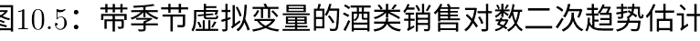

d. 将六阶多项式趋势模型拟合到你感兴趣的趋势系列，并讨论你的结果。

2.  (选择非线性趋势模型)
    使用AIC和SIC，对LSALES中的多项式和指数趋势进行详细比较。您是否同意我们在文本中使用二次趋势？

3.  (非线性优化的困难)
    非线性优化可能是一个棘手的问题，充满了问题。一些问题是通用的。例如，找到局部最优解相对容易，但要对局部最优解感到自信则更加困难。

## 第146章。时间序列中的非线性和结构性变化

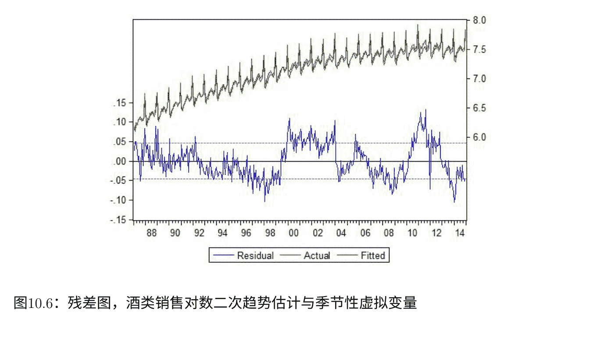

是全局性的。通常会进行简单的检查，例如尝试各种启动值并检查收敛到的最优解，但问题仍然存在。其他问题可能是软件特定的。例如，某些软件可能使用高度精确的解析导数，而其他软件使用近似的数值导数。即使是同一个软件包在不同版本中也可能改变算法或实现细节，导致不同的结果。

- 4. （在水平上直接估计指数趋势）

我们可以用两种方法估计指数趋势。首先，正如我们强调的那样，我们可以取对数，然后使用OLS来拟合线性趋势。或者我们可以使用NLS，直接从指数表示中进行，让计算机找到

```
(\hat{\beta}_1, \hat{\beta}_2) = argmin_{\beta_1,\beta_2} \sum_{t=1} \left[ y_t - \beta_1 e^{\beta_2 TIME_t} \right]^2
```

## 10.7. 练习、问题和补充

- a. NLS方法更繁琐？为什么？
- b. NLS方法在数值上不够可靠？为什么？
- c. 然而，NLS方法非常有用？为什么？（提示：考虑比较二次趋势和指数趋势的SIC值。）

### 5. （逻辑趋势）

在主文中，我们介绍了逻辑函数形式。一个关键的例子是逻辑趋势，它是

```
趋势_t = \frac{1}{a + b r^{时间_t}}
```

其中 0 < r < 1。

- a. 为不同的 a和 b值绘制趋势形状图。在什么情况下可能会有？
- b. 你能想到其他专门情况下可能有用的趋势形状吗？为你提出的其他专门趋势形状提供数学公式。

### 6. （建模酒类销售趋势和季节性）

考虑酒类销售数据。永远不要包括截距。详细讨论所有结果。

- (a) 对对数酒类销售（LSALES）拟合线性趋势加季节性虚拟变量模型，使用完整的季节性虚拟变量集。
- (b) 找到一个“最佳”的线性趋势加季节性虚拟变量 LSALES模型。也就是说，考虑缩小季节性规范，包括少于12个季节性虚拟变量，并决定什么是最好的。
- (c) 在与（6b）相同的季节性规范下，重新估计水平模型（即，LHS变量现在是SALES而不是LSALES）。

使用指数趋势和非线性最小二乘法拟合模型（LSALES）。你的系数估计与（6b）中的相符吗？SIC与（6b）中的相符吗？

- (d) 再次使用SALES进行（6c）的重复，保持与（6b）中的季节性规范不变，但尝试线性和二次趋势，而不是指数趋势。你的“最终”SALES模型是什么？

从（6d）中批评你的最终SALES模型。它可能仍然存在哪些不足之处？当然，你会想要讨论其残差图（实际值、拟合值、残差），以及你认为相关的任何其他诊断图或统计数据。

将（6d）中的最终估计SALES模型作为回归变量，包括三个滞后的SALES（即SALES_{t-1}，SALES_{t-2}和SALES_{t-3}）。滞后的SALES起到了什么作用？将这个新模型视为你的“最终、最终”SALES模型，并重复（6e）。

### 7. 制度转换I：观察到的制度阈值模型

```
$$ y_t = \begin{cases} c^{(u)} + \phi^{(u)} y_{t-1} + \varepsilon_t^{(u)}, & \theta^{(u)} < y_{t-d} \ c^{(m)} + \phi^{(m)} y_{t-1} + \varepsilon_t^{(m)}, & \theta^{(l)} < y_{t-d} < \theta^{(u)} \ c^{(l)} + \phi^{(l)} y_{t-1} + \varepsilon_t^{(l)}, & \theta^{(l)} > y_{t-d} \end{cases} $$
```

### 8. 制度转换II：马尔可夫转换模型

由潜在的2状态马尔可夫过程控制的制度：

```
$$ M = \begin{pmatrix} p_{00} & 1 - p_{00} \ 1 - p_{11} & p_{11} \end{pmatrix} $$
```

#### 切换均值:

```
$$f(y_t|s_t) = \frac{1}{\sqrt{2\pi}\sigma} \exp\left( \frac{-(y_t - \mu_{s_t})^2}{2\sigma^2} \right)$$
```

#### 切换回归:

```
$$f(y_t|s_t) = \frac{1}{\sqrt{2\pi}\sigma} \exp\left( \frac{-(y_t - x_t'\beta_{s_t})^2}{2\sigma^2} \right)$$
```

## 10.8 注释

## 第11章

### 异方差性和截面聚类

### 广义最小二乘法（GLS）

考虑FIC，只是现在我们让：

```
$$\varepsilon \sim N(\underline{0}, \sigma^2 \Omega)$$
```

旧情况下为 $\Omega = I$，但当 $\Omega = I$ 时情况非常不同：

- OLS参数估计一致但效率低（不再是MVUE或BLUE）
- OLS标准误差有偏且不一致。因此，比率在有限样本中不具有 t分布，并且在渐近情况下不具有 N(0,1)分布

### GLS估计量为：

```
$$\hat{\beta}_{GLS} = (X'\Omega^{-1}X)^{-1}X'\Omega^{-1}y$$
```

在剩余的理想条件下，它是一致的，服从正态分布，具有协方差矩阵 $\sigma^2(X'\Omega^{-1}X)^{-1}$，并且是MVUE：

```
$$\hat{\beta}_{GLS} \sim N\left( \beta, \sigma^2(X'\Omega^{-1}X)^{-1} \right)$$
```

## 第11章。异方差性和截面聚类

### 截面回归中的异方差性

同方差性：\(\varepsilon_i\)的方差在 \(i\) 之间是恒定的

异方差性：\(\varepsilon_i\)的方差在 \(i\) 之间不是恒定的

相关的截面异方差性情况（我们现在关注的）：
\(\varepsilon_i\) 在 \(i\) 之间独立，但在 \(i\) 之间不是同分布的

```
\[\Omega = \begin{pmatrix} \sigma_1^2 & 0 & \ldots & 0 \ 0 & \sigma_2^2 & \ldots & 0 \ \vdots & \vdots & \ddots & \vdots \ 0 & 0 & \ldots & \sigma_N^2 \end{pmatrix}\]
```

- 可以由许多原因引起
- Engel曲线（例如，食品支出与收入之间的关系）是一个经典例子

### 后果

OLS不高效（不再是MVUE或BLUE），在有限样本和渐近情况下

标准误差有偏且不一致。因此 \(tratio\) 在有限样本中不具有 \(tdistribution\)，在渐近情况下不具有 \(N(0,1)\) distribution

### 检测

- 图形异方差诊断
- 形式异方差检验

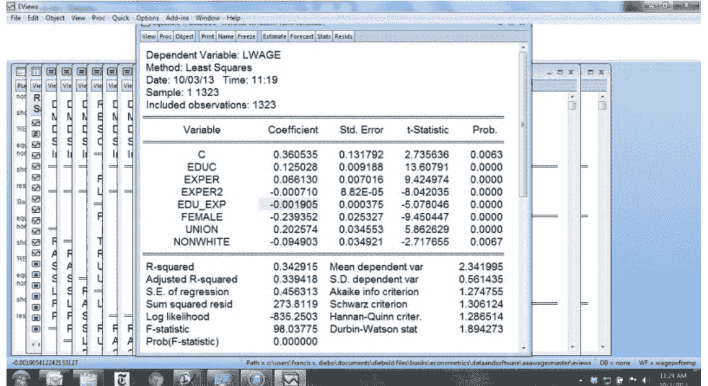

| Variable | Coefficient | Std. Error | t-Statistic | Prob. |
|----------|-------------|------------|-------------|-------|
| C        | 0.360535    | 0.131792   | 2.735636    | 0.0063 |
| EDUC     | 0.125028    | 0.009188   | 13.60791    | 0.0000 |
| EXPER    | 0.066130    | 0.007016   | 9.424974    | 0.0000 |
| EXPER2   | -0.000710   | 8.82E-05   | -8.042035   | 0.0000 |
| EDU_EXP  | -0.001905   | 0.000375   | -5.078046   | 0.0000 |
| FEMALE   | -0.239352   | 0.025327   | -9.450447   | 0.0000 |
| UNION    | 0.202574    | 0.034553   | 5.862629    | 0.0000 |
| NONWHITE | -0.094903   | 0.034921   | -2.717655   | 0.0067 |

### 图形诊断

对各个回归变量绘制图 $e_i^2$，问题：纯粹成对，回忆我们的“最终”

### 工资回归

残差平方与教育之间的关系

### 布鲁斯-戈德弗雷-佩根检验（BGP）

- 估计OLS回归，并获得残差的平方
- 将残差的平方回归到所有回归变量上
- 为了检验无关系的零假设，检查来自这个回归的 $N R^2$。在大样本中 $N R^2 \sim \chi^2$ 在零假设下。

### BGP测试

## 第11章。异方差性和截面聚类

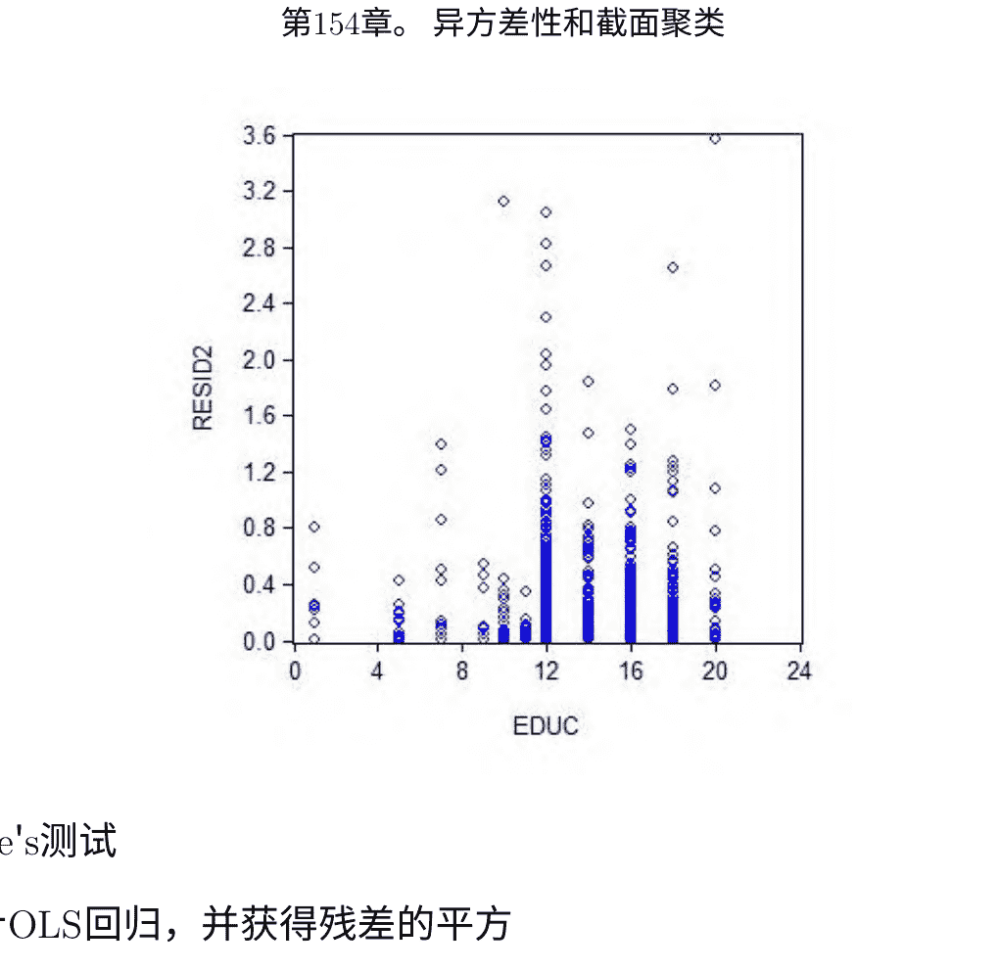

### White's测试

- 估计OLS回归，并获得残差的平方
- 将残差的平方回归到所有回归变量、平方回归变量和两两回归变量交叉乘积上
- 为了检验无关系的零假设，检查来自这个回归的N R^2。在大样本中N R^2 ∼ χ^2在零假设下。

> > (White's测试是Breusch-Godfrey-Pagan测试的一种自然而灵活的推广)White测试

### 异方差性的GLS

- “加权最小二乘法”（WLS）
  - 对DGP采取立场。获得一致的标准误差和高效的参数估计。

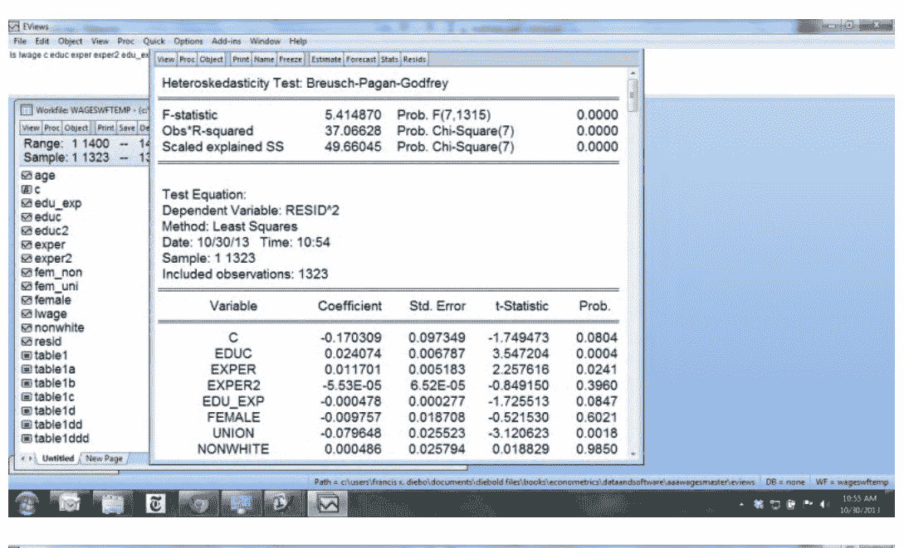

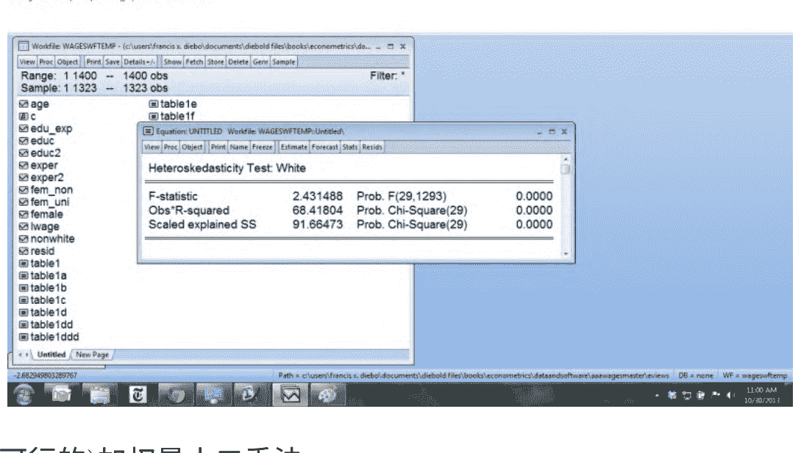

### (不可行的)加权最小二乘法

> DGP:

$$
y_i = x_i'\beta + \varepsilon_i
$$

$$
\varepsilon_i \sim idN(0, \sigma_i^2)
$$

## 第11章。异方差性和截面聚类

将数据(y_i, x_i)按1/σ_i加权：

$$ \frac{y_i}{\sigma_i} = \frac{x_i'\beta}{\sigma_i} + \frac{\varepsilon_i}{\sigma_i} $$

现在的DGP是：

$$ y_i^* = x_i^{*'}\beta + \varepsilon_i^* $$

$$ \varepsilon_i^* \sim iidN(0, 1) $$

- OLS是MVUE！
- 问题：我们不知道 σ_i^2

### 关于加权最小二乘法的备注

将数据按1/σ_i加权与将残差按1/σ_i^2加权是一样的：

$$ \min_{\beta} \sum_{i=1}^{N} \left( \frac{y_i - x_i'\beta}{\sigma_i} \right)^2 = \min_{\beta} \sum_{i=1}^{N} \frac{1}{\sigma_i^2} (y_i - x_i'\beta)^2 $$

### 可行加权最小二乘法

直觉：用估计值替换未知的 σ_i^2 值

一些好的想法：

- 使用 w_i = 1/e_i^2，其中 e_i^2 来自BGP测试回归
- 使用 w_i = 1/e_i^2，其中 e_i^2 来自White测试回归

直接使用 w_i = 1/e_i^2 的WLS怎么样？

- 不是一个好主意

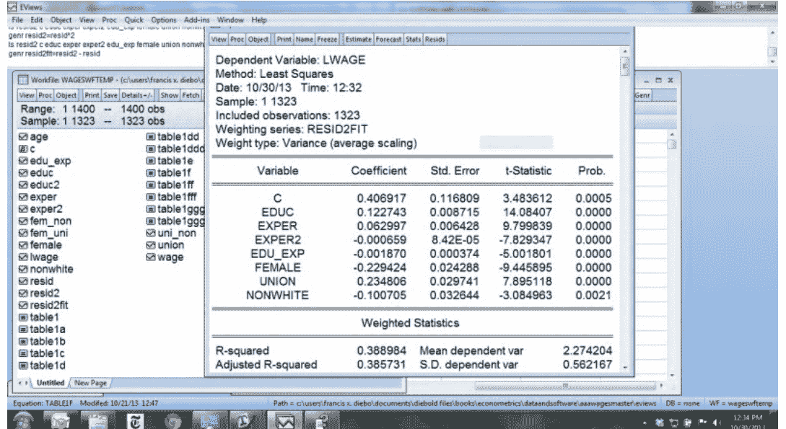

- $e_i^2$ 太嘈杂了；我们希望使用的不是 $e_i^2$ 而是 $E(e_i^2|x_i)$。因此，我们使用 $E(e_i^2|x_i)$ 的估计值，即来自白测试回归的 $e_i^2 \to X$ 回归加权拟合

### 一种不同的方法

(高级但非常重要)

White的异方差一致标准误差也许令人惊讶的是，我们直接使用 $e_i^2$ 不对DGP表态放弃高效的参数估计，但得到一致的标准误差使用高级方法，只需 $e_i^2$ 就可以获得一致的标准误差（如果不是高效的 $\hat{\beta}$）

- 标准误差保持一致。
- $\hat{\beta}$ 保持不变，保持OLS值。（这是个问题吗？）

> > “对未知形式的异方差的鲁棒性”

### 使用White的异方差一致标准误差的回归

## 第11章。截面异方差和聚类

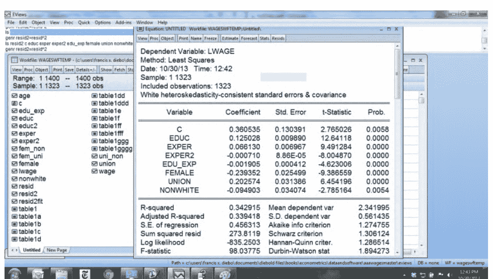

### 11.1 协方差矩阵“聚类”

### 11.2 练习、问题和补充

- 1. (鲁棒性迭代)
进行第二阶段WLS，权重为1/|e_t|，或类似的方法。这不是一种异方差修正，而是一种纯机械策略，用于降低异常值的权重。
- 2. (词汇)
所有这些都有相同的意思：白色标准误差，“洗白”的标准误差，异方差鲁棒标准误差，异方差一致标准误差和鲁棒标准误差。

### 11.3 注释

## 第12章

### 观察到的时间序列中的串行相关

观察到的时间序列。

## 12.1 描述时间序列动态

我们已经考虑了具有趋势和季节性分量的模型。在本章中，我们考虑了一个关键的第三个分量，周期。当你想到一个“周期”时，你可能会想到在图??中所示的那种严格的上下模式。这样的周期有时可能会出现，但是在商业、金融、经济和政府中的周期性波动通常没有那么严格。

事实上，当我们谈论周期时，我们指的是一个更加普遍、全面的循环性概念：任何不被趋势或季节性所捕捉的动态。

周期，根据我们广泛的解释，可能显示出在图表??中所描述的来回运动，但它们并不一定需要如此。我们只需要有一些动态性、一些持续性、一些将现在与过去联系起来、将未来与现在联系起来的方式。周期存在于我们关心的大多数系列中，我们知道如何对其进行建模和预测非常重要，因为它们的历史传递了信息

关于它们的未来。

趋势和季节性动态很简单，所以我们可以用简单的模型来捕捉它们。然而，周期性动态更加复杂。由于各种各样的周期模式，我们需要的模型类型更加复杂。因此，我们将讨论分为三个部分。

首先，我们开发了用于表征周期的方法，然后介绍了周期模型。所有的材料都很重要，而且对于第一次接触来说可能有点困难，因为它不可避免地涉及一些数学，所以需要仔细、系统地学习。

### 12.1.1 协方差平稳时间序列

时间序列的实现是一个有序集合，

```
{..., y_{-2}, y_{-1}, y_0, y_1, y_2, ...}
```

通常观察值按时间顺序排列 - 因此称为时间序列 - 但不一定如此。例如，我们可以研究空间序列，比如从曼哈顿中城的一个点到纽约郊区三十英里外的一个点的办公空间租金率。

但是，最重要的情况是观察值按时间顺序排列，因此这是我们要强调的。

从理论上讲，时间序列的实现始于无限过去，继续到无限未来。这种观点可能看起来抽象且应用有限，但在推导出我们即将使用的模型的某些非常重要的性质时会很有用。实际上，我们观察到的数据只是一个实现的有限子集，{y1, ..., yT}，称为样本路径。

不久我们将为周期性时间序列建立模型。如果时间序列的潜在概率结构随时间变化，我们将无法将未来与过去联系起来，因为支配未来的规律与支配过去的规律不同。

### 12.1. 描述时间序列动态

至少我们希望时间序列的均值和协方差结构（即当前值与过去值之间的协方差）在时间上是稳定的，这种情况下我们称该序列为协方差平稳序列。让我们更深入地讨论协方差平稳性。时间序列成为协方差平稳序列的第一个要求是序列的均值在时间上是稳定的。时间 $t$ 的序列均值为 $Ey_t = μ_t$。如果均值在时间上是稳定的，符合协方差平稳性的要求，我们可以写成 $Ey_t = μ$，对于所有的 $t$。由于均值在时间上是恒定的，不需要在其上加时间下标。时间序列成为协方差平稳序列的第二个要求是其协方差结构在时间上是稳定的。量化协方差结构的稳定性有点棘手，但非常重要，我们使用自协方差函数来进行量化。位移为 $τ$ 的自协方差就是 $y_t$ 和 $y_{t-τ}$ 之间的协方差。它当然取决于 $τ$，也可能取决于 $t$，因此一般我们写成

```
$$γ(t, τ) = cov(y_t, y_{t-τ}) = E(y_t - μ)(y_{t-τ} - μ).$$
```

如果协方差结构在时间上是稳定的，符合协方差平稳性的要求，那么自协方差只取决于位移 $τ$，而不取决于时间 $t$，我们写作 $γ(t, τ) = γ(τ)$，对于所有的 $t$。

自协方差函数很重要，因为它提供了协方差平稳序列中周期动态的基本总结。通过检查序列的自协方差结构，我们可以了解其动态行为。我们将自协方差作为 $τ$ 的函数进行绘图和检查。请注意，自协方差函数是对称的；即 $γ(τ) = γ(-τ)$，对于所有的 $τ$。

通常，我们只考虑非负值 $τ$。对称性反映了一个协方差平稳序列的自协方差仅依赖于位移的事实；无论我们向前还是向后，都没有关系。还要注意 $γ(0) = cov(y_t, y_t) = var(y_t)$。

协方差平稳性还有一个技术要求：我们要求序列的方差 - 即位移为0的自协方差 γ(0)是有限的。可以证明，没有自协方差的绝对值可以比 γ(0)更大，因此如果 γ(0) < ∞，则所有其他自协方差也是如此。

协方差平稳性的要求似乎相当严格，这对我们的模型来说几乎都是不利的，因为几乎所有的模型都以某种方式涉及协方差平稳性。确实，许多经济、商业、金融和政府系列数据都不是协方差平稳的。例如，上升趋势对应于逐渐增加的均值，季节性对应于随季节变化的均值，这两者都违反了协方差平稳性。

但外表可能会欺骗人。尽管许多系列不是协方差平稳的，但通常可以使用对非平稳分量（如趋势和季节性）进行特殊处理的模型来处理，以便剩下的周期性分量可能是协方差平稳的。

我们经常采用这种策略。或者，简单的转换通常可以将非平稳系列转换为协方差平稳的系列。例如，许多在水平上明显非平稳的系列在增长率上可能是协方差平稳的。

此外，需要注意的是，尽管协方差平稳性要求均值和协方差稳定且有限，但它对系列的其他方面（如偏度和峰度）没有限制。总之，无论是直接在水平上工作并包括模型中非平稳元素的特殊分量，还是在转换后的数据（如增长率）上工作，协方差平稳性假设并不像看起来那么不切实际。

回想一下，两个随机变量 x 和 y 之间的相关性定义为## 12.1 描述时间序列动态

通过公式
$$corr(x, y) = \frac{cov(x, y)}{\sigma_x \sigma_y}$$
也就是说，相关性只是协方差通过 x 和 y 的标准差的乘积进行“标准化”或“归一化”。相关性和协方差都是衡量两个随机变量之间线性关联的指标。然而，相关性通常更具信息量且更容易解释，因为相关系数的构造保证 correlation(x, y) ∈ [−1,1]，而相同两个随机变量之间的协方差可以取任何值。此外，相关性不依赖于 x 和 y 的测量单位，而协方差则依赖。因此，例如，如果 x 和 y 的协方差为一千万，它们不一定非常强相关，而如果它们的相关性为0.95，则明确表明它们非常强相关。

鉴于相关性比协方差更易解释，我们通常使用相关性而不是协方差来衡量 y_t 和 y_{t-τ} 之间的关系。也就是说，我们使用自相关函数 ρ(τ) 而不是自协方差函数 γ(τ)。自相关函数通过将自协方差函数除以方差得到。
$$\rho(\tau) = \frac{\gamma(\tau)}{\gamma(0)}, \tau = 0, 1, 2, ...$$
自相关的公式就是通常的相关公式，专门用于衡量 y_t 和 y_{t-τ} 之间的相关性。要理解其中的原因，注意到 y_t 的方差是 γ(0)，而根据协方差平稳性，y_t 在任何其他时间 y_{t-τ} 的方差也是 γ(0)。因此，
$$\rho(\tau) = \frac{cov(y_t, y_{t-\tau})}{\sqrt{var(y_t)} \sqrt{var(y_{t-\tau})}} = \frac{\gamma(\tau)}{\sqrt{\gamma(0)} \sqrt{\gamma(0)}} = \frac{\gamma(\tau)}{\gamma(0)}$$
如所声称。请注意，我们总是有 \( \rho(0) = \frac{\gamma(0)}{\gamma(0)} = 1 \)，因为任何序列与自身完全相关。因此，位移为0的自相关不是我们感兴趣的；相反，只有位移大于0的自相关才能告诉我们一个序列的动态结构。

最后，偏自相关函数，\( p(\tau) \)，有时是有用的。\( p(\tau) \) 只是在总体线性回归中 \( y_t \) 对 \( y_{t-1}, ..., y_{t-\tau} \) 的系数。我们称这样的回归为自回归，因为变量是在滞后值上回归的。很容易看出，自相关和偏自相关虽然相关，但在一个重要的方面有所不同。自相关只是 \( y_t \) 和 \( y_{t-\tau} \) 之间的“简单”或“常规”相关。另一方面，偏自相关测量了在控制 \( y_{t-1}, ..., y_{t-\tau+1} \) 的影响后，\( y_t \) 和 \( y_{t-\tau} \) 之间的关联；也就是说，它们测量了 \( y_t \) 和 \( y_{t-\tau} \) 之间的偏相关。

与自相关一样，我们经常将偏自相关作为 τ 的函数进行图形化，并检查它们的定性形状，我们很快就会做这个。与自相关函数类似，偏自相关函数以不同的方式提供了一系列动态的摘要，正如我们将看到的那样。

我们将随后研究的所有协方差平稳过程都具有随着位移增大而趋近于零的自相关和偏自相关函数。在图***中，我们展示了一个显示逐渐单侧衰减的自相关函数，而在图***中，我们展示了一个恒定的自相关函数；后者不能是一个平稳过程的自相关函数，其自相关函数必须最终衰减。精确的衰减模式。

> 为了对“总体回归”这个概念有所了解，想象一下我们有一个无限样本的数据可供使用，这样回归中的参数估计不会受到抽样变异的污染——也就是说，它们是真实的总体值。刚才描述的思想实验是一个总体回归。

> 此外，与自相关函数并行，位移为0的偏自相关总是为1，因此没有信息和意义。因此，当我们绘制自相关和偏自相关函数时，我们将从位移1开始，而不是位移0。

然而，自相关和偏自相关的图像取决于序列的具体特征。在图***中，我们展示了一个显示阻尼振荡的自相关函数——自相关一开始是正的，然后变为负的一段时间，然后再次变为正的，如此往复，同时绝对值不断减小。最后，在图***中，我们展示了一个自相关函数在接近零时的不同方式——自相关在某个位移后突然降为零。

## 12.2 白噪声

在本节中，我们将研究某些重要的时间序列模型或时间序列过程的总体特性。在我们估计时间序列模型之前，我们需要了解它们的总体特性，假设所假设的模型是正确的。所有这些时间序列过程中最简单的是构建其他过程的基本构建模块。事实上，它非常重要，我们现在就介绍它。我们用 y_t 表示感兴趣的观测序列。假设
$$y_t = \varepsilon_t$$
$$\varepsilon_t \sim (0, \sigma^2)$$
其中“冲击”，\( \varepsilon_t \)，在时间上是不相关的。我们说 \( \varepsilon_t \)，因此 \( y_t \)，是序列不相关的。在整个过程中，除非另有明确说明，我们假设 \( \sigma^2 < \infty \)。这样的过程，具有零均值、恒定方差，且没有序列相关性，被称为零均值白噪声，或简称为白噪声。有时我们简写
$$\varepsilon_t \sim WN(0, \sigma^2)$$
因此
$$y_t \sim WN(0, \sigma^2).$$
请注意，尽管 \( \varepsilon_t \) 和 \( y_t \) 是序列无关的，但它们不一定是序列独立的，因为它们不一定是正态分布的。如果除了序列无关之外，\( y_t \) 是序列独立的，那么我们称 y_t 为独立白噪声。我们写作
$$y_t \sim iid(0, \sigma^2),$$
我们说“\( y_t \) 独立同分布于零均值和恒定方差。”如果 \( y_t \) 是序列无关且正态分布的，则 \( y_t \) 也是序列独立的，我们称其为正态白噪声或高斯白噪声。我们写作
$$y_t \sim iidN(0, \sigma^2).$$
我们读到“\( y_t \) 独立且同分布于正态分布，均值为零，方差恒定”，或者简单地说“\( y_t \) 是高斯白噪声”。在图***中，我们展示了在计算机上模拟的长度为 \( T=150 \) 的高斯白噪声的样本路径。由于时间上的独立性，该系列中没有任何模式。

你可能已经熟悉白噪声，尽管你可能没有意识到。回想一下，在回归模型中，扰动通常被假定为某种白噪声。然而，这里有一个微妙的区别。回归扰动是不可观测的，而我们正在处理的是一个观测序列。然而，稍后我们将看到，我们为观测序列建立的所有模型都可以用来建模未观测变量，如回归扰动。让我们描述白噪声的动态随机结构。

根据构造，\( y_t \) 的无条件均值为 \( E(y_t)=0 \)，而 \( y_t \) 的无条件方差为 \( var(y_t)=\sigma^2 \)。请注意，无条件均值和方差是常数。事实上，对于任何协方差平稳过程，无条件均值和方差必须是常数。原因是无条件均值的恒定性是协方差平稳性的第一个明确要求，而无条件方差的恒定性则隐含地来自协方差平稳性的第二个要求，即自协方差仅取决于位移，而不取决于时间。

为了完全理解协方差平稳时间序列过程的线性动态结构，我们需要计算并检查其均值和自协方差函数。对于白噪声，我们已经计算了均值和方差，即位移为0时的自协方差。我们还没有计算出剩余的自协方差函数；幸运的是，它非常简单。因为白噪声在时间上是不相关的，所有的自协方差和自相关都在位移0之后都是零。因此，白噪声过程的自协方差函数可以形式化地表示为
$$\gamma(\tau) = \begin{cases} \sigma^2, & \tau = 0 \\ 0, & \tau \geq 1, \end{cases}$$
回想一下 \( \sigma^2 = \gamma(0) \)。

如果所有的自协方差都是零，那么自相关也是零，因为自相关与自协方差成比例。白噪声过程的自相关函数是
$$ \rho(\tau) = \begin{cases} 1, & \tau = 0 \\ 0, & \tau \geq 1. \end{cases} $$
在图***中，我们绘制了白噪声的自相关函数。

最后，考虑白噪声序列的偏自相关函数。由于在位移为0时自相关总是为1，偏自相关在位移为0时也是如此。对于白噪声过程，除了位移为0的偏自相关外，所有其他偏自相关都为零，这也是由于白噪声在构造上是序列不相关的事实。对于 \( y_{t-1} \) 的总体回归，或者对于 \( y_{t-1} \) 和 \( y_{t-2} \) 的总体回归，或者对于任何其他滞后，都会产生零系数，因为该过程是序列不相关的。

形式上，白噪声过程的偏自相关函数是
$$ p(\tau) = \begin{cases} 1, & \tau = 0 \\ 0, & \tau \geq 1. \end{cases} $$
我们在图***中展示了白噪声过程的偏自相关函数。再次强调，它是退化的，与自相关函数完全相同！

白噪声非常特殊，确实在某种意义上是退化的，因为白噪声序列在任何时刻的变化与过去的任何事物都不相关，同样，在未来发生的事情与现在或过去的任何事物都不相关。但是理解白噪声至少有两个重要原因。首先，正如已经提到的，通过对白噪声进行简单的变换，可以构建具有更丰富动态的过程。

其次，所有时间序列建模（和1步预测）的目标是将数据（或1步预测误差）减少到白噪声。毕竟，如果这样的预测误差不是白噪声，那么它们是序列相关的，这意味着它们是可预测的，如果预测误差是可预测的，那么预测就不会很好。因此，我们理解和能够识别白噪声非常重要。

到目前为止，我们已经通过其均值、方差、自相关函数和偏自相关函数来描述了白噪声。动态的另一个特征是过程的均值和方差，条件是过去的情况。特别是，通过研究条件均值，我们经常能够了解过程中的动态特征。事实上，在我们对时间序列的研究中，我们将对感兴趣的各种过程的无条件均值和方差以及条件均值和方差进行计算和对比。均值和方差是随机变量位置和尺度信息的例子，统计学家称之为矩。在大多数情况下，我们对时间序列过程的条件和无条件矩结构进行比较将集中在均值和方差上（它们是最重要的矩），但有时我们也对高阶矩感兴趣，这些矩与偏斜度和峰度等性质有关。

为了比较条件和无条件的均值和方差，简化我们的故事，考虑独立的白噪声，\( y_t \sim iid(0, \sigma^2) \)。根据之前的论证，\( y_t \) 的无条件均值为0，无条件方差为 \( \sigma^2 \)。现在考虑条件均值和方差，信息集 \( \Omega_{t-1} \)，我们根据其中包含观测序列的过去历史，\( \Omega_{t-1} = \{y_{t-1}, y_{t-2}, ...\} \)。或者包含冲击的过去历史，\( \Omega_{t-1} = \{\varepsilon_{t-1}, \varepsilon_{t-2}, ...\} \)。 （在白噪声情况下它们是相同的。）与无条件均值和方差不同，条件均值和方差不需要保持恒定，因为协方差平稳性要求常数，一般来说我们不希望它们是恒定的。下个季度笔记本电脑销售的无条件预期增长率可能是百分之十，但是预期销售增长率可能会更高，条件是了解本季度销售增长了百分之二十。对于独立的白噪声过程，条件均值是
$$E(y_t | \Omega_{t-1}) = 0,$$
而条件方差是
$$var(y_t | \Omega_{t-1}) = E[(y_t - E(y_t | \Omega_{t-1}))^2 | \Omega_{t-1}] = \sigma^2.$$
对于独立的白噪声序列，条件和无条件均值和方差是相同的；过程中没有动态，因此条件矩没有动态。

## 第12章 观察时间序列中的串行相关性

## 12.3 均值、自相关和偏自相关函数的估计和推断

现在假设我们有一组关于时间序列的样本数据，我们不知道生成数据的真实模型，也不知道与该真实模型相关的均值、自相关函数和偏自相关函数。相反，我们希望利用数据来估计均值、自相关函数和偏自相关函数，然后用它们来帮助我们了解潜在的动态特性，并决定适合的模型或一组模型来拟合数据。

### 12.3.1 样本均值

协方差平稳序列的均值为
$$\mu = E[y_t].$$
估计的一个基本原则是模拟原则，建议我们用样本平均值替代期望来开发估计器。

因此，我们对总体均值的估计值，给定样本大小 \( T \)，是样本均值，
$$\bar{y} = \frac{1}{T} \sum_{t=1}^{T} y_t.$$
通常我们对均值的估计值不直接感兴趣，但它对于自相关函数的估计是必需的。

### 12.3.2 样本自相关

协方差平稳序列 \( y_t \) 的位移 \( \tau \) 的自相关性是
$$\rho(\tau) = \frac{E[(y_t - \mu)(y_{t-\tau} - \mu)]}{E[(y_t - \mu)^2]}.$$
类比原则的应用产生了一个自然的估计值，
$$\hat{\rho}(\tau) = \frac{\frac{1}{T} \sum_{t=\tau+1}^{T} [(y_t - \bar{y})(y_{t-\tau} - \bar{y})]}{\frac{1}{T} \sum_{t=1}^{T} (y_t - \bar{y})^2} = \frac{\sum_{t=\tau+1}^{T} [(y_t - \bar{y})(y_{t-\tau} - \bar{y})]}{\sum_{t=1}^{T} (y_t - \bar{y})^2}.$$
这个估计值，视为 \( \tau \) 的函数，被称为样本自相关函数，或者相关图。请注意，一些求和从 \( t = \tau + 1 \) 开始，而不是从 \( t=1 \) 开始；这是因为求和中出现了 \( y_{t-\tau} \)。请注意，尽管求和中只有 \( T-\tau \) 个项，但我们仍然将这些求和除以 \( T \)。当 \( T \) 相对于 \( \tau \) 很大时（这是相关的情况），除以 \( T \) 或 \( T-\tau \) 将得到近似相同的结果，因此对于实际目的来说并没有太大区别，而且还有很好的数学原因可以选择除以 \( T \)。评估一个序列是否可以合理地近似为白噪声通常是有兴趣的，也就是说，是否所有的自相关都在总体中为零。一个关键的结果，我们只是断言，如果一个序列是白噪声，那么在大样本中样本自相关的分布是
$$\hat{\rho}(\tau) \sim N\left(0, \frac{1}{T}\right)$$
请注意结果是多么简单。白噪声序列的样本自相关性近似服从正态分布，而正态分布始终是一个方便的分布。它们的均值为零，也就是说样本自相关性是真实自相关性的无偏估计量，而真实自相关性实际上是零。最后，样本自相关性的方差近似为1/T（等价地，标准差为 \( 1/\sqrt{T} \)），这很容易构建和记忆。在正态性下，加减两个标准误差可以得到一个近似的95%置信区间。因此，如果序列是白噪声，大约95%的样本自相关性应该落在区间 \( 0 \pm 2/\sqrt{T} \)。在实践中，当我们绘制一组数据的样本自相关性时，通常会包括“两个标准误差带”，这对于对序列是否以及如何偏离白噪声进行非正式的图形评估非常有用。

两倍标准误差带虽然非常有用，但只能为单个样本自相关提供95%的边界。最终，我们通常对一个系列是否是白噪声感兴趣，也就是说，是否所有的自相关都是联合为零的。一个简单的扩展可以让我们测试这个假设。重写表达式
$$\hat{\rho}(\tau) \sim N\left(0, \frac{1}{T}\right)$$
为
$$\sqrt{T}\hat{\rho}(\tau) \sim N(0, 1)$$
两边平方得到
$$T\hat{\rho}^2(\tau) \sim \chi^2_1$$
可以证明，除了近似正态分布之外，不同位移的样本自相关近似独立。回想一下，独立 \( \chi^2 \) 变量的和也是 \( \chi^2 \)，自由度等于变量自由度之和，我们已经证明了 Box-Pierce Q统计量，
$$Q_{BP} = T \sum_{\tau=1}^{m} \hat{\rho}^2(\tau),$$
在零假设下，\( y_t \) 是白噪声，\( Q_{BP} \) 近似服从自由度为 \( \chi^2_m \) 的随机变量。对此稍作修改，以更接近小样本中的 \( \chi^2 \) 分布
$$Q_{LB} = T(T+2) \sum_{\tau=1}^{m} \left( \frac{1}{T-\tau} \right) \hat{\rho}^2(\tau).$$
在零假设下，\( y_t \) 是白噪声，\( Q_{LB} \) 近似服从 \( \chi^2_m \) 的随机变量。请注意，Ljung-Box \( Q \) 统计量与 Box-Pierce \( Q \) 统计量相同，只是自相关平方和被加权自相关平方和所取代，其中权重为 \( (T+2)/(T-\tau) \)。对于中等和大样本，权重近似为1，因此 Ljung-Box 统计量与 Box-Pierce 统计量相差不大。

选择 \( m \) 的目的是为了平衡竞争的标准。一方面，我们不希望 \( m \) 太小，因为毕竟我们正在进行联合检验自相关函数的一个很大的部分。另一方面，当 \( m \) 相对于 \( T \) 增长时，我们所使用的分布近似的质量会下降。实际上，我们关注的是 \( m \) 在 \( \sqrt{T} \) 附近通常是合理的。

### 12.3.3 样本偏自相关

请记住，偏自相关是从总体线性回归中获得的，这对应于一个涉及使用无限样本数据的线性回归的思想实验。样本偏自相关对应于相同的思想实验，只是线性回归现在是在（可行的）大小为T的样本上进行的。如果拟合的回归是
$$\hat{y}_t = \hat{c} + \hat{\beta}_1 y_{t-1} + ... + \hat{\beta}_\tau y_{t-\tau},$$
然后，位移 τ 的样本偏自相关是
$$\hat{\rho}(\tau) \equiv \hat{\beta}_\tau.$$
分布结果与我们讨论的样本自相关相同，也适用于样本偏自相关。也就是说，如果序列是白噪声，大约95%的样本偏自相关应该落在区间 \( \pm 2/\sqrt{T} \)。与样本自相关一样，我们通常将样本偏自相关与其两倍标准误差带一起绘制。

“相关图分析”简单地意味着对样本自相关和偏自相关函数（带有两倍标准误差带）以及相关的诊断进行检查，例如Q统计量。我们不显示位移为0的样本自相关或偏自相关，因为正如我们之前提到的，它们等于1.0，通过构造，因此不提供有用的信息。我们将采用这个约定贯穿始终。

请注意，样本自相关和偏自相关在位移1处是相同的。这是因为在位移1处，计算样本偏自相关时没有更早的滞后需要控制，所以它等于样本自相关。当然，在更高的位移处，两者会分离。

## 12.4 自相关时间序列的自回归模型

### 12.4.1 一些初步符号：滞后算子

滞后算子及相关构造是表达时间序列模型的自然语言。如果你想理解和操作时间序列模型——事实上，即使你只是想能够阅读软件手册——你必须熟悉滞后算子。滞后算子 \( L \) 非常简单：它通过滞后来“操作”一个序列。因此，\( Ly_t = y_{t-1} \)。类似地， \( L^2 y_t = L(L(y_t)) = L(y_{t-1}) = y_{t-2} \)，依此类推。通常，我们不使用滞后算子，而是使用滞后算子的多项式。滞后算子多项式的阶数 \( m \) 只是滞后算子的幂的线性函数，直到 \( m \) 次幂。
$$B(L) = b_0 + b_1 L + b_2 L^2 + ... + b_m L^m.$$
以一个非常简单的滞后算子多项式作用于一个序列的例子来说明，考虑 \( m \) 阶滞后算子多项式 \( L^m \)，其中
$$L^m y_t = y_{t-m}$$
一个众所周知的算子，一阶差分算子 \( \Delta \)，实际上是滞后算子的一阶多项式。

你可以轻松验证

$$
\Delta y_t = (1 - L)y_t = y_t - y_{t-1}
$$

最后一个例子，考虑二阶滞后算子多项式1 + .9L + .6L^2 作用于 y_t。我们有

$$
(1 + .9L + .6L^2)y_t = y_t + .9y_{t-1} + .6y_{t-2}
$$

这是一个加权和，或者是当前和过去值的分布滞后。所有的时间序列模型，无论如何，都必须包含这样的分布滞后，因为它们需要量化过去如何演变为现在和未来；因此滞后算子符号是陈述和操作时间序列模型的有用简写。

到目前为止，我们只考虑了滞后算子中的有限阶多项式；事实证明，无限阶多项式也非常有趣。我们将无限阶滞后算子多项式表示为

$$
B(L) = b_0 + b_1 L + b_2 L^2 + ... = \sum_{i=0}^{\infty} b_i L^i.
$$

因此，例如，要表示当前和过去冲击的无限分布滞后，我们可以写成

$$
B(L)\varepsilon_t = b_0 \varepsilon_t + b_1 \varepsilon_{t-1} + b_2 \varepsilon_{t-2} + ... = \sum_{i=0}^{\infty} b_i \varepsilon_{t-i}.
$$

乍一看，无限分布滞后可能看起来很奇怪，实际上也具有有限的实际意义，因为具有无限分布滞后的模型具有无限多个参数（b_0, b_1, b_2, ...）因此无法用有限的数据样本进行估计。相反，令人惊讶的是，事实证明涉及无限分布滞后的模型对时间序列建模至关重要。沃尔德定理，我们现在转向，确立了这一核心概念。

### 12.4.2 自回归

在构建模型时，我们不想假装我们拟合的模型是真实的。 相反，我们希望意识到我们正在近似一个更复杂的现实。 这是现代观点，并对时间序列建模有重要的影响。 特别是，成功的时间序列建模的关键是简洁而准确的近似。 在这里，我们强调一类非常重要的近似，即自回归（AR）模型。

我们首先对自相关函数和相关的数量进行表征，假设AR模型是“真实的”。13 这些表征与数据或估计无关，但对于发展对模型性质的基本理解至关重要，这对于进行智能建模是必要的。 它们使我们能够做出如“如果数据确实是由自回归过程生成的，那么我们期望其自相关函数具有属性x”的陈述。凭借这些知识，我们使用样本自相关和偏自相关，结合AIC和SIC，提出候选模型，然后进行估计。

自回归过程是时间序列动力学的一种自然近似。 它只是一个随机差分方程，一个简单的数学模型，其中系列的当前值与其过去值线性相关，再加上一个加性随机冲击。 随机差分方程是离散时间随机动态建模的一种自然工具。

#### AR(1)过程

一阶自回归过程，简称AR(1)，是

$$
y_t = \phi y_{t-1} + \varepsilon_t
$$

有时，特别是在假设模型正确的情况下描述总体特性时，我们将其称为过程，简称随机过程。

$$
\varepsilon_t \sim W N(0, \sigma^2).
$$

在滞后算子形式中，我们写成

$$
(1 - \phi L)y_t = \varepsilon_t.
$$

在图***中，我们展示了两个AR(1)过程的长度为150的模拟实现；第一个是

$$
y_t = .4y_{t-1} + \varepsilon_t,
$$

而第二个是

$$
y_t = .95y_{t-1} + \varepsilon_t,
$$

其中每种情况下

$$
\varepsilon_t \sim iid N(0,1),
$$

并且相同的创新序列贯穿于每个实现。AR(1)模型中参数为φ=0.95的波动比参数为φ=0.4的AR(1)模型更持久。因此，AR(1)模型能够捕捉高度持久的动态。

自回归过程要满足一定条件才能具有协方差平稳性。如果我们从AR(1)过程开始，

$$
y_t = \phi y_{t-1} + \varepsilon_t,
$$

并在右侧向后替换滞后的y，我们得到

$$
y_t = \varepsilon_t + \phi \varepsilon_{t-1} + \phi^2 \varepsilon_{t-2} + ...
$$

在滞后算子形式中，我们写作

$$
y_t = \frac{1}{1 - \phi L} \varepsilon_t.
$$

如果且仅如果 |φ| < 1，那么y的移动平均表示收敛

因此，在 $AR(1)$情况下，$|\phi| <1$是协方差平稳性的条件。等价地，协方差平稳性的条件是自回归滞后算子多项式的倒数的绝对值小于一。

根据协方差平稳的 $AR(1)$过程的移动平均表示，我们可以计算无条件均值和方差。

$$
\begin{aligned}
E(y_t) &= E(\varepsilon_t + \phi\varepsilon_{t-1} + \phi^2\varepsilon_{t-2} + ...) \\
&= E(\varepsilon_t) + \phi E(\varepsilon_{t-1}) + \phi^2 E(\varepsilon_{t-2}) + ... \\
&= 0
\end{aligned}
$$

和

$$
\begin{aligned}
var(y_t) &= var(\varepsilon_t + \phi\varepsilon_{t-1} + \phi^2\varepsilon_{t-2} + ...) \\
&= \sigma^2 + \phi^2\sigma^2 + \phi^4\sigma^2 + ... \\
&= \sigma^2 \sum_{i=0}^{\infty} \phi^{2i} \\
&= \sigma^2 \frac{1}{1-\phi^2}.
\end{aligned}
$$

相反地，条件矩是

$$
\begin{aligned}
E(y_t|y_{t-1}) &= E(\phi y_{t-1} + \varepsilon_t | y_{t-1}) \\
&= \phi E(y_{t-1}|y_{t-1}) + E(\varepsilon_t|y_{t-1}) \\
&= \phi y_{t-1} + 0 \\
&= \phi y_{t-1}.
\end{aligned}
$$

# 第12章 观察时间序列中的串行相关性

和

$$
\begin{aligned}
var(y_t|y_{t-1}) &= var((\phi y_{t-1} + \varepsilon_t)|y_{t-1}) \\
&= \phi^2 var(y_{t-1}|y_{t-1}) + var(\varepsilon_t|y_{t-1}) \\
&= 0 + \sigma^2 \\
&= \sigma^2.
\end{aligned}
$$

特别要注意的是，条件均值如何随着过程的演变而适应不断变化的信息集。

为了找到自协方差，我们按照以下步骤进行。该过程是

$$
y_t = \phi y_{t-1} + \varepsilon_t,
$$

因此，将方程的两边都乘以 y_{t-τ}，我们得到

$$
y_t y_{t-τ} = \phi y_{t-1} y_{t-τ} + \varepsilon_t y_{t-τ}
$$

对于 τ ≥ 1，对方程的两边取期望得到

$$
\gamma(\tau) = \phi \gamma(\tau - 1).
$$

这被称为Yule-Walker方程。这是一个递归方程；也就是说，对于任何τ，Yule-Walker方程立即告诉我们如何获得 γ(τ+1)。如果我们知道 γ(0)来开始（一个“初始条件”），我们可以使用Yule-Walker方程确定整个自协方差序列。而我们确实知道 γ(0)；它只是过程的方差，我们已经证明了

因此我们有

$$
\gamma(0) = \frac{\sigma^2}{1 - \phi^2}
$$

$$
\begin{aligned}
\gamma(1) &= \phi \frac{\sigma^2}{1-\phi^{2}} \\
\gamma(2) &= \phi^{2} \frac{\sigma^2}{1-\phi^{2}}
\end{aligned}
$$

等等。一般来说，然后，

$$
\gamma(\tau) = \phi^{\tau} \frac{\sigma^2}{1-\phi^{2}}, \quad \tau = 0, 1, 2, ...
$$

通过除以 \( \gamma(0) \)，得到自相关系数，

$$
\rho(\tau) = \phi^{\tau}, \quad \tau = 0, 1, 2, ...
$$

注意渐进的自相关衰减，这是自回归过程的典型特征。自相关系数趋近于零，但只有在位移趋近无穷大的极限情况下。特别是，它们不会截断为零，就像移动平均过程那样。如果 \( \phi \) 是正的，自相关衰减是单边的。如果 \( \phi \) 是负的，衰减会出现前后振荡。在商业和经济领域，相关系数\( \phi > 0 \) 是相关的，但无论如何，自相关系数都会逐渐减弱，而不是突然消失。在图中***和***中，我们展示了参数为\( \phi = .4 \)和 \( \phi = .95 \)的 \( AR(1) \)过程的自相关函数。当 \( \phi = .95 \)时，持续性更强。最后，\( AR(1) \)过程的偏自相关函数会突然截断；具体来说，

$$
p(\tau) =
\begin{cases}
\phi, & \tau = 1 \\
0, & \tau > 1.
\end{cases}
$$

很容易看出来。偏自相关系数只是一系列逐渐变长的总体自回归中的最后一个系数。如果真实过程实际上是\( AR(1) \)，那么第一个偏自相关系数就是自回归系数，而所有更长滞后的系数都为零。

在图***和***中，我们展示了两个\( AR(1) \)过程的偏自相关函数。在位移为1时，偏自相关系数为

仅仅是过程的参数（分别为0.4和0.95），而在更长的位移上，偏自相关系数为零。

#### 关于AR(1)中的稳定性条件的更多信息

关键的稳定性条件是$|\phi| < 1$

回忆一下 $y_t = \sum_{j=0}^\infty \phi^j \varepsilon_{t-j} \implies var(y_t) = \sum_{j=0}^\infty \phi^{2j} \sigma^2$这是一个几何级数的和。因此：

$$
var(y_t) = \frac{\sigma^2}{1 - \phi^2} \quad \text{如果 } |\phi| < 1
$$
$$
var(y_t) = \infty \quad \text{否则}
$$

#### 更全面的 AR(1) 稳定性图像

(自己完成)

-   系列 $y_t$是持久的，但最终会回归到一个固定的均值
-   冲击 $\varepsilon_t$具有持久的影响，但最终会消失提示：考虑 $y_t = \mu + \sum_{j=0}^\infty \phi^j \varepsilon_{t-j}, \ |\phi| < 1$
-   自相关 $\rho(\tau)$ 非零但衰减为零
-   自相关 $\rho(\tau)$ 取决于 $\tau$（当然），但不取决于时间提示：使用回代法将 $y_t$和 $y_{t-2}$联系起来。当 $|\phi| < 1$ 时，它与 $y_t$和 $y_{t-1}$之间的关系如何比较？
-   系列 $y_t$变化但不会过于极端提示：考虑 $var(y_t) = \frac{\sigma^2}{1-\phi^2}, \ |\phi| < 1$

所有这些都为一个良好、稳定的环境做出了贡献。

> “协方差平稳性”

### 12.4.3 AR(p) 过程

一般的 $p$阶自回归过程，简称 $AR(p)$，是

$$
\begin{aligned}
y_t &= \phi_1 y_{t-1} + \phi_2 y_{t-2} + \ldots + \phi_p y_{t-p} + \varepsilon_t \\
\varepsilon_t &\sim W N(0, \sigma^2).
\end{aligned}
$$

在滞后算子形式中，我们写作

$$
\Phi(L) y_t = (1 - \phi_1 L - \phi_2 L^2 - \ldots - \phi_p L^p) y_t = \varepsilon_t.
$$

在我们讨论$AR(p)$过程时，我们不涉及数学推导，而是依靠与$AR(1)$情况的类比来建立对其关键特性的直觉。

如果自回归滞后算子多项式$\Phi(L)$的所有根的倒数都在单位圆内，那么$AR(p)$过程是协方差平稳的。$^{14}$在协方差平稳的情况下，我们可以将该过程写成收敛的无限移动平均形式。

$$
y_t = \frac{1}{\Phi(L)} \varepsilon_t.
$$

与$AR(1)$过程一样，一般$AR(p)$过程的自相关函数随位移逐渐衰减。最后，$AR(p)$的偏自相关函数在位移$p$处有明显的截断，原因与$AR(1)$的偏自相关函数在位移1处有明显的截断相同。

让我们稍微深入讨论一下 $AR(p)$自相关函数。

关键的洞察力在于，尽管其定性行为（逐渐衰减）与 $AR(1)$自相关函数相匹配，但它

但是，它仍然可以展示出更丰富的模式，这取决于过程的阶数和参数。例如，它可以具有阻尼的单调衰减，就像 $AR(1)$ 情况下具有正系数的情况，但它也可以以 $AR(1)$ 无法实现的方式呈现阻尼振荡。在 $AR(1)$ 情况下，唯一可能的振荡发生在系数为负时，此时自相关在每个越来越长的位移处切换符号。然而，在高阶自回归模型中，自相关可以以更丰富的模式振荡，类似于传统意义上的周期。当自回归滞后算子多项式的一些根是复数时，就会出现这种情况。例如，考虑 $AR(2)$ 过程，

$$
y_t = 1.5y_{t-1} - .9y_{t-2} + \varepsilon_t.
$$

相应的滞后算子多项式为 $1 - 1.5L + .9L^2$，具有两个复共轭根，$.83 \pm .65i$。逆根为 $.75 \pm .58i$，都接近但在单位圆内；因此该过程是协方差平稳的。可以证明 $AR(2)$ 过程的自相关函数为

$$
\begin{aligned}
\rho(0) &= 1 \\
\rho(\tau) &= \phi_1 \rho(\tau - 1) + \phi_2 \rho(\tau - 2), \quad \tau = 2, 3, ... \\
\rho(1) &= \frac{\phi_1}{1 - \phi_2}
\end{aligned}
$$

利用这个公式，我们可以计算出该过程的自相关函数；我们在图中绘制出来。由于根是复数，自相关函数会振荡，并且由于根接近单位圆，振荡衰减缓慢。

最后，让我们再次退后一步，更详细地考虑有限阶自回归过程近似Wold表示的方式

15注意，在 $AR(1)$ 情况下，复数根是不可能出现的。

表示。 一如既往，Wold表示为

$$
y_t = B(L)\varepsilon_t
$$

其中 $B(L)$是无限阶的。 与 $AR(1)$过程相关的移动平均表示为

$$
y_t = \frac{1}{1 - \phi L}\varepsilon_t
$$

因此，当我们拟合一个 $AR(1)$模型时，我们使用的是一个分子多项式（零次）和一次分母多项式的有理多项式，来近似 $B(L)$。 与 $AR(1)$过程相关的移动平均表示是无限阶的，就像Wold表示一样，但它没有无限多个自由系数。 实际上，它只有一个参数 $\phi$。

$AR(p)$是逼近Wold表示的明显推广的$AR(1)$策略。 与$AR(p)$过程相关的移动平均表示是

$$
y_t = \frac{1}{\Phi(L)}\varepsilon_t
$$

当我们拟合一个$AR(p)$模型来逼近Wold表示时，我们仍然使用一个有退化分子多项式（零次）的有理多项式，但分母多项式的次数更高。

### 12.4.4 估计自回归的替代方法

我们可以直接用OLS估计自回归。

或者，我们可以将$AR$模型写成一个关于截距的回归，带有序列相关的扰动。 我们有

$$
y_t = \mu + \varepsilon_t
$$

$$
\Phi(L)\varepsilon_t = v_t
$$
$$
v_t \sim WN(0, \sigma^2)
$$

我们可以使用非线性最小二乘法以相同的方式估计每个模型。 Eviews和其他软件包正是以这种方式进行的。¹⁶这个框架-在一个带有序列相关扰动的常数上进行回归-具有许多吸引人的特点。 首先，这个过程的均值是回归常数项。¹⁷其次，它自然地引导我们进行不仅仅是常数的回归，因为其他右侧变量可以根据需要添加。

#### 非零均值I（AR(1)示例）：在截距和 \(y_{t-1}\) 上进行回归，带有白噪声扰动

$$
(y_t - \mu) = \phi(y_{t-1} - \mu) + \varepsilon_t
$$
$$
\varepsilon_t \sim iidN(0, \sigma^2),\ |\phi| < 1
$$
$$
\implies y_t = c + \phi y_{t-1} + \varepsilon_t, \text{其中 } c = \mu(1 - \phi)
$$

#### 反向代换揭示：

$$
y_t = \mu + \sum_{j=0}^{\infty} \phi^j \varepsilon_{t-j}
$$
$$
\implies E(y_t) = \mu
$$

#### 非零均值 II（AR(1) 示例，续）：仅回归截距，带有 AR(1) 扰动

¹⁶这就是为什么，例如，即使对于自回归模型的估计，也会提供收敛所需的迭代次数信息。

¹⁷因此，截距的符号“\(\mu\)”。

$$
\begin{aligned}
y_t &= \mu + \varepsilon_t \\
\varepsilon_t &= \phi\varepsilon_{t-1} + v_t \\
v_t &\sim iidN(0, \sigma^2), |\phi| < 1
\end{aligned}
$$

## 12.5 练习、问题和补充

1.  （协方差平稳序列的自相关函数）在一家顶级投资银行面试时，面试官对你学习了时间序列课程的事实印象深刻。她决定测试你对协方差平稳序列的自协方差结构的了解，并列出了五个自协方差函数：
    a. $\gamma(t, \tau) = \alpha$
    b. $\gamma(t, \tau) = e^{-\alpha \tau}$
    c. $\gamma(t, \tau) = \alpha \tau$
    d. $\gamma(t, \tau) = \frac{\alpha}{\tau}$，其中$\alpha$是一个正常数。哪些自协方差函数与协方差平稳性一致，哪些不一致？为什么？

2.  (自相关 vs. 偏自相关) 描述自相关和偏自相关之间的差异。为什么在某些位移处的自相关可以是正数，而在相同位移处的偏自相关却是负数？

3.  (模拟时间序列过程)

许多尖端的估计技术涉及模拟。此外，模拟通常是了解模型及其行为的好方法。可以使用随机数生成器在计量经济学、统计学和预测软件中模拟白噪声。

    a.  模拟长度为200的高斯白噪声实现。将白噪声命名为 ε_t。计算自相关图。讨论。
    b.  构建分布滞后 y_t = ε_t + .9ε_{t-1} , t= 2,3,...,200。计算样本自相关和偏自相关。讨论。
    c.  令 y1=1, y_t = .9y_{t-1} + ε_t , t = 2,3,...,200。计算样本自相关和偏自相关。讨论。

4.  (趋势序列的样本自相关函数)

与趋势相关的缓慢演变的非平稳性的一个显著特征是样本自相关函数的极慢衰减。

    a.  找到三个趋势序列，计算它们的样本自相关函数，并报告结果。讨论。
    b.  拟合适当的趋势模型，获取模型残差，计算它们的样本自相关函数，并报告结果。讨论。

5.  (季节性序列的样本自相关函数)

季节性的一个明显特征是样本自相关函数在季节性位移（每季度的4、8、12等等，每月的12、24、36等等）处有明显的峰值。

    a.  找到一个既有趋势又有季节性变化的序列。计算它的样本自相关函数。讨论。

b. 去趋势化序列。讨论。
c. 计算去趋势化序列的样本自相关函数。讨论。
d. 对去趋势化序列进行季节性调整。讨论。
e. 计算去趋势化、季节性调整后序列的样本自相关函数。讨论。

## 6. （时间序列中的异常值）

异常值可能出现的原因有很多。也许异常值只是由于文书记录错误而产生的错误，这种情况下你会想要用正确的数据替换错误的数据。我们将这样的异常值称为测量异常值，因为它们只是反映了测量误差。在时间序列的背景下，如果一个记录系列的特定值受到测量异常值的困扰，那么其他时间的观察值不一定会受到影响。

另外，时间序列中的异常值可能与大规模的意外冲击有关，其影响可能会持续一段时间。例如，如果这个季度美国经济遭受了不利冲击（例如世界市场上的石油价格翻了三倍），并且美国陷入了严重的经济衰退，那么很可能这种衰退会持续一段时间。

这种异常值被称为创新异常值，因为它们受到冲击或“创新”的驱动，其影响自然会持续超过一个周期，这是由于商业、经济和金融系列中的动态作用。

## 12.6 注释

## 第12章 观察时间序列中的串行相关性

（此处原有多张图表描述，已省略以保持连续性）

## 第13章

### 时间序列回归中的串行相关性

回想一下完全理想的条件。

在这里，我们处理违反假设的情况。我们考虑：

$$
\varepsilon \sim N(0, \sigma^2 \Omega)
$$

FIC案例是 $\Omega = I$。 $\Omega = I$的情况是什么时候？

我们已经看到了异方差性。

现在我们考虑“串行相关性”或“自相关性”。

$$
\rightarrow \varepsilon_t \text{与} \varepsilon_{t-\tau} \leftarrow \text{相关}
$$

可能有很多原因，但归根结底都可以归结为：包含的 $X$ 变量未能捕捉到Y中的所有动态。 - 不需要额外的解释！关于

具有异方差性与串行相关性的 $\Omega$

在异方差性的情况下，ε_i在_i之间是独立的，但不是完全相同分布的(ε_i的方差随_i而变化)：

$$
\sigma^2 \Omega = \begin{pmatrix} \sigma_1^2 & 0 & \ldots & 0 \\ 0 & \sigma_2^2 & \ldots & 0 \\ \vdots & \vdots & \ddots & \vdots \\ 0 & 0 & \ldots & \sigma_N^2 \end{pmatrix}
$$

在串行相关性的情况下，ε_t在_t之间是相关的，但在无条件情况下是完全相同分布的：

$$
\sigma^2 \Omega = \begin{pmatrix} \sigma^2 & \gamma(1) & \ldots & \gamma(T-1) \\ \gamma(1) & \sigma^2 & \ldots & \gamma(T-2) \\ \vdots & \vdots & \ddots & \vdots \\ \gamma(T-1) & \gamma(T-2) & \ldots & \sigma^2 \end{pmatrix}
$$

### 串行相关的后果

OLS不高效（不再是最佳线性无偏估计），在有限样本和渐近情况下

标准误差有偏且不一致。因此，在有限样本中，比率不具有t分布，并且在渐近情况下不具有N(0,1)分布。

这听起来熟悉吗？

### 检测

- 图形自相关诊断
- 残差图

### 13.1 测试序列相关性

如果一个模型从数据中提取了所有系统信息，那么剩下的部分——残差——应该是独立同分布的随机噪声。因此，各种基于残差的检验对回归扰动是白噪声的假设非常有用。

- ●正式的自相关检验和分析
    - Durbin-Watson
    - Breusch-Godfrey
    - 残差自相关图
- 酒类销售回归趋势和季节性
- 图形诊断 - 残差图
- 图形诊断 - 散点图：e_t与e_{t-1}

#### 13.1.1 杜宾-沃森检验

正式测试和分析：Durbin-Watson (0.59!)

Durbin-Watson检验（在第4章中讨论）是最流行的检验方法。

简单范式（AR（1））：

$$
\varepsilon_t = \phi\varepsilon_{t-1} + \nu_t
$$

## 第13章 时间序列回归中的串行相关性

Dependent Variable: LSALES
Method: Least Squares
Date: 10/13/12   Time: 12:32
Sample: 1968M01 1993M12
Included observations: 312

| Variable | Coef | Std. Err | t-Statistic | Prob. |
| :--- | :--- | :--- | :--- | :--- |
| TIME | 0.007656 | 0.000123 | 62.35882 | 0.0000 |
| TIME2 | -1.14E-05 | 3.56E-07 | -32.06823 | 0.0000 |
| D1 | 6.147456 | 0.012340 | 498.1699 | 0.0000 |
| D2 | 6.088653 | 0.012353 | 492.8890 | 0.0000 |
| D3 | 6.174127 | 0.012366 | 499.3008 | 0.0000 |
| D4 | 6.175220 | 0.012378 | 498.8970 | 0.0000 |
| D5 | 6.246086 | 0.012390 | 504.1398 | 0.0000 |
| D6 | 6.250387 | 0.012401 | 504.0194 | 0.0000 |
| D7 | 6.295979 | 0.012412 | 507.2402 | 0.0000 |
| D8 | 6.268043 | 0.012423 | 504.5509 | 0.0000 |
| D9 | 6.203832 | 0.012433 | 498.9630 | 0.0000 |
| D10 | 6.229197 | 0.012444 | 500.5968 | 0.0000 |
| D11 | 6.259770 | 0.012453 | 502.6602 | 0.0000 |
| D12 | 6.580068 | 0.012463 | 527.9819 | 0.0000 |

| R-squared | 0.986111 | Mean dependent var | 7.112383 |
| :--- | :--- | :--- | :--- |
| Adjusted R-squared | 0.985505 | S.D. dependent var | 0.379308 |
| S.E. of regression | 0.045666 | Akaike info criterion | -3.291086 |
| Sum squared resid | 0.621448 | Schwarz criterion | -3.123131 |
| Log likelihood | 527.4094 | Hannan-Quinn criter. | -3.223959 |
| Durbin-Watson stat | 0.586187 | | |

（此处原有一张图表描述，已省略以保持连续性）

（此处原有一张图表描述，已省略以保持连续性）

$\epsilon_t$在时刻服从独立同分布的$N(0, \sigma^2)$

我们想要检验$H_0: \phi=0$对立$H_1: \phi \neq 0$

对$y$进行回归到$X$并得到残差$e_t$

$$
DW = \frac{\sum_{t=2}^{T} (e_t - e_{t-1})^2}{\sum_{t=1}^{T} e_t^2}
$$

#### 理解Durbin-Watson统计量

$$
DW = \frac{\sum_{t=2}^{T} (e_t - e_{t-1})^2}{\sum_{t=1}^{T} e_t^2} = \frac{\frac{1}{T} \sum_{t=2}^{T} (e_t - e_{t-1})^2}{\frac{1}{T} \sum_{t=1}^{T} e_t^2} = \frac{\frac{1}{T} \sum_{t=2}^{T} e_t^2 + \frac{1}{T} \sum_{t=2}^{T} e_{t-1}^2 - \frac{2}{T} \sum_{t=2}^{T} e_t e_{t-1}}{\frac{1}{T} \sum_{t=1}^{T} e_t^2}
$$

因此当$T$趋近于无穷大时：

$$
DW \approx \frac{\sigma^2 + \sigma^2 - 2\rho\sigma^2}{\sigma^2} = 2(1 - \rho)
$$

其中 $\rho$ 是 $e_t$ 和 $e_{t-1}$ 的相关系数。

$\Longrightarrow DW \in [0, 4], DW \to 2 \text{ 当 } \phi \to 0, \text{ 并且 } DW \to 0 \text{ 当 } \phi \to 1$

请注意，Durbin-Watson检验实际上只基于第一个样本自相关，并且只测试第一个自相关是否为零。因此，我们称Durbin-Watson为一阶串联相关的检验。

此外，如果回归变量包括滞后的因变量，则Durbin-Watson检验无效。¹（见EPC ***）在这两个方面，我们希望有更一般和灵活的方法来诊断串联相关。

#### 13.1.2 布鲁斯-戈德弗雷检验

Breusch-Godfrey检验是Durbin-Watson检验的替代方法。
它旨在检测用户选择的$p$阶串联相关，并且在存在滞后的因变量时也有效。

一般 $AR(p)$ 环境：

$$
y_t = x_t' \beta + \varepsilon_t
$$

$$
\varepsilon_t = \phi_1 \varepsilon_{t-1} + ... + \phi_p \varepsilon_{t-p} + v_t
$$

$$
v_t \sim iid N(0, \sigma^2)
$$

我们想要测试 $H_0: (\phi_1, ..., \phi_p) = \underline{0}$ 对立 $H_1: (\phi_1, ..., \phi_p) \neq \underline{0}$

- 回归 $y_t \to x_t$ 并获得残差 $e_t$
- 回归 $e_t \to x_t, e_{t-1}, ..., e_{t-p}$
- 检验 $T R^2$。在大样本中 $T R^2 \sim \chi_p^2$ 在零假设下。

#### 这听起来熟悉吗？

- 对于 $AR(1)$ 扰动 $(T R^2 = 168.5, p = 0.0000)$
- 对于 $AR(4)$ 扰动 $(T R^2 = 216.7, p = 0.0000)$
- 对于 $AR(8)$ 扰动 $(T R^2 = 219.0, p = 0.0000)$

#### 13.1.3 残差自相关图

当我们在第***章介绍相关图时，我们关注的是观测到的时间序列的情况，在这种情况下，我们展示了 $Q$统计量服从 $\chi_m^2$分布。然而，现在我们想评估未观测到的模型扰动是否为白噪声。为了做到这一点，我们使用模型

## 212 第13章 时间序列回归中的串行相关性

| Variable | Coefficient | Std. Error | t-Statistic | Prob. |
| --- | --- | --- | --- | --- |
| TIME | 1.74E-05 | 6.23E-05 | 0.279045 | 0.7804 |
| TIME2 | -6.48E-08 | 1.79E-07 | -0.361811 | 0.7177 |
| D1 | -0.002187 | 0.006721 | -0.325305 | 0.7452 |
| D2 | -0.001492 | 0.006729 | -0.221721 | 0.8247 |
| D3 | -0.001016 | 0.006736 | -0.150781 | 0.8802 |
| D4 | -0.000180 | 0.006742 | -0.026771 | 0.9787 |
| D5 | -0.000488 | 0.006747 | -0.072302 | 0.9424 |
| D6 | -0.000484 | 0.006753 | -0.071596 | 0.9430 |
| D7 | -0.000479 | 0.006759 | -0.070874 | 0.9435 |
| D8 | -0.000474 | 0.006765 | -0.070136 | 0.9441 |
| D9 | -0.000470 | 0.006771 | -0.069382 | 0.9447 |
| D10 | -0.000465 | 0.006776 | -0.068611 | 0.9453 |
| D11 | -0.000460 | 0.006782 | -0.067823 | 0.9460 |
| D12 | -0.000455 | 0.006787 | -0.067020 | 0.9466 |
| RESID(-1) | 0.356563 | 0.055390 | 6.437279 | 0.0000 |
| RESID(-2) | 0.255694 | 0.053824 | 4.750556 | 0.0000 |
| RESID(-3) | 0.425333 | 0.053844 | 7.899419 | 0.0000 |
| RESID(-4) | -0.164177 | 0.055567 | -2.954595 | 0.0034 |

（此处原有一张图表描述，已省略以保持连续性）

| Variable | Coefficient | Std. Error | t-Statistic | Prob. |
| --- | --- | --- | --- | --- |
| D7 | -0.000514 | 0.006738 | -0.076323 | 0.9392 |
| D8 | -0.000689 | 0.006744 | -0.102103 | 0.9187 |
| D9 | -0.000547 | 0.006748 | -0.081066 | 0.9354 |
| D10 | -0.000542 | 0.006753 | -0.080187 | 0.9361 |
| D11 | -0.000536 | 0.006759 | -0.079289 | 0.9369 |
| D12 | -0.000530 | 0.006764 | -0.078372 | 0.9376 |
| RESID(-1) | 0.369859 | 0.056379 | 6.560221 | 0.0000 |
| RESID(-2) | 0.246228 | 0.059906 | 4.110231 | 0.0001 |
| RESID(-3) | 0.360805 | 0.061281 | 5.887687 | 0.0000 |
| RESID(-4) | -0.165236 | 0.064757 | -2.551620 | 0.0112 |
| RESID(-5) | 0.000506 | 0.064799 | 0.007815 | 0.9938 |
| RESID(-6) | 0.097952 | 0.061505 | 1.592575 | 0.1123 |
| RESID(-7) | -0.089030 | 0.060271 | -1.477162 | 0.1406 |
| RESID(-8) | 0.071770 | 0.056707 | 1.265623 | 0.2066 |

| Statistic | Value | Statistic | Value |
| --- | --- | --- | --- |
| R-squared | 0.651708 | Mean dependent var | 5.87E-17 |
| Adjusted R-squared | 0.628414 | S.D. dependent var | 0.045138 |
| S.E. of regression | 0.027515 | Akaike info criterion | -4.284907 |
| Sum squared resid | 0.237729 | Schwarz criterion | -4.034977 |
| Log likelihood | 741.8643 | Hannan-Quinn criter. | -4.185278 |
| Durbin-Watson stat | 2.000282 |  |  |

（此处原有一张图表描述，已省略以保持连续性）残差，它们是未观测扰动的估计。因为我们拟合一个模型来得到残差，所以我们需要考虑使用的自由度。总之，在白噪声假设下，$Q$统计量的分布更接近于$\chi^2_{m-k}$的随机变量，其中$k$是估计的参数个数。

$$\hat{\rho}_e(\tau) = \frac{cov(e_t, e_{t-\tau})}{var(e_t)} = \frac{\frac{1}{T}\sum_t e_t e_{t-\tau}}{\frac{1}{T}\sum_t e_t^2}$$

$p^{\hat{}}_e(\tau)$是回归$e_t \rightarrow c, e_{t-1}, ..., e_{t-(\tau-1)}, e_{t-\tau}$中$e_{t-\tau}$的系数。

在$iid\ N$null下，近似95%的“巴特利特带”：$0 \pm \frac{2}{\sqrt{T}}$

$$Q_{BP} = T\sum_{\tau=1}^{m} \hat{\rho}^2_e(\tau) \sim \chi^2_{m-K} \text{在} iid\ N \text{下}$$

$$Q_{LB} = T(T+2)\sum_{\tau=1}^{m} \left(\frac{1}{T-\tau}\right) \hat{\rho}^2_e(\tau) \sim \chi^2_{m-K}$$

趋势+季节模型的残差自相关图

## 13.2 带有序列相关性的估计

### “自相关的修正”

### 13.2.1 具有序列相关扰动的回归

GLS准差分，Cochrane-Orcutt迭代

## 214 第13章 时间序列回归中的串行相关性

Date: 10/14/12 Time: 18:32
Sample: 1968M01 1993M12
Included observations: 312

| Autocorrelation | Partial Correlation | AC | PAC | Q-Stat | Prob |
| :--- | :--- | :--- | :--- | :--- | :--- |
| (图形) | (图形) | 1 0.700 | 0.700 | 154.34 | 0.000 |
| (图形) | (图形) | 2 0.686 | 0.383 | 302.86 | 0.000 |
| (图形) | (图形) | 3 0.725 | 0.369 | 469.36 | 0.000 |
| (图形) | (图形) | 4 0.569 | -0.141 | 572.36 | 0.000 |
| (图形) | (图形) | 5 0.569 | 0.017 | 675.58 | 0.000 |
| (图形) | (图形) | 6 0.577 | 0.093 | 782.19 | 0.000 |
| (图形) | (图形) | 7 0.460 | -0.078 | 850.06 | 0.000 |
| (图形) | (图形) | 8 0.480 | 0.043 | 924.38 | 0.000 |
| (图形) | (图形) | 9 0.466 | 0.030 | 994.46 | 0.000 |
| (图形) | (图形) | 10 0.327 | -0.188 | 1029.1 | 0.000 |
| (图形) | (图形) | 11 0.364 | 0.019 | 1072.1 | 0.000 |
| (图形) | (图形) | 12 0.355 | 0.089 | 1113.3 | 0.000 |
| (图形) | (图形) | 13 0.225 | -0.119 | 1129.9 | 0.000 |
| (图形) | (图形) | 14 0.291 | 0.065 | 1157.8 | 0.000 |
| (图形) | (图形) | 15 0.211 | -0.119 | 1172.4 | 0.000 |
| (图形) | (图形) | 16 0.138 | -0.031 | 1178.7 | 0.000 |
| (图形) | (图形) | 17 0.195 | 0.053 | 1191.4 | 0.000 |
| (图形) | (图形) | 18 0.114 | -0.027 | 1195.7 | 0.000 |
| (图形) | (图形) | 19 0.055 | -0.063 | 1196.7 | 0.000 |
| (图形) | (图形) | 20 0.134 | 0.089 | 1202.7 | 0.000 |
| (图形) | (图形) | 21 0.062 | 0.018 | 1204.0 | 0.000 |
| (图形) | (图形) | 22 -0.006 | -0.115 | 1204.0 | 0.000 |
| (图形) | (图形) | 23 0.084 | 0.086 | 1206.4 | 0.000 |
| (图形) | (图形) | 24 0.029 | 0.014 | 1206.9 | 0.000 |

+   广义最小二乘法
    - 转换数据，使得经典条件成立

+   异方差和自相关一致（HAC）标准误
    - 使用OLS，但计算鲁棒标准误

回顾广义最小二乘法（GLS）

考虑FIC，除了现在我们让：

$$
\varepsilon \sim N(\underline{0}, \sigma^2\Omega)
$$

GLS估计量为：

$$
\hat{\beta}_{GLS} = (X'\Omega^{-1}X)^{-1}X'\Omega^{-1}y
$$

在剩余的理想条件下，它是一致的，服从正态分布，具有协方差矩阵 $\sigma^2(X'\Omega^{-1}X)^{-1}$，并且是MVUE：

$$
\hat{\beta}_{GLS} \sim N\left(\beta, \sigma^2(X'\Omega^{-1}X)^{-1}\right)
$$

#### 不可行 GLS

（在Durbin-Watson AR (1) 环境中说明）

$$
y_{t}=x_{t}^{\prime}\beta+\varepsilon_{t} \quad (1a)
$$
$$
\varepsilon_{t}=\phi \varepsilon_{t-1}+v_{t} \quad(1b)
$$
$$
v_{t} \sim i i d N\left(0, \sigma^{2}\right) \quad(1c)
$$

假设你知道 $\phi$。那么你可以形成：

$$
\phi y_{t-1}=\phi x_{t-1}^{\prime} \beta+\phi \varepsilon_{t-1} \quad(1 a^{*})
$$
$$
\Longrightarrow\left(y_{t}-\phi y_{t-1}\right)=\left(x_{t}^{\prime}-\phi x_{t-1}^{\prime}\right)\beta+\left(\varepsilon_{t}-\phi \varepsilon_{t-1}\right) (\text { just }(1 a)-(1 a^{*}))
$$
$$
\Longrightarrow y_{t}=\phi y_{t-1}+x_{t}^{\prime} \beta-x_{t-1}^{\prime}(\phi \beta)+v_{t}
$$

+   满足经典条件！注意限制。

### 13.2.2 串行相关扰动 vs. 滞后依赖变量

密切相关。包含滞后依赖变量是更一般的（也更简单的！）方法。OLS 估计。

因此，两个密切相关的回归：

$$
y_{t} \rightarrow x_{t} \quad(\text {带有} AR(1) \text {扰动})
$$

$$
y_{t} \rightarrow y_{t-1}, x_{t}, x_{t-1} \quad(\text {带有} WN \text {扰动和一个约束系数})
$$

#### 可行 GLS

+   (1) 用未知的 $\phi$ 值替换

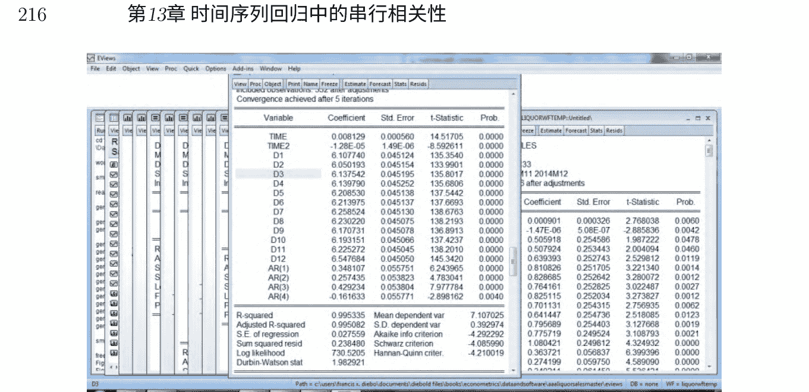

图13.1: ***. ***.

一个估计值并运行OLS回归：

$$
(y_t - \hat{\phi}y_{t-1}) \rightarrow (x_t' - \hat{\phi}x_{t-1}')
$$

+   如果需要，可以迭代：$\hat{\beta}_1, \hat{\phi}_1, \hat{\beta}_2, \hat{\phi}_2, ...$

## (2) 运行OLS回归

$$
y_t \rightarrow y_{t-1}, x_t, x_{t-1}
$$

受前面提到的约束（或不受约束）的限制

+   一般化为 $AR(p): y_t \rightarrow y_{t-1}, ..., y_{t-p}, x_t, x_{t-1}, ..., x_{t-p}$

（使用常规的 $AIC$、 $SIC$等选择A $IC$）

带 $AR(4)$扰动的趋势+季节模型

带 $AR(4)$扰动的趋势+季节模型

残差图

带 $AR(4)$扰动的趋势+季节模型

残差自相关图

## 13.2. 具有序列相关的估计

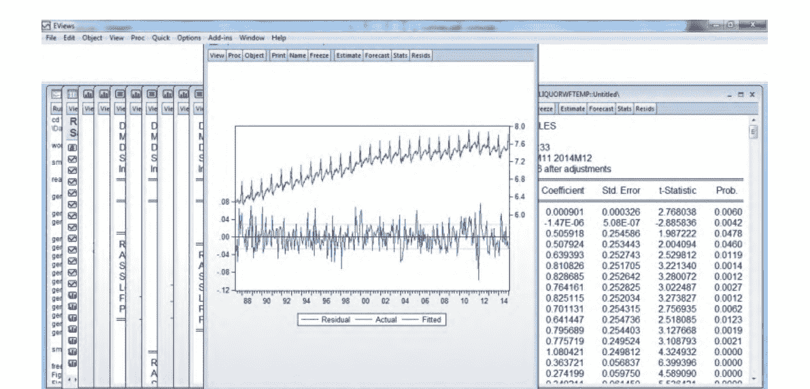

| Coefficient | Std. Error | t-Statistic | Prob. |
|-------------|------------|-------------|-------|
| 0.000901    | 0.000326   | 2.768038    | 0.0060 |
| -1.47E-06   | 5.08E-07   | -2.885836   | 0.0042 |
| 0.505918    | 0.254586   | 1.987222    | 0.0478 |
| 0.507924    | 0.253443   | 2.004094    | 0.0460 |
| 0.639393    | 0.252743   | 2.529812    | 0.0119 |
| 0.810826    | 0.251705   | 3.221340    | 0.0014 |
| 0.828685    | 0.252642   | 3.280072    | 0.0012 |
| 0.764161    | 0.252825   | 3.022487    | 0.0027 |
| 0.825115    | 0.252034   | 3.273827    | 0.0012 |
| 0.701131    | 0.254315   | 2.756935    | 0.0062 |
| 0.641447    | 0.254736   | 2.518085    | 0.0123 |
| 0.795689    | 0.254403   | 3.127668    | 0.0019 |
| 0.775719    | 0.249524   | 3.108793    | 0.0021 |
| 1.080421    | 0.249812   | 4.324932    | 0.0000 |
| 0.363721    | 0.056837   | 6.399396    | 0.0000 |
| 0.274199    | 0.059750   | 4.589090    | 0.0000 |

图13.2: ***. ***.

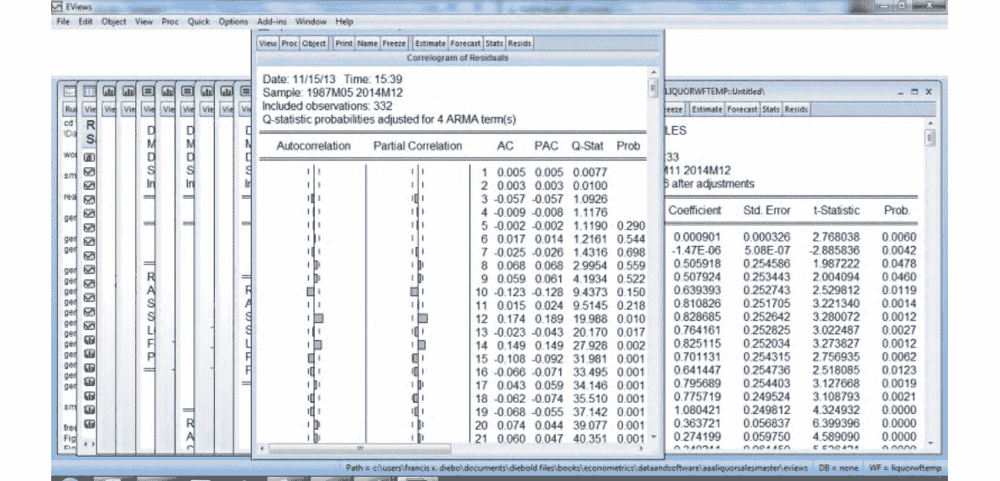

| Coefficient | Std. Error | t-Statistic | Prob. |
|-------------|------------|-------------|-------|
| 0.000901    | 0.000326   | 2.768038    | 0.0060 |
| -1.47E-06   | 5.08E-07   | -2.885836   | 0.0042 |
| 0.505918    | 0.254586   | 1.987222    | 0.0478 |
| 0.507924    | 0.253443   | 2.004094    | 0.0460 |
| 0.639393    | 0.252743   | 2.529812    | 0.0119 |
| 0.810826    | 0.251705   | 3.221340    | 0.0014 |
| 0.828685    | 0.252642   | 3.280072    | 0.0012 |
| 0.764161    | 0.252825   | 3.022487    | 0.0027 |
| 0.825115    | 0.252034   | 3.273827    | 0.0012 |
| 0.701131    | 0.254315   | 2.756935    | 0.0062 |
| 0.641447    | 0.254736   | 2.518085    | 0.0123 |
| 0.795689    | 0.254403   | 3.127668    | 0.0019 |
| 0.775719    | 0.249524   | 3.108793    | 0.0021 |
| 1.080421    | 0.249812   | 4.324932    | 0.0000 |
| 0.363721    | 0.056837   | 6.399396    | 0.0000 |
| 0.274199    | 0.059750   | 4.589090    | 0.0000 |

| Autocorrelation | Partial Correlation | AC    | PAC   | Q-Stat | Prob |
|-----------------|---------------------|-------|-------|--------|------|
| 1               | 0.005               | 0.005 | 0.005 | 0.0077 |      |
| 2               | 0.003               | 0.003 | 0.003 | 0.0100 |      |
| 3               | -0.057              | -0.057| -0.057| 1.0926 |      |
| 4               | -0.009              | -0.008| -0.008| 1.1176 | 0.290|
| 5               | -0.002              | -0.002| -0.002| 1.1190 | 0.952|
| 6               | 0.017               | 0.014 | 0.014 | 1.2161 | 0.976|
| 7               | -0.025              | -0.026| -0.026| 1.4316 | 0.985|
| 8               | 0.068               | 0.068 | 0.068 | 2.9954 | 0.937|
| 9               | 0.059               | 0.061 | 0.061 | 4.1934 | 0.898|
| 10              | -0.123              | -0.128| -0.128| 9.4373 | 0.398|
| 11              | 0.015               | 0.024 | 0.024 | 9.5145 | 0.485|
| 12              | 0.174               | 0.189 | 0.189 | 19.988 | 0.046|
| 13              | -0.023              | -0.043| -0.043| 20.170 | 0.064|
| 14              | 0.149               | 0.149 | 0.149 | 27.928 | 0.015|
| 15              | -0.108              | -0.092| -0.092| 31.981 | 0.007|
| 16              | -0.066              | -0.071| -0.071| 33.495 | 0.006|
| 17              | 0.043               | 0.059 | 0.059 | 34.146 | 0.007|
| 18              | -0.062              | -0.074| -0.074| 35.510 | 0.008|
| 19              | -0.068              | -0.055| -0.055| 37.142 | 0.007|
| 20              | 0.074               | 0.044 | 0.044 | 39.077 | 0.006|
| 21              | 0.060               | 0.047 | 0.047 | 40.351 | 0.005|

图13.3: ***. ***.

## 第13章 时间序列回归中的串行相关性

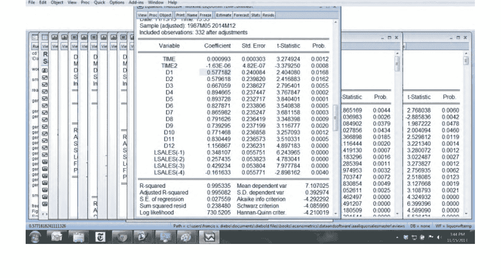

## 带有四个滞后因变量的趋势+季节模型

我们是如何得到 AR(4)动态的？

一切都指向那里：

+   通过原始趋势+季节残差自相关图支持

+   通过DW支持

+   通过BG支持

+   通过SIC支持模式：
    - AR(1) = -3.797
    - AR(2) = -3.941
    - AR(3) = -4.080
    - AR(4) = -4.086
    - AR(5) = -4.071
    - AR(6) = -4.058
    - AR(7) = -4.057
    - AR(8) = -4.040

异方差和自相关一致（HAC）标准误差## 13.2.3 酒类销售的完整模型

我们将对美国每月的酒类销售进行建模。我们在第***章中绘制了该系列的一个短期跨度，并注意到其明显的季节性——在圣诞季销售量激增。在图***中，我们展示了更长时间的酒类销售历史，1968.01-1993.12。在图***中，我们展示了对数酒类销售；我们取对数是为了稳定方差，因为随时间增长，对数酒类销售的方差更稳定，这是我们将建立模型的系列。酒类销售的动态也具有显著的趋势和周期性效应。

酒类销售呈上升趋势，尽管我们在对数中工作，但趋势似乎是非线性的。为了处理非线性趋势，我们采用了一个二次趋势模型（在对数中）。估计结果见表1。残差图（图***）显示拟合趋势以递减的速率增加；线性和二次项都非常显著。调整后的$R^2$为89%，反映了趋势在酒类销售变动中的重要性。回归的标准误差为0.125；这是一个估计值，表示如果考虑趋势但忽略季节性和序列相关性，在预测酒类销售时我们预计会犯的误差的标准差。Durbin-Watson统计量没有证据反对回归扰动是白噪声的假设。

然而，残差图显示明显的残差季节性。Durbin-Watson统计量错过了它，显然是因为它没有针对季节动态设计功效。残差图还表明残差中可能存在一个周期，尽管很难确定（对Durbin-Watson统计量也是如此），因为普遍的季节性淹没了图像，使得很难推断出任何东西。

残差自相关图（表2）及其图形（图***）证实了被忽视的季节性的重要性。残差样本自相关函数在季节性位移12、24和36处有很大的峰值，远远超过Bartlett带。它还表明一些周期性动态；除了季节性峰值外，残差样本自相关和部分自相关函数振荡，并且即使在非常小的非季节性位移下，Ljung-Box统计量也会拒绝白噪声零假设。

在表3中，我们展示了对二次趋势和完整的季节性虚拟变量进行回归的结果。二次趋势仍然高度显著。调整后的 $R^{2}$ 上升到99%，回归的标准误差下降到.046，这是我们在考虑趋势和季节性但忽略序列相关性时预计会产生的预测误差的标准偏差的估计。然而，Durbin-Watson统计量现在在残差季节性已经被考虑进去后更有能力检测序列相关性，并发出了响亮的警报。

图***的残差图显示没有季节性，因为模型已经捕捉到了，但它确认了Durbin-Watson的序列相关警告。残差高度持续存在，因此可预测。我们在表***和图***中以表格和图形形式展示了残差自相关图。残差样本自相关波动并且衰减缓慢，并且在整个过程中超过了Bartlett标准误差。Ljung-Box检验在所有位移上都强烈拒绝了白噪声假设。最后，残差样本偏自相关在位移3处截断。所有这些都表明，$AR(3)$ 模型将对扰动的Wold表示提供良好的近似。

因此，在表5中，我们报告了估计带有二次趋势、季节虚拟变量和 $AR(3)$ 扰动的酒类销售模型的结果。$R^{2}$ 现在为100%，Durbin-Watson也正常。估计的 $AR(3)$ 扰动过程的一个逆根是实数，接近单位圆(.95)，另外两个逆根是一个复共轭对，远离单位圆。这个回归的标准误差是对我们在建模残差序列相关后预期的预测误差的标准偏差的估计，正如我们现在所做的；也就是说，它是一个估计值。残差的标准差的估计值为0.05，非常小，大约是忽略序列相关性时的一半。

我们在图***中展示了残差图，并在表***和图***中展示了残差自相关图。残差图显示没有任何模式；相反，残差看起来像是白噪声，正如它们应该是的。残差样本自相关和偏自相关显示没有模式，并且大部分在Bartlett带内。Ljung-Box统计量在小和中等位移上看起来不错，尽管它们的p值在较长位移上递减。

综合考虑，二次趋势、季节虚拟变量和AR(3)模型似乎是合适的。我们还进行了一些额外的检查。在图***中，我们展示了对残差进行的直方图和正态性检验。直方图看起来是对称的，通过偏度接近零进行了确认。残差峰度略高于三，并导致Jarque-Bera检验以0.02的p值拒绝了正态性假设，但残差似乎仍然可以很好地近似为正态分布，即使它们可能有稍微更厚的尾部。

## 13.3 练习、问题和补充

- 1. （序列相关扰动与滞后依赖变量）估计具有季节性虚拟变量和直接包含三个滞后依赖变量的对数酒类销售的二次趋势模型。讨论你的结果并将其与我们在回归中允许AR(3)扰动时获得的结果进行比较。
- 2. （使用AIC和SIC进行酒类销售模型选择）使用AIC和SIC评估在酒类销售模型中包含趋势和季节性组成的必要性和可取性。
    - a. 显示各种趋势和季节性规格的AIC和SIC。你会选择使用AIC吗？SIC呢？AIC和SIC选择相同的模型吗？如果不是，你更喜欢哪个？
    - b. 讨论你偏好模型的估计结果和残差图，并对残差进行自相关分析。特别是讨论样本自相关和偏自相关的模式，以及它们的统计显著性。
    - c. 你的结果与文本中报告的结果有何不同（如果有的话）？这些差异重要吗？为什么或为什么不重要？
- 3. （模型残差的诊断检验）在存在滞后依赖变量的情况下，Durbin-Watson检验无效。Breusch-Godfrey检验仍然有效。
    - a. Durbin的h检验是Durbin-Watson检验的一种替代方法。与Durbin-Watson检验类似，它旨在检测一阶序列相关性，但在存在滞后依赖变量的情况下仍然有效。还要进行一些关于Durbin的h检验的背景阅读，并报告你学到了什么。
    - b. 你认为在评估时间序列模型残差的性质时，哪个更有用：残差相关图、Durbin's h检验还是Breusch-Godfrey检验？为什么？
- 4. （评估酒类销售模型趋势规范的充分性）批评我们采用的酒类销售模型（对数酒类销售与二次趋势、季节性虚拟变量和AR(3)扰动）。
    - a. 如果趋势不是对实际趋势的良好近似，会对短期预测产生很大影响吗？长期预测呢？
    - b. 拟合并评估具有对数线性趋势的模型的充分性。
    - c. 如何拟合并评估破碎线性趋势的充分性？如何确定断点的位置？
    - d. 回想一下我们的断言，最佳实践要求使用 $\chi^2_{m-k}$ 分布而不是 $\chi^2_m$ 分布来评估模型残差的$Q$统计量的显著性，其中 $m$是包含在Box-Pierce统计量中的自相关数目，$k$是估计的参数数目。在本章的几个地方，我们没有遵循这个建议来评估酒类销售模型。如果我们改为将残差的$Q$统计量的$p$值与 $\chi^2_{m-k}$ 分布进行比较，我们对模型的充分性评估会如何改变（如果有的话）？
    - e. 返回到具有季节性虚拟变量的对数二次趋势模型，允许考虑 $AR(p)$扰动，并使用 $AIC$和 $SIC$进行系统选择 $p$和 $q$。$AIC$和 $SIC$选择相同的模型吗？如果不是，你更喜欢哪个？如果你喜欢的模型与我们使用的 $AR(3)$ 不同，请使用你喜欢的模型复制文本中的分析，并讨论你的结果。

## 13.4 注释

回归模型具有序列相关扰动比其他类型的传递函数模型更具限制性的观点在计量经济学和工程学中有着悠久的历史，并在一篇题为“序列相关作为一种方便的简化而不是一种麻烦”的论文中得到了强调，该论文由Hendry和Mizon（1978）撰写。

# 第14章 时间序列中的异方差性

回想一下完全理想的条件。著名的Wald分解清楚地表明，每个协方差平稳序列都可以看作是由潜在的弱白噪声创新驱动的。因此，不足为奇的是，本书中讨论的每个模型都是由潜在的白噪声驱动的。举个简单的例子，如果序列 $y_t$ 遵循AR(1)过程，则 $y_t = \phi y_{t-1} + \varepsilon_t$，其中 $\varepsilon_t$ 是白噪声。在某些情况下， $\varepsilon_t$ 是弱白噪声还是强白噪声无关紧要，即 $\varepsilon_t$ 是否独立，而不仅仅是序列上无相关。因此，为了简化问题，我们有时假设强白噪声，即 $\varepsilon_t \sim iid(0, \sigma^2)$。在本书中，到目前为止，我们一直采取这种方法，有时是明确地，有时是隐含地。

当 $\varepsilon_t$ 是独立的时候，无条件的分布和条件分布之间没有区别，这是由于独立的定义。因此 $\sigma^2$ 既是无条件的方差，也是条件的方差。然而，Wald分解并不要求 $\varepsilon_t$ 是序列独立的，它只要求 $\varepsilon_t$ 是序列无相关的。

如果 $\varepsilon_t$ 是相关的，那么它的无条件和条件分布将不同。我们用 $\varepsilon_t \sim (0, \sigma^2)$ 表示无条件创新分布。我们特别关注以异方差性或时间变化波动性为特征的条件动态。因此，我们用条件分布表示
$$\varepsilon_t|\Omega_{t-1} \sim (0, \sigma_t^2)$$
其中 $\Omega_{t-1} = \{\varepsilon_{t-1}, \varepsilon_{t-2}, \ldots\}$，表示条件分布。条件方差 $\sigma_{t}^2$ 通常会随着 $\Omega_{t-1}$ 的变化而变化，这引起了对时间变化创新波动性的关注。

在某些经济和金融环境中，考虑到时变波动性是至关重要的。例如，金融资产回报的波动性通常是时变的。也就是说，市场有时是平静的，有时是动荡的，这可以通过查看图1中的股票市场回报时间序列来清楚地看到，我们将在后面详细讨论。时变波动性对于金融风险管理、资产配置和资产定价具有重要意义，因此已成为新兴领域金融计量经济学的核心部分。然而，除了金融应用之外，时变波动性还直接影响广泛应用中的区间和密度预测：在存在波动性波动的情况下，正确的置信区间和密度预测需要时变的置信区间宽度和时变的密度预测扩展。然而，迄今为止我们考虑的模型并不允许这种可能性。在本章中，我们将这样做。

## 14.1 基本的ARCH过程

考虑一般线性过程，
$$ y_t = B(L)\varepsilon_t $$
$$ B(L) = \sum_{i=0}^{\infty} b_i L^i $$
$$ \sum_{i=0}^{\infty} b_i^2 < \infty $$
$$ b_0 = 1 $$
$$ \varepsilon_t \sim WN(0, \sigma^2) $$
我们将处理这个过程的各种情况。

首先假设 $\varepsilon_t$是强白噪声，  $\varepsilon_t \sim iid(0, \sigma^2)$。 让我们回顾一下已经讨论过的一般线性过程的一些结果，这将在接下来的内容中证明有用。 $y$的无条件均值和方差是
$$ E(y_t) = 0 $$
和
$$ E(y_t^2) = \sigma^2 \sum_{i=0}^{\infty} b_i^2 $$
这两者都是时间不变的，这在协方差稳定性下必须是这样的。 然而，$y$的条件均值是时变的：
$$ E(y_t | \Omega_{t-1}) = \sum_{i=1}^{\infty} b_i \varepsilon_{t-i} $$
其中信息集为
$$ \Omega_{t-1} = \{\varepsilon_{t-1}, \varepsilon_{t-2}, ...\} $$
一般线性过程捕捉协方差稳定的条件均值动态的能力是其强大之处的来源。

因为许多经济时间序列的波动性是变化的，人们希望一般线性过程也能捕捉到条件方差动态，但目前的模型并不是这样的：$y$的条件方差是恒定的，为
$$ E\left( (y_t - E(y_t | \Omega_{t-1}))^2 | \Omega_{t-1} \right) = \sigma^2 $$
这种潜在的不幸限制在h步前条件预测误差方差的性质中表现出来。最小均方误差预测是条件均值，
$$ E(y_{t+h}|\Omega_t) = \sum_{i=0}^{\infty} b_{h+i} \varepsilon_{t-i} $$
因此相关的预测误差是
$$ y_{t+h} - E(y_{t+h}|\Omega_t) = \sum_{i=0}^{h-1} b_{i} \varepsilon_{t+h-i} $$
其条件预测误差方差为
$$ E\left( \left( y_{t+h} - E(y_{t+h}|\Omega_t) \right)^2 | \Omega_t \right) = \sigma^2 \sum_{i=0}^{h-1} b_i^2. $$
条件预测误差方差与无条件方差不同，但它不随时间变化：它仅取决于h，而不取决于条件信息Ω_t。 在当前规定的过程中，条件方差不允许适应可获得且可能有用的条件信息。

对于具有独立同分布创新的一般线性过程来说，这就是这么多了。 现在我们通过允许ε_t是弱白噪声而不是强白噪声来扩展它，具有特定的非线性依赖结构。 特别地，假设与之前一样，
$$ y_t = B(L)\varepsilon_t $$
$$ B(L) = \sum_{i=0}^{\infty} b_i L^i $$
$$ \sum_{i=0}^{\infty} b_i^2 < \infty $$
$$ b_0 = 1, $$
但现在还假设
$$ \varepsilon_t|\Omega_{t-1} \sim N(0, \sigma_t^2) $$
$$ \sigma_t^2 = \omega + \gamma(L)\varepsilon_t^2 $$
$$ \omega > 0 \quad \gamma(L) = \sum_{i=1}^{p} \gamma_i L^i \quad \gamma_i \ge 0 \quad \text{for all } i \quad \sum \gamma_i < 1. $$
注意，我们根据其条件密度来参数化创新过程，
$$ \varepsilon_t|\Omega_{t-1}, $$
我们假设其具有零条件均值和条件方差，该方差线性依赖于过去p个平方创新。 $\varepsilon_t$是序列不相关但不是序列独立的，因为当前条件方差$\sigma_t^2$取决于$\varepsilon_t$的历史。所述的正则性条件足以确保条件和无条件方差是正的和有限的，并且$y_t$是协方差平稳的。

无条件矩 $\varepsilon_t$是恒定的，并且由以下给出
$$ E(\varepsilon_t) = 0 $$
和
$$ E(\varepsilon_t - E(\varepsilon_t))^2 = \frac{\omega}{1 - \sum \gamma_i}. $$
重要的结果不是无条件均值和方差的具体公式，而是它们是固定的，符合协方差平稳性的要求。 至于 $\varepsilon_t$的条件矩，它的条件方差是时变的，
$$ E\left(\left(\varepsilon_t - E(\varepsilon_t | \Omega_{t-1})\right)^2 | \Omega_{t-1}\right) = \omega + \gamma(L)\varepsilon_t^2, $$
当然，它的条件均值是零，根据构造。将结果组合起来，转移到y的无条件和条件矩，而不是 $\varepsilon_t$，很容易看出y的无条件均值和方差都是常数（再次需要协方差平稳性），但是条件均值和方差都是随时间变化的：
$$ E(y_t | \Omega_{t-1}) = \sum_{i=1}^{\infty} b_i \varepsilon_{t-i} $$
$$ E\left(\left(y_t - E(y_t | \Omega_{t-1})\right)^2 | \Omega_{t-1}\right) = \omega + \gamma(L)\varepsilon_t^2. $$
因此，我们现在以对称的方式处理条件均值和方差动态，允许每个动态根据不断演变的信息集$\Omega_{t-1}$来移动。在上述发展中，$\varepsilon_t$被称为 ARCH(p)过程，而草图中的完整模型是具有ARCH(p)创新的无限阶移动平均模型，其中ARCH代表自回归条件异方差。显然，$\varepsilon_t$是有条件异方差的，因为它的条件方差波动。有许多条件异方差模型，但大多数是为横截面环境设计的，例如当横截面回归扰动的方差取决于一个或多个回归变量时。然而，在用于预测的时间序列环境中，异方差性通常也存在，特别是在金融市场中。与ARCH过程相关的特定条件方差函数
$$ \sigma_t^2 = \omega + \gamma(L)\varepsilon_t^2, $$
在时间序列环境中，往往会出现波动聚集，即大的变化往往会被大的变化所跟随，小的变化则会被小的变化所跟随，无论其符号如何。 也就是说，波动率动态中可能存在持续性或序列相关性，与条件均值动态中的持续性（或缺乏持续性）完全不同。 ARCH过程以自回归方式近似波动率动态，因此被称为自回归条件异方差。 要理解其中的原因，请注意ARCH条件方差函数将今天的条件方差与较早的滞后 ε_t^2 正相关，因此最近过去的大 ε_t^2 会导致今天的条件方差较大，从而增加今天出现大 ε_t^2 的可能性。 因此，ARCH过程对于条件方差动态与标准自回归过程对于条件均值动态的关系是一样的。 ARCH过程可以被视为更广泛模型中的扰动模型，就像我们在引入它时将其视为一般线性过程中创新的模型一样。 或者，如果没有感兴趣的条件均值动态，ARCH过程可以用于观察到的序列。 事实证明，金融资产收益往往没有显著的条件均值动态，但具有强烈的条件方差动态；因此，在接下来的大部分内容中，我们将将ARCH过程视为观察到的序列的模型，为了方便起见，有时我们将其称为“收益率”。

## 14.2 GARCH过程

到目前为止，我们使用ARCH(p)过程来建模条件方差动态。 现在我们引入GARCH(p,q)过程（GARCH代表广义ARCH），我们将几乎专门使用它。正如我们将看到的，GARCH对于ARCH（用于条件方差动态）就像ARMA对于AR（用于条件均值动态）一样。

纯GARCH(p,q)过程为⁴

$$y_t = \varepsilon_t$$

$$\varepsilon_t|\Omega_{t-1}\sim N(0, \sigma_t^{\wedge 2})$$

$$\sigma_t^2 = \omega + \alpha(L)\varepsilon_t^2 + \beta(L)\sigma_t^2$$

$$\alpha(L) = \sum_{i=1}^{p} \alpha_i L^i, \beta(L) = \sum_{i=1}^{q} \beta_i L^i$$

$$\omega > 0, \alpha_i \geq 0, \beta_i \geq 0, \sum \alpha_i + \sum \beta_i < 1.$$

所述条件确保条件方差为正且$y_t$是协方差平稳的。

反向代换在 $\sigma_t^2$ 揭示了GARCH(p,q)过程可以表示为受限制的无限阶ARCH过程，

$$\sigma_t^2 = \frac{\omega}{1 - \sum \beta_i} + \frac{\alpha(L)}{1 - \beta(L)}\varepsilon_t^2 = \frac{\omega}{1 - \sum \beta_i} + \sum_{i=1}^{\infty} \delta_i \varepsilon_{t-i}^2,$$

这与将ARMA过程写成受限制的无限阶AR非常相似。因此，GARCH(p, q)过程是对可能是无限阶ARCH波动性动态的简化近似。

需要注意GARCH(p,q)过程的一些特殊情况。 首先，当 $\beta(L) = 0$时，出现ARCH(p)过程。

其次，如果 $\alpha(L)$和 $\beta(L)$都为零，则该过程只是方差为 $\omega$的iid高斯噪声。 因此，尽管ARCH和GARCH过程可能一开始看起来陌生且可能是临时的，但实际上它们比标准的iid白噪声更加通用，后者可能会出现高度限制的特殊情况。

⁴通过“纯粹”我们指的是只允许条件方差动态，通过设置 $y_t = \varepsilon_{t\circ}$。当然，我们也可以引入条件均值动态，但这只会使讨论变得混乱，而没有增加任何新内容。

在这里，我们强调了GARCH过程的一些重要性质。当然，所有的讨论也适用于ARCH过程，它们是GARCH过程的特例。首先，考虑GARCH过程的二阶矩结构。纯GARCH过程的前两个无条件矩是恒定的，并且给出

$$E(\varepsilon_t) = 0$$

和

$$E(\varepsilon_t - E(\varepsilon_t))^2 = \frac{\omega}{1 - \sum \alpha_i - \sum \beta_i}$$

而条件矩是

$$E(\varepsilon_t|\Omega_{t-1}) = 0$$

当然

$$E\left[(\varepsilon_t - E(\varepsilon_t|\Omega_{t-1}))^2 \mid \Omega_{t-1}\right] = \omega + \alpha(L)\varepsilon_t^2 + \beta(L)\sigma_t^2$$

特别地，无条件方差是固定的，这在协方差平稳性下必须是这样的，而条件方差是时变的。条件方差是时变的并不令人惊讶 - GARCH过程当然是为了允许时变的条件方差而设计的 - 但这确实值得强调：条件方差本身是一个序列相关的时间序列过程。

其次，考虑GARCH过程的无条件高阶（三阶和四阶）矩结构。现实世界中的金融资产回报通常被建模为GARCH过程，它们通常是无条件对称但是尖峰厚尾（即，在中心更尖峰且尾部更厚重的分布）。事实证明，上述引入的条件高斯GARCH过程的隐含无条件分布也是对称且尖峰厚尾的。GARCH过程的无条件尖峰厚尾性质源于条件方差的持续性，这导致了与无条件分布的中心和尾部相关的“低波动率”和“高波动率”观测值的聚集。GARCH过程的无条件对称性和无条件尖峰厚尾性与各种金融市场数据非常吻合。第三，考虑GARCH过程的条件预测误差方差以及其对条件信息集的依赖性。由于GARCH过程的条件方差是一个序列相关的随机变量，因此研究最优的h步预测、预测误差和条件预测误差方差具有重要意义。

立即，h步预测是的条件预测误差方差。 ，而相应的预测误差是

$$\varepsilon_{t+h} - E(\varepsilon_{t+h}|\Omega_t) = \varepsilon_{t+h}$$

这意味着预测误差的条件方差，

$$E\left(\left(\varepsilon_{t+h} - E(\varepsilon_{t+h}|\Omega_t)\right)^2|\Omega_t\right) = E(\varepsilon_{t+h}^2|\Omega_t)$$

，取决于h和 $\Omega_t$，因为条件方差中存在动态。简单的计算揭示了GARCH(p, q)过程的表达式为

$$E(\varepsilon_{t+h}^{2}|\Omega_t) = \omega \left( \sum_{i=0}^{h-2} (\alpha(1) + \beta(1))^{i} \right) + (\alpha(1) + \beta(1))^{h-1} \sigma_{t+1}^{2}.$$

在极限情况下，这个条件方差会减少到过程的无条件方差

$$\lim_{h\to\infty} E(\varepsilon_{t+h}^{2}|\Omega_t) = \frac{\omega}{1 - \alpha(1) - \beta(1)}.$$

对于有限的h，预测误差方差对当前信息集Ω_t的依赖可以用来改进区间和密度预测。

第四，考虑ε²_t和σ²_t之间的关系。这个关系很重要：GARCH动力学在σ²_t中引入了ARMA动力学在ε²_t中。更准确地说，如果ε_t是一个GARCH(p,q)过程，那么 $\varepsilon_t^2$ 具有ARMA表示

$$\varepsilon_t^2 = \omega + (\alpha(L) + \beta(L))\varepsilon_t^2 - \beta(L)\nu_t + \nu_t,$$

其中

$$\nu_t = \varepsilon_t^2 - \sigma_t^2$$

是创新平方和条件方差之间的差异在时间t。要看到这一点，注意如果ε_t是GARCH(p,q)，那么

$$\sigma_t^2 = \omega + \alpha(L)\varepsilon_t^2 + \beta(L)\sigma_t^2.$$

加减 $\beta(L)\varepsilon_t^2$ 从右边得到

$$\sigma_t^2 = \omega + \alpha(L)\varepsilon_t^2 + \beta(L)\varepsilon_t^2 - \beta(L)\varepsilon_t^2 + \beta(L)\sigma_t^2$$
$$= \omega + (\alpha(L) + \beta(L))\varepsilon_t^2 - \beta(L)(\varepsilon_t^2 - \sigma_t^2).$$

添加 $\varepsilon_t^2$ 到每一边，然后得到

$$\sigma_t^2 + \varepsilon_t^2 = \omega + (\alpha(L) + \beta(L))\varepsilon_t^2 - \beta(L)(\varepsilon_t^2 - \sigma_t^2) + \varepsilon_t^2,$$

所以

$$\varepsilon_t^2 = \omega + (\alpha(L) + \beta(L))\varepsilon_t^2 - \beta(L)(\varepsilon_t^2 - \sigma_t^2) + (\varepsilon_t^2 - \sigma_t^2),$$
$$= \omega + (\alpha(L) + \beta(L))\varepsilon_t^2 - \beta(L)\nu_t + \nu_t.$$

因此， $\varepsilon_t^2$ 是一个ARMA((max(p,q)), p)过程，创新 $\nu_t$，其中 $\nu_t \in [-\sigma_t^2, \infty).$ 如果 $\alpha(L)+\beta(L)=1$的根在单位圆外，则$\varepsilon_t^2$是协方差平稳的。

第五，更深入地考虑 $\sigma_t^2$ 和 $\varepsilon_t^2$ 之间的相似性和差异。值得仔细研究关键表达式，

$$\nu_t = \varepsilon_t^2 - \sigma_t^2,$$

这清楚地表明 $\epsilon_t^2$ 实际上是 $\sigma_t^2$ 的“代理”，行为类似但并不完全相同，$\nu_t$ 是差异或误差。特别地， $\epsilon_t^2$ 是一个嘈杂的代理： $\epsilon_t^2$ 是 $\sigma_t^2$ 的无偏估计量，但更加波动。因此，合理地将嘈杂的代理 $\epsilon_t^2$ 和真实的基础 $\sigma_t^2$ 进行调和应该涉及对 $\epsilon_t^2$ 进行某种平滑处理。事实上，在GARCH(1,1)情况下， $\sigma_t^2$ 正是通过指数平滑 $\epsilon_t^2$ 获得的。为了理解原因，考虑指数平滑递归，它将当前平滑值作为当前未平滑值和滞后平滑值的凸组合给出。

$$\bar{\epsilon}_t^2 = \gamma \epsilon_t^2 + (1 - \gamma) \bar{\epsilon}_{t-1}^2$$

通过回代，可以得到当前平滑值的表达式，它是过去实际值的指数加权移动平均值:

$$\bar{\epsilon}_t^2 = \sum w_j \epsilon_{t-j}^2,$$

其中

$$w_j = \gamma (1 - \gamma)^j.$$

现在将这个结果与GARCH(1,1)模型进行比较，该模型将当前波动性表示为滞后波动性和滞后平方收益的线性组合， $\sigma_t^2 = \omega + \alpha \epsilon_{t-1}^2 + \beta \sigma_{t-1}^2$。

通过回代，可以得到 $\sigma_t^2 = \frac{\omega}{1-\beta} + \alpha \sum \beta^{j-1} \epsilon_{t-j}^2$，因此GARCH(1,1)过程将当前波动性表示为过去平方收益的指数加权移动平均值。

第六，考虑GARCH过程的时间聚合。通过时间聚合，我们指的是随着时间的推移进行的聚合，例如将一系列的日收益转换为周收益，然后转换为月收益，然后季度收益，依此类推。结果表明，在时间聚合下，正态性是现实世界金融资产回报的一个特征。也就是说，尽管高频（例如，每日）回报相对于正态分布具有厚尾性，但在时间聚合下，厚尾趋于变薄，逼近正态分布。在时间聚合下，收敛到正态分布也是协方差平稳GARCH过程的一个特性。关键的洞察是低频变化只是相应高频变化的总和；例如，年度变化是内部季度变化的总和，每个季度变化是其内部月度变化的总和，依此类推。因此，如果可以对GARCH过程的总和引用高斯中心极限定理，就可以确保在时间聚合下收敛到正态分布。如果过程是协方差平稳的，可以引用这样的定理。

在结束本节时，值得注意的是，GARCH过程的无条件分布的对称性和尾部厚尾性，以及在时间聚合下尾部厚尾性的消失，为GARCH近似资产回报波动性动态的准确性提供了良好的独立确认，因为GARCH当然不是为了解释金融资产回报数据的这些特征而发明的。相反，无条件分布结果是允许条件方差动态的意外副产品，从而提供了以前被认为无关的现象的统一解释。

## 14.3 ARCH和GARCH模型的扩展

基本GARCH模型有许多扩展。在本节中，我们重点介绍几个最重要的扩展。一类重要的扩展允许不对称响应；也就是说，它允许上一期的平方

### 14.3.1 非对称响应

允许非对称反应的最简单的GARCH模型是阈值GARCH或TGARCH模型。我们用 $\sigma_t^2 = \omega + \alpha \varepsilon_{t-1}^2 + \beta \sigma_{t-1}^2$ 来替换标准的GARCH条件方差函数。

$$D_t = \begin{cases} 1 & \text{如果 } \varepsilon_t < 0 \\ 0 & \text{否则} \end{cases}$$

虚拟变量D跟踪滞后回报是否为正或负。当滞后回报为正（昨天好消息），D=0，因此滞后平方回报对当前条件方差的影响仅为 α。相反，当滞后回报为负（昨天坏消息），D=1，因此滞后平方回报对当前条件方差的影响为 α+γ。如果 γ=0，反应是对称的，我们有一个标准的GARCH模型，但如果 γ≠0，我们对新闻的波动有非对称的反应。允许非对称反应已被证明对建模股票回报中的“杠杆效应”非常有用，当γ<0。非对称反应也可以通过指数GARCH（EGARCH）模型引入。

$$\ln(\sigma_t^2) = \omega + \alpha \left| \frac{\varepsilon_{t-1}}{\sigma_{t-1}} \right| + \gamma \frac{\varepsilon_{t-1}}{\sigma_{t-1}} + \beta \ln(\sigma_{t-1}^2)$$

请注意，波动性受冲击的大小和符号驱动；因此，模型允许根据新闻的符号而产生不对称的反应。

# 第14章 时间序列中的异方差性

对数规范还确保条件方差自动为正，因为 $\sigma_t^2$通过取$\ln(\sigma_t^2)$的指数得到；因此得名“指数GARCH”。

### 14.3.2 波动率函数中的外生变量

正如条件均值动态的ARMA模型可以增加外生变量的影响一样，条件方差动态的GARCH模型也可以增加外生变量的影响。我们只需以明显的方式修改标准GARCH波动率函数，写成

$\sigma_t^2 = \omega + \alpha \varepsilon_{t-1}^2 + \beta \sigma_{t-1}^2 + \gamma x_t,$

其中 $\gamma$是一个参数，$x$是一个正的外生变量。$^{10}$ 外生变量在条件方差函数中的允许有时是有用的。例如，金融市场交易量经常有助于解释市场波动性。

### 14.3.3 GARCH扰动和GARCH-M回归

正如ARMA模型可以被视为回归中的扰动模型，GARCH模型也可以。我们写成

$y_t = \beta_0 + \beta_1 x_t + \varepsilon_t$

$\varepsilon_t|\Omega_{t-1} \sim N(0, \sigma_t^{\wedge2})$

现在考虑一个具有通常类型的GARCH扰动的回归模型，有一个额外的变化：条件方差作为一个回归变量，从而影响条件均值。我们

$^{10}$扩展以允许多个外生变量是直接的。

$y_t = \beta_0 + \beta_1 x_t + \gamma \sigma_t^2 + \varepsilon_t$
$\varepsilon_t | \Omega_{t-1} \sim N(0, \sigma_t^{\land 2})$

这个模型是广义回归模型中带有GARCH扰动的特例，被称为GARCH-in-Mean(GARCH-M)。当风险（由条件方差测量）变化时，它在建模金融资产的风险和回报之间的关系时有时很有用。$^{11}$

### 14.3.4 成分GARCH

请注意，标准的GARCH(1,1)过程可以写成 $(\sigma_t^2 - \bar{\omega}) = \alpha(\varepsilon_{t-1}^2 - \bar{\omega}) + \beta(\sigma_{t-1}^2 - \bar{\omega})$ 其中 $\bar{\omega} = \frac{\omega}{1-\alpha-\beta}$ 是无条件方差。$^{12}$这正是之前介绍的GARCH(1,1)模型，以稍微不同但等价的形式重新表达。在这个模型中，短期波动性动态由参数$\alpha$和$\beta$控制，而没有长期波动性动态，因为$\bar{\omega}$是常数。

有时候我们可能希望除了已经包含的短期波动性动态之外，还能考虑长期和短期、或持久和短暂的波动性动态。为了实现这一点，我们用一个时变的过程来替代$\bar{\omega}$，得到 $(\sigma_t^2 - q_t) = \alpha(\varepsilon_{t-1}^2 - q_{t-1}) + \beta(\sigma_{t-1}^2 - q_{t-1})$，其中时变的长期波动性 $q_t$由 $q_t = \omega + \rho(q_{t-1} - \omega) + \phi(\varepsilon_{t-1}^2 - \sigma_{t-1}^2)$给出。

这个“组合GARCH”模型有效地将波动性动态分解为长期（持久性）和短期（瞬时性）成分，有时可以得出有用的见解。持久性动态由 $\rho$控制，瞬时性动态由 $\alpha$和 $\beta$控制。$^{13}$

$^{11}$我们还可以允许条件标准差而不是条件方差进入回归模型。

$^{12}$$\bar{\omega}$ 有时被称为“长期”方差，指的是无条件方差是条件方差的长期平均。

$^{13}$事实上，在适当的条件下，这里介绍的组合GARCH模型是协方差平稳的，并且等价于一个GARCH(2,2)过程，受到其参数的某些非线性限制。

### ### 14.3.5 混合和匹配

在结束本节时，我们注意到GARCH过程的不同变体和扩展当然可以混合使用。例如，考虑以下条件方差函数： $(\sigma_t^2 - q_t) = \alpha (\varepsilon_{t-1}^2 - q_{t-1}) + \gamma (\varepsilon_{t-1}^2 - q_{t-1}) D_{t-1} + \beta$ （这是一个组合GARCH规范，通过符号变量D允许波动性对新闻的非对称响应，以及来自外生变量x的影响。

## 14.4 估计、预测和诊断GARCH模型

回顾一下，似然函数是数据的联合密度函数，视为模型参数的函数，最大似然估计找到最大化似然函数的参数值。这是有道理的：我们选择那些最大化实际获得的数据的似然性的参数值。事实证明，对于GARCH模型，构建和评估似然函数很容易进行，最大似然估计已成为估计方法的首选。$^{14}$ GARCH最大似然估计没有闭式表达式，因此我们必须通过数值方法最大化似然函数。$^{15}$构建GARCH过程的最优预测很简单。实际上，我们之前推导出了关键公式，但没有详细评论。特别要记住的是

$$\sigma_{t+h,t}^2 = E\left[\varepsilon_{t+h}^2|\Omega_t\right] = \omega\left(\sum_{i=1}^{h-1}[\alpha(1)+\beta(1)]^i\right) + [\alpha(1)+\beta(1)]^{h-1}\sigma_{t+1}^2.$$

$^{14}$似然函数的精确形式很复杂，在这里我们不会给出明确的表达式，但是可以在本章末尾提到的各种调查中找到。

$^{15}$用于最大化GARCH似然函数的程序在许多现代软件包中都可以找到，例如Eviews。与任何数值优化一样，必须注意启动值和收敛准则，以确保收敛到全局最大值，而不仅仅是局部最大值。

简而言之，最佳的h步骤前瞻预测与最佳的1步骤前瞻预测成比例。此外，最佳的1步骤前瞻预测很容易计算：所有的 $\sigma_{t+1}^2$ 的决定因素都至少滞后一个周期，因此没有预测右侧变量的问题。实际上，底层的GARCH参数 $\alpha$ 和 $\beta$ 是未知的，因此必须进行估计，从而得到显然的方式形成的可行预测 $\sigma_{t+h,t}^2$。在金融应用中，波动率预测通常是直接关注的，而GARCH模型提供了最佳的h步骤前瞻点预测 $\sigma_{t+h,t}^2$ 或者，更一般地说，我们可能对波动性本身不感兴趣；相反，我们可能只是想使用GARCH波动率预测来改进 $\varepsilon_t$ 的h步骤前瞻区间或密度预测，这些预测严重依赖于h步骤前瞻预测误差方差。

$\sigma_{t+h,t}^2$. 例如，考虑区间预测的情况。在恒定波动性的情况下，我们之前使用了高斯95%的区间预测形式

```
y_{t+h,t} \pm 1.96\sigma_h
```

其中 $\sigma_h$ 表示无条件的h步骤前标准差（在没有波动性动态的情况下，也等于有条件的h步骤前标准差）。然而，现在在存在波动性动态的情况下，我们使用

```
y_{t+h,t} \pm 1.96\sigma_{t+h,t}
```

条件预测区间能够自适应波动性的变化是自然且可取的：当波动性较低时，区间自然更紧密，反之亦然。在存在波动性动态的情况下，无条件的区间预测平均上是正确的，但在任何给定时间可能是不正确的，而条件区间预测在任何时间都是正确的。

问题在于如何检测观察到的收益中的GARCH效应，以及相关的是如何评估拟合的GARCH模型的充分性。一个关键且简单的工具是平方收益的自相关图，$ε_t^2$。正如之前讨论的那样，$ε_t^2$是潜在条件方差的代理；如果条件方差显示持续性，$ε_t^2$也会如此。$^{16}$ 当然，我们也可以拟合一个GARCH模型，并以通常的方式评估GARCH系数的显著性。请注意，我们可以将收益的GARCH过程写为$ε_t = σ_t ν_t$，其中

```
ν_t \sim iidN(0,1), \quad σ_t^2 = ω + α ε_{t-1}^2 + β σ_{t-1}^2.
```

等价地，标准化的收益ν是独立同分布的，$ε_t$

```
\frac{ε_t}{σ_t} = ν_t \sim iidN(0,1).
```

这个观察结果提供了一种评估拟合的GARCH模型的充分性的方法：通过拟合的GARCH模型的条件标准差来标准化收益，$\hat{σ}_t$，并通过检查平方标准化收益的自相关图来检查拟合模型未能捕捉到的波动性动态，$(ε_t/\hat{σ}_t)^2$。这在实践中是常规操作。

## 14.5 股市波动性

我们对从***到***的每日收益的波动性进行建模和预测，不包括假日，总共有***个观测值。我们使用***个观测值进行估计，然后预测***个观测值。

在图***中，我们绘制了每日收益，$r_t$。收益中没有序列相关的视觉证据，但是收益的振幅存在序列相关的证据。也就是说，波动性呈现聚集现象：大的变动往往后面跟随着大的变动，小的变动后面跟随着小的变动，无论是正还是负。在图***中，我们展示了$r_t$的直方图和相关统计数据。平均每日收益略微为正。此外，收益大致对称（仅略微左偏），但是具有高峰度。

> $^{16}$但请注意，反之并不成立。也就是说，如果$ε_t^2$表现出持续性，不一定意味着条件方差也表现出持续性。特别是，忽视与条件均值动态相关的串行相关可能导致$ε_t$和$ε_t^2$中的串行相关。因此，在继续检查和解释$ε_t^2$的自相关图之前，重要的是适当地对任何条件均值效应进行建模，这种情况下$ε_t$应该被解释为适当条件均值模型中的扰动。

Jarque-Bera统计量表明正态性被明确拒绝。 在图中，我们展示了$r_t$的自相关图。 样本自相关很小，并且通常相对于Bartlett标准误差来说不显著，但是自相关函数显示出一些系统的周期性模式，并且 $Q$统计量（未显示），它累积了所有位移的信息，拒绝了弱白噪声的零假设。 尽管收益率中存在弱的串行相关性，但我们将继续假设收益率是弱白噪声，这在某种程度上是近似的，如果不是完全的情况。 在图中，我们绘制了$r_t^2$的图。 波动性聚集比在收益时间序列图中更加明显。 也许最有力的证据来自于$r_t^2$的自相关图，我们在图中展示了所有的样本自相关都是正的，远远大于收益本身，并且具有统计显著性。 作为对股市波动性建模的一个粗略的第一步，我们直接对$r_t^2$拟合了一个 $AR(5)$模型；结果显示在表中。 有趣的，即使在长期滞后，滞后平方收益的t统计量通常也是显著的，但是回归的$R^2$很低，反映了$r_t^2$是一个非常嘈杂的波动率代理。 作为对收益波动性建模的更复杂的第二步，我们对$r_t$拟合了一个 $ARCH(5)$模型；结果显示在表中。 滞后平方收益在长期滞后也显著。 然而，在图中显示的标准化残差的自相关图显示出一些剩余的系统行为，表明 $ARCH(5)$模型未能捕捉到所有的波动性动态，可能是因为需要更长的滞后期。 在表中，我们展示了拟合 $GARCH(1,1)$模型的结果。 所有的参数估计都具有高度统计显著性，“ARCH系数”（$\alpha$）和“GARCH系数”（$\beta$）之和接近于1（.987），其中 $\beta$明显大于 $\alpha$，这是常见的情况。

用于金融资产收益。我们在图中显示了平方标准化GARCH(1,1)残差的自相关图。所有样本自相关都很小，并且在Bartlett带内，并且它们显示出比平方标准化ARCH(5)残差更少的任何系统模式的证据。在图中，我们显示了由估计的GARCH(1,1)模型所暗示的条件标准差的时间序列。显然，波动性变化很大且高度持久。为了比较，我们在图中显示了使用标准平滑参数为.05计算的指数平滑的序列 $r_t^2$。显然，GARCH和指数平滑波动率估计的行为相似，尽管并不完全相同。差异反映了GARCH平滑参数是通过最大似然方法有效估计的，而指数平滑参数则是相当任意地设定的事实。现在，使用观测值***估计的模型，我们对***的样本外条件标准差进行预测。我们在图中显示了结果。预测期从一个波动性爆发之后开始，因此预测呼叫逐渐降低波动性并不令人意外。为了更好地理解，在图中我们展示了更长的历史和更长的预测。显然，根据之前讨论的公式，预测的条件标准差指数级地回归到无条件标准差（***）。

## 时间序列中的异方差性

-   关键事实1：股票回报大致上是序列无相关的
-   关键事实2：回报无条件地非高斯

### 无条件波动率测量

```
方差：σ² = E(r_t - μ)² (或标准差：σ)
```

平均绝对偏差：$MAD = E|r_t - \mu|$

四分位距：$IQR = 75\% - 25\%$

异常值概率：$P|r_t - \mu| > 5\sigma$ （例如）

尾指数：$\gamma \text{ s.t. } P(r_t > r) = k r^{-\gamma}$

峰度：$K = E(r-\mu)^4/\sigma^4$

$p\%$风险值 ($VaR^p$) : $x \text{ s.t. } P(r_t < x) = p$

关键事实3：回报有条件异方差性I

关键事实3：回报有条件异方差性II

### 背景：金融经济学的根本变化

### 当波动率是动态的时候

-   风险管理
-   投资组合配置
-   资产定价

套期保值

交易

### 资产定价I: 夏普比率

标准夏普比率:

```
\frac{E(r_{it} - r_{ft})}{\sigma}
```

条件夏普比率:

```
\frac{E(r_{it} - r_{ft})}{\sigma_t}
```

### 资产定价II: CAPM标准CAPM:

```
(r_{it} - r_{ft}) = \alpha + \beta (r_{mt} - r_{ft})
```

```
\beta = \frac{cov((r_{it} - r_{ft}), (r_{mt} - r_{ft}))}{var(r_{mt} - r_{ft})}
```

条件CAPM:

```
\beta_t = \frac{cov_t((r_{it} - r_{ft}), (r_{mt} - r_{ft}))}{var_t(r_{mt} - r_{ft})}
```

### 资产定价III: 派生品

布莱克-斯科尔斯:

```
C = N(d_1)S - N(d_2)Ke^{-r\tau}
```

```
d_1 = \frac{\ln(S/K) + (r + \sigma^2/2)\tau}{\sigma\sqrt{\tau}}
d_2 = \frac{\ln(S/K) + (r - \sigma^2/2)\tau}{\sigma\sqrt{\tau}}
```

$P_C = BS(\sigma, \dots)$

(标准布莱克-斯科尔斯期权定价)

当 $\sigma$ 变化时完全不同!

### 条件回报分布

$f(r_t)$ vs. $f(r_t|\Omega_{t-1})$

关键1: $E(r_t|\Omega_{t-1})$

收益是否有条件均值独立? 可以说是. 收益 (可以说) 大致上是序列无相关的, 而且 (可以说) 基本上没有额外的非线性条件均值依赖.

## 条件收益分布, 继续

关键2: $var(r_t|\Omega_{t-1}) = E((r_t - \mu)^2|\Omega_{t-1})$

收益是否有条件方差独立? 不可能!

平方收益序列相关, 通常衰减非常缓慢.

线性模型 (例如, $AR(1)$)

$r_t = \phi r_{t-1} + \varepsilon_t$

$\varepsilon_t \sim iid(0, \sigma^2), \quad |\phi| < 1$

无条件 均值: $E(r_t) = 0$ (常数)
无条件方差: $E(r_t^2) = \sigma^2/(1 - \phi^2)$ (常数)
条件均值: $E(r_t | \Omega_{t-1}) = \phi r_{t-1}$ (变化)

条件 方差: $E([r_t - E(r_t | \Omega_{t-1})]^2 | \Omega_{t-1}) = \sigma^2$ (常数)

-   条件均值适应，但条件方差不适应

### ARCH(1) 过程

```
r_t|\Omega_{t-1} \sim N(0, h_t)
```

```
h_t = \omega + \alpha r_{t-1}^2
```

```
E(r_t) = 0
```

```
E(r_t^2) = \frac{\omega}{(1 - \alpha)}
```

```
E(r_t|\Omega_{t-1}) = 0
```

```
E([r_t - E(r_t|\Omega_{t-1})]^2|\Omega_{t-1}) = \omega + \alpha r_{t-1}^2
```

### GARCH(1,1) 过程（"广义ARCH"）

0 < \alpha < 1, 0 < \beta < 1, \alpha + \beta < 1

### GARCH(1,1)和指数平滑

#### 指数平滑递归:

```
\hat{\sigma}_t^2 = \lambda \hat{\sigma}_{t-1}^2 + (1-\lambda) r_t^2
```

```
\Longrightarrow \hat{\sigma}_t^2 = (1-\lambda) \sum_j \lambda^j r_{t-j}^2
```

#### 但在GARCH(1,1)中我们有:

```
h_t = \omega + \alpha r_{t-1}^2 + \beta h_{t-1}
```

```
h_t = \frac{\omega}{1-\beta} + \alpha \sum \beta^{j-1} r_{t-j}^2
```

### 统一的理论框架

-   波动性动态（当然，通过构建）
-   波动性聚集产生无条件的尖峰厚尾
-   时间聚合减少了尖峰厚尾

### 可操作的经验框架

```
L(\theta; r_1, \dots, r_T) = f(r_T|\Omega_{T-1};\theta) f(r_{T-1}|\Omega_{T-2};\theta) \dots,
```

其中 $\theta = (\omega, \alpha, \beta)'$

如果条件密度是高斯的,

```
f(r_t|\Omega_{t-1};\theta) = \frac{1}{\sqrt{2\pi}} h_t(\theta)^{-1/2} \exp \left(-\frac{1}{2} \frac{r_t^2}{h_t(\theta)} \right),
```

所以 $\ln L = const - \frac{1}{2} \sum_{t} \ln h_{t}(\theta) - \frac{1}{2} \sum_{t} \frac{r_{t}^{2}}{h_{t}(\theta)}$

### GARCH主题的变化

-   方差方程中的解释变量：GARCH-X
-   尾部厚尾条件密度：t-GARCH
-   非对称响应和杠杆效应：T-GARCH
-   带有GARCH扰动的回归
-   时变风险溢价：GARCH-M

#### 方差方程中的解释变量：GARCH-X

\[ h_{t} = \omega + \alpha r_{t-1}^{2} + \beta h_{t-1} + \gamma z_{t} \]

其中 $z$是一个正的解释变量

#### 尾部厚尾条件密度：t-GARCH

如果 $r$是条件高斯分布，那么

\[ r_{t} = \sqrt{h_{t}} \ N(0, 1) \]

但是在高频数据中经常出现,

\[ \frac{r_{t}}{\sqrt{h_{t}}} \sim \text{尖峰厚尾} \]

所以取：

```
r_t = \sqrt{h_t} \frac{t_d}{std(t_d)}
```

并将 $d$视为另一个需要估计的参数

#### 非对称响应和杠杆效应：T-GARCH

标准GARCH模型：$h_t = \omega + \alpha r_{t-1}^2 + \beta h_{t-1}$

T-GARCH模型：$h_t = \omega + \alpha r_{t-1}^2 + \gamma r_{t-1}^2 D_{t-1} + \beta h_{t-1}$

```
D_t = \begin{cases} \text{如果 } r_t < 0, \text{则为1} \\ 0 \text{ otherwise} \end{cases}
```

正回报（好消息）：$\alpha$对波动率的影响

负回报（坏消息）：$\alpha + \gamma$对波动率的影响

$\gamma = 0$：非对称的消息反应

$\gamma > 0$：“杠杆效应”

### 使用GARCH扰动进行回归

```
y_t = x_t'\beta + \varepsilon_t
```

```
\varepsilon_t|\Omega_{t-1} \sim N(0, h_t)
```

### 时变风险溢价：GARCH-M

## 标准GARCH回归模型：

```
y_t = x_t'\beta + \varepsilon_t
```

$\varepsilon_t | \Omega_{t-1} \sim N(0, h_t)$

GARCH-M模型是一个特殊情况:

$y_t = x_t'\beta + \gamma h_t + \varepsilon_t$

$\varepsilon_t | \Omega_{t-1} \sim N(0, h_t)$

### 回到实证工作 - “标准”GARCH(1,1)

-   GARCH(1,1)
-   GARCH(1,1)
-   GARCH(1,1)
-   GARCH(1,1)

一个有用的规范诊断

$r_t | \Omega_{t-1} \sim N(0, h_t)$

$r_t = \sqrt{h_t} \varepsilon_t, \varepsilon_t \sim iidN(0,1)$

## 14.5. 股市波动性

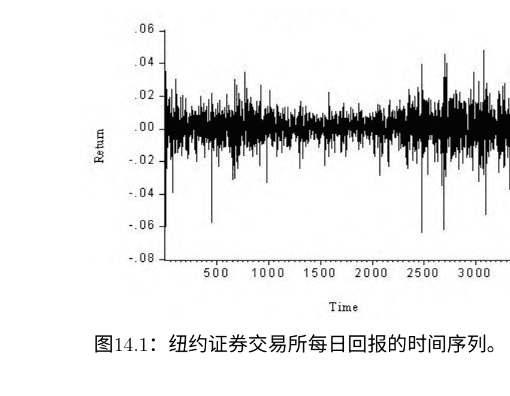

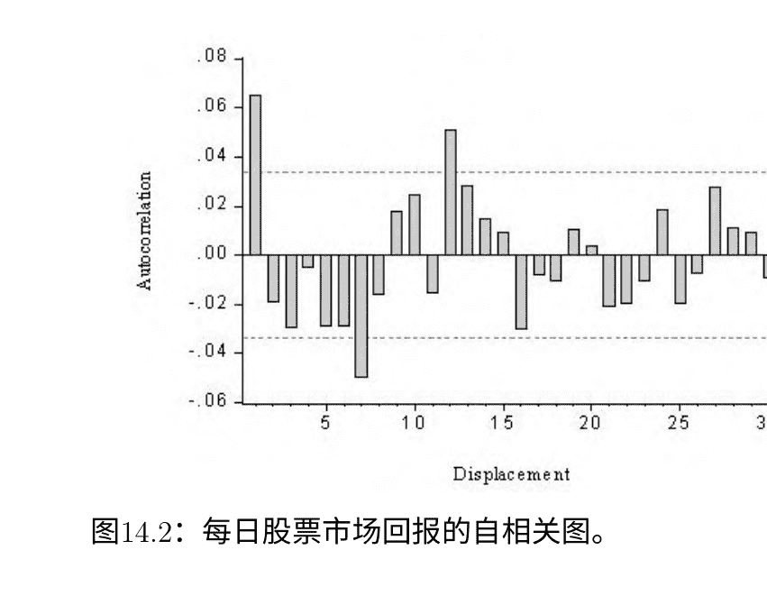

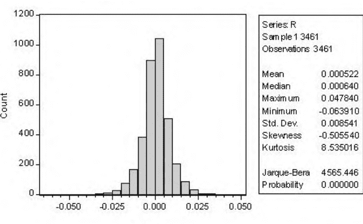

图14.4：纽约证券交易所每日平方收益时间序列

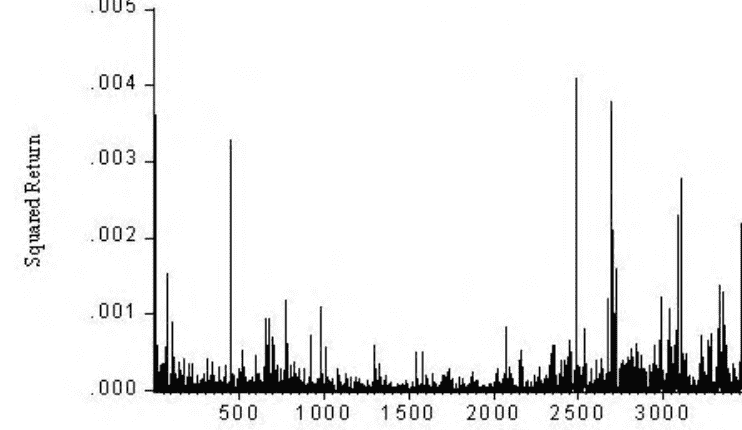

图14.5：纽约证券交易所每日平方收益自相关图。

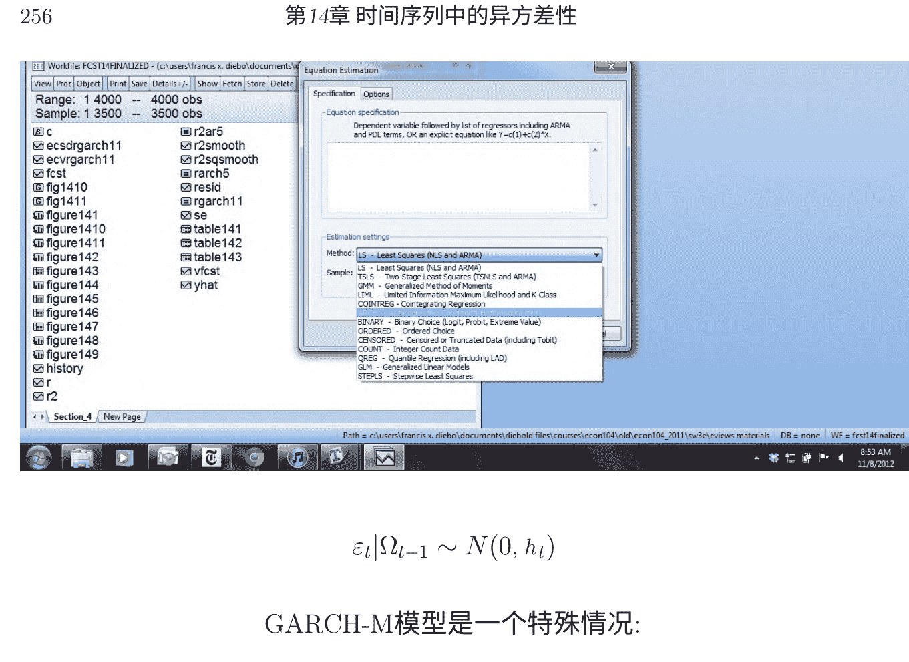

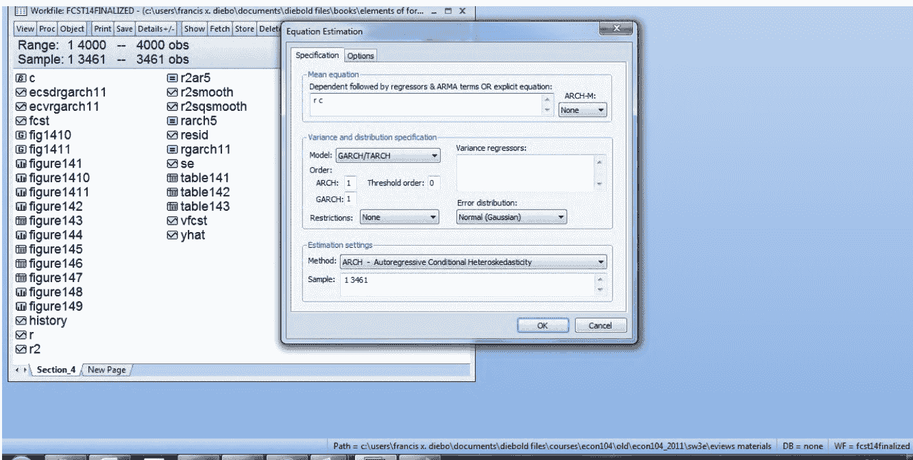

| Variable | Coefficient | Std. Error | z-Statistic | Prob. |
| :--- | :--- | :--- | :--- | :--- |
| C | 0.000641 | 0.000127 | 5.039437 | 0.0000 |
| Variance Equation | | | | |
| C | 1.06E-06 | 1.49E-07 | 7.127979 | 0.0000 |
| RESID(-1)^2 | 0.067408 | 0.004959 | 13.59218 | 0.0000 |
| GARCH(-1) | 0.919717 | 0.006128 | 150.0893 | 0.0000 |

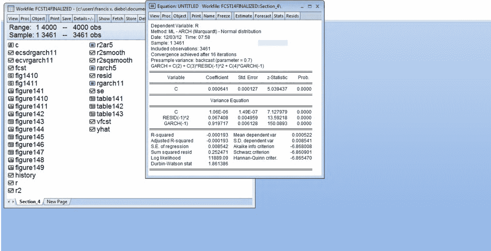

图14.6：GARCH(1,1)估计，每日纽约证券交易所收益率。

## 14.6 练习、问题和补充

$$\frac{r_t}{\sqrt{h_t}} = \varepsilon_t, \quad \varepsilon_t \sim iid N(0,1)$$

不可行：检查 $\varepsilon_t$。独立同分布？高斯分布？

可行：检查 $\hat{h}_t \hat{\varepsilon}_t$ 独立同分布？高斯分布？

与独立同分布的关键偏差是波动性动态。因此，检查平方标准化收益的自相关图，$\hat{\varepsilon}_t^2$

- GARCH(1,1)
- “花哨的” GARCH(1,1)
- “花哨的” GARCH(1,1)

1.  （图形回归诊断：时间序列图 $e_t^2$ 或 $|e_t|$） $e_t^2$ 或 $|e_t|$ 的图表显示了（尤其是串行相关）在残差的水平中存在非常量波动性或异方差性的模式。与标准残差图一样，平方或绝对残差图始终是简单的单变量图，即使有很多右侧变量。这样的图在跟踪和预测时变波动性中占据重要地位。

2.  （在建模波动性动态之前去除条件均值动态）

在文中的应用中，我们注意到纽约证券交易所的股票回报似乎具有一些弱的条件均值动态，但我们忽略了它们，直接对波动性进行建模。

a.  相反，首先使用SIC拟合自回归模型来指导阶数选择，然后对残差拟合GARCH模型。以这种方式重新进行文中的整个实证分析，并讨论结果中的任何重要差异。

b.  考虑改为同时估计AR(p)-GARCH模型的所有参数。也就是说，估计回归模型，其中自变量是滞后的因变量，扰动项

```

因变量: R
方法: ML - ARCH (Marquardt) - 学生t分布
日期: 04/10/12 时间: 13:48
样本 (调整后): 2 3461
调整后的观测数: 3460
经过19次迭代达到收敛
预样本方差: 回溯 (参数=0.7)
GARCH = C(4) + C(5)*RESID(-1)^2 + C(6)*RESID(-1)^2*(RESID(-1)<0) + C(7)*GARCH(-1)

```

| 变量 | 系数 | 标准误差 | z-统计量 | 概率 |
|------|------|----------|----------|------|
| @SQRT(GARCH) | 0.083360 | 0.053138 | 1.568753 | 0.1167 |
| C | 1.28E-05 | 0.000372 | 0.034443 | 0.9725 |
| R(-1) | 0.073763 | 0.017611 | 4.188535 | 0.0000 |
| 方差方程 |  |  |  |  |
| C | 1.03E-06 | 2.23E-07 | 4.628790 | 0.0000 |
| RESID(-1)^2 | 0.014945 | 0.009765 | 1.530473 | 0.1259 |
| RESID(-1)^2*(RESID(-1)<0) | 0.094014 | 0.014945 | 6.290700 | 0.0000 |
| GARCH(-1) | 0.922745 | 0.009129 | 101.0741 | 0.0000 |
| T分布. 自由度 | 5.531579 | 0.478432 | 11.56188 | 0.0000 |

显示GARCH. 重新进行文本中报告的整个实证分析，并讨论与文本和上述部分a中获得的结果相比的任何重要差异。

3.  （基本ARCH和GARCH模型的变体） 使用股票回报数据，考虑比纯ARCH和GARCH模型更丰富的模型，在文本中讨论。

    a. 估计、诊断和讨论阈值GARCH(1,1)模型。
    b. 估计、诊断和讨论EGARCH(1,1)模型。
    c. 估计、诊断和讨论分量GARCH(1,1)模型。
    d. 估计、诊断和讨论GARCH-M模型。

4.  （纯ARCH模型作为波动性动态的近似的实证表现）

    在这里，我们将对股票回报数据拟合纯ARCH(p)模型，包括p大于p=5的值，与拟合GARCH(p,q)模型的结果进行对比。

    a. 拟合纯ARCH(p)模型时，p的值似乎是适当的吗?
    b. 拟合GARCH(p,q)模型时，p和q的值似乎是适当的吗?
    c. 哪种方法看起来更简洁?

5.  （直接建模波动率代理）

    在文本中，我们直接对纽约证券交易所股票回报的平方子集进行AR(5)拟合。在这个练习中，使用整个纽约证券交易所数据集。

    a. 构建、展示并讨论AR(5)模型拟合的波动率序列。
    b. 构建、展示并讨论使用指数平滑法得到的另一种拟合波动率序列，使用平滑参数为0.10，对应较大的平滑量，但比文本中所做的要少。
    c. 构建、展示并讨论通过拟合适当的GARCH模型得到的波动率序列。
    d. 对比上述a、b和c部分的结果。
    e. 为什么从原则上讲，拟合GARCH模型比AR(5)或指数平滑方法更可取？

6.  （评估观察回报和标准化回报的波动性动态）

在文本中，我们概述了使用观测到的收益的平方的自相关图来检测GARCH模型，以及使用标准化收益的平方来诊断拟合的GARCH模型的适当性。检查Ljung-Box统计量是自相关图分析的重要部分。可以证明Ljung-Box统计量可以合法地用于平方观测到的收益，此时在零假设独立性下，它将服从常规的χ²分布。也可以使用Ljung-Box统计量对平方标准化收益进行分析，但在这种情况下，使用χ²_{m-k}分布更好地近似分布，其中k是估计的GARCH参数的数量，用于考虑模型拟合中使用的自由度。

7.  （考虑了偏峰条件密度）

到目前为止，我们只使用了条件高斯GARCH模型，这对应于ε_t=σ_t v_t ~ iid N(0,1)，或者等价地，标准化收益ε_t/σ_t服从正态分布。

a.  条件正态性假设有时可能被违反。然而，即使正态性假设不正确，GARCH参数仍然可以通过高斯最大似然估计一致地估计出来。为这个结果勾画一些直觉。

b.  对股票回报数据拟合一个适当的条件高斯GARCH模型。您如何使用标准化回报的直方图来评估条件正态性假设的有效性？请这样做并讨论您的结果。

c.  有时，条件高斯GARCH模型确实无法解释回报中的所有尖峰厚尾现象；也就是说，特别是在非常高频的数据中，我们有时发现条件密度是尖峰厚尾的。幸运的是，尖峰厚尾的条件密度可以很容易地纳入GARCH模型中。例如，在条件学生-t GARCH模型中，假设条件密度为学生-t分布，其中自由度d被视为另一个需要估计的参数。更准确地说，我们可以写成

```
$$v_t \sim iid \frac{t_d}{std(t_d)}.$$
$$\varepsilon_t = \sigma_t v_t$$
```

为什么要将学生t变量 \(t_d\) 除以它的标准差 \(std(t_d)\)？这样的模型如何估计？

8.  （多元GARCH模型）

在多元情况下，例如建模一组收益而不是单个收益时，我们需要建模的不仅是条件方差，还有条件协方差。

a.  在多元情况下，先前介绍的GARCH条件方差规范，例如对于第\(i\)个回报，仍然吸引人吗？为什么或为什么不是？
b.  考虑以下条件协方差的规范：σ_ij,t = ω + α ε_i,t-1 ε_j,t-1 + β σ_ij,t-1。它吸引人吗？为什么或为什么不是？
c.  考虑一个完全通用的多元波动模型，其中每个条件方差和协方差都可能依赖于每个条件方差和协方差的滞后，以及每个平方收益和收益的交叉乘积的滞后。这样的模型有哪些优点和缺点？对于建模五百个收益率来说，它是否有用？如果不是，你会如何继续？

## 14.7 笔记

# 第一部分

## 附录

## 附录A
# 工资数据集的构建

我们从更大的当前人口调查（CPS）数据集中随机抽样构建我们的数据集。1

我们使用国家经济研究局（NBER）的前端（http://www.nber.org/data/cps.html）和NBER的SAS、SPSS和Stata数据定义文件语句（http://www.nber.org/data/cps_progs.html）从1995年、2004年和2012年的三月CPS中提取数据。我们使用个人和家庭记录。在这里，我们重点讨论1995年。

有许多CPS观测数据中的收入数据完全缺失。我们删除这些观测数据，以及不符合符合CPS符合资格的收入项目（ERNEL=0）的观测数据，剩下14363个观测数据。从中，我们随机抽取一个无权重的子样本，选择概率为百分之十。这样得到了1348个观测数据。

我们使用了七个变量。从CPS中获取了AGE（年龄）、FEMALE（1代表女性，0代表其他）、NONWHITE（1代表非白人，0代表其他）和UNION（1代表工会成员，0代表其他）。我们还根据CPS变量PEEDUCA（教育程度）创建了EDUC（受教育年限）。由于CPS不询问工作经验年限，我们创建了EXPER（潜在工作经验）等于年龄减去教育年限再减去6。

1请参阅http://aspe.hhs.gov/hsp/06/catalog-ai-an-na/cps.htm，了解CPS数据集的简要和清晰介绍。

## 附录A. 工资数据集的构建

我们按照以下方式构建变量WAGE。对于按小时支付工资的人，WAGE等于PRERNHLY（每小时收入）的美元金额。对于不按小时支付工资的人（PRERNHLY=0），我们使用PRERNWA（上周总收入）除以PEHRUSL1（每周通常工作小时数）。这有时会产生缺失值，我们将其视为缺失收入并从样本中删除。

最终数据集包含1323个观测值，包括AGE，FEMALE，NON-WHITE，UNION，EDUC，EXPER和WAGE。

## CPS个人数据选择标准

| 变量 | 姓名（95） | 姓名（04,12） | 选择标准 |
|---|---|---|---|
| 年龄 | PEAGE | A_AGE | 18-65 |
| 劳动力状况 | ALFSR | | 1工作（排除武装部队） |
| 工作类别 | ACLSWKR | | 1,2,3,4（排除自雇和无偿工作） |

## 变量列表

| 变量 | 描述 |
|------|------|
| PEAGE（年龄） | 年龄 |
| A_LFSR | 劳动力状况 |
| A_CLSWKR | 工作类别 |
| PEEDUCA（教育程度） | 教育程度 |
| PERACE（种族） | 种族 |
| PESEX（性别） | 性别 |
| PEERNLAB（工作状态） | 工会 |
| PRERNWA（每周工资） | 每周通常收入 |
| PEHRUSL1（每周工作小时数） | 每周通常工作小时数 |
| PEHRACTT（上周工作小时数） | 上周工作小时数 |
| PRERNHLY（每小时工资） | 每小时收入 |
| 年龄 | 等于PEAGE |
| 女性 | 如果PESEX=2，则等于1，否则为0 |
| 非白人 | 如果PERACE=1，则等于0，否则为0 |
| 工会 | 如果PEERNLAB=1，则等于1，否则为0 |
| 教育 | 指的是表格 |
| 经验 | 等于年龄-教育-6 |
| 工资 | 等于PRERNHLY或PRERNWA/ PEHRUSL1 |
| 注意： | 括号中的变量名称适用于2004和2012年。 |

## EDUC的定义

| 教育 | PEEDUCA (A_HGA) | 描述 |
| --- | --- | --- |
| 0 | 31 | 低于一年级 |
| 1 | 32 | 一、二、三或四年级 |
| 5 | 33 | 五或六年级 |
| 7 | 34 | 七或八年级 |
| 9 | 35 | 九年级 |
| 10 | 36 | 十年级 |
| 11 | 37 | 十一年级 |
| 12 | 38 | 十二年级无学位 |
| 12 | 39 | 高中毕业 |
| 12 | 40 | 有一些大学但没有学位 |
| 14 | 41 | 副学士学位-职业/职业 |
| 14 | 42 | 副学士学位-学术项目 |
| 16 | 43 | 学士学位 (B.A., A.B., B.S.) |
| 18 | 44 | 硕士学位 (M.A., M.S., M.Eng., M.Ed., M.S.W., M.B.A.) |
| 20 | 45 | 专业学位 (M.D., D.D.S., D.V.M., L.L.B., J.D.) |
| 20 | 46 | 博士学位 (Ph.D., Ed.D.) |

## # 附录A. 工资数据集的构建

## 附录B
## 一些值得遇到的流行书籍

我在其他地方引用了这些书籍，通常是在各种章节末尾的补充中。在这里我将它们集体列出。

> Lewis (2003) [迈克尔·刘易斯,金球]. “外表可能欺骗，但数字不会，所以要注意数字。”

> Gladwell (2000) [马尔科姆·格拉德威尔,引爆点]. “非线性现象无处不在。”格拉德威尔拼凑出了一个解答，解释了为什么某些事物“起飞”而其他事物却停滞不前（产品、时尚、流行病等）。更一般地，他深入洞察了非线性环境，在某些条件下，输入的微小变化可能导致输出的微小变化，在其他条件下，可能导致输出的巨大变化。

> Taleb (2007) [纳西姆·尼古拉斯·塔勒布,黑天鹅] “关于非正态性和其他问题的警告，以及更多的警告。”

> Angrist and Pischke (2009) [约书亚·安格里斯特和约恩-斯特芬·皮斯克,基本无害的计量经济学]. “自然和准自然实验提示工具变量。”这是一个有趣而深入的工具变量和相关主题的处理方法。只是不要被这本书试图占领领土的企图所愚弄，正如2015年的《毫不犹豫》一文中所讨论的那样。

> Silver (2012) [Nate Silver，信号与噪声]. “预测建模中的陷阱和机遇。”

# 参考文献

Anderson, D.R., D.J. Sweeney, and T.A. Williams (2008),商业和经济统计, South-Western.

Angrist, J.D. and J.-S. Pischke (2009), 基本无害的计量经济学, 普林斯顿大学出版社.

Gladwell, M. (2000),触动点, Little, Brown and Company.
Harvey, A.C. (1991), 预测、结构时间序列模型和卡尔曼滤波器, 剑桥大学出版社.

Jarque, C.M.和A.K. Bera (1987), “一种用于观测值和回归残差正态性检验的方法”, 国际统计评论, 55, 163–172.

Koenker, R. (2005),分位数回归, 经济计量学会专著系列, 剑桥大学出版社, 2005.

Lewis, M. (2003), 金钱球, 诺顿.

Nerlove, M., D.M. Grether, 和J.L. Carvalho (1979),经济时间序列分析: 一种综合. 纽约: 学术出版社. 第二版.
Silver, N.. (2012),信号与噪声, 企鹅出版社.
Taleb, N.N. (2007),黑天鹅, 随机之家.

Tufte, E.R. (1983),定量信息的视觉展示, 切斯特: 图形出版社.

> Wonnacott, T.H.和R.J. Wonnacott（1990年），《入门统计学》。纽约：John Wiley和Sons，第五版。

# 索引

- F分布，34
- F统计量，54
- R平方，55
- s平方，55
- t分布，34
- t统计量，51
- χ² 分布，34
- 拟合值，44
- 假日变动，77
- 季节性虚拟变量，75
- 调整的 R平方，56
- 赤池信息准则，56
- 类比原则，161
- 方差分析，80
- AR(p)过程，171
- ARCH(p)过程，289
- 纵横比，19
- 非对称响应，295
- 不对称性，31
- 渐近，35
- 自相关函数，156
- 自协方差函数，154
- 自回归，156
- 自回归（AR）模型，166
- 银行业务到45度，19
- 二进制数据，5
- 二项式logit，336
- Box-Cox变换，109
- Box-Pierce Q统计量，163
- Breusch-Godfrey检验，178
- 日历效应，76
- 中心趋势，30
- 图表杂乱无章，19
- 协整，280
- 常见刻度，19
- 条件分布，32
- 条件期望，47
- 条件均值，32
- 条件均值和方差，160
- 条件均值函数，97
- 条件矩，32
- 条件方差，32
- 常数项，51
- 连续数据，5
- 连续随机变量，30
- 相关性，32
- 自相关图，162
- 自相关图分析，164
- 协方差, 31
- 协方差平稳, 154
- 交叉相关函数, 242
- 横截面数据, 5
- 横截面, 6
- 交叉变量动态, 235
- CUSUM, 137
- CUSUM图, 137
- 周期, 153
- 数据挖掘, 57
- 数据生成过程 (DGP), 48
- 去趋势, 81
- 确定性季节性, 74
- 确定性趋势, 72, 249
- Dickey-Fuller分布, 255
- 离散概率分布, 29
- 离散随机变量, 29
- 离散度, 30
- 分布滞后, 165
- 分布滞后模型, 222
- 具有滞后依赖变量的分布滞后回归模型, 233
- 具有AR扰动的分布滞后回归模型, 233
- 扰动, 47
- 虚拟左手变量, 331
- 虚拟右手变量, 331
- 虚拟变量, 69
- Durbin's h检验, 191
- Durbin-Watson统计量, 57
- 计量经济建模, 3
- 误差修正, 28
- 估计器, 33
- 后期平滑, 119
- 期望值, 30
- 探索性数据分析, 23
- 指数GARCH, 296
- 指数平滑, 261
- 指数趋势, 115
- 指数加权移动平均, 261
- 反馈, 243
- 金融计量经济学, 286
- 一阶串行相关, 178
- 傅里叶级数展开, 123
- 函数形式, 107
- GARCH(p,q)过程, 290
- 高斯分布, 31
- 高斯白噪声, 158
- 广义线性模型, 109, 337
- GLM, 109, 337
- 黄金比例, 23
- 拟合优度, 56
- 异方差性, 285
- 直方图, 15
- 霍德里克-普雷斯科特滤波, 119
- 霍尔特-温特斯平滑, 263## 索引

### 位置
- 带有季节性的霍尔特-温特斯平滑，264
- 冲击响应函数，238
- 样本内过拟合，57
- 独立白噪声，158
- 指示变量，69, 331
- 创新异常值，190
- 工具变量，349
- 积分，248
- 交互效应，111, 122
- 截距，72
- 截距虚拟变量，70
- 区间数据，9
- 本质上非线性模型，110
- Jarque-Bera检验，100
- 联合分布，31
- 峰度，31
- 滞后算子，165
- 最小绝对偏差，103
- 最小二乘法，41
- 尖峰度，31
- 似然函数，53
- 有限依赖变量，331
- 线性概率模型，332
- 线性投影，97, 343
- 线性趋势，72
- 链接函数，109, 338
- Ljung-Box Q统计量，163

- 位置，30
- 对数线性回归，108, 109
- 对数线性趋势，115
- 对数-对数回归，107
- 逻辑函数，332
- 逻辑模型，110
- 逻辑趋势，130
- Logit模型，332
- 边际分布，31
- 马尔可夫转换模型，140
- 最大似然估计，53
- 均值，30
- 测量异常值，190
- 模型选择，319
- 矩，30, 160
- 多项式logit，338
- 多重比较，18
- 多元线性回归，44
- 多元，13
- 多元GARCH，317
- 多元散点图，16
- 神经网络，126
- 名义数据，9
- 非线性最小二乘法（NLS），110
- 非线性，97
- 非正态性，97
- 正态分布，31
- 正态白噪声，158
- 赔率，336
- 离线平滑，119
- 在线平滑，119
- 单边移动平均，119
- 单边加权移动平均，119
- 有序logit，334
- 有序结果，333
- 序数数据，9
- 异常值，97
- 面板数据，5
- 面板，6
- 参数不稳定性，136
- 参数，47
- 偏自相关函数，156
- 偏相关，21
- 多项式分布滞后，222
- 滞后算子的多项式，165
- 多项式趋势，117
- 总体，32
- 总体模型，47
- 总体回归，156
- 正序列相关，57
- 预测因果关系，237
- 概率(F统计量)，54
- 概率密度函数，30
- 概率值，52
- Probit模型，337
- 比例几率，334
- QQ图，99
- 二次趋势，117
- 随机数生成器，189
- 随机游走，137, 248
- 带漂移的随机游走，249
- 比率数据，9
- 实时平滑，119
- 实现，154
- 递归残差，136
- 制度转换，139
- 回归函数，47
- 回归截距，47
- 回归季节性哑变量，75
- 回归斜率系数，47
- 关系图形，15
- RESET检验，112
- 残差图，59
- 残差散点图，58
- 残差，44
- 鲁棒性迭代，151
- 样本，32
- 样本自相关函数，162
- 样本相关性，34
- 样本协方差，34
- 样本峰度，33
- 样本均值，33, 162
- 因变量的样本均值，53
- 样本偏自相关，164
- 样本路径，154
- 样本偏度，33
- 样本标准差，33
- 因变量的样本标准差，53
- 样本统计量，33
- 样本方差，33
- 尺度，30
- 散点图矩阵，16
- 施瓦茨信息准则，57
- 季节调整，81
- 季节性，72, 74
- 二阶平稳性，155
- 串联相关，57
- 串联无相关，158
- 简单相关，21
- 简单指数平滑，261
- 简单随机抽样，34
- 模拟时间序列过程，189
- 单指数平滑，261
- 偏度，31
- 斜率，72
- 斜率虚拟变量，78
- 平滑，118
- 虚假回归，282
- 标准差，30
- 回归的标准误差，55
- 标准误差，51
- 标准化递归残差，137
- 统计学，33
- 随机过程，166
- 随机季节性，74
- 随机趋势，72, 249
- 强白噪声，158
- 学生-t GARCH，317
- 残差平方和，53
- 超一致性，253
- 泰勒级数展开，121
- 阈值GARCH，295
- 阈值模型，139
- 时间虚拟变量，72
- 时间序列，6, 154
- 时间序列数据，5
- 时间序列交叉，5
- 时间序列图，13
- 时间序列过程，157
- 时变波动性，285
- Tobit模型，338
- 交易日变动，77
- 趋势，72
- 双边移动平均，119
- 无条件均值和方差，160
- 单位自回归根，247
- 单位根，247
- 单变量，13
- 方差，30
- p阶向量自回归，235

### 波动聚类
- 波动聚类，289
- 波动动力学，289
- 弱平稳性，155
- 弱白噪声，158
- 白噪声，158
- Yule-Walker方程，169
- 零均值白噪声，158